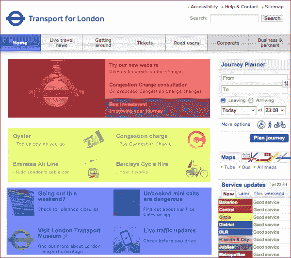

# 三、创建一个扁平且可用的界面

本章将介绍平面设计中的 web 可用性，以及这对每个网站的功能和平面设计中 web 应用的设计有多重要，因为这种风格的外观简单，可能会产生一些可用性问题。我们将通过理解什么是 web 可用性，学习如何在设计 web 表单时考虑可用性，学习设计师需要注意哪些元素和哪些内容，从而成功创建可用的界面来解决这一问题。

# 了解网络可用性

Jakob Nielsen，一位网站可用性顾问和可用性专家，在网站[中定义了可用性 http://www.nngroup.com/articles/usability-101-introduction-to-usability/](http://www.nngroup.com/articles/usability-101-introduction-to-usability/) ，具体如下：

> *“可用性是一种质量属性，用于评估用户界面的易用性。可用性一词也指在设计过程中提高易用性的方法。”*

在这种情况下，web 可用性与网站的良好功能以及用户对其的易用性和可预测性有关。作为设计师和开发人员，我们假设对于大多数人来说，使用一个网站是很容易的，而且是一种已经被认为是自然的技能，但这不是你应该做的假设。相反，在设计网站或界面时，必须假设用户没有使用它们的经验。界面的设计必须使其直观且易于使用，即使对于初次使用的用户也是如此。

所有元件必须具有视觉识别性。链接、表单、文本字段和按钮等元素必须易于区分。例如，一个链接在历史上被表示为在 HTML 的第一个版本中由一个文本块中带蓝色下划线的单词定义的链接，但情况并非总是如此，这主要是由于 web 设计师创建的自定义和颜色方案。这意味着，即使不使用超链接的标准符号，用户也应该有一种简单的方法来识别文本块中的该元素。它必须是自然的，用户必须自己理解，无需任何解释。通常，这是通过在单词中保留下划线并将颜色更改为与文本颜色形成对比的颜色来实现的。下划线可替换为粗体文本效果，以澄清该特定单词与常规阅读文本不同。

翻转效果也非常重要。将鼠标光标悬停在单词上时，用户检测到单词中存在差异；有时，下划线消失，或者单词出现粗体效果。但是，无论选择的效果或样式如何，链接都会发生视觉变化。这一变化让用户感觉到，这个特定的元素对交互做出响应，被认为是一个重要的元素，它的功能将不仅仅是简单的文本，就像超链接一样，它将用户带到不同的页面。

这是用户在访问网页时所经历的一种想法，这是网页设计中可用性工作原理的一个例子。在讨论 web 或移动应用时，可用性更为重要，因为在这种情况下，必须存在一个特定的用户旅程，以允许用户完成某些任务。这是因为该应用是一个具有特定目标的工具。但是，在网站中，内容的访问取决于访问者的兴趣和他们自己的目标。

不幸的是，可用性的重要性常常被忽视，但它应该始终是您在每个 web 设计项目中工作的一部分。考虑到平面的外观，它尤其重要，但为什么可用性很重要呢？

## 网络可用性的重要性

可用性之所以重要，有几个原因。第一个也是最重要的原因是，可用性保证你的网站*正常运行*。

当创建任何给定的项目时，总会有一个目标。通常，目标是通过显示图像和文本内容通知访问者，但也可以是销售产品或服务，甚至在 web 应用中直接提供服务。无论目标是什么，总有一个。可用性是你和设计师确保一切正常运行的工具，这样你就能实现目标。通过确保用户了解网站导航或通过按下按钮来澄清操作，您可以让用户更容易、更可能地遵循预期的用户旅程。

如果你正在经营一个商业网站，这一点尤其重要，因为它将直接影响你的收入，并可能是一个成功或失败的在线业务之间的差异。在一个案例中，一个网站仅仅通过改变一个简单的按钮（[一年就额外赚了 3 亿美元 http://www.uie.com/articles/three_hund_million_button/](http://www.uie.com/articles/three_hund_million_button/) 。这无疑是可用性的一大理由。

在设计网站时，考虑可用性往往是留住和流失访问者的区别。如果用户不了解网站，或者无法轻松找到他们想要的内容，挫折感就会袭来，用户就会离开，去别处寻找那部分内容。当你在一个令人困惑的网站上寻找难以找到的东西时，你可能知道这种感觉。试着想象你的用户在使用网站时会怎么想，并确保避免可能出现的所有挫折。

如果您觉得您已经有了基本的可用性问题，并且仍然相信您可以改进您的工作，那么您可能需要开始测试。了解网站失败的最佳工具之一是用户测试，也就是说，和用户坐下来，和他或她一起浏览网站，从他或她的反馈中学习。

测试网站有很多不同的方法，如果你有兴趣了解更多关于网站可用性的知识，我绝对推荐雅各布·尼尔森的书，*设计网站可用性*，可在亚马逊网站[上找到 http://www.amazon.co.uk/Designing-Web-Usability-Practice-Simplicity/dp/156205810X](http://www.amazon.co.uk/Designing-Web-Usability-Practice-Simplicity/dp/156205810X) 。

## 达到良好的平衡

好了，现在我们讨论了什么是网络可用性，你知道它会对网站访问者造成多大的影响，我希望你退后一步，放松，不要惊慌。你可能已经通过使用常识避免了大多数更大的可用性问题，就像任何为特定设计做出决策的设计师应该做的那样。我们不想让一个网站如此清晰、万无一失，以至于缺乏风格和色彩。毕竟，创新来自大胆尝试不同的事物。

这就是说，你的最终目标是在一个真正好看的网站和一个功能强大的网站之间实现一个良好的平衡。大多数时候，可用性只是关于组织和常识，这是一种工作方式，而不是应用的技术。一开始更具创新性的界面将更难使用，但设计师可以选择冒这个风险来获得不同的体验。然而，如果你想安全起见，试着把重点放在已知和熟悉的布局类型和简单的设计上。

有时，可用性改进是通过对网站的设计进行非常小和简单的调整来实现的。

有几位设计师提议对知名网站进行重新设计，他们中的大多数人都专注于通过重组、简化甚至重新设计元素来简化当前的布局。元素的重组和简化是一个很好的练习，因为它可以让您了解哪些元素在设计中真正重要，哪些仅仅是装饰性的。

瑞典机构佩戴 1910（[http://weare1910.com/](http://weare1910.com/) 为维基百科创建了一个重新设计方案（[http://en.wikipedia.org](http://en.wikipedia.org) ），他们重新设计网站，在简化设计的同时更加关注内容。这是通过将文本和行距放大，提高文章的可读性，同时通过删除左侧的菜单来简化布局来实现的。这创建了一个更简单但可识别的维基百科网站。以下截图（[http://blog.weare1910.com/post/75576312730/a-readable-wikipedia](http://blog.weare1910.com/post/75576312730/a-readable-wikipedia) 显示了维基百科（顶部）及其重新设计（底部）。

维基百科（顶部）和重新设计（底部）。可在 http://blog.weare1910.com

因此，为了清楚地了解这一点，让我们做一个简化设计的小练习。我选择了*伦敦交通*网站的主页，因为它是一个较旧的网站，它的设计仍然非常笨重，看起来非常凌乱。这绝不是一个严肃的重新设计，只是一种学习如何在设计上进行一些简化来创建更轻、更可读的页面的方法。

首先，让我们获得我们可以工作的原始网站。您可以打开随本书提供的`tfl-redesign.psd`文件并进行操作。

### 提示

**下载示例代码**

您可以下载从您的帐户购买的所有 Packt 书籍的示例代码文件，网址为 http://www.packtpub.com. 如果您在其他地方购买了本书，您可以访问[http://www.packtpub.com/support](http://www.packtpub.com/support) 并注册，将文件直接通过电子邮件发送给您。

打开文件后，让我们确定要处理哪些块。只关注内容部分，忽略右侧的栏。我们将把网站分为三个主要部分：主要亮点部分，中间部分介绍牡蛎费用和巴克莱信息，最后一部分介绍其他新闻和重要信息。这些是我们将重新设计的部分。以下屏幕截图显示了左侧的旧 TFL 网站（www.TFL.gov.uk）和右侧标识的主要内容部分：

TFL 网站[www.TFL.gov.uk](http://www.tfl.gov.uk)（左）和确定的主要内容部分（右）

随着部分的确定和突出显示，让我们开始用我们的内容替换它。对于第一部分，创建类似的标题和正文，并覆盖当前设计，以便我们可以在同一元素中对齐内容。

所以，重写第一节的标题。您可以使用 Lato 字体来执行此操作。将文本的大小设置为 13 磅，标题的权重设置为黑色，以将它们与描述文本区分开来。前两个块被禁用，因此让我们将文本的颜色设置为灰色（`#979797`。这将显示一个褪色的黑色，并在视觉上提示这些块被禁用，与启用和激活的块形成对比。由于我们正在删除蓝色背景，因此无法将文本保持为白色。因此，将活动行标题设置为蓝色；只需选择背景颜色并将底线设置为黑色。

现在您已经了解了第一部分的内容。只需选择图像并将其删除，然后将该部分涂成白色以匹配背景。为了改进这些部分内容线之间的划分，让我们创建一些划分线。在文本之间创建两行 1 px 的权重，并将其设置为灰色（`#dcdcdc`。这将有助于直观地定义块，同时保持它们非常简单和轻，如以下屏幕截图所示：

继续到下一节，让我们做同样的事情，并通过叠加替换文本。复制同一文本的颜色并忽略绿色三角形。将文本与块的左侧对齐，并删除之前存在的图像和文本。以下屏幕截图显示了完成所有这些操作后页面的外观：

对最后一部分做同样的操作，将标题与图像顶部对齐，并保持相同的颜色。最终结果将类似于以下屏幕截图：

现在我们已经简化了所有部分，我们已经可以看出页面看起来更轻更干净。然而，如果没有行和框，内容看起来就不那么拥挤了。因此，我们需要在块之间留出更大的间距，使它们在视觉上分开。只要把第二部分和第三部分的一些像素拉下来，就足以给人不同部分的感觉。简化 TFL 网站的结果将类似于以下屏幕截图：

通过这些简单的改变，你可以看到有明显的改善。事实上，改变不仅仅是从布局中删除背景图像和非重要图像，内容定义块而不是框和线。这导致创建了更多的空白，并使网站更轻。这在以下屏幕截图中很明显：

# 网页表单可用性

正如我们前面所说的，可用性在平面设计中非常重要。这种风格在可用性方面受到更多影响的元素通常是**web 表单**。通常很容易匹配控件（如按钮和文本字段）以匹配展开样式，因此它们会丢失使其可识别的效果和功能。文本字段通常由一个带有细微内部阴影的矩形框表示，以显示其所需的内容。这种阴影在平面设计中经常丢失，为了避免这种情况，我们需要确保一个窗体可以识别为一个窗体。有几种方法可以做到这一点。做到这一点的最好方法是把手放在它上面，所以让我们做一个关于 web 表单可用性的简单练习。

接下来，我们将为网站创建一个简单的注册表单。为此，我们将使用本书附带的资源包中提供的`ele_winvista_firefox_all.psd`文件。也可通过[在线获取 http://designerstoolbox.com/designresources/elements/vista/firefox/](http://designerstoolbox.com/designresources/elements/vista/firefox/) 。

该文件是一个浏览器表单模板，包含在 Firefox 中创建基本 HTML 表单时可以找到的元素。那么，让我们开始吧。

## 创建具有常规浏览器样式的 web 表单

让我们执行以下步骤来创建一个 web 表单：

1.  在 Photoshop 中创建一个大小为 350 x 350 px 的新文件。我们将在此文件中创建表单。
2.  使用文本`Name`创建一个文本字段。此字段将用作其余字段的标题模板。您可以将字体定义为 Arial，并将大小设置为 14 磅。
3.  Now that you have the title, copy the **Input Field** folder from your template file into your new document. Align them side by side with the title on the left-hand side and the text field on the right-hand side, as shown in the following screenshot:

    

4.  我们需要组织我们的文件，并将标题和字段保存在一个文件夹中，该文件夹的名称与字段对应。复制`name`文件夹并将其更改为`Age`。
5.  现在，让我们创建一个`Gender`字段。为此，我们将使用下拉列表的模板，并为其分配自己的标题。
6.  假设我们正在为博客创建一个表单，所以我们需要一个帐户类型选择器。然后，我们将创建一个名为`Account`的字段，其中包含单选按钮。复制`Selected Radio Button`和`Unselected Radio Button`文件夹，并将文本分别更改为`Author`和`Reviewer`。这是博客将拥有的两种不同的帐户状态，具有不同的权限。
7.  要完成此操作，请将`Button`文件夹复制到您的文件中，并将其向右对齐。
8.  Our standard form is completed! This is how a simple HTML form would look in a Firefox browser, and this is one of the standard looks. You should end up with a design like the following screenshot:

    

就这样，很简单吧？然而，这是一个相当标准的“不刺激”的外观。那么，接下来让我们尝试一些平面设计风格。

## 以平面风格再现形式

现在我们有了我们的基本形式，我们需要重新创建元素以匹配平面设计外观。为此，让我们使用前面使用的字体 Lato，并使用以下步骤重新创建表单：

1.  复制我们创建的文件并将其命名为`flat-form.psd`。我们将使用我们先前创建的文件作为基础来创建这个新的表单。
2.  将标题的字体更改为 Lato，并将其大小设置为 15 磅。
3.  对于文本字段，创建一个 190 像素宽、35 像素高的白色矩形。这将是我们新的平面文本字段。
4.  向该矩形添加一个混合选项，如“笔划”。笔划的大小应为 1 px，并位于矩形内。我们不希望边界变得非常坚固；我们希望它比文本更微妙、更轻。那么，让我们将其颜色定义为`#aeaeae`。这种浅灰色将在白色和黑色文本之上发挥巨大作用。
5.  Now, let's just create our filler text like we had earlier and change its size to 13 pt; we just made our first flat form element. It should look like the following screenshot:

    

6.  复制新字段以将其用于`Age`和`Gender`。在`Gender`上，我们可以使用相同的矩形，但我们将添加一个小三角形，表示它是一个下拉列表。要创建此三角形，我们将使用多边形工具（U）并创建一个具有三条边的形状。将三角形设置为黑色或与边框相同的灰色（`#aeaeae`，并创建下拉按钮。
7.  这是个人的选择，取决于你的品味。要在按钮上创建更大的焦点，我们可以使用按钮的反转选项，使三角形变为白色，并创建一个与矩形边框颜色相同的矩形。为此，复制我们用于文本字段的矩形，并将其宽度更改为 35 px。删除定义笔划的图层样式，因为这里不需要它，并将此矩形的颜色定义为`#aeaeae`。这将在字段上创建对比度，并进一步将其与正在使用的其他字段区分开来。
8.  For the account form, we'll recreate the circular element with the Ellipse Tool. Create a 16 x 16 px white circle with the same stroke. Align it with the other fields. This will be our radio button. Duplicate this layer and shrink it to 9 x 9 px; delete the stroke and define the main color as `#aeaeae`. This will be our selection. For the option text, let's use the same text field and just shift it to the right, so we can have the radio button on the left-hand side. Now, we just duplicate this line, pull it down, delete the selected layer, and we have the unselected radio button. It should look like the following screenshot:

    

9.  现在，我们只是缺少按钮。为此，我们将使用与字段相同的矩形，删除笔划，将背景设置为`#aeaeae`，并将其宽度更改为 105 px。我们可以使用文本颜色设置为白色的`title`文本字段来创建标签。

所以现在，我们的外形与之前的完全相同，但它是以平面设计风格重新设计的。正如你所见，这是由非常简单和基本的元素，看起来比原来的版本更简约。我们只使用黑色、灰色和白色。但是，在处理具有更多颜色的网站时，您可以选择在矩形笔划和背景上使用主品牌颜色，使其与创建的设计更加一致。以下屏幕截图显示了默认样式表单（左侧）和平面样式表单（右侧）：

## 优化表单的可用性

正如您所注意到的，我们的新表单在定位和元素工作方式方面与默认版本相似，但我们仍然可以改进其可用性，以确保用户拥有最佳体验。现在，让我们做以下几个小的调整，这将大大改进表单：

1.  首先，让我们更改字段内的文本。当前，此文本设置为黑色，显示为**输入文本**。此文本称为占位符文本，应用于向用户指示网站期望的内容类型。您可以在此处使用操作或内容示例向用户显示他或她应该输入的内容。让我们将文本更改为`Enter your name`，因为这将帮助用户填写此字段。但是，黑色是我们为内容保留的颜色，因此为了使它看起来更离散，更不像内容，我们将文本设置为灰色`(#aeaeae`。这样，用户就有了一个可视提示，但没有黑色文本，字段看起来仍然是空的，可以让用户填充。
2.  对**年龄**字段执行相同操作，但使用`Enter your age`文本。
3.  将**性别**中的文本更改为`Select your gender`，从而对选择框进行引用。
4.  最后，将按钮的文本更改为表单的操作。在本例中，由于这是一个注册表，请将文本更改为 register。这个小改动将向用户定义表单的主要操作，确保用户了解他或她在网站上执行的操作。按钮中也可以使用颜色来指示某些操作。例如，**删除账户**按钮将提供红色背景的好处，以指示永久和极端的操作，例如删除账户。

这些更改非常简单，但在优化和改进此表单的可用性方面非常有效。这些是在设计表单以确保性能和易用性时应该关注的一些方面。您的屏幕应类似于以下屏幕截图所示：

# 平面可读性

平面设计通常采用大的无衬线字体，用于信息和标题。与照片和平面颜色相比，这些文字看起来很棒，但与所有人一样，你必须始终确保你的字体可读。在平面的情况下，你不应该使用阴影或渐变，你必须特别注意可读性。为此，请始终注意在文本和背景之间实现最佳对比度。

让我们通过以下步骤进行快速练习，尝试实现良好可读性的最佳方法：

1.  在 Photoshop 上创建一个新文档，我们将在其中尝试颜色。我们只想在块的顶部覆盖文本，所以创建一个大小为 160 x 175 px 的小矩形。将此形状的颜色设置为黑色，并在其内部以白色创建文本字段。这种对比，黑上加白，非常可读。当然，与每本书和每一份报纸一样，可读性的最佳对比是白上加黑。我们刚刚创建了这种对比的反面，它也非常容易阅读，并且与标题配合得很好。我不建议你在黑色文本的基础上阅读白色文本，因为这对眼睛来说非常累人。
2.  让我们现在尝试[中的一种单色 http://flatuicolors.com/](http://flatuicolors.com/) ，我们前面提到过，并将形状的颜色定义为`#4d9ad7`。这种颜色看起来真的很棒，因为它的微妙和充满活力的同时，白色文本读起来非常好，白色与这种生动的蓝色形成了很好的对比。
3.  使用`#65c378`、`#9166b2`和`#374a5d`颜色重复上述步骤。所有这些都会在白色中读得很好，因为它们是生动的深色。
4.  Now change one of the words in the text to black. You will notice that even though the text is still readable, the contrast doesn't feel quite right. Black is a color that is only very readable on top of very light colors, and in this case, it just loses a bit of the sharpness that white offers us. We're not able to see it clearly in the following screenshot, but you can test this yourself by following this exercise and checking the examples that are given with this book:

    

5.  现在让我们试试不同的重量。在彩色瓷砖中，用三行书写`Flat Design Rules`。将`Flat`的重量改为轻，`Design`的重量改为普通，`Rules`的重量改为黑色。这样，我们可以看到字体在不同重量下的外观。灯光看起来真的很棒，创造了一个更简约、更明亮的外观，而黑色通过创造一个更大、视觉上更大的文本块创造了更大的对比度。这对于标题和创建更具影响力的消息传递选项非常有用。使用浅色字体时要特别小心，因为它们有时会因为太薄而缺乏可读性。然而，像往常一样，我们应该像现在这样测试浅色字体。
6.  With colored text, it's easier to have contrast problems. Try text with green (`#65c378`) on top of a blue block (`#4d9ad7`) and the inverse of it. This combination has poor readability, and you should avoid it. There are some complementary colors that you can use. These are colors that are opposite to one another in the color wheel and have a greater contrast. If you're looking at using colored text on top of a colored background, make sure they have a good contrast to ensure readability. Your screen should now look similar to what is shown in the following screenshot:

    

7.  When using an image background, you have to be especially careful with the placement of your text, as images have different shapes and colors. Ideally, you'll want to position your text on top of the image with a flat color.

    

这些是与平面设计文本可读性相关的主要问题，您可能会遇到这些问题，这些是一些很好的测试，您可以使用您的网站调色板和字体进行测试。请记住，每种类型都有特定的高度和形状，在选择要使用的权重时必须小心。尝试一下，寻找灵感；当你在网站上看到它的应用时，你就会知道你找到了完美的字体。

# 总结

在本章中，我们介绍了 web 可用性的基本定义，以及确保您创建出色且功能强大的界面的重要性，特别是在平面设计中。我们看到了如何通过一些小的改变来实现可用性，记住重点应该是让界面对用户来说尽可能简单。我们还讨论了 web 表单中的 web 可用性，这是在平面中通常存在更多可用性问题的元素之一，以及如何避免这些问题以及如何将表单转换为平面样式。我们还学习了平面类型，并学习了如何在几种情况下测试可读性。