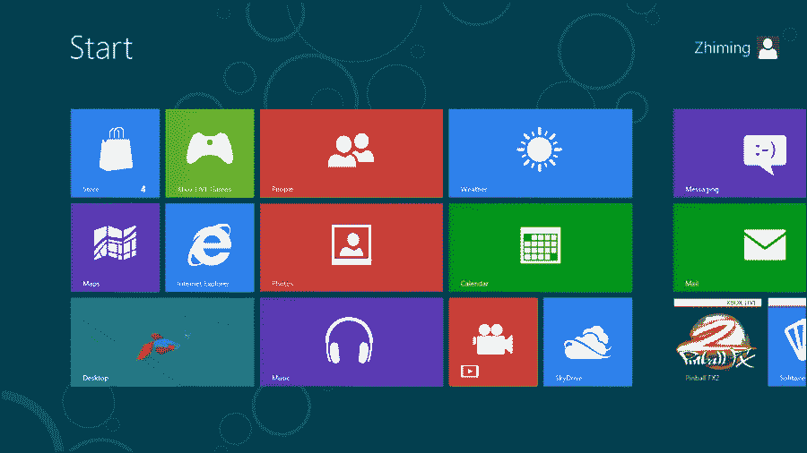
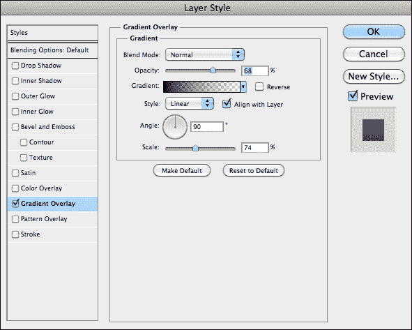
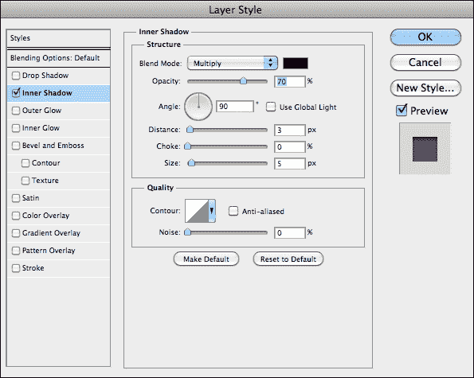
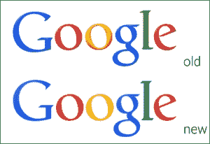
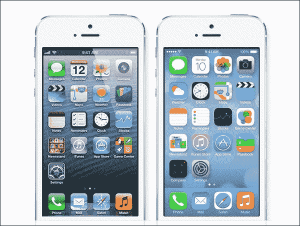

# 第一章：什么是扁平设计？

在本章中，将解释什么是扁平设计以及这种风格是如何产生的。我们将涵盖自 1950 年以来平面设计在平面设计中的前身，然后讨论拟物化设计在使扁平设计成为数字设计中最大趋势之一的过程中的重要性。

我们还将了解扁平设计的当前状态，它是如何被一些最大的品牌所采用的，以及我们如何每天与扁平设计的界面进行交互。还有一个简单的练习，帮助您了解如何构建拟物元素及其扁平对应物，以更好地澄清拟物和扁平设计之间的区别。

# 定义扁平设计

扁平设计是数字设计风格之一，是 2013 年最受讨论的趋势之一。它的特点是非常极简的外观，专注于从设计中去除所有额外的元素和效果，如斜角、阴影、光效、深度、纹理以及赋予这些元素额外维度的每个元素。

这种处理方式导致了在屏幕上创建一种非常简单和清晰的外观，通过使用白色空间、明亮的颜色和简单的线条作为布局元素。扁平设计作为一种风格，因其有影响力的外观但令人惊讶的简单方法，迅速崛起并被广泛使用。它开始聚集了一大批风格的粉丝和支持者，因为大多数人在扁平设计中看到了一个机会，让他们能够创建一个简单而漂亮的网页。

它无疑是 2013 年设计中最受讨论的话题之一，有很多支持者，也有很多反对这种风格以及对其重要性和讨论的人。

此外，扁平设计之所以在社区中产生如此大的影响，其中一个最重要的原因是它的时机。扁平设计出现在拟物化设计是数字设计和界面中最著名和使用的风格之一的时候。它们以一种显著的方式形成对比，对于这些应用程序的用户以及需要改变他们的设计风格以满足用户的愿望和期望的设计师来说，这确实是一个非常艰难和极端的转变。那么，什么是拟物化设计呢？

# 历史和演变

扁平设计作为数字设计趋势和名称在 2012 年左右出现在网络上。作为对拟物化设计的回应和替代，首批采用者引起了很多关注，因为相对于当时创建的复杂和沉重的设计，走上创建如此简单和清晰布局的道路被认为是一种风险。这种趋势的转变是历史上一直发生的事情。时尚和风格是循环的，而在这个数字化的时代，这些循环往往更短，变化可能比以往更快。

要真正找到扁平设计的最初起源，我们需要回到 1950 年，当时国际印刷风格（或瑞士风格）的发展。这种风格也专注于创造清晰、可读的设计，与当时印刷海报中使用的复杂插图、纹理和照片形成对比。这也是 Akzidenz-Grotesk 开始更频繁地使用的时候，这是最终成为 Helvetica 的字体的第一个版本，这给无衬线字体排版带来了新的力量和重点。无衬线字体是瑞士风格海报的重点之一，特别是大号无衬线字体，从而传达出非常有影响力的信息。我们可以说这在历史上是扁平设计的第一种形式。

几十年后，在数字领域，微软是推动这种极简外观前进的责任人之一，2006 年推出了 Zune 音乐播放器。尽管设备本身并不是商业上的成功，但其界面是革命性的。对于细长和大字体的重视，以及对导航和图标的清晰和极简处理，是今天微软界面重新设计的根源之一，这种风格仍然可以在 Windows Phone 上强调的字体菜单中找到。Zune 还影响了其他产品，如 Xbox 360 仪表板和 Windows 8。Windows 8 界面，也被称为**Metro UI**，也是强调扁平设计风格的最大界面改革之一。这是对微软 Windows 外观的巨大改变，也是一个非常大胆的改变，受到了设计社区的很多赞赏，并影响了很多试图复制这种方形布局的网站至今。以下截图显示了 Metro UI 中扁平设计的使用：

但回到扁平化设计的定义，这是一个由设计师们提出的术语和风格。其中一位来自 LayerVault 的设计师 Allan Grinshtein 在他的文章*The Flat Design Era*（[`layervault.tumblr.com/post/32267022219/flat-interface-design`](http://layervault.tumblr.com/post/32267022219/flat-interface-design)）中写道，他认为*优雅的界面是用最少的元素产生最大影响*。这个观点，再加上 LayerVault 扁平化设计界面的成功和良好反馈，强化了极简界面可以被认为是可用的，并在应用的用户群中取得巨大成功。在这个时候，随着第一批大胆设计师的成功，整个设计社区都开始追随并坚持这种风格，创造了大量遵循扁平设计美学的设计提案和应用。

# 拟物化与扁平化

拟物化设计，也被称为现实主义，是在 2012 年和 2013 年非常流行的一种风格，它包括创建代表其原始物理对应物的视觉元素。

拟物化被定义为设计或结构的元素，在新材料制成的物品中几乎没有作用，但对于原始材料制成的物品却是必不可少的（*来源：维基百科*—[`en.wikipedia.org/wiki/Skeuomorph`](http://en.wikipedia.org/wiki/Skeuomorph)）。

苹果为其台式机和移动应用创建了多个拟物化界面；例如 iCal、iBooks、Find My Friends、播客应用等。

这种界面在设计界和用户中都备受喜爱和厌恶。这是一种风格，非常注重细节和质感，使界面更加沉重和复杂，但因为与所描绘的真实物体有清晰的联系，所以也更加有趣。由于拟物化界面呈现出的高度细节和互动，用户体验愉快且丰富，吸引眼球的是这些设计所付出的细节和关怀；例如，iBooks 中的翻页效果，视觉上代表了传统书籍中的翻页动作。但这种风格也有其缺点。

除了从传统界面（如苹果的情况，它意味着从其著名的玻璃和清晰的 Aqua 界面）过渡过来的一种严格的转变，桌面上的一些拟物化应用似乎并不符合整体操作系统的外观。除了风格偏好和不连贯的外观之外，拟物化设计也是一个糟糕的设计选择，因为这种风格本身就是对创新的限制。通过复制传统和类比设计，设计师没有选择或自由去想象、创造和设计新的界面和用户交互。扁平设计作为一种极简和清晰的风格，通过忽略任何形式的限制和效果，给了设计师所有的自由。但是两种风格都有适用的场合和时间，拟物化对于直接替代硬件的应用非常适用，比如音频混音器。使用这些界面使新用户更容易学会如何使用真实的硬件对应物，同时之前使用过硬件的用户也会轻松地学会如何使用界面。

无论风格如何，一个好的设计师必须准备创建一个适应用户和市场需求的界面。为了举例说明这一点，并更好地了解扁平和拟物化之间的基本区别，让我们做一个快速的练习。

## 练习 1 - 拟物化和扁平按钮

在这个练习中，我们将创建一个简单的呼吁行动按钮，复制*立即购买*。我们将创建这个元素两次；首先，我们将采用拟物化方法，创建一个看起来逼真的带有纹理、阴影和深度的按钮。接下来，我们将简单地将其转换为扁平化的对应物，去掉所有这些额外的元素，并将其调整为极简主义风格。

您应该已经准备好这个练习所需的所有材料。我们将使用 Lato 字体，也可以在 Google Fonts 上免费获得，以及`wood.jpg`图像作为拟物化按钮上的纹理。我们只需要 Photoshop 进行这个练习，所以让我们打开它并按照以下步骤进行。

1.  创建一个 800 x 600 像素的新 Photoshop 文档。这是我们将创建按钮的地方。

1.  让我们从创建拟物化按钮开始。我们首先使用圆角矩形工具创建一个半径为 20 像素的矩形。这将是我们按钮的正面。为了在创建元素时更容易可视化，让我们将其设为灰色（`#a2a2a2`）。

1.  现在我们已经创建了按钮的正面，让我们给这个按钮增加一些深度。只需复制图层（在 Mac 上按*command* + *J*，在 Windows 上按*Ctrl* + *J*），然后将其拉到 10 或 15 像素，取决于您的喜好。让我们将这个新的矩形变成更深的灰色（`#393939`），并确保这个图层在正面图层下面。现在你应该有一个简单的灰色按钮，带有一些深度。侧面图层通过向下拉动几个像素来模拟按钮的深度，由于我们使它变暗，它看起来像阴影。

1.  现在是行动的时候。在按钮正面上创建一个文本框，将其宽度设置为按钮的宽度，并将文本居中。在其中，写上`立即购买`，并将文本设置为 Lato，粗细为黑体，大小为 50 pt。通过观察屏幕，垂直居中，直到你发现它正确地坐落在按钮的中心。

1.  现在为了使这个按钮真正拟物化，让我们获取我们的图像`wood.jpg`，让我们将其用作我们的纹理。创建一个名为`wood-face`的新图层，并确保它位于我们的`face`图层之上。现在要定义图层作为纹理，并使用我们的按钮作为蒙版，我们将右键单击图层，然后单击**创建剪贴蒙版**。这将使我们的纹理覆盖按钮面。

1.  对于侧面纹理，复制`wood-face`图层，将其重命名为`wood-side`，并重复前面的说明以处理侧面图层。之后，为了获得不同的外观，移动`wood-face`图层并寻找纹理的好区域，理想情况下是一些上升条纹，使其看起来更真实。

1.  为了完成侧面，创建一个新的图层样式在`side`图层中，`渐变叠加`，并制作一个从黑色到透明的渐变，并更改设置如下截图所示。这将在木头上产生阴影效果，使其看起来更好。

1.  要完成我们的拟物按钮，让我们回到文本，将颜色定义为`#7b3201`（或另一种棕色；尝试从按钮中选择并稍微加深，直到找到看起来不错的颜色），这样看起来就像文本是被雕刻在木头上的。

1.  最后的触摸将是在文本中添加一个**内阴影**图层样式，设置如下。将所有图层分组，并命名为`拟物`，我们完成了。

现在我们有了我们的拟物按钮。这是一个非常简单的方法，但我们通过使用形状、纹理和一些图层样式重新创建了木制按钮的外观。

现在我们来制作我们的扁平版本：

1.  复制我们刚刚创建的组，并将其命名为`扁平`。将其移动到工作区的另一半。

1.  删除以下图层：`wood-face`、`wood-side`和`side`。

1.  这个按钮不会有任何深度，所以我们也不需要侧面图层和纹理。为了保持按钮与我们之前的颜色方案相同，我们将使用颜色`#7b3201`作为我们的文本和面部颜色。我们将制作一个透明按钮，只有边框上有颜色，并在鼠标悬停时填充（我们将在本书的后面介绍这些效果）。您的文档应该看起来像下面的截图所示：

1.  创建一个新的图层样式，并选择**描边**，设置如下。这将创建我们按钮的边框。为了使按钮透明，让我们将**图层填充**选项减少到 0%，这样只会应用图层样式。

1.  让我们删除文本的图层样式，使其变平，将字体的粗细减少到**粗体**，使其变得更薄，大致与边框的重量相同，并在视觉上对齐，我们的扁平按钮就完成了！练习 1-拟物和扁平按钮

这种透明按钮非常适合扁平界面，特别是在模糊的颜色背景上使用。这是因为它创造了一个有影响力的按钮，只有很少的元素，创造了一个透明的控件，并充分利用了设计中的空白空间。在设计中，特别是在设计扁平化时，要记住少即是多。

通过这个练习，您能够构建一个拟物元素，并将其拆解成扁平版本，这就像一个带边框和文本的圆角矩形一样简单。我们选择的字体经常用于扁平设计布局；它简单但圆润，非常适合圆角形状，就像我们刚刚创建的那些一样。

# 在现实世界中的扁平使用

设计师对这种风格的采用和使用非常迅速。苹果、谷歌和 Facebook 等大品牌和公司重新设计了它们的界面和品牌，创造了更简单的外观。苹果 iPhone 的移动操作系统 iOS 7 绝对是这种采用的最大例子，因为它的界面被完全重新设计以简化导航、控件、图标和操作系统中存在的几乎每个元素。鉴于用户界面世界中所见到的变化，这已经是可以预料的了，但从 iOS 6 和其拟物化应用到 iOS 7 和其扁平外观和实验性界面的巨大跃升。更多的品牌也跟随了这一转变，比如 Facebook，重新设计了他们的品牌和应用，使其更简单和扁平。大多数移动应用重新设计了它们的界面和图标，并遵循了这种扁平风格。少即是多；扁平设计帮助品牌理解这一点，并改变了它们的外观，使其更简单和清晰。看看以下的例子：

+   Facebook 标志重新设计（旧版本和新的扁平重新设计）：

+   谷歌标志重新设计（旧版本和新的扁平重新设计）：

+   苹果 iOS 为 iPhone 设计（左边是 iOS 6，右边是重新设计为扁平风格的 iOS 7，可以在使用的图标中看到）：

# 总结

所以你看到了！我们看了扁平并不是一种新的设计风格，因为它的极简主义外观可以追溯到 20 世纪 50 年代的国际版式风格。我们还介绍了如何在拟物化和扁平中设计，以及它们的主要区别。此外，我们了解了扁平设计在一些世界著名公司如谷歌、Facebook 和苹果中的重要性和普及程度，它们重新设计了它们的标志和用户界面以匹配这种外观。

现在我们知道了什么是扁平设计，接下来我们将发现如何在扁平中设计，以及作为设计师，你应该专注于创建一个出色的扁平界面。
