# 第二章：扁平设计

本章涵盖了如何在扁平设计中设计，以及在设计时需要专注的最重要的事情。它还将介绍排版、对齐和网格布局的重要性，以创建更好、更易读的设计。继续阅读，了解在扁平设计中设计时需要牢记的所有事情，并准备开始创建自己的扁平设计项目。

# 设计风格

扁平设计是一种风格，顾名思义，类似于平面。这种外观和风格迅速在设计师中流行起来，因为它简单而又有很大的影响。在本章中，我们将介绍扁平设计的限制和规则，你应该做什么，不应该做什么，以及何时在你的布局中使用扁平设计。

扁平设计网站看起来有条理，干净，而且非常专业。想象一间摆满家具、桌子、沙发、地毯、花盆和植物的房间。你曾经在这样的房间里，尽管感觉舒适，但有时会感到拥挤，有时东西太多了。现在想象一下去掉那些桌子、沙发和地毯，只留下基本的东西：一块地毯，一张沙发，只有一张小实用的桌子。白色的墙会显得更清晰、更大，房间会感觉更清晰、更宽敞。对于刚开始扁平设计的设计师，比如你自己，这大致是你需要经历的过程，通过去除所有额外的图像、细节和效果，比如阴影和渐变，只专注于用扁平的背景和扁平的颜色来展示信息。

扁平设计绝对是一种趋势。尽管它已经存在很长时间，但原因是它带来了很好的学习和很好的界面。设计师通常会追随趋势，并根据当前更频繁使用的风格来创建自己的作品。毕竟，灵感几乎每天都来自我们所看到的任何地方，而网络是我们不断使用的东西。设计师对布局的新想法和方法创造了新的范例和设计模式，因此，作为设计师，我们追随这些模式是很自然的。这导致布局的不断改进和界面的新想法，扁平设计也是如此。它是一种特定的风格，有着特定的外观。如果你想创建扁平设计，你应该遵循这些规则，并最终将其与自己的风格混合在一起。这些规则也可以被视为限制，但在设计中，这并不总是一件坏事。

# 在限制下工作

我认为扁平设计不是一种自然的风格；它不是一种你自然会使用的风格，而是需要强迫自己使用的。即使是最极简的网站通常也不会采用扁平的外观，因为扁平有其特定的外观和特定的*规则*。

这是因为设计师经常会发现设计中的缺陷和问题，并试图通过装饰和变通来克服它们。文字如果在每个图像上都不易阅读，通常会有微妙的阴影，以确保有一个更暗的背景，使文字对比足够，始终可读。这些是设计师面临的挑战。这些限制使得设计变得有趣，因为通过去除所有这些支撑，设计师发现自己只专注于重要的事情。

在学术背景下，当学生被分配一个设计项目时，他们可以设计任何他们想要的东西，并且还可以选择使用哪种媒介作为风格，通常结果会比被分配特定主题和媒介的学生要糟糕。例如，通过知道你正在为儿童玩具设计网站，你有了你的焦点和目标。当你被允许做任何事情时，很难知道你想要专注于什么。限制在项目管理中非常有效，可以让你将注意力集中在最重要的任务和设计上。这让你设计所需的元素，并专注于更适合目标的风格。

平面设计确实是一种具有自己一套限制的风格。您需要设计看起来平坦并且不使用通常可以使用的任何效果。您需要遵循某种美学；它必须简单，必须有很多空白空间，并且必须看起来结构化和有组织。您放置内容的空间必须经过深思熟虑，因为通常它将是一个较小的部分。如果您有一个有数十个文本块的大页面，您最终会得到一个更加拥挤的布局，并且无法获得您试图追求的美学外观。

定义您的限制，并使您的布局尽可能优化。如果某个副本或图像不需要，只需删除它。它变得越简单，最终看起来就越清晰。

# 平面并不总是答案

就像每种风格一样，平面设计应该在外观符合产品目标和目标的网站和产品中使用。并非所有网站或应用程序都会从使用平面美学设计中受益。平面设计外观确实非常灵活，可以在非常不同类型的市场和目标中使用，但始终牢记您的目标。只有在对手头的项目有意义时才使用平面。每个项目都是不同的，您希望通过您的网站传达信息或通过用户界面与用户互动的方式因项目而异。

平面设计可以很容易地在设计师作品集、公司网站、Web 应用程序、移动应用程序、餐厅等许多不同的示例中找到和使用，但您需要问自己这个问题：平面设计对我的网站来说是一个好的外观吗？如果您正在创建游戏网站，比如 RPG，或者推广高端昂贵的产品，比如手表或好酒，您可能最好跳过平面设计。原因是这些项目将受益于纹理和渐变阴影等效果，并允许设计师创建更高端和微妙的外观。例如，游戏网站由游戏图像和未来或旧元素组成，这些元素总是与所讨论的游戏相关联。想象一下如果魔兽世界网站采用平面设计会有多无聊。因此，请确保您的项目适合平面外观，不要只是为了目标而使用该风格，因为这将失去目的并失去所有影响力。

以下屏幕截图显示了*魔兽世界*网站：

平面设计并不总是答案

# 放下你的“拐杖”

没错，平面设计有一个“无拐杖”规则。所有投影阴影、斜角、发光、渐变、光照效果、纹理和浮雕都不应在这里使用，因为这种限制是学习和实践创建平面设计的最佳方式。

如果您想要创建真正的扁平外观，您需要确保您的设计确实是扁平的。但是，不要认为扁平是一种专制；您总是可以尝试创建扁平的 3D 外观，看起来非常棒，是的，阴影是允许的。每个设计师都试图用自己的想法添加和改进风格，伴随而来的是伟大的图标。阴影和光线的使用不应破坏扁平外观。因此，首先尽可能扁平地设计，专注于使扁平设计看起来很棒的重要事项。设计包括网格、空白空间、构图和排版；当您感到舒适时，尝试添加这些新元素，因为它们看起来非常好。甚至有一种阴影风格，称为**长阴影**，与扁平一起使用。这基本上类似于地面附近的光线，产生了沉重而长的阴影。这创造了一个很酷的效果。看一下以下的截图：

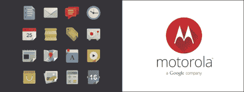

Pixeden 提供的扁平设计图标集（左）和 Sajeer Mohamed 提供的 Motorola Long Shadow 标志（右）

# 照片还是插图？

对这个问题的答案非常简单：两者都可以。

扁平设计插图是设计师们非常快速地掌握的技能，特别是用于设计扁平图标，从而在这些图标上使用扁平颜色，达到非常有趣的效果。这些插图看起来很棒，确实是网站扁平化外观的很好补充（如果它们确实与您的产品和目标相关），但照片也可以（而且应该）被使用。扁平不仅仅是关于文本和简单的颜色；它是关于创建一个布局，让您的照片和内容脱颖而出，将用户的注意力集中在内容上，而不是界面上。这在拟物化界面上经常发生。

如今，很常见看到网站使用非常宽广和高分辨率的人物、产品或环境照片，更容易地展示他们的产品在真实情境中。经常有人说一张图片胜过千言万语，所以，善用这些图片来帮助您传达信息。照片在设置网站的情绪和语气方面非常重要；扁平设计在图片上看起来很棒，因为它是复杂（图像）和简单（布局）的混合，这在两者之间产生了很好的对比。

如果您正在寻找一些预先设计的扁平图标，有几套免费的图标集可以在线使用，由设计师创建并为设计师创建。

以下是一些您可以在项目中使用的例子：

+   Pixeden 提供的扁平设计图标集 Vol1（[`www.pixeden.com/media-icons/flat-design-icons-set-vol1)`](http://www.pixeden.com/media-icons/flat-design-icons-set-vol1))

+   由 buatoom 提供的免费扁平图标（[`dribbble.com/shots/1095922-Free-Flat-Icons)`](http://dribbble.com/shots/1095922-Free-Flat-Icons))

+   由 Jan Dvořák 提供的免费扁平图标（[`dribbble.com/shots/1054478-Free-Flat-Icons)`](http://dribbble.com/shots/1054478-Free-Flat-Icons))

+   扁平图标收藏（[`www.flaticon.com/)`](http://www.flaticon.com/))

+   扁平图标收藏（[`flaticons.net/)`](http://flaticons.net/))

扁平很棒，因为它是一种简单的风格，可以让您展示其内容。最终，一切都关乎内容，设计的功能是以最简单和最快的方式将内容传达给用户/读者。因此，在扁平设计中，尽情使用您的图片，让内容说话，而不是界面。以下的截图是一个很好的例子：

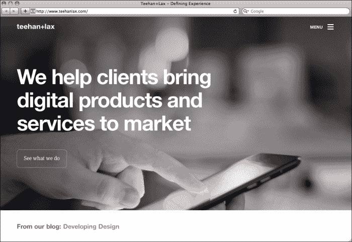

Teehan+Lax 设计工作室主页

# 尊重网格

网格在平面设计和数字设计中都是重要的工具。网格是一组虚拟线条，定义了主要布局的间距和尺寸，它是界面的基础，布局将建立在其上。它是一个框架，为用户提供设计每个页面和每个部分内容的方向和指导，而无需担心对齐、安全边距和间距。这是因为网格早已在之前开发，避免了对每个页面进行这些计算。请看以下截图：

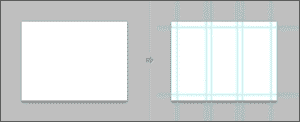

使用 Guide 插件的 Photoshop 指南

网格绝对是每个设计作品中的重要组成部分，但对于扁平设计来说，它的重要性不可否认。由于扁平设计倾向于减少框和线条，网格对于将所有视觉元素组合成布局非常重要。两个对齐的元素可以给观看者产生一个块或一条线的感知，这些视觉感知是通过网格和确保这些对齐是正确的来构建的。

空白空间是扁平设计想要实现的清洁简约外观中最重要的因素之一。在设计中使用网格对于创造这种空白空间至关重要。均匀和平衡的元素将创建结构，否则您将使用框和线来创建。以下截图显示了 numbrs.com 网站上对空白空间的运用：

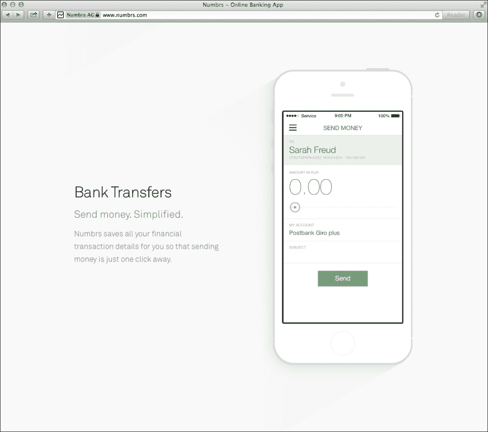

为了帮助您设计，已经开发了几种适用于各种应用程序的网格系统。特别是对于 Web，最常用的之一是 960 网格系统。它可以在[`960.gs`](http://960.gs)上找到。以下截图显示了 960 网格系统在[tapbots.com](http://tapbots.com)上的使用：

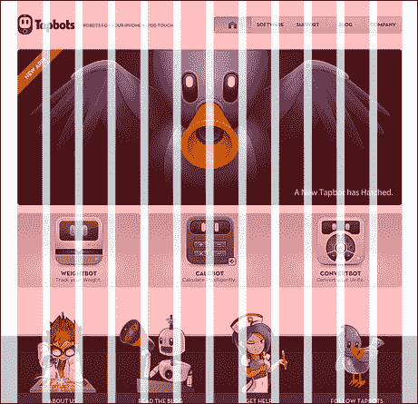

这个网格将允许您基于最常用的尺寸创建几种不同类型的块，所有这些块都是以总宽度为 960 像素构建的。您可以选择 12 列或 16 列。这些可以分开使用，也可以在同一布局中一起使用，以在保持一致性和连贯性的同时为您的块设计提供更大的灵活性。

如果您想要创建一个响应式网站，一个很好的工具是 unsemantic，它可以在线获取，网址为[`unsemantic.com/demo-responsive`](http://unsemantic.com/demo-responsive)。这是一个非常类似于 960 的网格系统，但是与固定网格不同，这个系统是流体网格。流体网格完全基于百分比，而不是固定列数，允许布局适应设备视口，并为用户提供响应式体验。

我们将在本书的后面学习更多关于网格以及如何使用它们的知识，第四章 *设计您自己的扁平网站*。

# 专注于排版

排版对于平面设计布局非常重要。为了简单和几何形状，无衬线字体是在平面设计中处理排版时的明确选择。有许多字体在平面设计中更常见且更常用。这些字体是根据其特性选择的。这些字体通常是几何形状的；然而，它们可能具有微圆角，它们通常在标题中使用大写字母。在一个词中使用所有大写字母也是为了为该词创建更具影响力的外观，这也可以通过字体的较重重量来实现。一个很棒的字体应该有几种不同的重量，以便能够将轻型风格与粗体或特粗体混合在一起，因为这种两种相反重量的混合在标题和文本块中视觉上看起来很好。它通过创建这种视觉对比来更加关注标题。以下截图是 Motiva Sans 字体具有不同重量的示例。此字体可在[`www.myfonts.com/fonts/niramekko/motiva-sans/`](http://www.myfonts.com/fonts/niramekko/motiva-sans/)上获得。

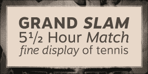

如今，可以在网上找到大量质量良好的免费字体。这些字体专为网络设计。Google Fonts 等网站允许用户轻松搜索、浏览和在其项目中使用字体。这对于希望在其网站上使用自定义字体的网页开发人员来说是一个很好的工具。

以下是一些建议在平面设计中使用的字体系列：

+   普罗克西玛新体（[`www.myfonts.com/fonts/marksimonson/proxima-nova/`](http://www.myfonts.com/fonts/marksimonson/proxima-nova/)）

+   未来体（[`www.myfonts.com/fonts/bitstream/futura/`](http://www.myfonts.com/fonts/bitstream/futura/)）

+   拉托（[`www.google.com/fonts/specimen/Lato`](http://www.google.com/fonts/specimen/Lato)）

+   蒙特塞拉特（[`www.google.com/fonts/specimen/Montserrat`](http://www.google.com/fonts/specimen/Montserrat)）

+   Open Sans（[`www.google.com/fonts/specimen/Open+Sans`](http://www.google.com/fonts/specimen/Open+Sans)）

+   科伯特（[`www.fontsquirrel.com/fonts/corbert`](http://www.fontsquirrel.com/fonts/corbert)）

这些只是您可以在设计中使用的一些字体。随意搜索更多适合您目标风格的字体。根据您选择的字体类型，您可以获得更严肃或更愉快的语气。明智地为您的项目选择字体，因为字体是网站外观的主要因素之一。理想情况下，您应该在每个网站上选择最多两到三种字体。主要字体应该用于标题。这是最详细的字体，也是排版的基调。您应该选择另一种字体用于文本块，这将是您的正文；这种字体应该是中性的，其唯一目的是使文本可读并使其与标题形成对比。可能的第三种字体应该是适合大写和小字体的字体；这可以用于标题，描述图像，或者可以附加到图形上。谨慎选择您的字体；比较和测试它们以确保它们搭配得很好。始终牢记您使用的媒介，因为为屏幕设计的字体可能在印刷品上不起作用，反之亦然。

# 平面颜色

在平面设计中使用颜色的规则非常简单：避免渐变和纹理。这些颜色应该原样使用，不做任何修改。即使是一个平面颜色看起来也会有一点渐变，因为 LCD 屏幕的构造方式。这是因为屏幕的每个区域颜色不会完全相同，而且围绕设备的光线也会对其产生影响。因此，请尝试测试您的颜色并选择一个有效且好看的调色板。

尽管有一些首选的扁平颜色类型。网站 http://flatuicolors.com 很适合快速检查这些颜色并使用它们。只需点击屏幕上的颜色，十六进制代码就会复制到剪贴板上，准备好粘贴到您的 Photoshop 或 CSS 代码中。网站上显示的颜色很容易代表所使用的颜色类型。这是对使用鲜艳颜色的有趣尝试，但它们应该稍微调和一下。强烈的绿松石色、调和的绿色和略微不那么鲜艳的蓝色是最常用的颜色之一。其想法是创建一个良好的颜色背景，但不要太鲜艳，以避免过多地关注颜色。记住，颜色是内容所在的背景，焦点应始终放在内容上，而不是颜色本身。以下截图显示了来自 http://flatuicolors.com 的扁平 UI 颜色：

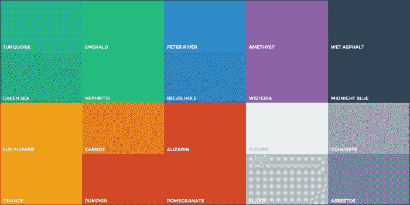

在创建网站时，您应该选择要使用的调色板。这个调色板由网站中使用的所有颜色组成，应该有一两种主要颜色和一些额外的中性颜色。例如，在 patterntap.com 的情况下（如下截图所示），主要颜色显然是页眉部分使用的那种绿黄色，而黑色用于顶部的次要菜单，非常浅的灰色用于背景。每种颜色都有自己的功能。黄色是与品牌相关的主要颜色，黑色是分隔符。有一个单独的内容中性区域，灰色是内容区域，可读性更重要。定义自己的调色板；尝试使用主要颜色的不同色调，较浅和较深的颜色；并测试它在链接、标题和视觉元素（如线条）中的效果。创建调色板时要记住的一件重要事情是，必须避免混合不搭配的颜色。还要记住在使用它们时要保持一致。如果一个标题在一个页面上是浅蓝色，那么在所有页面上都应该是这样。

### 提示

让我告诉你一个小秘密；在使用黑色作为线条或文本时，尝试使用非常深的灰色而不是完全的黑色。它看起来会好很多。同样的，尝试使用灰色或略带黄色的白色，而不是纯白色。稍微加深颜色会给元素带来另一种外观，就好像您在使用纹理一样。

以下截图是扁平颜色的一个例子（www.patterntap.com）：

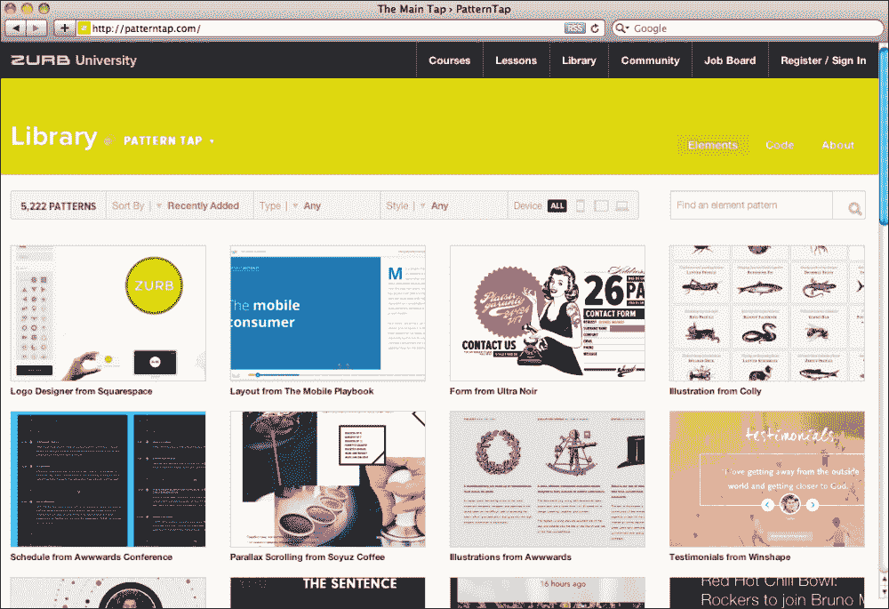

# 灵感和参考

在设计中需要很多专业知识，但其中最重要的之一是视觉文化。通过观察他人的作品来充实自己的视觉文化。在学习时，尝试复制其他人的风格，并了解他们是如何做到的，最重要的是为什么要这样做。

通过在视觉上保持对不同项目的最新了解，您会发现自己会在视觉上学习到一些使用的设计模式，以及颜色调色板、界面思想、布局和排版。这只需要看看其他人正在做什么，并在视觉上感受一下。您可以在本节后面找到一些关于扁平设计和布局的灵感和良好的参考。这些都是扁平设计的执行的一些很好的例子，还展示了如何以不同的方式使用这种风格。注意白色空间、使用的颜色和调色板，以及图标、摄影以及这些网站整体组织。可以随意将这些用作自己项目的灵感，通过采用执行和布局的想法，而不是直接复制整个布局。

设计师的工作需要是原创的，无论灵感和/或使用的设计模式是什么。

以下是一些您应该了解和查看以获取灵感的网站。这些是平面设计的出色执行示例：

+   Treehouse（[www.teamtreehouse.com](http://www.teamtreehouse.com)）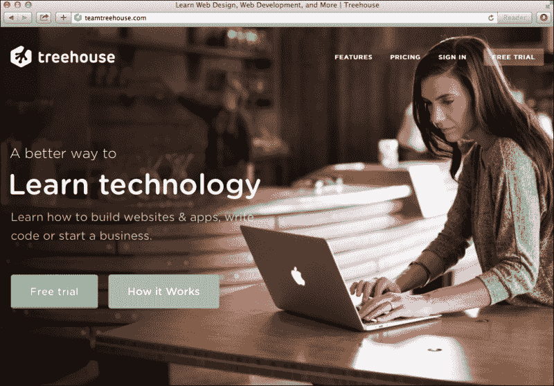

+   Treehouse 内容部分，采用平面风格插图（[www.threehouse.com](http://www.threehouse.com)）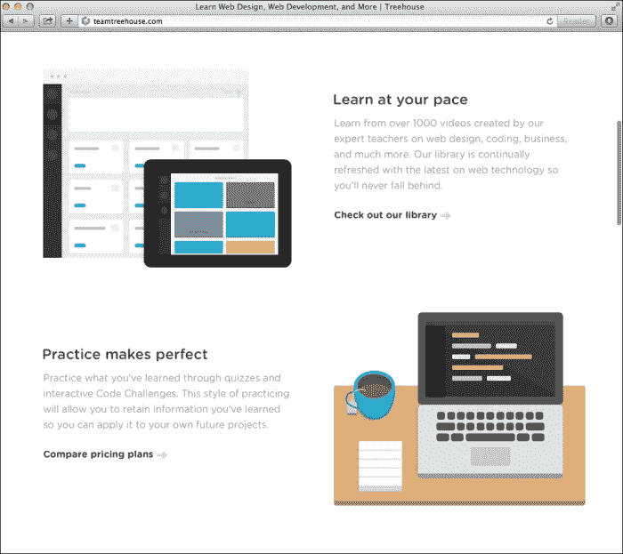

+   Numbrs 主页，使用无衬线文本的全屏照片（[www.numbrs.com](http://www.numbrs.com)）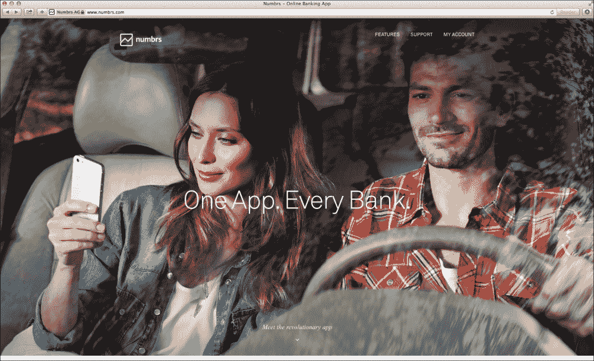

+   Wacom 主页，带有内容块和平面图标（[www.wacom.com](http://www.wacom.com)）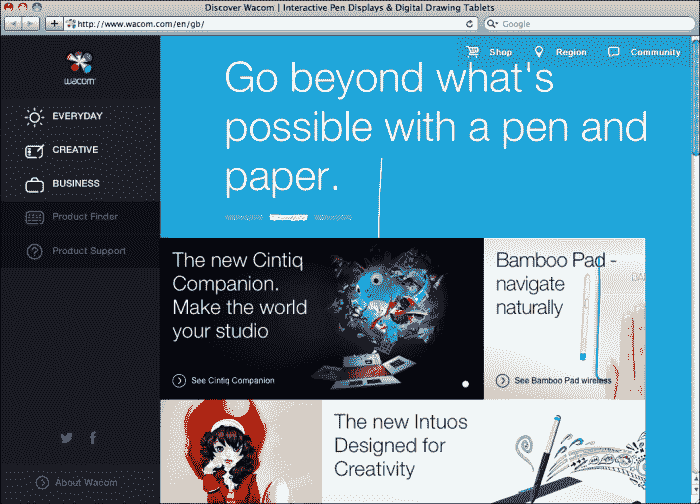

+   Hellomonday 主页（[www.hellomonday.com](http://www.hellomonday.com)）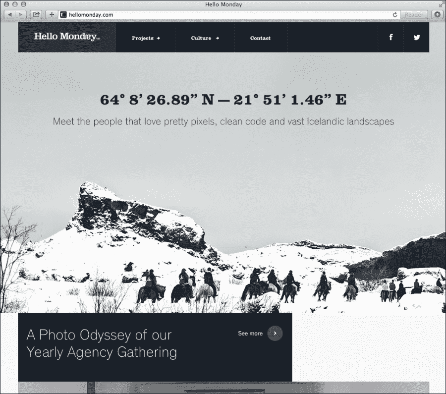

# 摘要

到目前为止，您应该能够理解在平面设计中网格和空白空间的重要性，以及如何使用出色的排版在平面颜色上创建有影响力的消息。平面设计关乎细节，在这种情况下，细节在于学习如何在缺乏复杂性和噪音的情况下进行设计。现在您知道如何使其看起来不错。在下一章中，我们将学习如何使其运行良好，通过讨论网络可用性及其在平面界面中的重要性。
