# 第三章：创建扁平且可用的界面

本章将涵盖扁平设计中的网页可用性，以及这对每个网站和网络应用程序的设计功能有多重要，因为这种风格可能会因其简单的外观而产生几个可用性问题。我们将通过理解什么是网页可用性，并学习以可用性为重点设计网页表单，学习设计师需要注意哪些元素以及需要关注什么，以成功创建可用界面。

# 了解网页可用性

网页可用性顾问和可用性专家 Jakob Nielsen 在网站中定义了可用性，[`www.nngroup.com/articles/usability-101-introduction-to-usability/`](http://www.nngroup.com/articles/usability-101-introduction-to-usability/)，如下所示：

> “可用性是评估用户界面易用性的质量属性。该词还指的是在设计过程中改善易用性的方法。”

在这种情况下，网页可用性与网站的良好功能以及用户使用的简单和可预测性有关。我们作为设计师和开发人员，假设对于大多数人来说，使用网站是容易的，已经被认为是一种自然的技能，但这不是您应该做出的假设。相反，当设计网站或界面时，您必须假设用户没有使用它们的先前经验。界面必须设计得直观且易于使用，即使对于初次使用的用户也是如此。

所有元素必须在视觉上可识别。例如，链接、表单、文本字段和按钮等元素必须易于区分。例如，链接通常是以历史和通常表示的方式——正如在 HTML 的第一个版本中定义的那样——在文本块中的蓝色下划线单词，但这并不总是如此，主要是由于网页设计师创建的自定义和颜色方案。这意味着即使不使用超链接的标准符号，用户也应该有一种简单的方式来识别文本块中的这个元素。这必须是自然的，用户必须自己理解，而无需任何解释。通常，这是通过保持单词中的下划线并将颜色更改为与文本颜色对比的颜色来完成的。下划线可以被粗体文本效果替换，以澄清这个特定单词与常规阅读文本的不同之处。

鼠标悬停效果也非常重要。当将鼠标悬停在单词上时，用户会检测到单词的不同之处；有时，下划线消失了，或者单词应用了粗体效果。然而，无论选择的效果或样式如何，链接都会有视觉上的变化。这种变化是让用户感觉到这个特定元素对交互作出响应，被认为是一个比简单文本更重要的元素的原因，就像超链接一样，它将带用户到另一个页面。

这是用户访问网页时经历的思考方式，这是可用性在网页设计中起作用的一个例子。在谈论网页或移动应用程序时，可用性更加重要，因为在这种情况下，必须存在特定的用户旅程，以允许用户完成某些任务。这是因为应用程序是具有特定目标的工具。然而，在网站上，内容的访问取决于访问者的兴趣和他们自己的目标。

不幸的是，可用性的重要性经常被忽视，但它应该始终成为每个网页设计项目中的一部分。鉴于其外观，这在扁平设计中尤为重要，但为什么可用性很重要呢？

## 网页可用性的重要性

可用性有几个重要原因。首要原因是，可用性保证您的网站“只是起作用”。

在创建任何项目时，总会有一个目标。通常目标是通过展示图像和文本内容来向访问者提供信息，但也可以是销售产品或服务，甚至在 Web 应用程序的情况下直接提供服务。无论目标是什么，总是有一个。可用性是您和设计师确保一切正常运作以实现该目标的工具。通过确保用户理解网站导航或通过澄清按下按钮的操作，您使用户更容易更有可能按照预期的用户旅程进行操作。

如果您经营商业网站，这尤为重要，因为它将直接影响您的收入，可能是成功或失败的在线业务之间的区别。有一个案例，一个网站仅通过更改一个简单的按钮就在一年内增加了 3 亿美元的收入。这绝对证明了可用性的重要性。

在设计网站时考虑可用性往往是保留访问者和失去访问者之间的区别。如果用户不理解网站，或者他们无法轻松找到他们想要的东西，就会感到沮丧，用户会离开，去其他地方寻找内容。您可能知道这种感觉，当您在混乱的网站上寻找某些东西时，会感到非常困难。试着想象一下，当用户使用网站时会有什么想法，并确保避免可能出现的所有挫折。

如果您觉得您已经解决了基本的可用性问题，但仍然相信您可以改进您的工作，那么您可能需要开始测试。了解您的网站出现了什么问题的最佳工具之一是用户测试，也就是与用户坐下来，与他或她一起浏览网站，并从他或她的反馈中学习。

有很多不同的方法来测试网站，如果您有兴趣了解更多关于网站可用性的信息，我强烈推荐 Jakob Nielsen 的书《设计网站可用性》，可在亚马逊上购买。

## 实现良好的平衡

好的，现在我们已经讨论了什么是网站可用性，您知道它会对网站的访问者产生多大的影响，我希望您退一步，放松一下，不要惊慌。您可能已经通过使用常识来避免大部分较大的可用性问题，就像任何为特定设计做决策的设计师应该做的那样。我们不希望制作一个网站，以至于缺乏风格和色彩。毕竟，创新来自于大胆尝试不同的事物。

话虽如此，您的最终目标是在一个真正出色的网站和一个功能性网站之间实现良好的平衡。大多数情况下，可用性只是关于组织和常识，这是一种工作方式，而不是一种应用技术。更具创新性的界面在开始时可能更难使用，但设计师可以选择冒这个风险来获得不同的体验。然而，如果您想玩得更安全，请尝试专注于已知和熟悉的布局类型和简单的设计。

有时，通过对网站设计进行非常小的简单调整，可以实现可用性改进。

有几位设计师提出了对知名网站的重新设计，其中大多数都集中在通过重新组织、简化或甚至重新设计元素来简化当前的布局。重新组织和简化元素是一个很好的练习，因为它让您了解哪些元素在设计中真正重要，哪些只是装饰性的。

瑞典机构 Weare1910 ([`weare1910.com/`](http://weare1910.com/)) 为维基百科 ([`en.wikipedia.org`](http://en.wikipedia.org)) 创建了一个重新设计提案，他们重新设计了网站，更加专注于内容，同时简化了设计。通过大幅改善排版，使文本和行高更大，并提高了文章的可读性，同时简化了布局，去掉了左侧的菜单。这创造了一个更简单但可识别的维基百科网站版本。以下屏幕截图 ([`blog.weare1910.com/post/75576312730/a-readable-wikipedia`](http://blog.weare1910.com/post/75576312730/a-readable-wikipedia)) 显示了维基百科（顶部）和其重新设计（底部）。

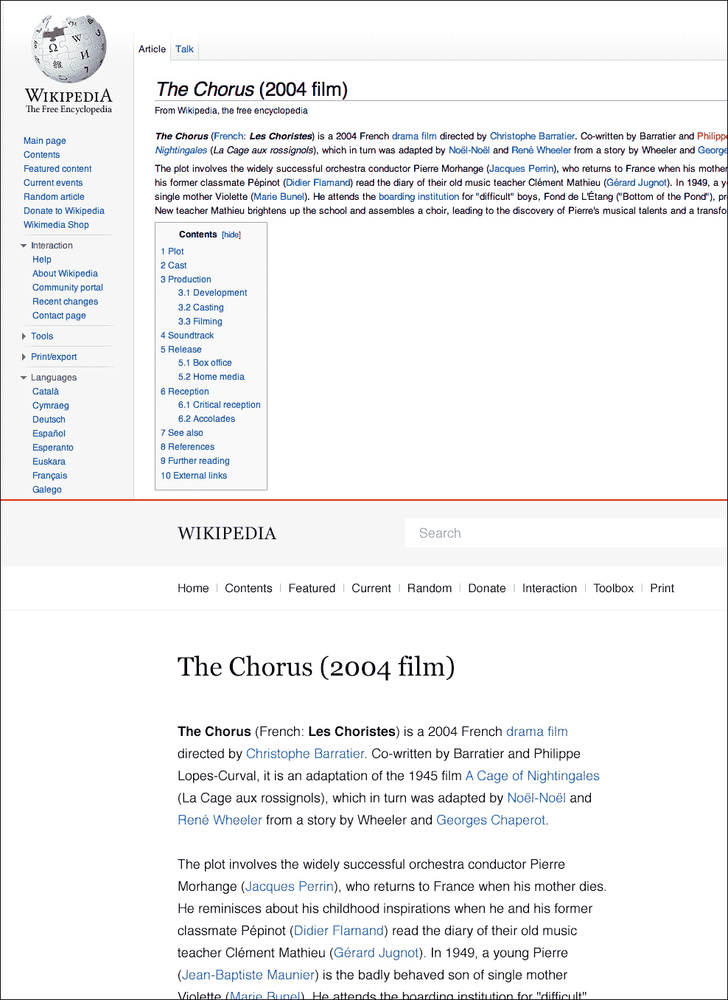

维基百科（顶部）和重新设计（底部）。可在 http://blog.weare1910.com 找到

因此，为了清晰地看到这一点，让我们做一个简化设计的小练习。我选择了*伦敦交通局*网站的主页，因为它是一个较旧的网站，其设计仍然非常笨重，看起来非常凌乱。这绝不是一个严肃的重新设计，而只是一种学习如何简化设计以创建更轻盈和可读性更强的页面的方式。

首先，让我们找到可以操作的原始网站。您可以打开本书提供的 `tfl-redesign.psd` 文件并进行操作。

### 提示

**下载示例代码**

您可以从 http://www.packtpub.com 的帐户中下载您购买的所有 Packt 图书的示例代码文件。如果您在其他地方购买了本书，可以访问 [`www.packtpub.com/support`](http://www.packtpub.com/support) 并注册，以便直接通过电子邮件接收文件。

打开文件后，让我们确定要处理的块。只关注内容部分，忽略右侧的条形。我们将网站分为三个主要部分：主要亮点部分，带有奥斯特收费和巴克莱信息的中间部分，以及其他新闻和重要信息的最后部分。这些是我们将重新设计的部分。以下屏幕截图显示了旧的 TFL 网站（www.tfl.gov.uk）在左侧，已确定的主要内容部分在右侧：

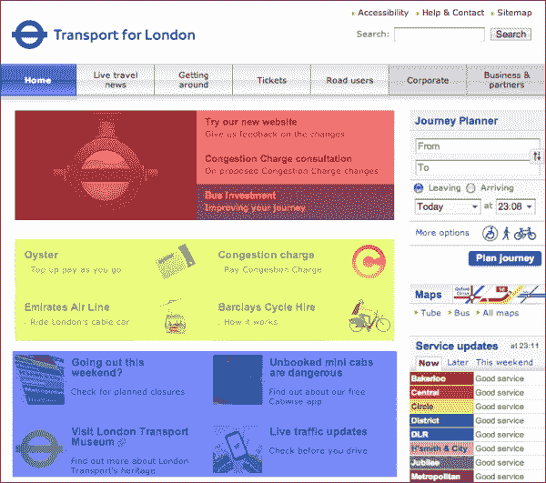

TFL 网站 [www.tfl.gov.uk](http://www.tfl.gov.uk)（左）和主要内容部分（右）已确定

确定并突出显示了我们的部分后，让我们开始用我们的内容替换它。对于第一部分，创建类似的标题和正文文本，并覆盖当前设计，以便我们可以在同一元素中对齐内容。

因此，重新编写第一部分的标题。您可以使用 Lato 字体来完成这项任务。将文本大小设置为 13 磅，将标题的粗细设置为黑色，以使其与描述文本区分开。前两个块已禁用，因此让我们将文本颜色设置为灰色（`#979797`）。这将使文本呈现出一种褪色的黑色，并在视觉上暗示这些块已被禁用，与已启用和活动的块形成对比。由于我们正在删除蓝色背景，因此无法保持文本为白色。因此，将活动行标题设置为蓝色；只需选择背景颜色并将底部线设置为黑色。

您现在已经有了第一部分的内容。只需选择图像并删除它，并将该部分涂成白色以匹配背景。为了改善这些部分内容行之间的分隔，让我们创建一些分隔线。在文本之间创建两条 1 像素粗的灰色分隔线（`#dcdcdc`）。这将有助于在视觉上定义这些块，同时保持它们非常简单和轻盈，正如下面的屏幕截图所示：

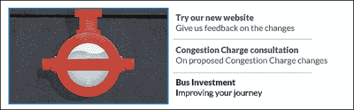

继续下一部分，让我们做同样的事情，用覆盖的方式替换文本。复制相同文本的颜色，忽略绿色三角形。将文本对齐到区块的左侧，并删除之前存在的图像和文本。在完成所有这些操作后，页面应该如下截图所示：

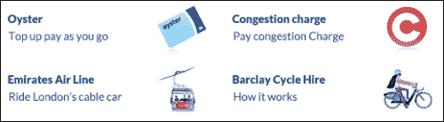

对于最后一部分，做同样的事情，将标题与图像顶部对齐，并保持相同的颜色。最终结果将类似于以下截图：

现在我们已经简化了所有的部分，我们可以看到页面看起来更轻更干净。然而，没有了线条和框，内容似乎不那么拥挤。因此，我们需要在区块之间留出更大的间距，以使它们在视觉上分离开来。只需将第二和第三部分下拉一些像素，就足以给人不同部分的感觉。简化后的 TFL 网站的结果将类似于以下截图：

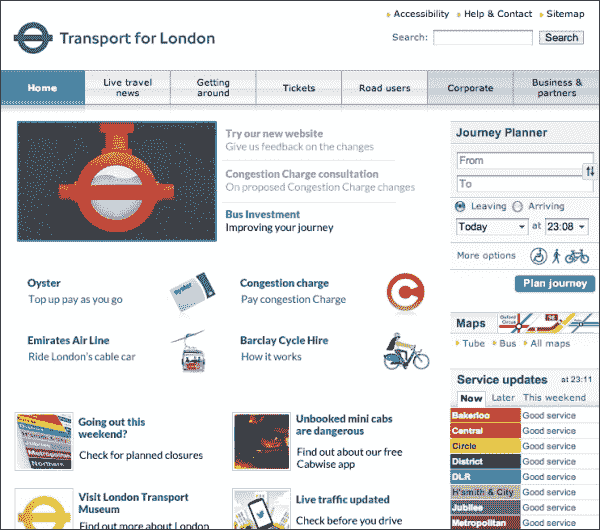

这些简单的改变在结果上带来了明显的改善。事实上，改变只是简单地从布局中移除背景图像和非必要图像，以使内容定义区块而不是框和线。这导致产生了更多的空白空间，使网站变得更轻。这在以下截图中是显而易见的：

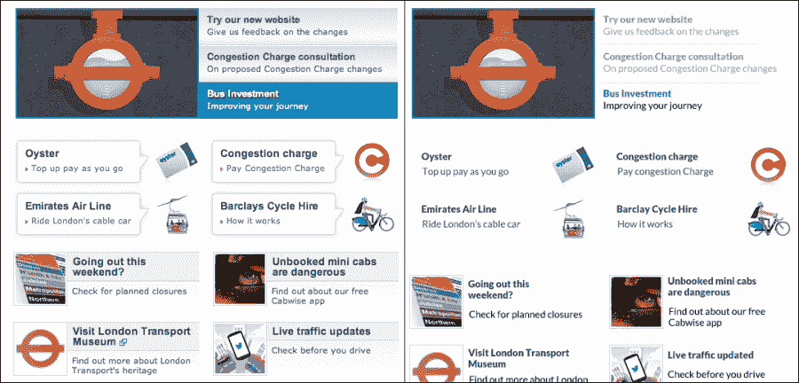

# 网页表单的可用性

正如我们之前所说，可用性在扁平设计中非常重要。从这种风格中在可用性方面受到的影响最大的元素通常是**网页表单**。通常很容易使控件（如按钮和文本字段）与扁平样式相匹配，以至于它们失去了使它们可识别的效果和特性。文本字段通常由一个矩形框表示，内部有微妙的内阴影来显示它正在等待内容。这种阴影在扁平设计中经常丢失，为了避免这种情况，我们需要确保表单是可识别的。有几种方法可以做到这一点。最好的方法是亲自动手，所以让我们在网页表单的可用性上做一个简单的练习。

接下来，我们将为网站创建一个简单的注册表单。为此，我们将使用附带本书的资源包中提供的`ele_winvista_firefox_all.psd`文件。它也可以在[`designerstoolbox.com/designresources/elements/vista/firefox/`](http://designerstoolbox.com/designresources/elements/vista/firefox/)上找到。

这个文件是一个浏览器表单模板，其中包含在 Firefox 中创建基本 HTML 表单时会遇到的元素。所以，让我们开始吧。

## 使用常规浏览器样式创建网页表单

让我们执行以下步骤来创建一个网页表单：

1.  在 Photoshop 中创建一个大小为 350 x 350 像素的新文件。我们将在这个文件中创建我们的表单。

1.  创建一个带有文本`Name`的文本字段。这个字段将作为剩余字段的标题模板。您可以将字体定义为 Arial，并将大小设置为 14 磅。

1.  现在你有了标题，将**Input Field**文件夹从模板文件中复制到你的新文档中。将它们与标题左侧对齐，文本字段右侧对齐，如下截图所示：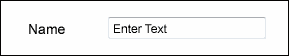

1.  我们需要整理文件，并将标题和字段保存在与字段对应的文件夹中。复制`name`文件夹，然后将其改为`Age`。

1.  现在，让我们创建一个`Gender`字段。为此，我们将使用下拉列表的模板，并为其分配一个独立的标题。

1.  假设我们正在为一个博客创建一个表单，所以我们需要一个账户类型选择器。然后，我们将创建一个名为“账户”的字段，带有单选按钮。复制“已选择单选按钮”和“未选择单选按钮”文件夹，并分别将文本更改为“作者”和“评论者”。这是博客将具有的两种不同的账户状态，具有不同的权限。

1.  最后，将“按钮”文件夹复制到您的文件中，并将其对齐到右侧。

1.  我们的标准表单已完成！这是在 Firefox 浏览器中简单的 HTML 表单的外观，这是标准外观之一。您应该最终得到类似下面截图的设计：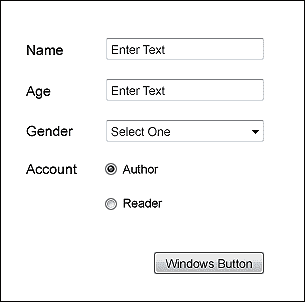

就是这样，非常简单对吧？但是，这是一个相当标准的“不那么令人兴奋”的外观。接下来，让我们尝试一下扁平设计风格。

## 使用扁平样式重新创建表单

现在我们有了基本表单，我们需要重新创建元素以匹配扁平设计的外观。为此，让我们使用之前使用的字体 Lato，并按照以下步骤重新创建表单：

1.  复制我们创建的文件，并将其命名为`flat-form.psd`。我们将使用我们之前创建的文件作为基础来创建这个新表单。

1.  将标题的字体更改为 Lato，并将其大小设置为 15 pt。

1.  对于文本字段，创建一个宽度为 190 像素，高度为 35 像素的白色矩形。这将是我们的新扁平文本字段。

1.  为此矩形添加混合选项，例如描边。描边的大小应为 1 像素，并位于矩形内部。我们不希望边框非常明显；我们希望它是微妙的，比文本更轻。因此，让我们将其颜色定义为“＃aeaeae”。这种浅灰色在白色和黑色文本上效果很好。

1.  现在，让我们创建我们之前所说的填充文本，并将其大小更改为 13 pt；我们刚刚创建了我们的第一个扁平表单元素。它应该看起来像下面的截图：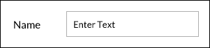

1.  复制新字段以用于“年龄”和“性别”。对于“性别”，我们可以使用相同的矩形，但我们将添加一个小三角形以指示它是一个下拉列表。为了创建这个三角形，我们将使用多边形工具（U）并创建一个具有三个边的形状。将三角形设置为黑色或边框的相同灰色（“＃aeaeae”），并创建下拉按钮。

1.  这是一个个人选择，这取决于你的口味。为了更加关注按钮，我们可以使用按钮的反转选项，使三角形变为白色，并创建一个与矩形边框颜色相同的矩形。为此，复制我们用于文本字段的矩形，并将其宽度更改为 35 像素。删除定义描边的图层样式，因为我们这里不需要它，并将此矩形的颜色定义为“＃aeaeae”。这将在字段上创建对比，并进一步将其与其他字段区分开。

1.  对于账户表单，我们将使用椭圆工具重新创建圆形元素。创建一个 16 x 16 像素的白色圆圈，并具有相同的描边。将其与其他字段对齐。这将是我们的单选按钮。复制此图层并将其缩小为 9 x 9 像素；删除描边，并将主要颜色定义为“＃aeaeae”。这将是我们的选择。对于选项文本，让我们使用相同的文本字段，并将其向右移动，这样我们就可以在左侧拥有单选按钮。现在，我们只需复制此行，将其下拉，删除所选图层，我们就有了未选择的单选按钮。它应该看起来像下面的截图：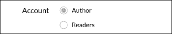

1.  现在，我们只缺少按钮。为此，我们将使用与字段相同的矩形，删除描边，将背景设置为“＃aeaeae”，并将其宽度更改为 105 像素。我们可以使用文本字段设置为白色来创建标签。

现在，我们有了与之前相同的表单，但它是以扁平设计风格重新设计的。正如您所看到的，它由非常简单和基本的元素组成，看起来比原始版本更简约。我们只使用黑色、灰色和白色。然而，在设计更多颜色的网站时，您可以选择在矩形描边和背景上使用主品牌颜色，使其更符合所创建的设计。以下截图显示了默认样式表单（左侧）和扁平样式表单（右侧）：

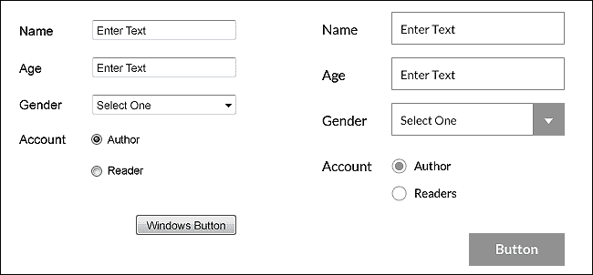

## 优化表单的可用性

正如您所注意到的，我们的新表单在定位和元素工作方式方面与默认版本相似，但我们仍然可以改进其可用性，以确保用户拥有最佳体验。现在，让我们进行以下几个小的调整，这些调整将极大地改善表单：

1.  首先，让我们更改字段内的文本。目前，这个文本设置为黑色，显示为“输入文本”。这个文本被称为占位文本，应该用来指示用户网站期望的内容类型。您可以在这里使用操作或内容示例来向用户显示应输入的内容。让我们将文本更改为“输入您的姓名”，因为这将帮助用户填写此字段。然而，黑色是我们保留给内容的颜色，为了使其看起来更加离散，不那么像内容，我们将文本设置为灰色（#aeaeae）。这样，用户就有了视觉提示，但没有黑色文本，字段看起来仍然是空的，准备让用户填写。

1.  对**年龄**字段执行相同操作，但使用“输入您的年龄”文本。

1.  将**性别**中的文本更改为“选择您的性别”，从而将其与选择框联系起来。

1.  最后，将按钮的文本更改为表单的操作。在这种情况下，由于这是一个注册表单，将文本更改为“注册”。这个小改变将向用户定义表单的主要操作，确保用户了解他或她在网站上执行的操作。按钮上也可以使用颜色来指示某些操作。例如，一个**删除账户**按钮将提供红色背景的好处，以指示永久和极端的操作，比如删除账户。

这些改变非常简单，但在优化和改善表单的可用性方面非常有效。这些是您在设计表单时应该专注的一些要点，以确保性能和易用性。您的屏幕应该与以下截图所示的内容类似：

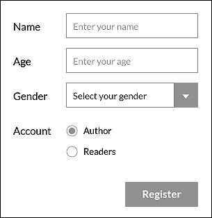

# 扁平可读性

扁平设计通常使用大号无衬线字体用于消息和标题。这些文本片段在照片和扁平颜色上看起来很棒，但与每个人一样，您总是要确保您的排版是可读的。在扁平的情况下，您不应该使用投影或渐变，因此您必须特别注意可读性。为此，始终要努力实现文本和背景之间的最佳对比度。

让我们通过以下步骤进行快速练习，尝试最佳的可读性实现方式：

1.  在 Photoshop 上创建一个新文档，我们将尝试颜色。我们只想在块的顶部叠加文本，因此创建一个大小为 160 x 175 像素的小矩形。将此形状的颜色设置为黑色，并在其中创建一个白色的文本字段。这种对比度，白色在黑色上方，非常易读。当然，对于可读性来说，最好的对比度是黑色在白色上方，就像每本书和每份报纸一样。我们刚刚创建了这种对比度的反向，这种对比度也非常容易阅读，并且适用于标题。我不建议您阅读白色文本在黑色上方，因为这对眼睛来说非常累人。

1.  现在让我们尝试一下[`flatuicolors.com/`](http://flatuicolors.com/)中的一种平面颜色，并将形状的颜色定义为`#4d9ad7`。这种颜色看起来非常棒，因为它既细腻又充满活力，而白色文本读起来非常好，因为白色与这种鲜艳的蓝色形成良好的对比。

1.  用`#65c378`、`#9166b2`和`#374a5d`颜色重复上述步骤。所有这些颜色在白色背景下都会读得很好，因为它们都是鲜艳和较深的颜色。

1.  现在将文本中的一个单词改为黑色。你会注意到，即使文本仍然可读，对比度感觉不太对。黑色只有在非常浅的颜色上才能很好地阅读，在这种情况下，它失去了白色所提供的锐利度。我们无法在以下截图中清楚地看到，但你可以通过跟随这个练习并检查本书中提供的示例来自行测试：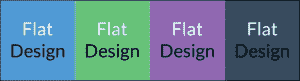

1.  现在让我们尝试一些不同的字重。在一个颜色块中，用三行写上`Flat Design Rules`。将`Flat`的字重改为轻体，`Design`改为常规，`Rules`改为黑体。这样，我们可以看到不同字重下的字体是什么样子。轻体看起来非常好，创造了更简约和轻盈的外观，而黑体通过创建更大的对比度，形成了更大和视觉上更大的文本块。这对于标题和创建更具影响力的消息选项非常有用。特别要注意轻体字体，因为它们有时可能由于太薄而缺乏可读性。然而，像现在这样，我们应该测试轻体字体。

1.  使用彩色文本，容易出现对比问题。尝试在蓝色块（`#4d9ad7`）上方使用绿色文本（`#65c378`），以及反之。这种组合的可读性很差，应该避免使用。有一些互补色可以使用。这些颜色在色轮上相对，对比更大。如果你打算在彩色背景上使用彩色文本，请确保它们有良好的对比度，以确保可读性。你的屏幕现在应该看起来与以下截图类似：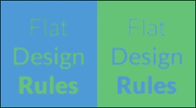

1.  在使用图像背景时，你必须特别注意文本的放置，因为图像具有不同的形状和颜色。理想情况下，你会希望将文本放在图像的顶部，使用平面颜色。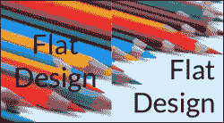

这些是你可能遇到的与平面设计文本可读性相关的主要问题，这些是你可以通过网站配色和字体执行的一些良好测试。记住，每种字体都有特定的高度和形状，你在选择使用哪种字重时必须小心。试一试，寻找灵感；当你看到它应用在你的网站上时，你就知道找到了你完美的字体。

# 总结

在本章中，我们介绍了网页可用性的基本定义以及其重要性，特别是在平面设计中，确保创建出色和功能性界面非常重要。我们看到可用性可以通过小的改变来实现，记住重点应该是尽可能地让界面对用户更容易。我们还介绍了网页表单中的可用性，这是平面设计中通常存在更多可用性问题的元素之一，以及如何避免这些问题以及将表单转换为平面样式。我们还介绍了平面类型，并学习了如何在几种情况下测试可读性。
