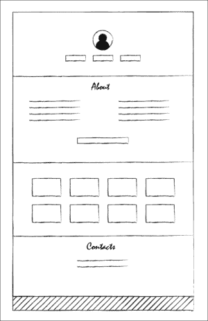
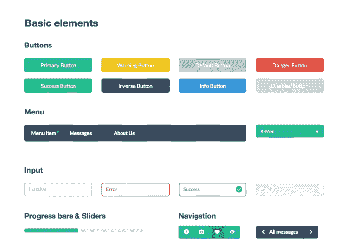
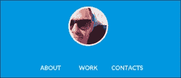
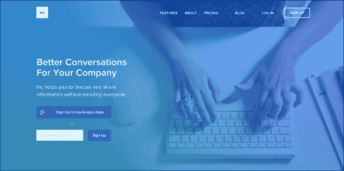
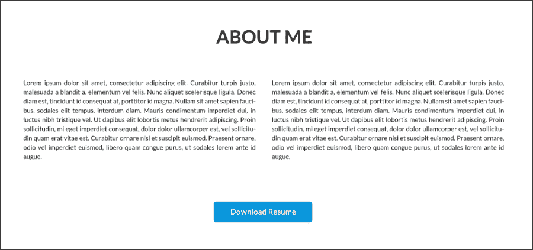
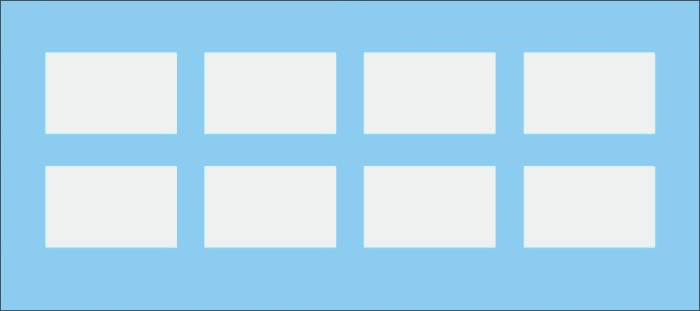
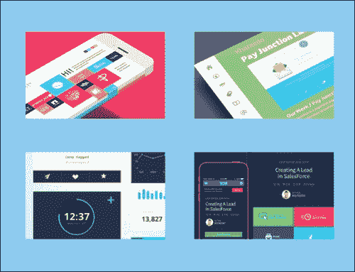
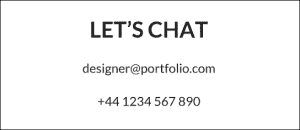
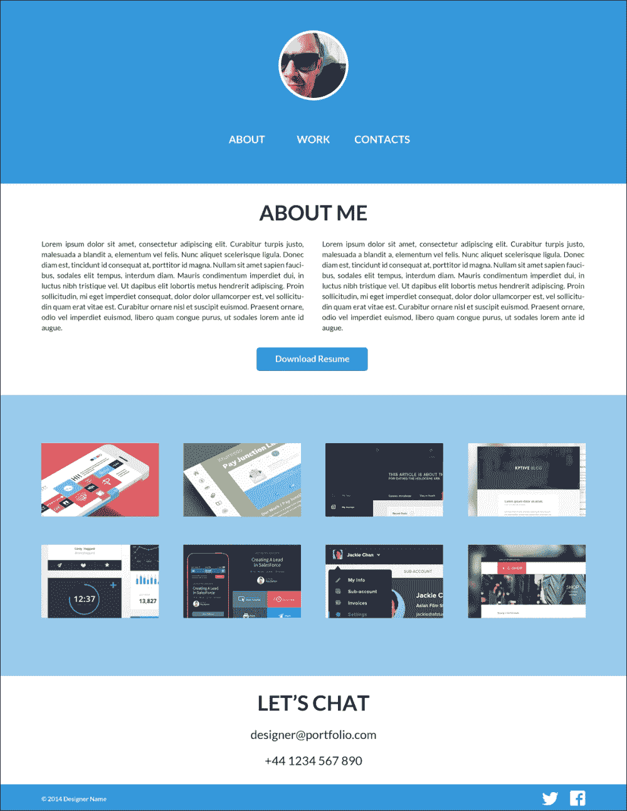

# 第四章：设计您自己的扁平网站

本章将是一个关于如何以扁平设计风格设计简单网站的实用逐步指南。

在本章中，我们将涵盖以下主题：

+   项目规划

+   使用外部资源简化和加快工作

+   布局设计过程

+   通过考虑其开发来创建设计，以加快整个工作过程

# 规划您的工作

规划绝对是设计网站中最重要的阶段之一。大部分工作都归结为确切地知道您将如何设计和开发您的网站；规划是所有这些决定将被做出的地方。

您需要首先定义您的目标和网站目标，您想要实现什么，以及为谁。想象一下，您正在为一个小工具公司创建一个在线电子商务网站。目标将是在线销售这些小工具（“什么”），目标对象将是 25 至 50 岁男性（“谁”）。这些通常都很容易理解。但是，如果您发现客户的要求不明确，请确保在开始工作之前了解他们的目标和目标，因为没有什么比一个不了解情况的设计师更糟糕的了。

然而，在这种情况下，我们正在创建自己的作品集页面。因此，基本上，我们正在创建一个旨在向设计师和潜在未来客户展示我们的作品（“什么”）的页面。当然，在这种情况下，目标并不像玩具公司或女装店那样容易定义，但目标总是存在的。您可能是一个对手机或时尚更感兴趣的设计师，因此在设计网站时请记住这一点。您的在线和离线形象应该使观众将您与某个市场联系起来，这是通过为主页设计创建和实施特定的方法和风格来完成的。

不幸的是，我不会有机会与您面对面交流，因此我们将不得不创建一个简单灵活的设计师作品集。这应该是一个通用作品集，不受您的工作专业的限制。所以，让我们开始规划吧！

# 定义您的部分

由于我们正在设计作品集，重点是展示设计师的作品。这里只有几个部分；它们如下：

+   **工作/作品集**：这是展示您设计项目的地方

+   **关于**：这是您作为设计师和个人的简短描述，以及您的经验

+   **联系**：这是一个存储您联系方式的地方，以便观众可以联系您，以及您的位置

这些是我们将为您的作品集设计的基本部分。由于这是一个如此小巧简单的网站，我们将创建一个单页网站。这种页面最近越来越常见。这主要是因为它以非常简单的方式迅速向用户呈现所有信息。此外，它通过在单个页面上呈现不同内容提供了更动态的体验。

# 开始设计您的页面

既然我们知道要设计什么，我们就可以开始草拟和设计您的网站了。我通常会先在纸上简单草绘，快速模拟我们要设计的内容。您也可以使用 Balsamiq 等软件创建线框图，但我更喜欢在纸上草绘。所以，拿一张纸开始草绘吧。

我们将创建的页面将包括五个视觉区块。这些区块如下：

+   **页眉**：这是我们将放置一个头像或标志来代表设计师作为品牌和菜单

+   **关于**：这是一个关于您的部分，包括一段关于您的文字和您的简历链接

+   **项目**：这是展示您设计作品的部分，包括缩略图

+   **联系方式**：这是一个包含您联系方式的简短文本块

+   **页脚**：这是页面末尾的一个非常小的区块，包含版权和社交网络链接

以下是我的草图：

手绘布局

我们的布局已经绘制好了，现在可以打开 Photoshop 开始设计我们的最终页面了。

# 使用 Designmodo.com 的 Flat UI

有这么多的设计师和开发者，你可以找到一些外部资源和预先设计好的组件，可以帮助你节省项目时间。Designmodo.com 的 Flat UI 包是一个很好的包，其中包含一些已经设计好的基本元素，所以我们将使用它来设计我们的页面。你可以在[`designmodo.com/flat-free/`](http://designmodo.com/flat-free/)免费获取这个包，其中包括分层的 PSD、图标、Lato 字体以及基于 Twitter Bootstrap 3 框架的开发文件。在本书的后面，我们将使用这些预先开发好的组件来设置我们的页面，进行开发工作，并将我们的布局变得生动起来。以下是 Designmodo Flat UI 包的截图：

# 在 Photoshop 中设计

现在我们已经定义了各个部分并且绘制了全局布局，可以开始创建最终像素了。打开你的 Photoshop，让我们开始执行以下步骤：

1.  创建一个宽度为 1200 像素，高度为 2000 像素，白色背景的新文档。这将是我们全长网站设计的画布。

1.  让我们从创建页眉开始。我们需要使用一个头像来代表我们的面孔，所以你可以使用你自己的头像，我会从[`uifaces.com/`](http://uifaces.com/)获取一个，那里你可以找到几个真实用户的头像来用在你的设计模型中。

1.  让我们使用矩形工具创建一个作为页眉背景的形状。你可以将形状的颜色设置为灰色，因为我们稍后会决定颜色。

1.  现在我们已经为页眉打好了基础，让我们把头像/标志放进去。这将是网站的品牌区域。它展示了网站的内容以及归属者。

1.  创建一个 125 x 125 像素的圆形，并将其用作头像的蒙版。给蒙版添加一个 5 像素的白色描边混合选项。这将在我们的圆形周围创建一个边框，使头像更加突出。

1.  要创建我们的菜单，我们将使用文本字段。创建三个不同的文本字段，并在其中写上`ABOUT`，`WORK`和`CONTACTS`。这些将是我们的菜单链接。将文本设置为 Lato 字体，字体样式为粗体，文本大小为 20 像素。在这里，你可以尝试不同的文本样式；尝试使用小写文本而不是大写文本，尝试较轻的字重和下划线。你可以根据自己的喜好调整链接的样式，但我会坚持使用指示的样式，因为我认为它看起来不错。

1.  所以，我们的页眉已经创建好了，只缺颜色。让我们去[`flatuicolors.com/`](http://flatuicolors.com/)选择一个建议的颜色。正如我在第三章中提到的，*创建扁平且可用的界面*，通过选择这种颜色来为整个网站设置主色调。在选择颜色时要记住这一点。通常，我更喜欢在整个网站设计过程中建立我的调色板，因为我可以立即尝试它们。选择你喜欢的颜色；我会使用 Peter River，`#3498db`。

以下截图显示了你的页眉目前应该是什么样子的：

1.  如果您想创建一个更有趣和有影响力的标题，您还可以为标题使用背景图像。如果您有您的工作桌或您的电脑的图像，并且屏幕上显示了工作文件，这些都是很好的代表您工作的图像。将其放在有颜色的背景层下面，并将颜色层的不透明度更改为大约 85％。这将在图像上创建一个蓝色色调效果。下面的截图显示了在[`sendtoinc.com/`](http://sendtoinc.com/)找到的蓝色色调背景：

1.  由于这是一个单页网站，您可能会想知道为什么我们要使用菜单。然而，菜单对于网站是必不可少的，因为它是主要的导航工具，它还告诉观看者他或她将能在网站上找到哪些内容。由于我们在同一个页面上创建了所有的部分，这个菜单不会链接到不同的页面，但我们可以使用 JavaScript 滚动到特定的部分。这是我们将引导观众找到他们正在寻找的部分的方式。我们将在第五章*开发您的网站*中更多地讨论这一点，包括代码的开发和技术方面。

1.  现在我们要创建我们的`关于`部分。首先，使用 Lato 字体类型、粗体字体样式和 40 像素的文本大小创建标题。所有单词都应该是大写，以保持一致性。让我们使用`关于我`来使语气更加个人化。将文本颜色更改为`#222222`，以避免使用纯黑色。这样会更容易看。

1.  接下来，创建我们的内容。我们将创建两个文本区域，并用我们的文本填充它们。如果你没有文本，可以从[`lipsum.com`](http://lipsum.com)生成并获取一些“lorem ipsum”段落来填充文本区域。这两个区块将分别为 500 像素宽，并在它们之间留有 35 像素的间距。将文本类型设置为 Lato，字体样式设置为 Regular，文本大小设置为 14 像素。另外，为了使文本更易读并使列更具视觉几何感，让我们在段落选项中选择**Justify last left**选项。我们还将行间距设置为 20 像素。

1.  为了完成我们的`关于`部分，让我们打开`Designmodo flat-ui-free.psd`文件。在那里，您会找到我们可以使用的预制按钮，所以将`Button`（静态）文件夹复制到我们的文档中，并将其放置在文本区域下方，与页面居中对齐。确保您更改按钮的背景颜色以匹配我们之前选择的颜色。将副本更改为`下载简历`，这一部分就完成了。下面的截图是一个很好的例子，说明您可以如何通过使用内容来创建视觉块：

1.  接下来是工作部分。首先，让我们创建八个 225 x 140 像素的矩形，并使它们之间的间距为 47 像素。用这些创建一个 2 x 4 的网格，这将作为我们项目缩略图的容器。使用缩略图是展示项目的一种简单快速的方式。您可以选择使用 lightbox 2 这样的插件，它可以在[`lokeshdhakar.com/projects/lightbox2/`](http://lokeshdhakar.com/projects/lightbox2/)上找到，以展示更大的图像，或者直接将其链接到 dribble 中的条目。

1.  为了创建这个块的视觉分离并与其他部分形成对比，让我们为这个块设置一个背景颜色。但是，不要使用太鲜艳明亮的标题颜色，而是使用主色的浅色调（`#99cbed`）。这将创建一个更平滑的背景，使缩略图与背景形成更多对比。下面的截图显示了最终结果：

1.  现在，使用这些矩形作为剪裁蒙版，并用您的工作项目填充缩略图。我从[`dribbble.com`](http://dribbble.com)中获取了一些条目来填充这个示例。同样，我们希望内容创建视觉块，因此我们不会创建任何边框、线条或分割线。我们组织内容的方式足以设置视觉块并定义此部分的布局。

1.  我们的工作部分现在已经完成。您可以在缩略图上方或下方使用标题，但这是一个更简单的方式来创建工作部分，它也表明了您的工作本身就足以说明问题。通过减少页面上的元素数量，我们还专注于创建一个极简主义页面，令人印象深刻的是，通过减少其中多余的元素，一个网站可以变得如此简单。以下截图是极简主义页面的一个很好的例子：

1.  我们的“联系”部分也将非常简单和极简。创建“联系”部分有几种方法。通常，您可以构建一个联系表单，并显示您位置的地图，并使用图标来表示不同类型的联系方式。然而，我们将回归到基本：一个号召行动的标题，一个电子邮件地址和一个电话号码。因此，让我们复制“关于”部分的标题，并将其更改为“让我们聊聊”。使用这种文本创建了更个人化的方式来接触您的观众，同时也代表了您更易接触的形象，提醒观众这实际上是一个可以轻松联系的人。

1.  在标题之后，创建两个文本字段，分别在两行中添加您的电子邮件地址和电话号码。此部分的内容将是简单的联系信息。对于这些字段，使用小写文本，并将字体类型设置为 Lato，字体样式设置为常规，字体大小设置为 23 像素。在纯色背景上使用这样简单的字体，我们专注于内容本身的影响，因为除此之外，没有其他东西，比如框、线条、图标或地图，来分散注意力。扁平设计非常注重这种简单性，专注于必要的内容和最低限度。您应该能够看到结果，类似于以下截图：

1.  我们的“联系”部分完成后，我们只剩下页脚来完成网站。我们将创建一个小矩形（50 像素高）作为背景，并将其设置为与页眉相同的蓝色（我们的主色，`#3498db`）。在这里，我们将简单地添加我们的版权文本和链接到您账户的社交网络图标。因此，创建一个文本字段，将字体类型设置为 Lato，字体样式设置为粗体，字体大小设置为 12 像素，带有`© 2014 设计师名称`的文本。将其左对齐。

1.  在页脚的右侧，让我们添加链接到您的 Twitter 和 Facebook 账户，以便人们可以与您联系。您可以在这些链接中找到带有这些链接的社交标志包，或者您可以从 Facebook 的品牌资产部分[`www.facebookbrand.com/`](https://www.facebookbrand.com/)获取 Facebook 的官方标志，从 Twitter 的品牌资产部分[`about.twitter.com/press/brand-assets`](https://about.twitter.com/press/brand-assets)获取 Twitter 的官方标志。由于我们使用我们的主色作为页脚背景，让我们使用这些标志的白色版本，使它们在蓝色背景上可见。将它们都对齐到页面的右侧。它应该看起来像以下截图：

页脚是网站的最后一个元素。它作为添加相关链接的地方，例如社交网络链接和适用于页面的版权信息。它还作为网站的视觉结束，并通过蓝色和白色之间的视觉对比来创建联系部分的块。

现在我们的网站已经完成，我们可以审查颜色和元素的位置。在构建布局之后，进行这种调整和决策总是更容易，因为你能够可视化所有元素的组合以及它们的外观。最终的选择和调整主要是为了增强网站的外观和感觉。间距、颜色和文本确保通过整体看网站时，你会觉得它运作良好，而不是专注于单个部分。

我们的第一个扁平设计页面现在已经完成，整个网站应该看起来类似于以下截图：

# 摘要

在本章中，我们涵盖了设计单页面扁平网站的整个过程，从规划、草图到在 Photoshop 中进行最终设计，以及使用 Designmodo.com 的 Flat UI 包等外部资源。我们能够为设计师作品集设计一个简单的扁平网站，包括所有必要的部分。在下一章中，我们将介绍使用 Designmodo Flat UI 包、HTML 和 CSS 开发我们刚刚设计的网站。
