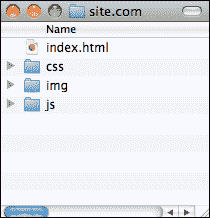
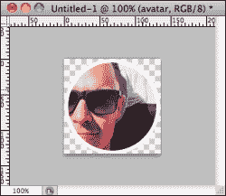
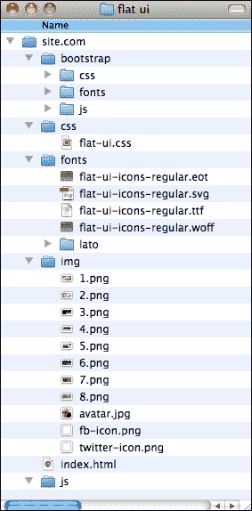
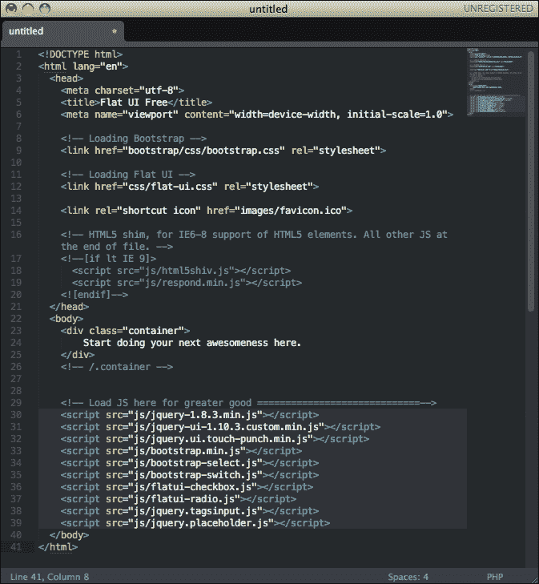
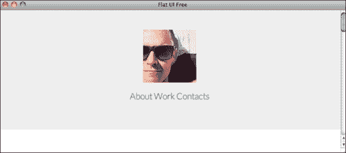
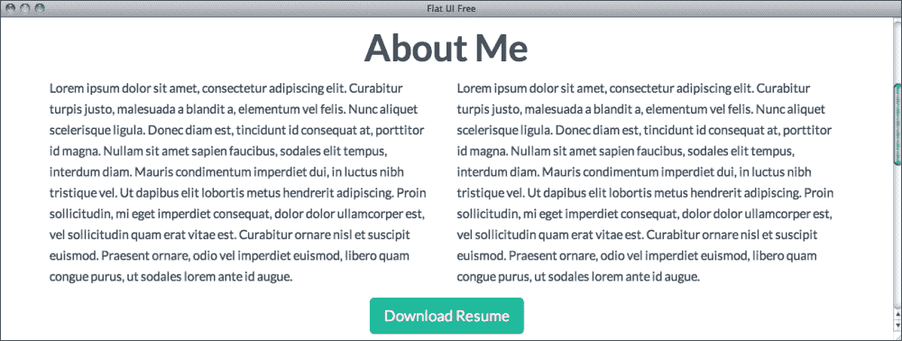
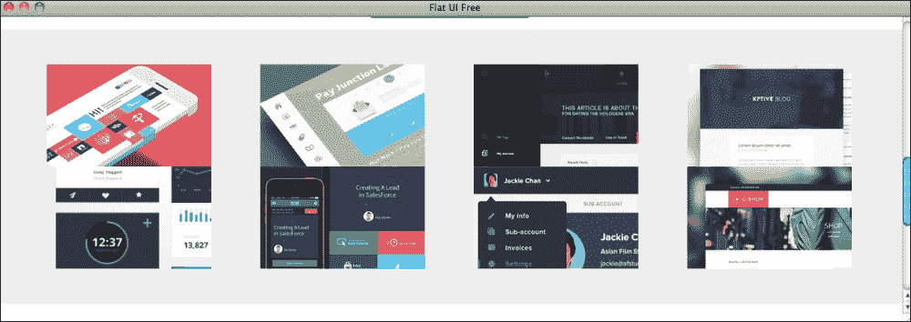
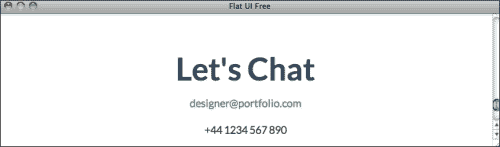
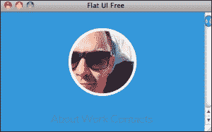
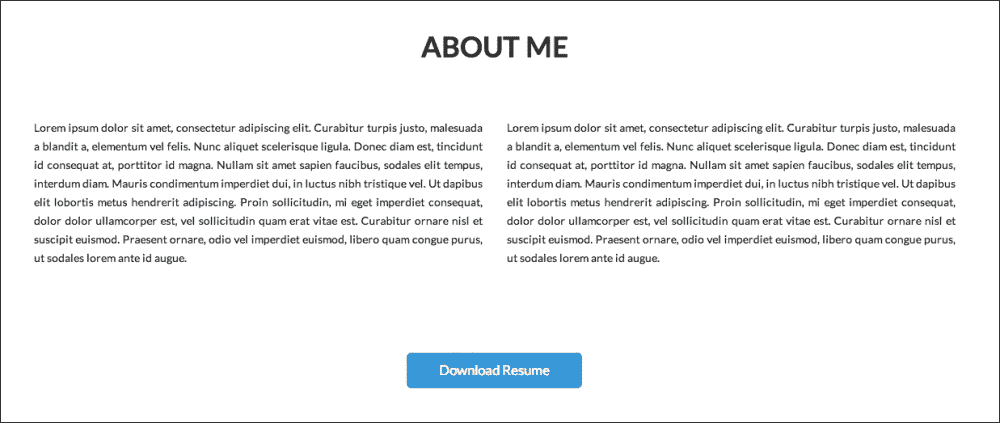

# 第五章：开发您的网站

在本章中，我们将开发我们在第四章中设计的扁平网站，*设计您自己的扁平网站*。我们将使用 Designmodo Flat UI，它是基于 Twitter Bootstrap 创建的，这是一个具有预先开发组件的前端框架，可以加快开发速度。我们还将介绍使用 jQuery 来构建我们的导航动画。

# 创建我们的文件夹树

在大型项目中，正确组织文件以及创建全面的文件结构非常重要。在较小的项目中，您可能意识不到这一点的重要性，但这是您应该从一开始就建立的习惯，这样当您在更大的项目上工作时，您就可以从一开始实施良好的实践。

这非常容易做到，而且也是您可以根据个人喜好进行调整的事情。我喜欢将我的文件组织在类别中。当我开始一个开发项目时，我最喜欢做的一件事就是创建三个文件夹：`css`，我在其中保存我的 CSS 样式文件；`img`，我保存用于构建网站的图像；`js`，我保存所有的 JavaScript 文件。在您的主文件夹的根目录中，您应该以一种可以通过使用相对路径轻松加载其余文件的方式拥有您的 HTML 文件。

这是一个非常简单的任务，但它可以帮助您以一种让您可以使用相对路径、在本地工作，并在项目结束时更轻松地将所有内容导出到服务器的方式来组织所有文件。

网站开发项目的典型文件夹树将类似于以下截图所示的内容：



现在我们已经讨论了如何开始我们的项目，让我们开始吧。但在我们开始项目的开发之前，我们需要准备好我们的图片。

# 准备我们的图片

我们开发项目的第一步是基于 Photoshop。我们需要回到我们的网站设计文件并导出我们页面所需的图片。

由于我们设计了一个如此简约的页面，我们页面中的大部分元素都是由 HTML 元素制作的，而不是由图像制作的。不过，我们仍然有一些图像，比如我们的头像和作品缩略图，所以让我们将它们导出来以便在我们的页面中使用。

关于头像，我们可以有两种方法来处理；简单的方法和正确的方法。简单的方法是将我们的圆形头像及其边框导出为带有透明背景的`.png`文件。以下截图显示了带有透明背景的`Avatar.png`文件：



通过导出一个透明的`.png`文件，我们可以轻松地在网页中使用带有任何背景颜色的图像，这将起作用，可能已经足够了。但这并不是处理这个问题的最佳方式。如果您想在网站完成后更改头像怎么办？或者如果您想更新网站颜色并更改描边颜色怎么办？那么您将需要回到 Photoshop 并重新导出这个图像，这就很麻烦了。

但幸运的是，我们可以在 HTML 中实现大部分效果，这样您就可以只使用一个普通的方形图像作为头像，让其余的工作由代码完成。这样，您只需通过更改常规头像图像或几行 CSS 代码就可以更新您的头像。此外，如果您为客户或公司做这个项目，您可以通过使更新独立于设计师工作来简化将来的更新。我们将在本书的稍后部分讨论此代码；现在，只需确保将您的头像导出为 128 x 128 像素的方形图像。这应该与以下截图中显示的内容类似：


现在，让我们导出我们的缩略图。这部分非常简单；只需确保以相同大小导出所有缩略图，以保持一致性并且更容易在将来更新。有几种方法可以做到这一点。我喜欢创建一个具有图像尺寸（225 x 141 像素）的新文档，将所有图层复制粘贴到那里，并单独保存它们。然后，我将该文档保存为任何将来使用的模板。这样，我知道每次需要创建缩略图时，我只需使用同一文档。

然而，你可以使用其他方法来实现这一点。您可以使用切片并为文档中的每个图像创建切片（键盘快捷键*C*），然后直接导出切片图像（在**保存为 Web 和设备**菜单上，您可以选择要导出的切片类型）。您还可以使用 Photoshop 中自 2013 年以来可用的名为**生成图像资产**的新功能，该功能允许您轻松将图层或文件夹重命名为文件名（例如`background.png`），然后只需选择自动生成图像文件。这是创建大型项目的多个资产的好方法，而且非常容易更新，因为资产会随着任何文件保存选项自动生成。如果您对图像资产生成器想了解更多信息，我强烈建议您参考 Adobe 帮助链接：[`helpx.adobe.com/photoshop/using/generate-assets-layers.html`](http://helpx.adobe.com/photoshop/using/generate-assets-layers.html)。

无论如何，如果您愿意，您可以继续进行此操作，但请确保保持图像大小的一致性，并以 100%的不透明度导出它们，因为如果您考虑可能使用任何一种鼠标悬停效果，我们可以并且将在以后使用 CSS 来实现。

我们还缺少的另外两个图像是 Twitter 和 Facebook 图标。对于这些图标，我们将它们保存为 32 x 32 像素的方形透明`.png`，这样如果我们希望更改页脚的背景，我们仍然可以使用它们。

我们现在已经完成了图像准备工作！

# 开发我们的页面

现在我们的图像准备好了，让我们开始创建我们的页面。就像设计一样，我们将从上到下创建，从头部开始，逐渐开发布局直到页脚。

我们将使用 Designmodo Flat UI Free 进行此操作，因此我们需要做的第一件事是导入我们将要使用的文件。如果您还没有这样做，请从[`designmodo.com/flat-free/`](http://designmodo.com/flat-free/)下载。访问该页面并单击**下载 HTML**。这将为您提供一个包含 Designmodo Flat UI Free 包、Twitter Bootstrap 3 和一些示例文件的 ZIP 文件。

因此，就像我们之前讨论的那样，让我们从创建我们的文件夹树开始。创建以下文件夹：`css`，`js`和`img`。我们还需要额外的资源，因此创建两个额外的文件夹：`fonts`，我们将保存使用的自定义字体，以及`bootstrap`，我们将保存要使用的 bootstrap 文件。

Designmodo Flat UI Free 包是建立在 Twitter Bootstrap 之上的，因此我们将有效地使用 Twitter Bootstrap 来构建此页面。Twitter Bootstrap 是一个前端框架，带有各种预先开发的元素和样式，这使得开发人员更容易更快地创建简单页面。我坚信优化工作，并且没有必要不断重新发明轮子。我们要使用的大多数东西已经做了数百次甚至数百万次，所以让我们利用共同的努力来让我们自己的生活更轻松。这就是 Twitter Bootstrap 真正方便的时候。如果您想了解更多关于 Twitter Bootstrap 并查看所有示例和指南，可以在线查看[`getbootstrap.com/`](http://getbootstrap.com/)。

现在我们已经创建了文件结构，让我们用所需的文件填充它。首先，让我们将之前从 Photoshop 导出的图像上传到`img`文件夹中。在我们的`css`文件夹中，我们将粘贴 Designmodo 包中的`flat-ui.css`文件。我们现在不会使用任何 JavaScript，所以我们不需要复制包中提供的 JavaScript 文件。将 Designmodo 包的`fonts`文件夹的内容复制到你自己的`fonts`文件夹中，并将`bootsrap`文件夹也复制并粘贴到你的`root`文件夹中。这包括 Bootstrap 使用的所有样式和资源。到目前为止，你的主文件夹应该看起来与下面的截图类似：



这包括开始创建我们的页面所需的所有文件，有了这些文件，我们终于可以开始编写 HTML 了。

打开你的 HTML 编辑器，创建一个名为`index.html`的新文件。这将是我们的网站。Designmodo 包中有一个名为`template.html`的文件，这是一个带有基本 HTML 结构的干净的起始页面，已经初始化好了，这是一个很好的基础来进行工作。所以打开文件，复制其内容，并粘贴到你的`index.html`文件中。

下面的截图显示了你在索引文件上应该有的内容：



我们可以从这里删除一些内容。favicon 部分，`<link rel="shortcut icon" href="images/favicon.ico">`，可以删除，因为我们没有为这个页面设计 favicon，以及在`<!--在这里加载 JS 以获得更好的效果=============================-->`之后加载的所有脚本都可以删除。我们将使用 JavaScript，但我们将根据需要加载文件，以避免不必要的文件占用空间。

我们现在不会创建任何 CSS 文件；我们只会专注于创建 HTML 文件，并准备好内容后再进行样式设置。由于我们使用 Twitter Bootstrap，我们将尽量通过使用 Bootstrap 的现有功能和样式来复制我们的设计，只有在那之后我们才能创建自己的样式来定制页面以满足我们的需求。

因此，要创建我们的标题，我们将需要一个填满整个浏览器宽度的`<div>`元素，以创建我们设计的视觉效果。为此，我们将使用 Bootstrap 已经提供的一个名为`jumbotron`的类。你可以在[`getbootstrap.com/examples/jumbotron/`](http://getbootstrap.com/examples/jumbotron/)上在线查看示例 Bootstrap 文件。基本上，这是一个`div`类，其宽度定义为 100%，并且拉伸以填满浏览器，并具有不同的背景颜色。这个`div`的结构如下：

```html
<div class="jumbotron">
      <div class="container">
      </div>
    </div>
```

在`<body>`标签后面插入这段代码。如果你保存并在浏览器中刷新文件，你将能够看到`Jumbotron` div 中填充浏览器的效果。现在，我们只需要在`div`容器中插入我们的内容，就像下面的代码所示：

```html
<p class="text-center" ></p>
        <p class="text-center">
            <a href="#">About</a>
            <a href="#">Work</a>
            <a href="#">Contacts</a>
        </p>
```

正如你所看到的，我们在一些元素中使用了`class="text-center"`。这是 Bootstrap 类负责将文本对齐设置为居中，它将使我们的元素居中，使其看起来有点像我们的设计标题。当然，还有一些需要改变的地方，但我们将在 CSS 中进行这些更改。下面的截图显示了当我们在浏览器中打开 HTML 文件时，我们的 HTML 文件是什么样子的：



非常接近我们想要做的事情，对吧？

现在，对于我们的“关于”部分，我们需要创建一个标题、两个文本块和一个按钮。幸运的是，这也大多是通过使用 Bootstrap 样式完成的。对于标题，我们将使用`<h2>`标签；对于文本块，我们将使用一个带有特定块类的段落，它将如下所示：`<div class="col-md-6">`。Twitter Bootstrap 带有一个实现的响应式网格系统，由 12 列组成。所以在这种情况下，我们想要创建两个占据屏幕一半的块。因此，每个块将有六列，因此使用`col-md-6`类。正如我所说的，这是一个响应式网格，这意味着网站将根据平板电脑和智能手机动态调整列的大小，以适应所使用的设备。

我们的按钮也很容易通过使用 Bootstrap 标签来实现；在这种情况下，它是平面样式，因为 Designmodo Flat UI 包。我们的按钮将如下所示：`<p class="text-center"><button class="btn btn-hg btn-primary">下载简历</button></p>`。按钮元素有`btn`类，这是负责给按钮外观的主要类；其他类是用来设置颜色和行为的。我们稍后会更改这个，以使用我们的颜色和字体选项。因此，这部分的 HTML 代码如下：

```html
   <div class="container">
      <div class="row">
        <h2 class="text-center">About Me</h2>
        <div class="col-md-6">
          <p>Text</p>
        </div>
        <div class="col-md-6">
          <p>Text</p>
        </div>
       <p class="text-center"><button class="btn btn-hg btn-primary">Download Resume</button></p>
      </div>
  </div>
```

只需将我们更大的文本块的文本替换为适应列；我们的**关于我**部分应该如下截图所示：



接下来，我们将创建我们的“工作”部分。由于这也将有一个蓝色的宽背景，我们将再次使用`jumbotron div`元素作为我们的主容器。在我们的设计中，我们有一个 2 x 4 的缩略图网格，由行和列组成 Bootstrap 网格，我们需要创建两行，每行四个缩略图。考虑 Bootstrap 中 12 列网格的工作方式，我们将需要使用*12/4 = 3*列来放置每个缩略图，我们有四个。以下是我们工作部分的最终代码：

```html
<div class="jumbotron">
      <div class="container">
        <div class="row">
          <div class="text-center col-sm-6 col-md-3">
            </div>
          <div class="text-center col-sm-6 col-md-3">
            </div>
          <div class="text-center col-sm-6 col-md-3">
            </div>
          <div class="text-center col-sm-6 col-md-3">
            </div>
        </div>
        <div class="row">
          <div class="text-center col-sm-6 col-md-3">
            </div>
          <div class="text-center col-sm-6 col-md-3">
            </div>
          <div class="text-center col-sm-6 col-md-3">
            </div>
          <div class="text-center col-sm-6 col-md-3">
            </div>
        </div>
      </div>
    </div>
```

所以，在这里你可以看到我们为背景创建了一个`jumbotron div`元素，两行`div`元素用于我们的线条，每一行都有四个带有图片的分区，这是我们的缩略图。检查我们用于这个`div`元素的类是很重要的，因为它们用于网格。使用的`div`，`<div class="text-center col-sm-6 col-md-3">`，有三个不同的类。`text-center`类用于在块中居中我们的图片；它是响应式的，会根据屏幕尺寸改变大小，我们不希望图片比原始文件大小大，因为那样会导致像素化并破坏图片质量。`col-md-3`类负责在桌面设备中对齐图像在网格中的位置，这意味着每个图像将占据三列。`col-sm-6`类是指平板设备，在平板宽度上，它将每行显示两个缩略图。这样可以创建更好的自适应体验，因为它将在桌面上每行显示四个缩略图，在平板上显示两个，在智能手机上只显示一个，这是所有设备中最小的，如下面的截图所示：



只用 Bootstrap 代码，我们就能够快速轻松地创建一个响应式的缩略图网格，我们可以用于我们的“工作”部分。

“联系”部分可能是最简单的部分，因为我们只需要创建三行内容。我们将再次使用`<h2>`元素作为标题，然后使用两个`<p>`元素来表示每行内容，如下所示的代码所示：

```html
<div class="container">
  <h2 class="text-center">Let's Chat</h2>
    <p class="text-center"><a href="mailto:designer@portfolio.com">designer@portfolio.com</a></p>
  <p class="text-center">+44 1234 567 890</p>
</div>
```

代码也很简单。我们只是使用`text-center`标签来使页面中的文本居中，然后我们在电子邮件中创建一个链接，以便访问者可以直接点击发送任何邮件。通过使用`href=mailto:designer@portfolio.com`，我们允许浏览器打开邮件程序以创建一个填充有此信息的`e-mail`字段的新电子邮件，从而更容易发送消息。这种行为在每种情况下可能都不好，因为有时默认的电子邮件程序可能没有配置，或者用户可能使用无法打开这种链接的网络邮件客户端，因此只有在您认为有意义时才使用。

以下截图显示了我们简单的联系部分的外观：



创建的最后一个元素是页脚，我们将再次使用`jumbotron div`元素。我们需要进行一些调整，以确保页脚固定在页面底部，但我们将在稍后在页面样式中进行。

因此，对于页脚，我们将创建`jumbotron div`元素，一个包含版权文本的段落，以及两个带有社交网络图标的超链接。这看起来一点也不像我们想要实现的样子，但我们的内容已经在那里，现在只需要样式来改变它的外观。以下是我们页脚的最终代码：

```html
<div class="jumbotron">
      <div class="container">
        <p>
          <span class="text-left">© 2014 Designer Name</span> 
          <a href="#"></a>
          <a href="#"></a>
        </p>
      </div>
    </div>
```

通过这最后一段代码，我们的基本 HTML 页面已经完成，准备用 CSS 进行一些样式工作。

# 用 CSS 样式化我们的页面

让我们首先在`css`文件夹中创建一个名为`main.css`的新文件。这将是我们放置自己的样式以定制页面外观的地方。有了我们的文件，现在我们需要在我们的 HTML 页面中链接我们的 CSS 文件。转到您的`index.html`文件并在`<head>`标签中添加`<link href="css/main.css" rel="stylesheet">`，并确保您在`bootsrap.css`和`flat-ui.css`之后添加它；否则，我们的样式可能会被覆盖并且不起作用。

我们将要做的第一个更改是文本颜色。因为我们希望它是我们在设计中设置的颜色，让我们将`<body>`标签中的每个元素的文本颜色设置为`#222222`。我们可以使用以下代码来实现：

```html
body{
  color: #222222;
}
```

现在，让我们从页眉开始，让我们把它的背景设为蓝色。我们将为此选择的颜色代码是`#3498db`，因为我们想要为每个`jumbotron div`元素更改这个，我们将定位`jumbotron`类，如下面的代码所示：

```html
.jumbotron{
  background-color: #3498db;
}
```

保存文件并在浏览器中刷新，您会注意到它会立即看起来更像您设计的样子，有蓝色背景部分。关于头像，我之前告诉过您我们可以在 CSS 中创建圆形头像。我们能够做到这一点是因为 CSS3，它允许我们轻松地在边框和边框半径中创建圆角。通过将边框设置为 50％，它将在每个角落创建这样的半径，从而形成一个完美的圆形。因此，请记住，这不会在每个浏览器中起作用，因为并非所有浏览器都支持 CSS3，但您应该始终使用最新的技术和技巧来充分利用它们，同时始终牢记对旧版本的优雅降级。

在这种情况下，唯一的问题是在旧版浏览器中，头像将是一个正方形而不是一个圆形。这不是一个主要问题，因为这只是一个视觉上的差异，它并不影响业务或可用性。但是回到我们的头像，我们希望它是一个圆形，并带有一个白色边框，所以我们需要在我们的 CSS 选择器中定位我们的头像。由于我们的头像只是一个``标签，我们需要回到 HTML 文件并更改我们的标签以包括一个类，比如``。现在，我们可以在我们的 CSS 中定位`.avatar`，以下是我们将用于效果的代码：

```html
.avatar{
  -webkit-border-radius: 50%;
  -moz-border-radius: 50%;
  -ms-border-radius: 50%;
  -o-border-radius: 50%;
  border-radius: 50%;
  border: solid 5px #FFF;
  display: inline-block;
}
```

这将起作用，我们的头像现在看起来与我们原始设计中的一模一样。然而，你可能会在 Safari 和其他浏览器中遇到一些问题，因为每个浏览器渲染这些元素的方式略有不同。所以，你可以做一个小改变，它仍然会起作用。不要把图片放在你的 HTML 文件中，你可以在 CSS 中将其定义为背景图片，这样就可以解决问题了。在你的 HTML 文件中，将该行改为`<p class="text-center"><span class="avatar"></span></p>`；在 CSS 文件中，添加以下参数：

```html
background: url('../img/avatar.jpg'); 
height: 128px; 
width: 128px; 
```

现在，它应该在 Safari 中也能工作了，但每次尝试新技术时，一定要检查它在哪里工作和中断，因为总有一种方法可以调整你的代码使其工作。以下截图显示了你的头像在实时 HTML 页面中的工作方式：



对于菜单，我们将使用以下代码：

```html
#header a{
  text-transform: uppercase;
  color: #ffffff;
  margin: 0 15px 0 15px;
  font-weight: bolder;
}

#menu{
  margin-top:50px;
}
```

### 提示

记住，无论是 HTML、CSS、JavaScript 还是其他任何语言，都要缩进你的代码。这样可以让你和其他人更容易阅读和快速可视化和分析更大的代码块。

正如你所看到的，我们在这个 CSS 中使用了新的 ID。`#header`类是我们在 HTML 中为整个页眉`<div>`设置的 ID，`#menu`是我们为包含菜单链接的`<p>`元素设置的 ID。随着我们进行更多的样式设置，我们需要设置类和 ID 来能够选择 HTML 文件中的特定元素。在这里，我们通过使用`text-transform`确保我们的链接是大写，并将颜色改为白色。此外，我们将字体重量改为更重的重量，以适应我们的设计。

对于“关于”部分，我们需要改变一些东西，比如标题大小、文本的字体大小，以及行高。最后，我们将使用边距和填充来确保元素之间的间距与我们设计的完全一样。这个 CSS 的一个非常重要的部分是`text-align: justify`属性，它使文本块具有与我们设计相同的文本对齐方式，使文本适应块并有助于视觉上定义布局。

我们还想改变按钮的颜色以匹配我们的调色板，所以我们通过定义`.btn`元素的背景颜色来实现这一点。这样我们就覆盖了先前使用的颜色。我们还将在鼠标悬停时改变颜色，所以我们将使用选择器`.btn:hover`来在鼠标悬停时改变元素的样式。你会注意到当你悬停在按钮上时会有一个小的淡入淡出效果，这是由 Designmodo Flat UI 包的 CSS 文件中使用的`css-transitions`产生的效果，它将这个效果应用到每个链接和按钮上。让我们使用以下代码：

```html
#about h2{
  font-size: 35px;
  text-transform: uppercase;
  margin: 70px 0 70px 0;
  color: #222222;
}

#about p.text{
  font-size: 14px;
  line-height: 1.70;
  text-align: justify;
  color: #222222;
}

#about .btn{
  margin-top: 90px;
  margin-bottom: 135px;
  background-color: #3498DB;
  font-size: 17px;
  padding: 12px 40px;
}

#about .btn:hover{
  background-color: #99CBED;
}
```

以下截图是我们设置 CSS 后“关于”部分的样子：



我们的“工作”部分在 CSS 文件上不需要太多的改变，因为它已经非常接近我们想要做的样式。所以，我们只需改变`jumbotron div`元素的背景颜色，并在元素之间留下一些边距，使它们等距分布，如下面的代码所示：

```html
#work{
  background: #99cbed;
  padding-top: 95px;
}

#work img{
  margin-bottom: 50px;
}
```

对于我们的“联系人”部分，我们的内容由一个`<h2>`标签、一个链接和电话号码的文本组成。这也很容易进行样式化，主要是颜色和文本大小的改变，以及边距设置以适应这一部分。使用以下代码来设置“联系人”部分：

```html
#contacts{
  margin-bottom: 80px; 
}

#contacts p{
  font-size: 23px;
}

#contacts h2{
  font-size: 35px;
  text-transform: uppercase;
  margin: 70px 0 35px 0;
  color: #222222;
}

#contacts a{
  color: #222222;
}

#contacts a:hover{
  color: #3498db;
}
```

最后，让我们来处理我们的页脚。目前这与我们的设计不太相似，所以我们需要通过定义其高度、缩小文本并将图标对齐到右侧来使其更小。为了对齐我们的图标，我们将使用`float: right`；我们将使用`margin`来在图标之间创建一些间距。以下是为此部分创建的 CSS 代码的一部分：

```html
#footer{
  height: 50px;
  margin-bottom: 0px;
  padding-top: 25px;
  padding-bottom: 60px;
}

#footer span{
  color: #fff;
  font-size: 11px;
}

#footer .icon{
  float: right;
  margin-left: 10px;
}
```

首先，我们需要为元素`<a href="#" class="icon"></a>`设置类图标，这样我们就可以有效地只针对这些图标并将它们对齐到同一行的右侧。这完成了我们布局页面的 CSS 工作。

通过简单的 CSS 行来对齐元素并更改一些颜色，这看起来与我们的设计非常相似。让我们来看看我们的页面现在是什么样子。它应该看起来与下面的截图类似：

使用 CSS 为我们的页面添加样式

# 使用 jQuery 进行导航

正如我们之前所说，我们可以使用幻灯片到`section`代码来创建我们的单页网站导航，这样当用户点击菜单时，页面就会滚动到该部分的开头。为了实现这种效果，我们将使用一个名为`PageScroller`的 jQuery 插件，可在[`pagescroller.com/`](http://pagescroller.com/)上找到。有两个版本：Pro 和 Lite。对于这个练习，Lite 版本就足够了，因为我们只需要最低限度的功能。我们要实现的方式也非常简单，但如果您想要更多选项，可以查看插件的`readme`文件和网站。

首先，我们需要加载所需的 JavaScript 文件。解压插件后，将`jquery.pagescroller.lite.js`文件复制并粘贴到您的`js`文件夹中。我们还需要 jQuery，但我们将从外部路径的**内容传送网络**（**CDN**）加载它。因此，请在您的`<head>`元素中包含这两行，理想情况下是在`</head>`标记之前，如下面的代码所示：

```html
<script type="text/javascript" src="img/jquery-latest.min.js"></script>
<script type="text/javascript" src="img/jquery.pagescroller.lite.js"></script>
```

这将在您的页面上加载 JavaScript 文件，但现在您需要初始化插件。

您可以通过在`document.ready` JavaScript 函数中简单调用函数`pageScroller()`来实现这一点，这意味着它只会在文档加载后启动。看一下下面的代码：

```html
  <script type="text/javascript">
  $(document).ready(function(){
    // initiate page scroller plugin
    $('body').pageScroller({
      navigation: '#menu'
    }); });
  </script>
```

脚本加载和初始化后，一切都准备就绪。因此，插件的工作方式是在特定元素上监听点击事件，当初始化时，在这种情况下，我们将其定义为我们的`#menu div`元素中的`navigation: '#menu'`。现在，它将查找`class`部分以滚动到它，因此我们需要将这个类添加到我们的标题中。

理想情况下，我们希望将其添加到容器的开头或我们部分的`<h2>`标题。以下代码显示了我们如何在 HTML 文档中定义部分：

```html
<div id="about" class="container section">
      <div class="row">
(..)
<div id="work" class="jumbotron section">
(..)
<div id="contacts" class="container section">
```

这样，我们每次通过向其添加类部分来定位我们部分的开头，并在菜单中点击时，它将滚动页面到相应的部分。试一试，你会发现它会直接滚动到菜单中点击的部分。

这种导航方式即使在更大的部分中也能更好地工作，但这是一种快速简便的方式，可以为我们的单页网站添加一个酷炫且简单的导航。

# 总结

这就是我们的开发工作！在本章中，我们使用 Designmodo Flat UI 包开发了我们的单页网站，以简化工作流程。我们实践了文件组织、图像导出和项目阶段，并学习了如何处理项目以及在更大的项目中应该考虑什么。我们还与 Twitter Bootstrap 有了第一次互动，这是 Flat UI 包的基础。我们成功地通过使用 HTML、预定义的 Bootstrap 类和自定义 CSS 样式来创建与之前完全相同的设计。我们还使用了`PageScroller`来创建我们的单页滚动导航。

接下来，让我们看看如何通过创建自己的 Flat UI 套件来创建自己的组件。
