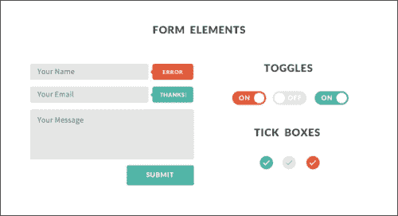
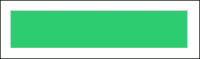
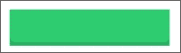
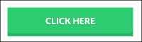
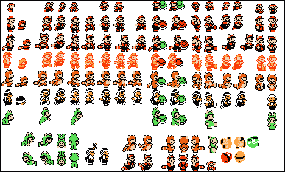
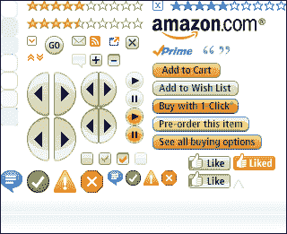
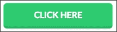
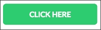
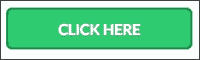

# 第六章：创建您自己的 Flat UI 套件

在这最后一章中，我们将学习如何创建自己的个人 Flat UI 套件。我们将涵盖整个过程的所有阶段，从设计到开发和导出您的资产。这些是您在创建自己的套件时需要牢记的最重要的元素。我们还将解释如何通过记录每个元素和用法来确保您或其他人的使用便捷。

# 设计您的组件

要创建自己的 Flat UI 包，第一步是定义您应该创建哪些元素。您的目标是创建并收集一组元素以便将来在项目中重复使用，因此您应该寻找大多数项目中常见的基本界面元素。例如按钮、表单控件（如单选按钮和复选框）、表单内容区域（如文本字段和文本区域）、标题样式和大小（如`<h1>`、`<h2>`和`<h3>`）一旦设计、思考和开发完成，就可以在多个项目中重复使用。通常，网页设计师发现自己在重复使用旧的 HTML 和 CSS 代码，因此创建自己的个人包对于使工作流程更加轻松和快速非常有帮助。

创建您自己的 Flat UI 包的第一阶段是设计您的元素。有几种在线设计可供 UI 包、网页元素，甚至很棒的图标包，您可以将其用作自己工作的灵感。在[dribbble.com](http://dribbble.com)上简单搜索将帮助您找到可以用作灵感的优秀元素，甚至一些免费赠品，您可以将其用作创建自己设计的基础。

以下截图显示了 Alexandre Crenn 在[dribbble.com/shots/1020321-FREE-Pack-UI-PSD](http://dribbble.com/shots/1020321-FREE-Pack-UI-PSD)上的 Flat UI 包的示例：



要创建您的包，定义您想要包含和设计的元素。列出您最需要的元素，并开始设计它们。

例如，让我们做一个练习，为您的个人包创建其中一个元素。让我们创建一个按钮，因为它是所有元素中最常用和最具视觉冲击力的元素之一，执行以下步骤：

1.  打开 Photoshop 并创建一个新的 320 x 95 像素文档。

1.  使用圆角矩形工具，创建一个半径为 8 像素、背景颜色为`#2ecc71`的矩形。输出将类似于下图所示：

1.  这次让我们创建一个更有趣的平面按钮，并赋予它一些深度。复制此图层，将其颜色更改为`#27ae60`，并向下移动 5 像素。确保这第二个矩形在图层顺序中位于我们创建的第一个矩形下方。这使得第二个矩形与其阴影一起出现在按钮的一侧。仅通过进行这种轻微的更改，您就能看到我们在按钮中产生了深度效果，如下图所示：

1.  要完成设计我们的按钮，让我们创建一个文本字段，上面写着“点击这里”。使用 Lato 字体，白色字体样式，将大小设置为 20 pt。现在，在文本图层中创建一个带有 1 像素距离和 1 像素大小的投影层样式，颜色为黑色，不透明度为 33%。

1.  现在，我们的新平面按钮已经完成，如下截图所示：

正如您所看到的，我们在文本中使用了阴影和 3D 深度效果，这是一个扁平按钮。您可能会对此感到疑惑，因为我之前曾反对使用这样的效果。事实是，只要您能明智地使用它们并以微妙的方式使用它们，您可以使用阴影甚至 3D 对象，就像在前面的图像中使用的那样。这个按钮，即使有阴影和深度，看起来仍然是扁平的，并且具有这种特征肯定更具吸引力。然而，本质上，它仍然是一个扁平按钮，而不是一个直接代表物理按钮的按钮。此外，文本中的阴影非常微妙，只是足够突出文本。与一切一样，不要对规则太苛刻；尝试用样式进行实验，看看哪种效果最好。然而，要实现极简主义，您需要能够专注于基本要素并设计干净的元素。

现在我们已经设计好了我们的按钮，我们准备将其转化为代码。由于这个按钮可以完全由 HTML 和 CSS 创建，多亏了 CSS3 的 border-radius 和 text-shadow 功能，我们不需要做任何图像导出。然而，在不同的元素中，比如单选按钮或复选框，我们需要准备这些图像。因此，我们继续进行下一步，即导出图像并编写您的元素代码。

# 导出和编码

正如我之前所说，这一步是您需要为您的包导出和准备任何图像的步骤。处理图像有几种不同的方法。无论是图标还是背景，您都应该尽量优化您的图像。减小图像大小并加快页面加载速度的一个很好的方法是使用 CSS Sprites。Sprites 最初是用于视频游戏，其中单个图像文件会有几个动画帧，然后加载这些帧，并改变图像的坐标来创建动画，就像传统动画一样。以下截图显示了超级马里奥兄弟 3 的 Sprite 表：



这种技术也用于 Web 和界面设计，通过创建按钮、图标和几种状态，并将它们包含在一个单一的图像中，然后使用 CSS 仅显示我们需要的部分来实现。有一些程序和在线应用程序可以帮助创建这些 Sprites 的 CSS 代码，这比手动计算和创建所有 CSS 代码要快得多。在线应用程序，如 Sprite Cow ([`www.spritecow.com/`](http://www.spritecow.com/))和 Sprite Right ([`spriterightapp.com/`](http://spriterightapp.com/))等软件非常有助于创建 CSS Sprites，您应该一定要看看它们，并尝试在下一个大型项目中使用 Sprites。现在，让我们回到我们的按钮。以下截图显示了来自 Amazon.com 的 Sprites：



由于我们的按钮只由代码组成，我们可以直接进行开发，而无需为此元素导出任何图像。因此，让我们直接跳转到我们的代码编辑器，并执行以下步骤：

1.  让我们首先为我们的按钮创建 HTML 代码。我们需要创建一个简单的 HTML 页面来承载按钮。创建一个名为`button.html`的新 HTML 文件，其中包含以下代码作为参考：

```html
<!DOCTYPE html>
<html lang="en">
<head>
</head>
<body>
<button class="btn">Click Here</button>
</body>
</html>
```

在这里，您可以看到我们的按钮实际上是一个`<button>`元素，带有类`class="nbtn"`。对于类，使用小的名称是很好的，因为它们小而易于识别和书写。在开发您的包时，您希望尽可能考虑如何重用您的 CSS。因此，例如，当创建按钮时，如果您想创建相同按钮的几种颜色，您应该创建一个类`btn`，然后为每种颜色创建一个类，如红色、蓝色等。这样，`btn`类将只有用于大小和外观的 CSS，您可以在单独的类中定义颜色。这意味着您可以重用`btn`类来定制和更改它以供将来使用。然后，红色按钮看起来会像`<button class=tbtn redred class=then look l>`。这只是一种思考如何在创建 CSS 时混合不同类以实现不同目标的方法。

1.  让我们回到我们的按钮。现在我们创建了我们的 HTML 文件，如果您在浏览器中打开该文件，您将看到我们的按钮完全没有样式，具有默认的浏览器外观。因此，创建了 HTML 文件后，现在是时候用 CSS 样式化这个元素了。首先，我们想为此使用自定义字体，因此请在 HTML 文件的`<head>`元素中包含以下行：`<link href='http://fonts.googleapis.com/css?family=Lato:700' rel='stylesheet' type='text/css'>`。这将加载 Lato 字体以用于我们的按钮。为了组织起见，我们将在头部创建我们的 CSS 代码，因此在`<head>`中创建一个`<style></style>`元素。

1.  为了创建按钮的外观，我们将使用以下 CSS 代码：

```html
.btn{
-moz-border-radius: 8px;
-webkit-border-radius: 8px;
border-radius: 8px;
border:none;
border-bottom: 5px solid #27ae60;
background: #2ecc71;
font-family: 'Lato', sans-serif;
text-shadow: 0 1px 2px #239a55;
font-size: 20px;
color: #ffffff;
height: auto;
margin: 0;
width: 210px;
display: block;
padding: 15px;
text-transform: uppercase;
width: 250px;
float: left;
outline: none;
}
```

因此，通过查看代码，我们将边框半径定义为 8 像素，不幸的是，由于浏览器的兼容性，我们必须包含几个浏览器前缀，以确保它在大多数浏览器中都能正常工作。我们不仅将背景颜色设置为我们选择的绿色，还设置了文本的颜色和字体以及其阴影。

1.  如果您现在刷新浏览器，您会看到我们之前使用的设计现在已经完全开发完成，包括 3D 深度。这是通过创建一个更大的底部边框`border-bottom: 5px solid #27ae60`来实现的。我们给边框设置了 5 像素的半径和更深的绿色，从而创造了按钮的深度幻觉。最后一部分`outline: none`也非常重要，因为它是取消浏览器焦点轮廓的部分，通常是蓝色的发光或蓝色的边框（取决于所使用的浏览器）。因此，通过这种方式，我们确保我们的元素没有应用任何其他类型的效果，除了我们创建的效果。

以下显示了我们的 CSS 代码中按钮的外观：



### 提示

一个很好的资源来创建您的 CSS3 代码是`css3generator.com`。它可以让您微调和可视化诸如边框半径和框阴影之类的细节。它非常适合帮助您处理几个特定于浏览器的前缀。

现在，对于不同的状态，我们的按钮在此代码中使用了以下属性：

```html
.btn:hover{
outline: none;
border: 1px solid #27ae60;
margin-top:3px;	
}

.btn:active{
outline: none;
padding-top: 16px;
padding-bottom: 14px;
-webkit-box-shadow: inset 0px 0px 5px 0px rgba(0, 0, 0, 1);
box-shadow: inset 0px 0px 5px 0px rgba(0, 0, 0, 1);
}
```

`.btn:hover`类是鼠标悬停在按钮上时发生的悬停效果。我们的目标是使其看起来好像按钮被按下，因此我们将边框改为较小的边框，以给按钮一种阴影效果，并丢失较大的底部边框。然而，由于按钮需要向下移动，我们给它一个 3 像素的上边距，使其看起来好像按钮真的被按下，如下面的截图所示：



对于活动状态，当按钮被点击时，我们希望它看起来像是从之前的状态被按下。因此，我们创建了一个内部阴影，并改变了填充，使文本下移了几个像素，刚好让用户感觉它在物理上有点下降。与之交互时，您会理解它产生的效果以及它的良好运行情况。以下截图显示了按钮处于活动状态时的情况：



至此，我们的按钮开发就完成了！它已经可以在您的包和未来的项目中使用。您还可以进一步自定义它，并根据相同的外观创建不同的尺寸。

# 文档至关重要

在创建元素和脚本时，您应该对所有内容进行文档记录。组织和文档记录非常重要，以便您可以正确地重复使用创建的元素。此外，如果您经常与更多人一起工作，您应该确保所有类都有可理解的名称。还要确保以一种任何其他人都可以随意获取和使用您的代码的方式对 CSS 和 HTML 进行注释。有时，类的名称可能不好，当您寻找特定类或尝试理解代码时，如果没有任何支持或文档，这可能是一项非常艰巨的任务。

确保您的所有代码可理解的最佳方法是使用注释。在 HTML 中，您可以通过使用封闭代码或文本注释来实现：

```html
<!-- This is a HTML comment.-->
```

在 CSS 中，您还可以按照以下方式对代码进行注释或添加自己的文本：

```html
/* This is a CSS Comment */
```

应尽可能多地使用这些。简洁地描述您的代码的功能和目标，因为在将来，您或其他人将重新访问它，并需要了解功能和目标。您还可以使用注释对更改和作者进行时间戳，以便跟踪文件的最新更新。

对于更大更复杂的项目，您可以创建完整的`readme`文件，其中包含解释元素及其设计方法的文本指南。然而，通常情况下，注释就足够了，并且更容易，因为它们直接放在工作文件中。

# 总结

在本章中，我们介绍了从元素设计到开发的创建自己的扁平化 UI 包的过程，并详细说明了如何创建文档并对未来使用进行注释。我们使用 CSS 创建了一个扁平化设计按钮，以示例化一个过程并创建包的一个资产。

这也是最后一章，随着它的结束，我们也结束了我们的书。在这里，我们涵盖了扁平化设计项目的所有阶段，重点介绍了扁平化风格的具体特点以及创建项目的简易性和影响力。从规划、草图和设计，一直到开发，您现在已经准备好创建自己的页面，您只需要继续实践，因为练习得越多，您就会变得越好。
