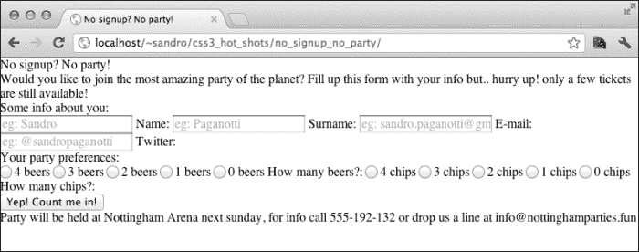
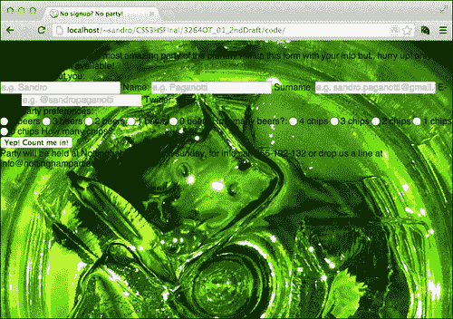
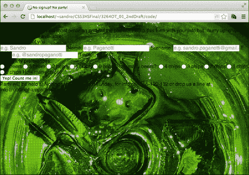
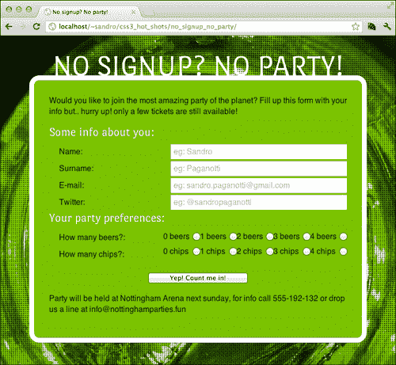
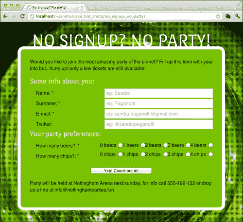
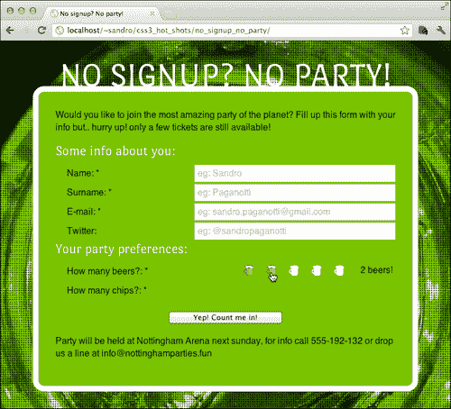
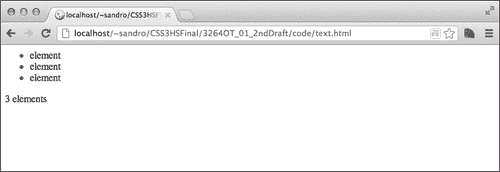
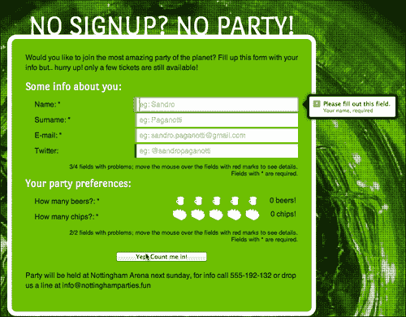
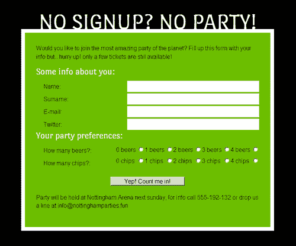

# 第一章：不注册？不派对！

CSS3 对于表单来说是一个重大的飞跃。不仅有新的样式可能性可用，而且还可以使用新的强大的伪选择器来修改我们页面的外观，这取决于表单或其字段的状态。在本章中，我们将使用一个派对注册表单作为测试案例，展示如何通过新的 CSS 规范来增强这个组件。我们还将注意如何保持旧浏览器的正确行为。我们将涵盖以下主题：

+   HTML 结构

+   表单

+   基本样式

+   标记必填字段

+   选中的单选按钮技巧

+   计算无效字段

+   气球样式

# HTML 结构

让我们从一些 HTML5 代码开始，来塑造我们项目网页的结构。为此，在一个名为`no_signup_no_party`的新文件夹中创建一个名为`index.html`的文件，其中包含以下标记：

```css
<!doctype html>
<html>
<head>
  <meta charset="utf-8">
  <meta http-equiv="X-UA-Compatible" content="IE=edge"/>
  <title>No signup? No party!</title>
  <link rel="stylesheet" type="text/css" 
href="http://yui.yahooapis.com/3.7.3/build/cssreset/cssreset-
min.css">
  <link rel='stylesheet' type='text/css' 
href='http://fonts.googleapis.com/css?family=Port+Lligat+Sans'>
  <link rel='stylesheet' type='text/css' 
href='css/application.css'>
  <script 
src="img/html5.js">
</script>
</head>
<body>
  <article>
    <header>
      <h1>No signup? No party!</h1>
      <p>
        Would you like to join the most amazing party of the 
planet? Fill out this form with your info but.. hurry up! only a 
few tickets are still available!
      </p>
    </header>
    <form name="subscription">
      <!-- FORM FIELDS -->
      <input type="submit" value="Yep! Count me in!">
    </form>
    <footer>
      Party will be held at Nottingham Arena next sunday, for info 
call 555-192-132 or drop us a line at info@nottinghamparties.fun
    </footer>
  </article>
</body>
</html>
```

### 提示

**下载示例代码**

您可以通过您在[`www.packtpub.com`](http://www.packtpub.com)账户中购买的所有 Packt 图书的示例代码文件。如果您在其他地方购买了这本书，您可以访问[`www.packtpub.com/support`](http://www.packtpub.com/support)并注册，以便直接通过电子邮件接收文件。

从标记中可以看出，我们正在利用 HTML5 提供的新结构。诸如`<article>`、`<header>`和`<footer>`之类的标签通过为内容添加语义含义来丰富页面。这些标签在语义上比`<div>`更好，因为它们解释了它们的内容。

### 注意

有关更多信息，建议您查看以下文章：[`html5doctor.com/lets-talk-about-semantics`](http://html5doctor.com/lets-talk-about-semantics)

除了口味文本之外，唯一需要详细解释的部分是`<head>`部分。在这个标签内，我们要求浏览器包含一些外部资产，这些资产将帮助我们前进。

## 重置样式表和自定义字体

首先，有一个重置样式表，这对于确保浏览器默认应用于 HTML 元素的所有 CSS 属性被移除非常有用。在这个项目中，我们使用了雅虎免费提供的样式表，基本上将所有属性设置为`none`或等效的值。

接下来，我们要求另一个样式表。这个来自谷歌服务的样式表叫做谷歌网络字体（[www.google.com/webfonts](http://www.google.com/webfonts)），它分发可以嵌入和在网页中使用的字体。自定义网络字体是用特殊的`@font-face`属性定义的，其中包含了浏览器必须实现的字体文件的链接。

```css
@font-face{
  font-family: YourFontName;
  src: url('yourfonturl.eot');
}
```

不幸的是，为了在浏览器之间达到最大可能的兼容性，需要更多的字体文件格式，因此需要更复杂的语句。以下语句有助于实现这种兼容性：

```css
@font-face{
  font-family: YourFontName;
  src: url('yourfonturl.eot');
  src: 
    url('yourfonturl.woff') format('woff'), 
    url('yourfonturl.ttf') format('truetype'), 
    url('yourfonturl.svg') format('svg');
  font-weight: normal;
  font-style: normal;
}
```

谷歌网络字体为我们提供了一个包含我们选择的字体语句的样式表，为我们节省了所有与字体转换相关的麻烦。

接下来，让我们在项目的`css`文件夹下创建一个空的样式表文件。

最后但同样重要的是，我们需要确保即使是较旧的 Internet Explorer 浏览器也能正确处理新的 HTML5 标签。`html5shiv`（[html5shiv.googlecode.com](http://html5shiv.googlecode.com)）是一个小的 JavaScript 文件，正是完成了这个任务。

# 创建表单

现在让我们通过在`<!--FORM FIELDS-->`标记下面添加以下代码来编写表单的 HTML 代码：

```css
<fieldset>
  <legend> 
    Some info about you:
  </legend>
  <input type="text" name="name" id="name" placeholder="e.g. 
Sandro" title="Your name, required" required>
  <label class="label" for="name"> Name: </label>
  <input type="text" name="surname" id="surname" placeholder="e.g. 
Paganotti" title="Your surname, required" required>
  <label class="label" for="surname"> Surname: </label>
  <input type="email" name="email" id="email" placeholder="e.g. 
sandro.paganotti@gmail.com" title="Your email address, a valid 
email is required" required>
  <label class="label" for="email"> E-mail: </label>
  <input type="text" name="twitter" id="twitter" placeholder="e.g. 
@sandropaganotti" title="Your twitter username, starting with @" 
pattern="@[a-zA-Z0-9]+">
  <label class="label" for="twitter"> Twitter:</label>
  <footer></footer>
</fieldset>
```

HTML5 提供了一些新属性，我们将简要探讨如下：

+   `placeholder`：这用于指定在字段为空时显示的一些帮助文本。

+   `required`：这用于将字段标记为必填项。这是一个布尔属性，告诉浏览器在提交表单之前确保字段不为空。该属性是新表单验证功能的一部分，基本上提供了一种在客户端指定一些输入约束的方式。不幸的是，每个浏览器以不同的方式处理`title`属性中包含的错误消息的显示，但我们将在本章稍后进行检查。

+   `pattern`：这是一种指定验证模式的强大且有时复杂的方式。它需要一个正则表达式作为值。然后该表达式将与用户插入的数据进行检查。如果失败，将显示`title`属性中包含的消息。

在给定的示例中，模式值为`@[a-zA-Z0-9]+`，表示“一个或多个出现（`+`符号）在`a-z`（所有小写字母）、`A-Z`（所有大写字母）和`0-9`（所有数字）范围内的字形”。

### 注意

更多可直接使用的模式可以在[`html5pattern.com/`](http://html5pattern.com/)找到。

就像 HTML5 引入的大多数功能一样，甚至在代码中看到的新表单属性在完全浏览器兼容性方面也存在问题。

### 注意

要了解当前浏览器对这些属性以及许多其他 HTML5 和 CSS3 功能的支持情况，建议访问[`caniuse.com/`](http://caniuse.com/)。

## 放错位置的标签

这段代码中还有另一个奇怪之处：标签放置在它们所链接的字段之后。尽管这种标记不常见，但仍然有效，并为我们提供了一些新的有趣选项来拦截表单元素的用户交互。这可能听起来神秘，但我们将在几页后详细分析这种技术。

让我们在刚刚编写的`fieldset`元素下面添加另一个`fieldset`元素：

```css
<fieldset class="preferences">
  <legend> Your party preferences: </legend>
  <input type="radio" name="beers" id="4_beers" value="4">
  <label class="beers" for="4_beers">4 beers</label>
  <input type="radio" name="beers" id="3_beers" value="3">
  <label class="beers" for="3_beers">3 beers</label>
  <input type="radio" name="beers" id="2_beers" value="2">
  <label class="beers" for="2_beers">2 beers</label>
  <input type="radio" name="beers" id="1_beers" value="1">
  <label class="beers" for="1_beers">1 beers</label>
  <input type="radio" name="beers" id="0_beers" value="0" 
required>
  <label class="beers" for="0_beers">0 beers</label>
  <span  class="label"> How many beers?: </span>
  <input type="radio" name="chips" id="4_chips" value="4">
  <label class="chips" for="4_chips">4 chips</label>
  <input type="radio" name="chips" id="3_chips" value="3">
  <label class="chips" for="3_chips">3 chips</label>
  <input type="radio" name="chips" id="2_chips" value="2">
  <label class="chips" for="2_chips">2 chips</label>
  <input type="radio" name="chips" id="1_chips" value="1">
  <label class="chips" for="1_chips">1 chips</label>
  <input type="radio" name="chips" id="0_chips" value="0" 
required>
  <label class="chips" for="0_chips">0 chips</label>
  <span class="label"> How many chips?: </span>
  <footer></footer>
</fieldset>
```

这里没有什么需要强调的；我们只是添加了两个单选按钮组。现在，如果我们尝试在浏览器中运行到目前为止所做的事情，我们将会感到失望，因为默认的浏览器样式已经被重置样式表移除了。



是时候添加一些基本样式了！

# 基本样式

我们需要做的是将表单居中，为文本选择合适的大小，选择一个背景，并调整标签和字段的位移。

让我们从背景开始。我们想要实现的是将一张尽可能大的图像放置在页面上，同时保持其比例。在“CSS2 时代”，这个简单的任务可能涉及一些 JavaScript 的使用，比如众所周知的 Redux jQuery 插件（[`bavotasan.com/2011/full-sizebackground-image-jquery-plugin/`](http://bavotasan.com/2011/full-sizebackground-image-jquery-plugin/)）。使用 CSS3 只需要几个语句：

```css
html{
  height: 100%;
  background: black;
  background-image: url('../img/background.jpg');
  background-repeat: no-repeat;
  background-size: cover;
  background-position: top left;
  font-family: sans-serif;
  color: #051a00;
}
```



这里的关键是`background-size`属性，它接受以下值：

+   `length`：使用此值，我们可以使用任何测量单位来表示背景的大小，例如`background-size: 10px 10px;`。

+   `percentage`：使用此值，我们可以指定随元素大小变化的背景大小，例如`background-size: 10% 10%;`。

+   `cover`：此值将图像按比例缩放（而不是拉伸），以覆盖整个元素的整个区域。这意味着图像的一部分可能不可见，因为它可能比容器更大。

+   `contain`：此值将图像按比例缩放（而不是拉伸），使其在容器内保持整个图像的最大尺寸。显然，这可能会导致元素的某些区域未被覆盖。

因此，通过使用`cover`，我们确保整个页面将被我们的图像覆盖，但我们可以做得更多！如果我们在浏览器中运行到目前为止所做的所有工作，我们会发现如果我们将窗口放大太多，背景图像的像素会变得可见。为了避免这种情况，我们可以在这个图像的顶部使用另一个背景图像。我们可以使用小黑点来隐藏底层图像的像素，从而获得更好的效果。

好消息是，我们可以在不使用另一个元素的情况下做到这一点，因为 CSS3 允许在同一元素上使用多个背景。我们可以使用逗号（`,`）来分隔背景，要记住的是我们首先声明的将覆盖其他背景。因此，让我们稍微改变前面的代码：

```css
html{
  height: 100%;
  background: black;
  background-image: 
    url('../img/dots.png'), 
    url('../img/background.jpg');
  background-repeat: repeat, no-repeat;
  background-size: auto, cover;
  background-position: center center, top left;
  font-family: sans-serif;
  color: #051a00;
}
```



此外，所有其他与背景相关的属性都以相同的方式起作用。如果我们省略一个值，那么将使用前一个值，因此，如果声明了两个背景图像，则写`background-repeat: repeat`与写`background-repeat: repeat, repeat`是相同的。

## 定义属性

让我们继续定义其余的必需属性，以完成项目的第一阶段：

```css
/* the main container */
article{
  width: 600px;
  margin: 0 auto;
  background: #6cbf00;
  border: 10px solid white;
  margin-top: 80px;
  position: relative;
  padding: 30px;
  border-radius: 20px;
}
/* move the title over the main container */
article h1{
  width: 600px;
  text-align: center;
  position: absolute;
  top: -62px;
/* using the custom font family provided by google */
  font-family: 'Port Lligat Sans', cursive;
  color: white;
  font-size: 60px;
  text-transform: uppercase;
}

/* the small text paragraphs */
article p, 
article > footer{
  padding-bottom: 1em;
  line-height: 1.4em;
}

/* the fieldsets' legends */
article legend{
  font-family: 'Port Lligat Sans', cursive;
  display: block;
  color: white;
  font-size: 25px;
  padding-bottom: 10px;
}

.label{
  display: block;
  float: left;
  clear: left;
}

/* positioning the submit button */
input[type=submit]{
  display:block;
  width: 200px;
  margin: 20px auto;
}

/* align texts input on the right */
input[type=text], input[type=email]{
  float: right;
  clear: right;
  width: 350px;
  border: none;
  padding-left: 5px;
}
input[type=text], 
input[type=email], 
.label{
  margin: 2px 0px 2px 20px;
  line-height: 30px;
  height: 30px;
}

span + input[type=radio], legend + input[type=radio]{
  clear: right
}

/* size of the small labels linked to each radio */
.preferences label.chips,
.preferences label.beers{
  width: 60px;
  background-image: none;
}

input[type="radio"]{
  padding-right: 4px;
}

input[type="radio"], 
.preferences label{
  float: right;
  line-height: 30px;
  height: 30px;
}
```

这里只有几件事情需要强调。首先，通过使用一些浮动，我们将所有字段移到右侧，标签移到左侧。接下来，我们定义了一些元素之间的距离。也许最神秘的陈述是以下陈述：

```css
span + input[type=radio], legend + input[type=radio]{
  clear: right
}
```

由于我们刚刚谈到的浮动，每组单选按钮的第一个元素变成了最右边的元素。因此，我们使用`selector1 + selector2`选择器来标识这个元素，该选择器表示指定的元素必须是兄弟元素。这被称为**相邻兄弟选择器**，并选择直接跟在匹配`selector1`选择器的元素后面的所有匹配`selector2`选择器的元素。最后，使用`clear:right`，我们简单地声明右侧不能有其他浮动元素。

让我们在浏览器中重新加载项目，以欣赏我们工作的结果：



# 标记必填字段

让我们来看一个简单的技巧，自动在必填字段的标签旁边显示一个星号(*)。HTML5 表单验证模型引入了一些新的和非常有趣的伪选择器：

+   `:valid`：它仅匹配处于有效状态的字段。

+   `:invalid`：它的工作方式相反，仅匹配具有错误的字段。这包括将`required`属性设置为`true`的空字段。

+   `:required`：它仅匹配带有`required`标志的字段，无论它们是否已填写。

+   `:optional`：它适用于所有没有`required`标志的字段。

在我们的情况下，我们需要匹配所有跟随具有`required`属性的字段的标签。现在我们之前实现的 HTML5 结构派上了用场，因为我们可以利用`+`选择器来实现这一点。

```css
input:required + .label:after, input:required + * + .label:after{
  content: '*';
}
```

我们添加了一个小变化（`input:required + * + .label:after`）以拦截单选按钮的结构。

在继续之前，让我们分析一下这个句子。我们使用`:after`伪选择器来访问具有`label`类的元素后面的位置。然后，使用`content`属性，我们在该位置内注入了星号。

如果我们重新加载页面，我们可以验证现在所有属于带有`required`标志字段的标签都以星号结尾。有人可能指出屏幕阅读器无法识别这种技术。为了避免这种情况，我们可以利用 WAI-ARIA 规范的`aria-required`属性（[`www.w3.org/TR/WCAG20-TECHS/ARIA2`](http://www.w3.org/TR/WCAG20-TECHS/ARIA2)）。



# 选中的单选按钮技巧

现在我们可以专注于单选按钮，但是如何以更好的方式呈现它们呢？有一个很酷的技巧；它利用了一个事实，即即使通过单击其链接的标签，也可以选中单选按钮。我们可以隐藏输入元素并样式化相应的标签，也许使用代表薯条和啤酒的图标。

让我们从单选按钮标签中删除文本并在鼠标悬停在它们上方时改变光标外观开始：

```css
.preferences label{
  float: right;
  text-indent: -100px;
  width: 40px !important;
  line-height: normal;
  height: 30px;
  overflow: hidden;
   cursor: pointer;
}
```

干得好！现在我们必须隐藏单选按钮。我们可以通过在单选按钮上放置与背景相同颜色的补丁来实现这一点。让我们这样做：

```css
input[type=radio]{
  position: absolute;
  right: 30px;
  margin-top: 10px;
}

input[type=radio][name=chips]{
  margin-top: 35px;
}

span + input[type=radio] + label, 
legend + input[type=radio] + label{
  clear: right;
  margin-right: 80px;
  counter-reset: checkbox;
}

.preferences input[type="radio"]:required + label:after{
  content: '';
  position: absolute;
  right: 25px;
  min-height: 10px;
  margin-top: -22px;
  text-align: right;
  background: #6cbf00;
  padding: 10px 10px;
  display: block;
}
```

如果我们现在尝试使用基于 WebKit 的浏览器或 Firefox 提交表单，我们会发现与单选按钮相关的验证气泡在两者上都正确显示。

## 在单选按钮标签中显示图标

让我们继续处理目前完全为空的单选按钮标签，因为我们使用`text-indent`属性将文本移开。我们现在要做的是在每个标签中放置一个微小的占位图像，并利用 CSS3 的`~`选择器，创建一个带有漂亮鼠标悬停效果的伪星级评分系统。

由于我们必须使用不同的图像（用于啤酒和薯条），所以我们必须复制一些语句。让我们从`.beers`标签开始：

```css
.preferences label.beers{
  background: transparent url('../img/beer_not_selected.png') 
no-repeat center center;
}

.preferences label.beers:hover ~ label.beers, 
.preferences label.beers:hover, 
.preferences input[type=radio][name=beers]:checked ~ label.beers{
  background-image: url('../img/beer.png');
  counter-increment: checkbox;
}
```

`elem1 ~ elem2`选择器适用于所有`elem2`标签，它们是`elem1`标签的兄弟标签，并且跟在它后面（尽管`elem2`标签不必是相邻的）。这样，我们可以使用选择器`.preferences label.beers:hover ~ label.beers`来定位跟随处于悬停状态的标签的所有标签。

使用 CSS3 的`:checked`伪类选择器，我们可以识别已选中的单选按钮，并通过应用刚讨论的相同技巧，我们可以使用`.preferences input[type=radio][name=beers]:checked ~ label.beers`来定位所有跟随已选中单选按钮的标签。通过组合这两个选择器和经典的`.preferences label.beers:hover`选择器，我们现在能够根据用户与单选按钮的交互改变占位图像。现在让我们添加一个最后的很酷的功能。我们已经使用`counter-increment`属性来跟踪所选标签的数量，因此我们可以利用这个计数器并显示它。

```css
.preferences input[type=radio][name=beers]:required + 
label.beers:after{
  content: counter(checkbox) " beers!";
}
```

让我们在浏览器中尝试一下结果：



现在，我们也必须为`.chips`标签复制相同的语句：

```css
.preferences label.chips{
  background: transparent 
url('../img/frenchfries_not_selected.png') 
no-repeat center center;
}

.preferences label.chips:hover ~ label.chips, 
.preferences label.chips:hover, 
.preferences input[type=radio][name=chips]:checked ~ label.chips {
 background-image: url('../img/frenchfries.png');
  counter-increment: checkbox;
}

.preferences input[type=radio][name=chips]:required + 
label.chips:after {
  content: counter(checkbox) " chips!";
}
```

在本章中我们所做的所有样式都有一个大问题；如果浏览器不支持 CSS3，它会成功隐藏单选按钮和文本标签，但无法添加它们的图像替换，使一切都无法使用。有几种方法可以防止这种情况发生。这里介绍的方法是使用**媒体查询**。

媒体查询将在以后的项目中详细介绍，基本上是由描述应用某些样式所需的一些条件的语句组成。让我们考虑以下例子：

```css
@media all and (max-width: 1000px){
  body{
    background: red;
  }
}
```

在这个例子中，只有当浏览器窗口的大小不超过`1000px`时，才会将 body 背景变成红色。媒体查询非常有用，可以将特定样式应用于目标设备（智能手机、平板电脑等），但它们还有另一个有趣的特性；如果浏览器支持它们，它也支持我们使用的 CSS3 规则，因此我们可以将在本节和上一节中编写的所有 CSS 都放在媒体查询语句中：

```css
@media all and (min-device-width: 1024px){

/* --- all of this and previous sections' statements --- */

}
```

通过这个技巧，我们解决了另一个微妙的问题。在 iPad 上尝试该项目，如果没有这个媒体查询语句，可能会在单选按钮上点击时出现问题。这是因为 iOS 上的标签不会响应点击。通过实现这个媒体查询，我们强制 iOS 设备回退到常规单选按钮。

# 计算和显示无效字段

在前一节中，我们使用了一些属性而没有解释它们；它们是`counter-reset`和`counter-increment`。此外，我们使用了一个类似函数的命令叫做`counter()`。在本节中，我们将通过创建一个机制来显示无效字段的数量来解释这些属性。**计数器**基本上是一个我们可以命名的变量，其值可以使用`counter-increment`来递增。接下来，这个计数器可以通过在`content`属性中使用`counter(变量名)`声明来显示。

让我们看一个小例子：

```css
<ul>
  <li>element</li>
  <li>element</li>
  <li>element</li>
</ul>
<p></p>

<style>

ul{
  counter-reset: elements;
}

li{
  counter-increment: elements;
}

p:after{
  content: counter(elements) ' elements';
}

</style>
```

尝试这小段代码会得到一个包含句子**3 个元素**的`p`元素。



我们可以将这些强大的属性与新的表单伪选择器结合起来，以获得一种显示有效和无效字段的方法。

## 实现计数器

让我们从创建两个计数器`invalid`和`fields`开始，并在每个`fieldset`元素中重置它们，因为我们想要为每个`fieldset`元素显示无效字段。然后，当我们找到一个无效字段时，我们递增两个计数器，当我们找到一个有效字段时，只递增`fields`计数器。

```css
fieldset{
  counter-reset: invalid fields;
}

input:not([type=submit]):not([type=radio]):invalid, 
input[type=radio]:required:invalid{
  counter-increment: invalid fields;
  border-left: 5px solid #ff4900;
}

input:not([type=submit]):not([type=radio]):valid, 
input[type=radio]:required{
  counter-increment: fields;
  border-left: 5px solid #116300;
}
```

`:not`伪选择器非常直观。它从括号内匹配的元素中减去左侧选择器匹配的元素。如果这看起来有点混乱，让我们试着阅读最后一个选择器：匹配所有`input`元素，其`type`值*不是*`submit`和*不是*`radio`，并响应`:valid`伪选择器。

我们快到了！现在我们有了计数器，让我们使用`footer`元素来显示它们：

```css
fieldset footer{
  clear: both;
  position: relative;
}

fieldset:not([fake]) footer:after{
  content: 'yay, section completed, move on!';
  text-align: right;
  display: block;
  font-size: 13px;
  padding-top: 10px;
}

/* the value of the content property must be on one single line */ 
fieldset > input:invalid ~ footer:after{
  content: counter(invalid) '/' counter(fields) " fields with 
problems; move the mouse over the fields with red marks to see 
details.\a Fields with * are required.";
  white-space: pre;
}
```

`:not([fake])`选择器像之前显示的媒体查询一样使用。我们只想确保只有支持`:valid`和`:invalid`伪选择器的浏览器才能解释这个选择器。

然而，这最后的添加有一些缺点；通常最好避免将演示与内容混合在一起。

# 气球样式

每个浏览器实际上以自己的方式显示表单错误，我们无法对此可视化做太多影响。唯一的例外是基于 WebKit 的浏览器，它们让我们改变这些消息的外观。以下代码显示了在这些浏览器中如何构建错误气球：

```css
<div>::-webkit-validation-bubble
  <div>::-webkit-validation-bubble-arrow-clipper
    <div>::-webkit-validation-bubble-arrow
    </div>
  </div>::-webkit-validation-bubble-message
  <div>
    <b>Browser validation message</b>
    element's title attribute
  </div>
</div>
```

我们可以通过使用前面代码中列出的特殊伪类来访问组成错误消息的所有元素。所以，让我们开始吧！

```css
::-webkit-validation-bubble{
  margin-left: 380px;
  margin-top: -50px;
  width: 200px;
}

input[type=radio]::-webkit-validation-bubble{
  margin-left: 50px;
  margin-top: -50px;
}

::-webkit-validation-bubble-arrow-clipper{
  -webkit-transform: rotate(270deg) translateY(-104px) 
translateX(40px);
}

::-webkit-validation-bubble-arrow{
  background: #000;
  border: none;
  box-shadow: 0px 0px 10px rgba(33,33,33,0.8);
}

::-webkit-validation-bubble-message{
  border: 5px solid black;
  background-image: none;
  box-shadow: 0px 0px 10px rgba(33,33,33,0.8);
}
```

通过`-webkit-transform`，我们对匹配的元素应用了一些变换。在这种情况下，我们将箭头从气球底部移动到左侧。

以下是我们完成的项目的一瞥：



# 优雅降级

正如我们所预期的，这个项目并不完全支持所有浏览器，因为它实现了 HTML5 和 CSS3 的特性，当然，这些特性不包括在旧浏览器中。存在许多技术来解决这个问题；我们现在要看的是**优雅降级**。它基本上侧重于使项目的核心功能尽可能得到广泛支持，同时接受其他一切可能不受支持，因此不会显示。

我们的项目是优雅降级的一个很好的例子：当浏览器不支持特定属性时，其效果会被简单地忽略，而不会影响表单的基本功能。

为了证明这一点，让我们在 IE8 上尝试该项目，因为它基本上不支持 CSS3：



为了实现最佳的浏览器支持，我们可能还需要在 IE9 上隐藏页脚元素和单选按钮，否则它们会被显示，但行为不如预期。为此，我们需要在`index.html`文件的`head`部分结束前添加一个条件注释。我们将在后面的章节中看到条件注释是如何工作的，但现在让我们说它们允许我们指定一些标记，只有选择的浏览器才能解释。

```css
<!--[if IE 9]>
  <style>
    footer, input[name=beers], input[name=chips]{
      display: none;
    }
  </style>
<![endif]-->
```

# 摘要

在这个第一个项目中，我们探讨了 CSS3 如何通过从标记和字段状态中获取的有用信息来增强我们的表单。在下一章中，我们将把注意力集中在按钮上，探讨如何利用渐变和其他 CSS3 属性充分模拟真实世界的形状和行为，而不使用图像。
