# 第二章：闪亮按钮

自从它们首次出现在尖端浏览器的夜间构建以来，CSS3 按钮一直被认为是一个热门话题。按钮是大多数用户界面中重要且广为人知的元素。对于 Web 开发人员而言，使它们成为热门话题的原因是 CSS3 按钮易于通过简单更改文本或样式表声明来修改。

在本章中，我们将仅使用 CSS3 创建模仿现实世界对应物的按钮。在这样做的同时，我们将探索新的 CSS 属性和技巧来实现我们的目标。我们将涵盖以下主题：

+   一个投币式按钮

+   `:before`和`:after`伪选择器

+   渐变

+   避免实验性前缀

+   阴影

+   添加标签

+   处理鼠标点击

+   CSS 中的小改变，大结果

+   一个开关

+   活动状态

+   选中状态

+   添加颜色

+   支持旧版浏览器

+   关于 CSS 渐变语法的最后说明

# 创建一个投币式按钮

在本章的第一部分，我们专注于创建一个逼真的投币式按钮。我们希望尽可能多地使用 CSS，并利用新功能而不使用图像。以下截图是结果的一瞥：

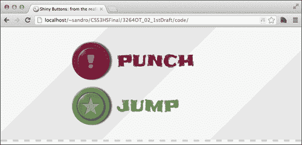

首先，让我们创建一个名为`shiny_buttons`的文件夹，我们将在其中存储所有项目文件。然后，我们需要一个填充了非常少标记的文件`index.html`：

```css
<!doctype html>
<html>
<head>
  <meta http-equiv="X-UA-Compatible" content="IE=edge"/>
  <meta charset="utf-8">
  <title>Shiny Buttons: from the reality to the web!</title>
  <link 
href='http://fonts.googleapis.com/css?family=Chango|Frijole|
Alegreya+SC:700' rel='stylesheet' type='text/css'>
  <link rel="stylesheet" type="text/css" 
href="http://yui.yahooapis.com/3.4.1/build/cssreset/cssreset-min.css">
  <link rel="stylesheet" type="text/css" 
href="css/application.css">
  <script 
src="img/html5.js"></script>
</head>
<body>
  <section>
    <article id="arcade_game">
 <a href="#" role="button" class="punch">punch</a>
 <a href="#" role="button" class="jump">jump</a>
    </article>

  </section>
</body>
</html>
```

正如标记所示，我们使用单个`<a>`元素来声明我们的按钮。锚标记可能看起来不够复杂，无法产生复杂的按钮，并且让我们相信我们需要更多的 HTML，但事实并非如此。我们可以仅使用此标记以及我们的 CSS3 声明来实现惊人的结果。

# `:before`和`:after`伪选择器

正如我们在上一章中发现的，伪选择器可以被视为元素并且可以在不需要向 HTML 页面添加额外标记的情况下进行样式化。如果我们将`<a>`元素设置为`position:relative`，并且将`:after`和`:before`都设置为`position:absolute`，我们可以使用相对于`<a>`位置的坐标来放置它们。让我们尝试通过在项目中的`css`文件夹中创建一个`application.css`文件来实现这一点：

```css
/* link */
#arcade_game a{
 display: block;
 position: relative;
  text-transform: uppercase;
  line-height: 100px;
  text-decoration: none;
  font-family: 'Frijole', cursive;
  font-size: 40px;
  width: 300px;
  padding: 10px 0px 10px 120px;
  margin: 0px auto;
  color: rgb(123,26,55);
}

/* :before and :after setup */
#arcade_game a:before, 
#arcade_game a:after{
  content: "";
 display: block;
 position: absolute;
  left: 0px;
  top: 50%;
}

/* :before */
#arcade_game a:before{
  z-index: 2;
  width: 70px;
  height: 70px;
  line-height: 70px;
  left: 15px;
  margin-top: -35px;
  border-radius: 35px;
  background-color: red; /* to be removed */
}

/* :after */
#arcade_game a:after{
  z-index: 1;
  width: 100px;
  height: 100px;
  border-radius: 50px;
  margin-top: -50px;
  background-color: green; /* to be removed */
}
```

如果我们在浏览器中加载到目前为止所做的工作，我们开始注意到一个投币式按钮的形状。两个圆，一个在另一个内部，位于标签的左侧，如下截图所示：

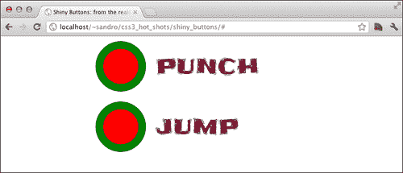

我们所做的一切是创建圆形形状，就是施加一个边框半径等于盒子尺寸的一半。干得好！现在我们可以移除绿色和红色的圆形背景，然后继续探索渐变。

# 渐变

在使用 CSS 渐变时，我们指示浏览器的布局引擎根据我们的 CSS 方向绘制图案。**渐变**对应于运行时生成的、大小独立的图像，因此可以在允许`url()`表示法的任何地方使用。有四种类型的渐变：`linear-gradient`，`repeating-linear-gradient`，`radial-gradient`和`repeating-radial-gradient`。以下渐变代码示例提供了对它们的简要概述：

```css
<!doctype html>
<html>
<head>
  <meta charset="utf8">
  <title>Explore gradients</title>

  <style>
    .box{
      width: 400px;
      height: 80px;
      border: 3px solid rgb(60,60,60);
      margin: 10px auto;
      border-radius: 5px;
      font-size: 30px;
      text-shadow: 2px 2px white;
    }

    #linear{
 background-image: linear-gradient(top left, red, white, green);
    }

    #repeating_linear{
 background-image: repeating-linear-gradient(top left, red, white, red 30%);
    }

    #radial{
 background-image: radial-gradient(center center, ellipse cover, white, blue);
    }

    #repeating_radial{
 background-image: repeating-radial-gradient(center center, ellipse cover, white, blue, white 30px);
    }

    #collapsed_linear{
 background-image: linear-gradient(left, red, red 33%, white 33%, white 66%, green 66%);
    }

    #collapsed_radial{
 background-image: radial-gradient(center center, ellipse contain, white, white 55%, blue 55%);
    }

  </style>

</head>
<body>
  <section>

    <div id="linear" class="box">linear</div>
    <div id="repeating_linear" class="box">repeating_linear</div>
    <div id="radial" class="box">radial</div>
    <div id="repeating_radial" class="box">repeating_radial</div>
    <div id="collapsed_linear" class="box">collapsed_linear</div>
    <div id="collapsed_radial" class="box">collapsed_radial</div>

  </section>
</body>
</html>
```

## 渐变语法

在前面的渐变代码示例中，很明显每个语句都包含位置信息（例如`top left`或`45deg`）和颜色步骤，这些颜色步骤可以选择性地具有指示颜色停止的值。如果两种颜色停在完全相同的位置，我们将获得一个锐利的颜色变化而不是渐变。

径向渐变允许额外的参数。特别是，我们可以选择渐变的形状，圆形和椭圆形之间，以及渐变如何填充元素的区域。具体来说，我们可以在以下选项中进行选择：

+   `closest-side`：使用此参数，渐变会扩展直到与包含元素的最近一侧相遇

+   `closest-corner`：使用此参数，渐变会扩展到达包含元素的最近一角

+   `farthest-side`：使用此参数，渐变会扩展到达包含元素的最远一侧

+   `farthest-corner`：使用此参数，渐变会扩展到达包含元素的最远一角

+   `包含`：这是`closest-side`的别名

+   `cover`：这是`farthest-corner`的别名

以下截图显示了在浏览器中执行前面代码的结果：

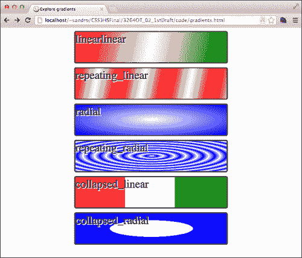

不幸的是，之前的截图并没有说明我们在 web 浏览器中运行示例代码时看到的情况。事实上，如果我们在支持 CSS3 渐变的浏览器（例如 Google Chrome）中执行之前的代码，我们得到的是一列带有黑色边框的白色框。这是因为渐变被视为实验性质的，因此需要为每个我们想要支持的浏览器添加特定的前缀（例如，`-webkit-`，`-ms-`，`-o-`和`-moz-`）。这意味着我们必须为每个想要支持的浏览器重复声明。例如，在之前代码中的`#linear`选择器中，为了实现最大的兼容性，我们应该写成：

```css
#linear{
  background-image: -webkit-linear-gradient(top left, red, white, 
green);
  background-image: -ms-linear-gradient(top left, red, white, 
green);
  background-image: -o-linear-gradient(top left, red, white, 
green);
  background-image: -moz-linear-gradient(top left, red, white, 
green);
  background-image: linear-gradient(top left, red, white, green);
}
```

# 避免实验性前缀

我们需要找到一种方法来避免编写大量重复的 CSS 代码，以实现所有现有的浏览器实验性前缀。一个很好的解决方案是由 Lea Verou 创建的 Prefix Free（[`leaverou.github.com/prefixfree/`](http://leaverou.github.com/prefixfree/)），这是一个小型的 JavaScript 库，它可以检测用户的浏览器并动态添加所需的前缀。要安装它，我们只需要在项目中的`js`文件夹中下载`.js`文件，命名为`prefixfree.js`，并在`index.html`中的`css`请求之后添加相应的脚本标签。

```css
<script src="img/prefixfree.js"></script>
```

从现在开始，我们不再需要担心前缀，因为这个库会为我们完成繁重的工作。然而，也有一些小的缺点；有些属性不会自动检测和添加前缀（例如，`radial-gradient`和`repeating-radial-gradient`不会添加`-moz-`前缀），并且我们需要忍受一个短暂的延迟，大致等于脚本下载时间，才能正确地添加前缀。

因此，让我们继续向我们的按钮添加一些渐变：

```css
#arcade_game a:before, #arcade_game a:after{
  background: gray;  /* to be removed */
}

#arcade_game a:before{
  background-image: 
    -moz-radial-gradient(7px 7px, ellipse farthest-side, 
    rgba(255,255,255,0.8), rgba(255,255,255,0.6) 3px, 
    rgba(200,200,200,0.0) 20px);
 background-image: 
 radial-gradient(7px 7px, ellipse farthest-side, 
 rgba(255,255,255,0.8), rgba(255,255,255,0.6) 3px, 
 rgba(200,200,200,0.0) 20px);
}

#arcade_game a:after{
  background-image: 
    -moz-radial-gradient(7px 7px, ellipse farthest-side, 
    rgba(255,255,255,0.8), rgba(255,255,255,0.6) 3px, 
    rgba(200,200,200,0.0) 20px), 
    -moz-radial-gradient(50px 50px, rgba(255,255,255,0), 
    rgba(255,255,255,0) 40px, rgba(200,200,200,0.1) 43px, 
    rgba(255,255,255,0.0) 50px);
 background-image: 
 radial-gradient(7px 7px, ellipse farthest-side, 
 rgba(255,255,255,0.8), rgba(255,255,255,0.6) 3px, 
 rgba(200,200,200,0.0) 20px), 
 radial-gradient(50px 50px, rgba(255,255,255,0), 
 rgba(255,255,255,0) 40px, rgba(200,200,200,0.1) 43px, 
 rgba(255,255,255,0.0) 50px);
}
```

为了专注于向我们的按钮添加新功能的主题，前面的代码没有重复现有的`application.css`中的 CSS 声明。无论我们如何应用新的指令，我们都可以追加之前的声明或合并每个选择器的属性。无论如何，结果都是一样的。

使用上述代码，我们使用径向渐变创建了两个光点，模拟了我们按钮的形状和反射。CSS3 允许我们通过支持`rgba()`符号来创建这种效果，该符号接受`0`（透明）到`1`（不透明）之间的 alpha 值。

让我们在浏览器中尝试一下结果：

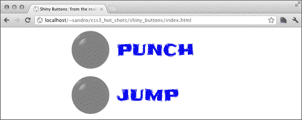

## CSS3 渐变的即将到来的语法更改

关于 CSS3 渐变的最新编辑草案（[`www.w3.org/TR/2012/CR-css3-images-20120417/`](http://www.w3.org/TR/2012/CR-css3-images-20120417/)）在提供关键字定义位置信息时引入了一个小的语法更改。因此，我们不再需要写：

```css
linear-gradient(bottom, blue, red);
```

现在我们需要写成：

```css
linear-gradient(to top, blue, red);
```

对于径向渐变的语法，还有一些更改；因此，我们之前写的：

```css
radial-gradient(center center, ellipse cover, white, blue);
```

被更改为：

```css
radial-gradient(cover ellipse at center center, white, blue);
```

不幸的是，这种新的语法在撰写本书时在各种浏览器中的支持并不好。因此，我们将继续使用旧的语法，因为它有很好的支持。

# 阴影

CSS3 中实现阴影有两个不同的属性，具有相似的语法，`box-shadow`和`text-shadow`。让我们创建另一个示例来展示它们的工作原理：

```css
<!doctype html>
<html>
<head>
  <meta charset="utf8">
  <title>Explore Shadows!</title>

  <style>
    .box{
      width: 400px;
      height: 80px;
      border: 3px solid rgb(60,60,60);
      margin: 30px auto;
      border-radius: 5px;
      line-height: 80px;
      text-align: center;
    }  
    #outset{
      box-shadow: 10px 10px 3px rgb(0,0,0);
    }
    #inset{
      box-shadow: 10px 10px 3px rgb(0,0,0) inset;
    }
    #offset{
      box-shadow: 0px 0px 0px 10px rgb(0,0,0);
    }
    #text{
      text-shadow: 10px 10px 3px rgb(0,0,0);
    }

  </style>

  <script src="img/prefixfree.js"></script>
</head>
<body>
  <section>

    <div id="outset" class="box"></div>
    <div id="inset" class="box"></div>
    <div id="offset" class="box"></div>
    <div id="text" class="box">Some text</div>

  </section>
</body>
</html>
```

实质上，`box-shadow` 和 `text-shadow` 是相似的。这两个属性都有阴影偏移（前两个参数）和模糊（第三个参数）。只有 `box-shadow` 有一个可选的第四个参数，用于控制阴影的扩散或模糊的距离。

接下来是颜色，然后，仅对于 `box-shadow` 属性，还有一个额外的关键字 `inset`，它导致阴影落在元素内部而不是外部。最后，可以用逗号（`,`）分隔定义更多阴影。

以下截图显示了在浏览器中执行上述代码的结果：

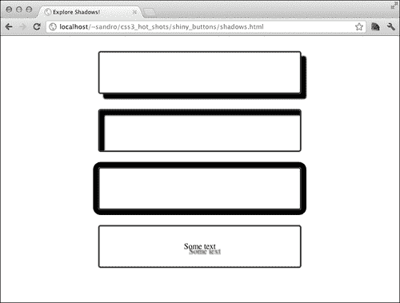

有了这些新知识，我们现在可以向我们的按钮添加更多效果。让我们在 `application.css` 中添加一些属性：

```css
/* shadows */
#arcade_game a:before{
  box-shadow: 
    0px 0px 10px rgba(0,0,80,0.7), 
    0px 0px 4px rgba(0,0,0,0.4), 3px 3px 6px rgba(0,0,0, 0.5), 
    2px 2px 1px  rgba(255,255,255,0.3) inset, 
    10px 10px 20px rgba(0,0,0,0.1) inset;
}
#arcade_game a:after{
  box-shadow: 
    1px 0px 1px rgba(0,0,0, 0.7), 
    6px 0px 4px rgba(0,0,0, 0.6), 
    0px 1px 0px rgba(200,200,200,0.7) inset, 
    2px 2px 1px  rgba(255,255,255,0.3) inset;
}
```

然后，在浏览器中重新加载项目。

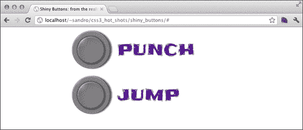

# 添加标签

每个按钮必须有自己的符号。为了获得这个结果，我们可以使用 HTML5 的 `data-*` 属性，比如 `data-symbol`。HTML5 认为所有 `data-*` 属性都是有效的，并且可以自由地由开发人员用来保存一些特定于应用程序的信息，就像在这种情况下一样。然后，我们可以使用 `content` 属性将自定义属性的值插入到按钮中。让我们看看如何做，但首先我们需要更新我们的 `<a>` 元素。所以让我们编辑 `index.html`：

```css
<a href="#" class="punch" data-symbol="!">PUNCH</a>
<a href="#" class="jump" data-symbol="★">JUMP</a>
```

### 注意

要输入黑星（★）（Unicode 字符：U+2605），我们可以从[`www.fileformat.info/info/unicode/char/2605/index.htm`](http://www.fileformat.info/info/unicode/char/2605/index.htm)复制粘贴，或者我们可以使用 Windows 中包含的字符映射。

接下来，我们需要在 `application.css` 中添加适当的说明：

```css
/* text */
#arcade_game a:before{
  font-family: 'Chango', cursive;
  text-align: center;
  color: rgba(255,255,255, 0.4);
  text-shadow: -1px -1px 2px rgba(10,10,10, 0.3);
  content: attr(data-symbol);
}
```

以下截图显示了浏览器中的结果：


事实上，我们可以通过修改 `data-symbol` 属性的值来简单地改变按钮的符号。

# 处理鼠标点击

几乎完成了！现在我们需要使按钮更具响应性。为了实现这一点，我们可以利用 `:active` 伪选择器来修改一些阴影。让我们在 `application.css` 中添加以下行：

```css
/* active */
#arcade_game a:active:before{
  background-image: none;
  box-shadow: 
    0px 0px 7px rgba(0,0,80,0.7), 
    0px 0px 4px rgba(0,0,0,0.4), 
    10px 10px 20px rgba(0,0,0,0.3) inset;
 line-height: 65px;
}

#arcade_game a:active:after{
  background-image: 
    -moz-radial-gradient(7px 7px, ellipse farthest-side, 
    rgba(255,255,255,0.8), rgba(255,255,255,0.6) 3px, 
    rgba(200,200,200,0.0) 20px),
    -moz-radial-gradient(53px 53px, rgba(255,255,255,0), 
    rgba(255,255,255,0) 33px, rgba(255,255,255,0.3) 36px, 
    rgba(255,255,255,0.3) 36px, rgba(255,255,255,0) 36px);
  background-image: 
    radial-gradient(7px 7px, ellipse farthest-side, 
    rgba(255,255,255,0.8), rgba(255,255,255,0.6) 3px, 
    rgba(200,200,200,0.0) 20px),
    radial-gradient(53px 53px, rgba(255,255,255,0), 
    rgba(255,255,255,0) 33px, rgba(255,255,255,0.3) 36px, 
    rgba(255,255,255,0.3) 36px, rgba(255,255,255,0) 36px);
}
```

通过增加 `line-height` 属性的值，我们将符号向下移动了一点，给人一种它已经被按钮按下的错觉。让我们重新加载浏览器中的项目并检查结果：

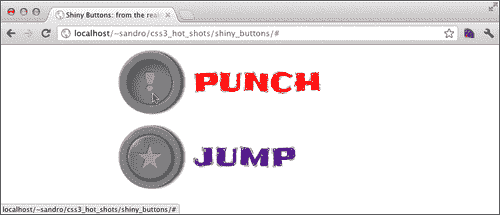

# CSS 中的小改变，大结果

我们现在已经完成了第一种按钮。在继续下一个之前，我们最好停顿一下，意识到我们编写的所有阴影和渐变基本上都是无色的；它们只是为底色添加了白色或黑色。这意味着我们可以为每个按钮选择不同的背景颜色。所以让我们在 `application.css` 中添加以下代码：

```css
 /* puch */
#arcade_game .punch:after, #arcade_game .punch:before{
  background-color: rgb(123,26,55);
}

#arcade_game .punch{
  color: rgb(123,26,55);
}

/* jump */
#arcade_game .jump:after, #arcade_game .jump:before{
  background-color: rgb(107,140,86);
}

#arcade_game .jump{
  color:  rgb(107,140,86);
}
```

以下截图显示了结果：

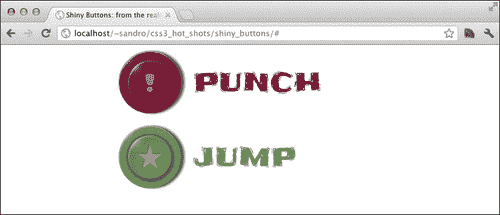

# 创建一个开关

好的，现在我们将样式一些复选框按钮，尝试匹配一些录音室按钮（"REC"）的外观。以下是最终结果的截图：

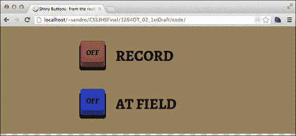

首先，让我们在 `index.html` 中添加复选框，就在之前的 `article` 元素后面：

```css
<article id="old_panel">
  <form>
    <input type="checkbox" id="rec">
    <label class="rec" for="rec">RECORD</label>
    <input type="checkbox" id="at_field">
    <label class="at_field" for="at_field">AT FIELD</label>
  </form>
</article>
```

就像在上一章中所做的那样，我们现在想隐藏 `input` 元素。让我们通过在 `application.css` 中添加几行来实现这一点：

```css
#old_panel input{
  visibility: hidden;
  position: absolute;
  top: -999px;
  clip: 'rect(0,0,0,0)';
}

#old_panel label{
  display: block;
  position: relative;
  width: 300px;
  padding-left: 125px;
 cursor: pointer;
  line-height: 140px;
  height: 130px;
  font-family: 'Alegreya SC', serif;
  font-size: 40px;
  margin: 0px auto;
  text-shadow: 1px 1px 1px rgba(255,255,255, 0.3), -1px -1px 1px 
rgba(10,10,10, 0.3);
}
```

很好！我们希望这个元素像某种按钮一样工作，所以我们使用 `cursor` 属性强制光标采用指针图标。

## 创建一个遮罩

现在我们为 `article` 元素设置了背景颜色。这对我们即将构建的内容非常重要。

```css
#old_panel{
 background: rgb(150,130,90);
  padding: 9px 0px 20px 0px;
}
```

接下来，我们关注 `:before` 和 `:after` 伪选择器：

```css
#old_panel label:before{
  content: '';
  z-index: 1;
  display: block;
  position: absolute;
  bottom: 0px;
  left: 0px;
  width: 126px;
  height: 131px;
  background-image: 
    -moz-radial-gradient(50% 50%, circle, 
    rgba(0,0,0,0.0), 
    rgba(0,0,0,0.0) 50px, 
    rgb(150,130,90) 50px);
 background-image: 
 radial-gradient(50% 50%, circle, 
 rgba(0,0,0,0.0), 
 rgba(0,0,0,0.0) 50px, 
 rgb(150,130,90) 50px);
}
```

我们现在所做的是使用渐变作为一种遮罩。实质上，我们创建了一个半径为 `50px` 的透明圆，然后我们使用背景颜色来覆盖剩余的区域。

好的，现在是棘手的部分。为了模拟按钮的形状，我们创建一个带有圆角的框，然后使用`box-shadow`属性来产生高度的错觉。

```css
#old_panel label:after{
  content: 'OFF';
  display: block;
  position: absolute;
  font-size: 20px;
  text-align: center;
  line-height: 60px;
  z-index: 2;
  bottom: 30px;
  left: 30px;
  width: 60px;
  height: 65px;
  border-radius: 7px;
  background-image: 
    -moz-radial-gradient(30px -15px, circle, 
    rgba(255,255,255,0.1), rgba(255,255,255,0.1) 60px, 
    rgba(255,255,255,0.0) 63px);
  background-image: 
    radial-gradient(30px -15px, circle, 
    rgba(255,255,255,0.1), rgba(255,255,255,0.1) 60px, 
    rgba(255,255,255,0.0) 63px);
  box-shadow: 
    0px 1px 0px rgba(255,255,255,0.3) inset, 
    0px -11px 0px rgba(0,0,0,0.4) inset, 
    -3px 9px 0px 0px black, 
    3px 9px 0px 0px black, 
    0px 10px 0px 0px rgba(255,255,255,0.3), 
    -4px 9px 0px 0px rgba(255,255,255,0.3), 
    4px 9px 0px 0px rgba(255,255,255,0.3), 
 0px 0px 0px 30px rgb(150,130,90);

  border: 
    3px solid rgba(0,0,0,0.2);
    border-bottom: 3px solid rgba(0,0,0,0.4);
  background-clip: padding-box;
}
```

阴影的最后一个声明（高亮显示的声明）也被用作遮罩。它与背景颜色相同，并且在我们刚刚创建的框周围扩展了`30px`，覆盖了我们之前用前一个渐变声明的透明区域。

这到底是什么？让我们试着用一个方案来解释一下：

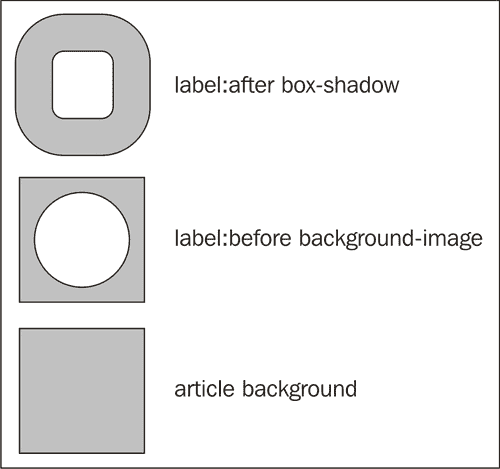

前面的图显示了我们使用的三个形状，一个在另一个上面。如果我们关闭`box-shadow`，那么在`label:before`上设置的每个颜色都将在`label:before`的`background-image`属性创建的遮罩内可见。

为了查看我们到目前为止所做的工作，让我们在浏览器中加载项目：

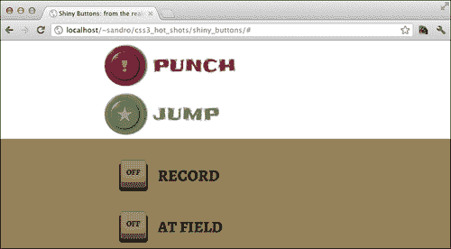

# 活动状态

现在我们需要像以前一样处理活动状态。为了模拟压力，我们降低了元素的高度，并改变了一些阴影的偏移。

```css
  #old_panel label:active:after{
    height: 54px;
    box-shadow: 
      0px 0px 0px 3px black,
      -3px 9px 0px 0px black,
      3px 9px 0px 0px black,
      0px 0px 0px 4px rgba(255,255,255,0.3),
      0px 10px 0px 0px rgba(255,255,255,0.3),
      -4px 9px 0px 0px rgba(255,255,255,0.1),
      4px 9px 0px 0px rgba(255,255,255,0.1),
      0px 0px 0px 30px rgb(150,130,90);
  }
```

让我们在浏览器中试一试：

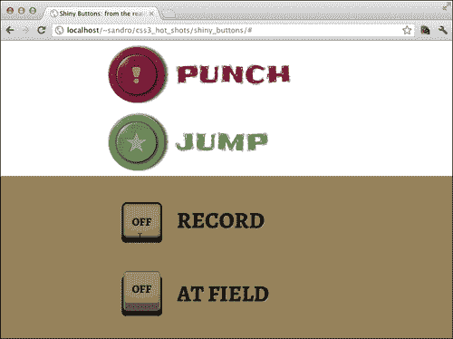

# 添加已选状态

现在，我们基本上要做的是将标签的文本从 OFF 更改为 ON，并删除`box-shadow`遮罩，以暴露我们将用来模拟从按钮传播光的背景颜色。

```css
#old_panel input:checked + label:not(:active):after{
  content: 'ON';
  background-clip: border-box;
  box-shadow: 
    0px 1px 0px rgba(255,255,255,0.3) inset, 
    0px -11px 0px rgba(0,0,0,0.4) inset, 
    -3px 9px 0px 0px black, 
    3px 9px 0px 0px black, 
    0px 10px 0px 0px rgba(255,255,255,0.3), 
    -4px 9px 0px 0px rgba(255,255,255,0.3), 
    4px 9px 0px 0px rgba(255,255,255,0.3);
}

#old_panel input:checked + label:not(:active):before{
  background-image: 
    -moz-radial-gradient(50% 57%, circle, 
    rgba(150,130,90,0.0), 
    rgba(150,130,90,0.3) 40px, 
    rgb(150,130,90) 55px);
  background-image: 
    radial-gradient(50% 57%, circle, rgba(150,130,90,0.0), 
    rgba(150,130,90,0.3) 40px, 
    rgb(150,130,90) 55px);
}
```

我们不希望在按钮仍然被按下时激活这种效果，因此我们添加了`:not(:active)`伪选择器。

# 添加颜色

让我们为每个按钮设置不同的颜色。这一次，我们需要为关闭状态和打开状态分别指定一种颜色：

```css
 /* -- record -- */
#old_panel input:checked + label.rec:not(:active):before, #old_panel input:checked + label.rec:not(:active):after{
  background-color: rgb(248,36,21);
}

#old_panel label.rec:before{
  background-color: rgb(145,67,62);
}
/* -- at field -- */
#old_panel input:checked + label.at_field:not(:active):before, #old_panel input:checked + label.at_field:not(:active):after{
  background-color: rgb(61,218,216);
}

#old_panel label.at_field:before{
  background-color: rgb(29,51,200);
}
```

以下的截图显示了结果：

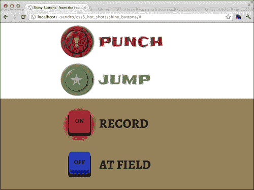

# 支持旧版浏览器

这个项目不打算在旧版浏览器上优雅地降级，因此我们需要应用一种不同的技术来检测这个项目所需的功能是否缺失，并提供一种替代的 CSS2 样式表。

为此，我们依赖于一个名为`Modernizr.js`的 JavaScript 库（[`modernizr.com/`](http://modernizr.com/)），它显示了每个 HTML5/CSS3 功能的方法。这些方法根据所需功能的存在与否简单地返回`true`或`false`。然后，我们将使用`Modernizr.js`中包含的一个小库，称为 yepnope.js（[`yepnopejs.com`](http://yepnopejs.com)），动态选择我们想要加载的样式表。

首先，我们需要下载这个库。为此，我们必须在下载页面[`modernizr.com/download/`](http://modernizr.com/download/)上标记对应于我们想要测试的功能的复选框，然后点击**Generate**按钮，然后点击**Download**按钮，将文件保存为`modernizr.js`，保存在我们项目的`js`文件夹下。

好的，现在我们需要在我们的`index.html`文件的`<head>`标签中做一些更改，以使这个新技巧起作用。新的`<head>`部分如下所示：

```css
<head>
  <meta charset="utf8">
  <meta http-equiv="X-UA-Compatible" content="IE=edge" />
  <title>Shiny Buttons: from the reality to the web!</title>
  <link 
href='http://fonts.googleapis.com/css?family=Chango|Frijole|Alegre
ya+SC:700' rel='stylesheet' type='text/css'>
  <link rel="stylesheet" type="text/css" 
href="http://yui.yahooapis.com/3.4.1/build/cssreset/cssreset-
min.css">
  <script 
src="img/html5.js"></script>
  <script src="img/modernizr.js"></script>
 <script>
 yepnope({
 test : Modernizr.borderradius && Modernizr.boxshadow && 
Modernizr.multiplebgs && Modernizr.cssgradients, 
 yep  : ['css/application.css','js/prefixfree.js'], 
 nope : 'css/olderbrowsers.css'
 });
 </script>

</head>
```

我们只需要记住创建一个`css/olderbrowsers.css`文件，其中包含一些 CSS2 指令，用于为旧版浏览器样式化这些元素，例如以下指令：

```css
#arcade_game a{
  display: block;
  margin: 20px auto;
  width: 200px;
  text-align: center;
  font-family: 'Frijole', cursive;
  font-size: 40px;
  color: white;
  text-decoration: none;
}

/* puch */
#arcade_game .punch{
  background-color: rgb(123,26,55);
}

/* jump */
#arcade_game .jump{
  background-color: rgb(107,140,86);
}

#old_panel{
  text-align: center;
}

#old_panel label{
  font-family: 'Alegreya SC', serif;
  font-size: 40px;
}
```

我们还必须考虑，仅依赖 JavaScript 有时可能是一个危险的选择，因为我们没有提供非 JavaScript 的替代方案。一个简单的解决方法可能是将`olderbrowsers.css`设置为默认样式表，然后仅在所需的 CSS3 属性得到支持时动态加载`application.css`。

然而，为了这样做，我们必须在`application.css`中添加一些行来避免`olderbrowsers.css`的属性：

```css
/* === [BEGIN] VOIDING BASE CSS2 === */

#arcade_game a{
  background-color: transparent !important;
  width: 300px !important;
  text-align: left !important;
}

#old_panel{
  text-align: left !important;
}

/* === [END] VOIDING BASE CSS2 === */
```

最后，我们可以按照以下方式更改我们之前的 HTML 代码：

```css
<link rel="stylesheet" type="text/css" 
href="css/olderbrowsers.css">
<script>
  yepnope({
    test : Modernizr.borderradius && Modernizr.boxshadow && 
Modernizr.multiplebgs && Modernizr.cssgradients, 
    yep  : ['css/application.css','js/prefixfree.js']
  });
</script>
```

# 支持 IE10

Internet Explorer 10 支持该项目中展示的所有 CSS 特性。然而，我们不得不面对一个事实，即 Prefix Free 在`radial-gradient`符号上没有添加`-ms-`实验性前缀。这并不是一个大问题，因为我们的按钮即使没有渐变也能正常工作，除了我们在 ON/OFF 开关中用作蒙版的`radial-gradient`符号。为了解决这个问题，我们可以在`application.css`中添加以下行：

```css
#old_panel label:before{
  background-image: 
  -ms-radial-gradient(50% 50%, circle, 
  rgba(0,0,0,0.0), 
  rgba(0,0,0,0.0) 50px, 
  rgb(150,130,90) 50px);
}
```

# 总结

这个项目详细介绍了渐变和阴影，演示了如何利用一小组 HTML 元素来实现惊人的效果。

在进入下一章之前，了解一下在线渐变生成器可能会很有用，它们可以让我们使用友好的 UI 来组合渐变，然后提供正确的 CSS 语法以包含在我们的样式表中。它们可以在[`www.colorzilla.com/gradient-editor/`](http://www.colorzilla.com/gradient-editor/)、[`www.cssbuttongenerator.com/`](http://www.cssbuttongenerator.com/)和[`css3generator.com/`](http://css3generator.com/)找到。

在下一章中，我们将学习如何通过创建一个在桌面和智能手机上都能工作的菜单来处理多个设备的可视化。
