# 第三章：Omni 菜单

使用媒体查询，我们可以在满足某些设备或视口要求时激活或停用 CSS 指令。当我们需要处理需要根据用户设备具有不同表示的元素时，这是非常有用的。菜单通常就是这样的一个元素。在本章中，我们将开发一个主菜单系统，可以在桌面浏览器和移动设备上完美显示；我们可以称之为 Omni 菜单。我们将涵盖以下主题：

+   设置操作

+   第一级

+   第二级

+   移动部件

+   基本过渡

+   介绍动画

+   添加一些颜色

+   媒体查询

+   移动版本

+   提高速度

在下一节中，我们将开始创建一个基本的 HTML 菜单结构。通常情况下，我们可以将项目的所有文件存储在一个以项目名称（在本例中为`omni_menu`）命名的文件夹中。在开始之前，让我们先看一下最终结果的截图：

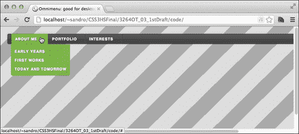

# 设置操作

要为菜单设置样式，我们需要先定义标记。让我们编写一个小的 HTML 文件`index.html`，在其中我们将使用`li`和`ul`项目定义一个经典的两级菜单结构。接下来，我们将在转到本章的核心部分之前添加一些基本的 CSS。

```css
<!doctype html>
<html>
<head>
  <meta charset="utf-8">
  <meta http-equiv="X-UA-Compatible" content="IE=edge" />

  <title> Omnimenu: good for desktop, good for mobile </title>

 <link rel="stylesheet" type="text/css" 
href="http://yui.yahooapis.com/3.7.3/build/cssreset/
cssreset-min.css" data-noprefix>

  <link rel="stylesheet" type="text/css" 
href="css/application.css">

  <script src="img/prefixfree.js"></script>
</head>
<body>
  <nav>
    <ul>
      <li data-section="about-me">
        <a href="#" class="item"> About me </a>
        <ul>
          <li><a href="#" class="item">Early years</a></li>
          <li><a href="#" class="item">First works</a></li>
          <li><a href="#" class="item">Today and tomorrow</a></li>
          <li class="cursor"><a href="#" class="item"> back </a>
          </li> 
        </ul>
      </li>
      <li data-section="portfolio">
        <a href="#" class="item"> Portfolio </a>
        <ul>
          <li> <a href="#" class="item"> Design </a> </li>
          <li> <a href="#" class="item"> Articles </a> </li>
          <li class="cursor"> <a href="#" class="item"> back </a>
          </li>
        </ul>
      </li>
      <li data-section="interests">
        <a href="#" class="item"> Interests </a>
        <ul>
          <li> <a href="#" class="item"> Skying </a> </li>
          <li> <a href="#" class="item"> Snowboarding </a> </li>
          <li> <a href="#" class="item"> Wakeboarding </a> </li>
          <li class="cursor"> <a href="#" class="item"> back </a>
          </li>
        </ul>
      </li>
      <li class="cursor"></li>
    </ul>
  </nav>

</body>
</html>
```

我们利用新的`data-*`属性来语义化地增强菜单第一级中的项目。我们稍后还将看到这些属性如何帮助我们更好地样式化这个结构。

现在让我们打开`application.css`，定义一个基本的 CSS 结构来居中这个菜单并添加一个漂亮的背景。对于项目的这一部分，我们不关注移动布局，所以我们可以使用经典的 960 像素方法：

```css
/* === [BEGIN] Style === */
html{
  height: 100%;
}

body{
 background-image: repeating-linear-gradient(315deg, #ddd, #ddd 
40px, #aaa 40px, #aaa 80px);
  padding: 20px;
  height: 100%;
}

nav{
  margin: 0 auto;
  width: 960px;
  font-family: sans-serif;
  font-size: 0.6em;
  background-color: rgb(86,86,86);
  background-image: linear-gradient(bottom, rgb(75,75,75), 
rgb(86,86,86));
  border-radius: 4px;
  box-shadow: 0 0 10px rgba(0,0,0,0.1), 0 -1.5em 0 rgba(0,0,0,0.1) 
inset, 0 1px 1px 1px rgba(0,0,0,0.1) inset;
}

nav > ul{
  padding: 0 10px;
}

/* === [END] Style === */
```

上述代码中的高亮部分定义了一个折叠的渐变，以获得条纹背景。接下来我们将`nav`元素的大小定义为`960px`，并在其上添加一些漂亮的渐变、阴影和边框半径。

如果我们在支持 CSS3 的浏览器中加载项目，我们可以查看我们的第一个样式效果：

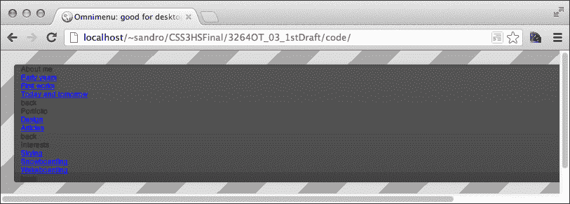

# 样式化第一级项目

许多两级菜单的典型格式是在同一行上水平显示第一级项目，然后隐藏第二级项目。我们将添加一些 CSS 代码到`application.css`中来实现这一点，如下所示：

```css
nav > ul > li{
 display: inline-block;
  vertical-align: top;
  line-height: 3em;
  width: 100px;
  z-index: 2;
  position: relative;
  border-left: 1px solid #313131;
  box-shadow: 1px 0 1px rgba(255,255,255,0.1) inset, -1px 0 1px 
rgba(255,255,255,0.1) inset;
}

nav > ul > li:nth-last-child(2){
  border-right: 1px solid #313131;
}

nav > ul > li > ul{
  position: absolute;
  left: -1px;
  top: 3em;
  clip: rect(0,0,0,0);
  opacity: 0;
}
```

## 使用 inline-block 显示

在上述代码中，我们使用了`display: inline-block`而不是通常使用的浮动元素。这两个属性通常用于将元素内联对齐，但不同之处在于`display: inline-block`不会破坏页面流，并且可以节省我们使用`clearfix`。然而，使用`display: inline-block`属性也有一个缺点。让我们在一个小的演示中看看：

```css
<!doctype html>
<html>
  <head>
    <title>inline-block demo</title>
    <style>
      div{
        display: inline-block;
        width: 100px;
        border: 1px solid black;
        height: 30px;
        line-height: 30px;
        text-align: center;
      }
    </style>
  </head>
  <body>
    <div> ONE </div>
    <div> TWO </div>
    <div> THREE </div><div> FOUR </div>
  </body>
</html>
```

如果我们在浏览器中加载我们的演示页面，结果如下：

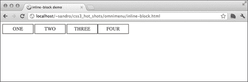

您会注意到**THREE**和**FOUR**之间没有空格，但**ONE**、**TWO**和**THREE**之间有空格。为什么会这样？这是因为`display: inline-block`考虑了 HTML 标记中元素之间的空格。为了避免这个问题，我们将确保在每个元素之间有一致的空格或换行。

## 使用新的伪选择器

现在，让我们转到下一个有趣的指令：`nth-last-child(2)`。这是 CSS3 引入的许多新伪选择器之一。使用`nth-last-child(n)`，我们可以定位从最后开始计数的第`n`个元素，而使用`nth-child(n)`，我们可以从顶部开始做同样的事情。这两个伪选择器也可以用来通过某种模式选择元素。例如，假设我们只想突出显示以下列表的偶数元素：

```css
<ul>
  <li>1</li>
  <li>2</li>
  <li>3</li>
  <li>4</li>
  <li>5</li>
  <li>6</li>
</ul>
```

我们可以通过以下简单的 CSS 代码实现这一点：

```css
li:nth-child(2n){
  background: yellow;
}
```

如果我们想要只针对索引大于三的元素进行目标定位，我们可以使用以下 CSS：

```css
li:nth-child(n+4){
  background: yellow;
}
```

以下截图显示了上一个示例的结果：

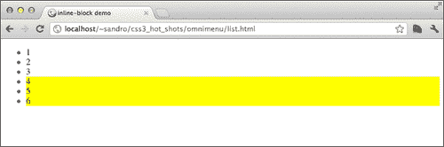

## 完成第一级

我们仍然需要添加一些 CSS 属性来完成我们第一级元素的样式：

```css
nav .item{
  color: #fff;
  text-shadow: 1px 1px 0 rgba(0,0,0,0.5);
  text-decoration: none;
  font-weight: bold;
  text-transform: uppercase;
  letter-spacing: 0.2em;
  padding-left: 10px;
  white-space: nowrap;
  display: block;
  cursor: pointer;
}
```

干得好！现在让我们在支持 CSS3 的浏览器中运行项目，以欣赏结果：

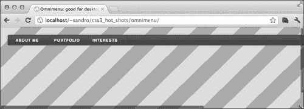

# 样式化子菜单

现在我们必须为第二级项目设置样式。好吧，说实话，我们在上一节中已经隐藏了它们，以获得漂亮的一级样式，但现在我们可以用更多的属性丰富第二级元素，并确保当用户将鼠标悬停在它们的一级父级上时它们会显示出来。

让我们从刚讨论的最后一部分开始。为了显示第二级元素，我们必须使用`:hover`伪选择器：

```css
nav > ul > li > .item:hover + ul, 
nav > ul > li > ul:hover{
  clip: auto;
  /* temporary property, to be removed */
  opacity: 1;
}
```

我们拦截了父级和所有子级的悬停，以便即使鼠标移动到它们上面，第二级菜单仍然显示。完成后，我们可以开始一些基本的样式：

```css
nav > ul > li > ul{
  padding: 0.7em 0px;
  border-bottom-left-radius: 5px;
  border-bottom-right-radius: 5px;
  border-top: none;
 background-color: rgb(117,189,70);
 background-color: rgba(119,172,48, 0.8);
  background-image: linear-gradient(left, rgba(117,189,70,1), 
rgba(117,189,70, 0.0));
}

nav > ul > li > ul > li > .item{
  text-align: left;
  min-width: 100px;
  padding: 0px 10px;
  line-height: 2.5em;
}

nav > ul > li > ul > li{
  display: block;
  position: relative;
  z-index: 4;
}
```

这里只有一件小事要强调。在上一段代码的突出部分中，有一个简单的回退机制，用于不支持 CSS3 的浏览器。如果我们首先声明一个`rgb 背景颜色`值，然后是一个`rgba`值，我们可以确保不支持 CSS3 的浏览器应用`rgb`指令并跳过`rgba`指令，而支持 CSS3 的浏览器则用`rgba`指令覆盖`rgb`指令。

好了，是时候在我们首选的 CSS3 浏览器中重新加载项目并测试结果了：

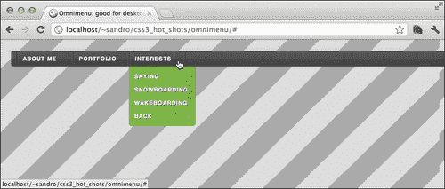

在接下来的部分，我们将添加一些基本的 CSS 以响应鼠标移动。例如，当鼠标放在其父级一级菜单上时激活特定的子菜单。

# 移动部分

我们在第一级和第二级末尾添加了一个（尚未使用的）`<li class="cursor">`元素。我们想要创建的是一个能够在鼠标悬停在其上时移动到元素下方的块。这是一个很好的效果，为了实现它，我们将使用 CSS3 过渡。但首先让我们创建相同的效果，但没有动画：

```css
nav > ul{
  position: relative;
}

nav li.cursor{
  position: absolute;
  background-color: #75BD46;
  text-indent: 900px;
  border: none;
  height: 3em;
  z-index: 1;
  left: 11px;
  clip: rect(0,0,0,0);
  box-shadow: 
    0px 0px 10px rgba(0,0,0,0.1), 
    0px -1.5em 0px rgba(0,0,0,0.1) inset, 
    0px 1px 1px 1px rgba(0,0,0,0.1) inset;
}
nav li.cursor a{
  display: none;
}

nav > ul > li > ul > li.cursor{
  height: 2.5em;
  left: 0px;
  width: 100%;
  bottom: 0.7em;
  box-shadow: none;
  background-image: none;
  background-color: rgb(165,204,60);
  background-color: rgba(165,204,60,0.7);
  z-index: 3;
}

nav > ul li:hover ~ li.cursor{
 clip: auto;
}

nav > ul > li:hover + li + li + li.cursor{
  left: 11px;
}

nav > ul > li:hover + li + li.cursor{
  left: 112px;
}

nav > ul > li:hover + li.cursor{
  left: 213px;
}

nav > ul > li > ul > li:hover + li + li + li.cursor{
  bottom: 5.7em;
}

nav > ul > li > ul > li:hover + li + li.cursor{
  bottom: 3.2em;
}

nav > ul > li > ul > li:hover + li.cursor{
  bottom: 0.7em;
}

nav li.cursor .item{
  display: none;
}
```

突出显示的代码显示了我们用来切换`.cursor`元素可见性的特殊选择器。基本上，如果鼠标悬停在前面的`li`元素之一上，我们就显示它。

接下来，我们必须定义`.cursor`元素的绝对位置，这显然取决于我们正在悬停的`li`元素。为了实现这种行为，我们使用`+`选择器来精确地将光标移动到元素下方。对于第二级元素也是如此。

如果我们在浏览器中运行项目，可能会感到失望。效果与仅使用`:hover`伪选择器改变`li`背景的效果完全相同。

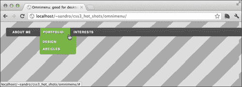

好了，是时候添加我们隐藏的成分：过渡效果了。

# 添加过渡效果

过渡背后的逻辑简单而强大。我们可以指示浏览器在两个不同的属性值之间创建动画。就是这样！我们可以使用`transition`属性来指定当另一个 CSS 属性发生变化时（例如`width`），元素不应立即从一个值切换到另一个值，而是花费一定的时间，从而在两个值之间创建动画。以下示例说明了这种效果：

```css
<!doctype html>
<html>
  <head>
    <title>basic animation</title>
    <style>
      a{
        display: block;
        width: 300px;
        line-height: 100px;
        height: 100px;
        text-align: center;
        font-size: 50px;
        font-family: sans-serif;
        font-weight: bold;
        color: black;
        border: 10px solid black;
        text-decoration: none;
 transition: all 1s;
 -ms-transition: all 1s;
      }
      a:hover{
        color: red;
      }
    </style>
 <script src="img/prefixfree.js"></script>
  </head>
  <body>
    <a href="#"> HOVER ME </a>
  </body>
</html>
```

`all`关键字告诉浏览器在所有支持过渡的属性上从一个属性变化到另一个属性时花费一秒钟。在这种情况下，当我们悬停在`a`元素上时，`color`属性从`black`变为`red`，但不是立即变化；相反，它在一秒钟内覆盖了从黑色到红色的所有颜色，产生了一个非常酷的效果。

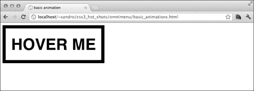

我们可以用很多其他属性和很多其他方式来做这个技巧，正如我们将在本书的后面章节中看到的那样。目前，我们可以利用我们所学到的知识来增强我们的项目。让我们在`application.css`中添加一个`transition`语句：

```css
nav li.cursor{
  -ms-transition: all 1s;
  transition: all 1s;
}
```

通过这个简单的属性，我们获得了一个全新的结果。现在每当我们悬停在一个元素上时，光标都会以非常平滑的动画移动到该元素下方。

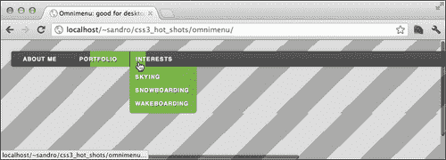

### 注意

在撰写本书时，`prefixfree.js`不支持 Internet Explorer 10 中的转换和动画。因此，我们必须记住添加带有`-ms-`实验性前缀的转换属性的副本。这很可能会在将来发生变化，这既是因为微软将删除实验性供应商前缀的需要，也是因为这个 JavaScript 库的新版本。

现在我们必须处理另一个问题。二级菜单出现得太早，效果不佳。我们如何延迟其出现，直到`.cursor`元素在`li`元素下方达到正确位置？我们将在下一节中看到这一点。

# 引入动画

动画是一步向前的转换。通过它们，我们可以详细控制一个或多个属性之间的过渡。动画由一组关键帧组成，其中每个关键帧基本上是声明我们选择的属性在动画的特定进度百分比时必须具有哪些值的一种方式。让我们通过以下示例来探索这个特性：

```css
<!doctype html>
<html>
  <head>
    <title>basic animation</title>
    <style>
      div{
        position: absolute;
        top: 0px;
        left: 0px;
        width: 100px;
        height: 100px;
        border: 10px solid black;
        background-color: red;
        text-decoration: none;
        -ms-animation: fouredges 5s linear 2s infinite alternate;
 animation: fouredges 5s linear 2s infinite alternate;
      }

      @-ms-keyframes fouredges{
        0%   { top: 0px; left: 0px;}
        25%  { top: 0px; left: 100px;}
        50%  { top: 100px; left: 100px;}
        75%  { top: 100px; left: 0px;}
        100% { top: 0px; left: 0px;}
      }

 @keyframes fouredges{
 0%   { top: 0px; left: 0px;}
 25%  { top: 0px; left: 100px;}
 50%  { top: 100px; left: 100px;}
 75%  { top: 100px; left: 0px;}
 100% { top: 0px; left: 0px;}
 }

    </style>
    <script src="img/prefixfree.js"></script>
  </head>
  <body>
    <div></div>
  </body>
</html>
```

通过`@keyframes`语句，我们定义了在从`0%`到`100%`的过程中我们选择的一些属性的值。一旦这样做了，我们就可以使用`animation`属性以一些参数来定义，如下所示：

+   第一个参数：它指定我们要在元素上执行的动画的名称（例如，在上面的代码中是`fouredges`）。

+   第二个参数：它指定我们希望动画在单个循环中进行的总时间。

+   第三个参数：它指定加速函数。基本上，我们可以决定元素是否应该以恒定的速度移动（使用关键字`linear`）或者在动画的开始或结束阶段加速（使用`ease-in`、`ease-out`或`ease`）。

+   第四个参数：它指定我们希望应用于动画开始的延迟。

+   第五个参数：它指定我们希望动画重复的次数。`infinite`是这个参数的有效值，以及正数。

+   第六个参数：使用关键字`alternate`，我们可以要求浏览器切换动画的方向。换句话说，动画将首先从`0%`到`100%`，然后从`100%`到`0%`，再次循环。

如果我们在浏览器中尝试刚刚写的例子，我们会看到一个正方形沿着四个顶点路径移动：

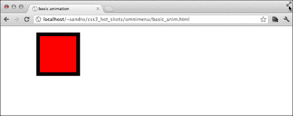

嗯，听起来很有趣，但这如何帮助我们的项目呢？简单！我们可以使用延迟动画（带有一些延迟的动画）来创建二级菜单的淡入效果。所以让我们移除之前添加的`opacity: 1`临时属性，并在`application.css`中添加一些 CSS：

```css
nav > ul > li > .item:hover + ul, 
nav > ul > li > ul:hover{
 animation: fadein 0.1s linear 0.9s;
  -ms-animation: fadein 0.1s linear 0.9s;
 animation-fill-mode: forwards;
  -ms-animation-fill-mode: forwards;
}

@keyframes fadein{
  1% {
    opacity: 0.0;
  }

  100% {
    opacity: 1.0;
  }
}

@-ms-keyframes fadein{
  1% {
    opacity: 0.0;
  }

  100% {
    opacity: 1.0;
  }
}
```

`animation-fill-mode: forwards`属性告诉浏览器在动画结束时不要恢复到`0%`，而是保持`100%`位置。

有了这些新的附加功能，我们现在可以在浏览器中尝试一个几乎完整的桌面版本。享受光标动画和二级菜单的淡入效果。

然而，通过上面的代码，我们已经移除了不支持 CSS3 动画的浏览器的支持，特别是 IE9 及以下版本。为了解决这个问题，有很多技术，其中大部分将在本书的过程中揭示。我们将实现的第一种技术是通过用稍微复杂一些的东西替换`<html>`标签，如下所示：

```css
<!--[if lte IE 9]> <html class="lteie9"> <![endif]-->
<!--[if !IE]> --> <html> <!-- <![endif]-->
```

通过使用条件注释，我们现在可以确定用户是否使用 IE9 或更低版本浏览我们的网站，因为新的`.lteie9`类被添加到`html`元素中。

因此，我们可以向我们的 CSS 文件添加一小段代码，只有在`.lteie9`存在时才会触发：

```css
.lteie9 nav > ul > li > .item:hover + ul, 
.lteie9 nav > ul > li > ul:hover{
  opacity: 1;
}
```

# 添加颜色

我们可以根据鼠标悬停在哪个元素上轻松更改`.cursor`元素的颜色。由于我们的`transition: all 1s`属性，我们还将观察颜色如何逐渐变化，从而创建一个非常好的效果。

让我们向`application.css`添加一些属性，以更改`.cursor`元素的颜色，并向二级菜单添加一些颜色：

```css
/* portfolio */
li[data-section=portfolio]:hover ~ li.cursor {
  background-color: #468DBD;
}

nav > ul > li[data-section=portfolio] > ul{
  background-color: rgb(70, 141, 189);
  background-color: rgba(60, 194, 204, 0.8);
  background-image: linear-gradient(left, rgba(70, 141, 189,1), 
rgba(70, 141, 189, 0.0));
}

nav > ul > li[data-section=portfolio] > ul > li.cursor{
  background-color: rgb(60, 194, 204);
  background-color: rgba(60, 194, 204, 0.7);
}

/* interests */
li[data-section=interests]:hover ~ li.cursor {
  background-color: #9E5CD0;
}

nav > ul > li[data-section=interests] > ul{
  background-color: rgb(158, 92, 208);
  background-color: rgba(186, 99, 195, 0.8);
  background-image: linear-gradient(left, rgba(158, 92, 208, 1), 
rgba(158, 92, 208, 0.0));
}

nav > ul > li[data-section=interests] > ul > li.cursor{
  background-color: rgb(186, 99, 195);
  background-color: rgba(186, 99, 195, 0.7);
}
```

在上面的代码中，我们针对三个不同的元素。首先是`.cursor`元素，当具有属性`data-section-portfolio`的`li`元素处于状态`:hover`时，接下来是对应于具有属性`data-section-portfolio`的`li`元素的二级菜单，最后是此二级菜单的`.cursor`元素。在这种情况下，利用`data-*`属性来语义化地标记菜单的每个项目特别有用。

让我们在浏览器中重新加载项目以查看和体验效果：

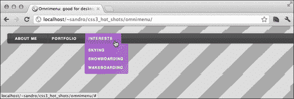

# 媒体查询

媒体查询是一种简单但非常强大的工具，可以根据某些浏览器和设备特性（如浏览器的视口大小、设备的宽度和高度以及方向）激活一些 CSS 属性。在深入细节之前，让我们编写一个小脚本来尝试这个功能：

```css
<!doctype html>
<html>
  <head>
    <title>media queries</title>
    <style>
    ul{
      margin: 0;
      padding: 0;
    }
    li{
      list-style-type: none;
      border: 2px solid black;
      margin: 5px;
      padding: 0px 10px;
      display: inline-block;
    }

 @media screen and (max-width: 400px){
      li{
        line-height: 20px;
        text-align: center;
        display: block;
      }

    }
    </style>
  </head>
  <body>
    <ul>
      <li>one</li>
      <li>two</li>
      <li>three</li>
      <li>four</li>
      <li>five</li>
      <li>six</li>
      <li>seven</li>
      <li>eight</li>
      <li>nine</li>
      <li>ten</li>
      <li>eleven</li>
      <li>twelve</li>
    </ul>
  </body>
</html>
```

在这个例子中，我们指示浏览器仅在满足所表达的条件时应用`@media`大括号之间的属性。让我们来看看它们：

+   `screen`：此关键字是可用媒体类型之一，用于指示必须实现封闭语句的媒体类型。在专门的 W3C 规范中描述了许多媒体类型（[`www.w3.org/TR/CSS2/media.html#media-types`](http://www.w3.org/TR/CSS2/media.html#media-types)），但只有少数几种（`screen`、`print`、`projection`）实际上受到今天浏览器的支持。

+   `max-width`：这是我们可以链接的许多条件关键字之一，以列出必须存在于设备中才能激活封闭语句的特征。`max-width`关键字可以解读为“最大为”，因此此条件在浏览器的视口大小超过给定值之前得到验证。

如果我们在兼容 CSS3 的浏览器中运行上面的代码，我们可以看到类似以下截图的内容：

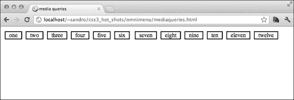

但是，如果我们调整窗口大小到`400px`以下，媒体查询中的语句将被激活，结果将类似于以下截图：

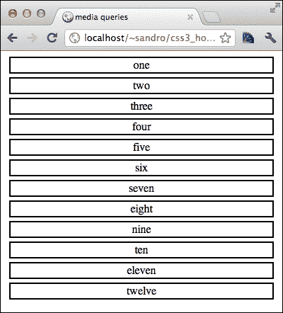

很酷，不是吗？当然，除了`max-width`之外，还有其他条件关键字。让我们来看看它们：

+   `min-width`：此关键字可以解读为“视口宽度最小为 x”，其中 x 是分配给`min-width`属性的值。

+   `max-height`和`min-height`：这些关键词的工作方式与`*-width`相同，但它们适用于浏览器的视口高度。

+   `min-device-width`、`max-device-width`、`min-device-height`和`max-device-height`：这些关键字标识设备的实际尺寸；因此，如果我们只想针对大于 1900 x 1200 的屏幕进行定位，我们必须编写诸如`(min-device-width: 1900px)`和`(min-device-height: 1200px)`的规则。

+   `orientation`：此属性的值可以是`portrait`或`landscape`。它标识设备的当前方向。

甚至还有更多这样的条件关键字，但是在上一个列表中不存在的关键字并不那么有用，而且目前还没有任何浏览器支持。无论如何，完整列表可以在[`www.w3.org/TR/css3-mediaqueries/#media1`](http://www.w3.org/TR/css3-mediaqueries/#media1)上查看。

我们还可以在`<link>`声明中使用`media`属性来定义媒体查询，如下所示：

```css
<link rel="stylesheet" type="text/css" media="screen and 
(max-device-width: 480px)" href="css/small.css" />
```

在这种情况下，我们必须考虑不理解媒体查询语句的浏览器，因为它们将始终加载链接的 CSS，而不考虑条件。为了防止这种行为，至少在较旧版本的 Internet Explorer 中，我们可以使用条件注释将`<link>`元素包装起来：

```css
<!-- [if gte IE 9]> -->
<link rel="stylesheet" type="text/css" media="screen and 
(max-width: 480px)" href="css/small.css" />
<!-- <![endif]-->
```

好的，现在我们知道媒体查询是如何工作的，但是我们如何使用此功能来针对移动设备呢？我们可以使用`max-device-width`或`max-width`来做到这一点。

`max-device-width`属性检查设备的大小，这在桌面 Web 浏览器或笔记本电脑上模拟是困难的。使用此属性的另一个缺点是，我们不希望根据屏幕大小来更改布局；我们希望根据浏览器窗口的大小来更改布局。因此，首选属性是`max-width`，这是将为我们的菜单系统提供最大灵活性的行为。

现在我们已经选择了针对移动设备的行为，我们有另一个问题要解决。为了表示页面的桌面版本，然后让用户放大和缩小，移动设备会伪造它们的实际分辨率。为了强制移动浏览器暴露其真实尺寸并禁用缩放，我们可以使用`<meta>`标签。该标签基本上表示最大和最小缩放因子必须等于 1。在`index.html`文件中的`<head>`标签后面添加以下行：

```css
<meta name="viewport" content="width=device-width,initial-scale=1, maximum-scale=1">
```

干得好！现在我们只需要找到要用作触发器以启用我们的“移动”CSS 的大小。我们将使用`320px`，这是 iPhone 在纵向模式下的大小。因此，让我们在`css`文件夹下创建一个新的`application_mobile.css`文件，并在`index.html`文件中的上一个`link`元素下面添加以下`link`元素：

```css
<!-- [if gte IE 9]> -->
<link rel="stylesheet" type="text/css" media="screen and 
(max-width: 320px)" href="css/application_mobile.css"/>
<!-- <![endif]-->
```

# 为移动版本设置样式

现在我们准备开始为该项目的移动版本设置样式。为了实现这一点，我们将把菜单从水平形状转换为垂直形状。我们将不再使用二级菜单，而是创建一些卡片，并在单击相应的一级菜单项时使它们滑入。

因此，首先让我们编写必要的 CSS 来改变我们菜单的形状（在`application_mobile.css`中）：

```css
nav {
  width: 290px;
  height: 100%;
  font-size: 1em;
  text-align: center;
  border-radius: 0;
  box-shadow: 0 0 5px rgba(0,0,0,0.4);
  position: relative;
  overflow: hidden;
}

nav > ul{
  width: 290px;
  padding: 0;
  position: absolute;
  top: 0;
  left: 0;
  z-index: 1;
}

nav > ul > li{
  width: 100%;
  display: block;
  position: static;
  border-bottom: 1px solid #313131;
  box-shadow: 
    0 1px 1px rgba(255,255,255,0.1) inset, 
    0 -1px 1px rgba(255,255,255,0.1) inset, 
    0 -1.5em 0 rgba(0,0,0,0.1) inset;
}

nav > ul > li > .item {
  padding-right: 15px;
  position: relative;
 box-sizing: border-box;
  z-index: 1;
}

nav > ul > li > ul {
  display: block;
  padding: 0;
  padding-top: 3em;
  top: 0;
  left: 290px;
  height: 610px;
  width: 290px;
  clip: auto;
  opacity: 1;
 transition: left 1s;
  z-index: 2;
}
```

第一个突出显示的指令显示了我们如何利用一个非常有用的属性，称为`box-sizing`，它基本上表示在设置元素宽度时受影响的部分。选项如下：

+   `content-box`：在此选项中，宽度仅指围绕元素内容的框。填充、边距和边框宽度被排除。

+   `padding-box`：此选项与前一个选项相同，但这次宽度包括填充。边框和边距宽度仍然被排除。

+   `border-box`：此选项与前两个选项相同，但这次只有边距宽度被排除。

因此，当我们编写以下内容时，我们要求浏览器在`100%`宽度内处理 30px 的填充：

```css
box-sizing: border-box;
width: 100%;
padding: 0px 15px;
```

如果我们现在尝试在移动浏览器中加载项目（例如，从 iPhone 模拟器中），或者如果我们将桌面浏览器窗口调整到 320px 以下，我们可以尝试这种布局：

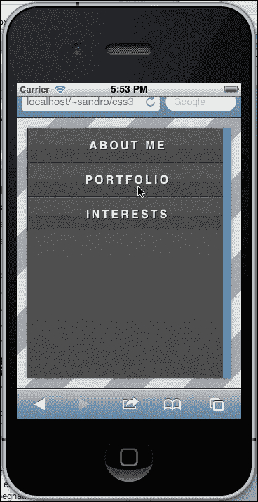

我们已经在 CSS 代码的移动版本（`application_mobile.css`）中添加了属性`transition: left 1s`，所以我们需要做的就是在相应的一级菜单被点击时将二级菜单移动到`left: 0px`，以使其重叠在一级菜单上。为了实现这一点，我们可以利用`:hover`伪选择器，在移动环境中，当用户触摸元素时会触发。因此我们可以写如下：

```css
nav > ul > li > .item:hover + ul{
 left: 0px;
 animation: none;
}

nav li.cursor{
  display:none;
  transition: none;
}

nav > ul > li > ul > li.cursor{
  display: block;
  top: 0px;
  text-indent: 0;
  left: 0px;
  line-height: 3em;
  height: 3em;
  clip: auto;
}

nav > ul > li > ul > li.cursor .item{
  display: block;
}

nav > ul > li > ul > li:first-child{
  border-top: 1px solid rgba(0,0,0,0.1);
}

nav > ul > li > ul > li{
  height: 3em;
  border-bottom: 1px solid rgba(0,0,0,0.1);
}

nav > ul > li > ul > li > .item{
  line-height: 3em;
  text-align: center;
}
```

最重要的语句是突出显示的那个；其他的只是为了调整一些细微的视觉细节。现在我们可以重新加载项目，欣赏我们刚刚编写的代码的效果：

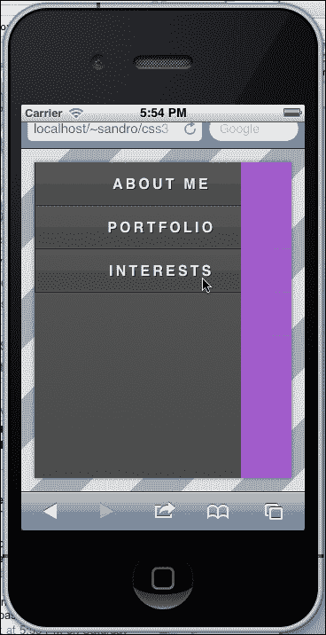

## 在桌面浏览器上处理新布局

我们在最后一部分代码中所做的对移动设备有效，但在桌面浏览器上失败，因为`：hover`伪选择器的行为不同。尽管几乎不太可能有人会从宽度小于 320 像素的桌面计算机浏览器中探索这个项目，但我们可以使用一点 JavaScript 来解决这个问题。以下是要添加到`index.html`中的代码，放在`</head>`标签之前：

```css
<script 
src="http://ajax.googleapis.com/ajax/libs/jquery/1.7.2/jquery.min.
js"></script>
<script 
src="http://cdnjs.cloudflare.com/ajax/libs/modernizr/2.5.3/
modernizr.min.js"></script>
<script>
  $(document).ready(function(){
  if(!Modernizr.touch){
    $('ul > li > .item').on('click', function(ev){
      $('ul > li').attr('data-status',null);
      $(ev.target).parent().attr('data-status','selected');
    });
    $('ul > li > ul > li > .item').on('click', function(ev){
      $(ev.target).parents('li[data-section]').
attr('data-status',null);
    });
  }
  });
</script>
```

通过这段代码，我们检查浏览器是否不支持触摸事件（因此不支持我们需要的`:hover`行为），然后，如果为真，我们为用户点击的一级菜单元素添加`data-status='selected'`属性。

为了实现这个结果，我们使用了一个非常有趣的库，我们将在下一章中详细介绍：Modernizr ([`modernizr.com/`](http://modernizr.com/))。这个库包含一些方法，用于检查大多数 HTML5 和 CSS3 特性的存在（例如，`Modernizr.touch`），返回`true`或`false`。

此外，每个特性也以附加到`html`元素的类的形式表示。例如，如果支持触摸事件，`html`元素会接收`touch`类；否则，它会接收`no-touch`类。

完成这一步，我们需要做的就是将使用`:hover`的选择器限制为仅触摸设备，并处理新的`data-status="selected"`属性。为此，我们需要在`application_mobile.css`中稍微更改`nav > ul > li > .item:hover + ul`选择器，如下所示：

```css
nav > ul > li[data-status="selected"] > .item + ul,
.touch nav > ul > li > .item:hover + ul
```

## 最终调整

现在我们可以通过`:after`和`:before`伪选择器为这个项目添加一些更多的增强。所以让我们在`application_mobile.css`中添加这个最后的修饰：

```css
nav > ul > li > .item:after, 
nav > ul > li > ul > li.cursor:before{
  content: '>';
  display: block;
  font-size: 1em;
  line-height: 3em;
  position: absolute;
  top: 0px;
  text-shadow: 1px 1px 0px rgba(0,0,0,0.5);
  font-weight: bold;
  color: #fff;
}

nav > ul > li > ul > li.cursor:before{
  content: '<';
  left: 15px;
}

nav > ul > li > .item:after{
  right: 15px;
}
```

每当我们使用 CSS 生成的内容时，我们必须记住，我们注入的内容不会被屏幕阅读器处理；因此，我们必须通过注入仅非必要内容（例如在这种情况下）或提供备用机制来处理。

好的，让我们最后一次在移动浏览器模拟器中重新加载项目，看最终结果：

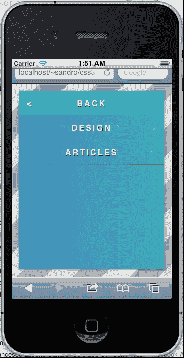

# 提高速度

如果我们想要改进“滑入”动画的速度，我们可以实施的最有效的变化之一是从背景中去除透明度。为此，我们必须在`application_mobile.css`中添加一些 CSS，以覆盖从桌面版本继承的设置：

```css
nav > ul > li > ul{
  background-color: rgb(117,189,70);
  background-image: none;
}

nav > ul > li[data-section=interests] > ul{
  background-color: rgb(186, 99, 195);
}

nav > ul > li[data-section=portfolio] > ul{
  background-color: rgb(70, 141, 189);
}
```

# 在旧版浏览器中实现

我们在开发这个项目时非常小心，所以即使旧版浏览器不支持动画和渐变，基本结构仍然完美运行。以下是从 Internet Explorer 8 中截取的屏幕截图：

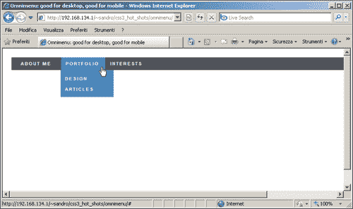

# 总结

在这一章中，我们尝试了媒体查询的强大功能，并开始探索动画和过渡效果。我们还发现了`display:inline-block`和浮动元素之间的区别，并开始收集一些关于移动性能的小贴士。当然，在接下来的章节中，我们会有时间深入了解这些新特性，发现许多其他有趣的 CSS3 属性。

然而，现在是时候翻开新的一页，开始着手处理一个涉及信息图表的新项目了！
