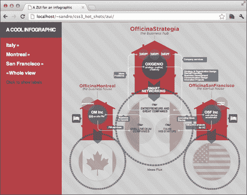

# 第四章：缩放用户界面

在本章中，我们将学习如何创建一个简单的**ZUI**。这个缩放用户界面的首字母缩写代表**缩放用户界面**；一个用户可以改变所看区域的比例以查看更多或更少细节的图形环境。对于这个项目，我们将创建一个 ZUI，让用户移动和探索一个**信息图表**，这是数据、信息或知识的视觉图形表示。我们将要构建的项目结合了许多 CSS3 特性，如过渡、变换和灵活的盒子布局。它还介绍了 SVG 以及我们可以用来在 HTML 页面中嵌入它们的各种方法。此外，作为额外的挑战，我们还将使我们的页面在旧版浏览器上运行，并探索完成这项任务的巧妙方法。

以下是本章讨论的主题的预览：

+   信息图表

+   灵活的盒子布局

+   Polyfills

+   嵌入 SVG

+   Modernizr

+   `:target`伪选择器

+   CSS3 变换

+   用 CSS 定位 SVG

+   优雅降级

# 信息图表

信息图表正在迅速改变我们消费信息的方式，通过创建图形表示来聚合数据或显示流程，并能够以非常直观和易于使用的方式显示大量知识。关于这个主题的一个很好的信息来源是 FlowingData 博客（[`flowingdata.com/`](http://flowingdata.com/)）。

对于这个项目，我们将使用意大利公司 Oxigenio 创建的以下令人惊叹的信息图表（[`www.officinastrategia.it`](http://www.officinastrategia.it)）：


我们希望为这个惊人的信息图表保留大部分浏览器视口区域，除了一个宽度为 200 像素的侧边栏，其中包含一些我们马上会看到的命令。首先让我们在一个`index.html`文件中定义一些基本的 HTML：

```css
<!doctype html>
<html>
  <head>
    <meta charset="utf-8">
   <meta http-equiv="X-UA-Compatible" content="IE=edge" />
    <title> A ZUI for an infographic</title>
    <link rel="stylesheet" type="text/css" 
href="http://yui.yahooapis.com/3.5.0/build/cssreset/
cssreset-min.css" data-noprefix>
    <link rel="stylesheet" type="text/css" 
href="css/application.css">

    <script src="img/modernizr.js"></script>
    <script src="img/prefixfree.js"></script>

  </head>
  <body>
    <section id="infographic">
      <header>
        <h1>a cool infographic</h1>
      </header>
      <article>

      </article>
    </section>
  </body>
</html>
```

对于这个项目，我们使用`modernizr.js`和`prefixfree.js`文件。因此，让我们在项目的根文件夹下创建一个`js`目录，并从它们各自的网站（[`modernizr.com/downloads/modernizr-latest.js`](http://modernizr.com/downloads/modernizr-latest.js)和[`leaverou.github.com/prefixfree/`](http://leaverou.github.com/prefixfree/)）下载它们到那里。

接下来，我们需要准备一个`css`文件夹，并在其中创建一个空的`application.css`文件。

到目前为止，我们定义的 HTML 结构非常简单和极简：一个`header`元素和一个被`section`元素包围的`article`元素。现在我们想把`header`元素放在左侧，宽度固定为 200 像素，并告诉`article`元素覆盖屏幕的剩余部分。

我们可以通过各种技术实现这种元素布置。对于本书的目的，我们将使用 CSS3 灵活的盒子布局。

# 实现灵活的盒子布局

CSS2.1 定义了四种布局模式：块状、内联、表格和定位。CSS3 添加了一些新的布局模式，其中之一是**灵活的盒子布局**。这种新模式是通过我们可以给`display`语句的一个新值来激活的，并且可以通过一整套新的属性进行配置。

这种新布局模式背后的基本思想是，在容器元素（例如，我们的`section`元素）中，我们可以指定我们希望内部元素显示的方向。因此，如果我们说`horizontal`，那么元素将从左到右流动，如果我们说`vertical`，它们将依次从上到下排列。

然后我们可以通过使用固定尺寸或定义增长因子来决定每个元素的大小。

### 注意

当容器内有新空间可用时，元素会按照它们的增长因子成比例地增加宽度。

够说了！让我们创建一个小型演示来测试一下：

```css
<!doctype html>
<html>
  <head>
    <meta charset="utf-8">
    <meta http-equiv="X-UA-Compatible" content="IE=edge" />
    <title> A ZUI for an infographic</title>
    <link rel="stylesheet" type="text/css" 
href="http://yui.yahooapis.com/3.5.0/build/cssreset/
cssreset-min.css">

    <style>
      ul{
        width: 500px;
        height: 200px;
 display: box;
        counter-reset: anchors;
 box-orient: horizontal;
        border: 1px solid black;
      }
      li{
        text-align: center;
        line-height: 200px;
        display: block;
 box-flex: 1;
        counter-increment: anchors;
      }
      li:hover{
 box-flex: 2;
      }
      li:nth-child(2n){
        background: #ddd;
      }
      li:before{
        content: counter(anchors);
      }
    </style>

    <script src="img/prefixfree.js"></script>
  </head>
  <body>
    <ul>
      <li></li>
      <li></li>
      <li></li>
      <li></li>
      <li></li>
    </ul>
  </body>
</html>
```

我们可以看到`ul`元素内的`li`元素以相同的宽度开始，这恰好是包含元素宽度的五分之一。这是因为它们都具有相同的增长因子，由属性`box-flex`指定，这使它们平均分配可用空间。当我们将鼠标悬停在`li`元素上时，我们改变了元素的`box-flex`值；我们将鼠标悬停在`2`上，使其宽度是其他元素的两倍。以下是刚加载页面的屏幕截图：


以下是悬停在元素上时的屏幕截图：


通过将`box-orient`属性从`horizontal`更改为`vertical`，我们可以观察到在相反轴上的相同行为。由于这个特定示例的结构，我们还必须修改`line-height`以去除我们设置的`200px`高度：

```css
ul{
  box-orient: vertical;
}
li{
  line-height: normal;
}
```

以下是显示结果的屏幕截图：


# 定义基本结构

现在我们已经有了创建项目结构的基础，我们需要在`section`元素内定义水平方向，然后将`header`元素的宽度设置为固定值。

我们已经在本章的第一部分创建了`index.html` HTML。现在让我们为了清晰起见再次重印`body`部分：

```css
<body>
  <section id="infographic">
    <header>
      <h1>a cool infographic</h1>
    </header>
    <article>

    </article>
  </section>
</body>
```

我们可以开始将以下指令添加到`application.css`：

```css
html, body{
  height: 100%;
}
body{
  overflow: hidden;
font-family: sans-serif;
}
section{
 display: box;
 box-orient: horizontal;
  height: 100%;
  width: 100%;
  overflow: hidden;
}
header{
 width: 200px;
  background: rgb(181, 65, 71);
}
article{
  background-color: rgb(204, 204, 204);
  background-image: 
    repeating-linear-gradient(bottom left, rgb(204, 204, 204) 0px, 
    rgb(204, 204, 204) 20px, 
    rgb(210, 210, 210) 20px, rgb(210, 210, 210) 40px);
 box-flex: 1;
  overflow: hidden;
  position: relative;
}
```

我们在上一个示例中添加了更多的说明，因为我们还希望`section`元素覆盖整个浏览器视口。此外，我们应该防止显示垂直滚动条，因为唯一的导航机制必须是 ZUI 提供的。因此，我们在`section`和`article`中都添加了`overflow: hidden`属性。

如果我们现在在支持 CSS3 的浏览器中加载项目，我们可以欣赏结果：


### 注意

弹性盒布局模块规范正在迅速发展，目前没有一个 web 浏览器支持所有规范。我们的实现对应于 2009 年 7 月 23 日发布的以下文档：

[`www.w3.org/TR/2009/WD-css3-flexbox-20090723/`](http://www.w3.org/TR/2009/WD-css3-flexbox-20090723/)

# 添加 Polyfills

自本书开始以来，我们首次使用 CSS3 来定义页面的结构。这意味着我们不能简单地依赖优雅降级来支持旧版浏览器，因为这会损害项目的整体结构。相反，我们将寻找一些能够模拟我们已实现行为的 JavaScript 库。当然，如果用户的浏览器缺少 JavaScript 支持和弹性盒布局，这可能会导致一些问题，但至少我们可以希望这样的用户数量非常少。

有不同类型的 JavaScript 库，根据需要多少额外工作来获得与原生实现相同的结果进行分类：

+   **通用库**：通用库不允许开发人员获得完全相同的结果，但给他/她一些工具来编写解决方案的替代实现。

+   **Shims**：Shims 允许开发人员完美地模仿原生实现，但实现它需要额外的工作成本。

+   **Polyfills**：Polyfills 是最好的。这些库读取我们的代码，检测不支持的功能，并实现所需的 JavaScript 解决方法，而无需添加额外的代码。

我们需要找到一个模拟弹性盒布局模块的 polyfill。我们可以从以下页面开始搜索，这个页面是由 Modernizr 的作者创建和维护的，列出了他们测试过并发现有效的所有 polyfills：

[`github.com/Modernizr/Modernizr/wiki/HTML5-Cross-Browser-Polyfills`](https://github.com/Modernizr/Modernizr/wiki/HTML5-Cross-Browser-Polyfills)

在页面向下滚动后，我们找到了 Flexie，它声称为旧版浏览器（最多到 IE6）添加了对弹性盒布局的支持。我们所要做的就是将库`flexie.js`下载到我们的`js`文件夹中（它也可以从 GitHub 上获取，网址为[`github.com/doctyper/flexie`](https://github.com/doctyper/flexie)，在`src`文件夹中）。

让我们通过在`</body>`标签之前添加以下行来修改我们的`index.html`文件：

```css
<!-- Adding older browser's support -->
<script 
src="http://ajax.googleapis.com/ajax/libs/jquery/1.7.2/
jquery.min.js"></script>
<script src="img/flexie.js"></script>
```

现在我们可以测试一下，看看是否一切顺利，加载我们的项目到不支持 CSS3 弹性盒布局的浏览器中。以下是从 IE8 中获取的屏幕截图：


从输出中可以看出，没有条纹背景，但整体结构得到了很好的保留。

### 注意

向项目添加 Polyfill 不可避免地增加了其复杂性。Polyfills 几乎总是能够模拟它们为之构建的 CSS3 功能，但显然与原生实现有所不同。可能需要 Polyfill 向我们的页面注入额外的元素，或者添加 CSS 属性。因此，在开发页面时尽早添加这些库，并经常测试，以便捕捉开发页面和库之间的冲突，这是一个很好的经验法则。

# 嵌入 SVG

我们想要在支持的情况下使用**可缩放矢量图形**（**SVG**）而不是光栅图像。我们正在构建一个 ZUI，因此我们的信息图表需要进行缩放，使用矢量图形可以保持对象的质量。事实上，矢量图像是大小独立的，因此在缩放时不会出现像素化。

### 注意

有关矢量图像和 SVG 的更多信息可以在维基百科上找到[`en.wikipedia.org/wiki/Vector_graphics`](http://en.wikipedia.org/wiki/Vector_graphics)。

有三种嵌入 SVG 的方式：

+   作为`<object>`元素。这是添加 SVG 的最受支持的方式。然而，它在某种程度上受到限制，因为 SVG 被视为外部元素，因此不能通过 JavaScript 进行操作（除了一些明显的属性，如`width`和`height`）。

+   作为 CSS 的值，需要图像的地方。

+   直接在我们的 HTML 代码中。这种方法提供了 SVG 和页面之间最多的交互。正如我们将在本章后面看到的，我们可以直接从 CSS 或甚至从 JavaScript 与矢量图形进行交互。

让我们选择第三种方式，因为我们希望我们的 CSS 能够影响 SVG 图形的一部分。首先，让我们创建一个`div`元素，它将作为我们在本章前面创建的`<article>`中的 SVG 元素的容器：

```css
<article>
<div class="panel">

  <!-- place here the svg content -->

</div>
</article>
```

接下来，我们可以使用 jQuery 从`img`文件夹直接加载 SVG 文件到我们刚刚创建的容器中，只需在我们之前编写的`index.html`文件的`script`标签后添加几行：

```css
  <script>
    $(document).ready(function(){
      $('div.panel').load('img/infographic.svg' );
    });
  </script>
</body>
```

在这些行中，我们首先要求 jQuery 等待 DOM 准备就绪，然后将我们的 SVG 文件的内容加载到具有`.panel`类的`div`元素中。

现在我们可以添加一些 CSS 来使`div`元素在包含的`article`中垂直和水平居中。

这可能会很奇怪，因为只有 Webkit 浏览器和 IE9+似乎接受大小为`100%`的容器，所以我们必须区分这些浏览器和其他浏览器。因此，让我们在`application.css`中添加以下指令：

```css
div.panel{
  width: 572px;
  height: 547px;
}

.-webkit- div.panel, 
.-ms- div.panel {
  width: 100%;
  height: 100%;
}

img.panel{
  display: block;
  position: absolute;
  top: 50%; left: 50%;
  margin-top: -282px;
  margin-left: -273px;
}

html:not(.-webkit-):not(.-ms-) div.panel{
  display: block;
  position: absolute;
  top: 50%; left: 50%;
  margin-top: -282px;
  margin-left: -273px;
}
```

我们现在已经涵盖了所有可能的情况：

+   我们使用了 Prefix Free 的能力，向`<html>`元素添加了一个额外的类，以检测 Webkit 和 Microsoft 浏览器，并为这些浏览器设置容器大小为`100%`，以便获得尽可能大的 SVG 容器。

+   如果浏览器不是前一项讨论中的浏览器之一，我们将 SVG 居中对齐并设置固定大小

+   如果有图像而不是 SVG（我们马上会看到我们如何处理这个），我们基本上做与前一项相同的事情。

如果我们现在在浏览器中重新加载项目，我们可以看到 SVG 的显示：


### 注意

由于我们使用了 AJAX，我们需要一个合适的 Web 服务器来尝试这个项目。只需双击`index.html`文件，不会生成预期的结果。请参考本书的*前言*部分，以获取有关如何安装 Web 服务器的更多信息。

当然，有些浏览器不支持 SVG。IE8 就是其中之一，因此我们需要找到一个解决方案，以便在这些浏览器上也能保持我们的项目愉快。

# 利用 Modernizr

在上一章中，我们已经对 Modernizr 有所了解，它是一个库，可以做很多事情，其中一些列在下面：

+   它为旧浏览器添加了对新 HTML5 标签的支持。

+   它在 JavaScript 中公开了一些方法，允许我们测试某个 CSS3/HTML5 功能。例如，`Modernizr.multiplebg`根据对多个背景的支持返回`true`或`false`。

+   它向`<html>`元素添加了一些类，反映了对某些 CSS3/HTML5 功能的支持。例如，根据对多个背景的支持，是`<html class="multiplebg">`还是`<html class="no-multiplebg">`。

我们已经将这个库添加到我们的项目中。但是，如果没有正确调整，Modernizr 会执行所有测试来检测支持的功能，即使我们不打算使用它们。为了增强库的性能，我们可以选择要执行哪些测试。

为此，我们必须单击 Modernizr 的下载页面（[`modernizr.com/download/`](http://modernizr.com/download/)），并仅检查我们将使用此库的功能。

对于这个项目，我们需要测试对内联 SVG 的支持。以下是屏幕截图，右侧的复选框已被选中：


接下来，我们单击**生成！**按钮，然后单击**下载**按钮，以下载并覆盖我们项目中的`modernizr.js`文件。

我们现在可以检查我们项目的生成 HTML 代码，看看如果浏览器支持内联 SVG，则`html`元素如何被`inlinesvg`类丰富，否则是`no-inlinesvg`类。

### 提示

您可以使用浏览器的开发控制台检查生成的 HTML 代码。例如，如果使用 Google Chrome，按下*Ctrl* + *Shift* + *I*（在 Windows 和 Linux 上），或按下*Command* + *Option* + *I*（在 Mac 上）。


我们现在要实现一个替代 SVG 图形的方法，使用普通图像；然后，通过利用 Modernizr 提供给我们的类，根据浏览器的支持切换其中一个。因此，让我们首先在`index.html`的`</article>`标签之前添加一个小的 HTML 片段：

```css

```

然后我们需要修改我们的`application.css`：

```css
.no-inlinesvg div.panel{
  display: none;
}

.inlinesvg img.panel{
  display: none;
}
```

如果我们现在在 IE8 中重新加载项目，我们可以看到一切都被正确处理了：


# :target 伪选择器

现在我们可以开始为我们的项目添加一些交互。我们希望在`<header>`侧边栏中公开一些控件，当单击时，可以缩放到信息图表的指定区域。

为了实现这一点，我们将利用一个新的 CSS3 伪选择器：`:target`。当锚点成为当前 URL 的目标时，它会被激活。让我们创建一个小例子来尝试一下：

```css
<!doctype html>
<html>
  <head>
    <meta charset="utf8">
    <title> :target test</title>
    <link rel="stylesheet" type="text/css" 
href="http://yui.yahooapis.com/3.5.0/build/cssreset/
cssreset-min.css">

    <style>
    a[id]{
      display: block;
      width: 100px;
      height: 100px;
      text-align: center;
      line-height: 100px;
      margin: 10px;
      background: gray;
    }
 a:target{
 background: yellow;
 }
    </style>

    <script src="img/prefixfree.js"></script>
  </head>
  <body>
    <a href="#one"> light 1 </a>
    <a href="#two"> light 2 </a>
    <a id="one" name="one"> one </a>
    <a id="two" name="two"> two </a>
  </body>
</html>
```

在上面的例子中，我们基本上说当`a`元素成为当前 URL 的目标时，它的背景颜色必须变成黄色。下面的屏幕截图显示了结果（注意 URL）：


现在我们需要一组包含用户可以执行的命令的`a`元素。所以让我们在我们的`index.html`文件的`header`元素中添加一个`nav`元素：

```css
<nav>
  <ul>
    <li><a href="#italy">Italy</a></li>
    <li><a href="#montreal">Montreal</a></li>
    <li><a href="#sanfrancisco">San Francisco</a></li>
    <li><a href="#">Whole view</a></li>
  </ul>
</nav>
```

接下来，我们可以在我们的`application.css`文件中使用一些 CSS 指令来为这些命令设置样式：

```css
nav, ul, li{
  width: 100%;
}

h1{
  font-size: 16px;
  text-transform: uppercase;
  letter-spacing: -1px;
  font-weight: bold;
  line-height: 30px;
  text-align: center;
  padding: 10px 0 10px 0;
  color: rgb(255,255,255);
  background: rgb(85, 85, 85);
  margin-bottom: 10px;
}

li, li a{
  display: block;
  height: 30px;
  line-height: 30px;
}

li a{
  color: rgb(255,255,255);
  text-decoration: none;
  font-weight: bold;
  padding-left: 20px;
}

li a:hover{
  text-decoration: underline;
}
```

如果我们重新加载项目，我们可以看到结果：


## 添加一些锚点

现在我们需要放置`a`元素，这些元素是我们刚刚实现的命令的目标。这里有一个小技巧：如果我们将这些元素放在页面顶部然后隐藏它们，我们可以使用邻接选择器（`+`和`~`）来匹配它们后面的元素，并能够虚拟地到达页面中的每个其他元素。

所以，让我们从在我们的`index.html`文件的`body`元素下方为我们指定的每个命令添加一个`a`元素开始：

```css
<a id="italy" name="italy"></a>
<a id="montreal" name="montreal"></a>
<a id="sanfrancisco" name="sanfrancisco"></a>
```

好了！现在，如果我们想在单击**Italy**命令后更改`header`背景颜色，我们可以在我们的 CSS 中添加一行简单的代码：

```css
a[id="italy"]:target ~ section header{
  background: green;
}
```

当然我们不想这样做，但是通过使用相同的原理，我们可以触发信息图的一些变化。首先我们必须学习有关变换的知识。

# CSS3 变换

我们将探索一整套新的属性，目标是能够使用 CSS 任意缩放元素。这是我们需要学习的最后一个核心技术，涉及的属性被称为**CSS3 变换**。

使用 CSS3 变换，我们可以对页面上的元素应用一些修饰符，即：

+   `translateX(x)`, `translateY(y)`, 和 `translate(x,y)`: 这些修饰符通过由`x`和`y`变量指定的距离沿一个或两个轴移动元素（以 px 为单位）

+   `rotate(deg)`: 它通过由`deg`变量指定的值旋转元素，该值必须以度数表示（从 0 到 360 度）

+   `scaleX(s)`, `scaleY(s)`, 和 `scale(s,[s])`: 它通过比例因子`s`缩放元素，其中比例为`1`表示保持元素大小不变

+   `skewX(k)` 和 `skewY(k)`: 它通过给定的`k`角度（以度数表示，从 0 到 360 度）应用倾斜变换

还有一个接受六个参数并让我们定义一个变换矩阵的`matrix`修饰符。有关`matrix`修饰符的更多信息可以在[`www.w3.org/TR/SVG/coords.html#TransformMatrixDefined`](http://www.w3.org/TR/SVG/coords.html#TransformMatrixDefined)找到。

让我们在一个小演示中尝试这些修饰符：

```css
<!doctype html>
<html>
  <head>
    <meta charset="utf-8">
    <meta http-equiv="X-UA-Compatible" content="IE=edge" />
    <title>transform test</title>
    <link rel="stylesheet" type="text/css" 
href="http://yui.yahooapis.com/3.5.0/build/cssreset/
cssreset-min.css">

    <style>
    div{
      width: 100px;
      height: 100px;
      background: green;
      margin: 30px auto;
    }
 div:first-child{
 transform: translateX(100px);
 }
 div:nth-child(2){
 transform: rotate(45deg);
 }
 div:nth-child(3){
 transform: scale(2);
 background: red;
 }
 div:nth-child(4){
 transform: skewX(45deg);
 }
 div:last-child{
 transform: skewY(45deg) scale(1.2) rotate(45deg);
 }
    </style>

    <script src="img/prefixfree.js"></script>
  </head>
  <body>
    <div>translate</div>
    <div>rotate</div>
    <div>scale</div>
    <div>skew</div>
    <div>mixed</div>
  </body>
</html>
```

正如你所看到的，变换可以组合在一起以获得一些有趣的结果。以下是在符合 CSS3 标准的浏览器中运行此演示的屏幕截图：


### 注

另一个要注意的好功能是元素位置在应用变换之前进行计算。这一点的证明是缩放的`div`元素不会使其他元素向下移动，而只是重叠。

## 应用变换

现在我们只需要将我们刚学到的东西放在一起，并在点击其中一个命令时转换信息图。为了实现平滑的变换，让我们在`application.css`中的所有变换属性上指定一个`1`秒的过渡：

```css
.panel{
    transition: transform 1s;
}

/*
Now we can add these few instructions to trigger the transform when corresponding anchor became target of the current URL:
*/

a[id='italy']:target ~ section div.panel { 
  transform: scale(2) translateY(15%);
  -ms-transform: scale(2) translateY(15%);
}

a[id='montreal']:target ~ section div.panel{
  transform: scale(1.8) translate(24%, -21%);
  -ms-transform: scale(1.8) translate(24%, -21%);
}

a[id='sanfrancisco']:target ~ section div.panel{
  transform: scale(1.8) translate(-24%, -21%);
  -ms-transform: scale(1.8) translate(-24%, -21%);
}
```

好了！让我们在浏览器中重新加载项目：


## 闪烁问题

在撰写本文时，所有最新版本的 Chrome 浏览器（截至 18 版本）在应用某些 CSS 属性时会在 CPU 和 GPU 加速图形之间切换（其中包括过渡）。如果计算机处理不够快，这可能会在屏幕上产生闪烁。一种解决方法是在页面加载时强制 Chrome 应用 GPU 加速属性。在这种解决方案中，我们将在接下来的几章中看到的 3D 变换属性非常有用，因此我们可以向`body`元素添加一个空的`translateZ`属性，如下所示：

```css
body{
  -webkit-transform: translateZ(0);
}
```

然而，我们必须记住，这种解决方案降低了 SVG 的质量，因为 Chrome 似乎不会在加速后对图形进行细化。此外，像我们刚刚使用的这样的 3D 变换属性在移动环境中应该谨慎对待，因为它们占用内存。

# 添加蒙版

我们可能想为每个可用的缩放区域添加一个小的描述蒙版。在蒙版中，我们还希望用户能够使用小箭头在缩放区域之间移动。

首先让我们定义所需的 HTML：将有四个蒙版，一个用于三个命令中的每一个，一个用于中心区域。我们可以在`</section>`标签之后添加所需的标记：

```css
<div id="mask"> 
  <div data-detail="italy">
    <span>Help text. Click the arrows to explore more.</span>
    <menu>
      <a role="button" aria-label="move down" 
href="#italy2">&#x25BC;</a>
    </menu>
  </div>
  <div data-detail="italy2">
    <span>Help text. Click the arrows to explore more.</span>
    <menu>
      <a role="button" aria-label="move left" 
href="#montreal">>&#x25C4;</a>
      <a role="button" aria-label="move up" 
href="#italy">&#x25B2;</a><a role="button" aria-label="move right" href="#sanfrancisco">&#x25BA;</a>
    </menu>
  </div>
  <div data-detail="montreal">
    <span>Help text. Click the arrows to explore more.</span>
    <menu>
      <a role="button" aria-label="move right" 
href="#italy2">&#x25BA;</a>
    </menu>
  </div>
  <div data-detail="sanfrancisco">
    <span>Help text. Click the arrows to explore more.</span>
    <menu>
      <a role="button" aria-label="move left" 
href="#italy2">>&#x25C4;</a>
    </menu>
  </div>
</div>
```

现在我们必须将`#mask`元素放置在视口底线的下方，并在触发其中一个命令时激活它。因此，让我们在`application.css`中写入以下指令：

```css
#mask{
  position: absolute;
 padding-top: 5px;
  font-size: 18px; 
  font-weight: bold;
 height: 50px;
  color: rgb(255,255,255);
  background-color: rgb(0,0,0);
  background-color: rgba(0,0,0,0.8);
  text-align: center;
 bottom: -55px;
  left: 201px;
  right: 0;
}

#mask menu{
  position: absolute;
  padding: 0; margin: 0;
  bottom: 4px;
  left: 0;
  right: 0;
  text-align: center;
}

#mask div{
 display: none;
}

#mask a{
  text-decoration: none;
  color: rgb(255,255,255);
  padding: 0 10px;
}

a[id='montreal']:target ~ #mask div[data-detail="montreal"],
a[id='italy2']:target ~ #mask div[data-detail="italy2"],
a[id='italy']:target ~ #mask div[data-detail="italy"],
a[id='sanfrancisco']:target ~ #mask 
div[data-detail="sanfrancisco"]{
 display: block;
}

a[id='italy']:target ~ #mask,
a[id='italy2']:target ~ #mask,
a[id='montreal']:target ~ #mask,
a[id='sanfrancisco']:target ~ #mask{
 transition: bottom 1s;
 bottom: 0;
}

```

在代码的突出部分，我们指示浏览器：

+   隐藏`#mask`元素在浏览器底线以下

+   隐藏`#mask`元素内的所有`div`元素

+   仅显示与目标`a`元素对应的`#mask`元素内的`div`元素

+   当`a`元素是`:target`时，显示`#mask`元素

现在我们需要处理`italy2`锚点。因此，让我们在`index.html`中的`<section>`之前再添加一个`a`元素：

```css
<a id="italy2" name="italy2"></a>
```

以及在`application.css`中对应的 CSS：

```css
a[id='italy2']:target ~ section div.panel{
  transform: scale(2) translateY(-15%);
  -ms-transform: scale(2) translateY(-15%);
}
```

干得好！现在让我们在浏览器中重新加载项目：


# 用 CSS 定位 SVG

好的，是时候做最后的修饰了。现在我们想要的是提供一个机制来切换信息图表标签的可见性。由于我们的 SVG 是内联的，我们可以通过简单地向它们的`id`选择器添加`opacity: 0`来关闭它们，就像我们对普通 HTML 元素所做的那样。因此，让我们在`application.css`中添加以下行：

```css
#Layer_2{ /* this id is present within the SVG */
  opacity: 0;
  transition: opacity 1s;
}
```

下一步是找到一种让用户切换`opacity`值的方法。我们可以使用复选框来实现这个结果，并利用`:checked`伪选择器，就像我们使用`:target`一样。

因此，首先让我们在`index.html`文件中的`<section>`标签之前添加一个复选框：

```css
<input type="checkbox" id="show_labels" name="show_labels">
```

然后，在`nav`命令的`</ul>`标签之前添加相应的标签：

```css
<li><label for="show_labels"></label></li>
```

现在在`application.css`中添加以下行：

```css
#show_labels{
 display: none;
}

nav label:before{
 content: 'Click to show labels';
}

#show_labels:checked ~ section label:before{
 content: 'Click to hide labels';
}

#show_labels:checked ~ section #Layer_2{
 opacity: 1;
}

label{
  text-align: left;
  font-family: sans-serif;
  padding-left: 20px;
  font-size: 13px;
  cursor: pointer;
}

nav label{
  display: block;
  height: 30px;
  line-height: 30px;
}

li:not(:nth-last-child(2)) a:after{
  content: " \00BB";
}

li:nth-last-child(2) a:before{
  content: "\00AB";
}
```

以下是我们项目的最终截图：



# 优雅降级

因为我们添加了 CSS 变换，旧版浏览器开始出现问题。事实上，旧版浏览器不支持变换和`:target`伪选择器，因此我们必须找到一个有效的替代方案。一个解决方案可以是通过 JavaScript 监听 URL 哈希变化，并使用`hashchange`事件将当前哈希值反映到`section`和`#mask`元素的类中。然后可以使用这个类来触发一些 CSS 属性。

为了能够在旧版浏览器上监听`hashchange`事件，我们需要一个小的 JavaScript 库。我们可以从[`benalman.com/code/projects/jquery-hashchange/docs/files/jquery-ba-hashchange-js.html`](http://benalman.com/code/projects/jquery-hashchange/docs/files/jquery-ba-hashchange-js.html)下载它，将其重命名为`jquery.hashchange.js`，并放置在我们的`js`文件夹中。接下来，我们必须用一个包含**多重背景**测试的新版本替换我们的 Modernizr 副本(`js/modernizr.js`)。为了实现这一点，我们可以使用与之前讨论过的相同的过程。

现在我们需要插入这个库，然后在`</body>`标签之前添加一些小的 JavaScript 代码：

```css
<script src="img/jquery.hashchange.js"></script>
<script>
  $(document).ready(function(){
/* we check for multiblegbs support because browsers who do support multiple backgrounds surely support also the features we need */
    if(!Modernizr.multiplebgs){
      if(window.location.hash.substring(1) != "")
        window.location.href = window.location.href.replace(window.location.hash,'');
      jQuery(window).hashchange(function(e){
 $('section, #mask').removeClass().addClass(window.location.hash.substring(1));
      });
    }
  });
</script>
```

好了！现在我们可以通过改变`img.panel`元素的宽度、高度和位置来模拟`transform`属性。此外，我们还可以使用 JavaScript 动态添加的类来显示和隐藏`#mask`元素。

```css
.no-inlinesvg #mask{
  left: 0px;
}

.no-inlinesvg label{
  display: none;
}

#mask.montreal, #mask.sanfrancisco, #mask.italy, #mask.italy2{
  bottom: 0px;
}

#mask.montreal div[data-detail="montreal"], 
#mask.italy2 div[data-detail="italy2"], 
#mask.italy div[data-detail="italy"], 
#mask.sanfrancisco div[data-detail="sanfrancisco"]{
 display: block;
}

section.italy img.panel{
 top: 60%; left: 25%;
 width: 1000px;
 height: 1000px;
}

section.italy2 img.panel{
 top: 0%; left: 25%;
 width: 1000px;
 height: 1000px;
}

section.montreal img.panel{
 top: -10%; left: 50%;
 width: 1000px;
 height: 1000px;
}

section.sanfrancisco img.panel{
 top: -10%; left: 0%;
 width: 1000px;
 height: 1000px;
}

```

以下屏幕截图显示了最终结果：


# 总结

在本章中，我们学习了如何处理对我们页面结构产生影响的 CSS3 属性。我们还发现了转换，以及一些与 SVG 互动的酷炫方式。在下一章中，我们将讨论如何增强图库。
