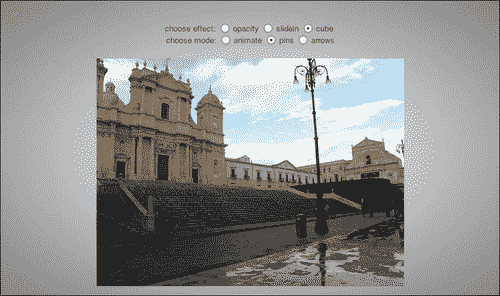
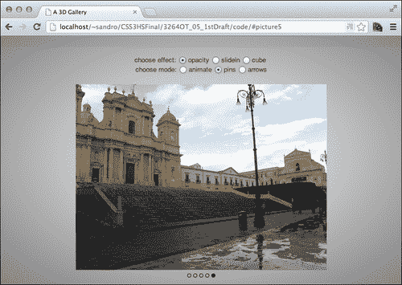
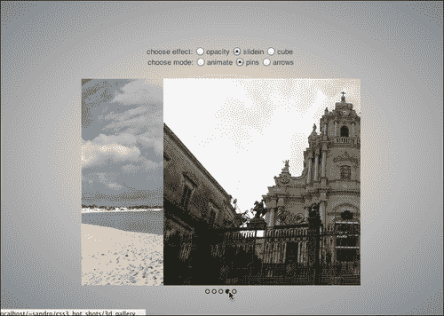
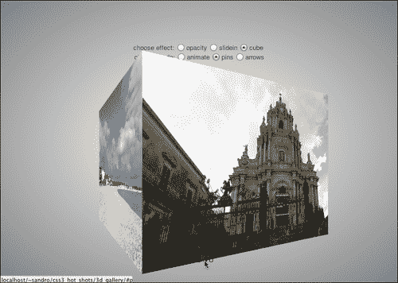
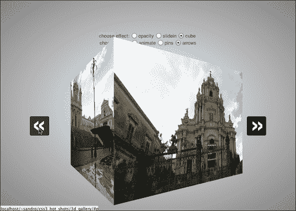

# 第五章：图库

图库现在是网站的常见组件。在本章中，我们将发现如何使用*仅*CSS 属性实现一系列过渡效果和几种导航模式。我们将首先实现一个基本的过渡效果，使用一系列图像，然后我们将开发一个纯 CSS 结构，让用户选择他喜欢的导航模式和过渡效果，最后，我们将添加更复杂的过渡效果。以下是本章将涵盖的主题列表：

+   基本图库 HTML 结构

+   实现不透明度过渡

+   实现幻灯片过渡

+   3D 变换

+   添加幻灯片模式

+   创建上一个和下一个箭头

+   CSS 预处理器

# 准备结构

与前几章一样，我们首先定义一个基本的 HTML 结构，然后在此基础上构建我们的项目。所以让我们为这个项目创建一个新的文件夹，其中包含一个名为`index.html`的文件，其中包含以下代码：

```css
<!doctype html>
<html>
  <head>
    <meta charset="utf-8">
    <meta http-equiv="X-UA-Compatible" content="IE=edge" />
    <title>A 3D Gallery</title>
    <link rel="stylesheet" type="text/css" href="http://yui.yahooapis.com/3.7.3/build/cssreset/cssreset-min.css">
    <link rel="stylesheet" type="text/css" href="css/application.css">
    <script src="img/prefixfree.js"></script>
  </head>
  <body>
    <div>
      choose effect:
      <input type="radio" name="mode" id="opacity" checked >
      <label for="opacity">opacity</label>
      <input type="radio" name="mode" id="slidein">
      <label for="slidein">slidein</label>
      <input type="radio" name="mode" id="cube" >
      <label for="cube">cube</label>
      <br>
      choose mode:
      <input type="radio" name="controls" id="animate">
      <label for="animate">animate</label>
      <input type="radio" name="controls" id="bullets" checked>
      <label for="bullets">bullets</label>
      <input type="radio" name="controls" id="arrows">
      <label for="arrows">arrows</label>

      <a id="picture1" name="picture1"></a>
      <a id="picture2" name="picture2"></a>
      <a id="picture3" name="picture3"></a>
      <a id="picture4" name="picture4"></a>
      <a id="picture5" name="picture5"></a>
      <section>
        <ul>
          <li>
            <figure id="shot1"></figure>
          </li>
          <li>
            <figure id="shot2"></figure>
          </li>
          <li>
            <figure id="shot3"></figure>
          </li>
          <li>
            <figure id="shot4"></figure>
          </li>
          <li>
            <figure id="shot5"></figure>
          </li>
        </ul>
        <span>
          <a href="#picture1" ></a>
          <a href="#picture2" ></a>
          <a href="#picture3" ></a>
          <a href="#picture4" ></a>
          <a href="#picture5" ></a>
        </span>
      </section>
    </div>
  </body>
</hthiml>
```

与前几章一样，我们使用 Yahoo!重置 CSS 样式表以及 Lea Verou 的 Prefix Free 库。您可以从上一章的示例中复制`prefixfree.js`，或者从[`leaverou.github.com/prefixfree/`](http://leaverou.github.com/prefixfree/)下载它。

我们定义的结构包含一些单选按钮，分为`mode`和`controls`两组。在这个项目中，我们将学习如何改变我们的图库的行为，以反映我们的用户所做的选择。首先要实现的默认设置涉及不透明度过渡和基于项目符号的导航系统。

接下来有与我们想要显示的图像数量相等的锚点。然后，在一个`section`元素内，我们为每个图像有一个`figure`元素，并且有一个指向先前定义的锚点的`a`元素。

我们要实现的内容是在按下相应的`a`元素时激活特定图像。为此，我们将使用已经介绍的`:target`伪选择器与其他一些小技巧结合使用，但首先我们必须花一点时间定义基本的 CSS 结构。

## 应用基本 CSS

首先，我们必须将我们的项目居中在浏览器的视口中，然后稍微设计一下单选按钮。为此，我们在`application.css`中写入几行 CSS，如下所示：

```css
/* == [BEGIN] General == */

body,html{
  height: 100%;
  background-image: radial-gradient(center center, white, gray);
}
body > div{
  position: absolute;
  width: 500px;
  height: 400px;
  top: 50%; left: 50%;
  margin-left: -250px;
  margin-top: -200px;
  text-align: center;
  font-family: sans-serif;
  font-size: 13px;
  color: #444;
  line-height: 1.5;
}

section{
  margin-top: 20px;
  width: 500px;
  height: 390px;
  position: relative;
}

section > ul{
  width: 500px;
  height: 390px;
  position: relative;
}

input{
  width: 20px;
}

/* == [END] General == */
```

好了！现在让我们为每个`figure`元素分配相应的图像：

```css
/* == [BEGIN] Pics == */

section figure {
  position: absolute;
  top: 0px; left: 0px;
  width: 500px; height: 370px;
  padding: 0px; margin: 0px;
  background-position: center center;
}

#shot1{
  background-image: url('../img/picture1.jpg');
}
#shot2{
  background-image: url('../img/picture2.jpg');
}

#shot3{
  background-image: url('../img/picture3.jpg');
}

#shot4{
  background-image: url('../img/picture4.jpg');
}

#shot5{
  background-image: url('../img/picture5.jpg');
}

/* == [END] Pics == */
```

### 注意

请注意，在实际示例中，我们可能会通过`style`属性动态插入这些图像。

现在我们可以使用符合 CSS3 标准的浏览器测试此设置阶段的成功。在这一点上，我们还没有为单选按钮添加任何行为，所以我们只期望在`#shot5`中看到图像，而没有任何交互或动画。



## 样式化项目符号

让我们开始为`a`元素应用一些样式。我们首先创建了项目符号，因为它们是默认表示。我们的项目符号将显示为一组空心的可点击圆圈，就像在线幻灯片中经常发现的那样。我们可以为这些圆圈使用一些圆角边框，并在元素被点击时应用`background`规则。为了拦截这种状态，我们将在页面顶部插入的相应`a`元素上使用`:target`伪选择器。

```css
/* == [BEGIN] Span == */

section > span > a{
 display: inline-block;
  text-decoration: none;
  color: black;
  font-size: 1px;
  padding: 3px;
  border: 1px solid black;
  border-radius: 4px;
  font-weight: bold;
}

section > span{
  position: absolute;
  bottom: 0px;
  left: 0px;
  right: 0px;
  text-align: center;
}

a[name=picture1]:target ~ section a[href="#picture1"],
a[name=picture2]:target ~ section a[href="#picture2"],
a[name=picture3]:target ~ section a[href="#picture3"],
a[name=picture4]:target ~ section a[href="#picture4"],
a[name=picture5]:target ~ section a[href="#picture5"]{
 background: #111;
}

/* == [END] Span == */
```

我们决定将项目符号设置为`display:inline-block`，以便从此属性在元素标签之间留下一些空间时注入的空间中受益，就像我们在第三章中看到的那样，*Omni 菜单*。

接下来，我们使用`：target`伪选择器与相邻选择器`~`结合使用，定义一个规则，匹配指向当前锚点的项目符号。

现在一切准备就绪，我们可以开始处理我们的第一个过渡效果：不透明度。

# 实现不透明度过渡

透明度效果是最简单的，我们只需要通过`opacity:0`属性隐藏所有元素，除了对应于点击的子弹的元素。为了获得一个漂亮的淡出效果，我们可以使用`transition`属性指定两种状态之间的过渡期。

我们必须在这里实现的一个技巧是，只有在我们的设置面板中选择了**opacity**单选按钮时，才能附加这种行为。为了实现这一点，我们可以在规则之前放置另一个选择器`#opacity:checked`：

```css
/* == [BEGIN] Opacity == */

#opacity:checked ~ section figure{
  opacity: 0;
  transition: opacity 0.4s;
}

#opacity:checked ~ a:not(:target) + a:not(:target) + a:not(:target) + a:not(:target) + a:not(:target) ~ section #shot1,
#opacity:checked ~ a[name=picture1]:target ~ section #shot1,
#opacity:checked ~ a[name=picture2]:target ~ section #shot2,
#opacity:checked ~ a[name=picture3]:target ~ section #shot3,
#opacity:checked ~ a[name=picture4]:target ~ section #shot4,
#opacity:checked ~ a[name=picture5]:target ~ section #shot5{
  opacity: 1;
}

/* == [END] Opacity == */
```

我们基本上使用了与之前相同的技巧，再加上一个规则，如果没有选择任何子弹，则将`opacity:1`设置为第一张图像。为了实现这一点，我们使用`+`选择器来具体匹配五个连续的不是`:target`的`a`元素。

干得好！如果我们在浏览器中运行项目，我们可以测试效果，并注意到这只有在对应的单选按钮被选中时才会起作用。



### 注

在继续之前的最后一点，我们为这个项目创建的选择器非常复杂，如果在大型应用程序中广泛使用，可能会引入性能问题。

是时候实现一个新的效果了：滑动！

# 实现滑动过渡

滑动效果基本上是一个过渡，其中一个元素在用户视图之外移动，向一个方向滑动，而另一个元素在移动。为了实现这种效果，我们必须处理两种不同的动画：滑入和滑出。使这种效果起作用的基本思想与之前的类似，尽管稍微复杂一些。为了实现滑入效果，我们必须将所有图片移出部分视口，比如`left:-500px`，然后，当对应的子弹被点击时，取出选定的图片，并使用一个动画将其移动到相反的一侧（`left:500px`），然后将其移动到正确的位置（`left:0`）。

为了实现滑动效果，我们可以使用另一个动画，从`left:0px`到`left:-500px`开始。以下是完整的 CSS 片段：

```css
/* == [BEGIN] Slide In == */

#slidein:checked ~ section > ul{
 overflow:hidden;
}

#slidein:checked ~ section figure{
  left: -500px;
  animation-name: slideout;
  animation-duration: 1.5s;
}

#slidein:checked ~ a:not(:target) + a:not(:target) + a:not(:target) + a:not(:target) + a:not(:target) ~ section #shot1,
#slidein:checked ~ a[name=picture1]:target ~ section #shot1,
#slidein:checked ~ a[name=picture2]:target ~ section #shot2,
#slidein:checked ~ a[name=picture3]:target ~ section #shot3,
#slidein:checked ~ a[name=picture4]:target ~ section #shot4,
#slidein:checked ~ a[name=picture5]:target ~ section #shot5{
  animation-name: slidein; 
  animation-duration: 1.5s;
  left: 0px;
}

@keyframes slidein{
 0% { left: 500px; }
 100% { left: 0px; }
}

@keyframes slideout{
 0% { left: 0px; }
 100% { left: -500px; }
}

/* == [END] Slide In == */
```

我们使用`overflow:hidden`来隐藏部分视口外的图像。`slideout`动画被添加到除选定元素之外的所有元素，因此当一个元素退出选定状态时，动画被激活并将元素平滑地移动到`left:-500px`。

以下是从支持 CSS3 的浏览器（例如 Chrome，Firefox，IE10 等）中截取的屏幕截图：



现在我们准备编写第三个过渡效果的代码：立方体！但首先，为了更好地理解下一步，让我们花一些时间介绍 3D 变换的基础知识。

# 3D 变换

3D 变换在设计网站方面引入了一个重大飞跃。我们现在可以尝试在 3D 空间中移动和动画化元素，如`div`、`img`，甚至`video`，这些都受益于 GPU 加速（对于大多数浏览器）。一旦我们决定引入 3D 效果，我们必须处理的第一件事是**透视**。

我们为`perspective`属性设置的值告诉浏览器如何渲染在 z 轴上位置为 0（或未设置）的元素。例如，`perspective:300px`意味着 z=0（或未设置）的元素被绘制得好像它离视口有 300 像素远。当然，这会影响元素在旋转时的渲染方式。

接下来是一个有用的属性，其目的是告诉浏览器应用 3D 变换。这个属性叫做`transform-style`，它的值可以是`flat`或`preserve-3d`。当值为`flat`时，具有影响 x 或 y 轴旋转的变换的元素没有透视，但当值为`preserve-3d`时，它们实际上表现得像真正的 3D 表面。这个属性也适用于所有元素的子元素。

最后是变换。这里要使用的属性与 2D 变换相同，是`transform`，但有一些新的关键字可以作为值选择。

变换原点默认设置为 z = 0 的元素中心，但可以使用`transform-origin`属性进行调整。

有了这些概念，我们可以开始定义立方体效果，它基本上与滑动效果相同，但当然要利用 3D 变换机制。

```css
/* == [BEGIN] Cube == */

#cube:checked ~ section{
 perspective: 500px;
}

#cube:checked ~ section > ul{
 transform-style: preserve-3d;
}

#cube:checked ~ section figure{
 transform-origin: 250px 185px -250px;
 backface-visibility: hidden;
  transform: rotateY(-90deg);
  animation-name: cubeout;
  animation-duration: 1.5s;

}

#cube:checked ~ a:not(:target) + a:not(:target) + a:not(:target) + a:not(:target) + a:not(:target) ~ section #shot1,
#cube:checked ~ a[name=picture1]:target ~ section #shot1,
#cube:checked ~ a[name=picture2]:target ~ section #shot2,
#cube:checked ~ a[name=picture3]:target ~ section #shot3,
#cube:checked ~ a[name=picture4]:target ~ section #shot4,
#cube:checked ~ a[name=picture5]:target ~ section #shot5{
  animation-name: cubein;
  animation-duration: 1.5s;
  transform: rotateY(0deg);
}

@keyframes cubein{
  0%   { transform: rotateY(90deg); }
  100% { transform: rotateY(0deg); }
}

@keyframes cubeout{
  0%   { transform: rotateY(0deg); }
  100% { transform: rotateY(-90deg); }
}

/* == [END] Cube == */
```

我们将`perspective`和`transform-style`设置为要进行变换的父元素。然后我们定义一个原点，它位于`figure`元素的中心，但从视口中偏移了 250 像素。

然后我们应用绕 y 轴旋转的变换，使用与我们之前使用`slidein`动画相同的机制。

最后，我们告诉浏览器在图片旋转到用户视角的相反方向时不显示图片。这是通过`backface-visibility: hidden`语句实现的。

在浏览器中快速刷新，结果如下：



### 注意

如果运行浏览器的 PC 硬件没有 GPU，Chrome 会自动禁用 3D 效果。要检查是否触发了这种行为，可以在地址栏中输入`about:GPU`。

# 添加幻灯片放映模式

现在我们准备实现剩下的两种模式：幻灯片放映和箭头。让我们从幻灯片放映开始。在这里，我们只需为每种效果（**不透明度**、**滑入**和**立方体**）定义一个动画，并触发它，注意为每个`figure`元素指定不同的延迟（使用`animation-delay`属性）。

让我们从最后一部分开始，为每个`figure`元素定义不同的延迟：

```css
/* == [BEGIN] Animation == */

#animate:checked ~ section #shot1{
  animation-delay: 0s;
}

#animate:checked ~ section #shot2{
  animation-delay: 2.5s;
}

#animate:checked ~ section #shot3{
  animation-delay: 5s;
}

#animate:checked ~ section #shot4{
  animation-delay: 7.5s;
}

#animate:checked ~ section #shot5{
  animation-delay: 10s;
}

#animate:checked ~ section span{
 display: none;
}

```

如果每个动画持续 4 秒（1.5 秒用于动画进入，1 秒保持不动，1.5 秒用于动画退出），我们需要第二个`figure`元素在 2.5 秒后开始，正好在第一个元素开始退出动画时。在本章后面，我们将学习如何使此 CSS 代码适应不同数量的图片。

然后我们为剩下的`figure`元素重复这一步骤，并得到之前的代码。

高亮部分用于隐藏子弹，因为在幻灯片放映期间它们是不必要的。

好了！现在我们要写动画。让我们从不透明度动画开始：

```css
/* opacity animation */
#opacity:checked ~ #animate:checked ~ section #shot1,
#opacity:checked ~ #animate:checked ~ section #shot2,
#opacity:checked ~ #animate:checked ~ section #shot3,
#opacity:checked ~ #animate:checked ~ section #shot4,
#opacity:checked ~ #animate:checked ~ section #shot5{
  opacity: 0;
 animation-name: opacity;
 animation-duration: 12.5s;
 animation-iteration-count: infinite;
}

@keyframes opacity{
  0%    { opacity: 0; }
  12%   { opacity: 1; }
  20%   { opacity: 1; }
  32%   { opacity: 0; }
  100%  { opacity: 0; }
}
```

我们必须检查**不透明度**和**动画**单选按钮是否都被选中。在这种状态下，我们可以将动画设置为`opacity`，并选择持续时间为最后一个`figure`元素`#shot5`的`animation-delay`属性的值（10 秒）加上其动画时间（4 秒），减去此动画与上一个动画重叠的时间（1.5 秒）。

接下来，我们定义一些关键帧，将时间转换为百分比（例如，12.5 秒的 12% = 1.5 秒）。

我们也可以轻松地将此行为扩展到剩下的两个动画，如下所示：

+   对于滑动效果，我们从可见区域外开始，然后将其移动直到完全可见。最后，一段时间后，我们再次将其移出可见区域，但是从另一侧。

```css
/* slide animation */
#slidein:checked ~ #animate:checked ~ section #shot1,
#slidein:checked ~ #animate:checked ~ section #shot2,
#slidein:checked ~ #animate:checked ~ section #shot3,
#slidein:checked ~ #animate:checked ~ section #shot4,
#slidein:checked ~ #animate:checked ~ section #shot5{
  left: -500px;
  animation-name: slide;
  animation-duration: 12.5s;
  animation-iteration-count: infinite;
}

@keyframes slide{
  0%    { left: 500px; }
  12%   { left: 0px;   }
  20%   { left: 0px;   }
  32%  { left: -500px;}
  100%  { left: -500px;}
}
```

+   对于旋转立方体效果，我们基本上做同样的事情，但是不使用`left`属性，而是使用`transform: rotate()`，而不是将图片滑入（-500 像素，然后 0 像素，最后 500 像素），我们旋转立方体（90 度，然后 0 度，最后-90 度）。

```css
/* cube animation */
#cube:checked ~ #animate:checked ~ section #shot1,
#cube:checked ~ #animate:checked ~ section #shot2,
#cube:checked ~ #animate:checked ~ section #shot3,
#cube:checked ~ #animate:checked ~ section #shot4,
#cube:checked ~ #animate:checked ~ section #shot5{
  transform: rotateY(-90deg);
  transition: none;
  animation-name: cube;
  animation-duration: 12.5s;
  animation-iteration-count: infinite;
}

@keyframes cube{
  0%    { transform: rotateY(90deg); }
  12%   { transform: rotateY(0deg);  }
  20%   { transform: rotateY(0deg);  }
  32%  { transform: rotateY(-90deg);}
  100%  { transform: rotateY(-90deg);}
}

/* == [END] Animation == */
```

# 上一页和下一页箭头

好的，接下来是最棘手的部分：创建箭头。为了完成这个任务，我们要做的是：

1.  使用 CSS 将每个子弹转换为箭头符号，改变其形状并使用漂亮的背景图像。

1.  将所有箭头移动到图片的左侧，依次排列。这样，唯一可见的箭头将是与最高索引图片对应的箭头。

1.  隐藏与所选图片对应的箭头。

1.  将所有跟随所选图片对应的箭头移动到右侧，一个在另一个上面。这样，左侧将只保留那些对应于所选图片索引低于所选图片的箭头（例如，如果我们选择第三张图片，只有第一张和第二张图片的箭头会留在左侧，第二张图片的箭头会位于堆栈的顶部）。

1.  选择跟随所选图片的箭头，并更改其`z-index`值，以将其放在右侧堆栈的顶部。

以下是相应的 CSS 代码：

```css
/* == [BEGIN] Arrows == */

#arrows:checked ~ section span{
  position: static;
}

/* step 1 and 2: transform each bullet in an arrow sign and move all the arrows to the left of the picture */
#arrows:checked ~ section a{
  display: block;
  width: 50px; height: 50px;
  background-image: url('../img/freccie.png');
  background-repeat: no-repeat;
  background-color: #000;
  background-position: -50px 0px;
  position: absolute;
  padding: 0;
  top: 50%;
  margin-top: -25px;
  margin-left: -70px;
  left: 0;
}

#arrows:checked ~ section a:hover{
  background-color: #333;
}

/* step 3: hide the arrow corresponding to the selected image */
#arrows:checked ~ a[name=picture1]:target ~ section a[href="#picture1"],
#arrows:checked ~ a[name=picture2]:target ~ section a[href="#picture2"],
#arrows:checked ~ a[name=picture3]:target ~ section a[href="#picture3"],
#arrows:checked ~ a[name=picture4]:target ~ section a[href="#picture4"],
#arrows:checked ~ a[name=picture5]:target ~ section a[href="#picture5"]{
 display: none;
}

/* step 4: Move all the arrows that follow the one corresponding to the selected image to the right, one above another */
#arrows:checked ~ a[name=picture1]:target ~ section a[href="#picture1"] ~ a,
#arrows:checked ~ a[name=picture2]:target ~ section a[href="#picture2"] ~ a,
#arrows:checked ~ a[name=picture3]:target ~ section a[href="#picture3"] ~ a,
#arrows:checked ~ a[name=picture4]:target ~ section a[href="#picture4"] ~ a,
#arrows:checked ~ a[name=picture5]:target ~ section a[href="#picture5"] ~ a{
 display: block;
 position: absolute;
 margin-right: -70px;
 right: 0;
 left: auto;
}
/* step 5: Pick the arrow that follows the one corresponding to the selected image and change its z-index in order to put it on top of the right stack */
#arrows:checked ~ a[name=picture1]:target ~ section a[href="#picture1"] + a,
#arrows:checked ~ a[name=picture2]:target ~ section a[href="#picture2"] + a,
#arrows:checked ~ a[name=picture3]:target ~ section a[href="#picture3"] + a,
#arrows:checked ~ a[name=picture4]:target ~ section a[href="#picture4"] + a,
#arrows:checked ~ a[name=picture5]:target ~ section a[href="#picture5"] + a{
 background-position: 0px 0px;
 z-index: 20;
}

/* == [END] Arrows == */
```

以下截图显示了结果：



# CSS 预处理器

在这一部分，我们将尝试解决这个项目的最大问题：整个样式表严重依赖于画廊中显示的图片数量。每个效果都围绕着这个数字定制，因此添加新图片可能会在我们的 CSS 中引起大量工作。

为了解决这个问题，我们可以使用**CSS 预处理器**，它可以让我们创建一个文件，使用一种包含一些便利设施的语言，比如循环和变量，并且可以编译成 CSS 样式表。

我们将在这个项目中使用 Sass。要安装它，您需要首先安装 Ruby（[`www.ruby-lang.sorg/en/downloads/`](http://www.ruby-lang.sorg/en/downloads/)），然后在项目目录中的终端模拟器中键入`gem install sass`（根据您的操作系统，您可能需要使用`sudo gem install sass`）。

安装完成后，由于 SCSS 是 CSS3 的*超集*，我们可以通过复制`css/application.css`的内容创建一个`scss/application.scss`文件。

接下来，我们可以在整个代码前面添加一个变量，以包含我们的画廊当前拥有的图片数量：

```css
/* == [BEGIN] Variables == */

$number_of_images: 5;

/* == [END] Variables == */

/* ... rest of CSS ... */
```

现在，每当在 CSS 中遇到类似以下结构的情况时：

```css
a[name=picture1]:target ~ section a[href="#picture1"],
a[name=picture2]:target ~ section a[href="#picture2"],
a[name=picture3]:target ~ section a[href="#picture3"],
a[name=picture4]:target ~ section a[href="#picture4"],
a[name=picture5]:target ~ section a[href="#picture5"]{
  background: #111;
}
```

我们可以改变代码，使其根据`$number_of_images`生成正确数量的选择器：

```css
@for $i from 1 through $number_of_images {
 a[name=picture#{$i}]:target ~ section a[href="#picture#{$i}"]{
 background: #111;
 }
}

```

## 处理特殊情况

不过，还有一些特殊情况，其中之一是当我们遇到一个包含一个字符串令牌重复次数等于图片数量的 CSS 选择器时。例如，以下一行 CSS：

```css
#opacity:checked ~ a:not(:target) + a:not(:target) + a:not(:target) + a:not(:target) + a:not(:target) ~ section #shot1,
```

要将上述代码转换为其变量驱动的版本，我们必须创建一个函数，一个返回字符串的小段代码。我们可以将其写在变量声明的上方，如下所示：

```css
/* == [BEGIN] Function == */

@function negate-a-times($n) {
 $negate: unquote("");
 @for $i from 1 through $n - 1 {
 $negate: append($negate, unquote("a:not(:target) + "), space);
 }
 @return $negate + unquote("a:not(:target)")
}

/* == [END] Function == */

```

现在我们可以定义一个新变量，其中包含字符串`a:not(:target)`重复的次数等于我们画廊中的图片数量。因此，`.scss`文件中的新变量部分将如下所示的 CSS 片段：

```css
* == [BEGIN] Variables == */

$number_of_images: 5;
$negate_images: negate-a-times($number_of_images);

/* == [END] Variables == */
```

最后，之前的 CSS 片段可以转换为：

```css
#opacity:checked ~ #{$negate_images} ~ section #shot1,

```

我们还需要注意的一件事是我们动画的时机。我们必须动态计算动画的总持续时间以及三个关键帧的百分比（进入动画，静止和退出动画），从我们画廊中的图片数量开始。为此，我们必须在`application.scss`文件的`Variables`部分结束之前定义一些额外的变量：

```css
$animation_duration: 2.5 * $number_of_images;
$enter_animation: 0% + (1.5 / $animation_duration) * 100;
$still: 0% + (2.5 / $animation_duration) * 100; 
$exit_animation: 0% + (4 / $animation_duration) * 100;
$animation_duration: $animation_duration + 0s;

/* == [END] Variables == */
```

在前面的几行中，我们定义了动画的总持续时间，然后将动画的时间（1.5 秒动画进入，1 秒静止，1.5 秒动画退出）转换为百分比。

最后但同样重要的是，我们必须遍历我们的`.scss`代码，并将每个`animation-duration: 12.5s;`转换为`animation-duration: $animation_duration;`。我们还必须将`@keyframes opacity`，`@keyframes slide`和`@keyframes cube`更改为以下内容：

```css
@keyframes opacity{
  0%    { opacity: 0; }
 #{$enter_animation}   { opacity: 1; }
 #{$still}             { opacity: 1; }
 #{$exit_animation}    { opacity: 0; }
  100%  { opacity: 0; }
}
@keyframes slide{
  0%    { left: 500px; }
 #{$enter_animation} { left: 0px; }
 #{$still}           { left: 0px; }
 #{$exit_animation}   { left: -500px; }
  100%  { left: -500px; }
}
@keyframes cube{
  0%    { transform: rotateY(90deg); }
 #{$enter_animation}   { transform: rotateY(0deg); }
 #{$still}              { transform: rotateY(0deg); }
 #{$exit_animation}    { transform: rotateY(-90deg); }
  100%  { transform: rotateY(-90deg); }
}
```

### 注意

`application.scss`文件的完整版本可在项目的源代码中找到。

要将我们的`application.scss`文件编译成`application.css`，我们可以在项目的根目录中使用终端模拟器调用以下命令：

```css
sass scss/application.scss:css/application.css

```

通过使用这些简单的翻译规则，我们可以将我们的 CSS 转换成非常灵活的 SCSS。为了证明这一点，我们可以尝试从 HTML 中删除一个`figure`元素（及其相应的`a`元素），将`$number_of_images:`更改为`4`，重新编译`application.scss`，然后注意整个项目如何保持平稳运行。

# 对于旧版浏览器的支持

Internet Explorer 9 或更低版本不支持 CSS3 过渡，也不支持 CSS3 3D 变换，因此这个项目几乎无法在这些浏览器上模拟。然而，我们可以实现基本的图片导航，同时隐藏所有其他选项。为了实现这一点，让我们再次利用条件注释，并用以下行替换`<html>`：

```css
<!--[if lte IE 9]> <html class="lteie9"> <![endif]-->
<!--[if !IE]> --> <html> <!-- <![endif]-->
```

接下来，我们需要为项目中使用的一些 CSS3 选择器添加对 Internet Explorer 8 的支持。为此，我们必须添加一个名为 Selectivizr（[`selectivizr.com/`](http://selectivizr.com/)）的库，该库使用 JavaScript 来支持大多数新的 CSS3 选择器。Selectivizr 依赖于 jQuery，所以我们也需要添加它。最后，我们需要使用一个 polyfill 来使 Internet Explorer 8 支持新的 HTML5 元素。以下是插入这三个库所需的代码片段，我们需要在`index.html`的`head`部分的末尾之前添加它：

```css
<!--[if lte IE 8]> 
<script src="img/html5.js"></script>
<script src="img/jquery.min.js"></script>
<script src="img/selectivizr-min.js"></script>
<![endif]-->
```

最后，我们可以添加一些 CSS 行来隐藏除第一个`figure`元素之外的所有内容，当`.lteie9`类存在时。此外，我们可以利用 Sass 来触发所选项目对应的`figure`元素上的`display:block`。

```css
/* == [BEGIN] Old Browser == */

.lteie9 body > div > span, 
.lteie9 body > div > input, 
.lteie9 body > div > br, 
.lteie9 body > div > label, 
.lteie9 figure{
  display: none;
}

.lteie9 #{$negate_images} ~ section #shot1{
  display: block;
}

@for $i from 1 through $number_of_images {
  .lteie9 a[name=picture#{$i}]:target ~ section #shot#{$i}{
    display: block;
  }
}

/* == [END] Old Browser == */
```

# 总结

CSS3 提供了新的简化方法来创建令人惊叹的画廊，而无需使用 JavaScript。可以理解的是，这些技术不适用于旧的非 CSS3 兼容浏览器，但我们可以检测这些浏览器并创建备用解决方案。

在本章中，我们看到了如何仅使用 CSS3 就可以创建出色的交互机制。此外，我们还发现了一种从更灵活的语言静态生成 CSS 的好方法。

最后但并非最不重要的是，我们尝试了三种很酷的动画效果。这些效果可以很容易地混合使用，或者可以通过例如将`rotateX`更改为`rotateY`，或者将`left`更改为`top`来创建新的效果。在下一章中，我们将探讨如何获得有趣的视差效果。
