# 第六章：视差滚动

什么是**视差滚动**？视差滚动是一种视觉效果技术，试图通过移动场景中具有不同速度的元素来实现深度感，以响应用户的操作，比如网页的滚动。这种技术自 80 年代以来在 2D 视频游戏行业被广泛使用。

在本章中，我们将发现如何通过视差滚动和其他对页面滚动响应的酷炫效果来增强我们的网站。为了实现这一点，我们将深入一些高级的——有时是实验性的——CSS 3D 技术，并学习如何有效处理透视。

由于一些实现差异，我们将重点关注如何在不同的布局引擎（如 WebKit 和 Gecko）上获得类似的效果。

如果您正在使用 Windows 操作系统并且使用 Chrome，如果由于缺少或不支持的 GPU 而导致 CSS 3D 效果不如预期，您可能需要切换到 Firefox（或 IE10）。为了检查这一点，我们可以从 Chrome 浏览器中导航到**about:gpu**，并检查**3D CSS**复选框是否已启用。

本章涵盖的主题如下：

+   发现透视

+   创建一个立方体

+   透视原点

+   CSS 3D 视差

+   布局引擎之间的差异

+   在页面滚动时改变视差

+   创建一个支持视差的图库

# 发现透视

正如我们在上一章中开始探索的那样，CSS3 引入了在三维空间中移动我们的 HTML 元素的可能性。我们现在可以沿着 x、y 和 z 三个轴移动和旋转它们。虽然处理围绕 x 和 y 轴的运动相当容易理解，但当 z 轴出现时，情况就变得有些混乱。

沿着 z 轴移动一个元素意味着使其离我们的视点更近或更远，但这个动作有一些隐藏的问题，例如，接下来看下面的陈述：

```css
#element{
  transform: translateZ(100px);
}
```

我们如何想象将一个以像素为单位测量的距离的对象向我们移动？为了解决这个困境，W3C 引入了一个称为`perspective`的属性，基本上告诉浏览器我们从什么距离观察页面。

因此，如果我们将`500px`设置为透视属性，放置在 z 轴上距离为`250`像素的对象将看起来是原来的两倍大，而放置在 z 轴上距离为`500`像素的对象将看起来是原来的一半大。

让我们通过一个小例子来尝试一下：

```css
<!doctype html>
<html>
<head>
  <meta charset="utf-8">
  <title>experimenting with perspective</title>

  <style>

  body{
 perspective: 500px;
    transform-style: 'preserve-3d';
  }

  #red-square{
    margin: auto;
    width: 500px;
    height: 500px;
    background: red;
    transform: rotateX(40deg);
  }

  </style>

  <script src="img/prefixfree.js"></script>

</head>
<body>

  <div id="red-square"></div>

</body>
</html>
```

如果我们在支持 CSS 3D 特性的浏览器（如 Chrome、Firefox 或 IE10）中运行此代码，我们将注意到与以下截图中显示的结果类似的结果：

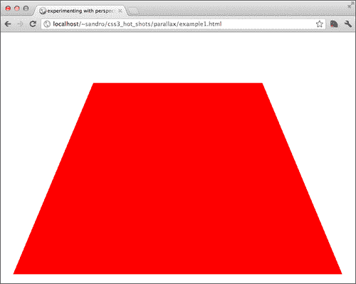

增加`perspective`属性的值，结果看起来会更扁平，另一方面，如果减少这个属性，红色的框看起来会被拉伸到地平线上。这里有一个`perspective: 250px`的例子：

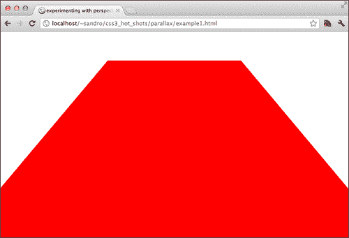

## 创建一个立方体

为了更好地理解一些`perspective`属性，我们可以利用我们到目前为止学到的知识，仅使用 CSS 创建一个真正的 3D 立方体。我们需要六个`div`标签，每个面一个，再加上一个作为其他面的容器：

```css
<!doctype html>
<html>
  <head>
    <meta charset="utf-8">
    <title>A cube</title>

    <style>

    body, html{
      height: 100%;
      width: 100%;
    }

    </style>

    <script src="img/prefixfree.js"></script>
  </head>
  <body>
    <div id="container">
      <div class="square back"></div>
      <div class="square bottom"></div>
      <div class="square right"></div>
      <div class="square left"></div>
      <div class="square top"></div>
      <div class="square front"></div>
    </div>
  </body>
</html>
```

首先，我们必须将一些属性应用于`#container`选择器；让我们在已经定义的`style`标签中插入以下一段 CSS 代码：

```css
    #container{
      perspective: 500px;
      backface-visibility: visible;
      transform-style: 'preserve-3d';	
      position: relative;
      height: 100%;
      width: 100%;
    }
```

在这里，我们告诉浏览器，容器内的内容必须考虑到 z 轴上的位置进行渲染，并且我们为`#container`选择器和容器内的元素设置了`perspective`属性为`500px`。最后但同样重要的是，我们要求浏览器也渲染我们将用来创建立方体的`div`标签的后面。

好的，现在让我们创建面。我们可以从`.square`的一些基本属性开始：

```css
.square{
  transform-style: 'preserve-3d';	
  position: absolute;
  margin: -100px 0px 0px -100px;
  top: 50%;
  left: 50%;
  height: 200px;
  width: 200px;;
}
```

好的，现在每个正方形都放在另一个上面，我们可以开始逐个调整它们。让我们从`.back`开始，我们必须将其从相机移开到一半大小，所以将`transform`属性设置为`-100px`：

```css
    .back{
      background: red;
      transform: translateZ(-100px);
    }
```

接下来我们看`.left`。在这里，我们首先必须对其 y 轴应用旋转，然后将其向左移动一半大小。这是因为除非另有说明，否则每个转换都是以元素中心为原点；另外，我们必须记住转换是按顺序应用的，所以元素必须沿其 z 轴进行平移，以获得正确的结果：

```css
    .left{
      background: blue;
      transform: rotateY(90deg) translateZ(-100px);
    }
```

这是一个提醒我们迄今为止取得的进展的屏幕截图：

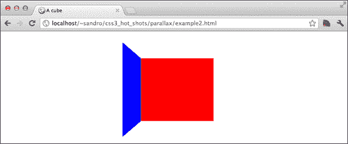

我们可以用相同的策略处理所有剩余的面：

```css
    .right{
      background: yellow;
      transform: rotateY(-90deg) translateZ(-100px);
    }

    .front{
      background: green;
      transform: translateZ(100px);
    }

    .top{
      background: orange;
      transform: rotateX(-90deg) translateZ(-100px);
    }

    .bottom{
      background: purple;
      transform: rotateX(90deg) translateZ(-100px);
    }
```

如果我们现在尝试对这个实验进行截图（如图所示），我们可能会遇到一点小失望：

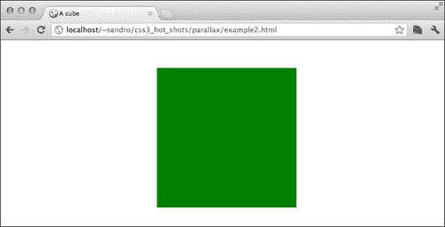

`.front`选择器的`div`标签覆盖了所有其他`div`标签。这个小实验向我们展示了一个场景的消失点默认设置为持有`perspective`属性的元素的中心。

## 透视原点属性

幸运的是，我们可以使用`perspective-origin`属性轻松改变消失点，该属性接受两个值，可以用所有常见的 CSS 测量单位或使用文字表达，就像`background-position`一样。

所以我们将把以下内容添加到`#container`：

```css
perspective-origin: top left;
```

并获得类似于这里显示的结果：

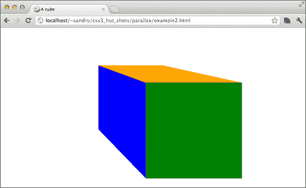

如果我们调整浏览器窗口大小，我们还会注意到消失点会改变，因为它与`#container`选择器相关联，该选择器的`width`和`height`属性设置为与浏览器视口相等。

这种行为是我们将在下一章中用来构建视差项目的技巧的根源。

# CSS 3D 视差

好了，现在我们有了开始构建项目所需的工具。我们要创建的基本想法是，如果我们将元素放置在不同的高度并在保持消失点在可见区域中心的情况下滚动，那么我们就可以获得一个很酷的视差滚动效果。

像往常一样，我们首先需要一个 HTML 结构，所以让我们从这里开始。让我们创建带有以下代码的`index.html`文件：

```css
<!doctype html>
<html>
  <head>
  <meta charset="utf-8">	
<link href='http://fonts.googleapis.com/css?family=Bowlby+One+SC' rel='stylesheet' type='text/css' data-noprefix>
    <link rel="stylesheet" type="text/css" href="http://yui.yahooapis.com/3.5.1/build/cssreset/cssreset-min.css" data-noprefix>
    <link rel="stylesheet" type="text/css" href="css/application.css">

    <script src="img/prefixfree.js"></script>
    <script src="img/jquery.min.js"></script>

  </head>
  <body>

    <div id="body">
      <div id="container">

      </div>
    </div>

  </body>
</html>
```

除了这个页面，我们还必须创建一个名为`css/application.css`的文件，其中将保存我们的 CSS 属性和选择器。就像我们在之前的例子中所做的那样，我们将`#body`拉伸到适合浏览器视口的大小，所以我们可以在`application.css`中添加几行 CSS 代码：

```css
body,html{
  height: 100%;
}

#body{
  height: 100%;
 overflow-y: auto;
 overflow-x: hidden;
}
```

我们还向元素添加了`overflow-y: auto`和`overflow-x: hidden`，我们将在一会儿讨论这些将如何有用。

## 在 WebKit 中实现视差滚动

好的，在继续之前，我们现在必须一次专注于一个布局引擎；这是因为在 WebKit 和 Firefox 之间关于实现 CSS 3D 属性的一些差异，所以我们必须分别处理这两种情况。让我们从 WebKit 开始。

我们可以利用 Lea Verou 的 Prefix Free 自动放在插入页面的`html`元素上的一个整洁的类。这个类的名称与浏览器所需的实验性前缀相同；所以如果我们从 Internet Explorer 查看页面，类是`-ms-`，如果从 Firefox 查看，它是`-moz-`。

所以我们可以开始向`#body`添加`perspective`和`transform-style`属性，就像我们在之前的例子中所做的那样：

```css
.-webkit- #body{
  perspective: 500px;
  transform-style: preserve-3d;
}
```

现在我们必须处理`#container`选择器；这必须比视口更长——和往常一样，用于此项目的所有图像都位于 Packt Publishing 网站上（[www.packtpub.com](http://www.packtpub.com)）：

```css
#container{
  background-image: url('../img/grass.png');
  text-align: center;
  padding-bottom: 300px;
  /* to be removed when we'll have content */
min-height: 1000px;
}
```

由于我们已经将`overflow`属性应用于`#body`，我们在浏览器中看到的滚动条并不属于整个 HTML 文档，而是属于`#body`。

但`#body`也有一个`perspective`属性；这意味着包含元素的消失点始终位于浏览器屏幕的中心，因此我们已经实现了我们在本章开头希望实现的结构。

为了测试我们的代码，我们可以在容器内添加一些元素并分配它们不同的高度：

```css
<div id="body">
  <div id="container">

  <!-- EXPERIMENT -->
    
    

  </div>
</div>
```

我们可以使用`transform: translateZ();`来设置高度：

```css
.experiment1{
  transform: translateZ(10px);
}

.experiment2{
  transform: translateZ(150px);
}
```

好了，现在我们可以在符合 WebKit 标准的浏览器中测试我们到目前为止所做的事情：

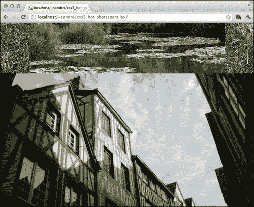

在滚动时，我们可以注意到第二张图片——离我们视点最近的图片——移动得比第一张图片快。我们刚刚在 WebKit 上实现了视差！

## 在 Gecko 中实现视差滚动

Gecko 和 WebKit 之间存在一些微妙的实现差异，以及一些错误。

首先，在 Gecko 中的`transform-style: preserve-3d`属性不会传播到匹配元素的所有后代，而只会传播到一级子元素。`perspective`和`perspective-origin`属性也是如此。

幸运的是，我们可以找到解决这个问题的方法。例如，可以通过将`perspective`表达为一个转换来实现：

```css
transform: perspective(500px);
```

当我们使用这种方法时，`perspective-origin`就不再有用了，应该用`transform-origin`代替。在 Gecko 内核的浏览器上这样强加`perspective`会导致与在 WebKit 内核的浏览器上使用 perspective 时相同的行为。

所以我们可以添加几行 CSS 代码，使用与我们在 WebKit 中所做的相同策略：

```css
.-moz- #container{
  transform: perspective(500px);
  transform-style: preserve-3d;	
}
```

如果我们现在打开 Firefox 并测试我们的项目，我们会看到类似这样的东西：

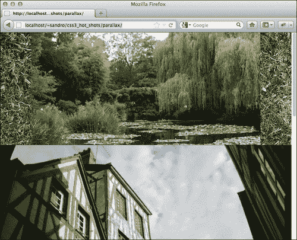

尽管结果看起来与 WebKit 获得的结果相似，但在这种情况下滚动页面不会产生任何视差效果。经过快速分析，我们可能会认为这种行为是由于将`transform: perspective`属性放在了错误的元素（`#container`而不是`#body`）上导致的，但事实是我们有意选择这样做是因为一个微妙的错误（[`bugzilla.mozilla.org/show_bug.cgi?id=704469`](https://bugzilla.mozilla.org/show_bug.cgi?id=704469)）会从具有`overflow`属性的元素中移除`transform: perspective`属性。

所以现在使 Gecko 内核的浏览器表现如预期的唯一方法是实现一小段 JavaScript 代码，可以动态修改我们的消失点，使其保持在浏览器窗口的中心。

这个脚本必须根据滚动事件调整`transform-origin`属性：

```css
<script>
  $(document).ready(function(){
    if($.browser.mozilla){
      $('#body').scroll(function(event){
        var viewport_height = $(window).height(),
          body_scrolltop = $('#body').scrollTop(),
          perspective_y = body_scrolltop + Math.round( viewport_height / 2 );

        $('#container').css({
          'transform-origin': 'center ' + perspective_y + "px",
          '-moz-transform-origin': 'center ' + perspective_y + "px",
        });
      })
    }
  });
</script>
```

完美！现在 Gecko 内核的浏览器也会表现如预期。

## 在 Internet Explorer 中实现视差滚动

Internet Explorer 9 不支持 CSS 3D 变换，但 IE10 支持，所以我们也可以尝试在该浏览器上运行这个项目。为了在 IE10 上实现正确的行为，我们必须应用一些自定义属性；这是因为 IE10 的行为与其他两个浏览器的行为略有不同。

基本上 IE10 支持`perspective`和`transform: perspective`属性，但前者只对具有此属性的元素的直接后代产生影响，后者只对具有该属性的元素起作用。

所以我们必须采用一种更接近 Gecko 内核的行为，但使用`perspective`代替`transform: perspective`。这里是：

```css
.-ms- #container{
  perspective: 500px;
}
```

现在我们还需要稍微改变我们的 JavaScript 代码，以便在浏览器是 Internet Explorer 并支持 3D 变换时影响`perspective-origin`。以下是可以用来代替先前代码的代码：

```css
// == for Firefox and MSIE users ==
$(document).ready(function(){
  if($.browser.mozilla || ( $.browser.msie&& Modernizr.csstransforms3d )){
    $('#body').scroll(function(event){
      var viewport_height = $(window).height(),
        body_scrolltop = $('#body').scrollTop(),
        perspective_y = body_scrolltop + Math.round( viewport_height / 2 );

      if($.browser.mozilla){              
        $('#container').css({
          'transform-origin': 'center ' + perspective_y + "px",
          '-moz-transform-origin': 'center ' + perspective_y + "px",
        });
      }else{
        $('#container').css({
          'perspective-origin': 'center ' + perspective_y + "px",
          '-ms-perspective-origin': 'center ' + perspective_y + "px",
        });
      }
    })
  }
});
```

为了使这个工作，我们必须下载 Modernizr 以检查 CSS 3D 支持，我们可以像在上一章中那样创建一个自定义构建，但这次我们只在配置面板中检查**CSS 3D** **Transforms**复选框（[`modernizr.com/download/`](http://modernizr.com/download/)）。接下来，我们必须在页面中包含下载的文件（[js/modernizr.js](http://js/modernizr.js)）在其他`script`标签之后：

```css
<script src="img/modernizr.js"></script>
```

这是 IE10 的屏幕截图：

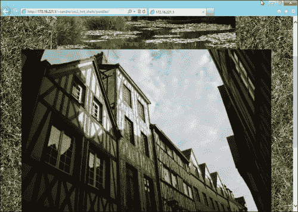

# 向画廊添加一些随机性

现在我们已经解决了浏览器兼容性问题，我们可以安全地删除我们之前附加到图像的实验性注释和类。

为了营造一种随机感，我们可以定义一些类的组，每个组有同一属性的更多变体，然后我们可以为每个图像的每个组选择一个类来显示。这是一个例子；让我们将以下内容添加到`application.css`：

```css
/* sizes */
.size-a{
  width: 30%;
}

.size-b{
  width: 35%;
}

.size-c{
  width: 50%;
}

/* z-indexes */
.depth-a{
  transform: translateZ(10px);
  z-index: 1;
}

.depth-b{
  transform: translateZ(50px);
  z-index: 2;
}

.depth-c{
  transform: translateZ(100px);
  z-index: 3;
}

.depth-d{
  transform: translateZ(150px);
  z-index: 4;
}

.depth-e{
  transform: translateZ(200px);
  z-index: 5;
}
```

现在我们可以用这个列表替换上一节中使用的图像，其中每个图像都有一个`depth-*`和一个`size-*`属性（其中`*`表示在前面的代码中定义的随机选择的类）：

```css


```

最后但并非最不重要的，让我们为每个图像定义基本的 CSS：

```css
img.basic_parallax{
  background: rgb(255,255,255);
  padding: 10px;
  box-shadow: 10px 10px10pxrgba(0,0,0,0.6);
  position: relative;
  margin: 10px;
}
```

好了，现在让我们重新加载浏览器并测试一下：

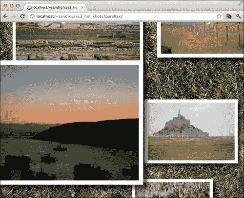

# 旋转图像

由于我们正在处理一个真正的 3D 环境，我们可以尝试使用相同的基本思想开发更有趣的效果。例如，如果我们旋转一个元素而不是简单地将它向我们移动会怎么样？让我们试试！首先，我们需要向我们的画廊添加一些更多的图像；这次我们还决定添加一些装饰性文本，如下：

```css
<!-- DECKS -->

<p>
  Keremma Dunes
  <small>Bretagne, Finist&eacute;re</small>
</p>

<p class="depth-e">
  Rennes
  <small>Bretagne</small>
</p>

```

然后我们可以对图像使用`rotateX`变换方法：

```css
.rotatextop{
  transform-origin: top center;
  transform: rotateX(15deg);
}

.rotatexbottom{
  transform-origin: bottom center;
  transform: rotateX(-15deg);		
}
```

还有一些 CSS 属性来稍微样式化段落，然后我们就完成了：

```css
p{
  text-align: center;
  font-family: 'Bowlby One SC', cursive;
  font-size: 6em;
  color: #e4ddc2;
}

p small{
  display: block;
  font-size: 0.4em;
  margin-top: -1em;
}
```

这是结果画廊的屏幕截图：

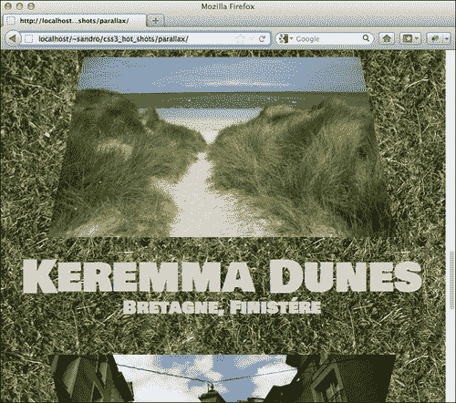

# 一个 3D 全景

让我们也尝试使用`rotateY`方法来完成这个项目。这次我们将使用这个属性以及`perspective-origin`属性技巧来创建一个很酷的全景效果。

首先我们需要一个全景图像，然后我们可以使用图像编辑器将其切成三部分，其中中央图像的大小大约是其他两个的两倍（例如，800 x 800 像素和 500 x 800 像素）。完成后，我们可以将这些图像添加到`#container`选择器的末尾之前：

```css
<p>
  Ortigia
  <small>Italy</small>
</p>


```

现在我们可以对`.left`和`.right`都使用`rotateY`方法，如下：

```css
.panorama.left{
  transform-origin: center right;
  transform: rotateY(43deg);  
}

.panorama.right{
  transform-origin: center left;
  transform: rotateY(-43deg);	
}

.panorama.left, .panorama.right{
  width: 27%;
}

.panorama.center{
  width: 43.2%;
}
```

这就是结果：

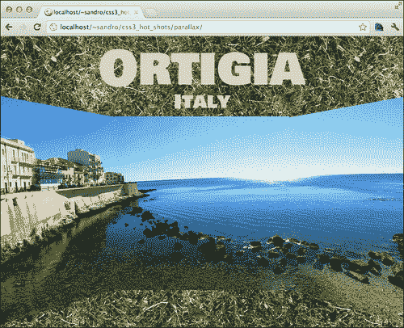

# 处理旧版本浏览器

尽管这个项目的核心效果利用了一些 CSS 3D 属性，这些属性在旧版本的浏览器中无法模拟，但整个结构只使用了兼容 CSS 2 的属性和选择器，因此几乎可以在任何浏览器中查看：

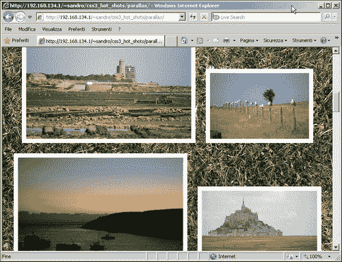

# 摘要

处理第三维可能会导致与许多小的实现差异的斗争，但一旦我们驯服了它们，结果就会令人惊叹并且非常愉快。

到目前为止，我们在本章讨论了以下内容：

+   CSS 可以用来转换元素并将它们移动到 3D 空间中

+   我们可以使用一些属性来定义 3D 场景中的消失点

+   通过使用 CSS 3D 属性，可以模拟出很酷的视差滚动效果

+   需要一些 JavaScript 编码来处理浏览器实现差异

在下一章中，我们将学习如何使用 CSS 增强 HTML5 的`video`元素。
