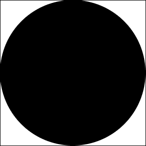
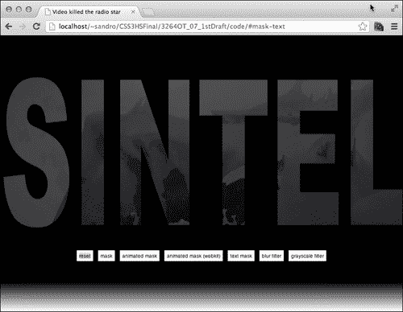

# 第七章：视频杀死了广播明星

在撰写本文时，使用 CSS 和 HTML`video`元素仍然有点像黑魔法。主要问题是每个浏览器都利用其特定的视频实现技术；其中一些使用 GPU，而其他一些使用用于页面其余部分的相同渲染引擎。在本章中，我们将探讨如何通过利用 SVG 和 CSS 的功能在运行视频上创建面具和效果。以下是我们将涵盖的主题列表：

+   HTML5`video`元素

+   使用 SVG 进行面具处理

+   SVG 动画

+   基于 WebKit 的特定面具属性

+   CSS 滤镜

# HTML5 视频元素

HTML5 规范引入了新的多媒体元素，允许更好地将视频和音频整合到网页中，而无需嵌入外部插件，如 Flash。现在嵌入视频就像写这样简单：

```css
<video src="img/video">
```

但是需要考虑一些注意事项；首先，每个浏览器只支持视频编解码器的一小部分，因此如果我们希望我们的元素能够播放，我们需要至少将我们的视频编码为`mp4`和`webm`，然后使用另一种语法来包含这两种格式，如下所示：

```css
<video>
  <source src="img/video.mp4" type="video/mp4">
  <source src="img/video.webm" type="video/webm">
</video>
```

**Miro**（[`www.mirovideoconverter.com/`](http://www.mirovideoconverter.com/)）是一款很好的免费视频转换软件，适用于 Mac 和 Windows 操作系统。它非常易于使用 - 只需选择所需的输出格式，然后将文件拖放到应用程序窗口中开始转换过程。

一旦设置了我们的`video`元素，我们很快就会发现大多数常见的 CSS3 属性在所有浏览器上对这个元素的形状的影响并不相同。例如，`border-radius`属性；在下面的屏幕截图中，显示了这个属性在各种浏览器中的不同行为（请注意这个属性在不同浏览器中的不同行为）：


基于 WebKit 的浏览器似乎忽略了这个属性，而 Firefox 和 IE9 正确实现了它。这可能是因为 Chrome 和 Safari 使用 GPU 播放视频，因此无法很好地对此内容应用 CSS 修改。

布局引擎之间的这些差异在处理视频和 CSS 时需要谨慎对待。

在这个项目中，我们将使用 CSS 开发一小部分可以在运行时应用于视频的修改。让我们从一些基本的面具开始。

# 面具

**面具**是在我们需要隐藏部分内容时非常有用的工具；它们在视频中更加有用，因为我们可以应用有趣的效果，否则需要一些专门的软件。我们可以使用 HTML5/CSS3 创建面具的几种技术；然而，跨浏览器的支持是不一致的。为了解决这些不一致性，我们将在系列中结合几种技术。

在某种程度上，我们可以使用`border-radius`来遮罩我们的视频，如下所示：

```css
<!doctype html>
<html>

  <head>
    <meta charset="utf-8">
    <title>Masking</title>

    <style>
      video{
        border-radius: 300px;
      }
    </style>

  </head>

  <body>

    <video autoplay muted loop>
      <source src="img/sintel-trailer.mp4">
      <source src="img/sintel-trailer.webm">
    </video>

  </body>

</html>
```

正如你所看到的，这种方法适用于 Firefox 和 IE，但对于基于 WebKit 的浏览器，我们需要使用不同的方法。

如果我们使用 Web 服务器（如 Apache 或 IIS）进行工作，可能需要配置它以使用适当的内容类型提供视频文件。为此，我们可以在项目的根目录（如果使用 Apache）中创建一个`.htaccess`文件，内容如下：

```css
AddType video/ogg .ogv 
AddType video/mp4 .mp4 
AddType video/webm .webm
```

如果我们使用 IIS，还有另一个程序需要遵循。这在[`blog.j6consultants.com.au/2011/01/10/cross-browser-html5-video-running-under-iis-7-5/`](http://blog.j6consultants.com.au/2011/01/10/cross-browser-html5-video-running-under-iis-7-5/)的指南中有详细说明。

自 2008 年以来，WebKit 支持一组管理面具的 CSS 属性。我们将使用`webkit-mask-box-image`选择器将图像面具应用到我们的电影示例中。为此，我们需要一个类似于以下图像中的`300px`黑色圆：



然后，我们将使用之前介绍的属性将这个黑色圆设置为`video`元素的蒙版。应用后，这个图像的黑色部分将让底层内容可见，而白色部分将完全隐藏内容。当然，灰色可以用来部分隐藏/显示内容。

```css
video{
  border-radius: 300px;
  -webkit-mask-box-image: url(img/circle-mask.png) stretch;
}
```

这是结果：


## 更高级的蒙版

目前，我们只能处理基本类型的蒙版，也就是一切可以用`border-radius`属性模拟的东西。但是，如果我们尝试简单地创建一个中心有小圆的蒙版，我们会发现这种组合在以前的技术中是不可行的，因为圆角只能位于元素的一侧。幸运的是，我们可以转向一个更复杂但更强大的方法，涉及 SVG 格式。

Gecko 和 WebKit 都支持 SVG 蒙版，通过不同的 CSS 属性——基于 Gecko 的浏览器使用`mask`属性，而 WebKit 使用`-webkit-mask-image`。

这些属性不仅名称不同，它们的行为也不同：

+   `mask`属性需要链接到一个名为`<mask>`的 SVG 元素，基本上是我们将用来蒙版`html`元素的所有形状的容器

+   另一方面，`-webkit-mask-image`属性需要指向一个包含我们想要用来覆盖视频的所有形状的 SVG 元素

例如，这是我们如何正确实现`mask`属性的：

```css
<!doctype html>
<html>

  <head>
    <meta charset="utf-8">
    <title>svg mask</title>

  </head>

  <body>

    <video autoplay muted loop>
      <source src="img/sintel-trailer.mp4">
      <source src="img/sintel-trailer.webm">
    </video>

 <style>
 video{
 mask: url('#circle');
 }
 </style>

 <svg>
 <defs>
 <mask id="circle">
 <circle cx="427" cy="240" r="100" fill="white"/>
 </mask>
 </defs>
 </svg>

  </body>

</html>
```

这是我们如何处理`-webkit-mask-image`属性的：

```css
<!doctype html>
<html>

  <head>
    <meta charset="utf8">
    <title>svg mask</title>

  </head>

  <body>

    <video autoplay muted loop>
      <source src="img/sintel-trailer.mp4">
      <source src="img/sintel-trailer.webm">
    </video>

 <style>
 video{
 -webkit-mask-image: url('svg/mask-circle.svg');
 }
 </style>

  </body>

</html>
```

在这里，SVG 文件`svg/mask-circle.svg`的定义如下：

```css
<?xml version="1.0" standalone="no"?>
<!DOCTYPE svg PUBLIC "-//W3C//DTD SVG 1.1//EN" "http://www.w3.org/Graphics/SVG/1.1/DTD/svg11.dtd">

<svg version="1.1"  >
 <circle cx="427" cy="240" r="100" fill="white"/>
</svg>
```

在这两种情况下，最终结果是相同的，如下所示：


这种方法的缺点是我们必须创建两个不同的 SVG 片段来适应两种布局引擎。这里有一个小的改进，可以让我们走向更好的解决方案；通过利用`<use>`元素，我们可以在单个 SVG 文件`svg/mask.svg`中满足两种属性的需求，如下所示：

```css
<?xml version="1.0" standalone="no"?>
<!DOCTYPE svg PUBLIC "-//W3C//DTD SVG 1.1//EN" "http://www.w3.org/Graphics/SVG/1.1/DTD/svg11.dtd">

<svg version="1.1"  >
  <defs>
 <mask id="circle">
 <circle id="circle-element" cx="427" cy="240" r="100" fill="white"/>
 </mask>
  </defs>
 <use xlink:href="#circle-element"/>
</svg>
```

通过使用这种方法，我们可以在两个浏览器上获得与之前图像相同的结果，并且只需一个 CSS 语句：

```css
<!doctype html>
<html>

  <head>
    <meta charset="utf-8">
    <title>svg mask</title>

    <style>
 video{
 mask: url('svg/mask.svg#circle');
 -webkit-mask-image: url('svg/mask.svg');
 }
    </style>

  </head>

  <body>

    <video autoplay muted loop>
      <source src="img/sintel-trailer.mp4">
      <source src="img/sintel-trailer.webm">
    </video>

  </body>

</html>
```

干得好！现在我们准备在项目中实现一些蒙版。

# 实现项目

在这个项目中，我们将使用 Sintel 的精美预告片（[`www.sintel.org/about/`](http://www.sintel.org/about/)），这是根据知识共享许可发布的电影。

和往常一样，我们需要一个基本的项目结构，包括一些文件夹（`css`，`img`，`svg`，`js`，`video`）。在这个项目中使用的视频要么可以在 Sintel 网站上找到，要么可以从 Packt 的网站（[www.packtpub.com](http://www.packtpub.com)）下载，以及完成的项目。我们还将使用**Prefix Free**（[`leaverou.github.com/prefixfree/`](http://leaverou.github.com/prefixfree/)），所以让我们下载它并放到`js`文件夹中。

让我们创建一个`index.html`文件开始：

```css
<!doctype html>
<html>

  <head>
    <meta charset="utf8">
    <title>Video killed the radio star</title>

    <link rel="stylesheet" type="text/css" href="http://yui.yahooapis.com/3.5.1/build/cssreset/cssreset-min.css" data-noprefix>
    <link rel="stylesheet" type="text/css" href="css/application.css">

    <script src="img/prefixfree.min.js"></script>

  </head>

  <body>

    <a id="mask" name="mask"></a>
    <a id="mask-stretch" name="mask-stretch"></a>
    <a id="mask-animate" name="mask-animate"></a>
    <a id="mask-animate-webkit" name="mask-animate-webkit"></a>
    <a id="mask-text" name="mask-text"></a>
    <a id="blur-filter" name="blur-filter"></a>
    <a id="grayscale-filter" name="grayscale-filter"></a>

    <video autoplay muted loop>
      <source src="img/sintel-trailer.mp4">
      <source src="img/sintel-trailer.webm">
    </video>

    <ul>
      <li>
        <a href="#">reset</a>
      </li>
 <li>
 <a href="#mask">mask</a>
 </li>
      <li>
        <a href="#mask-animate">animated mask</a>
      </li>
      <li>
        <a href="#mask-animate-webkit">animated mask (webkit)</a>
      </li>
      <li>
        <a href="#mask-text">text mask</a>
      </li>
      <li>
        <a href="#blur-filter">blur filter</a>
      </li>
      <li>
        <a href="#grayscale-filter">grayscale filter</a>
      </li>
    </ul>
  </body>

</html>
```

然后，在`application.css`中，让我们进行一些基本的 CSS 样式以及刚刚介绍的蒙版技术：

```css
html{
  min-height: 100%;
  background-image: linear-gradient(top, black, black 500px, white);
  background-size: cover;
  background-repeat: no-repeat;
}

video{
  display: block;
  margin: 0 auto;
}

ul{
  text-align: center;
  position: absolute;
  bottom : 100px;
  width: 100%;
}

li{
  display: inline;
}

li > a{
  display: inline-block;
  padding: 5px;
  background: #FFF;
  border: 3px solid black;
  text-decoration: none;
  font-family: sans-serif;
  color: black;
  font-size: 10px;
}

/* ==[BEGIN] Masking == */

a[name="mask"]:target ~ video{
 mask: url('../svg/mask.svg#circle');
 -webkit-mask-image: url('../svg/mask.svg');
}
```

一旦按下**mask**按钮，这就是结果：


## 动画蒙版

SVG 支持通过一些特殊元素进行动画。在本章中，我们将使用最通用的一个`<animate>`。

这是一个例子：

```css
<circle ... >
<animate attributeType="CSS" attributeName="opacity" from="1" to="0" dur="5s" repeatCount="indefinite" />
</circle>
```

包含`<animate>`的元素会根据标签属性中指定的选项描述进行属性动画。在上面的代码中，我们要求浏览器在五秒内将圆的不透明度从完全可见变为隐藏。

因此，如果我们创建一个新的 SVG 文件，命名为`svg/mask-animate.svg`，并使用以下代码，我们将能够在 Gecko 和 WebKit 浏览器上获得一个动画效果：

```css
<?xml version="1.0" standalone="no"?>
<!DOCTYPE svg PUBLIC "-//W3C//DTD SVG 1.1//EN" "http://www.w3.org/Graphics/SVG/1.1/DTD/svg11.dtd">

<svg version="1.1"  >
  <defs>
    <mask id="circle">
      <circle id="circle-element" cx="427" cy="240" r="100" fill="white">
 <animate attributeName="r" values="100;200;100" dur="5s" repeatCount="indefinite" />
      </circle>
    </mask>
  </defs>
  <use xlink:href="#circle-element"/>
</svg>
```

这是我们需要添加到`css/application.css`的 CSS：

```css
a[name="mask-animate"]:target ~ video{
  mask: url('../svg/mask-animate.svg#circle');
  -webkit-mask-image: url('../svg/mask-animate.svg');
}
```

并且这是蒙版在 5 秒动画中增长和缩小的结果：


# WebKit 特定属性

还有一些与蒙版相关的额外属性，只适用于 WebKit 浏览器；它们的工作方式与它们的`background`属性对应项完全相同，因此以下是原始 WebKit 博客文章中列出的列表：

+   `-webkit-mask`（`background`）：这是所有其他属性的快捷方式

+   `-webkit-mask-attachment`（`background-attachment`）：这定义了蒙版是否应在内容中滚动

+   `-webkit-mask-clip`（`background-clip`）：这指定了蒙版的裁剪区域

+   `-webkit-mask-position`（`background-position`）：此属性指定元素内蒙版的位置

+   `-webkit-mask-origin`（`background-origin`）：这指定了坐标 0,0 应该放置在元素内的位置（例如，在使用`padding-box`作为值的填充区域的开始处）

+   `-webkit-mask-image`（`background-image`）：这指向一个或多个图像或渐变，用作蒙版

+   `-webkit-mask-repeat`（`background-repeat`）：这定义了蒙版是否应重复，以及是在一个方向还是两个方向

+   `-webkit-mask-composite`（`background-composite`）：这指定了两个蒙版在重叠时应该如何合并

+   `-webkit-mask-box-image`（`border-image`）：这指向一个或多个图像或渐变，用作具有相同属性和行为的蒙版来定义边框图像

有了这些新属性，我们可以通过利用 CSS 过渡创建一些额外的效果，例如，我们可以用渐变蒙版我们的电影，然后使用`:hover`，改变它的蒙版位置；以下是 CSS 代码：

```css
a[name="mask-animate-webkit"]:target ~ video{
  -webkit-mask-position: 0 100%;
  -webkit-mask-size: 100% 200%;
  -webkit-mask-image: -webkit-gradient(linear, center top, center bottom, 
      color-stop(0.00,  rgba(0,0,0,1)),
      color-stop(1.00,  rgba(0,0,0,0))
    );
  -webkit-transition: -webkit-mask-position 1s;
}

a[name="mask-animate-webkit"]:target ~ video:hover{
  -webkit-mask-position: 0 0;
}
```

由于这些 WebKit 蒙版属性是在 2008 年创建的，可能自那时以来从未更新过，我们必须使用旧的 WebKit 渐变语法；除此之外，其他一切都很简单，如下图所示：


# 使用文本蒙版

我们可以使用文本来蒙版`video`元素；该过程与我们之前看到的类似，但当然，我们需要制作另一个特定的 SVG 文件，命名为`svg/mask-text.svg`：

```css
<?xml version="1.0" standalone="no"?>
<!DOCTYPE svg PUBLIC "-//W3C//DTD SVG 1.1//EN" "http://www.w3.org/Graphics/SVG/1.1/DTD/svg11.dtd">

<svg   width="1000" height="280" version="1.1">
  <defs>
    <mask id="sintel-mask">
 <text x="0" y="300" id="sintel" fill="white" style="color: black;font-size:210px;
 font-family: Blue Highway, Arial Black, sans-serif;">SINTEL</text>
    </mask>
  </defs>
 <text x="0" y="80%" id="sintel" fill="white" style="color: black;font-size:240px;
 font-family: Blue Highway, Arial Black, sans-serif;">SINTEL</text>
</svg>
```

在这里，我们无法利用`<use>`元素，因为蒙版定位和蒙版大小的确定方式之间存在另一个差异。

基于 Gecko 的浏览器只能承受固定坐标，而基于 WebKit 的浏览器可以拉伸蒙版以适应屏幕，如果我们使用`-webkit-mask-box-image`（如本章中最初的示例中所示）而不是`-webkit-mask-image`。

以下是所需的 CSS：

```css
a[name="mask-text"]:target ~ video{
  mask: url('../svg/mask-text.svg#sintel-mask');
  -webkit-mask-box-image: url('../svg/mask-text.svg');
}
```

这是结果的屏幕截图：



# 滤镜

除了蒙版，滤镜是其他强大的修改器，可以应用于元素，以获得各种效果，如模糊、灰度等。当然，也有缺点；在撰写本文时，滤镜支持是不均匀的。以下是一些缺点：

+   IE9 支持使用众所周知的`progid`滤镜的一些效果

+   Firefox 支持在 SVG 片段中声明滤镜

+   Chrome、Safari 和其他基于 WebKit 的浏览器支持最后的 CSS 滤镜规范

+   IE10 尚未确认对这些属性的支持，而且它将放弃对`progid`滤镜的支持

因此，让我们尽可能广泛地实现模糊滤镜。首先，我们将处理非常容易的 WebKit：

```css
-webkit-filter: blur(3px);
```

传递给`blur`函数的参数是效果的像素半径。接下来是 Gecko 支持；为此，我们必须在一个正确完成的 SVG 文件中使用`feGaussianBlur`元素，命名为`svg/filters.svg`：

```css
<?xml version="1.0" standalone="no"?>
<!DOCTYPE svg PUBLIC "-//W3C//DTD SVG 1.1//EN" "http://www.w3.org/Graphics/SVG/1.1/DTD/svg11.dtd">
<svg   version="1.1">
  <defs>
    <filter id="blur">
    <feGaussianBlur stdDeviation="3" />
  </filter>
  </defs>
</svg>
```

然后，我们可以使用 Gecko 支持的`filter`属性来引用这个效果：

```css
filter: url('../svg/filters.svg#blur');
```

接下来，我们还可以通过使用`progid`滤镜在 IE9 上实现这种效果：

```css
filter:progid:DXImageTransform.Microsoft.Blur(pixelradius=3);
```

以下是最终的 CSS。请注意，我们添加了一个`:hover`选择器技巧来在鼠标悬停时改变模糊；这实际上只在基于 WebKit 的浏览器上有效，但可以通过遵循先前规则轻松扩展支持：

```css
a[name="blur-filter"]:target ~ video{
  -webkit-filter: blur(3px);
  -webkit-transition: -webkit-filter 1s;      
  filter: url('../svg/filters.svg#blur');
}

.-ms- a[name="blur-filter"]:target ~ video{
  filter:progid:DXImageTransform.Microsoft.Blur(pixelradius=3);
}

a[name="blur-filter"]:target ~ video:hover{
  -webkit-filter: blur(0px);
}
```

我们还必须处理 Gecko 和 IE9 引用相同的`filter`属性但具有非常不同的值。为了解决这个问题，我们可以使用 Lea Verou 的 prefixfree 库在顶级`html`元素上添加的特殊`-ms-`类。

以下是结果：


在当前稳定的 Chrome 版本中，`filter`属性似乎无法直接使用。这是因为我们需要在加速元素上启用滤镜。因此，让我们打开一个新标签页，然后在地址栏中输入`about:flags`并启用**GPU 加速的 SVG 和 CSS 滤镜**实验功能。

## 灰度滤镜

让我们再看一个滤镜，灰度！灰度滤镜基本上将目标图像或视频的所有颜色转换为相应的灰度值。

这是完整的 CSS：

```css
/* == [BEGIN] Grayscale filter == */

a[name="grayscale-filter"]:target ~ video{
  -webkit-filter: grayscale(1);
  filter: url('../svg/filters.svg#grayscale');
}

.-ms- a[name="grayscale-filter"]:target ~ video{
  filter:progid:DXImageTransform.Microsoft.BasicImage(grayscale=1);
}
```

这是 SVG 片段：

```css
  <filter id="grayscale">
          <feColorMatrix values="0.3333 0.3333 0.3333 0 0
                                 0.3333 0.3333 0.3333 0 0
                                 0.3333 0.3333 0.3333 0 0
                                 0      0      0      1 0"/>
  </filter>
```

最后，这是从 IE9 中截取的屏幕截图：


我们的元素可以应用许多其他滤镜；要获取完整列表，我们可以查看：

+   官方滤镜草案规范在[`dvcs.w3.org/hg/FXTF/raw-file/tip/filters/index.html`](https://dvcs.w3.org/hg/FXTF/raw-file/tip/filters/index.html)

+   SVG 规范的**滤镜效果**部分在[`www.w3.org/TR/SVG/filters.html`](http://www.w3.org/TR/SVG/filters.html)

+   MSDN 上的**滤镜**部分在[`msdn.microsoft.com/en-us/library/ms532847(v=vs.85).aspx`](http://msdn.microsoft.com/en-us/library/ms532847(v=vs.85).aspx)

# 总结

在本章中，我们发现了如何使用 CSS 处理 HTML5 `video`元素；我们了解到浏览器的行为非常不同，因此我们必须实施各种技术以实现兼容性。

我们找出了如何动态添加蒙版 - 静态或动画 - 以及如何创建滤镜，无论是使用 SVG 还是新的 W3C 规范。

在下一章中，我们将学习如何处理复杂的动画。
