# 第八章：仪表

在 Web 应用程序开发中，仪表可以用于以视觉或直观的方式显示复杂或动态数据。在本章中，我们将学习如何创建一个完全可定制的动画仪表，可以对实时变化做出响应。我们还将讨论将此类小部件移植到旧的 Web 浏览器中的技术。我们将首先学习一个名为**Compass**的很酷的 SASS 增强功能；这是处理 CSS3 实验前缀的另一种方法。以下是我们将讨论的主题列表：

+   基本仪表结构

+   使用 Compass

+   使用 rem

+   移动箭头

+   动画化箭头

+   处理旧的浏览器

# 基本仪表结构

让我们从一个新项目开始；像往常一样，我们需要创建一个`index.html`文件。这次所涉及的标记非常小而紧凑，我们现在可以立即添加它：

```css
<!doctype html>
<html>
<head>
<meta charset="utf-8">
<meta http-equiv="X-UA-Compatible" content="IE=edge" />

  <title>Go Go Gauges</title>

  <link rel="stylesheet" type="text/css" href="css/application.css">
</head>
<body>

 <div data-gauge data-min="0" data-max="100" data-percent="50">
 <div data-arrow></div>
 </div>

</body>
</html>
```

仪表小部件由`data-gauge`属性标识，并使用其他三个自定义数据属性进行定义；即`data-min`，`data-max`和`data-percent`，它们表示范围的最小和最大值以及以百分比值表示的当前箭头位置。

在标有`data-gauge`属性的元素内，我们定义了一个将成为仪表箭头的`div`标记。

要开始样式化阶段，我们首先需要装备一个易于使用并且可以为我们提供生成 CSS 代码的框架。我们决定使用 SASS，与我们在第五章中使用的相同，*图库*，因此我们首先需要安装 Ruby（[`www.ruby-lang.org/en/downloads/`](http://www.ruby-lang.org/en/downloads/)），然后从命令行终端输入以下内容：

```css
gem install sass

```

### 注意

如果您在 Unix/Linux 环境中工作，可能需要执行以下命令：

```css
sudo gem install sass

```

# 安装 Compass

对于这个项目，我们还将使用 Compass，这是一个 SASS 扩展，能够为我们的 SASS 样式表添加一些有趣的功能。

要安装 Compass，我们只需在终端窗口中输入`gem install compass`（或`sudo gem install compass`）。安装过程结束后，我们必须在项目的根文件夹中创建一个名为`config.rb`的小文件，其中包含以下代码：

```css
# Require any additional compass plugins here.

# Set this to the root of your project when deployed:
http_path = YOUR-HTTP-PROJECT-PATH
css_dir = "css"
sass_dir = "scss"
images_dir = "img"
javascripts_dir = "js"

# You can select your preferred output style here (can be overridden via the command line):
# output_style = :expanded or :nested or :compact or :compressed

# To enable relative paths to assets via compass helper functions. Uncomment:
relative_assets = true

# To disable debugging comments that display the original location of your selectors. Uncomment:
# line_comments = false

preferred_syntax = :sass 

```

`config.rb`文件帮助 Compass 了解项目的各种资产的位置；让我们详细了解这些选项：

+   `http_path`：这必须设置为与项目根文件夹相关的 HTTP URL

+   `css_dir`：这包含了生成的 CSS 文件应保存的文件夹的相对路径

+   `sass_dir`：这包含了包含我们的`.scss`文件的文件夹的相对路径

+   `images_dir`：这包含了项目所有图像的文件夹的相对路径

+   `javascripts_dir`：与`images_dir`类似，但用于 JavaScript 文件

还有其他可用的选项；我们可以决定输出的 CSS 是否应该被压缩，或者我们可以要求 Compass 使用相对路径而不是绝对路径。有关所有可用选项的完整列表，请参阅[`compass-style.org/help/tutorials/configuration-reference/`](http://compass-style.org/help/tutorials/configuration-reference/)上的文档。

接下来，我们可以创建刚才描述的文件夹结构，为我们的项目提供`css`，`img`，`js`和`scss`文件夹。最后，我们可以创建一个空的`scss/application.scss`文件，并开始发现 Compass 的美丽。

# CSS 重置和供应商前缀

我们可以要求 Compass 在对其 SCSS 对应文件进行每次更新后重新生成 CSS 文件。为此，我们需要在项目的根目录中使用终端执行以下命令：

```css
compass watch .

```

Compass 提供了一个替代我们在上一个项目中使用的 Yahoo!重置样式表。要包含此样式表，我们只需在`application.scss`文件中添加一个 SASS `include`指令：

```css
@import "compass/reset";

```

如果我们检查`css/application.css`，结果如下（已修剪）：

```css
/* line 17, ../../../../.rvm/gems/ruby-1.9.3-p194/gems/compass-0.12.2/frameworks/compass/stylesheets/compass/reset/_utilities.scss */
html, body, div, span, applet, object, iframe,
h1, h2, h3, h4, h5, h6, p, blockquote, pre,
a, abbr, acronym, address, big, cite, code,
del, dfn, em, img, ins, kbd, q, s, samp,
small, strike, strong, sub, sup, tt, var,
b, u, i, center,
dl, dt, dd, ol, ul, li,
fieldset, form, label, legend,
table, caption, tbody, tfoot, thead, tr, th, td,
article, aside, canvas, details, embed,
figure, figcaption, footer, header, hgroup,
menu, nav, output, ruby, section, summary,
time, mark, audio, video {
  margin: 0;
  padding: 0;
  border: 0;
  font: inherit;
  font-size: 100%;
  vertical-align: baseline;
}

/* line 22, ../../../../.rvm/gems/ruby-1.9.3-p194/gems/compass-0.12.2/frameworks/compass/stylesheets/compass/reset/_utilities.scss */
html {
  line-height: 1;
}

... 
```

还要注意生成的 CSS 如何保留对原始 SCSS 的引用；当需要调试页面中一些意外行为时，这非常方便。

接下来的`@import`指令将处理 CSS3 实验性供应商前缀。通过在`application.scss`文件顶部添加`@import "compass/css3"`，我们要求 Compass 自动为我们提供许多强大的方法来添加实验性前缀；例如，以下代码片段：

```css
.round {
    @include border-radius(4px);
}
```

编译成以下内容：

```css
.round {
    -moz-border-radius: 4px;
    -webkit-border-radius: 4px;
    -o-border-radius: 4px;
    -ms-border-radius: 4px;
    -khtml-border-radius: 4px;
    border-radius: 4px;
}
```

装备了这些新知识，我们现在可以开始部署项目了。

# 使用 rem

对于这个项目，我们想引入`rem`，这是一个几乎等同于`em`的测量单位，但始终相对于页面的根元素。因此，基本上我们可以在`html`元素上定义一个字体大小，然后所有的大小都将与之相关：

```css
html{
  font-size: 20px;
}
```

现在，`1rem`对应`20px`；这种测量的问题在于一些浏览器，比如 IE8 或更低版本，实际上不支持它。为了解决这个问题，我们可以使用以下两种不同的备用测量单位：

+   `em`：好消息是，`em`如果完全调整，与`rem`完全相同；坏消息是，这种测量单位是相对于元素的`font-size`属性而不是相对于`html`。因此，如果我们决定采用这种方法，那么每次处理`font-size`时，我们都必须特别小心。

+   `px`：我们可以使用固定单位像素大小。这种选择的缺点是在旧版浏览器中，我们使得动态改变小部件比例的能力变得更加复杂。

在这个项目中，我们将使用像素作为我们的测量单位。我们之所以决定这样做，是因为`rem`的一个好处是我们可以通过媒体查询改变字体大小属性来轻松改变仪表的大小。这仅在支持媒体查询和`rem`的情况下才可能。

现在，我们必须找到一种方法来解决大部分重复的问题，即必须两次插入包含空格测量单位的语句（`rem`和`px`）。我们可以通过在我们的`application.scss`文件中创建一个 SASS mixin 来轻松解决这个问题（有关 SASS mixin 的更多信息，我们可以参考[`sass-lang.com/docs/yardoc/file.SASS_REFERENCE.html#mixins`](http://sass-lang.com/docs/yardoc/file.SASS_REFERENCE.html#mixins)的规范页面）：

```css
@mixin px_and_rem($property, $value, $mux){
  #{$property}: 0px + ($value * $mux);
  #{$property}: 0rem + $value;
}
```

因此，下次我们可以写成：

```css
#my_style{
width: 10rem;
}
```

我们可以写成：

```css
#my_style{
@include px_and_rem(width, 10, 20);
}
```

除此之外，我们还可以将`px`和`rem`之间的“乘数”系数保存在一个变量中，并在每次调用此函数和`html`声明中使用它；让我们也将这个添加到`application.scss`中：

```css
$multiplier: 20px;

html{
  font-size: $multiplier;
}
```

当然，仍然有一些情况下我们刚刚创建的`@mixin`指令不起作用，这种情况下我们将不得不手动处理这种二重性。

# 仪表的基本结构

现在我们准备至少开发我们仪表的基本结构，包括圆角边框和最小和最大范围标签。以下代码是我们需要添加到`application.scss`中的：

```css
div[data-gauge]{
  position: absolute;

  /* width, height and rounded corners */
  @include px_and_rem(width, 10, $multiplier);
  @include px_and_rem(height, 5, $multiplier);
  @include px_and_rem(border-top-left-radius, 5, $multiplier);
  @include px_and_rem(border-top-right-radius, 5, $multiplier);

  /* centering */
  @include px_and_rem(margin-top, -2.5, $multiplier);
  @include px_and_rem(margin-left, -5,  $multiplier);
  top: 50%;
  left: 50%;

  /* inset shadows, both in px and rem */
box-shadow: 0 0 #{0.1 * $multiplier} rgba(99,99,99,0.8), 0 0 #{0.1 * $multiplier} rgba(99,99,99,0.8) inset;
  box-shadow: 0 0 0.1rem rgba(99,99,99,0.8), 0 0 0.1rem rgba(99,99,99,0.8) inset;

  /* border, font size, family and color */
  border: #{0.05 * $multiplier} solid rgb(99,99,99);	
  border: 0.05rem solid rgb(99,99,99);

  color: rgb(33,33,33);
  @include px_and_rem(font-size, 0.7, $multiplier);
  font-family: verdana, arial, sans-serif;

  /* min label */
  &:before{
    content: attr(data-min);
    position: absolute;
    @include px_and_rem(bottom, 0.2, $multiplier);
    @include px_and_rem(left, 0.4, $multiplier);
  }

  /* max label */
  &:after{
    content: attr(data-max);
    position: absolute;
    @include px_and_rem(bottom, 0.2, $multiplier);
    @include px_and_rem(right, 0.4, $multiplier);
  }
}
```

使用`box-shadow`和`border`，我们无法使用`px_and_rem`混合，因此我们首先使用`px`，然后使用`rem`复制这些属性。

以下截图显示了结果：

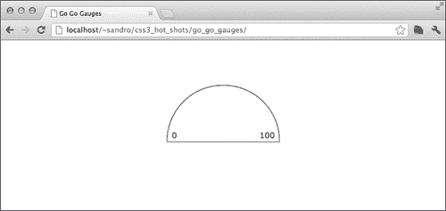

## 刻度标记

如何处理刻度标记？一种方法是使用图像，但另一个有趣的选择是利用多重背景支持，并用渐变创建这些刻度标记。例如，要创建一个垂直标记，我们可以在`div[data-gauge]`选择器中使用以下内容：

```css
linear-gradient(0deg, transparent 46%, rgba(99, 99, 99, 0.5) 47%, rgba(99, 99, 99, 0.5) 53%, transparent 54%)
```

基本上，我们定义了一个非常小的透明渐变和另一种颜色之间的渐变，以获得刻度线。这是第一步，但我们还没有处理每个刻度线必须用不同的角度来定义这个事实。我们可以通过引入一个 SASS 函数来解决这个问题，该函数接受要打印的刻度数，并在达到该数字时迭代，同时调整每个标记的角度。当然，我们还必须处理实验性的供应商前缀，但我们可以依靠 Compass 来处理。

以下是这个功能。我们可以为此和其他与仪表相关的功能创建一个名为`scss/_gauge.scss`的新文件；前导下划线是告诉 SASS 不要将这个`.scss`文件创建为`.css`文件，因为它将被包含在一个单独的文件中。

```css
@function gauge-tick-marks($n, $rest){
  $linear: null;
  @for $i from 1 through $n {
 $p: -90deg + 180 / ($n+1) * $i;
    $linear: append($linear, linear-gradient( $p, transparent 46%, rgba(99,99,99,0.5) 47%, rgba(99,99,99,0.5) 53%, transparent 54%), comma);
  }
  @return append($linear, $rest);  
}
```

我们从一个空字符串开始，添加调用`linear-gradient` Compass 函数的结果，该函数处理基于当前刻度线索引的角度变化。

为了测试这个功能，我们首先需要在`application.scss`中包含`_gauge.scss`：

```css
@import "gauge.scss";
```

接下来，我们可以在`application.scss`中的`div[data-gauge]`选择器中插入函数调用，指定所需的刻度数：

```css
@include background(gauge-tick-marks(11,null));
```

`background`函数也是由 Compass 提供的，它只是处理实验性前缀的另一种机制。不幸的是，如果我们重新加载项目，结果与预期相去甚远：

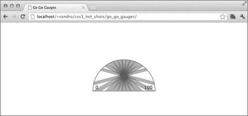

虽然我们可以看到总共有 11 条条纹，但它们的大小和位置都是错误的。为了解决这个问题，我们将创建一些函数来设置`background-size`和`background-position`的正确值。

## 处理背景大小和位置

让我们从`background-size`开始，这是最简单的。由于我们希望每个刻度线的大小恰好为`1rem`，我们可以通过创建一个函数，根据传递的参数的数量打印**1rem 1rem**，来继续进行；因此，让我们将以下代码添加到`_gauge.scss`中：

```css
@function gauge-tick-marks-size($n, $rest){
  $sizes: null;
  @for $i from 1 through $n {
 $sizes: append($sizes, 1rem 1rem, comma);
  }
  @return append($sizes, $rest, comma);
}
```

我们已经注意到了`append`函数；关于它的一个有趣的事情是，这个函数的最后一个参数让我们决定是否使用某个字母来连接正在创建的字符串。其中一个可用的选项是`逗号`，这非常适合我们的需求。

现在，我们可以在`div[data-gauge]`选择器内添加对这个函数的调用：

```css
background-size: gauge-tick-marks-size(11, null);
```

以下是结果：

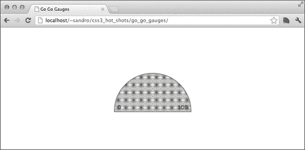

现在刻度线的大小是正确的，但它们是一个接一个地显示，并且在整个元素上重复。为了避免这种行为，我们可以在上一条指令的下面简单地添加`background-repeat: no-repeat`：

```css
background-repeat: no-repeat;
```

另一方面，为了处理刻度线的位置，我们需要另一个 SASS 函数；这次它更复杂一些，涉及一点三角学。每个渐变必须放在其角度的函数中——x 是该角度的余弦，y 是正弦。`sin`和`cos`函数由 Compass 提供，我们只需要处理一下偏移，因为它们是相对于圆的中心，而我们的 css 属性的原点是在左上角。

```css
@function gauge-tick-marks-position($n, $rest){
  $positions: null;
  @for $i from 1 through $n {
 $angle: 0deg + 180 / ($n+1) * $i;
 $px: 100% * ( cos($angle) / 2 + 0.5 );
 $py: 100% * (1 - sin($angle));
    $positions: append($positions, $px $py, comma);
  }
  @return append($positions, $rest, comma);
}
```

现在我们可以继续在`div[data-gauge]`选择器内添加一行新代码：

```css
background-position: gauge-tick-marks-position(11, null);
```

这就是期待已久的结果：

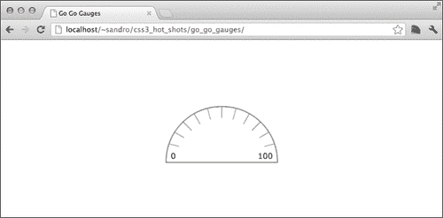

下一步是创建一个`@mixin`指令来将这三个函数放在一起，这样我们可以将以下内容添加到`_gauge.scss`中：

```css
@mixin gauge-background($ticks, $rest_gradient, $rest_size, $rest_position) {

  @include background-image(
    gauge-tick-marks($ticks, $rest_gradient) 
  );

  background-size: gauge-tick-marks-size($ticks, $rest_size);
  background-position: gauge-tick-marks-position($ticks, $rest_position);
  background-repeat: no-repeat;
}
```

并用一个单独的调用替换我们在本章中放置在`div[data-gauge]`内的内容：

```css
@include gauge-background(11, null, null, null );
```

我们还留下了三个额外的参数来定义`background`、`background-size`和`background-position`的额外值，因此我们可以很容易地添加一个渐变背景：

```css
@include gauge-background(11,
  radial-gradient(50% 100%, circle, rgb(255,255,255), rgb(230,230,230)),
  cover,
  center center
);
```

以下是屏幕截图：

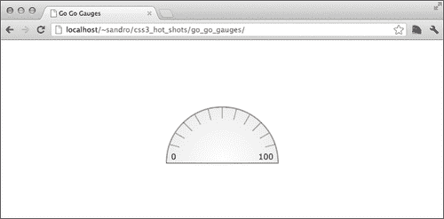

# 创建箭头

要创建一个箭头，我们可以从定义仪表中心的圆形元素开始，该元素容纳箭头。这很容易，也没有真正引入任何新东西；以下是需要嵌套在`div[data-gauge]`选择器内的代码：

```css
  div[data-arrow]{
    position: absolute;
    @include px_and_rem(width, 2, $multiplier);
    @include px_and_rem(height, 2, $multiplier);
    @include px_and_rem(border-radius, 5, $multiplier);
    @include px_and_rem(bottom, -1, $multiplier);
    left: 50%;
    @include px_and_rem(margin-left, -1, $multiplier);
   box-sizing: border-box;

    border: #{0.05 * $multiplier} solid rgb(99,99,99);  
    border: 0.05rem solid rgb(99,99,99);
    background: #fcfcfc;
  }
```

箭头本身是一个更严肃的事情；基本思想是使用线性渐变，只在元素的一半开始添加颜色，然后我们可以旋转元素，以便将指向末端移动到其中心。以下是需要放在`div[data-arrow]`内的代码：

```css
    &:before{
      position: absolute;
      display: block;
      content: '';
      @include px_and_rem(width, 4, $multiplier);
      @include px_and_rem(height, 0.5, $multiplier);
      @include px_and_rem(bottom, 0.65, $multiplier);
      @include px_and_rem(left, -3, $multiplier);
 background-image: linear-gradient(83.11deg, transparent, transparent 49%, orange 51%, orange); 
 background-image: -webkit-linear-gradient(83.11deg, transparent, transparent 49%, orange 51%, orange); 
 background-image: -moz-linear-gradient(83.11deg, transparent, transparent 49%, orange 51%, orange);
 background-image: -o-linear-gradient(83.11deg, transparent, transparent 49%, orange 51%, orange); 

 @include apply-origin(100%, 100%);
 @include transform2d( rotate(-3.45deg));
 box-shadow: 0px #{-0.05 * $multiplier} 0 rgba(0,0,0,0.2);
 box-shadow: 0px -0.05rem 0 rgba(0,0,0,0.2);			@include px_and_rem(border-top-right-radius, 0.25, $multiplier);
 @include px_and_rem(border-bottom-right-radius, 0.35, $multiplier);
    }
```

为了更好地理解这个实现背后的技巧，我们可以暂时在结果中的`&:before`选择器内添加`border: 1px solid red`，然后放大一点：

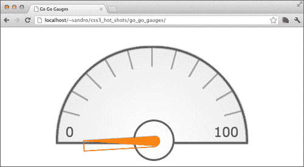

## 移动箭头

现在我们想要根据`data-percent`属性值将箭头定位到正确的角度。为了做到这一点，我们必须利用 SASS 的强大功能。理论上，CSS3 规范允许我们使用从属性中获取的值来赋值给一些属性，但实际上，这只有在处理`content`属性时才可能，就像我们在本书中之前看到的那样。

所以我们要做的是创建一个`@for`循环，从`0`到`100`，并在每次迭代中打印一个选择器，该选择器匹配`data-percent`属性的定义值。然后我们将为每个 CSS 规则设置不同的`rotate()`属性。

以下是代码；这次它必须放在`div[data-gauge]`选择器内：

```css
@for $i from 0 through 100 {
  $v: $i;
  @if $i < 10 { 
    $v: '0' + $i;
  }

  &[data-percent='#{$v}'] > div[data-arrow]{
      @include transform2d(rotate(#{180deg * $i/100}));
  }
}
```

如果你对生成的 CSS 数量感到害怕，那么你可以决定调整仪表的增量，例如，调整为`10`：

```css
  @for $i from 0 through 10 {
    &[data-percent='#{$i*10}'] > div[data-arrow]{
      @include transform2d(rotate(#{180deg * $i/10}));
    }
  }
```

以下是结果：

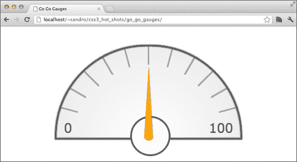

# 动画仪表

现在我们可以使用 CSS 过渡来使箭头动画化。基本上，我们必须告诉浏览器需要对`transform`属性进行动画处理；必要的 SASS 代码比预期的要长一些，因为 Compass 尚不能为`transition`属性及其值添加前缀（[`github.com/chriseppstein/compass/issues/289`](https://github.com/chriseppstein/compass/issues/289)），所以我们必须手动完成：

```css
  -webkit-transition: -webkit-transform 0.5s;
  -moz-transition: -moz-transform 0.5s;
  -ms-transition: -ms-transform 0.5s;
  -o-transition: -o-transform 0.5s;
  transition: transform 0.5s;
```

当我们将这些 CSS 指令放在`div[data-arrow]`选择器内时，我们会注意到，如果我们改变`data-percentage`属性，例如，使用 Chrome 和它的开发控制台，箭头会以平滑的动画做出响应。

# 整体指示器

一些仪表具有颜色指示器，通常从绿色到红色，与箭头的位置相关联；我们可以得出类似的结果。首先，我们需要定义两个新的自定义数据属性，一个指示指示器从绿色切换到橙色的百分比，另一个指示指示器从橙色切换到红色的百分比。在这里：

```css
<div data-gauge data-min="0" data-max="100" data-percent="50" data-orange-from="60" data-red-from="90">
  <div data-arrow></div>
</div>
```

然后我们需要在`div[data-gauge]`中指定一个默认的背景颜色，比如说`green`：

```css
background-color: green;
```

接下来，我们重新定义背景渐变，使圆周的前 25%透明；这样我们就可以显示（和控制）底层颜色，所以让我们重新编写`gauge-background`调用：

```css
@include gauge-background(11,
 radial-gradient(50% 100%, circle, rgba(255,255,255,0), rgba(255,255,255,0) 25%, rgb(255,255,255) 25%, rgb(230,230,230)),
  cover,
  center center
);
```

现在我们可以使用另一个 Sass 循环来改变`background-color`属性，以符合属性中定义的值。由于我们将在前一个循环中嵌套实现一个循环，我们必须小心，不要使生成的 CSS 的大小增加太多。

为了实现这一点，让我们只考虑`data-orange-from`和`data-red-from`数据属性的十位数。我们需要做的基本上是编写一个 CSS 规则，如果`data-percentage`属性大于或等于`data-orange-from`或`data-red-from`，则激活红色或橙色背景颜色。

以下是完整的循环，包括我们之前用来移动箭头的循环：

```css
@for $i from 0 through 100 {
  $v: $i;
  @if $i < 10 { 
    $v: '0' + $i;
  } 

  &[data-percent='#{$v}'] > div[data-arrow]{
    @include transform2d(rotate(#{180deg * $i/100}));
  }

 @for $k from 0 through 10 {
 @if $i >= $k * 10 {
 &[data-percent='#{$v}'][data-orange-from^='#{$k}']{
 background-color: orange;
 }
 &[data-percent='#{$v}'][data-red-from^='#{$k}']{
 background-color: red;
 }
 }
 }
}
```

以下是结果：

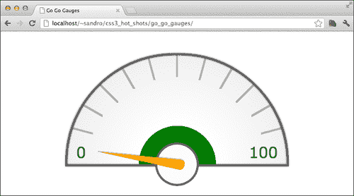

## 减小 CSS 的大小

通过要求 Compass 不在每个规则之前添加指向相应 SASS 规则的注释，可以减少生成的 CSS 的大小。如果我们想要这样做，只需在`config.rb`文件中添加`line_comments = false`，然后在项目的根文件夹中停止并重新启动`compass watch`。

# 添加一些颤动

作为一个额外的功能，我们可以添加一个选项，让箭头在接近 100%时颤动一点。如果存在额外的`data-trembling`属性，我们可以通过添加一个小动画来实现这种行为：

```css
<div data-gauge data-min="0" data-max="100" data-percent="50" data-orange-from="60" data-red-from="90" data-trembling>

```

不幸的是，Compass 没有默认提供 CSS3 动画 mixin，因此我们必须安装一个可以帮助我们的 Compass 插件。在这种情况下，插件称为**compass-animation**（[`github.com/ericam/compass-animation`](https://github.com/ericam/compass-animation)），由 Eric Meyer 创建（[`eric.andmeyer.com/`](http://eric.andmeyer.com/)）。安装方法如下：

```css
gem install animation –pre

```

或者如下：

```css
sudo gem install animation –-pre

```

然后在调用`compass watch`时必须同时包含插件：

```css
compass watch . –r animation

```

在`application.scss`的头部添加：

```css
@import "animation";
```

干得好！现在我们准备定义一个非常简单的动画，修改箭头的旋转角度，引起我们寻找的颤动效果。让我们在`application.scss`的末尾添加几行代码：

```css
@include keyframes(trembling) {
  0% {
      @include transform2d( rotate(-5.17deg));
  }
  100% {
      @include transform2d( rotate(-1.725deg));
  }
}
```

然后，我们需要在`div[data-gauge]`内添加一个新规则，如果`data-trembling`存在，并且`data-percentage`以`8`或`9`开头，或者等于`100`，则激活此动画：

```css
&[data-trembling][data-percent^='8'] > div[data-arrow]:before,
&[data-trembling][data-percent^='9'] > div[data-arrow]:before,
&[data-trembling][data-percent='100'] > div[data-arrow]:before{
 @include animation(trembling 0.2s infinite linear alternate);
}
```

不幸的是，由于 WebKit 浏览器中一些尚未解决的错误，阻止动画应用于`before`和`after`伪选择器，目前只有 Firefox 正确实现了这种行为：

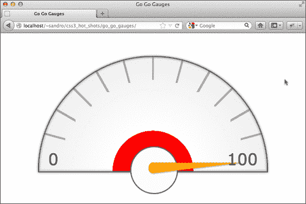

# 显示仪表值

如果我们对 HTML 代码进行小修改，就可以轻松显示当前的仪表值：

```css
<div data-gauge data-min="0" data-max="100" data-percent="50" data-orange-from="60" data-red-from="90" data-trembling>
<span>50</span>
  <div data-arrow></div>
</div>
```

以下是要添加到`div[data-gauge]`选择器内的代码：

```css
span{
  display: block;
  color: #DDD;
  @include px_and_rem(font-size, 1.5, $multiplier);
  text-align: center;
  @include px_and_rem(width, 10, $multiplier);
  @include px_and_rem(height, 5, $multiplier);
  @include px_and_rem(line-height, 5, $multiplier);
}
```

结果：

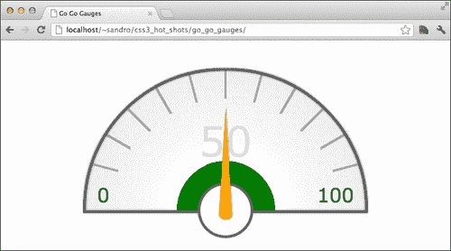

# 优雅降级

为了使这个小部件对那些不支持背景渐变的浏览器也有意义，我们必须处理箭头的不同表示。为了检测缺少此功能的位置，我们可以使用 Modernizr 创建一个自定义构建（[`modernizr.com/download/`](http://modernizr.com/download/)），就像我们在前几章中只检查渐变支持一样：

```css
<script src="img/modernizr.js"></script>
```

然后我们可以选择一个纯色背景；箭头当然会变成一个矩形，但我们会保留小部件的含义；让我们在`application.scss`的底部添加这条规则：

```css
.no-cssgradients div[data-gauge]{ 

 div[data-arrow]:before{
 background-color: orange;
 @include transform2d( rotate(0deg));
 box-shadow: none;
 border-radius: 0;
 }
}
```

以下是结果：

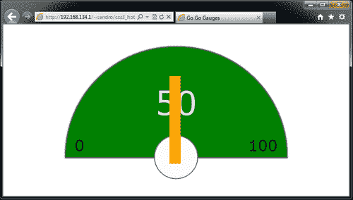

我们可以进一步使用 Compass 将渐变转换为`Base64`编码的 SVG，并在本机不支持渐变的情况下将它们用作回退背景图像。不幸的是，这在使用数值表达角度的渐变（如`23deg`）时不起作用，因此我们将无法重现刻度线。但是，我们可以要求 Compass 转换我们用于背景的`radial-gradient`属性。以下是我们需要在`.no-cssgradients div[data-gauge]`规则内添加的属性：

```css
background-image: -svg(radial-gradient(50% 100%, circle, rgba(255,255,255,0), rgba(255,255,255,0) 35%, rgb(255,255,255) 35%, rgb(230,230,230)));
background-size: cover;
background-position: auto;
```

以下是结果，更接近原始仪表：

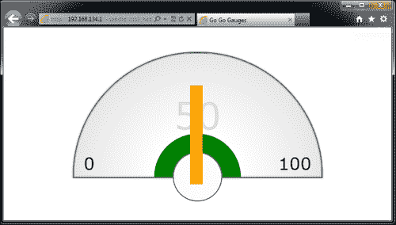

# 在 Internet Explorer 8 中实现仪表

如果我们想支持 Internet Explorer 8，那么我们需要解决`border-radius`和`transform`属性的缺失。

对于`border-radius`，我们可以使用基于 JavaScript 的 polyfill，比如 CSS3 Pie，我们可以从它的网站[`css3pie.com/`](http://css3pie.com/)下载这个 polyfill，然后将`PIE.js`复制到项目的`js`文件夹中。接下来，我们可以在`index.html`中包含这个 JavaScript 文件，以及最新版本的 jQuery 和`js/application.js`，这是一个我们一会儿要用到的空文件：

```css
<!--[if IE 8]>
  <script src="img/jquery-1.8.0.min.js"></script>
  <script src="img/PIE.js"></script>
  <script src="img/application.js"></script>
<![endif]-->
```

通常情况下，CSS3 Pie 会自动检测如何增强给定元素，通过识别要模拟的 CSS3 属性。然而，在这种情况下，我们使用了`border-top-left-radius`和`border-top-right-radius`，而 CSS3 Pie 只支持通用的`border-radius`。我们可以通过在`div[data-gauge]`规则中添加一个带有`-pie`前缀的特殊`border-radius`属性来解决这个问题：

```css
-pie-border-radius: #{5 * $multiplier} #{5 * $multiplier} 0px 0px;

```

接下来，我们需要通过在`js/application.js`中插入几行 JavaScript 代码来激活 CSS3 Pie：

```css
$(function() {
    if (window.PIE) {
 $('div[data-gauge]').each(function() {
 PIE.attach(this);
 });
    }
});
```

以下是结果：

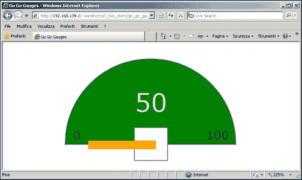

现在，如果我们想要激活箭头旋转，我们需要模拟`transform`属性。为了实现这种行为，我们可以使用 Louis-Rémi Babé的`jquery.transform.js`（[`github.com/louisremi/jquery.transform.js`](https://github.com/louisremi/jquery.transform.js)）；Louis-Rémi Babé（[`twitter.com/louis_remi`](http://twitter.com/louis_remi)）。

下载完库之后，我们需要将`jquery.transform2d.js`复制到项目的`js`文件夹中。然后在`index.html`中添加必要的`script`元素。为了在 Internet Explorer 8 浏览器中为`html`元素添加不同的类，我们将使用`IE`条件注释来为`html`元素添加不同的类。结果如下：

```css
<!doctype html>
<!--[if IE 8]> <html class="ie8" > <![endif]-->
<!--[if !IE]> --> <html> <!-- <![endif]-->
<head>
  <title>Go Go Gauges</title>
  <script src="img/modernizr.js"></script>
  <link rel="stylesheet" type="text/css" href="css/application.css">
  <!--[if IE 8]>
    <script src="img/jquery-1.8.0.min.js"></script>
 <script src="img/jquery.transform2d.js"></script>
    <script src="img/PIE.js"></script>
    <script src="img/application.js"></script>
  <![endif]-->
</head>
<!-- ...rest of index.html ... -->
```

`jquery.transform2d.js`使得即使在 Internet Explorer 8 浏览器上也能触发`transform`属性，从而增强了 jQuery 提供的`css`功能；以下是一个例子：

```css
$(elem).css('transform', 'translate(50px, 30px) rotate(25deg) scale(2,.5) skewX(-35deg)');
```

因此，我们可以尝试通过调用前述函数添加一些 JavaScript 代码行；这将使`js/application.js`变成如下形式：

```css
$(function() {
    if (window.PIE) {
        $('div[data-gauge]').each(function() {
            PIE.attach(this);

 var angle = Math.round(180 * parseInt($(this).attr('data-percent'),10)/100);
 $('div[data-arrow]',$(this)).css({
 'transform': 'rotate(' + angle + 'deg)'
 });
        });
    }
});
```

不幸的是，结果并不如预期那样好：

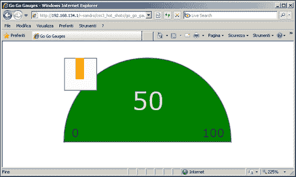

问题在于`div[data-arrow]:before`元素被裁剪在其父元素内。这可以通过在箭头下方绘制一个白色圆盘（现在是一个正方形），并将`div[data-arrow]`调整大小为整个小部件，并且背景透明且没有边框，以便容纳箭头。

为此，我们可以使用`.ie8`类，仅在浏览器为 Internet Explorer 8 时添加一些属性。让我们在`application.scss`中添加几行代码。

```css
.ie8 div[data-gauge]{
  div[data-arrow]{
    width: #{10 * $multiplier};
    height: #{10 * $multiplier};
    margin-top: #{-5 * $multiplier};
    margin-left: #{-5 * $multiplier};
    top: 50%;
    left: 50%;
    background: transparent;
    border: none;
    &:before{
      bottom: 50%;
      margin-bottom: #{-0.25 * $multiplier};
      left: #{1 * $multiplier};
    }
  }
}
```

最后，以下是工作结果：

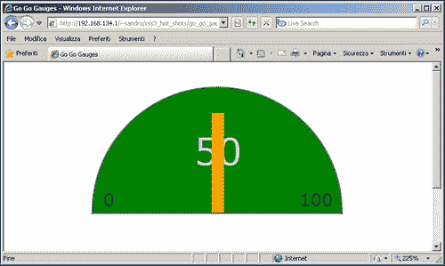

# Compass 和 Internet Explorer 10

在撰写本文时，Compass 的最新版本（0.12.0）没有为`linear-gradient`和`radial-gradient`添加`-ms-`实验性前缀。为了解决这个问题并使仪表在 IE10 上顺利工作，我们必须对我们的`.scss`代码进行一些修改。特别是，我们需要按照以下方式修改`_gauge.scss`中的`gauge-tick-marks`函数：

```css
@function gauge-tick-marks($n, $rest, $ms){
  $linear: null;
  @for $i from 1 through $n {
    $p: -90deg + 180 / ($n+1) * $i;
 $gradient: null;
 @if $ms == true {
 $gradient: -ms-linear-gradient( $p, transparent 46%, rgba(99,99,99,0.5) 47%, rgba(99,99,99,0.5) 53%, transparent 54%);
 } @else{
 $gradient: linear-gradient( $p, transparent 46%, rgba(99,99,99,0.5) 47%, rgba(99,99,99,0.5) 53%, transparent 54%);
 }
    $linear: append($linear, $gradient, comma);
  }
 @if $ms == true {
 @return append($linear, #{'-ms-' + $rest} ); 
 } @else{
 @return append($linear, $rest); 
 }
}
```

我们还需要在`_gauge.scss`中修改`gauge-background` mixin：

```css
@mixin gauge-background($ticks, $rest_gradient, $rest_size, $rest_position) {

 @include background-image(
 gauge-tick-marks($ticks, $rest_gradient, false) 
 );

 background-image: gauge-tick-marks($ticks, $rest_gradient, true);

  background-size: gauge-tick-marks-size($ticks, $rest_size);
  background-position: gauge-tick-marks-position($ticks, $rest_position);
  background-repeat: no-repeat;
}
```

最后，我们还需要在`application.scss`中的`:before`中的`div[data-arrow]`中添加额外的 CSS 行：

```css
background-image: -ms-linear-gradient(83.11deg, transparent, transparent 49%, orange 51%, orange);
```

在进行这些小修改之后，我们也可以在 Internet Explorer 10 中欣赏到这个小部件：

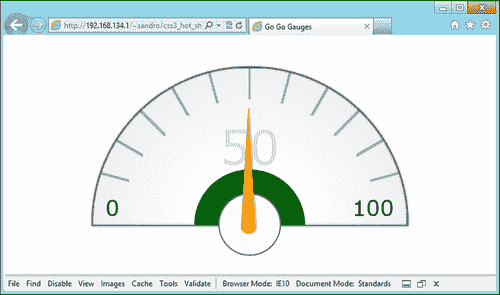

# 总结

绘制仪表可能比预期更困难；如果我们还要考虑支持旧版浏览器，情况就更加复杂。在本章中，我们学习了如何安装和使用 Compass，利用 SASS 语法的强大功能创建复杂的 CSS，并处理优雅降级和填充技术。在下一章中，我们将利用 CSS 动画和 3D 变换的功能创建一个电影预告片。
