# 第九章：创建介绍

这个项目的目标是创建一个介绍，一个非交互式的动画，使用文本和视觉效果来呈现产品、概念或其他内容。这个项目让我们有机会探索一些高级动画和 3D 主题，并在创建一些特定函数来处理这种复杂性的同时扩展我们对 Compass 的了解。

本章将涵盖以下主题：

+   新的 flexbox 模型

+   创建关键帧动画

+   连接动画

+   CSS 3D 属性的动画

# 项目描述

我们想要在 3D 场景中放置一些元素，然后穿过它们。为此，我们首先必须创建一个 HTML 结构来容纳这些元素，然后我们必须找到一种聪明的方法来获得所需的效果。但是，在做任何其他事情之前，我们必须定义文件夹结构并初始化项目的基本文件。

与之前的项目一样，我们将使用 SASS 和 Compass，因此我们需要安装 Ruby ([`www.ruby-lang.org/en/downloads/`](http://www.ruby-lang.org/en/downloads/))，然后在终端窗口中输入`gem install compass`（或`sudo gem install compass`）。之后，我们需要在项目的根文件夹中创建一个`config.rb`文件，其中包含 Compass 配置：

```css
# Require any additional compass plugins here.

# Set this to the root of your project when deployed:
http_path = "YOUR-HTTP-PROJECT-PATH"
css_dir = "css"
sass_dir = "scss"
images_dir = "img"
javascripts_dir = "js"

# You can select your preferred output style here (can be overridden via the command line):
# output_style = :expanded or :nested or :compact or :compressed

# To enable relative paths to assets via compass helper functions. Uncomment:
relative_assets = true

# To disable debugging comments that display the original location of your selectors. Uncomment:
line_comments = false

preferred_syntax = :sass
```

干得好！下一步是创建项目所需的文件夹，即`css`、`scss`、`img`和`js`，并定义一个空的`scss/application.scss`文件。然后我们需要从项目的根文件夹启动`compass watch .`，最后创建主 HTML 文档`index.html`。

# 创建 HTML 结构

我们要创建的基本上是一个幻灯片放置在 3D 空间中，动画从一张幻灯片移动到另一张。一个基本的幻灯片结构可以是这样的：

```css
<div data-sequence="1">
  <div data-slide>
    Hello,
  </div>
</div>
```

我们需要两个嵌套的`div`标签来定义这个结构；第一个将覆盖窗口区域的 100%，第二个`div`标签将具有必要的属性来将其内容放在屏幕中央。此外，我们需要设置每个幻灯片，使它们在开始在 3D 空间中移动之前堆叠在彼此上方。

我们可以使用`flexbox` CSS 属性来实现这个结果。事实上，flexbox 具有定义垂直和水平对齐的属性。

让我们根据我们迄今为止所见的内容定义一个基本的 HTML 结构：

```css
<!doctype html>
<html>
<head>
  <title>Movie Trailer</title>
  <link href='http://fonts.googleapis.com/css?family=Meie+Script' rel='stylesheet' type='text/css'>
  <link rel="stylesheet" type="text/css" href="css/application.css">
</head>
<body>
 <div id="viewport">
 <div id="container">

 <div data-sequence="1">
 <div data-slide>
 Hello,
 </div>
 </div>

 <div data-sequence="2">
 <div data-slide>
 this is a demo
 </div>
 </div>

 <div data-sequence="3">
 <div data-slide>
 about the power
 </div>
 </div>

 <div data-sequence="4">
 <div data-slide>
 of CSS 3D 
 </div>
 </div>

 <div data-sequence="5">
 <div data-slide>
 and animations
 </div>
 </div>

 <div data-sequence="6">
 <div data-slide>
 :D
 </div>
 </div>

 </div>
 </div>
</body>
</html>
```

没有任何 CSS 的幻灯片将是这样的：

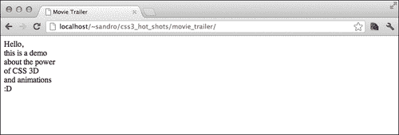

## 创建幻灯片

首先，让我们将每个幻灯片的`position`属性设置为`absolute`，并通过在`scss/application.scss`中编写几行代码将`width`和`height`设置为`100%`：

```css
@import "compass/reset";
@import "compass/css3/box";
@import "compass/css3/transform";

html,body, #viewport, #container{
  height: 100%;
  font-size: 150px;
}

#container{

  & > div{
    width: 100%;
    height: 100%;
    position: absolute;
    top: 0;
    left: 0;    
  } 

  div[data-slide]{
    width: 100%;
    height: 100%;
    text-align: center;

 @include display-box;
 @include box-align(center);
 @include box-pack(center);
  }

}
```

Flexbox 非常方便，由于`box-pack`和`box-align`属性，它基本上在主 Flexbox 方向（默认为水平，但可以通过`box-orient`属性更改）和其垂直方向上设置对齐。

由于这个项目目前只在 Chrome 和 Firefox 上运行（IE10 似乎在使用嵌套的 3D 变换时存在一些问题），我们对这些属性感到满意；否则，我们应该记住，旧的 Flexbox 语法（我们正在使用的 2009 年的语法）不受 Internet Explorer 10 的支持。

微软的最新浏览器只包括对最新的 Flexbox 实现的支持，它有一个相当不同的语法，不幸的是，它目前还不能在基于 Gecko 的浏览器上工作。

在第四章*缩放用户界面*中，我们开发了一个项目，尽管使用了不受支持的 Flexbox 语法，但在 IE10 中也运行得很好。这是因为在那种情况下，我们包含了 Flexie，一个模拟 Flexbox 行为的 polyfill，当旧的 Flexbox 语法不受支持时。

让我们深入了解这种新的 Flexbox 语法的细节，并为了完整起见，让我们将两种语法都添加到这个项目中。

# 新的弹性盒模型

新的灵活布局模型（从这里开始，以及在本章的整个过程中，被称为 Flexbox）旨在像其以前的版本一样，为开发人员提供一种在页面上对齐元素的新方法。

使用这种新的盒模型的元素可以垂直或水平放置，并可以动态交换它们的顺序，还可以根据可用空间“伸缩”它们的大小和位置。

这里有一个例子（在 Internet Explorer 10 上测试）：

```css
<!DOCTYPE html>

<html lang="en">
    <head>
        <meta charset="utf-8" />
        <title></title>

        <style>
            html,body,ul{
                height: 100%;
                margin: 0;
                padding: 0;
            }
 ul{
 display: -ms-flexbox;
 -ms-flex-direction: row-reverse;
 -ms-flex-pack: center;
 -ms-flex-align: center;
 -ms-flex-wrap: wrap;
 }
 li {
 font-size: 70px;
 line-height: 100px;
 text-align: center;
 list-style-type: none;
 -ms-flex: 1 0 200px;
 }

        </style>

    </head>
    <body>

        <ul>
            <li style="background-color: #f9f0f0">A</li>
            <li style="background-color: #b08b8b">B</li>
            <li style="background-color: #efe195">C</li>
            <li style="background-color: #ccdfc4">D</li>
        </ul>

    </body>
</html>
```

这是生成的页面：

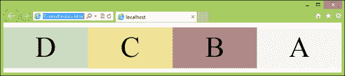

通过之前定义的属性，我们使用了`display: -ms-flexbox`来定义了一个 Flexbox（W3C 的值是`flex`，但每个浏览器都会稍微改变这个值，要么通过添加自定义前缀，要么稍微改变它）。我们使用了`-ms-flex-direction: row-reverse`来反转可视化顺序；这个属性也用于指定我们想要水平还是垂直排列。可用的值有：`row`、`column`、`row-reverse`和`column-reverse`。`-ms-flex-pack`和`-ms-flex-align`属性确定了 Flexbox 子元素在它们的主轴和垂直轴上的对齐方式（如`-ms-flex-direction`所指定的）。

这些属性仍然是 Flexbox IE10 实现的一部分，但最近已被`align-items`和`justify-content`替换，因此在整合时我们也需要注意这一点。

我们使用了`-ms-flex-wrap: wrap`来要求浏览器在主轴上的空间不足以容纳所有元素时将元素放置在多行上。

最后，我们在每个元素上使用了`-ms-flex: 1 0 200px`来指示每个子元素具有正的 flex 因子`1`，因此它们将以相同的速度覆盖空白空间，保持它们的大小相等，负的 flex 因子`0`，和一个首选大小`200px`。

这与我们之前指定的`-ms-flex-wrap`属性一起，创建了一个有趣的响应效果，当浏览器窗口太小无法容纳它们在一行时，元素会移动到新的行：

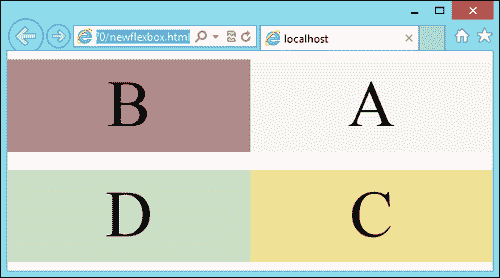

## 创建一个示例布局

我们可以利用这个属性来创建一个三列布局，其中两个侧列在没有足够空间的情况下移动到中央列的上方和下方，比如在移动设备上。以下是创建这种布局的代码：

```css
<!DOCTYPE html>

<html lang="en">
    <head>
        <meta charset="utf-8" />
        <title></title>

        <style>
 section {
 min-height: 300px; 
 }

 div {
 display: -ms-flexbox;
 -ms-flex-direction: row;
 -ms-flex-pack: center;
 -ms-flex-wrap: wrap;
 }

 aside, nav {
 -ms-flex: 1 3 180px;
 min-height: 100px;
 }

 nav {
 -ms-flex-order: 1;
 background-color:  #ffa6a6;
 }

 aside {
 -ms-flex-order: 3;
 background-color:  #81bca1;
 }

 section {
 -ms-flex: 3 1 600px;
 -ms-flex-order: 2;
 background-color: #72c776;
 }
        </style>
    </head>
    <body>

        <div>
            <section></section>
            <nav></nav>
            <aside></aside>
        </div>

    </body>
</html>
```

这是结果：

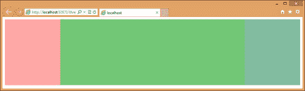

如果我们现在调整浏览器窗口大小，我们会注意到`nav`和`aside`元素如何在主内容上下移动，为移动设备创建了一个漂亮的布局。

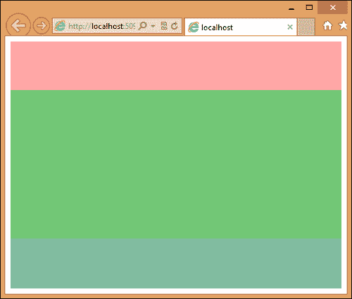

让我们回到我们的项目；我们可以很容易地通过几行 CSS 来支持 Flexbox 的新版本，如下所示：

```css
  div[data-slide]{
    width: 100%;
    height: 100%;
    text-align: center;

    @include display-box;
    @include box-align(center);
    @include box-pack(center);

 display: -ms-flexbox;
 display: -moz-flex;
 display: -webkit-flex;
 display: flex;
 -ms-flex-pack: center;
 -moz-align-items: center;
 -webkit-align-items: center;
 align-items: center;
 -ms-flex-align: center;
 -moz-justify-content: center;
 -webkit-justify-content: center;
 justify-content: center;
  }
```

这是期待已久的结果：

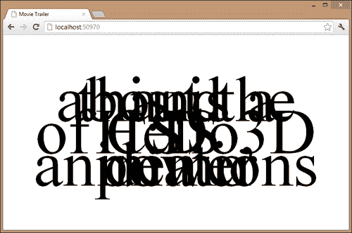

# 处理幻灯片

现在我们可以使用一些 3D`transform`属性来移动和旋转 3D 场景中的每个幻灯片。这些变换是绝对任意的，可以根据电影预告片的整体效果进行选择；这里有一个例子：

```css
div{
  &[data-sequence="1"]{
    @include transform(rotateX(45deg));
  }

  &[data-sequence="2"]{
    @include transform(rotateY(45deg) translateY(300px) scale(0.5));
  }

  &[data-sequence="3"]{
    @include transform(rotateX(90deg) translateY(300px) scale(0.5));
  }

  &[data-sequence="4"]{
    @include transform(rotateX(90deg) translateY(300px) translateX(600px) scale(0.5));
  }

  &[data-sequence="5"]{
    @include transform(rotateX(90deg) translateZ(300px) translateY(350px) translateX(600px) scale(0.5));
  }

  &[data-sequence="6"]{
    @include transform(rotateZ(30deg) translateY(500px) translateZ(300px));
  }
}
```

现在，我们需要在幻灯片的父元素上设置一些 3D 标准属性，如`transform-style`和`perspective`：

```css
#viewport{
  @include transform-style(preserve-3d);
  @include perspective(500px);
  overflow: hidden;
  width: 100%;
}

#container{
    @include transform-style(preserve-3d);
}
```

如果我们现在在 Chrome 中运行项目，我们会注意到幻灯片不像之前的截图中堆叠在一起；相反，它们现在都放置在 3D 场景的各个位置（大部分在变换后不可见）：

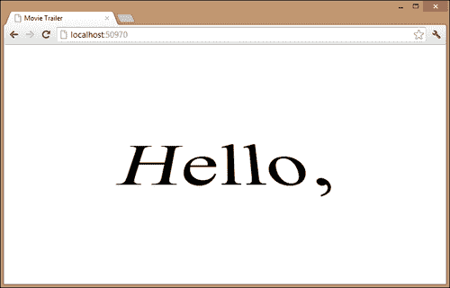

# 移动摄像机

现在，我们将学习如何创建一个摄像机穿过幻灯片的效果；由于我们无法移动用户的视口，我们需要通过移动场景中的元素来模拟这种感觉；这可以通过对`#container`应用一些变换来实现。

要将摄像机移近幻灯片，我们需要应用我们在该幻灯片上使用的确切变换，但使用相反的值并以相反的顺序。因此，例如，如果我们想查看`data-sequence`属性为`3`的帧，我们可以写：

```css
// not to be permanently added to the project
#container{
    @include transform(scale(2) translateY(-300px) rotateX(-90deg));
}
```

这就是结果：

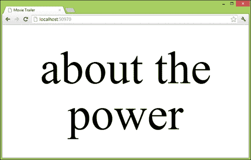

动画必须专注于一张幻灯片，保持静止一段时间，然后移动到下一张幻灯片。在创建这种效果时，我们通常面临以下两个主要问题：

+   CSS `keyframes`只接受百分比值，但我们更愿意使用秒作为测量单位（例如，说“在 2 秒内移动到下一张幻灯片，然后保持静止 1 秒”）

+   我们需要为每个幻灯片处理两个`keyframes`规则（移动和静止）；最好为我们处理这个的是有一个函数

我们可以通过使用 SASS 轻松解决这两个问题。首先，我们可以创建一个函数，通过接受动画的总长度来将秒转换为百分比值：

```css
$total_animation_duration: 11.5;
@function sec_to_per($sec, $dur: $total_animation_duration){
 @return 0% + $sec * 100 / $dur;
}

```

这个函数接受两个参数——我们想要从秒转换为百分比的值以及动画的总长度。如果没有提供这个参数，则该值将设置为`$total_animation_duration`变量。

我们可以为这个项目创建的第二个函数接受`move`时间和`still`时间作为参数，并打印必要的关键帧，同时跟踪动画的进展百分比：

```css
$current_percentage: 0%;
@mixin animate_to_and_wait($move, $still ) {

 $move_increment: sec_to_per($move);
 $current_percentage: $current_percentage + $move_increment;

 #{ $current_percentage }{ @content }

 @if $still == end {
 $current_percentage: 100%;
 } @else{
 $still_increment: sec_to_per($still);
 $current_percentage: $current_percentage + $still_increment;
 }

 #{ $current_percentage }{ @content } 

}
```

这个函数的作用基本上是将`$move`参数转换为百分比，并将这个值添加到全局变量`$current_percentage`中，该变量跟踪动画的进展。

然后我们打印一个关键帧，使用我们刚刚计算的百分比，包含 SASS 为我们填充的`@content`变量的值，该值是我们在函数调用后在花括号中放置的内容，例如：

```css
myfunction(arg1, arg2){
  // everything here is placed into @content variable
}
```

如果`$still`等于`end`，我们希望静止阶段持续到动画结束，所以我们将`$current_percentage`变量设置为`100%`；否则，我们将这个变量与我们处理`$move`变量的方式相同，然后打印另一个关键帧。

# 动画乐趣

为了处理 CSS3 动画属性附带的所有实验性前缀，我们可以再次使用 Compass 动画插件（从命令行终端中使用`gem install animation`进行安装，然后从项目的根文件夹中使用`compass watch . -r animation`重新启动 Compass）。

我们还需要在`application.scss`中包含`animation`：

```css
@import "animation";
```

我们还需要编写一个小函数，它包装了动画插件提供的函数，并在每次从一个实验性前缀切换到另一个时重置`$current_percentage`：

```css
@mixin ext_keyframes($name){

  @include with-only-support-for($moz: true) {
    @-moz-keyframes #{$name} { @content; }
    }
    $current_percentage: 0%;
    @include with-only-support-for($webkit: true) {
    	@-webkit-keyframes #{$name} { @content; }
    }
    $current_percentage: 0%;
    @include with-only-support-for {
      @keyframes #{$name} { @content; }
    }
}
```

好！现在我们准备把事情放在一起并定义我们的动画：

```css
/* == [BEGIN] Camera == */
@include ext_keyframes(camera){
 0%{
 @include transform(none);
 }

 @include animate_to_and_wait(0.5, 1.5){ 
 @include transform(scale(2) rotateX(-45deg));
 }

 @include animate_to_and_wait(0.5, 1.5){
 @include transform(scale(2) translateY(-300px) rotateY(-45deg));
 }

 @include animate_to_and_wait(0.5, 1.5){
 @include transform(scale(2) translateY(-300px) rotateX(-90deg));
 }

 @include animate_to_and_wait(0.5, 1.5){
 @include transform(scale(2) translateX(-600px) translateY(-300px) rotateX(-90deg));
 }

 @include animate_to_and_wait(0.5, 1.5){
 @include transform(scale(2) translateX(-600px) translateY(-350px) translateZ(-300px) rotateX(-90deg));
 }

 @include animate_to_and_wait(0.5, end){
 @include transform(scale(2) translateZ(-300px) translateY(-500px) rotateZ(-30deg));
 }
}
/* == [END] Camera == */
```

最后，我们必须向`#container`添加适当的动画属性：

```css
#container{
@include animation(camera #{0s + $total_animation_duration} linear);
@include animation-fill-mode(forwards);
}
```

完成！在浏览器中进行最后一次重新加载就足以充分欣赏动画：

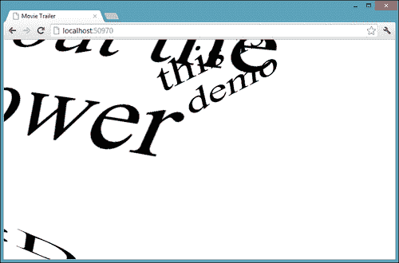

## 步骤动画

我们现在将创建一个特殊的动画，它会与每次幻灯片更改同步切换我们项目的背景颜色。由于我们不希望颜色之间有任何淡入淡出效果，我们将引入步骤动画。

步骤动画让我们可以指定在每个声明的关键帧之间放置多少帧；这里有一个例子：

```css
<!DOCTYPE html>

<html lang="en">
    <head>
        <meta charset="utf-8" />
        <title></title>
        <style>
            div {
                width:  100px;
                height: 100px;
                background-color: red;
                position: absolute;
 -webkit-animation: diagonal 3s steps(5) infinite alternate;
            }

            @-webkit-keyframes diagonal {
                from {  
                    top: 0;
                    left: 0; 
                }
                to {  
                    top: 500px;
                    left: 500px; 
                }
            }

        </style>
    </head>
    <body>
        <div></div>
    </body>
</html>
```

如果我们现在在浏览器中运行这个小例子，我们会发现`div`元素的移动不是流畅的，而是由只有五帧组成。我们可以在步骤声明中添加一个特殊关键字`start`或`end`（例如，`step(5, end)`）来要求浏览器在每一步中跳过初始或最终关键帧。好！现在，我们可以将相同的概念应用到我们的介绍项目中。首先，我们需要定义一个改变`background-color`属性的动画：

```css
/* == [BEGIN] bg == */
@include ext_keyframes(bg){
  0%{
    background: green;
  }
  #{sec_to_per(2)}{
    background: darkolivegreen;
  }
  #{sec_to_per(4)}{
    background: violet;
  }
  #{sec_to_per(6)}{
    background: orange;
  }
  #{sec_to_per(8)}{
    background: lightsteelblue;
  }
  #{sec_to_per(10)}{
    background: thistle;
  }
  100%{
    background: pink;
  }
}
/* == [END] bg == */
```

请注意我们如何使用`sec_to_per`函数以便使用秒而不是百分比；接下来，我们只需要使用`animation`属性将`bg`添加到`#viewport`：

```css
#viewport{
  @include animation(bg #{0s + $total_animation_duration} steps(1,start));
  @include animation-fill-mode(forwards);
}
```

这就是结果：

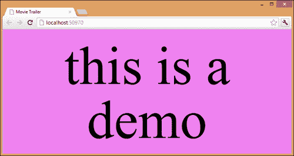

# 最后的修饰

现在我们已经定义了一个基本结构，并学会了如何创建一个在 3D 场景中移动的流畅动画，显然，下一步是丰富每个幻灯片，包括图片、视频、图表，以及我们可能需要实现我们目的的一切。

为了做到这一点，我们可以利用本书前几章已经积累的知识；例如，我们可以很容易地为第一张幻灯片定义一个淡入动画，如下所示：

```css
div[data-sequence="1"]{
  @include animation(sequence_1 2s linear);
  @include animation-fill-mode(forwards);
}

/* == [BEGIN] sequence_1 == */
@include ext_keyframes(sequence_1){
  0%{
    color: rgba(0,0,0,0);
  }
}
/* == [END] sequence_1 == */
```

我们还可以向幻灯片添加自定义字体：

```css
div[data-sequence="2"]{
  font-family: 'Meie Script', cursive;
}
```

这是结果：

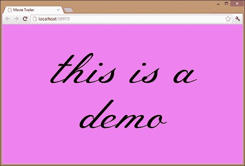

# 总结

CSS 动画和 3D 变换可以结合起来创建有趣的效果；当然，当我们转向这些类型的功能时，我们必须接受一些浏览器可能无法支持项目的事实。然而，我们总是可以使用一些特性检测库，比如 Modernizr，来解决这个问题，当这些功能不受支持时提供一些替代的可视化。

在下一章中，我们将完全使用 CSS3 创建一个漂亮的图表库！
