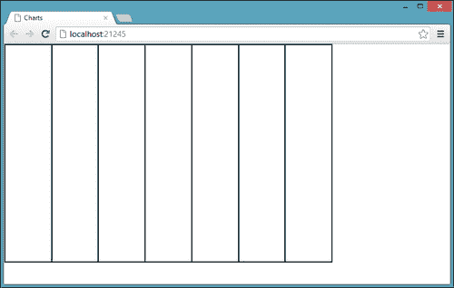
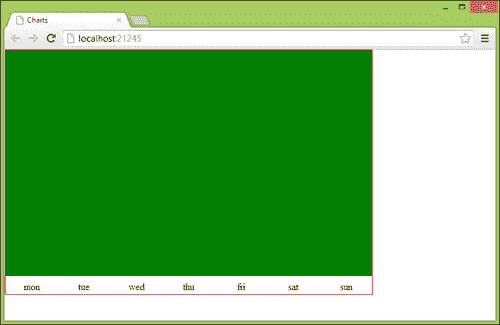
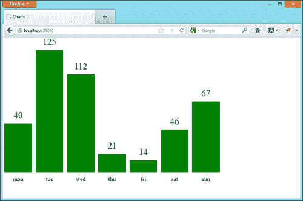
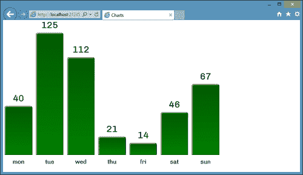
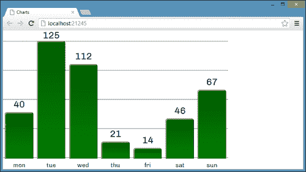
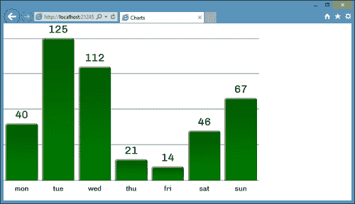
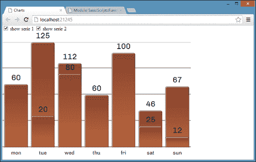
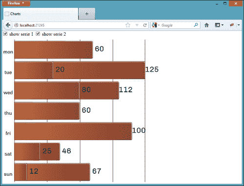
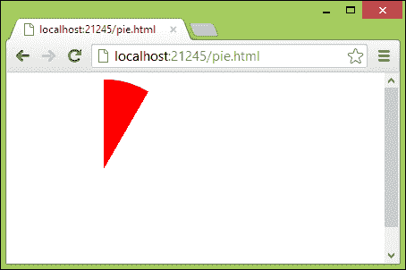

# 第十章：CSS 图表

通过简单的谷歌搜索，我们发现有很多令人惊叹的图表库，比如**Google Chart Tools**（[`developers.google.com/chart/`](https://developers.google.com/chart/)）、**Highcharts**（[`www.highcharts.com/`](http://www.highcharts.com/)）和**gRaphael**（[`g.raphaeljs.com/`](http://g.raphaeljs.com/)），仅举几例。我们可能不知道的是，有一些 CSS 技术可以让我们创建完全功能的图表，而不使用 JavaScript 库。在本章中，我们将探讨其中一些技术，以下是主题：

+   创建一个条形图

+   实现跨浏览器、灵活的盒子布局

+   处理和显示`data-*`属性

+   实现高级渐变

+   添加更多的图表系列

+   为图表添加动画

+   创建一个饼图

# 创建一个条形图

要创建一个条形图，我们需要设置一个`div`元素数组，它们都对齐到底部，然后控制它们的高度属性。然后，我们需要找到一种聪明的方法来显示每个条的标签，以及可选的每个条的值。

要创建`div`数组，我们可以简单地使用一个具有`position:relative`的`div`容器，其中包含每个条的`div`元素，绝对定位为`bottom:0`。这种技术的问题在于我们需要在 CSS 中定义每个条的大小。我们还需要预先知道我们正在设计的图表的条数，这使得我们的 CSS 在不同的图表或动态修改我们正在设计的图表时变得不太适应。

为了解决这个问题，我们需要找到一个 CSS 结构，可以平均地将容器空间分配给子元素。我们在过去的章节中已经使用了灵活的盒子布局显示模式，但是，我们通常用它来水平和垂直居中元素。解决我们的条形图定位问题时，灵活的盒子布局就变得非常宝贵了。

让我们定义一个`index.html`文件，用以下结构来开发我们的项目：

```css
<!doctype html>
<html>
<head>
<meta charset="utf-8">
  <title>Charts</title>
  <link rel="stylesheet" type="text/css" href="css/application.css">
</head>
<body>
    <div data-bar-chart class="this_bar_chart">
        <div data-bar data-label="mon">
            <div class="value series1" data-value-percentage="40" data-value-label="40"></div>
        </div>
        <div data-bar data-label="tue">
            <div class="value series1" data-value-percentage="100" data-value-label="125"></div>
        </div>
        <div data-bar data-label="wed">
            <div class="value series1" data-value-percentage="80" data-value-label="112"></div>
        </div>
        <div data-bar data-label="thu">
            <div class="value series1" data-value-percentage="15" data-value-label="21"></div>
        </div>
        <div data-bar data-label="fri">
            <div class="value series1" data-value-percentage="10" data-value-label="14"></div>
        </div>
        <div data-bar data-label="sat">
            <div class="value series1" data-value-percentage="35" data-value-label="46"></div>
        </div>
        <div data-bar data-label="sun">
            <div class="value series1" data-value-percentage="58" data-value-label="67"></div>
        </div>
    </div>
</body>
```

在这里，我们可以识别这个结构的三个不同组件。首先是具有`data-bar-chart`属性的`div`元素；这是整个图表的容器；它还包含所有的条。然后，我们有具有`data-bar`属性的`div`元素；它们中的每一个在容器内保留了真正的条形图所需的空间，并在`data-label`属性中保存相应的条形标签。

最后，具有`.value`类的`div`元素代表图表的实际条形；条的高度用`data-value-percentage`属性表示，范围从`0%`到`100%`。我们决定使用标准化值，因为这使得我们的图表 CSS 实现更通用，而不是固定在这个特定实例上。为了表示每个条的真实值，我们定义了另一个属性`data-value-label`。

在开始之前，我们需要像往常一样设置我们的开发环境，所以我们需要在项目的根文件夹中创建一些文件夹，即`css`、`img`、`js`和`scss`。我们将在这个项目中使用 Sass 和 Compass，所以我们需要安装它们（如果还没有安装），首先安装 Ruby（[`www.ruby-lang.org/en/downloads/`](http://www.ruby-lang.org/en/downloads/)），然后从命令行终端执行`gem install compass`（或`sudo gem install compass`）。

最后，我们需要在项目的根文件夹中创建一个`config.rb`文件，可以通过从上一个项目中复制相同的文件来完成。

当一切都设置好后，我们可以在`scss`文件夹下创建一个`application.scss`文件，其中只包含以下一行：

```css
@import "compass/reset";
```

然后，我们可以从命令行终端输入`compass watch .`，并验证相应的`css/application.css`文件是否存在。

# 将空间细分

因为我们不希望开发一个只适用于这个特定 HTML 代码的 CSS 条形图实现，我们必须区分与此图表相关的属性和更通用且可重复使用的属性。因此，主要元素有一个名为`this_bar_chart`的类。我们可以专门为这个图表使用这个类，例如，为这个图表定义`width`和`height`，因此我们可以在`application.scss`中编写以下内容：

```css
.this_bar_chart{
    width: 600px;
    height: 400px;
}
```

很好！我们现在需要实现弹性盒布局，以便在所有`data-bar`元素之间平均分配具有`data-bar-chart`属性的元素的空间。

一个小的复杂之处在于目前有两种不同的 flexbox 语法（正如我们在第九章中看到的，*创建介绍*），并且对这两种语法的浏览器支持都不完整。为了解决这个问题，我们将同时实现两种语法。我们需要将容器的`display`属性设置为`box`（旧语法）或`flex`（新语法），然后为每个`data-bar`元素设置`box-flex: 1`（旧语法）或`flex: 1`（新语法）属性。

通过指定每个`data-bar`元素具有相同的 flex 增长因子，所有这些元素将同步填充容器空间，速度相同，从而导致每个元素具有相同的宽度。

以下是要添加到`application.scss`中的代码：

```css
*[data-bar-chart]{
    display: -moz-box;
    display: -webkit-box;
    display: box;

    display: -moz-flex;
    display: -webkit-flex;
    display: -ms-flexbox;
    display: flex;

    /* temporary property only for this step */
    border: 1px solid black;    

    *[data-bar]{
        -webkit-box-flex: 1;
        -moz-box-flex: 1;
        box-flex: 1;

        -moz-flex: 1;
        -webkit-flex: 1;
        -ms-flex: 1;
        flex: 1;

        /* temporary property only for this step */
        border: 1px solid black;    
    }
}
```

如果我们在浏览器中尝试我们的项目（Chrome，Firefox，Internet Explorer 10），我们会注意到容器空间在所有子元素之间均等地分割，无论数量如何：



## 添加 Internet Explorer 8 和 9 支持

Internet Explorer 10 之前的版本不支持任何形式的 flexbox。我们可以通过使用一个 polyfill 库（我们已经在第四章中介绍过，*缩放用户界面*）来轻松解决这个问题，该库名为 flexie.js（[`flexiejs.com/`](http://flexiejs.com/)）。

要添加 flexie，我们首先需要下载 jQuery（[`jquery.com/`](http://jquery.com/)），然后是 Selectivzr（[`selectivizr.com/`](http://selectivizr.com/)），最后是 flexie 本身。这三个文件都必须放在`js`文件夹中。

最后，我们可以将这三个文件放在一个条件注释中，确保只有 Internet Explorer 8 和 9 需要执行这些额外的 HTTP 请求：

```css
    <!--[if (gte IE 8)&(lte IE 9)]>
        <script src="img/jquery-1.8.2.min.js"></script>
        <script src="img/selectivizr-min.js"></script>
        <script src="img/flexie.js"></script>
    <![endif]-->
```

# 创建条形标签

很好！我们现在可以删除临时边框属性并继续下一步，创建条形标签。

目前，我们的条形标签包含在`data-bar`元素内，作为`data-label`属性的值，因此我们必须使用`：after`或`：before`伪选择器与`content`属性结合使用才能打印它们。

我们还需要为这些标签保留一些空间，因为目前，容器的整个高度都被要创建的图表的条形占据了。

我们可以通过向容器添加`padding-bottom`（以及`box-sizing`属性以保持原始容器高度，如果支持的话），然后使用绝对定位将条形标签放在每个`data-bar`元素的外部和下方来实现这一点。

这是我们可以实现这种行为的一小段 CSS 代码：

```css
@import "compass/css3/box-sizing";

*[data-bar-chart]{
    padding-bottom: 30px;
    @include box-sizing(border-box);

    /* temporary property only for this step */
    border: 1px solid red;

    *[data-bar]{
        position: relative;

        /* temporary property only for this step */
        background: green;

        &:before{
            display: block;
            content: attr(data-label);
            position: absolute;
 top: 100%;
            left: 0;
            width: 100%;
            text-align: center;
            padding-top: 10px;
        }
    }
}
```

我们使用`top:100%`属性将`:before`选择器的内容移动到包含元素之外，而不指定精确的高度值，通过这样做，我们尽可能地保持我们的 CSS 图表指令的通用性。

现在在浏览器中重新加载项目，标签将正确放置在容器底部，位于其填充空间内：



在继续之前，我们需要记住删除在此步骤中定义的临时属性。

# 设计条形图

每个条形包含一个`.value`元素，这个元素需要被设计以响应以下特征：

+   它的高度必须符合其`data-value-percentage`值

+   它必须与其父元素`data-bar`的底部对齐

+   它必须在某处显示其`data-value-label`值

+   它必须在自身和下一个图表条之间有一定的间距

让我们从最后两点开始。首先，我们可以使用绝对定位将`.value`元素放置在其父元素的底部，并与其父元素的右边和左边的边界的选择距离对齐。

这是所需的 CSS：

```css
.value{    
    position: absolute;
    bottom: 0;
    left: 6%;
    right: 6%;
}
```

关于条的高度的所需行为可以通过从`0`到`100`循环并打印一个 CSS 规则来实现，该规则根据当前循环索引设置`height`属性，如下所示：

```css
@for $i from 0 through 100{
    *[data-value-percentage='#{$i}']{ height: 0% + $i; }
}
```

最后，我们可以使用与图表标签相同的技巧来打印每个条形的值，只是这一次，我们需要将文本放在每个有色条的正上方。我们还必须记住，与标签一样，如果条的`height`属性设置为`100%`，我们需要为这个文本保存一些空间；因此，我们需要向容器添加顶部填充（使用`padding-top`属性），如下所示：

```css
*[data-bar-chart]{
    padding-top: 35px;

    .value:after{
        content: attr(data-value-label);
        position: absolute;
        font-size: 25px;
        display: block;
        bottom: 100%;
        padding-bottom: 10px;
        left: 0;
        width: 100%;
        text-align: center;
    }
}
```

在展示项目之前，我们需要为图表条提供至少一种颜色，这是另一个临时属性，因为当我们在本章后面介绍图表系列时，我们将替换它。

```css
.value{
    /* temporary property only for this step */
    background: green;
}
```

在我们最喜欢的浏览器中重新加载后，我们的项目看起来像这样：



# 美化图表

现在是时候删除临时属性并稍微美化图表了。

有许多方法可以进一步美化我们迄今为止所做的工作，并使其看起来更好。首先，我们可以为标签和条值使用自定义字体；接下来，我们可以添加圆角和阴影。最后，我们可以使用渐变。

关于渐变，我们可以实现类似于我们在第二章中使用的技术，*闪亮按钮*，在那里我们使用渐变来处理高光和阴影，将`background-color`属性设置为条的颜色。

继续前进，我们将选择自定义字体，设置一些内阴影，指定`border-radius`属性，然后定义从透明到实色的渐变；这是所需的 CSS：

```css
@import url(http://fonts.googleapis.com/css?family=Chivo);
@import "compass/css3/images";

.value:after, *[data-bar]:before{
    font-family: 'Chivo', sans-serif;
}

.value{
    background-image: -ms-linear-gradient(bottom, transparent, rgba(0,0,0,0.3));
    @include background-image(linear-gradient(bottom, transparent, rgba(0,0,0,0.3)));
    border-top-left-radius: 5px;
    border-top-right-radius: 5px;
    box-shadow: 1px 1px 0px rgb(255,255,255) inset;
    border: 1px solid rgba(0,0,0,0.5);
    @include box-sizing(border-box);
}
```

我们必须明确指定`-ms-linear-gradient`，因为 Compass 不能处理这种属性的`-ms-`实验性前缀。实际上，Compass 的这种行为是正确的，因为微软表示最新的 CSS3 属性在新的 Internet Explorer 上可以无前缀地工作，但在撰写本文时，当前版本的 Internet Explorer 10 仍然需要`-ms-`前缀。

现在，我们可以通过简单地向`.value`元素添加临时的`background-color`属性来测试项目，如下所示：

```css
.value{
    /* temporary property only for this step */
    background-color: green;
}
```

这是结果：



在不支持我们用来美化项目的属性的浏览器上，结果可能会有所不同。但是，由于`background-color`属性设置为主要颜色，图表的关键信息仍然可用。

## 图表线

我们还可以使用背景属性来绘制通常标记和将条形图的背景分成步骤的水平线，每个步骤代表总高度的 20%。

要继续，我们需要创建一个线性渐变，除了它的第一个像素外，大部分是透明的，然后我们必须将此背景的大小设置为 20%，并重复它；这是所需的 CSS：

```css
*[data-bar]{
    background-image: -ms-linear-gradient(top, rgb(99,99,99), rgb(99,99,99) 1px, transparent 1px, transparent);
    @include background-image(linear-gradient(top, rgb(99,99,99), rgb(99,99,99) 1px, transparent 1px, transparent));
    background-size: 100% 25%;
    background-repeat: repeat-y;
}
```

这是结果：



这并不是我们预期的结果；最后一行比条的底部略高。这可能是因为浏览器发现很难在容器大小不是我们希望背景适合的次数的完美倍数时对齐重复的渐变。

我们可以尝试使用一个描述五个小灰色条带的单一渐变的不同方法；以下是替换先前代码的 CSS 代码：

```css
*[data-bar]{
    background-image: -ms-linear-gradient(top, rgb(150,150,150), rgb(150,150,150) 0.5%, transparent 0.5%, transparent 24.5%, rgb(150,150,150) 24.5%, rgb(150,150,150) 25%, transparent 25%, transparent 49.5%, rgb(150,150,150) 49.5%, rgb(150,150,150) 50%, transparent 50%, transparent 74.5%, rgb(150,150,150) 74.5%, rgb(150,150,150) 75%, transparent 75%, transparent 99.5%, rgb(150,150,150) 99.5%, rgb(150,150,150) 100%);
    @include background-image(linear-gradient(top, rgb(150,150,150), rgb(150,150,150) 0.5%, transparent 0.5%, transparent 24.5%, rgb(150,150,150) 24.5%, rgb(150,150,150) 25%, transparent 25%, transparent 49.5%, rgb(150,150,150) 49.5%, rgb(150,150,150) 50%, transparent 50%, transparent 74.5%, rgb(150,150,150) 74.5%, rgb(150,150,150) 75%, transparent 75%, transparent 99.5%, rgb(150,150,150) 99.5%, rgb(150,150,150) 100%));
}
```

尽管代码看起来不够优雅，但结果比之前的尝试要好得多。



我们目前的解决方案并不完全完美，因为我们被迫使用百分比来指定灰色条带的大小，这可能会导致当图表的大小增加太多时出现粗条带。综上所述，这是迄今为止最好的解决方案，所以让我们坚持下去。

现在我们可以删除临时的 CSS`background-color`属性，并转移到下一个图表增强，系列。

# 图表系列

在我们的标记中，所有的`.value`元素都有另一个类`.series1`；这是因为我们希望我们的图表支持多个系列，所以让我们在标记中添加一个新的`.series2`元素集：

```css
<input type="checkbox" class="series1" checked id="series1"> <label for="series1">show serie 1</label>
<input type="checkbox" class="series2" checked id="series2"> <label for="series2">show serie 2</label><br/>
<div data-bar-chart class="this_bar_chart">
    <div data-bar data-label="mon">
        <div class="value series1" data-value-percentage="40" data-value-label="40"></div>
 <div class="value series2" data-value-percentage="60" data-value-label="60"></div>
    </div>
    <div data-bar data-label="tue">
        <div class="value series1" data-value-percentage="100" data-value-label="125"></div>
 <div class="value series2" data-value-percentage="30" data-value-label="20"></div>
    </div>
    <div data-bar data-label="wed">
        <div class="value series1" data-value-percentage="80" data-value-label="112"></div>
 <div class="value series2" data-value-percentage="70" data-value-label="80"></div>
    </div>
    <div data-bar data-label="thu">
        <div class="value series1" data-value-percentage="15" data-value-label="21"></div>
 <div class="value series2" data-value-percentage="50" data-value-label="60"></div>
    </div>
    <div data-bar data-label="fri">
        <div class="value series1" data-value-percentage="10" data-value-label="14"></div>
 <div class="value series2" data-value-percentage="90" data-value-label="100"></div>
    </div>
    <div data-bar data-label="sat">
        <div class="value series1" data-value-percentage="35" data-value-label="46"></div>
 <div class="value series2" data-value-percentage="20" data-value-label="25"></div>
    </div>
    <div data-bar data-label="sun">
        <div class="value series1" data-value-percentage="58" data-value-label="67"></div>
 <div class="value series2" data-value-percentage="10" data-value-label="12"></div>
    </div>
</div>
```

我们可以假设每个图表系列都带有一个复选框和一堆元素，所有这些元素都有相同的`.seriesx`类，其中`x`是`1`到`4`之间的数字（我们不支持每个图表超过 4 个系列）。

在这种假设下，我们可以设置一个 Sass `@for`循环，完成以下任务：

+   为系列设置`background-color`

+   如果相应的复选框未被选中，则隐藏系列

为了动态创建不同颜色的系列，我们可以依赖于**hsl**坐标系统（**色相饱和度亮度**），因为通过简单地改变色相分量，我们可以获得保持相同饱和度和亮度的颜色，从而产生更愉悦的组合。

要隐藏系列，我们必须创建一个相当复杂的 CSS 规则，基本上是说，如果具有类似`series1`的类的复选框被选中，就获取`data-bar-chart`系列中具有相同系列类（在这种情况下是`series1`）的所有元素，并将它们的`opacity`属性设置为`1`。

以下是相应的 CSS：

```css
.value{
    opacity: 0;
}

@for $i from 1 through 4{
    input:checked.series#{$i}[type='checkbox'] ~ *[data-bar-chart] .series#{$i}{
        opacity: 1;
    }
    *[data-bar-chart] .series#{$i}{
        background-color: hsl(0deg + 10 * $i, 50%, 50%);
    }
}
```

以下是结果：



## 添加一些动画

我们使用`opacity`来隐藏系列以响应复选框的取消选中，以便我们可以添加`transition`指令并淡入和淡出系列：

```css
@import "compass/css3/transition";

.value{
    @include transition(opacity 0.4s);        
}
```

## Internet Explorer 8 和 9

令人惊讶的是，即使是 Internet Explorer 8 也能理解并应用我们之前定义的复杂规则。这一成就归功于 Selectivzr，这是一个我们与 flexie 一起包含的库，它有能力在 IE6 到 IE8 中启用一些 CSS3 选择器。唯一的问题是这些浏览器不支持`opacity`属性，所以我们必须检测这一点，并切换回更好支持的`display:none`属性。

我们可以使用自定义的 Modernizr 构建来完成这项任务，所以让我们从官方网站（[`modernizr.com/download`](http://modernizr.com/download)）下载它，注意从**CSS3**列中选择**opacity**复选框。

接下来，将文件重命名为`modernizr.js`后，我们可以将其包含在 HTML 文件中，如下所示：

```css
<script src="img/modernizr.js"></script>
```

最后，我们需要在系列的循环中添加另一个规则，如果`html`元素上存在`no-opacity`类，则使用`display:none`而不是`opacity: 0`。

这是新的循环，包括`.no-opacity`选择器：

```css
.value{
    opacity: 0;
}

@for $i from 1 through 4{
    input[type='checkbox'].series#{$i}:not(:checked) ~ *[data-bar-chart] .series#{$i}{
        opacity: 1;
    }

 .no-opacity input[type='checkbox'].series#{$i}:not(:checked) ~ *[data-bar-chart] .series#{$i}{
 display:none;
 }

    *[data-bar-chart] .series#{$i}{
        background-color: hsl(0deg + 10 * $i, 50%, 50%);
    }
}
```

# 旋转图表

通过利用 CSS `transform`属性，我们可以轻松地将这个图表从垂直条形图转换为水平条形图。然而，这个过程不能像我们为条和系列所做的那样通用地定义，因为它严重依赖于图表的大小；因此，我们将使用`.this_bar_chart`选择器。

为了实现这一点，我们将改变图表的`width`和`height`属性（将它们都设置为`500px`以更好地处理后续的旋转），将整个图表旋转`90`度，然后再次旋转文本元素以保持可读性。

这是 CSS 代码：

```css
@import "compass/css3/transform";

.this_bar_chart{
    @include transform(rotate(90deg) translate(10px,-10px));
    width: 500px;
    height: 500px;

    *[data-bar]{

        &:before{
            @include transform(rotate(-90deg) translate(-7px,0px));
        }

        .value:after{
            @include transform(rotate(-90deg) translate( 5px ,0px));
        }    
    }
}
```

这就是结果：



当然，在不支持 CSS `transform`属性的浏览器中，这种最后的实现既不起作用，也不容易获得。

# 仅使用 CSS 和 HTML 创建饼图

在本章结束时，我想向你介绍一个非常聪明的技术，我从 Patrick Denny（Atomic Noggin Enterprises 的负责人）那里学到了，可以仅使用 HTML 和 CSS 创建饼图。

该技术的核心是如何获得所需大小的图表切片；这是通过在 HTML 结构上使用`clip`和`border-radius`属性来实现的（我们可以创建一个新的`pie.html`文件）：

```css
<div class="hold">
<div class="slice slice1"></div>
</div>
```

首先，我们使用`.slice`选择器和`border-radius`属性创建一个圆形；然后将圆形切成两半。

```css
.slice{
  position: absolute;
  width: 200px;
  height: 200px;
  clip: rect(0px,100px,200px,0px);
  border-radius: 100px;
}
```

然后，我们使用`clip`属性切掉圆形的另一半，如下所示：

```css
.hold {
  position: absolute;
  width: 200px;
  height: 200px;
  clip: rect(0px,200px,200px,100px);
}
```

现在，通过在`.hold`上使用`clip`属性，我们使用`width`和`height`属性设置为`200px`切掉圆形的另一半。最后一步很容易，我们可以通过旋转`.slice`来展示所选大小的饼图切片：

```css
.slice1{
  -moz-transform: rotate(30deg);
  -webkit-transform: rotate(30deg);
  -o-transform: rotate(30deg);
  transform: rotate(30deg);
  background-color: red;
}
```

这就是结果：



通过将一些这样的 HTML 结构堆叠在一起，可以获得一个完全功能的纯 CSS 饼图。

有关更详细的步骤，请参阅 Patrick 的博客[`atomicnoggin.ca/blog/2010/02/20/pure-css3-pie-charts/.`](http://atomicnoggin.ca/blog/2010/02/20/pure-css3-pie-charts/.)

# 总结

在本章中，我们使用了本书早期介绍的资源和技术来构建一个相当复杂的视觉图表。这个项目展示了 CSS 如何被用来开发否则需要 JavaScript 或其他技术（如 Flash 或 Silverlight）的组件。
