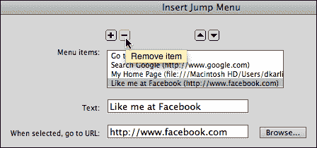
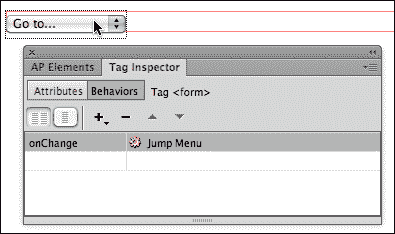
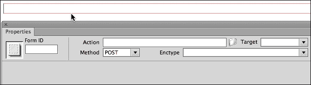
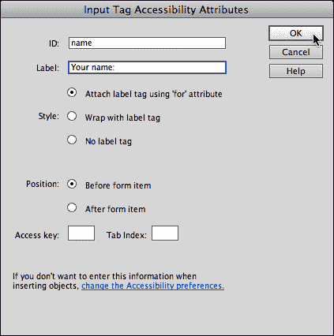
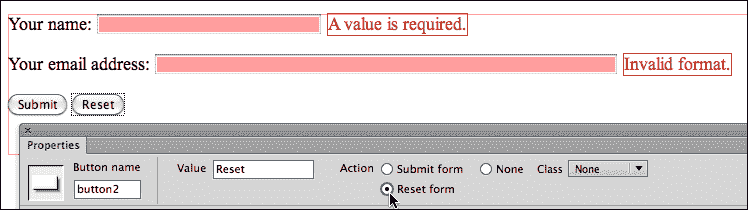
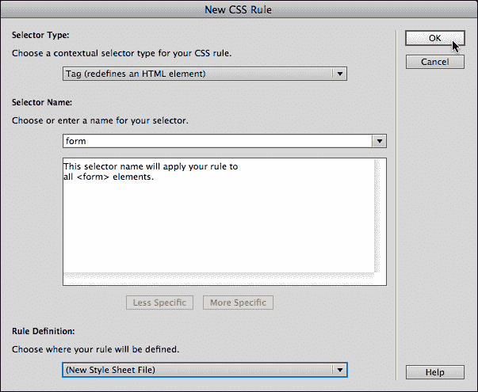
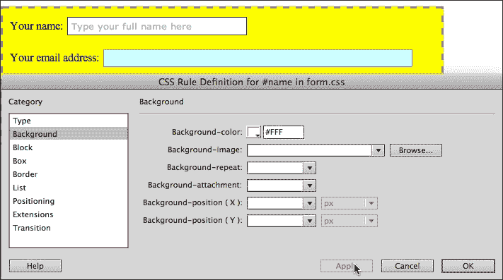
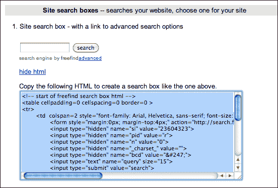

# 三、使用表单收集数据

在脸书主导的现代网络世界中，数据收集变得高度不透明。当你在社交媒体上分享一个关于一个垂死朋友的亲密想法时，那个敏感的个人数据就变成了一种商品，卖给了鲜花和死亡书籍的营销人员，当你*喜欢上了社交媒体环境中的一个乐队时，当那个乐队在你的城市或城镇附近演奏时，你(通常是无意中)报名获得了门票优惠，等等。*

我对在线“注册”技术的不透明性提出了苛刻的要求。作为建立自己网站的人，你可以让数据收集变得自愿、有意识和透明。毕竟，那些故意注册你的电子通讯、你的公告、你的特别优惠等等的人，比那些他们没有意识要求的更容易接受来自你的邮件，而这些邮件是由他们在脸书、亚马逊等网站上的活动产生的。

那么如何从访问者那里收集信息呢？一个字:**构成**。表单是与访问者互动的一种重要的、动态的方式。

以下是表单如何为您的网站带来价值的一些示例:

*   一个反馈表，让你网站的访问者分享他们的抱怨、建议和积极的体验(供你用来推广你的网站、信息、产品、原因或内容的素材)。
*   一个注册表单，让访问者有意识地获得你的时事通讯、推文、特别优惠和信息爆炸。
*   销售产品的订单。
*   一个搜索框，使您的网站内容易于访问。在本章的最后，我将向您展示如何设置一个。

Dreamweaver CS6 拥有强大的工具来构建吸引人的、可访问的表单。我一直发现 Dreamweaver 中缺少的是一种将这些表单连接到后端服务器工具来处理提交的数据的方法。虽然对这些连接的全面探索有点超出了本书的范围，但我将在本章末尾提供一些基本的解决方案和提示，以获得可用于将表单连接到后端数据管理脚本和资源的其他工具和资源。

# 用 JavaScript 捕获客户端表单管理

Dreamweaver 生成表单，但不管理表单数据。一般来说，从表单中收集的数据被发送到服务器，在那里，脚本和数据库的集合将这些数据转化为已处理的订单、已提交的投诉、电子邮件列表注册或搜索查询。在服务器上处理数据的脚本有时被称为 **服务器端脚本**。

但是有些表单数据是在没有发送到服务器的情况下收集和管理的。相反，提交的数据是使用运行在用户浏览器中的 JavaScript 来管理的。这种客户端脚本处理的数据永远不会到达服务器。

最广泛使用的客户端表单是**跳转菜单**——一个用于导航的下拉菜单。Dreamweaver 允许您轻松生成跳转菜单，在开始探索构建向服务器发送数据的表单之前，让我们快速了解一下如何在 Dreamweaver 中构建客户端跳转菜单，并编辑生成的 JavaScript 以使该表单工作。

## 创建跳转菜单

在你创建一个跳转菜单之前，你需要有一个你想用这个菜单访问的网址列表。当你收集你的清单时，我会暂停一会儿…好吗？嗯，这是一本书，所以你可以简单地为这个地方添加书签(在你的 Kindle 或 iPad 上很容易做到，但是如果你正在阅读一本印刷的书，只需稍微弯曲页面来标记这个地方)。

除了将跳转菜单概念化之外，在生成菜单之前，您还需要具备以下条件:

*   您需要在已定义的 Dreamweaver 站点中工作。如果这还不算敲响警钟，回到[第 1 章](01.html "Chapter 1. Creating Sites and Pages with Dreamweaver CS6")、*用 Dreamweaver CS6* 创建站点和页面，让自己沉浸在 Dreamweaver 站点的概念中，以及为什么它是你在 Dreamweaver 中所做的每件事必不可少的第一步。
*   您需要在保存的网页中工作。

在 Dreamweaver 网站和保存的 HTML5 页面中工作将确保您在跳转菜单中生成的任何链接都可以工作。

准备好列表、定义好站点并保存页面后，执行以下步骤在 Dreamweaver CS6 中创建跳转菜单:

1.  将插入点放在页面的**设计**视图中，选择**插入** | **表格** | **跳转菜单**。**插入跳转菜单**对话框打开。
2.  The dialog opens with the first menu item selected. Often, the first item in a jump menu is not an option, but a label that identifies the menu, such as **Go to…**. In that case, the **When selected go to URL** field is left blank, as shown in the following screenshot:

    

3.  Use the **Add Item** (**+**) icon to add items to the menu. Use the **Browse…** button to search for and add link to files in your Dreamweaver site. Or, enter a full URL in the **When selected, go to URL** field, as shown in the following screenshot:

    

4.  Use the **Add Item** (**+**) icon to add additional items to the menu. Use the **Remove Item** (**-**) icon to delete a selected item, as shown in the following screenshot:

    

5.  Use the **Move item up in list** and **Move item down in list** arrow buttons to resort the order of your list (should you alphabetize?), as shown in the following screenshot:

    

6.  When you finish defining your jump menu, click on **OK** to generate the menu. You can test the menu in the **Live** view as shown in the following screenshot:

    

## 编辑跳转菜单 JavaScript

Dreamweaver 提供了两种方法来编辑生成的跳转菜单的内容，即**属性**检查器、和**行为**面板。让我们快速看看这些是如何工作的。

要激活**属性**检查器，导航至 **窗口** | **属性**(如果不可见)。当您单击任何元素(包括跳转菜单)时，**属性**检查器会变成一个上下文相关的编辑工具。在这种情况下，**初始选择的**下拉菜单允许您更改菜单中默认显示的选项，**列表值…** 按钮打开**列表值**对话框。**列表值**对话框有您从跳转菜单对话框中识别的工具，用于添加、删除和重新排序菜单选项，如下图所示:

另一种编辑跳转菜单内容的技术不太容易访问，但是提供了使用**浏览**按钮定位和链接到您的 Dreamweaver 站点中的文件的选项。要访问该选项，请选择**窗口** | **行为**，并在**文档**窗口的**设计**视图中单击您的跳转菜单，如下图所示:

在**行为**面板中选择跳转菜单(技术上是**标签检查器**选项卡中的**行为**选项卡)，双击右侧栏中的**跳转菜单**，以(重新)打开**跳转菜单**对话框。该选项支持在跳转菜单上进行全功能编辑——几乎复制了原始的**跳转菜单**对话框。

在快速了解了基于 JavaScript 的表单以及如何在 Dreamweaver 中编辑它们之后，让我们转向功能更强大的表单——一种向服务器发送数据的表单。

# 定义形式和形式动作

表单由表单和表单元素组成。**形态元素** 是一个信封，里面所有的形态元素都被收集起来，送到某个地方。因此，表单最重要的定义元素是表单操作。**表单操作** 定义表单数据的发送位置。

正如本章前面所提到的，Dreamweaver 为表单设计了前端，但是没有提供易于访问的选项来将表单数据链接到收集和管理该数据的后端系统。

### 注

请注意，Adobe 提供了一个用于管理服务器端数据的包— **业务催化剂** 。Business Catalyst 的工具和功能对于非专业的后端管理员来说不是特别容易获得，对于大多数自由职业者和小规模开发人员来说，这项服务的成本与管理表单数据的其他选项相比没有竞争力。

在本章的最后，我将提供一些捕获表单数据的基本技术，并向您介绍其他资源。但是在这里，让我们使用最简单和最基本的技术来处理表单数据:通过用户的电子邮件客户端将表单数据发送到电子邮件地址。这不是一种优雅的技术，但是 a)它有效，可以用于更简单的表单处理挑战，例如收集反馈；b)它将作为表单处理的占位符，直到我们回到本章末尾的概念。

要插入使用用户的电子邮件客户端将收集的内容发送到电子邮件地址的表单，请执行以下步骤:

1.  单击打开的已保存文档的**设计**视图，设置表单将出现的插入位置。
2.  导航至**插入** | **表格** | **表格**。
3.  Click on **OK** to embed the form. The form appears in the **Design** view in a red box. When you select the form (by clicking on the red box), the **Properties** inspector displays the form properties, as shown in the following screenshot:

    

4.  要将表单数据发送到电子邮件地址，请在**操作**字段中输入`mailto:mail@mail.com`，用真实的电子邮件地址替换占位符电子邮件地址。
5.  在 **Enctype** 字段(编码类型的缩写)中输入`text/plain`。
6.  将**方法**选项设置为默认，**开机自检**。这是大多数表单数据的发送方式。

定义好表单后，现在就可以添加表单域和按钮了。

# 通过 Spry 验证生成表单域

**验证**是指在数据提交到服务器(或发送到电子邮件地址)之前对其进行测试。那是一件有价值的事情。例如，如果您的表单正在收集电子新闻订阅的电子邮件地址，那么人们提交没有电子邮件地址的表单是不行的。除此之外，验证可以查看输入到电子邮件地址字段中的字符，并验证该字段中的内容至少看起来像电子邮件地址。

基本上有三种技术用于验证表单数据，如下所示:

*   一旦内容被发送到服务器，服务器端脚本可以验证内容
*   HTML5 提供了一些验证工具，但它们还没有得到普遍支持，即使在一些流行浏览器的更新版本中也是如此
*   JavaScript 验证脚本可以在浏览器中测试数据

最后一个选项是在 Dreamweaver 中创建的最可靠、最快和最简单的方法。在接下来的步骤中，我们将使用 Dreamweaver 的 Spry JavaScript 和 HTML 库来插入带有内置 JavaScript 验证的字段。

## 创建已验证的文本字段

文本字段是表单的面包和黄油，收集所有形式的文本，如姓名、电话号码、账号、地址和电子邮件地址(稍后将详细介绍)。

### 注

冒着听起来非常多余的风险，让我再次强调在已定义的 Dreamweaver 站点和已保存的 HTML 文件中创建已验证字段的重要性。这现在变得特别重要，因为我们正在生成将链接到我们页面的 JavaScript 文件，如果这些链接被破坏，表单将无法工作。

文本字段最常见的验证类型是使其成为*必需的*。执行以下步骤在表单中插入所需的文本字段:

1.  导航至**插入** | **表单** | **快速验证文本字段**。出现**输入标签辅助功能属性**对话框。
2.  **标识**字段生成与表单字段相关联的标识样式。此属性在某些环境中用于使残疾人更容易访问表单，还允许您定义应用于表单字段的标识样式。输入不带空格或特殊字符的标识样式。
3.  The **Label** field generates a label that identifies the field and is easily read by software that aids disabled web users. Enter a label (the label can have special characters and spaces) as shown in the following screenshot. The other fields in the dialog can be left at their default settings, so click on **OK**, as shown in the following screenshot, to generate the form:

    

4.  Form field attributes can be defined by clicking on the form field itself in the **Design** view and making edits in the **Properties** inspector. Enter a value in the **Char width** field to define how wide the field will display (in characters). Enter a value in the **Max chars** field to define the maximum number of characters a user can enter in the field, as shown in the following screenshot:

    

5.  通过点击字段上方的(浅绿色) **Spry TextField** 选项卡来定义验证规则。默认情况下，我们的**名称**字段为必填字段。您可以通过在**最大字符数**或**最小字符数**字段中输入最大或最小字符数来添加验证规则。默认情况下，当用户提交表单时，该字段会在提交时进行验证。您也可以通过选中**模糊**和**更改**复选框，在用户离开字段时强制验证(这两个选项在不同的浏览环境中完成类似的事情)。
6.  You can preview how the field will respond to valid or invalid entries by experimenting with options in the **Preview states** dropdown list. The area below the preview shows the result if a user attempts to submit the form without filling in a required field, as shown here:

    

7.  定义完字段和验证规则后，在**设计**视图中点击将插入点放在表单字段的末尾，按*回车*或*回车*键为新的表单字段创建新的行。

## 创建已验证的电子邮件字段

创建已验证的电子邮件字段类似于创建文本字段，只是您将设置验证规则来检测看起来像电子邮件地址的(并且仅接受)输入。

为此，单击电子邮件地址表单字段的(aqua) **Spry TextField** 选项卡，并从**属性**检查器的**类型**下拉菜单中选择**电子邮件地址**。并且，选择**属性**检查器右侧的**强制模式**复选框，如下图所示:

从查看**类型**下拉列表中的选项可以看出，Dreamweaver 可以为不同类型的文本输入生成一系列验证脚本，从电话号码到信用卡。

## 添加其他字段

**插入** | **表单**中的子菜单包括用于生成额外类型的已验证表单字段的选项。其中最重要的如下:

*   **复选框**:用于*是或否*选择，用户可以选择或取消选择一个选项。
*   **选择**:用于在表单中创建带有选项的下拉菜单。
*   **单选组**:用于创建用户只能选择一个选项的选项集。例如，允许用户选择一种(且仅一种)类型的信用卡。

这些额外的经过验证的表单字段在我们讨论文本字段选项的背景下非常容易理解。它们显示在下面的屏幕截图中(从上到下:复选框、选择菜单和单选按钮组):

## 添加提交和重置按钮

如果没有**提交**按钮，用户输入到表单中的内容实际上哪儿也去不了。表单中的**提交**按钮启动表单操作。所以，如果我们在这里应用形式逻辑的规则，我们最好确保我们的表单有一个**提交**按钮。

导航至**插入** | **表格** | **按钮**添加**提交**按钮。出现**输入标签辅助功能属性**对话框，但只需点击**确定**即可创建**提交**按钮，无需担心该对话框中的选项。表单上会出现一个**提交**按钮。

**复位**按钮很方便，但不是必须的。他们将表单“重置”为其原始(空)状态。要创建**重置**按钮，请插入第二个按钮。在表格中选择该按钮后，在**属性**检查器中选择**重置表格**单选按钮，如下图所示:

# 用 HTML5 提示

正如本章前面提到的，浏览器对 HTML5 表单元素和属性的支持正在进行中。出于这个原因，我建议不要使用 HTML5 表单属性，这些属性是表单工作所必需的，比如验证属性。

但是 HTML5 占位符是个好主意。它们用表单域中的文本提示用户，当用户输入内容时，文本消失。如果用户的环境不支持 HTML5 表单占位符，他们仍然可以依靠表单标签来帮助他们弄清楚要在表单字段中输入什么。

占位符参数可以添加到文本输入中。不幸的是，Dreamweaver CS6 没有提供在 **Design** 视图中定义占位符文本的选项，但是我们可以在 **Code** 视图中这样做。为此，请执行以下步骤:

1.  从 Dreamweaver 的**文档**窗口中选择**分割**视图。
2.  Click on a form field in the **Design** side of the **Split** view to find the code on the **Code** side of the **Split** view, as shown on the following screenshot:

    

3.  At the end of the `input` tag, add `placeholder="placeholder text"` (replace "placeholder text" with real text), as shown in the following screenshot:

    

您可以在**分割**视图的**设计**侧的**实时**视图中预览占位符文本。

# 设计表单的 CSS

在本书的前两章中，我们建立了一个依靠外部 CSS 样式表文件为 HTML 元素(如标题、段落和链接)提供格式的框架，以及可以应用于`div`标签来设计页面的特殊 ID 和类样式。

该原则如何应用于定制表单输入？简单的回答是:您为不同的表单元素创建样式。长答案:好吧，我们现在就来看看如何做到这一点。

以下是可应用 CSS 样式来自定义表单外观的关键 HTML 元素:

*   `<form>`元素样式定义了整个表单的外观。
*   `<input>`元素样式定义了输入字段(如文本字段)的外观。
*   可以为具有关联标识的样式定义特定的标识样式(这是我们在本章前面介绍的技术，当时我在**输入标签辅助功能属性**对话框中向您展示了如何为文本字段分配标识(参见*创建有效文本字段*部分)。

## 为表单元素创建样式表

让我们走完在一个新的链接的 CSS 文件中定义这些样式的过程。我们将其命名为`form.css`。

1.  As always, starting from a saved HTML page in a defined Dreamweaver site, view the **CSS Styles** panel (**Window** | **CSS Styles**). Click on the **New CSS Rule** (**+**) icon at the bottom of the panel, as shown in the following screenshot:

    

    ### 注

    请注意，如果您正在使用包含 Spry 验证小部件的表单，您的 **CSS 样式**面板将链接到一个 CSS 文件，该文件定义了这些小部件的元素，这些元素为验证错误消息设置背景颜色和字体等样式。

2.  在**新 CSS 选择器规则**对话框中，选择以下选项:
    *   从**选择器类型**下拉列表中选择**标记**
    *   从**选择器名称**下拉列表中形成
    *   **规则定义**下拉列表中的**(新样式表文件)**
3.  Click on **OK** to begin defining the new file and style, as shown in the following screenshot:

    

4.  在**将样式表文件另存为**对话框中，单击**站点根目录**按钮，将文件保存在 Dreamweaver 站点的根文件夹中。在**另存为**字段，输入`form.css`。点击**保存**。出现 **CSS 规则定义**对话框。
5.  您可能想要为表单样式定义背景颜色。在 **CSS 规则定义**对话框的**背景**类别中进行(从**背景颜色**样本中选择一种颜色)。
6.  您还可以为表单定义一个宽度，以限制它拉伸页面(或封闭元素)的整个宽度。通过在**框**类别的**宽度**字段中输入一个宽度(如 600 像素)来实现。另外，在**框**类别中，尝试为表单定义 10 像素的填充和 10 像素的边距。
7.  Try defining a border for your form. At any time you can click on the **Apply** button on the **CSS Rule Definition** dialog to test your styling, as shown in the following screenshot:

    

8.  微调表单样式后，点击 **CSS 规则定义**对话框中的**确定**保存并应用您的样式。
9.  导航至**文件** | **全部保存**保存您的网页和带有更改的 CSS 文件。

## 为表单元素创建样式

与为`<form>`元素定义样式相同，您可以为`<input>`元素创建新样式。唯一不同的是，一旦你为表单创建了一个 CSS 文件(`form.css`)，你将想要保存所有与表单相关的样式到该 CSS 文件中。我将从以下步骤开始:

1.  切换到**文档**窗口中的**实时**视图，以更准确地预览您将要定义的样式。
2.  点击面板底部的**新 CSS 规则** ( **+** )图标。**新 CSS 选择器规则**对话框打开，选择以下选项:
    *   从**选择器类型**下拉列表中选择**标记**
    *   从**选择器名称**下拉列表中输入
    *   从**规则定义**下拉列表中选择`form.css`
3.  点击**确定**开始定义新样式。
4.  The **CSS Rule Definition** dialog appears. You can take it from here—define style attributes for an input field and click on **Apply** to see how they look in the **Design** view, as shown in the following screenshot:

    

5.  定义输入字段的样式后，点击**确定**。

## 为表单创建标识样式

到目前为止，我们创建的样式适用于元素的每个实例。例如，我们的表单样式属性(背景颜色、宽度等)将适用于每个表单。我们的输入样式属性适用于每个输入元素(名称和电子邮件字段以及提交和重置按钮)。

如何定义仅适用于特定元素的样式？一种技术是使用与我们在生成 Spry 验证字段时创建的字段相关联的标识。

执行以下步骤，为我们在创建字段时生成的标识元素之一使用标识样式:

1.  点击面板底部的**新 CSS 规则** ( **+** )图标。**新 CSS 选择器规则**对话框打开，选择以下选项:
    *   从**选择器类型**下拉列表中选择**标识**
    *   从**选择器名称**下拉列表中选择**名称**
    *   从**规则定义**下拉列表中选择**表单**
2.  点击**确定**打开 **CSS 规则定义**对话框。
3.  Define custom styling for the **name** ID element, testing your style by clicking on **Apply**, as shown in the following screenshot:

    

4.  单击**确定**以定义**名称**标识元素的样式。
5.  导航至**文件** | **全部保存**保存对 HTML 和 CSS 文件的更改。

## 关于形式风格的思考

在我们探索表单的框架中，我们正在使用自己设计的表单。在“现实生活”中，尤其是在更复杂的专业项目中，表单的 HTML 将由构建管理表单输入的后端脚本和数据库的团队提供。

但是我想强调的是，你仍然可以创建 CSS 文件和样式来定制那些表单的外观。所以，从谷歌搜索引擎得到的表单 HTML，从[www.TheSiteWizard.com](http://www.TheSiteWizard.com)管理反馈得到的表单 HTML，从电商插件包得到的表单 HTML，都可以用自己的 CSS 定制。通过这种方式，表单可以被整合到你为你的网站设计的吸引人的外观中。

# 真实世界的表单处理

虽然我强调了 Adobe 没有提供一个可访问的、价格合理的框架来管理表单数据，但是有大量的在线资源，其中许多是免费的，可以很容易地插入到 Dreamweaver 网站中。在结束本章之前，我想给大家介绍一个**FreeFind box**T3 的例子。

我选择这个例子是因为很少有网站不使用搜索框，也因为安装(和定制)一个 Freefind 搜索框是免费的，非常简单。

要做到这一点，你只需要一个远程服务器上的实时网站。用其中的一个来设置有点复杂。请参考本书第 1 章*中的*定义远程站点*一节，了解如何使用 Dreamweaver CS6* 创建站点和页面。

以下步骤借鉴了本章前面介绍的技术，因此，如果您直接跳到书中的这一点来安装搜索框，您最好先跳到本章的开头，了解表单和表单样式的基础知识。

因此，在此前提下，请执行以下步骤将搜索框添加到您的站点:

1.  导航至**文件** | **新建**并通过执行以下步骤创建一个包含搜索框的新页面:
    1.  在**新建文档**对话框的左侧栏中，选择**空白页**。
    2.  在**页面类型**栏选择 **HTML** 。
    3.  在**布局**栏选择 **<无>** 。
    4.  点击**创建**生成新页面。
    5.  在**文档**工具栏的**标题**区域，键入`Search this site`
    6.  将网站根文件夹中的页面保存为`search.html`。
    7.  使用 **CSS 样式**面板中的**附加样式表**图标将`form.css`样式链接到此页面。您将使用本章前面为注册表单创建的同一组样式。
2.  In a browser, go to [www.freefind.com](http://www.freefind.com). To sign up for a search box, perform the following steps:
    1.  输入您的姓名、电子邮件，点击**即时注册**按钮。您将获得发送到您的电子邮件地址的登录信息。
    2.  使用发送到您的电子邮件地址的登录信息登录您的 FreeFind 帐户。登录过程将直接带您进入搜索框的**控制**窗口。
    3.  FreeFind 提供价格合理的无广告选项，但你可以使用免费版本来尝试形式和风格，因此无需订阅任何特殊计划。
    4.  点击**控件**窗口中的 **HTML** 选项卡，如下图截图所示:

    

3.  要复制并粘贴搜索框的 HTML，请执行以下步骤:
    1.  为了简单起见，我们将使用搜索框的第一个选项 **1。网站搜索框-带有高级搜索选项**的链接。
    2.  Click on the link beneath that option that says **get the html and paste it into your page**. The HTML is displayed in a box as shown in the following screenshot:

        

    3.  单击代码内部，并将其复制到剪贴板。
4.  切换回你的打开 Dreamweaver HTML 文件(`search.html`)。在**拆分**视图的**代码**侧，点击将插入点放在`<body>`标签的末尾，然后按*回车*或 *回车*键创建新的代码行。
5.  Paste the copied HTML from FreeFind, and view the result in **Live** view in the **Design** side of the **Split** view as shown in the following screenshot:

    

6.  FreeFind 代码充斥着表格格式。如果您愿意，可以在**分割**视图的**代码**侧删除该代码，或者直接接受它。但更重要的是，您可以使用**属性**检查器和我们在本书中探索的其他编辑技术来定制表单。我将让您回顾这一章，作为我们所讨论内容的实际应用，以及某种“测试”，以增强您格式化表单的信心和技能，从而实现以下目标:
    *   将搜索字段的宽度更改为 48 个字符，最大字符数更改为 60 个
    *   添加此占位符文本:`search string goes here`
    *   添加重置按钮
    *   As long as you don't change the form field names or delete them (including the hidden form fields that will not display in a browser but will allow FreeFind's search box to function), you can edit both the HTML and CSS for your form, as shown in the following screenshot (in **Live** view):

        

    *   通过使用您的`form.css`样式表，您将使 FreeFind 搜索框看起来和感觉上像您站点中的其他表单。

FreeFind 示例比您从第三方获得的一些表单更简单。但是为表单生成 HTML、将表单粘贴到 Dreamweaver 中、编辑表单 HTML(不删除或重命名任何表单字段)以及应用您自己的自定义样式的基本技术...这适用于任何地方的任何形式。

# 总结

在本章中，我们探讨了 Dreamweaver CS6 用于生成验证表单的强大工具。为此，我们调用了 Spry 框架——一组结合了 HTML、CSS 和 JavaScript 的小部件，将不同种类的交互性应用于网页。在本书后面的章节中，我们将多次回顾 Dreamweaver CS6 中的 Spry 小部件集。

我们还学习了用 Dreamweaver 生成的 JavaScript 创建一个简单的跳转菜单。因此，从几个不同的方向，我们开始探索 Dreamweaver 与表单相关的 JavaScript 特性。

然后，我们超越了 Dreamweaver 对表单所做的工作——具体地说，向带有提示文本的字段添加占位符属性。我们必须进入**代码**视图才能做到这一点，因为 Dreamweaver 对新 HTML5 属性的支持微不足道。

最后，您完成了一个将表单与脚本和数据库后端系统连接起来的真实例子。FreeFind 搜索示例相对简单，但是它包含了将任何后端服务器提供的表单嵌入到 Dreamweaver CS6 站点所需处理的所有元素。与此相关，我想强调自定义 CSS 在使嵌入式表单看起来和感觉上与我们网站的其他部分一样方面的动态作用。我们将在下一章更深入地讨论 CSS 格式。