# 第一章：使用 Dreamweaver CS6 创建站点和页面

本书以压缩的方式涵盖了 Dreamweaver CS6 中可用的整个尖端和高级功能范围。我们重点介绍了 HTML5 中的新功能，这些功能可以结构化内容并使其更易访问，CSS3 样式可以为元素添加转换（如旋转）和效果（如圆角），以及使用 HTML5 媒体查询和 jQuery Mobile 进行移动设计。Dreamweaver CS6 提供了实现所有这些功能的重要工具。

我们很快就会谈到这个。但首先，在本章中，重温（对于那些刚接触 Dreamweaver 的人来说，理解）一些最基本的工具对于在 Dreamweaver 中提高生产力是很重要的。这样做有两个目的：它提供了对 Dreamweaver CS6 基础知识的快速概述，可能更重要的是，它让我们都遵循协议，保护本书中要涵盖的其他所有内容的完整性。

在本章中，我们将：

+   定义 Dreamweaver 站点

+   创建 HTML5 页面

+   将元素应用到文本

+   定义链接

+   插入图像

+   创建 CSS 文件并将 HTML 页面链接到这些样式表

+   定义和应用页面设计的 ID 和类 Div 样式

# 定义 Dreamweaver 站点

在 Dreamweaver 中做的每件事都要求您首先创建一个 Dreamweaver 站点。没有 Dreamweaver 站点，Dreamweaver 中的任何功能都无法正常工作。

为什么这样做？基本上，这是因为您在本书学习构建的网页涉及数十个文件。数十个？真的吗？好吧，数一下：一些 JavaScript 文件，链接到内部和外部页面，嵌入的音频、视频和图像，链接到 CSS 文件，以及使用 iFrame 技术嵌入其他页面的内容。我们已经有数十个了！

如果这些文件之间的任何关系或链接出现故障——例如文件被移动、重命名或删除——我们的页面就会崩溃。但是，如果我们在（并遵循）Dreamweaver 站点中工作，Dreamweaver 会跟踪所有网页中的所有文件，例如嵌入的图像文件和视频剪辑，以及链接到其他网页，并确保所有这些文件协同工作。

Dreamweaver 站点还提供了管理本地（预览）站点和站点的在线远程版本之间文件传输的工具。

## 定义本地站点

所有这一切都始于为您用 Dreamweaver 管理的每个网站定义一个单独的（仅一个）Dreamweaver *站点*。我们在这里使用*站点*斜体和大写字母来强调我们不是在谈论在“网站”中组织文件，而是在定义一个非常特定的 Dreamweaver 东西——一个站点。

从 Dreamweaver 的任何界面中执行这个操作的最简单方法是通过**站点**菜单。定义站点的第一（也是唯一必要的）步骤是在您自己的计算机上创建一个本地版本；与远程（在线）服务器的连接可以稍后再进行。

在定义 Dreamweaver 站点之前，在您的计算机上创建一个文件夹（您的桌面是一个方便的地方），作为站点的根文件夹。在命名该文件夹时避免使用空格或特殊字符（即，使用`daves-website`而不是`Dave's Website!`）。

要定义本地站点，请按照以下步骤：

1.  启动 Dreamweaver CS6 后，选择**站点** | **新建站点**。**站点设置**对话框将打开。

1.  在**站点名称**字段中，输入任何内容，以帮助您将此站点与其他站点区分开。在使用空格或特殊字符方面没有限制。

1.  在**本地站点文件夹**字段中，使用**浏览文件夹**图标找到您创建的文件夹，作为您站点的根文件夹。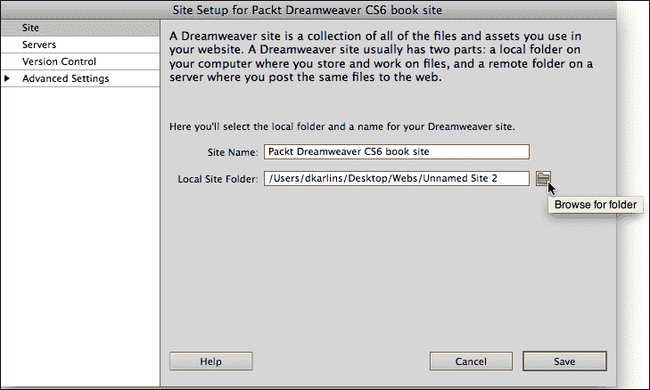

上面的截图显示了如何为 Dreamweaver 站点创建根文件夹。

1.  单击**浏览文件夹**图标后，**选择根文件夹**对话框将打开。导航到您的根文件夹，然后单击**选择**。这将返回您到**站点设置**对话框。

1.  单击**保存**以完成本地站点的定义：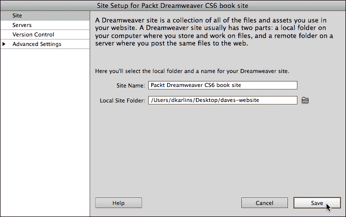

上一张屏幕截图显示了一个 Dreamweaver 站点，其中定义了**本地站点文件夹**文件。

我们将很快返回到我们的本地站点，并看看如何使用它，但首先让我们步行一下如何为我们的站点定义远程连接。

## 定义远程站点

大多数网站都是为在互联网上公开发布而设计的。它们托管在能够实现这一点的服务器上；这些服务器主机很容易找到（一个可靠的价格和功能列表在[`reviews.cnet.com/web-hosting-plans/`](http://reviews.cnet.com/web-hosting-plans/)）。

在您可以为 Dreamweaver CS6 定义远程服务器的链接之前，您需要先签约远程托管。这个托管服务将为您提供三个基本信息——FTP 地址、用户名和密码。有些托管设置还包括一个定义的根目录。当您签约托管时，请记录这些信息，或者如果您现在将该服务器纳入 Dreamweaver 站点中，请查找您当前托管服务的登录信息。

有了您的 FTP 地址、用户名和密码，接下来的步骤将介绍为 Dreamweaver 站点定义远程连接所需的内容。或者不要。请记住，在您自己的计算机上构建站点并不需要远程站点，您几乎可以在本书中的所有内容中工作而不需要远程连接。

要为 Dreamweaver 站点定义远程连接，请按照以下步骤操作：

1.  启动 Dreamweaver CS6，选择**站点** | **管理站点**。这将打开**管理站点**对话框，顺便说一句，您可以使用这种技术（管理站点）来编辑 Dreamweaver 站点定义中的任何内容，而不仅仅是远程连接。

1.  在**管理站点**对话框中，双击**您的站点**列表中的站点，再次打开**站点设置**对话框。

1.  在**站点设置**对话框的左侧类别列表中，选择**服务器**。

1.  单击**添加新服务器**（**+**）按钮。另一个名为**站点设置…**的对话框打开。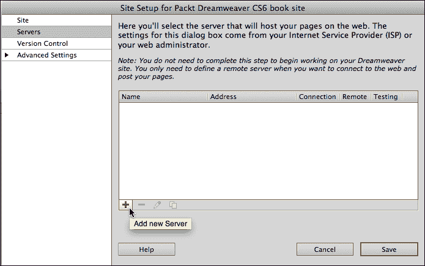

上一张屏幕截图显示了一个新的服务器连接被添加到站点定义中。

1.  在**服务器名称**字段中，输入任何有助于您记住您正在连接的服务器的文本。

1.  在**FTP 地址**字段中，输入您的托管管理员提供的 FTP 地址，在**用户名**字段中输入提供的用户名，在**密码**字段中输入您的密码。大多数站点使用**端口 21**，所以除非得到站点管理员的指示，否则不要更改**端口**字段中的默认值。

1.  选择**使用被动 FTP**和**使用 FTP 性能优化**复选框可以有助于避免连接故障。要查看这些选项，请展开**站点设置…**对话框的**更多选项**部分。在 Dreamweaver CS6 中，默认情况下这些复选框是选中的。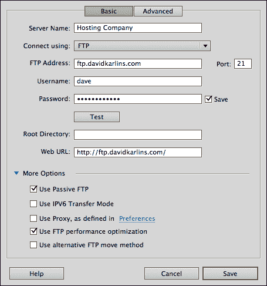

上一张屏幕截图说明了一个已定义的远程连接。

1.  **Web URL**字段是根据您在**FTP 地址**字段中输入的内容自动填写的。这些信息被 Dreamweaver 用于诸如其内置的链接检查功能之类的工具，但与定义站点的过程无关，更多地起到了分散注意力的作用。如果您愿意，可以用您网站的实际 URL 替换生成的 URL。

1.  先不要单击**保存**。首先，单击**测试**按钮。如果出现错误消息，请与您的站点托管公司检查您的 FTP 地址、登录凭据和密码（并确保您已连接到互联网）。当**测试**按钮产生一条消息说您已成功连接到您的 Web 服务器时，单击**保存**。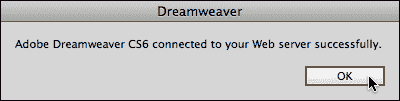

上一张屏幕截图说明了一个成功测试的远程连接。

1.  在本地和远程站点之间传输文件

## 前面的屏幕截图说明了本地和远程视图之间的切换。

在定义了 Dreamweaver 站点之后，您可以在“文件”面板中查看本地或远程站点的文件。与 Dreamweaver 中的任何其他面板一样，您可以通过“窗口”菜单查看或隐藏“文件”面板。

保存远程连接后，“站点设置…”对话框会再次出现。再次单击“保存”。然后，在“管理站点”对话框中单击“完成”按钮。您的站点现在已经定义好了！

“文件”工具栏中的第二个下拉菜单在四个视图之间切换，其中两个与大多数设计师相关，另外两个对大多数设计师来说是神秘的。前两个选项在本地或远程站点的文件之间切换。“测试服务器”选项用于后端编程脚本，用于管理数据，“存储库视图”选项用于存储代码片段。

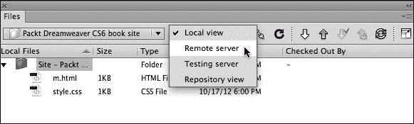

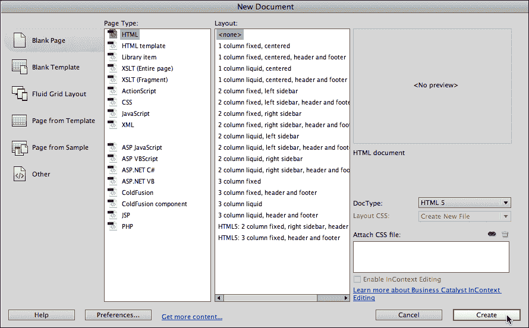

当您单击“连接到远程服务器”按钮时，您可以使用“文件”面板查看远程站点中的文件。您可以通过单击“文件”面板工具栏最右侧的“展开/折叠”图标来分割“文件”面板：

您可以将文件从本地拖动到“文件”面板的远程侧，或使用“获取文件”（向下箭头）或“放置文件”（向上箭头）符号分别下载或上传您的文件。

在前面的屏幕截图中，按下了“连接到远程服务器”按钮，并悬停在“折叠/展开”按钮上；这使我们可以在展开时在本地和远程视图之间切换，或者在折叠时只查看本地或远程视图。

“文件”面板顶部的工具栏中有两个下拉菜单。使用第一个下拉菜单选择 Dreamweaver 站点。如果只有一个站点，那么默认情况下将选择该站点。

# 创建 HTML5 页面

有了一个定义好的站点，你就可以在 Dreamweaver 中创建 HTML5 页面。HTML5 是 HTML 的当前标准，也是最广泛支持的 HTML 版本，包括旧版浏览器。HTML5 中有一些旧版浏览器不支持的新功能，但是使用旧版浏览器查看现代网站的访问者会产生最少的错误消息。因此，HTML5 是 Dreamweaver CS6 中网页的默认文档类型。

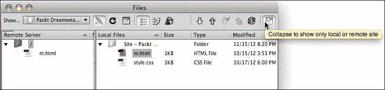

按照以下步骤在 Dreamweaver CS6 中创建一个新的 HTML5 页面：

1.  从 Dreamweaver 的主菜单中选择“文件”|“新”。将出现“新建文档”对话框。

1.  从左侧列中选择“空白页面”。在“页面类型”列中，选择“HTML”。在“布局”列中，选择“<none>”。将“HTML 5”保留为“文档类型”下拉菜单中的设置。单击“创建”按钮生成一个新页面。

Dreamweaver CS6 附带了预设计的 HTML5 页面布局，一个用于两列页面，一个用于三列页面。这些都是有用的，并且有很好的文档记录，但是在这个对 Dreamweaver CS6 的简要介绍中，我们将不得不匆匆忙忙地跳过它们，直接开始从头开始构建 HTML5 页面。

1.  新页面在 Dreamweaver 的“设计”窗口中打开。我们不会探索“设计”窗口中的每个选项，但会确定关键选项：

+   文档工具栏左上角的“代码”、“分割”和“设计”按钮在代码编辑器、屏幕分割的代码编辑器和所见即所得页面之间切换，或者只是所见即所得视图。大多数人会发现“分割”视图最有效，因为它可以快速访问所见即所得设计工具，还可以访问代码。

+   当**实时**视图切换打开时，显示页面更像在浏览器中的样子（例如，有助于查看链接在浏览器中的外观）。但您不能在**实时**视图打开时进行编辑。

+   **在浏览器中预览/调试**按钮提供了在任何已安装的浏览器中快速预览您的页面的功能。

+   **文件管理**按钮允许您直接从**设计**视图上传打开的页面，而无需使用**文件**面板。

+   **WC3 验证**按钮访问工具来测试您的代码。

+   **刷新**按钮更新**设计**视图以匹配新代码。

+   **标题**字段定义了出现在浏览器标题栏中的页面标题。

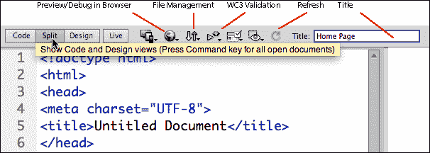

上述截图说明了文档工具栏中的一些关键工具。

1.  选择**文件** | **保存**来保存您的文件。使用小写字母和数字，不要使用空格或特殊字符（除了 _ 或-），以确保您的文件和链接不会损坏，并且可以在浏览器中打开。

+   第一次保存文件时，**另存为**对话框会打开。

+   使用**另存为**对话框中的**站点根目录**按钮快速导航到 Dreamweaver 站点的根文件夹。对于较小的站点，您可以直接将所有文件保存在此文件夹中。对于更复杂的站点，您可以在此文件夹中创建子文件夹。

+   为任何文件夹定义主页的最广泛支持的方法是将其命名为`index.html`。

+   使用`.htm`或`.html`作为文件扩展名，但避免同时使用两者，以防止由于具有相同名称和不同扩展名的两个文件而导致混乱。

+   当您在**另存为**字段中输入有效的文件名后，点击**保存**。

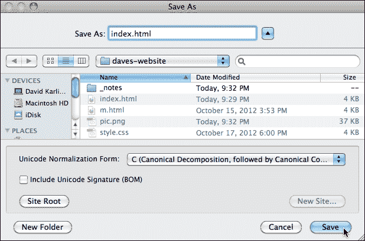

上述截图说明了将 HTML5 页面保存为具有`index.html`文件名的网站主页。

# 创建文本内容

Dreamweaver 文档窗口中一个有价值且提高生产力的功能是**设计**视图（或**分割**视图的**设计**侧）作为一个功能性的文字处理器。您可以在这里使用标准的编辑工具来撰写文本。

也就是说，更有可能你会从网页或文字处理文档中复制文本内容。

根据文本的来源，Dreamweaver 提供了一组选项，用于将文本粘贴到文档窗口中。这些选项可以通过选择**编辑** | **特殊粘贴**来访问。使用试错法找到最适合将复制的文本粘贴到文档窗口中的选项（从最简约的**仅文本**到保留更多格式的选项）。

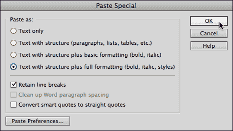

将复制的文本粘贴到 Dreamweaver 页面中

## 应用标题

应该使用 HTML 文本元素（标签）—标题、段落和列表—来表示内容的优先级。CSS 样式（我们很快会介绍）用于定义这些元素的外观。

一般来说，`h1`元素应用于页面上最重要的标题，`h2`应用于次要标题，依此类推。

通过单击段落中的任意位置，并从**属性**检查器的**格式**下拉菜单中选择标题元素来应用标题元素（如果不可见，选择**窗口** | **属性**）。

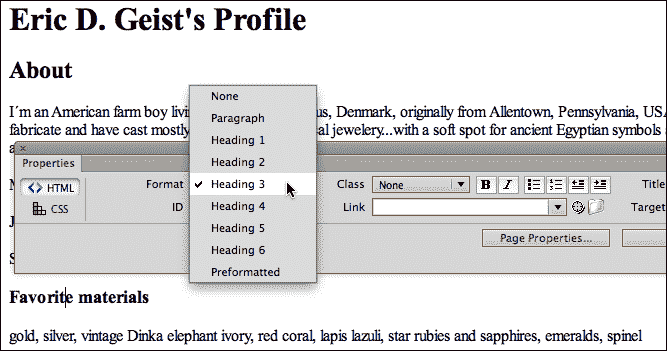

上述截图说明了将`h3`标签应用于选定的文本行。

## 添加段落、列表和链接

默认情况下，您在文档窗口中输入的内容会添加段落标签以应用段落格式（包括段落之间的间距）。您可以从**属性**检查器中的**格式**下拉菜单中应用段落标签到选定的段落。

通过单击**属性**检查器中的这两个图标之一，将有序（编号）或无序（项目符号）列表应用于选定的文本。

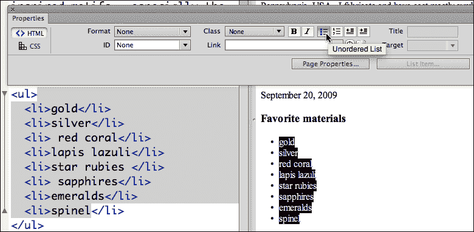

在上面的屏幕截图中，在文档窗口中应用了无序列表和列表标签。

通过在**属性**检查器的**链接**字段中输入 URL（包括`http://www`部分），可以为所选文本分配链接。从**目标**下拉菜单中选择**_blank**，以在新的浏览器窗口（或标签，取决于用户的配置）中打开链接。在**标题**字段中输入悬停在链接上时将显示的标题文本。

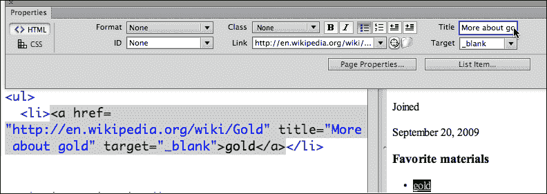

在上面的屏幕截图中，定义了一个将在新浏览器窗口中打开的链接；同时，应用了链接标题。

您还可以使用位于**链接**字段右侧的**浏览文件**图标，浏览并链接到 Dreamweaver 站点中的文件。

## 插入图像

如果您已经将图像保存并准备好用于 Web，您可以通过单击文档窗口来定义插入点，并选择**插入** | **图像**来嵌入它们。**选择图像源**对话框会出现。导航到并选择您的图像文件，然后单击**打开**以插入图像。这样做时，**图像标签可访问性属性**对话框会出现。在**替代文本**字段中输入文本，这些文本将对禁用图像或视力受损的用户可访问。**长描述**字段可用于链接到描述图像的 HTML 页面，当您的网站的主要受众是无法查看图像的用户时。

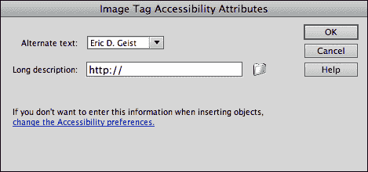

在上面的屏幕截图中，为图像定义了替代文本。

您还可以从任何来源复制和粘贴艺术品到 Dreamweaver 文档窗口中。粘贴复制的图像会启动**图像优化**对话框。**预设**下拉菜单提供了清晰解释的选项，用于将图像转换为可用的网页友好图像格式之一。选择一个并单击**确定**以插入并启动**保存网页图像**对话框。

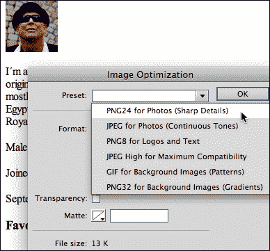

上面的屏幕截图说明了如何为粘贴的图像选择文件格式。

在**保存网页图像**对话框中，在**另存为**字段中输入文件名（除了-或 _)，不要有空格或特殊字符。单击**保存**以保存图像，如下图所示：

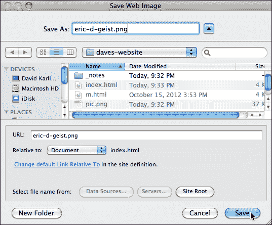

# 链接到样式表

快速浏览了创建带有文本、图像、标题、列表和链接的 HTML5 网页所需的基本技术之后，让我们转向更加简洁的定义和将该页面链接到外部 CSS 样式表的调查。

外部层叠样式表（CSS）文件已经成为格式化网页内容的标准方式已经有一段时间了，取代了以前的网页设计演变过程中的步骤，比如使用数据表格进行页面设计，或者使用 HTML 属性（例如，`color=red`）进行格式化。

当我们使用与不同类型内容相关联的新 HTML5 元素（如文章、标题、页脚和侧边栏）来构建页面内容时，我们将在下一章中返回到将样式和 HTML 结合起来设计页面。在这里，我们将简单地建立创建和链接样式表的基本技术。

## 创建和链接到外部样式表

一个基本的网站，甚至是一个大型网站，通常可以使用一个外部样式表链接到数百甚至数千个页面。将样式组织在外部样式表中允许全局更新——当样式表中的页面背景发生变化时，整个网站的背景也会发生变化。

要创建样式表，请按照以下步骤进行：

1.  从 Dreamweaver 的主菜单中选择**文件** | **新建**。**新建文档**对话框会出现。

1.  在左列中，选择**空白**。

1.  在**页面类型**列中，选择**CSS**。

1.  单击**创建**。一个新的 CSS 文件将打开，其中包含一个`@charset`声明，用于支持最广泛的字符集，以及一个指示这是 CSS 文件的注释。

1.  通过选择**文件** | **保存**来保存文件。您的样式表文件可以有一个简单的名称，比如`style.css`（一如既往，避免使用空格、大写字母或特殊字符）。在**另存为**对话框的**另存为**字段中输入文件名，并单击**保存**来保存文件，如下面的截图所示：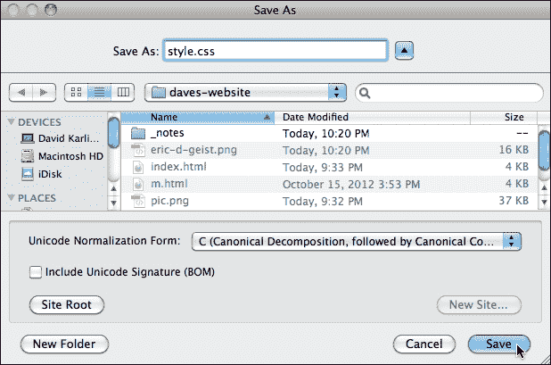

## 将样式表链接到 HTML 文件

要将 CSS 文件链接到 HTML 页面，首先确保 HTML 页面在文档窗口中打开。

请注意，在保存文件后，您可以在文档工具栏上方的选项卡栏中在 CSS 文件和打开的 HTML 文件之间切换（您可以使用这些选项卡在打开的文件之间切换）：

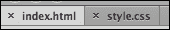

按照以下步骤将 CSS 文件链接到打开的 HTML 页面：

1.  打开 HTML 文件，查看**CSS 样式**面板（**窗口** | **CSS 样式**）。

1.  单击**CSS 样式**面板底部的**附加样式表**图标。**附加外部样式表**对话框将打开。

1.  使用**浏览**按钮导航到并选择您的 CSS 文件，然后单击**附加外部样式表**对话框中的**确定**来将 CSS 文件链接到您打开的 HTML 页面。

1.  链接的 CSS 文件现在显示在**CSS 样式**面板中（确保在**CSS 样式**面板顶部选择**所有**标签，而不是**当前**标签）。

### 定义 Body 标签的样式

任何网页中最具定义性的元素就是`<body>`标签，因为它控制着所有可见的页面内容。随着样式表的增长，更具体的标签将覆盖`body`标签的样式，但是您应用于`body`标签的样式设置了页面的默认外观。因此，让我们以 Dreamweaver 中如何定义样式为例。

要定义带有字体、字体颜色和页面背景颜色的`body`样式，请按照以下步骤操作：

1.  在**CSS 样式**面板中，单击面板底部的**新建 CSS 规则**图标；**新建 CSS 规则**对话框将打开。

1.  从**选择器类型**下拉菜单中选择**标签**。

1.  从**选择器名称**下拉菜单中选择**body**。

1.  在**规则定义**下拉菜单中，选择您链接的样式表。

1.  单击**确定**打开**规则定义**对话框。

1.  在**类型**类别中，从**字体系列**下拉菜单中选择一个字体系列。

1.  从**类型**类别的其他下拉菜单和样本中选择其他字体参数和值。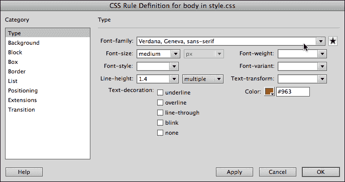

上面的截图说明了为 body 元素定义字体系列。

1.  在**CSS 规则定义...**对话框的**背景**类别中，选择一个背景颜色。

1.  单击**应用**预览您的设置。

1.  单击**确定**应用您的设置。

一旦定义，样式可以在**CSS 样式**面板的底部进行调整。在下面的截图中显示了这一点，在**CSS 样式**面板中编辑了`font-family`属性：

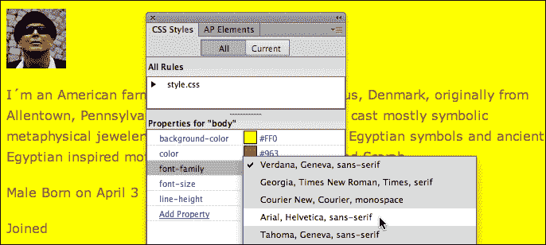

## 定义包装器 ID 样式

在“包装”我们在 Dreamweaver CS6 中对基本页面构建技术进行压缩探索/回顾之前，让我们将“包装器”`div`标签应用于限制页面宽度并创建与页面本身不同的单独页面背景。

虽然我们在下一章中创建的 HTML5 样式将让我们有机会深入探讨 CSS 的页面设计，但是 HTML5 并不带有“包装器”元素，我们必须自己创建。

我们应用的技术是将所有页面内容包含在一个称为**Div**标签的特殊标记中。Div 标签将内容分成不同的部分，如果没有与它们关联的样式，它们就无法发挥作用。

Dreamweaver 彻底简化了在页面中包裹包装器`div`标签的过程。要做到这一点，只需按照以下步骤：

1.  打开 HTML 文件，并将光标放在**分割**视图的**设计**侧上，选择**编辑** | **全选**以选择所有页面内容。

1.  选择所有页面内容，然后选择**Insert** | **Layout Object** | **Div tag**。**Insert Div Tag**对话框将打开。

1.  将**Insert**下拉菜单保留为**Wrap Around the Selection**。

1.  在**ID**字段中输入`wrapper`，然后单击**New CSS Rule**按钮。**New CSS Rule**对话框将打开；以下屏幕截图说明了如何使用**Insert Div Tag**对话框来创建**ID**样式：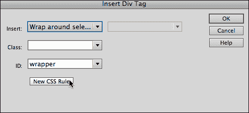

1.  在**New CSS Rule**对话框中，只需单击**OK**。**CSS Rule Definition…**对话框将打开。

1.  在**Box**类别中，在**Width**字段中输入`950`以将页面宽度限制为标准的 960 像素大小（我们将使用填充来填补缺失的十个像素）。

1.  在对话框的**Padding**部分，输入值`5`（px）。

1.  在对话框的**Margin**部分，取消**Same for All**复选框的选中，并在**Left**和**Right**边距中输入`Auto`以使 wrapper 居中。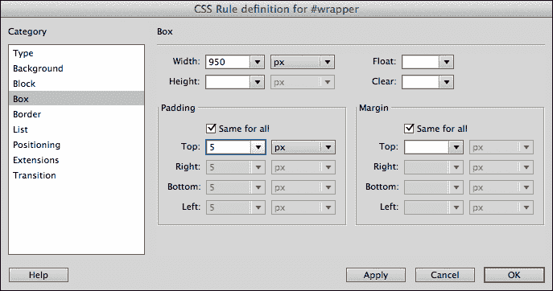

在前面的屏幕截图中，正在为名为`wrapper`的 ID 样式定义宽度、填充和边距。

1.  在**Background**类别中，为 wrapper 定义一个与`body`标签的背景颜色不同的独特背景颜色。

1.  单击**OK**以应用 wrapper。

# 总结

在本书的第一章中，我们完成了对在 Dreamweaver CS6 中工作的基本和基础技术的压缩调查。这些包括定义和在 Dreamweaver Site 中工作，构建 HTML5 页面，并链接 CSS 样式表文件。

我们还介绍了定义 ID `div`标签样式和在容器`div`标签中布局页面内容的过程。这是现代网页设计的基本构建块。

在下一章中，我们将学习在 Dreamweaver 中构建网页，依赖于 HTML5 容器标签，这些标签使页面内容结构更加合理和易于设计，并优化页面内容以便搜索引擎索引。
