# 第二章：使用 HTML5 进行页面结构

在本书的第一章中，我们看到了在 Dreamweaver CS6 中工作的基本和基础技术的简要概述：在定义的 Dreamweaver 站点中工作，构建 HTML5 页面，链接 CSS 样式表文件，并在`<div>`容器标签中限制页面内容。

在本章中，我们将学习如何在 Dreamweaver 中使用 HTML5 容器标签构建网页。通过学习这些，我们将完成以下四件事：

+   仅依赖于 HTML5 布局构建页面布局将磨练我们使用这些新工具进行页面设计的技能，并在 Dreamweaver 中引入 HTML5 代码提示

+   依赖于*标准化*和*定义*的 HTML5 布局元素（而不是自定义的、不规则实现的`div`标签）简化了页面设计

+   实际上，有重要的现实场景，仅依赖于 HTML5 布局元素构建页面是设计页面的最佳方式（例如，在为 iPhone 或 iPad 设计页面时）

+   在 HTML5 布局元素中组织页面内容除了设计考虑之外还有功能上的优势。在构建 HTML5 页面时，我们将研究这些优势。

在使用 HTML5 布局元素构建页面的过程中，我们将探讨依赖于 HTML5 的四个优势。

在构建任何专业质量网站的基础技术中，重温或至少强化以下两个基础技术是很重要的：

1.  在没有首先定义 Dreamweaver 站点之前不要做任何事情。如果您当前没有在定义的站点中工作，请查看第一章，*在 Dreamweaver CS6 中创建站点和页面*。

1.  其次，虽然不是很重要但仍然很基础：我们总是使用*外部*样式表。这允许我们定义的样式在整个网站上全局应用，并且使得更新网站成为可能。当我们开始在 CSS 样式面板中协调样式并使用 HTML5 元素构建页面时，我会提醒您，并在必要时引导您完成确保所有样式保存到外部样式表的步骤。

有了这个预览和警示提醒，让我们开始使用 HTML5 布局元素创建页面。

# 使用 HTML5 构建页面

HTML5 引入了一种新的方法，并开辟了组织页面内容的新和直观的技术。在 HTML 出现之前，我们有标签来分配标题级别（`H1`… `H6`），段落标签，列表标签和其他主要定义内容如何显示的元素。

当我们将内容组织到容器或框中时，我们只能依靠自己。因此开发人员创建了自己的 ID 和类样式集 - 一次在 HTML 文件中使用一次的 ID 样式（比如包装器样式），以及在页面上多次使用的类样式（比如定义图片/标题框的样式）。

HTML5 标准化了用于组织页面内容的元素。关键的 HTML5 结构元素如下：

+   `<header>`

+   `<nav>`

+   `<article>`

+   `<section>`

+   `<aside>`

+   `<footer>`

这些元素的名称基本上是不言自明的。`<header>`元素定义页面顶部的页眉内容，`<footer>`元素定义页脚内容。`<nav>`元素定义导航内容。`<article>`标签定义页面内不同的文章或连贯的内容块，更大或更长的文章可以被细分为部分。`<aside>`元素定义应嵌入`<article>`或`<section>`元素中的侧边栏内容。

还有其他 HTML5 元素可以定义日期、时间和地址等内容。

使用 HTML5 元素构建页面的结构被称为*语义标记*，因为这些标记元素实际上描述了标签内的内容类型。使用 HTML5 语义标记可以实现两件事：

+   对于开发人员，HTML5 元素消除了创建一整套单独定义的`<div>`标签样式的需要。

+   对于用户来说，HTML5 元素的优势基本上归结为搜索引擎优化。通过清晰地界定内容是什么（标题、日期、导航栏、文章等），HTML5 元素帮助搜索引擎识别您的内容并使其可访问。

## HTML5 结构元素

让我们继续探索在 Dreamweaver CS6 中使用 HTML5 构建页面的过程。现在，我们将逐步介绍构建相当复杂的 HTML5 页面所涉及的步骤。

第一步是警告浏览器我们正在呈现 HTML5 内容，为此，我们需要在我们的 HTML5 代码顶部指示这是一个 HTML5 页面。至于那些回应“嗯，那是什么？”的浏览器——我将在本章末尾解释如何解决这个挑战。但首先，使用以下步骤从头开始创建一个新的 HTML5 页面：

1.  定义了 Dreamweaver 站点后，选择**文件** | **新建**。在**新建文档**对话框中，从对话框左侧的类别列表中选择**空白页面**。在**页面类型**列中选择**HTML**。在**布局**列中选择**<none>**。

1.  **布局 CSS**弹出窗口设置为**创建新文件**。记住，我们将把样式保存到外部样式表中。如果您已经有一个用于 HTML 布局的 CSS 文件，您可以选择**链接到现有文件**，然后选择您现有的与 HTML5 相关的 CSS 文件作为页面的样式文件。

1.  从**文档类型**弹出窗口中选择**HTML 5**，如果尚未选择，如下图所示：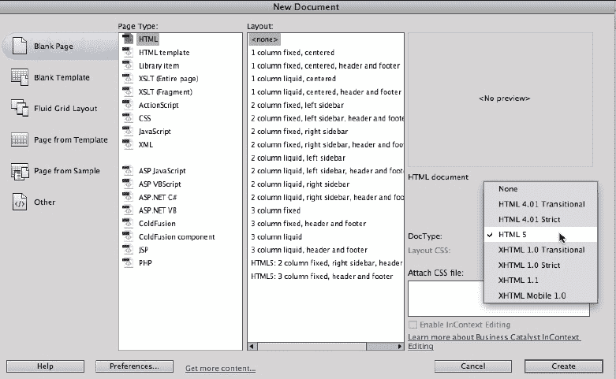

上面的屏幕截图显示了在**新建文档**对话框中生成新的 HTML5 页面。

1.  单击**创建**生成空白页面。

在**文档**窗口的**设计**视图中出现了一个空白页面。在**分割**视图中，我们可以看到生成了以下基本代码：

```js
<!doctype html>
<html>
<head>
<meta charset="UTF-8">
<title>Untitled Document</title>
</head>
<body>
</body>
</html>
```

## 分解 HTML5 页面代码

让我们快速浏览一下这个基本代码，以便了解情况。

`<!DOCTYPE HTML>`和`<html>`标签在某种程度上是 HTML 先前版本的遗留物，并不是 HTML5 浏览器实际上需要的。这段代码在考虑非 HTML5 浏览器时可能会有用，我们很快就会进行检查。顺便说一句，HTML5 的`<!DOCTYPE>`声明不区分大小写。

还有关于 HTML5 的`<!DOCTYPE>`声明的另一个有趣之处。通过告诉浏览器我们正在以 HTML5 结构化我们的内容，我们也在告诉旧版浏览器在执行规则时要更宽松一些，比如不需要在每个段落元素结尾加上`</p>`。因此，我们避免了令人讨厌和不必要的浏览器错误消息。

回到我们生成的代码：

`<head>`和`</head>`标签标记了不在页面上显示的头部内容，但作为浏览器的指令。

在这种情况下，`<head>`元素内的内容标识出当前最广泛适用的字符集**UTF-8**。这个字符集允许显示来自多种语言的字符。

我们为页面创建的所有内容都将放在`<body>`和`</body>`标签内。因此，我们在为页面创建 CSS 样式时的第一步将是为`</body>`标签定义一些基本属性。

最后，将此页面保存为 HTML 文件。选择**文件** | **保存**。在**另存为**对话框中，确保**位置**弹出窗口中选择的文件夹是您的 Dreamweaver 站点文件夹（或该文件夹内的子文件夹）。给文件命名，例如`html5_test`，然后单击**保存**。

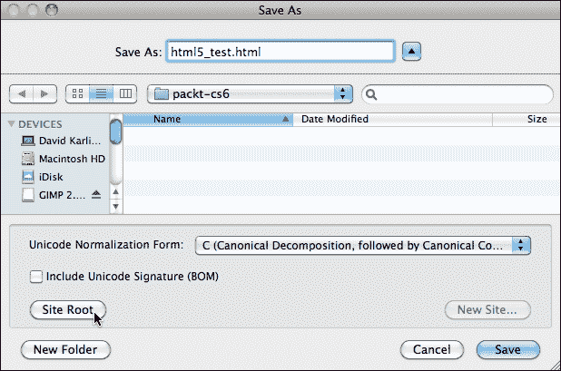

上面的屏幕截图显示了如何保存 HTML5 页面。

趁热打铁，在**文档**工具栏的**标题**框中输入一个描述性标题。定期重新保存。

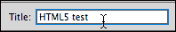

前面的屏幕截图显示了如何定义页面标题。

# 使用 HTML5 结构元素

通过使用基本的网页编码设置了我们的 HTML5 文档后，现在可以创建和格式化 HTML5 布局元素，以确定页面的外观。

基本的 HTML5 页面布局如下屏幕截图所示。它展示了页面的某种层次结构。所有内容都受到传统包装器`div`标签的限制（大小）。在其中，页面有一个页眉，一个页脚和`article`元素。`section`元素存在于`article`元素中。

还要注意，`nav`元素（包含导航内容）可以放在另一个元素内（如页眉或页脚）或在任何 HTML5 语义布局元素外。并且，`aside`元素可以放在`article`或`section`元素内。

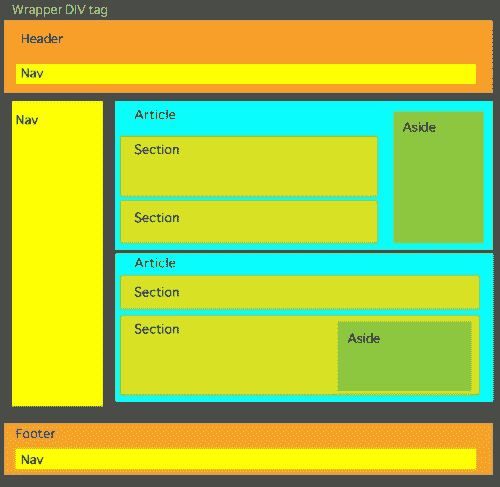

前面的屏幕截图显示了一个 HTML5 页面布局。

# 使用代码提示

我不会掩饰，Dreamweaver CS6 基本上放弃了对 HTML5 页面结构的所见即所得支持。在这个阶段，我们大多数人都使用 Dreamweaver 的**分割**视图，而 Dreamweaver 的**代码**视图（在**分割**视图中占据半个屏幕）具有有用的代码提示，可以帮助创建 HTML5 页面结构。当您在**代码**视图中开始输入 HTML5 元素时，从`<`开始，Dreamweaver 会提示您一组以您输入的字母开头的标签。例如，输入`<he`会产生代码提示，您可以从中选择**<>header**并按下*Enter*键（Windows）或*Return*键（Mac）来放置代码。

Dreamweaver 为 HTML5 语义布局元素提供代码提示，如下面的屏幕截图所示：

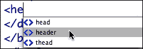

要*关闭*（定义结束）HTML5 布局元素，只需键入`</`。这样做时，Dreamweaver 会自动输入打开元素的关闭代码。

当我们在本章的其余部分中讨论定义不同的 HTML5 布局元素所涉及的编码时，您可以在**分割**视图中输入必要的代码，利用代码提示，并在**分割**视图的**设计**视图中查看结果。

# 添加页眉，导航和标题组

`<header>`元素用于组织放在页面顶部的所有内容。在`<header>`元素中，您可能会包括`<nav>`内容，如下一个屏幕截图所示。

而且，您可能会包括标准（传统）的 HTML 标签，如标题和链接。

因此，`<nav>`内容——页面顶部的链接——在放置在页面顶部时包含在`<header>`元素中。放在侧边栏中的导航元素也被包含在`<nav>`元素中，但由于在这种情况下它们不是页眉的一部分，它们没有包含在`<header>`元素中。

在`<header>`元素中，与标签（`<h1>`，`<h2>`等）或类`<div>`标签相关的 CSS 样式可以用来提供额外的格式规则，以确定内容的显示方式。

为了更容易对页眉中的内容进行分类，HTML5 包括`<hgroup>`元素。`<hgroup>`内容的正式要求是，它应该至少包括一个标题标签（`<h1>`，`<h2>`，`<h3>`，`<h4>`，`<h5>`或`<h6>`）。

这个概念是，标题内容，如副标题，替代标题或标语，都应该在页眉中进行分组以便轻松访问。例如，在下一个屏幕截图中，两行标题已经包裹在`<hgroup>`元素中。但是导航内容，虽然是页眉的一部分，但没有包含在`<hgroup>`元素中。

在下面的代码中，一个`<h1>`标题和一个`<h2>`标题，以及一个带有自己的`<h5>`标题（和三个占位符链接）的`<nav>`元素，都是`<header>`元素的一部分：

```js
<header>
<hgroup>
<h1>Page header</h1>
<h2>Header 2 </h2>
</hgroup>
<nav><h5>Navigate: <a href="#">link 1</a> | <a href="#">link 2</a> | <a href="#">link 3</a></h5>
</nav>
</header>
```

以下截图展示了这在 Dreamweaver 的**分割**视图中的样子（在**分割**视图的**设计**视图一侧打开**实时**视图）。

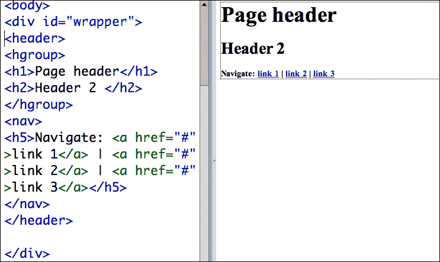

# 创建文章和章节

如果您像我一样以写作为生，您会学会将内容组织成块和子块，概念和子概念，想法和更详细的想法等等。以这种方式组织内容的基本规则是，如果您创建一个子部分，您必须创建两个子部分。否则，创建一个子部分就没有意义。

与我们在 HTML5 布局中不断重复的统一主题一致，在 HTML5 页面中，需要将内容分解时，将其分解为所谓的**文章**。而在文章内需要明确的子部分时，这些子部分就是**章节**。

当您创建一个 CSS 文件来匹配您的 HTML 布局元素时，您可能会为文章和章节指定特定的格式。例如，您可能选择缩进章节内容或在其后放置一个独特的背景。

前面示例中`<article>`和`<section>`元素的代码，包括占位文本和标题如下：

```js
<article>
<h3>First article</h3>
<p>First article content ....</p>
<p>more content....</p>
<section>
<h3>1st section heading</h3>
<p>1st section content</p>
</section>
<section>
<h3>2nd section heading</h3>
<p>2nd section content</p></section>
</article>
```

或者，您可能选择*不*对文章和章节应用特定的 CSS 规则，而只是将内容包装在`<article>`和`<section>`元素中，以便组织内容，同时依赖于`<body>`标签、`<p>`（段落）标签或您在 Dreamweaver 中定义的自定义类样式来格式化文章和章节内容。

# 添加侧边栏内容

侧边栏保留用于依赖于文章或文章部分中存在的内容的侧边栏内容。例如，`<aside>`元素并不打算作为导航内容的容器（导航内容应该由前面讨论过的`<nav>`元素标识并包装）。

鉴于侧边栏内容通常被格式化为侧边栏，与`<aside>`元素的使用通常相关联的是一种特定的样式：`Float`。CSS 的`Float`属性将容器移动到左侧（`float:left`）或右侧（`float:right`），并使其他内容围绕容器流动。当我们在本章末尾为我们的 HTML5 语义布局元素定义 CSS 样式时，我们一定会确保浮动我们的`<aside>`元素样式。

# 创建页脚

HTML5 页面布局的最后一部分通常是`<footer>`元素。与所有 HTML5 布局元素一样，`<footer>`元素有内容分配。页脚通常包括站点内容作者信息、法律声明（如版权信息）等。

# HTML5 布局模板

以下代码包含了到目前为止讨论的所有 HTML5 语义布局元素。请随意复制并粘贴到 Dreamweaver 的**分割**视图的**代码**一侧，并用它来实验和熟悉 HTML5 页面结构。

这段代码将为我们的旅程提供一个很好的基础，以便对 HTML5 元素进行 CSS 样式的实验：

```js
<!doctype html>
<html>
<head>
<meta charset="UTF-8">
<title>HTML5 test</title>
<link href="html5_layout.css" rel="stylesheet" type="text/css">
</head>
<body>
<div id="wrapper">
<header>
<hgroup>
<h1>Page header</h1>
<h2>Header 2 </h2>
</hgroup>
<nav>
<h5>Navigate: <a href="#">link 1</a> | <a href="#">link 2</a> | <a href="#">link 3</a></h5>
</nav>
</header>
<article>
<h3>First article</h3>
<p>First article content ....</p>
<p>more content....</p>
<section>
<h3>1st section heading</h3>
<aside>
<p>Sidebar content</p>
<figure>
<p></p>
<figcaption>Caption </figcaption>
</figure>
</aside>
<p>1st section content</p>
</section>
<section>
<h3>2nd section heading</h3>
<p>2nd section content</p>
</section>
<h3>Second article</h3>
<p>Second article content ....</p>
<p>more content....</p>
<section>
<h3>1st section heading</h3>
<p>1st section content</p>
</section>
<section>
<h3>2nd section heading</h3>
<p>2nd section content</p>
</section>
</article>
<footer>
<h5>Footer content </h5>
<address>Contact us at <a href="http://www.website.us" target="_blank">www.website.us</a>
</address>
</footer>
</div>
</body>
</html>
```

这个代码示例包括一个我们尚未探讨的元数据元素——`<figure>`元素。我觉得我应该把它放到代码中以保持事情的有序和简单，但现在让我们继续探索这个和其他 HTML5 元数据元素。

# 添加元数据

到目前为止，我们已经探讨的 HTML5 布局元素具有——正如我们所看到的——双重功能：它们作为可样式化的元素，可以控制内容的显示方式，并且它们为可访问性组织内容。这些 HTML5 元素可以被视为元数据。

HTML5 布局元素的样式和内容维度都在不断发展，但它们已经成为设计页面和传递内容的工具。我们之前探讨的例子，即在 iPhone 上轻松选择文章或文章部分进行复制，让人可以略知一二，这很可能在不久的将来会发展。

除了迄今为止探讨的关键布局元素之外，还值得简要注意一些 HTML5 元素，它们的主要作用是索引内容（尽管它们也可以用于应用样式）。

## 定义地址

访问网站的访客通常最先寻找的是联系信息，例如 URL（如果页面不是站点的主页）、电子邮件地址，或者如果他或她正在寻找最热门的地下俱乐部或最近的高评价的烤肉串摊，物理地址。

`<address>`元素可以放置在任何其他 HTML5 语义布局元素中，例如`<article>`元素，如果它提供了文章的作者（或主题）的联系信息。或者，如果它提供整个页面的联系信息，则可以将`<address>`元素与（放置在）`<footer>`元素相关联。

## 数字和标题

`<figure>`和`<figcaption>`元素直观地标识了一个图和一个相关的标题。再次，将这些元素分配给内容有助于内容聚合器和索引程序（如搜索引擎）解释您的页面内容并使其更易访问。您还可以使用这些元素来设置图形和/或标题的样式。

例如，`<figure>`元素可以包裹图像和标题（`<figcaption>`）。

## 指示日期和时间

说到使用 HTML5 元素传达内容，有不同的 HTML5 元素与不同类型的时间和日期信息相关联。

`<time>`元素用于标记即将到来的事件的时间和日期。它并不打算定义对日期和时间的每个引用。例如，在写历史文章时，您不会使用`<time>`元素来引用不同历史事件的日期。

`<time>`元素可用于设置特定时间，如下 HTML5 代码所示：

```js
The show starts at <time>12:00</time>.
```

或者，日期和时间信息可以在文本中使用`datetime`参数进行编码，如下行代码所示：

```js
<time datetime="2012-01-01">all night jam session!</time>
```

时间和日期的格式是：`YYYY-MM-DDThh:mm:ssTZD`，其中`TZD`是时区。

您不太可能使用`<time>`元素作为样式工具。相反，最好用于标记日期和时间。

## 为 HTML5 页面结构创建 CSS 文件

与我们的 HTML5 文件一起，设计师创建并使用 CSS 文件来组织和管理页面中的所有样式。因此，让我们现在创建该 CSS 文件，并在此过程中添加一行，使我们的 HTML5 页面与所有当前浏览器和大多数旧浏览器兼容。

要做到这一点，请执行以下步骤：

1.  导航到**文件** | **新建**，在**新建文档**对话框中，选择左侧的**空白页**类别，以及**CSS**从**页面类型**类别。单击**创建**以生成并打开新的 CSS 文件。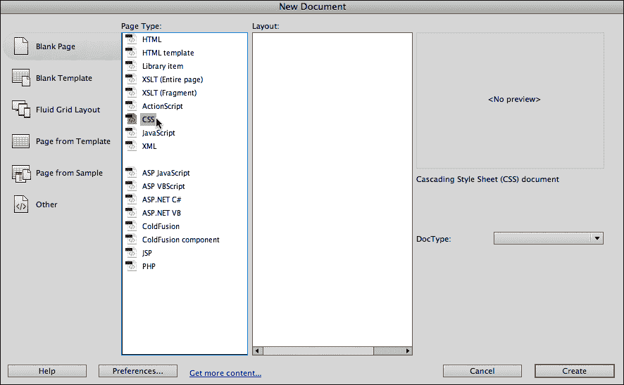

前面的屏幕截图显示了生成新的 CSS 文件。

1.  文件以**代码**视图打开。我们将在**CSS 样式**面板中对其进行编辑，因此——除了作为学习经验——我们不需要再查看此页面。但是我们需要保存它。导航到**文件** | **保存**，并给文件命名为`html5_layout.css`之类的名称。确保在**在哪里**弹出窗口中选择了站点文件夹，并单击**保存**，如下图所示：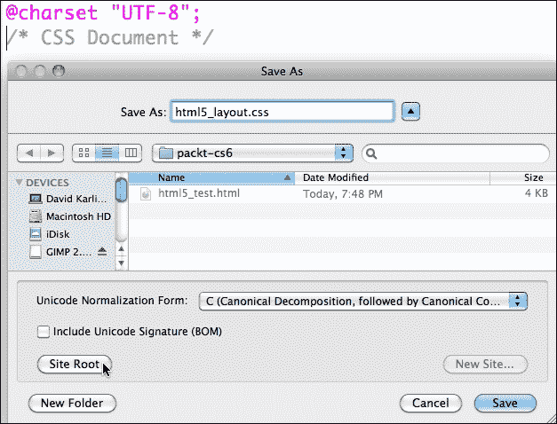

前面的屏幕截图显示了保存 CSS 文件。

1.  在文档窗口顶部的选项卡栏中，切换回您创建的 HTML 文件。

1.  查看**CSS 样式**面板（如果不可见，请导航到**窗口** | **CSS 样式**），并单击如下屏幕截图中所示的**附加样式表**图标：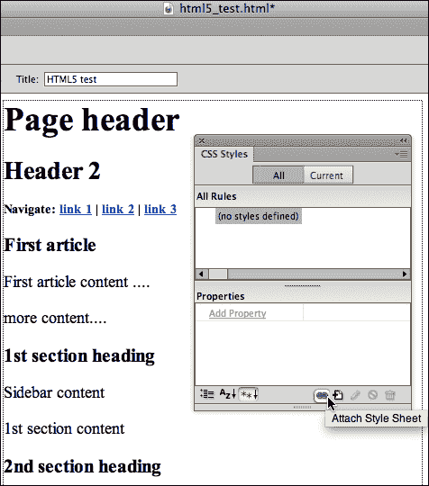

1.  **附加外部样式表**对话框出现。使用**浏览**按钮导航到刚刚创建的 CSS 文件，并单击**确定**以附加样式表。CSS 文件出现在**CSS 文件**面板中（在**CSS 样式**面板中使用**全部**选项卡作为标准，除非您正在对特定样式进行一些侦查工作，这可能需要**当前**选项卡）。您还将在**代码**视图中看到对 CSS 文件的链接。

## 分配块属性

接下来，我们将添加一个单个属性，使大多数浏览器能够解释 HTML5 元素，即使它们不符合 HTML5 标准。在这里，我们将重新访问我们在上一章中注意到的技术，即 Dreamweaver CS6 的 HTML5 布局使用`display:block` CSS 属性来防止 HTML5 布局在非 HTML5 浏览器中折叠。

要做到这一点，请执行以下步骤：

1.  单击**CSS 样式**面板底部的**新 CSS 规则**图标—它就在前面的图标所示的**附加样式表**图标的右侧。**新 CSS 规则**对话框出现。

1.  在**新 CSS 规则**对话框中，从第一个弹出菜单中选择**复合**。我们正在创建一个将应用于多个 HTML5 布局元素的规则。这些是我们希望在非 HTML5 浏览器中查看时防止折叠的 HTML5 标签。

1.  在**选择或输入选择器名称**字段中，输入`header`。实际上，我们希望将我们正在处理的规则应用于其他 HTML5 元素，但我们很快会添加这些。在对话框的**规则定义**部分，确保选择了您附加的 CSS 文件（默认情况下会选择）。单击**确定**。

1.  在**标题的 CSS 规则定义**对话框中，选择**块**类别，从**显示**弹出菜单中选择**块**，如下图所示，然后单击**确定**：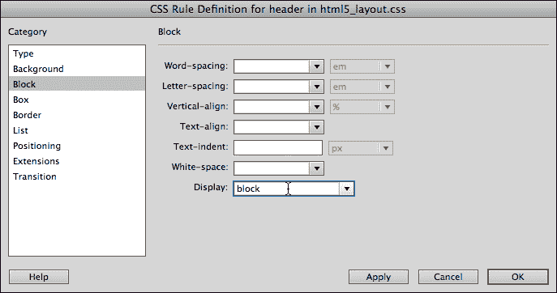

前面的屏幕截图显示了定义块显示的过程。

1.  当您展开链接到页面的 CSS 样式文件时，`header`样式将出现在**CSS 样式**面板中。您可以看到**CSS 样式**面板中与`header`样式相关联的**display**属性具有**block**属性。

1.  我们希望扩展分配给此`display:block`属性的 HTML5 元素列表。这样做的长而慢的方法是为每个额外的元素重复我们迄今为止已经遍历的步骤。要以快速简便的方式做到这一点，请在**CSS 样式**面板的上半部分的标题行中单击一次，并编辑元素列表以包括`<address>`、`<article>`、`<footer>`、`<nav>`和`<section>`元素。在输入它们时，使用逗号（","）分隔额外的元素。这些是我们希望在非 HTML5 浏览器中查看时防止折叠的 HTML5 标签。**CSS 样式**面板现在应该看起来像以下的屏幕截图：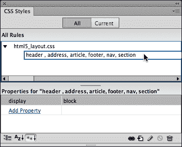

前面的屏幕截图显示了将块显示分配给多个 HTML5 语义布局标记的过程。

通过上述步骤，我们告诉大多数非 HTML5 浏览器将我们基本的 HTML5 构建块元素保持在它们自己的独立水平行中，这样它们就不会被挤在一起。

## 定义样式

我不会在这里无聊地重复在 Dreamweaver CS6 中定义链接样式表中的基本技术。我们在第一章中以一种压缩的方式进行了回顾，*使用 Dreamweaver CS6 创建站点和页面*，并且在之前的步骤中在我们的链接 CSS 文件中定义了一个（复合）样式。

简而言之，通过单击**CSS Styles**面板底部的**New CSS Rule**图标，可以向链接的样式表中添加新的 CSS 样式定义。我们将创建的所有样式都是标签类型样式，因为它们适用于 HTML5 语义元素（标签）。

您可以使用**CSS Styles**面板以这种方式定义以下样式。或者，您可以在刚刚创建的复合样式之后，将以下代码输入（或复制）到您的 CSS 样式表中：

```js
@charset "UTF-8";
/* CSS Document */
header , address, article, footer, nav, section{
  display: block;
}
header {

color: #FFF;
  background-color: #CCC;
}
footer {
  color: #000;
  background-color: #FFF;
}
article {
  color: #000;
}
aside {
  float: right;
  width: 200px;
  border: thin solid #FFF;
  background-color: #999;
  padding: 10px;
  margin: 10px;
}
figure {
  background-color: #CCC;
  margin: 10px;
  padding: 10px;
  float: right;
  width: 160px;
  height: 180px;
}
section {
  padding: 0px;
}
```

### 注意

关于我们创建的 CSS 的一些说明：我们使用非常简约的背景和文本颜色（灰色调加上白色和黑色），既是为了表达极简主义的审美观点，也是为了保持我们的项目简单。

`<aside>`元素上的`float`属性将侧边栏框与页面的右侧对齐，使内容围绕在其右侧。额外的填充和边距同时强制实现了侧边内容与框的边框之间以及框本身与围绕它的内容之间的间距。

同样，分配给`<figure>`元素的`float`和`margin`属性将使包含图像和标题的框与页面的右侧对齐。

将文章部分的`margin`设置为零可以防止内容进一步缩进，超出从`<article>`和`<section>`元素分配的边距继承的缩进。

# 解决 HTML5 兼容性挑战

在撰写本书时，HTML5 仍在不断发展。这意味着什么？从历史的角度来看，这意味着 HTML5 的标准仍在系统化，尽管已经达到了一个临界质量，大多数 HTML5 术语的含义和影响已经得到了广泛认可，浏览器要么支持 HTML5，要么正在朝着这个方向发展。

对于开发人员来说，这意味着当我们探索使用 HTML5 的节省时间和减轻压力的功能来构建网页时，我们必须意识到并补偿一些浏览器不支持 HTML5 的一些方面。

主要是支持顽固的 Internet Explorer 社区，特别是被微软抛弃的较旧版本的 IE 用户，微软并未为大多数用户提供升级选项。

为了不让这些用户无法访问 HTML5 页面，开发人员采用了 HTML5 Shiv 脚本，并将其链接到设计师的链接。这个 JavaScript 允许 IE8 识别 HTML5 的语义结构标签。

要将 HTML5 Shiv JavaScript 添加到页面中，请在页面的`<head>`元素中插入以下代码：

```js
<!--[if lt IE 9]><script src="img/html5.js"></script><![endif]-->
```

# 总结

在本章中，我们探讨了在 Dreamweaver 中使用 HTML5 语义布局元素来构建页面。我们看到这些元素既可以作为设计容器，也可以作为内容标识符。我们还看到，对于一些环境来说，整个页面可以仅使用一些基本的 HTML 标签加上 HTML 布局元素来构建。

在下一章中，我们将探讨 Dreamweaver CS6 强大的工具，用于生成经过验证的表单。
