# 第三章：使用表单收集数据

在现代网络中由 Facebook 主导的世界中，数据收集变得高度不透明。当您在社交媒体上分享有关一个垂危朋友的亲密想法时，那些敏感的个人数据就变成了一个商品，被售给了花店和书店的营销人员，当您在社交媒体环境中*赞*一个乐队时，您（往往是不知情的）注册了在该乐队在您所在城市或镇附近演出时获取门票优惠的服务，等等。

我对在线“注册”技术的不透明度进行了严厉批评，以表明一个观点。作为建立自己网站的人，您可以选择使数据收集变得自愿、有意识和透明。有意识地为您的电子通讯、公告、特别优惠等注册的人，毕竟更有可能比那些不是有意识要求的人更愿意接收您的邮件，而这些邮件是由他们在 Facebook、亚马逊等平台上的活动生成的。

那么，您如何从访客那里收集信息呢？一个词：**表单**。表单可以是与访客互动的重要、动态的方式。

以下是一些表单为您的网站增值的示例：

+   一个让访客在您的网站上分享他们的投诉、建议和积极经历的反馈表单（这是您用来推广您的网站、信息、产品、事业或内容的素材）。

+   一个让访客有意识地获取您的通讯、推文、特别优惠和信息爆炸的注册表单。

+   一个销售产品的订单表格。

+   一个让您网站内容易于访问的搜索框。我将在本章末尾向您展示如何设置搜索框。

Dreamweaver CS6 具有强大的工具，用于构建引人入胜、易于访问的表单。我在 Dreamweaver 中一直觉得缺少的是一种将这些表单连接到后端服务器工具的方法，这些工具处理提交的数据。虽然对这些连接的全面探讨略微超出了本书的范围，但我将在本章末尾提供一些基本解决方案和有关连接表单到后端数据管理脚本和资源的其他工具和资源的提示。

# 使用 JavaScript 捕获客户端表单管理

Dreamweaver 生成表单，但不管理表单数据。通常，从表单收集的数据会发送到服务器，那里一系列脚本和数据库将这些数据转换为已处理的订单、提交的投诉、电子邮件列表注册或搜索查询。在服务器上处理数据的脚本有时被称为**服务器端脚本**。

但是，有些表单数据是在不发送到服务器的情况下收集和管理的。相反，提交的数据是使用在用户浏览器中运行的 JavaScript 来管理的。由此类客户端脚本处理的数据永远不会发送到服务器。

最广泛使用的客户端表单是**跳转菜单**——用于导航的下拉菜单。Dreamweaver 允许您轻松生成跳转菜单，在探索向服务器发送数据的构建表单之前，让我们快速看一下如何在 Dreamweaver 中构建客户端跳转菜单，并编辑生成的使表单工作的 JavaScript。

## 创建跳转菜单

在创建跳转菜单之前，您需要准备一个您希望使用该菜单访问的 URL 列表。我会暂停一会儿，让您收集您的列表...好了？这是一本书，所以您可以简单地将这个地方加为书签（在您的 Kindle 或 iPad 上很容易做到，但如果您在读印刷书籍，只需稍微折弯一下页面即可标记这个地方）。

除了构思跳转菜单，您在生成菜单之前需要具备以下条件：

+   您需要在一个定义好的 Dreamweaver 网站中工作。如果这不是您熟悉的，可以回到第一章，*使用 Dreamweaver CS6 创建网站和页面*，并深入了解 Dreamweaver 网站的概念以及为什么它是您在 Dreamweaver 中进行的一切工作的基本第一步。

+   您需要在已保存的网页中工作。

在 Dreamweaver 站点和已保存的 HTML5 页面中工作，可以确保在跳转菜单中生成的任何链接都能正常工作。

准备好列表、定义站点并保存页面后，执行以下步骤在 Dreamweaver CS6 中创建跳转菜单：

1.  在页面的**设计**视图中，选择**插入** | **表单** | **跳转菜单**。**插入跳转菜单**对话框将打开。

1.  对话框打开时，第一个菜单项被选中。通常，跳转菜单中的第一项不是选项，而是标签，用于标识菜单，例如**转到...**。在这种情况下，**当选中时转到 URL**字段为空，如下面的屏幕截图所示：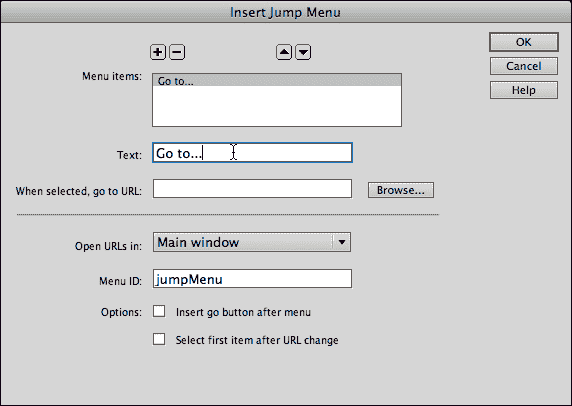

1.  使用**添加项目**（**+**）图标将项目添加到菜单中。使用**浏览...**按钮在 Dreamweaver 站点中搜索并添加文件链接。或者，在**当选中时，转到 URL**字段中输入完整的 URL，如下面的屏幕截图所示：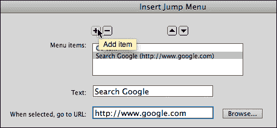

1.  使用**添加项目**（**+**）图标将其他项目添加到菜单中。使用**删除项目**（**-**）图标删除所选项目，如下面的屏幕截图所示：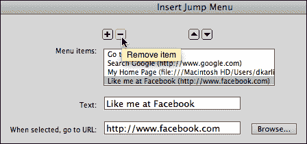

1.  使用**将项目上移**和**将项目下移**箭头按钮重新排列列表的顺序（是否按字母顺序排列？），如下面的屏幕截图所示：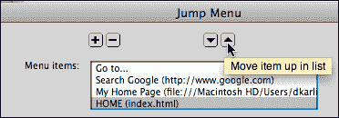

1.  完成定义跳转菜单后，点击**确定**生成菜单。您可以在**实时**视图中测试菜单，如下面的屏幕截图所示：

## 编辑跳转菜单 JavaScript

Dreamweaver 提供两种编辑生成的跳转菜单内容的方式——**属性**检查器和**行为**面板。让我们快速看看每种方法的工作原理。

要激活**属性**检查器，如果它不可见，导航到**窗口** | **属性**。当单击任何元素（包括跳转菜单）时，**属性**检查器将成为一个上下文敏感的编辑工具。在这种情况下，**最初选择**下拉菜单允许您更改菜单中默认显示的选项，**列表值...**按钮打开**列表值**对话框。**列表值**对话框具有您从跳转菜单对话框中识别的工具，用于添加、删除和重新排序菜单选项，如下面的屏幕截图所示：

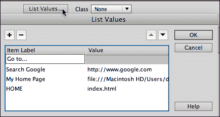

编辑跳转菜单内容的另一种技术不太容易访问，但提供了使用**浏览**按钮在 Dreamweaver 站点中定位并链接到文件的选项。要访问该选项，选择**窗口** | **行为**，并在**文档**窗口的**设计**视图中单击跳转菜单，如下面的屏幕截图所示：

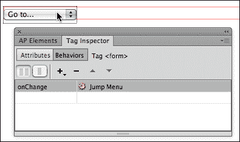

在**行为**面板中选择跳转菜单（技术上来说，是**标签检查器**选项卡中的**行为**选项卡），在右侧列中双击**跳转菜单**，以重新打开**跳转菜单**对话框。此选项可以在跳转菜单上进行全功能编辑，基本上是复制原始的**跳转菜单**对话框。

快速浏览了基于 JavaScript 的表单以及如何在 Dreamweaver 中编辑它们，让我们转向更强大的表单类型——将数据发送到服务器的表单。

# 定义表单和表单操作

表单由表单和表单元素组成。**表单元素**是将所有表单元素收集起来并发送到某个地方的信封。因此，表单最重要的定义元素是表单操作。**表单操作**定义了表单数据发送的位置。

正如本章前面提到的，Dreamweaver 为表单设计了前端，但没有提供易于访问的选项来将表单数据链接到收集和管理该数据的后端系统。

### 注意

请注意，Adobe 提供了一个用于管理服务器端数据的软件包——**Business Catalyst**。Business Catalyst 的工具和功能对非专业的后端管理员来说并不特别易用，对于大多数自由职业者和小规模开发人员来说，这项服务的成本与其他管理表单数据的选择不具竞争力。

在本章结束时，我将提供一些捕获表单数据的基本技术，并指向其他资源。但在这里，让我们使用处理表单数据的最简单和最基本的技术：将表单数据发送到用户的电子邮件客户端的电子邮件地址。这不是一种优雅的技术，但是 a）它有效，并且可以用于更简单的表单处理挑战，比如收集反馈；b）它将作为表单处理的一种占位符，直到我们在本章结束时回到这个概念。

执行以下步骤插入一个将收集的内容发送到用户的电子邮件客户端的表单：

1.  单击打开的已保存文档的**设计**视图，设置表单将出现的位置。

1.  导航到**插入** | **表单** | **表单**。

1.  单击**确定**嵌入表单。表单将以红色框的形式出现在**设计**视图中。当您选择表单（单击红色框）时，**属性**检查器将显示表单属性，如下图所示：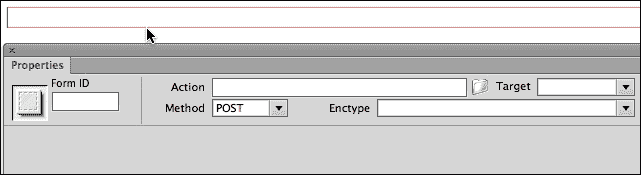

1.  要将表单数据发送到电子邮件地址，请在**Action**字段中输入`mailto:mail@mail.com`，将实际的电子邮件地址替换为占位符电子邮件地址。

1.  在**Enctype**字段（编码类型的缩写）中输入`text/plain`。

1.  将**Method**选项保留为默认的**POST**。这是大多数表单数据的发送方式。

有了定义的表单，现在可以添加表单字段和按钮了。

# 使用 Spry 验证生成表单字段

**验证**意味着在提交到服务器（或发送到电子邮件地址）之前测试表单数据。这是一件有价值的事情。例如，如果您的表单收集电子通讯订阅的电子邮件地址，人们提交表单而没有电子邮件地址是不行的。除此之外，验证可以查看输入到电子邮件地址字段中的字符，并验证该字段中的内容至少看起来像是一个电子邮件地址。

基本上有三种验证表单数据的技术，如下：

+   服务器端脚本可以在数据发送到服务器后验证内容。

+   HTML5 提供了一些验证工具，但它们甚至在一些流行浏览器的更新版本中也没有得到普遍支持。

+   JavaScript 验证脚本可以在浏览器中测试数据。

最后一个选项是在 Dreamweaver 中创建的最可靠、最快速、最简单的方式。在接下来的步骤中，我们将使用 Dreamweaver 的 Spry JavaScript 和 HTML 库插入具有内置 JavaScript 验证的字段。

## 创建一个经过验证的文本字段

文本字段是表单的基础，收集各种文本，如姓名、电话号码、帐号、地址和电子邮件地址（稍后会详细介绍）。

### 注意

冒着听起来非常冗余的风险，让我再次强调在定义的 Dreamweaver 站点和保存的 HTML 文件中创建经过验证的字段的重要性。现在这一点尤为重要，因为我们正在生成将链接到我们页面的 JavaScript 文件，如果这些链接损坏，表单将无法工作。

文本字段最常见的验证类型是将其设置为*必填*。执行以下步骤在表单中插入一个必填文本字段：

1.  导航到**插入** | **表单** | **Spry 验证文本字段**。将显示**输入标签可访问性属性**对话框。

1.  **ID**字段生成与表单字段相关的 ID 样式。此属性用于使某些环境中的表单对残疾人更具可访问性，并且还允许您定义适用于表单字段的 ID 样式。输入一个没有空格或特殊字符的 ID 样式。

1.  **标签**字段生成一个标签，用于标识字段，并且易于残疾网站用户使用的软件读取。输入一个标签（标签可以包含特殊字符和空格），如下图所示。对话框中的其他字段可以保持默认设置，因此单击**确定**，如下图所示，生成表单：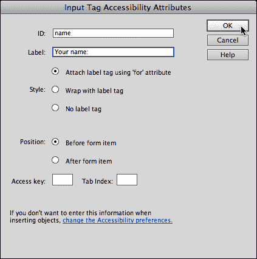

1.  可以通过单击**设计**视图中的表单字段本身并在**属性**检查器中进行编辑来定义表单字段属性。在**字符宽度**字段中输入一个值，以定义字段将显示的宽度（以字符为单位）。在**最大字符**字段中输入一个值，以定义用户可以在字段中输入的最大字符数，如下图所示：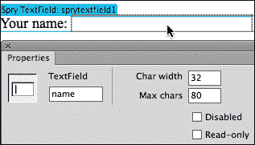

1.  通过单击字段上方的（水绿色）**Spry TextField**选项卡来定义验证规则。默认情况下，我们的**名称**字段是必填的。您可以通过在**最大字符**或**最小字符**字段中输入最大或最小字符数来添加验证规则。并且，默认情况下，当用户提交表单时，字段会进行验证。您还可以通过选中**模糊**和**更改**复选框来在用户离开字段时强制验证（这两个选项在不同的浏览环境中实现类似的功能）。

1.  您可以通过在**预览状态**下拉列表中尝试不同选项来预览字段对有效或无效输入的响应。预览下方的区域显示了用户在未填写必填字段的情况下尝试提交表单的结果，如下所示：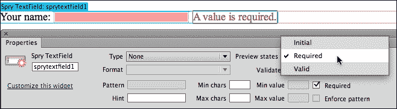

1.  在定义字段和验证规则后，单击**设计**视图中表单字段末尾放置插入点，并按*Enter*或*Return*键创建新的表单字段的新行。

## 创建经过验证的电子邮件字段

创建经过验证的电子邮件字段与创建文本字段类似，只是您将设置验证规则以检测（并且仅接受）看起来像电子邮件地址的输入。

要做到这一点，单击电子邮件地址表单字段的（水绿色）**Spry TextField**选项卡，并从**属性**检查器中的**类型**下拉菜单中选择**电子邮件地址**。并且，在**属性**检查器的右侧选择**强制模式**复选框，如下图所示：

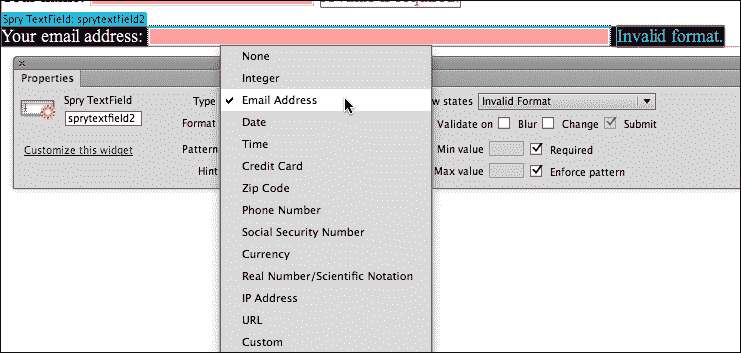

从**类型**下拉列表中的选项可以看出，Dreamweaver 可以为不同类型的文本输入生成一整套验证脚本，从电话号码到信用卡。

## 添加其他字段

**插入** | **表单**中的子菜单包括生成其他类型的经过验证的表单字段的选项。其中最重要的是：

+   **复选框**: 用于*是或否*选择，用户可以选择或取消选择选项。

+   **选择**: 用于在表单中创建带有选项的下拉菜单。

+   **单选按钮组**: 用于创建用户只能选择一个选项的选项集。例如，允许用户选择一种（仅一种）信用卡类型。

这些额外的经过验证的表单字段在我们讨论文本字段选项时已经很明显。它们在下面的屏幕截图中有所说明（从上到下：复选框、选择菜单和单选按钮组）：

## 添加提交和重置按钮

没有**提交**按钮，用户输入的内容实际上不会去任何地方。表单中的**提交**按钮会启动表单操作。因此，如果我们在这里应用形式逻辑的规则，最好确保我们的表单有一个**提交**按钮。

通过导航到**插入** | **表单** | **按钮**来添加一个**提交**按钮。**输入标签可访问性属性**对话框将出现，但只需单击**确定**，以创建**提交**按钮，而不必担心此对话框中的选项。表单上将出现一个**提交**按钮。

**重置**按钮很方便，但并非必需。它们将表单“重置”为其原始（空）状态。要创建**重置**按钮，请插入第二个按钮。在表单中选择该按钮，然后在**属性**检查器中选择**重置表单**单选按钮，如下截图所示：

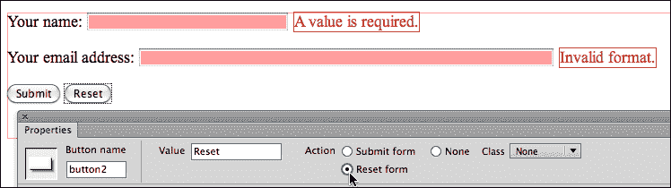

# 使用 HTML5 提示

正如本章前面提到的，浏览器对 HTML5 表单元素和属性的支持仍在进行中。因此，我建议不要使用对表单工作至关重要的 HTML5 表单属性，例如验证属性。

但 HTML5 占位符是一个好主意。它们在表单字段内部用文本提示用户，随着用户输入内容，文本会消失。如果用户的环境不支持 HTML5 表单占位符，他们仍然可以依靠表单标签来帮助他们弄清楚要输入到表单字段中的内容。

可以向文本输入添加占位符参数。不幸的是，Dreamweaver CS6 在**设计**视图中没有定义占位符文本的选项，但我们可以在**代码**视图中进行。要做到这一点，请执行以下步骤：

1.  从 Dreamweaver 的**文档**窗口中选择**分割**视图。

1.  在**分割**视图的**设计**侧面点击表单字段，以在**分割**视图的**代码**侧面找到代码，如下截图所示：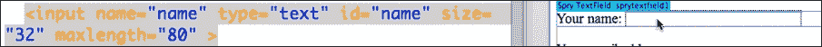

1.  在`input`标签的末尾添加`placeholder="占位符文本"`（用真实文本替换“占位符文本”），如下截图所示：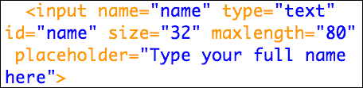

您可以在**实时**视图中预览占位文本，在**分割**视图的**设计**侧面。

# 为表单设计 CSS

在本书的前两章中，我们建立了一个框架，依赖外部 CSS 样式表文件为 HTML 元素（如标题、段落和链接）提供格式，并提供可以应用于`div`标签以设计页面的特殊 ID 和类样式。

这个原则如何适用于自定义表单输入？简短的答案是：您可以为不同的表单元素创建样式。长答案是：好吧，我们现在将逐步介绍如何做到这一点。

以下是可以应用 CSS 样式以自定义表单外观的关键 HTML 元素：

+   `<form>`元素样式定义了整个表单的外观。

+   `<input>`元素样式定义了输入字段（如文本字段）的外观。

+   可以为具有与其关联的 ID 的样式定义特定的 ID 样式（这是我们在本章前面讨论过的一种技术，当我向您展示如何在**输入标签可访问性属性**对话框中为文本字段分配 ID 时）。

## 为表单元素创建样式表

让我们逐步介绍在新的链接 CSS 文件中定义每个样式的过程。我们将其命名为`form.css`。

1.  与往常一样，从已保存的 HTML 页面开始，在定义的 Dreamweaver 站点中查看**CSS 样式**面板（**窗口** | **CSS 样式**）。单击面板底部的**新建 CSS 规则**（**+**）图标，如下截图所示：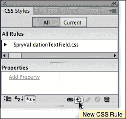

### 注意

请注意，如果您正在使用包含 Spry 验证小部件的表单，您的**CSS 样式**面板将链接到定义这些小部件元素的 CSS 文件，用于为验证错误消息的背景颜色和字体等样式。

1.  在**新建 CSS 选择器规则**对话框中，选择以下内容：

+   从**选择器类型**下拉列表中选择**标签**

+   从**选择器名称**下拉列表中选择**form**

+   从**规则定义**下拉列表中选择**(新样式表文件)**

1.  点击**确定**开始定义新文件和样式，如下图所示：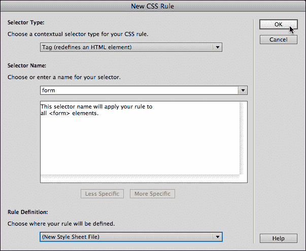

1.  在**另存样式表文件为**对话框中，点击**站点根目录**按钮，将文件保存在 Dreamweaver 站点的根文件夹中。在**另存为**字段中输入`form.css`。点击**保存**。**CSS 规则定义**对话框出现。

1.  您可能希望为表单样式定义背景颜色。在**CSS 规则定义**对话框的**背景**类别中执行此操作（从**背景颜色**样本中选择颜色）。

1.  您还可以为表单定义宽度，以限制其不要延伸到整个页面（或包含元素）的宽度。在**框**类别的**宽度**字段中输入宽度（例如 600 像素）。此外，在**框**类别中，尝试为表单定义 10 像素的填充和 10 像素的边距。

1.  尝试为表单定义边框。您随时可以点击**CSS 规则定义**对话框中的**应用**按钮来测试您的样式，如下图所示：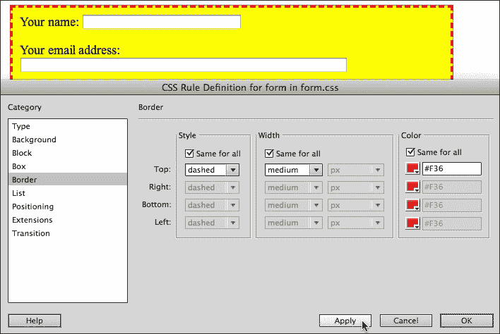

1.  在**CSS 规则定义**对话框中微调表单样式后，点击**确定**保存并应用您的样式。

1.  导航到**文件** | **全部保存**以保存您的网页和带有更改的 CSS 文件。

## 为表单元素创建样式

与为`<form>`元素定义样式的方式相同，您可以为`<input>`元素创建新样式。唯一的区别是，一旦您为表单创建了 CSS 文件（`form.css`），您将希望将所有与表单相关的样式保存到该 CSS 文件中。我将为您提供以下步骤：

1.  切换到**文档**窗口中的**实时**视图，以更准确地预览您即将定义的样式。

1.  点击面板底部的**新建 CSS 规则**（**+**）图标。**新建 CSS 选择器规则**对话框打开，选择以下内容：

+   从**选择器类型**下拉列表中选择**标签**

+   从**选择器名称**下拉列表中选择**输入**

+   从**规则定义**下拉列表中选择`form.css`

1.  点击**确定**开始定义新样式。

1.  **CSS 规则定义**对话框出现。您可以继续进行-为输入字段定义样式属性，并点击**应用**以查看它们在**设计**视图中的外观，如下图所示：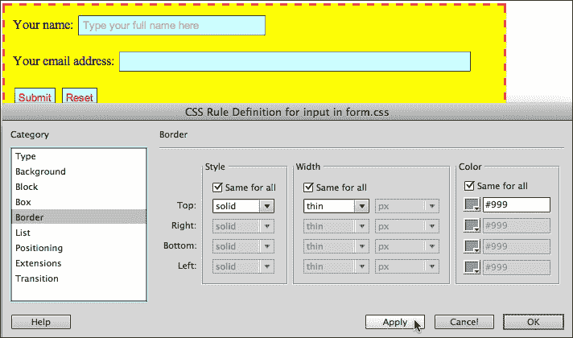

1.  为输入字段定义样式后，点击**确定**。

## 为表单创建 ID 样式

到目前为止，我们创建的样式适用于元素的每个实例。例如，我们的表单样式属性（背景颜色，宽度等）将适用于每个表单。我们的输入样式属性适用于每个输入元素（名称和电子邮件字段以及提交和重置按钮）。

如何定义仅适用于特定元素的样式？一种技巧是使用与我们生成 Spry 验证字段时创建的字段相关联的 ID。

执行以下步骤，使用 ID 样式为我们生成的 ID 元素之一创建 ID 样式：

1.  点击面板底部的**新建 CSS 规则**（**+**）图标。**新建 CSS 选择器规则**对话框打开，选择以下内容：

+   从**选择器类型**下拉列表中选择**ID**

+   从**选择器名称**下拉列表中选择**名称**

+   从**规则定义**下拉列表中选择**form.css**

1.  点击**确定**打开**CSS 规则定义**对话框。

1.  为**name** ID 元素定义自定义样式，通过单击**应用**来测试您的样式，如下截图所示：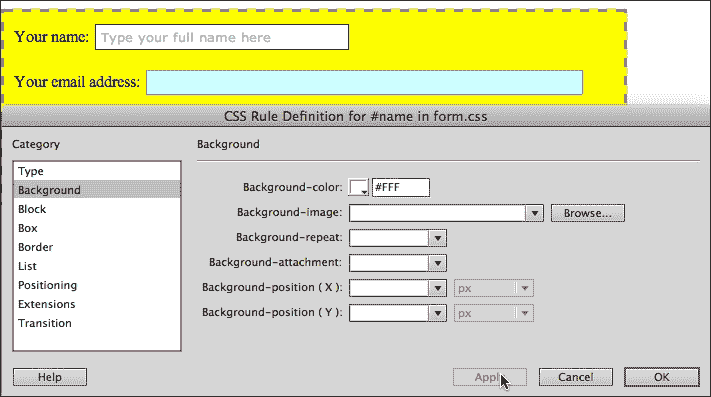

1.  单击**确定**以定义**name** ID 元素的样式。

1.  导航到**文件** | **全部保存**以保存对 HTML 和 CSS 文件的更改。

## 对表单样式的思考

在我们在这里探索的框架中，我们正在使用我们自己设计的表单。在“现实生活”中，特别是在更复杂的专业项目中，表单的 HTML 将由构建后端脚本和管理表单输入的数据库的团队提供。

但我想强调的是，您仍然可以创建自定义 CSS 文件和样式，以自定义这些表单的外观。因此，您从 Google 获取的搜索引擎的表单 HTML，从[www.TheSiteWizard.com](http://www.TheSiteWizard.com)获取的用于管理反馈的表单 HTML，以及从电子商务插件包获取的表单 HTML，都可以使用您自己的 CSS 进行自定义。通过这种方式，表单可以集成到您为网站打造的吸引人的外观和感觉中。

# 真实世界的表单处理

虽然我强调 Adobe 没有提供一个可访问且价格合理的管理表单数据的框架，但有大量在线资源，其中许多是免费的，可以轻松插入 Dreamweaver 网站。在结束本章之前，我想通过一个**FreeFind 框**的示例来引导您。

我选择了这个例子，因为很少有网站不使用搜索框，而且安装（和自定义）Freefind 搜索框是免费且非常简单的。

为了使其工作，您只需要一个托管在远程服务器上的实时网站。设置其中一个有点复杂。有关如何执行此操作的建议，请参阅本书的第一章中的*定义远程站点*部分，*使用 Dreamweaver CS6 创建站点和页面*。

以下一系列步骤借鉴了本章早些时候介绍的技术，因此，如果您直接跳到本书中的这一点来安装搜索框，最好先跳到本章的开头了解表单和表单样式的基础知识。

因此，在这种情况下，执行以下步骤将搜索框添加到您的网站：

1.  导航到**文件** | **新建**，并通过执行以下步骤创建一个将容纳您的搜索框的新页面：

1.  在**新建文档**对话框的左侧列中，选择**空白页面**。

1.  在**页面类型**列中选择**HTML**。

1.  在**布局**列中选择**<none>**。

1.  单击**创建**以生成新页面。

1.  在**文档**工具栏的**标题**区域中，键入`搜索本站点`

1.  将页面保存在名为`search.html`的站点根文件夹中。

1.  使用**CSS 样式**面板中的**附加样式表**图标将`form.css`样式链接到此页面。您将使用本章早期为注册表单创建的相同一组样式。

1.  在浏览器中，转到[www.freefind.com](http://www.freefind.com)。要注册搜索框，请执行以下步骤：

1.  输入您的姓名，电子邮件，并单击**即时注册**按钮。您将收到发送到您电子邮件地址的登录信息。

1.  使用发送到您电子邮件地址的登录信息登录到您的 FreeFind 帐户。登录过程将直接带您到您的搜索框的**控制**窗口。

1.  FreeFind 提供价格合理且无广告的选项，但您可以使用免费版本来尝试表单和样式，因此无需订阅任何特殊计划。

1.  单击**控制**窗口中的**HTML**选项卡，如下截图所示：

1.  要复制并粘贴搜索框的 HTML，请执行以下步骤：

1.  为了保持简单，我们将使用搜索框的第一个选项，**1.网站搜索框-带有高级搜索选项的链接**。

1.  单击该选项下方的链接，该链接显示**获取 HTML 并将其粘贴到您的页面中**。HTML 显示在一个框中，如下面的屏幕截图所示：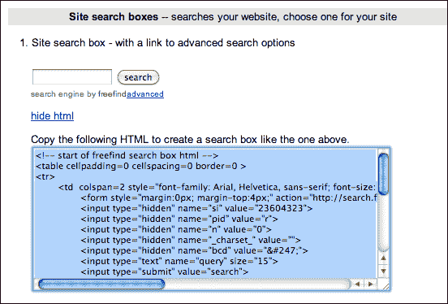

1.  单击代码内部，并将其复制到剪贴板。

1.  切换回您打开的 Dreamweaver HTML 文件（`search.html`）。在**拆分**视图的**代码**视图中，单击以在`<body>`标签的末尾放置插入点，然后按*Enter*或*Return*键创建新的代码行。

1.  粘贴来自 FreeFind 的复制 HTML，并在**设计**视图的**拆分**视图的**实时**视图中查看结果，如下面的屏幕截图所示：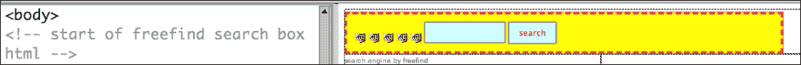

1.  FreeFind 代码中充斥着表格格式。如果愿意，您可以在**拆分**视图的**代码**视图中删除该代码，或者只是接受它。但更重要的是，您可以使用我们在本书中探讨过的**属性**检查器和其他编辑技术来自定义表单。我让您将本章作为我们所涵盖内容的实际应用，并且作为加强您对格式化表单的信心和技能的“测试”来审查。

+   将搜索字段的宽度更改为 48 个字符，最大字符更改为 60

+   添加此占位文本：`搜索字符串在此处`

+   添加重置按钮

+   只要您不更改表单字段名称或删除它们（包括在浏览器中不显示但允许 FreeFind 搜索框功能的隐藏表单字段），您可以编辑表单的 HTML 和 CSS，如下面的屏幕截图所示（在**实时**视图中）：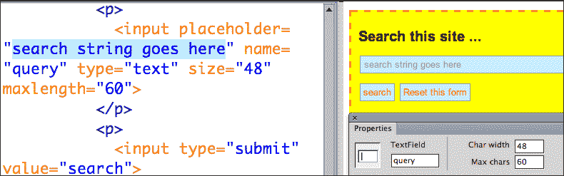

+   通过使用您的`form.css`样式表，您可以使 FreeFind 搜索框看起来和其他网站中的表单感觉一样。

FreeFind 示例比您从第三方获取的一些表单要简单。但是生成表单的基本技术，将该表单粘贴到 Dreamweaver 中，编辑表单 HTML（不删除或重命名任何表单字段），并应用自定义样式... 这对于您从任何地方获取的任何表单都适用。

# 总结

在本章中，我们探索了 Dreamweaver CS6 用于生成经过验证的表单的强大工具。为此，我们调用了 Spry 框架-一组小部件，它结合了 HTML、CSS 和 JavaScript，以将不同类型的交互应用于网页。在本书的后面几章中，我们将多次回顾 Dreamweaver CS6 中的 Spry 小部件集。

我们还学会了使用 Dreamweaver 生成的 JavaScript 创建一个简单的跳转菜单。因此，从不同的方向，我们开始探索 Dreamweaver 与表单相关的 JavaScript 功能。

然后，我们超越了 Dreamweaver 对表单的处理-具体是向具有提示文本的字段添加占位符属性。我们不得不进入**代码**视图来做到这一点，因为 Dreamweaver 对 HTML5 的新属性的支持很少。

最后，您通过一个真实的示例来连接表单与后端脚本和数据库系统。FreeFind 搜索示例相对简单，但它包含了您需要处理的所有元素，以便将任何后端服务器提供的表单嵌入 Dreamweaver CS6 站点。在这方面，我想强调自定义 CSS 在使嵌入的表单看起来和感觉像我们网站的其余部分中的动态作用。我们将在下一章中更深入地讨论 CSS 格式。
