# 第四章：应用 CSS3 效果和变换

CSS3——样式表的当前版本——提供了轻松访问效果的途径，如投影阴影、圆角盒和不透明度（透明度）。此外，CSS3 引入了改变对象形状、位置、旋转和大小的变换。CSS3 效果和变换共同打开了网页更具动态性、更具吸引力、更少“盒子感”和更具互动性的大门。

通过改变对象的外观，使效果和变换可以在用户悬停或点击鼠标时变得交互。效果和变换，无论是否有动画，都比以前的工具更容易地为网页添加可访问的、引人注目的设计元素和动态效果。

CSS3 效果和变换是通过样式表定义的；因此，我们可以利用 Dreamweaver 的**CSS 样式**面板，避免大量手工编码来创建它们。

在本章中，我们将探索以下内容：

+   定义和应用 CSS3 变换：平移、缩放、旋转和倾斜

+   定义和应用 CSS3 效果：边框半径、阴影和不透明度

+   组合多个变换和效果

+   通过`:hover`伪类使 CSS3 变换和效果具有交互性

# CSS3 中的新效果和变换

CSS3 效果，如阴影、圆角和不透明度，可以使网页更时尚、更温和、更具吸引力。当适度使用时（即不过度使用），它们可以使网页更具吸引力。

效果和变换可以，而且通常应该，结合起来产生引人注目的元素。例如，下面的文本既应用了倾斜变换，又应用了阴影效果：

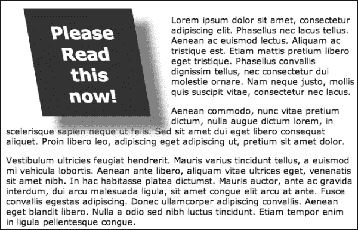

过渡效果，如倾斜、旋转、缩放和平移（移动）对象，当与互动结合时尤其引人注目。例如，访问网站的访客在悬停在一个对象上时会感受到它的微妙而诱人的变化。

在 CSS3 之前，这些效果或过渡需要一些组合编码，并通过依赖（和编程）JavaScript 和用 Photoshop 效果替换图像（如阴影或轮廓）来嵌入 Flash 对象。这些其他工具是昂贵的，或者学习曲线很高。

在本章的过程中，我们将探索几种新的效果和 CSS3 中的新 2D（二维）变换。3D 变换超出了我们的调查范围；它们在浏览环境中的支持不如 2D 变换广泛，并且通常需要额外的脚本（通常是 JavaScript）才能使其生效。

本章的大部分内容将介绍如何创建特定的 CSS3 效果和变换。

## 兼容性挑战

CSS3 效果和过渡广泛支持，无需插件（如 JavaScript 或 Flash）。

另一方面，重要的是要强调 HTML5 和 CSS3 功能都还在不断发展中。在寻找描述浏览器中对 CSS3 支持状态的公式时，我遇到了“不规则标准化”的公式。我意识到这是个矛盾修饰法，但我的意思是，本章中创建的 CSS3 效果和变换在所有主要浏览器的当前版本中都得到支持（是的，这包括 Internet Explorer 9 以及桌面和移动版的 Safari、Firefox 和 Opera）。

然而，Safari、Firefox 和 Opera 都需要独特的代码前缀。例如，应用`rotate`变换以逆时针旋转一个盒子五度的类样式的 CSS3 代码可能如下所示：

```js
rotate {
  transform: rotate(-5deg);
  -webkit-transform:rotate(-5deg);
  moz-transform:rotate(-5deg);
  o-transform:rotate(-5deg);
}
```

`-webkit-`前缀适用于 Safari 和其他遵循 WebKit 标准的浏览器（顺便说一句，这包括 Dreamweaver CS6 的**实时**视图）。`-moz-`前缀适用于 Mozilla Firefox。`-o-`前缀适用于 Opera 浏览器。通用的变换代码适用于“其他所有人”，包括不需要浏览器前缀来解释这个（或其他）效果的 Internet Explorer 9。

标准化编码的缺乏并不像看起来那么严重。在定义和应用效果和变换时，只需要一点冗余。

那么像较旧版本的 Internet Explorer 这样不支持 CSS3 效果和变换的浏览环境呢？对于这个挑战有一个简单的解决方案和一个困难的解决方案。困难的解决方案是拼凑 JavaScript 和其他编码解决方案，这些解决方案可以在网上找到，或者被设计用来模拟 CSS3 不支持的效果和变换。也就是说，您可以回到在 CSS3 出现之前需要使用的工具和技术，比如 JavaScript 和 Flash。

在大多数情况下，更简单、更明智的解决方案是以不需要浏览器支持效果的方式应用变换和效果，以便访问者吸收页面内容。例如，看看下面的屏幕截图中使用`border-radius`效果创建的圆角矩形：

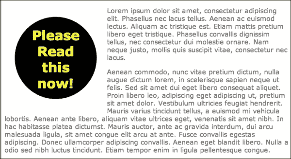

如果有人使用较旧版本的 Internet Explorer，如 IE6，访问前面示例中的页面，他们将无法看到文本呈现为圆形（由`border-radius`效果定义）。体验不是那么吸引人，但他们仍然可以阅读文本，如下面的屏幕截图所示：

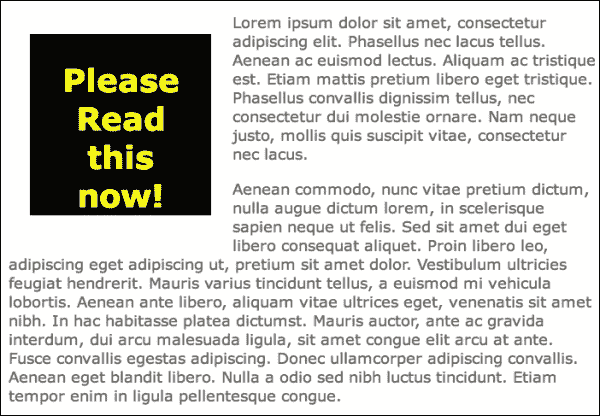

在深入研究*如何*应用变换和效果之前，让我们先反思一下使用这些 CSS3 功能来格式化我们到目前为止预览的示例所涉及的优势。在创建这些效果时，没有创建、伤害、虐待或更糟的 Flash 或 JavaScript。所需的只是一些 CSS 代码，我们在 Dreamweaver 的**CSS 样式**面板中生成。

也不需要使用“图像文本”，即保存为图像的文本，来创建这些效果。页面几乎可以立即加载，无需等待图像下载。在没有插件或图像的情况下，形状和格式几乎可以立即下载，而无需浏览器处理插件或下载的图像。

最后，文本仍然是*可选择*的。这意味着已应用变换或效果的文本仍然可以复制并粘贴到地图程序、日历事件中，或者作为文本链接进行选择，如下面的屏幕截图所示：

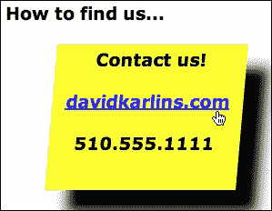

## Dreamweaver CS6 中的 CSS3 样式

Dreamweaver CS6 提供了一些功能来定义和应用这些新的 CSS3 功能。虽然不是 Dreamweaver 中最强大的工具，但它们确实可以在不借助编码的情况下创建和应用新的 CSS3 技术。在编码是必要的情况下，Dreamweaver 通过代码提示来帮助。

在生成 CSS3 变换和效果时，基本上有两种选择：

+   如果我们在**代码**视图中输入 CSS 代码，Dreamweaver 将通过提供代码提示来帮助编码。例如，下面的屏幕截图显示了在**代码**视图中输入`-moz-tran`后提供的代码提示。样式表的代码提示提供了对`transform-`属性的简单访问。

### 注意

**冗余的 CSS 代码**

前面的屏幕截图显示了定义和应用 CSS3 变换和效果的一个持续维度的重要部分。您必须创建四个版本的代码，一个用于 Webkit（Safari），一个用于 Mozilla（Firefox），一个用于 Opera（在欧洲拥有大量用户的浏览器），以及一个通用版本（没有浏览器前缀），被 Internet Explorer 9 识别。我们将在本章中不久回到这个挑战。

+   另一个选项是在**CSS 样式**面板中生成 CSS3 效果和变换。这样做的缺点是，这些新的 CSS3 样式规则不会显示在**CSS 规则定义**对话框中，这通常是在 Dreamweaver 中定义 CSS 样式的最用户友好和直观的环境。

但是，您可以通过**CSS 样式**面板底部的**添加属性**链接输入 CSS3 效果和变换。Dreamweaver CS6（或安装了 HTML5 包的旧版本）将根据您在**CSS 样式**面板中输入的样式规则和参数生成 CSS 代码。通过这个选项，Dreamweaver 至少会在您尝试输入无效的 CSS3 规则时“破坏”您，如下面的屏幕截图所示（在下面的示例中，我应该输入`-moz-transform`，然后在**CSS 样式**面板的右侧列中定义**skew**变换）。

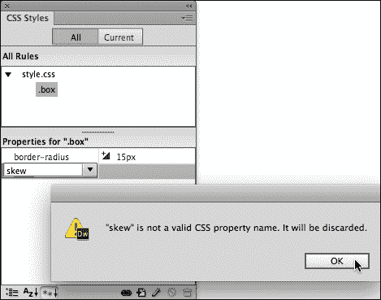

让我们坦率地说一会儿。在**代码**视图中依赖代码提示或使用 Dreamweaver 的**CSS 样式**面板这两种选项都无法达到我们在生成 CSS3 样式之前从 Dreamweaver CS6 获得的帮助水平。我们假设 Adobe 的人员正在像其他人一样努力赶上当前和新兴的网页设计工具。

我将让你决定使用哪种有用但有缺陷的技术来定义 CSS3 效果和样式，并且我将在本章的其余部分中说明这两种技术。

# CSS3 效果

正如已经指出的，对 CSS3 效果和变换的支持是不规则的，仍在进行中。在这个框架内，四种可用的变换（`scale`，`translate`，`rotate`和`skew`）相对稳定并得到广泛支持。然而，效果的支持不一致，也不像有一个在各种浏览环境中支持的可用效果的“列表”（尽管有独特的编码前缀）。

部分原因是许多效果非常灵活。例如，`text-shadow`效果可以调整以产生轮廓类型。有时，您会听到人们提到“轮廓”效果，他们指的是调整`text-shadow`效果的参数以创建轮廓类型，如下面的屏幕截图所示：

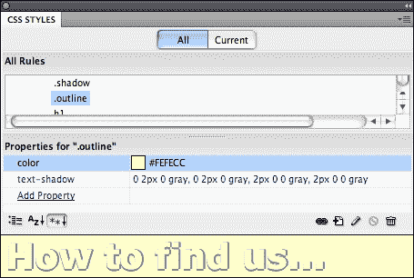

根据迄今为止关于 CSS3 效果的灵活和开放性质的讨论，让我们来看看三种最有用的效果：`opacity`，`border radius`和`shadow`（用于框和文本）。

## 定义不透明度

CSS3 中的`opacity`效果允许您对对象应用不同程度的不透明度/透明度。语法如下：

```js
opacity:x;
```

在前面的语法中，`x`是介于零和一之间的值。完全不透明（值为`1`）是正常的 - 应用不透明度的对象就像覆盖在其他所有东西上的盖子。完全透明（值为`0`）会使对象变得不可见。不透明度值为`.6`会使对象 60%不透明，依此类推。

尽管前面已经警告过，CSS3 效果必须针对不同的浏览器进行特定定义，但`opacity`效果是一个*不需要*为识别目标浏览器添加前缀的效果。

### 注意

**简单还是复杂**

使用 CSS3，实现不透明度（透明度）非常简单，或者说是无望的复杂，这取决于一个人的目标是什么。使用不透明度来创建一组具有各自分配的不透明度的各种元素的复杂叠加对象需要复杂的编码，并且并非所有浏览器都支持。

不透明度可以应用于标签（例如，定义图像如何显示的``标签）。更有效的是定义应用不透明度的类样式的技术。您可以通过以下步骤来实现：

1.  在**CSS 样式**面板中，单击面板底部的**新 CSS 规则**图标，启动**新 CSS 规则**对话框。从**选择器类型**弹出菜单中选择**类**，输入名称（不要有空格或特殊字符——**semi_opaque**会起作用），并从**规则定义**弹出菜单中选择您的外部样式表。然后单击**确定**。

1.  **CSS 规则定义**对话框会打开。遗憾的是，正如之前讨论的那样，CSS3 效果无法在**CSS 规则定义**对话框中定义。因此，只需单击**确定**，在此阶段创建一个没有属性的新 CSS 规则。然而，新规则将出现在**CSS 样式**面板中，我们将在那里定义不透明度设置。

1.  在**CSS 样式**面板中选择您新创建的类样式后，单击**CSS 样式**面板底部的**添加属性**链接。在第一列中键入`opacity`，然后按*Tab*键移动到第二列。在第二列中，键入介于`0`（完全透明）和`1`（完全不透明）之间的值。例如，值`.5`定义了 50%的透明度，如下图所示：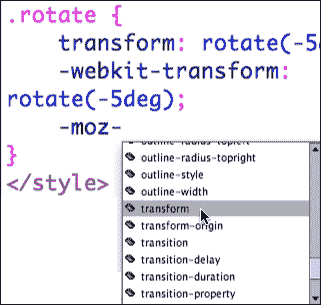

定义了类样式后，您可以通过从**属性**检查器中选择类样式，将其应用于所选对象（例如图像）。

定义 CSS 类样式后，您可以通过**属性**检查器中的**类**下拉菜单将其应用于任何所选元素，如下图所示：

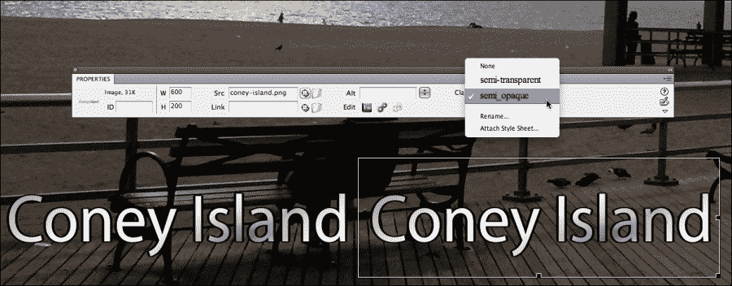

您可以在不同的浏览器中测试不透明度效果。虽然不是所有浏览器都支持不透明度，特别是旧版本的浏览器，但通常情况下，如果它起作用，它可以增强页面，但如果它不起作用，也不会丢失任何基本内容。以下截图显示了图像上方的文本。左侧的文本显示为完全不透明。右侧的文本显示为部分透明，允许访问者在文本后面看到一些页面背景。

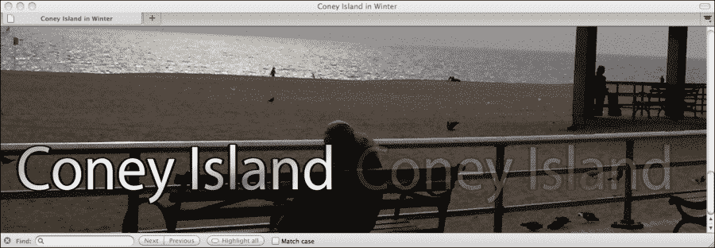

## 边框半径

CSS3 `border-radius`效果用于定义圆角。

让我们立即进入一个示例，应用一个类样式，将 12 像素半径的圆角应用于一个 150 像素的正方形框，并在其周围应用黄色背景和粗实红线。在之前讨论创建应用不透明度效果的类样式时，我们使用了在**CSS 样式**面板中构建类样式的技术。这很有效，因为不透明度效果非常简单。在这里，让我们在 CSS 样式表中构建样式。假设您已经将外部样式表链接到 Dreamweaver 中打开的网页，您可以将以下代码添加到 CSS 文件中来定义`border-radius`类样式：

```js
.box {
  background-color: yellow;
  height: 150px;
  width: 150px;
  border: thick solid red;
  -webkit-border-radius: 12px;
  -moz-border-radius: 12px;
  border-radius: 12px;
}
```

我们在这里使用的代码使用`-moz-`前缀来支持 Firefox。以下截图显示了这个类样式应用于 Dreamweaver 中所选文本：

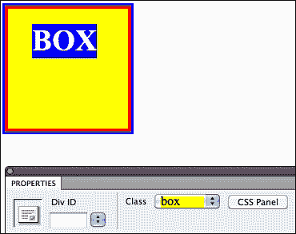

在浏览器中，前面的图像看起来像下面的截图：

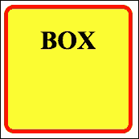

一个有趣的技巧是尝试创建一个受影响的圆，使圆角半径值等于正方形框的高度（和宽度）的一半。下面的示例显示了效果，值从前面示例调整，使圆角半径为 75 像素，是原始正方形尺寸定义的一半。

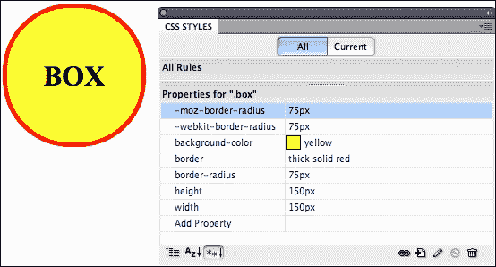

## 阴影

投影阴影可能是图形设计中应用最广泛的效果。不要引用我说的话，但阴影确实是许多设计中无处不在的元素；现在，使用 CSS3 可以轻松地将它们应用于选定的对象。

有两种不同的阴影效果：`box-shadow`和`text-shadow`。它们的应用非常直观；`box-shadow`应用于框，`text-shadow`应用于文本。

`box-shadow`和`text-shadow`效果都可以用至少两个参数定义：x 偏移（垂直距离）和 y 偏移（水平距离）。除此之外，它们通常包括一个颜色（如果未指定颜色，则会出现浏览器默认颜色）和一个模糊参数（模糊渐变的厚度）。

x 和 y 偏移值可以是正数或负数。正值在文本右侧生成阴影，而负值在文本左侧生成阴影。对于 y 偏移值，正值在文本下方生成阴影，而负值在文本上方生成阴影。通常以像素为单位定义数值。

在检查这对框、文本和轮廓的作用之前，有必要注意*多个*阴影定义可以组合。例如，如果您希望在文本的下方*和*上方生成阴影（当您定义轮廓样式时会想要这样做），您可以组合两个甚至三个阴影定义，并将它们叠加在一起。

### 框阴影

如前所述，`box-shadow`效果通常用四个参数定义：偏移-x（水平距离）、偏移-y（垂直距离）、模糊（像素宽度）和阴影的颜色。

例如，以下代码定义了一个框阴影，水平和垂直偏移为 5 像素，模糊长度为 5 像素，灰色阴影，并且对于五种不同的浏览器，即 Chrome、Safari、Firefox（使用未加前缀的代码）、Internet Explorer 9 和 Opera。

```js
.shadow {
  -webkit-box-shadow: 5px 5px 5px gray;
  -moz-box-shadow: 5px 5px 5px gray;
  box-shadow: 5px 5px 5px gray;
}
```

在**CSS 样式**面板中看起来是这样的（您可以在**CSS 样式**面板中定义类样式）。

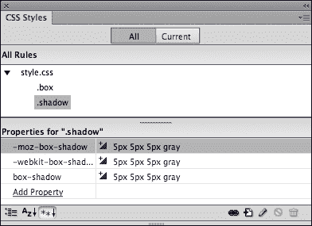

### 文本阴影

`text-shadow`效果与`box-shadow`效果非常相似，只是应用于文本而不是框。而且，不像需要特殊前缀的`box-shadow`效果，`text-shadow`效果不需要供应商前缀。

`text-shadow`效果的参数与`box-shadow`效果的参数相同，您需要定义四个值：x 偏移、y 偏移、模糊距离和颜色。不需要创建三个版本的效果，以下 CSS 代码可以用于定义一个文本阴影，水平和垂直偏移为 5 像素，模糊值为 5，颜色为灰色：

```js
.text_shadow {
  text-shadow: 5px 5px 5px gray;
}
```

前面示例中的`text-shadow`效果设置产生了以下效果：

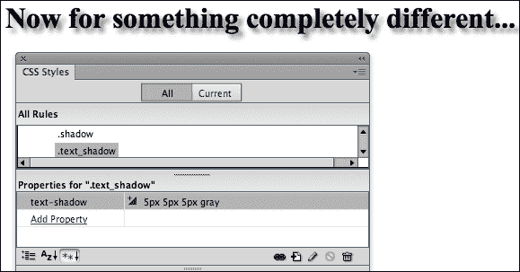

### 创建文本轮廓

正如本章前面提到的，"文本轮廓"效果并不存在。但是使用`text-shadow`效果可以应用文本轮廓的方法。通常，这涉及将"轮廓"类型的文本颜色与页面背景匹配，然后定义一个特别细的黑色"阴影"，完全没有模糊，看起来像是轮廓。

创建有效的轮廓效果需要堆叠额外的定义参数，以便在应用样式的文本上方和下方以及右侧和左侧堆叠非常细的“阴影”。例如，当应用于白色页面背景上的文本时，以下类样式组合（堆叠）了三组不同的参数以创建轮廓效果。

```js
.outline {
text-shadow: 0 1px 0 black, 0 -1px 0 black, 1px 0 0 black, -1px 0 0 black; 
color: white;
}
```

这是在浏览器和**CSS 样式**面板中的效果。

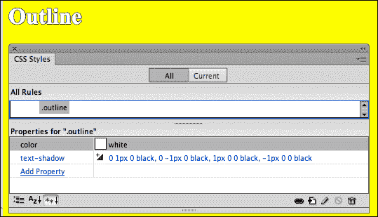

### 提示

基本上，前面的代码生成了文本下方的一个细（1 像素）“阴影”，文本下方的第二个“阴影”，以及文本上方的一个（1 像素）厚的“阴影”。要获得更厚的轮廓，可以将像素值统一增加到 2 像素。

# CSS3 转换

四个 CSS3 转换`scale`（调整大小）、`translate`（移动）、`rotate`和`skew`被应用于选定的内容作为*效果*。也就是说，它们改变了对象的显示或外观，但没有改变它们的基本属性。

这些转换使得可能呈现文本或图像的扭曲，而在 CSS3 出现之前，通常是通过图像来完成的——通过使用文本图像来呈现那些扭曲、旋转或缩放的文本。

与其超出我的书面沟通能力的极限，不如利用以下图示来说明这四个转换：

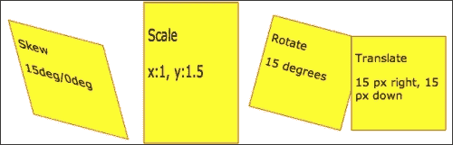

## 何时使用转换

`skew`和`rotate`转换可用于以引人入胜和独特的方式呈现文本或图像，同时保持用户选择（复制、粘贴、点击等）*文本*的能力。`translate`转换可用于将一个内容块放在另一个内容块上方（如前面的示例所示）。`scale`转换可用于拉伸或调整类型或图像。

### 提示

**图像重叠时**

当两个`<div>`标签重叠时，出现在前面的将是 z-index 值最高的一个。您可以在**CSS 样式**面板中设置 z-index。

在许多情况下，这些效果可以作为交互式动画很好地工作，访问者可以通过将鼠标悬停在对象上来触发变换。我们将探讨这种技术作为本章的最后一个元素。

与本章早些时候探讨的 CSS3 效果一样，过渡效果可以应用于各种标签，例如标题标签（`<h1>`、`<h2>`等）和图像（使用``标签）。或者更典型的是，定义类样式以应用这些过渡效果。

## 如何在 Dreamweaver CS6 中生成过渡编码

在检查定义转换所需的相对基本的语法之前，让我们重新审视我在本章早些时候试图激起的有关如何充分利用 Dreamweaver CS6 有限但有用的 CSS3 代码生成工具的两种可能方法的争议。

回顾和扩展选择：您*不能*在**CSS 规则定义**对话框中定义转换，但可以通过这种方式应用 CSS2（更早）样式——例如背景颜色、字体定义等规则。但是，在 Dreamweaver 的**CSS 规则定义**对话框中，我们将徒劳地搜索`skew`、`scale`、`transform`或`rotate`。因此，以下两个选择仍然存在：

+   在**分割**或**代码**视图中直接输入 CSS 文件中的 CSS 代码

+   使用**CSS 样式**面板的有限资源来定义转换

我会让你回到本章早些时候更详细的讨论中，逐步介绍如何在正在使用的 CSS 文件中输入代码或使用**CSS 样式**面板定义样式。但是这里有一个新因素需要检查：在**CSS 样式**面板中，您在定义转换参数方面会得到比在本章早些时候探讨的效果（如阴影）更多的帮助。

以下是额外帮助的工作方式：在向 **CSS 样式** 面板中的样式添加规则时，如果在 **CSS 样式** 面板底部输入其中一个变换选项（`-webkit-transform`，`-moz-transform` 或 `-o transform`），Dreamweaver 会在面板的第二列中提供一个弹出式帮助，其中包含各种变换选项，如下截图所示：

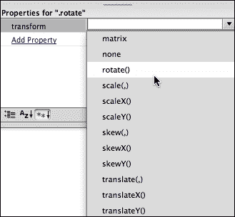

最重要的是，你必须决定哪种环境更适合你生成 CSS3 变换代码。在本章的其余部分探索特定的变换时，我会透露我的选择（只需在 **代码** 视图中输入代码）。但特别是当你开始熟悉 CSS3 变换代码时，你可能会发现 **CSS 样式** 面板中的弹出式帮助很有用。

## 使用缩放进行调整

缩放由两个参数定义，即 x 和 y。x 值定义了要增加的宽度（或者使用负值减少），y 值应用于高度。通常是乘数，因此 2 的值 = 200%，表示将尺寸加倍，而 .5 的值 = 50%，表示将尺寸减少到原始值的一半。

以下代码行应用了一个 `scale` 变换，使对象的宽度保持不变，但高度增加了 50%：

```js
  -webkit-transform: scale(1,1.5);
  -moz-transform: scale(1,1.5);
  -o-transform: scale(1,1.5);
transform: scale(1,1.5);
```

以下是一个类样式的示例（称为 `.scale`），它包含了前面的代码，并定义了一个类样式，生成一个 125 像素的正方形框（在重新调整大小之前），可以进行缩放：

```js
.scale {
  height: 125px;
  width: 125px;
  background-color: yellow;
  -webkit-transform: scale(1,1.5);
  -moz-transform: scale(1,1.5);
  -o-transform: scale(1,1.5);
   transform: scale(1,1.5);
  float: left;
  margin: 15px;
  padding:5px;
  border:1px solid #F00
}
```

### 注意

**浮动框**

在这个示例中，`float` 属性允许我们将一堆这样的框或类似的框排成一行。

## 使用 `translate` 移动

`translate` 变换将对象从页面上的位置移动。如前所述，这可以是一个有效的技术，使框，包括可选择文本的框，在页面上重叠。

`translate` 变换的语法与 `scale` 变换类似，不同之处在于第一个参数，即 x 值定义了对象向右移动的距离（如果使用负值，则向左移动），y 值定义了对象向下移动的距离（如果使用负值，则向上移动）。通常以像素为单位定义数值。

这是我们在前一节中作为 `scale` 变换示例使用的相同类样式，但是使用 `translate` 变换设置将对象向左移动 35 像素，向下移动 15 像素：

```js
.translate {
  height: 125px;
  width: 125px;
  background-color: yellow;
  transform: translate(-35px,15px);
  -webkit-transform: translate(-35px,15px);
  -moz-transform: translate(-35px,15px);
  -o-transform: translate(-35px,15px);
  float: left;
  margin: 15px;
  padding:5px;
  border:1px solid #F00
}
```

## 应用旋转

`rotate` 变换可能是最简单的定义方式——只有一个称为旋转角度的参数。这个角度可以是正的（顺时针旋转）或负的（逆时针旋转）。

旋转对象 15 度顺时针的代码示例如下：

```js
  transform: rotate(15deg);
  -webkit-transform:rotate(15deg);
  -moz-transform:rotate(15deg);
  -o-transform:rotate(15deg);
```

以下是一个旋转对象 15 度的类样式示例，与我们之前使用的示例的大小和其他属性相同：

```js
.rotate {
  height: 125px;
  width: 125px;
  background-color: yellow;
  transform: rotate(15deg);
  -webkit-transform:rotate(15deg);
  -moz-transform:rotate(15deg);
  -o-transform:rotate(15deg);
  float: left;
  margin: 15px;
  padding:5px;
  border:1px solid #F00
}
```

### 注意

**注意 - 为旋转（和扭曲）留出空间**

当你旋转一个对象（或者，我们将看到，如果你扭曲它），对象将与附近的对象重叠。通常情况下（除非这种重叠是设计的一部分），这可以通过向对象样式添加足够大的外边距值来解决。

## 创建扭曲转换

`skew` 变换可能由两个用逗号分隔的参数定义。第一个参数定义了 x 轴（水平）以度为单位的变换，第二个值定义了垂直扭曲。如果你在两个轴中的一个上使用零作为值，结果将是一个平行四边形，如下截图所示：

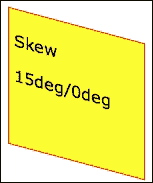

以下是一个类标签的代码示例，应用了黄色背景、红色边框和我们之前示例的其他属性，将对象在框的轴上扭曲 15 度：

```js
  transform: rotate(15deg);
  -webkit-transform:rotate(15deg);
  -moz-transform:rotate(15deg);
  -o-transform:rotate(15deg);
```

以下是一个类样式的示例，将对象旋转 15 度，与我们之前使用的示例的大小和其他属性相同：

```js
.skew {
  height: 125px;
  width: 125px;
    background-color: yellow;
  transform: skew(15deg,15deg);
  -webkit-transform: skew(15deg,15deg);
  -moz-transform: skew(15deg,15deg);
  -o-transform: skew(15deg,15deg);
  float: left;
  margin: 25px;
  padding:5px;
  border:1px solid #F00;}
```

## 其他 CSS3 变换效果

除了我们在本章中探讨过的 CSS3 的二维（2D）变换效果之外，还有其他三维变换正在不断发展的支持状态。总的来说，除了 WebKit 集（SafariLimit）之外，一般没有任何浏览器支持它们，据我所知，目前它们并不适用于没有额外 JavaScript 来对其进行动画处理。

话虽如此，请继续关注。CSS3 变换的世界是一个不断运动和发展的世界，3D 变换可能会得到更广泛的支持，并且对开发者来说更加易用。

## 复合变换

您可以将多达四个变换组合成一个单一的变换规则。例如，要创建一个应用`skew`（在 x 和 y 轴上各 5 度）、`scale`（在 x 和 y 轴上各 1.5 倍）和`rotate`（45 度）的变换，以适用于 WebKit 浏览器的前缀，您可以使用以下代码：

```js
-webkit-transform: skew(5deg,5deg) scale(1.5, 1.5) rotate(45deg);
```

由于变换往往会对对象应用相当激进的改变，而且`skew`和`rotate`会产生类似的效果，因此在单个对象中结合多个变换的美学和可访问性是有限的，但是可以实现。

# 互动效果和变换

在调查和走过创建和应用 CSS3 效果和变换的过程之后，我们现在转向这些新样式特性中最激动人心、最动态的方面之一：**互动性**。

所谓互动性，是指页面上的对象或元素对访问者的操作做出自己的反应。访问者悬停在一个对象上，该对象移动、调整大小、旋转、倾斜、产生阴影、变得半透明，或者经历其他一些变化。

有两种基本技术可以将互动性与效果和变换结合起来。一种是使用 JavaScript 并编写或生成与变换和效果相结合的代码。将 JavaScript 与效果和变换相结合可以是一种非常强大的技术，用于创建例如使用 Flash 可以生成的互动性。

另一种更加易用的技术是利用广泛支持且易于使用的`:hover`伪类。如果您熟悉为链接定义“悬停”状态的操作，当悬停在链接上时链接会呈现出独特的外观，那么您大致了解这将如何工作。我们将在接下来的章节中更详细地讨论这一点。

## 使用 JavaScript 的效果的限制

使用 JavaScript 创建互动效果和变换存在一些明显的限制，这超出了我们在本书中可以讨论的范围。首先，为了实现这种方法，需要了解 JavaScript，虽然这方面的知识可以在厚厚的书籍、大量的在线资源以及付费工具中获得，但这远远超出了我在本章甚至本书中可以涵盖的范围。此外，JavaScript 并不在所有浏览环境中得到普遍支持，而 HTML5 和 CSS3 的吸引力在于，通过适当考虑非 HTML5 环境，本书中探讨的几乎所有内容都将在任何浏览环境中工作，或者至少不会对任何浏览环境造成伤害。

Dreamweaver 的被低估但也被支持不足的用于生成 JavaScript 的工具，行为面板，不支持 CSS3 效果和变换，因此在结合 JavaScript 效果和变换方面目前还是无能为力的。

我们已经部分列举了结合 JavaScript 与 CSS3 效果和变换的缺点（和优点），因为您可能会在网络上遇到开发者在探索 CSS3 的前沿并将他们的工作与 JavaScript 结合的示例、模型和讨论。

## 使用`:hover`伪类进行互动

然而，还有一种更加易用的工具可以应用互动效果和变换：`:hover`伪类。

伪类是 CSS 修饰符，根据对象的状态定义网页对象的外观。它们最为人所知，并且最广泛地应用于链接的修饰符。

例如，网页上的未访问链接默认显示为蓝色下划线，访问过的链接显示为紫色下划线，活动链接显示为红色下划线。这些参数可以在 Dreamweaver 的**CSS 样式**面板中轻松更改。而且，它们在每个现代浏览器中甚至在旧版浏览器中都受到支持。

但除了`:visited`和`:link :active`伪类样式（伪类），还有另一种更动态的状态叫做`:hover`。这种可定义的状态适用于访问者在页面上悬停鼠标的任何东西。

通过将效果和变换应用于对象的悬停状态，您可以使其以一种定义的方式与访问者的鼠标操作进行交互。

## 在 Dreamweaver 中制作 CSS3 变换

现在让我们详细了解 CSS 变换和效果是如何与`:hover`伪类一起工作的。

基本概念是，你为希望在悬停时进行变换的对象定义一个`:hover`伪类。这个对象可以是 HTML 标签（如``）或`<div>`标签（类或 ID）。

例如，对于``标签，CSS 文件中的这行代码将定义一个`scale`变换，当悬停在图像上时，将高度和宽度增加 10%：

```js
img:hover  {
  -webkit-transform: scale(1.1,1.1);
}
```

或者举个例子-一个 div 标签-以下代码将导致一个名为`.box`的类样式容器在悬停时旋转 45 度：

```js
.box:hover {
  -webkit-transform:rotate(45deg)
}
```

产生以下效果：

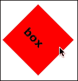

# 示例-创建动画效果和变换

这个配方创建了一个类样式框，可以在页面上重复使用，当悬停时显示 CSS3 效果和 CSS3 变换。因此，这是一个易于适应的配方-您可以使用本章中的信息来替换我们将在配方中使用的不同效果和变换。

在我们的特定情况下，当悬停在盒子上时，我们将应用圆角并稍微放大盒子。

## 将各个部分放在适当的位置

在深入了解这个配方之前，您需要做好以下准备：您需要定义一个 Dreamweaver 网站。跳转到第一章*使用 Dreamweaver CS6 创建站点和页面*，并回顾那里有关创建 Dreamweaver 网站的讨论和步骤。

有了你定义的网站，你准备好了！我们需要的一切都在 Dreamweaver CS6 中。让我们首先设置我们需要的文件：

1.  导航到**文件**|**新建**以打开**新建文档**对话框。在**类别**列中选择**空白页面**，在**页面类型**列中选择**HTML**，在**布局**列中选择**<none>**。从**文档类型**弹出窗口中，选择**HTML5**。此时**附加 CSS 文件**框应为空白。定义新文件后，点击**创建**以创建一个新的空白 Dreamweaver 页面。

1.  在**文档**工具栏的标题区域输入`悬停`。导航到**文件**|**保存**并分配一个文件名。让我们使用`hover.html`文件。

1.  接下来，我们将创建包含我们将使用的样式的 CSS 文件-特别是 CSS3 效果和变换样式。导航到**文件**|**新建**。**新建文档**对话框打开。

1.  在**页面类型**类别中选择**CSS**，然后点击**创建**按钮。保存 CSS 文件；使用文件名`hover.css`。打开一个空白的 CSS 页面。

1.  选择 HTML 文件。您可以在 Dreamweaver **文档**窗口顶部的文件选项卡中执行此操作。或者为了避免任何可能的混淆（因为我们打开了两个名称相似的文件），点击**窗口**菜单，然后点击`hover.html`文件。

1.  在 HTML 页面中（您可以在三个视图中的任何一个中，但**设计**视图效果很好），导航到**窗口**|**CSS 样式**以显示**CSS 样式**面板（如果该面板不可见）。

1.  点击**CSS 样式**面板底部的**附加样式表**链接图标，并导航到并链接`hover.css`样式表文件。空白的样式表文件将出现在**CSS 样式**面板中。您可以看到到目前为止我们已经定义的所有元素，此时您的屏幕应该看起来像下面的屏幕截图所示：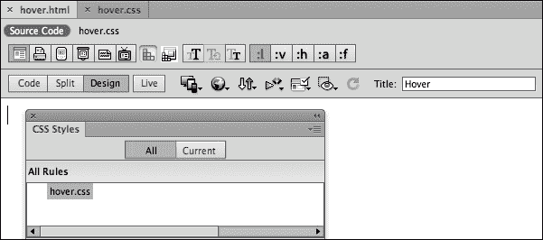

1.  点击**CSS 样式**面板底部的**新建 CSS 规则**图标，打开**新建 CSS 规则**对话框。从**选择器类型**弹出菜单中选择**类**，在**选择器名称**框中键入`box`。在**规则定义**区域，如果尚未选择`hover.css`，请从**规则定义**弹出菜单中选择它。点击**确定**打开**hover.css 中.box 的 CSS 规则定义**对话框。

1.  在**CSS 规则定义**对话框的**背景**类别中，选择浅色背景颜色（如黄色）。在**框**类别中，应用以下规则，如下面的屏幕截图所示。但是不要点击**确定**！我们将接下来定义一个边框。

+   **宽度**：**200** **像素**

+   **高度**：**200** **像素**

+   **浮动**：**左**

+   **填充**：**25**（全部）

+   **外边距**：**50**（全部）

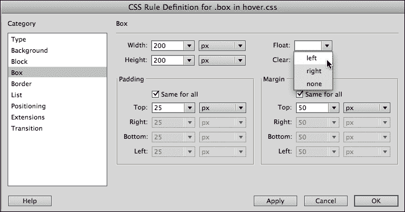

### 注意

**关于设置的说明**

我们正在创建一个 200 像素的正方形框，这是一个很好的大小，可以容纳侧边栏消息或图片和标题。我们将其浮动到左侧，以便其他内容可以在右侧围绕框进行包裹。大外边距和填充为可能扩展框或影响附近元素的空间提供了足够的灵活性。

1.  接下来，让我们创建一种有趣的边框。在**CSS 规则定义**对话框的**边框**类别中，将边框定义为虚线、粗、红色，如下面的屏幕截图所示。然后点击**确定**创建样式规则。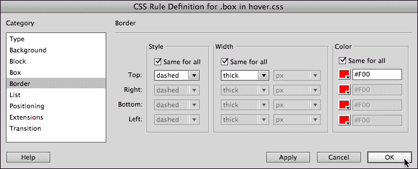

1.  现在让我们在页面上放置一个（或`--你的选择--`多个）这个类样式的实例。导航到**插入** | **布局对象**打开**插入 Div 标签**对话框。从**类**弹出菜单中选择**box**，然后点击**确定**。请注意，如果您希望将此框用作页面设计元素，可以重复执行此操作，如下面的屏幕截图所示。您还可以使用此图来仔细检查**CSS 样式**面板中`.box`类样式的规则。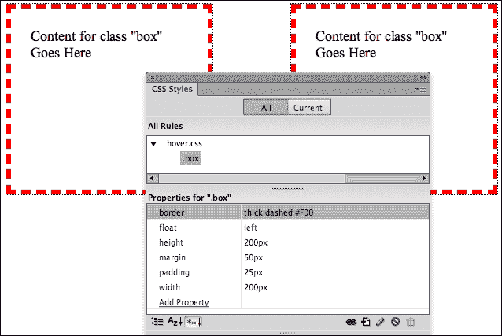

## 使用悬停类样式来实现动画效果

现在我们可以定义`:hover`伪类样式，以实现对这个框的缩放和圆角效果。使用 Dreamweaver CS6 的**CSS 样式**面板和对话框，我们能够创建一个具有定义边框的大小浮动框。对于以下步骤中需要的 CSS3 样式，我们就没有那么幸运了。我们将使用**CSS 样式**面板定义样式，但必须自己输入 CSS3 样式代码，只能依靠 Dreamweaver CS6 的代码提示。

1.  点击**CSS 样式**面板底部的**新建 CSS 规则**图标，打开**新建 CSS 规则**对话框。从**选择器类型**弹出菜单中选择**类**，在**选择器名称**框中键入`.box:hover`。在**规则定义**区域，如果尚未选择`hover.css`，请从**规则定义**弹出菜单中选择它。点击**确定**打开**hover.css 中.box:hover 的 CSS 规则定义**对话框。

1.  由于我们需要的规则在**CSS 规则定义**对话框中不可用，因此点击**确定**在当前阶段保存样式`.box:hover`而不添加任何规则。

1.  导航到**窗口** | **hover.css**以在 Dreamweaver 的**代码**视图中打开 CSS 样式文件。请参考以下代码，定义一个缩放过渡，将框的大小增加到一个显眼但不刺眼的 2%，并对框应用微妙的圆角。该代码使此效果对 Safari（`-webkit`）、IE9（`通用`）、Opera（`-o`）和 Firefox（`-moz`）用户可用。

针对`.box:hover`样式的代码如下：

```js
.box:hover {
  -webkit-transform:scale(1.02);
  -webkit-border-radius: 10px;
  -transform:scale(1.02);
  -border-radius: 10px;
  -o-transform:scale(1.02);
  -o-border-radius: 10px;
  -moz-transform:scale(1.02);
  -moz-border-radius: 10px;
  }
```

1.  保存 CSS 文件（导航到**文件** | **保存**）。使用**窗口**菜单返回到**hover.html**页面。在**浏览器**的**文件**菜单中使用**预览**选项，在**实时**视图中测试效果和变换，以及其他浏览器。下面的截图显示了 Firefox 中的效果——中间的框显示为略大，并带有圆角。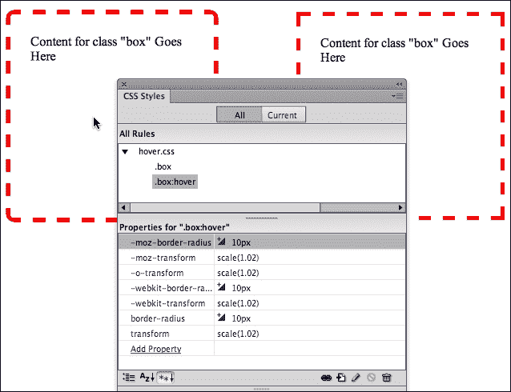

再次强调，这是一个非常灵活的方法，可以作为创建与访问者交互的页面布局元素的基础。例如，您可以用`rotate`、`skew`甚至`translate`来替换`scale`，也可以用阴影或不透明度变化来替换`border-radius`效果。

# 总结

在本章中，我们涵盖了随着 CSS3 样式表标准的出现而可用的各种效果和变换。这些“标准”是不一致的，因此需要为不同的浏览器提供替代（前缀）规则。

这些变换和效果本身作为设计工具非常有用，当通过定义`:hover`伪类元素使其交互时，它们甚至更具动态设计因素，只有当对象被悬停时它们才会出现。

Dreamweaver CS6 提供了一个基本框架，用于定义和应用 CSS3 变换和效果。我们检查了 Dreamweaver 的有限的 CSS3 工具，比如在**代码**视图中使用代码提示的能力以及在**CSS 样式**面板中有用的变换提示。

在本书的下一章中，我们将探讨如何使用 HTML5 向网页添加“本地”音频和视频。本地音频和视频可以直接在浏览器中运行，无需插件播放器（如 Windows Media Player、QuickTime Player 或 Flash Player）。
