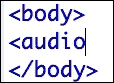
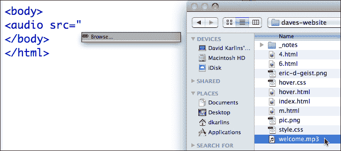
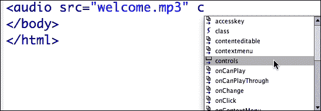
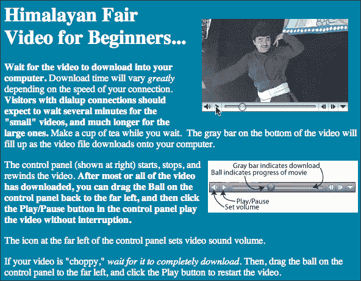
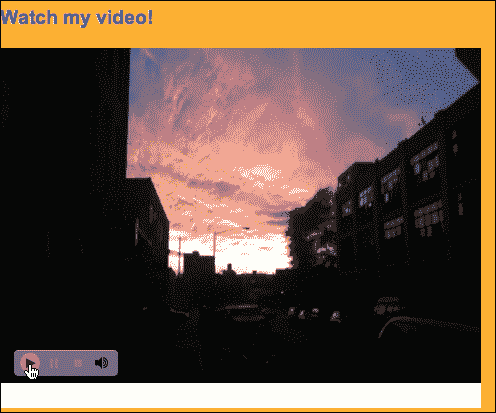
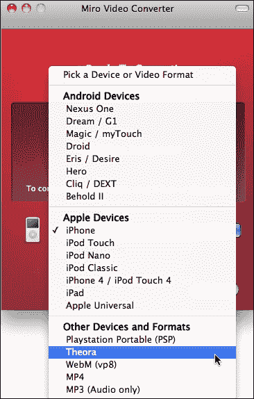
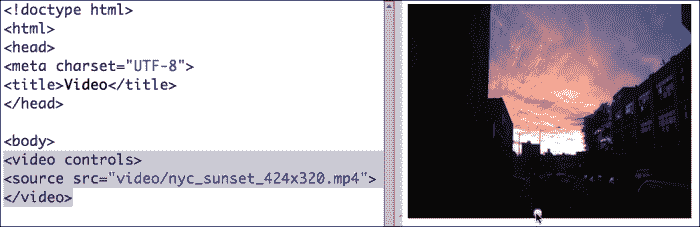
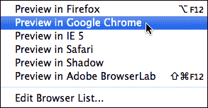
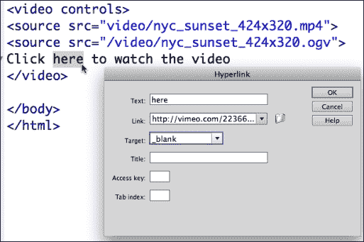

# 第五章：嵌入 HTML5 本机音频和视频

在本章中，我们将介绍如何使用 HTML5 向网页添加音频和视频。在 Dreamweaver 中使用 HTML5 嵌入媒体的优势在于它不需要任何外部播放器才能工作。对于支持 HTML5 音频或视频元素的浏览器，本机媒体是在线呈现音频和视频的最优雅方式。

Dreamweaver 使添加 HTML5 音频相对轻松，无需对 HTML 编码有广泛的知识或担心。

# 本机媒体和兼容性

在我们开始使用 HTML5 嵌入媒体之前，让我们稍微退后一步，来看看整体情况。在 HTML5 之前，如果您想从网站上收听音频或观看视频，您必须通过某种浏览器插件来实现。该插件可能是 QuickTime Player（通常在 Mac 上）、Windows Media Player（通常在 Windows 计算机上）、Flash、硬件制造商提供的插件或其他程序。

由于用户使用插件（如 Windows Media Player 或 QuickTime Player）来听音频，网页设计师几乎无法控制用户在听音频时屏幕上显示的内容。HTML5 提供了所谓的**本机**音频（以及本机视频）。本机视频不需要插件。播放器和控件在不同的浏览环境中仍然有所不同，但是使用 HTML5，音频播放器是*相对*标准化的。

在呈现 HTML5 音频和视频时存在两个兼容性问题：1）访问者的浏览器必须符合 HTML5 标准；2）访问者的浏览器必须支持音频或视频保存的特定音频格式。因此，在介绍呈现 HTML5 音频的过程中，我们将探讨如何处理这两个兼容性问题。

当我们逐步介绍嵌入本机音频和视频的过程时，我将分别更详细地讨论音频和视频的兼容性问题。

# 奠定基础

在 Dreamweaver CS6 中支持 HTML5 音频和视频仍然有些原始。如果您使用 Creative Cloud 更新 Dreamweaver，则可以从**插入**菜单（或**插入**工具栏）中获得更多 HTML5 元素（包括音频和视频）。但是 Dreamweaver CS6（和 5.5）的所有版本都在**代码**（或**分割**）视图中提供有价值的代码提示，这是我们将采取的方法，因为它适用于任何 Dreamweaver CS6 环境。此外，了解`audio`和`video`标签的语法也是很有益的。

让我们快速回顾一下您在 Dreamweaver 中使用 HTML5 媒体所需的两个基本要素：

+   如果您还没有，请确保已定义 Dreamweaver 站点。这是一个必不可少的第一步。要了解如何定义站点，您可以查看本书的第一章*使用 Dreamweaver CS6 创建站点和页面*，以了解如何操作。

+   收集媒体文件。对于音频：MP3、OGG 和 WebM 格式的音频文件。对于视频：h.264（通常带有`.mp4`文件扩展名）、OGG 或 WebM。您将需要拥有视频文件的三个版本-h.264、OGG 和 WebM。您可以使用免费的**Switch**程序（[`www.nch.com.au/switch/index.html`](http://www.nch.com.au/switch/index.html)）将文件从一种音频格式转换为另一种。对于视频转换，您可以使用免费的**Online-Convert**程序，可在[`video.online-convert.com/`](http://video.online-convert.com/)下载。

介绍到此结束，让我们转向在 Dreamweaver 中嵌入本机 HTML5 音频和视频的具体过程。

# 准备本机音频

在我们可以将它们放在网站上之前，我们需要做的第一件事是使我们的音频文件准备好 HTML5。

在通过各种音频格式来确定哪种适用于哪种浏览器之前，让我先提供一个非常基本的音频压缩概述。

## 音频压缩

您可能对一些流行的音频格式如 MP3、WAV、AIFF 等有所了解。原始的未压缩音频文件，如 WAV（用于 Windows）和 AIFF（用于 Mac），提供了最高的在线音频音质。但这些文件非常大，对大多数用户来说下载速度太慢。另一方面，MP3 音频文件的文件大小要小得多。

在转换为 MP3 格式时，使用压缩算法来从文件中挤出额外的数据。对于大多数听众和大多数音频文件来说，MP3 的质量是足够的。因此，当我们谈论在线提供音频文件时，我们通常是指诸如 MP3 之类的压缩音频文件格式。另一种压缩文件格式是 OGG 格式。

## 浏览器对音频文件的支持

MP3 和 OGG 是两种最广泛使用的压缩音频格式。由于未压缩音频需要更长时间下载，压缩音频（MP3 和 OGG）几乎适用于所有可下载的音频。

哪种压缩音频格式在所有浏览器中都有效？不幸的是，两者都不在所有浏览器中有效。最受欢迎的五种浏览器——Internet Explorer、Firefox、Chrome、Safari 和 Opera——都支持 HTML5 音频，但不同的浏览器支持不同的格式。

支持哪些音频格式的浏览器会随时间而变化，但在撰写本章时，情况如下：

+   Internet Explorer 9 及更高版本：MP3

+   Firefox 4.0 及更高版本：OGG

+   Google Chrome 6 及更高版本：两者

+   Apple Safari 5 及更高版本：MP3

+   Opera 10.6 及更高版本：OGG

[W3Schools.com](http://W3Schools.com)在[`www.w3schools.com/html/html5_audio.asp`](http://www.w3schools.com/html/html5_audio.asp)上保持着音频格式的浏览器支持的更新列表。但是，尽管我尽可能准确地预测未来，如果您想要达到绝大多数用户，您将需要同时提供 MP3 和 OGG 音频。

呈现 HTML5 音频的最可靠和“符合标准”的解决方案是提供 HTML5 压缩音频格式 MP3 和 OGG 的选项。这是我们将要探讨的解决方案。

# 在 Dreamweaver 网页中嵌入 HTML5 音频元素

一旦我们打好了基础，我们就可以开始了。使用以下步骤将音频元素嵌入到一个打开的 Dreamweaver HTML5 页面中：

1.  在**分割**视图的**代码**部分，将光标放在**<body>**标签后，然后按*Enter*（或 Mac 上的*Return*）创建一行新代码。

1.  开始键入`<au`，然后按*Tab*，HTML5 包将自动将其补全为`<audio>`标签的开头，如下面的截图所示：

1.  将光标放在单词`audio`后面，然后按下*空格键*。再次会出现一个弹出菜单。键入字母`s`，然后在列表中双击`src`。这是源代码，也就是文件的来源。

1.  当您选择`src`时，将会出现一个**浏览**链接。双击**浏览**链接打开**选择文件**对话框，如下面的截图所示：

1.  找到之前复制的音频文件，在我们的例子中是一个 MP3 文件（但也可能是 WAV 或 OGG）。通过双击选择该文件。

1.  您希望为这个音频添加一个控制器或播放器，所以我们将设置一个参数来显示一个。再次按下*空格键*，这次键入`c`，这在这种情况下将是用于控制。双击**controls**，然后当弹出框出现时，再次双击**controls**，如下面的截图所示：

1.  通过键入`>`来关闭开放的`audio`标签。

1.  最后，键入`</`，让 Dreamweaver 自动补全为`</audio>`，这将完成`audio`元素的闭合标签。

现在我们想要预览文件，这只能在 Safari 或 Opera 中进行，假设您选择了 MP3。要在 Safari 中预览，请导航到**文件** | **在浏览器中预览** | **Safari**。它应该看起来像以下截图：


如果我们使用了 OGG 文件，我们可以做同样的步骤，但现在我们必须在 Firefox 中预览。

## 备用音频选项

所以现在您的页面上有音频了。但是还缺少两件事：

+   首先，您的音频播放器没有太多特殊功能。

+   其次，并非所有访问网站的人都能访问音频文件。由于我们之前确定，不是所有支持 HTML5 的浏览器都支持相同的音频文件格式，因此您应该为不同的浏览环境提供不同的 HTML5 支持的音频格式选项。

让我们从提供备用音频文件格式的挑战开始。正如我们所指出的，一些符合 HTML5 标准的浏览环境支持 MP3 文件格式，其他支持 OGG 格式，剩下的支持 WebM。

因此，我们可以通过提供第二个源文件使我们的音频更易访问。这样，符合 HTML5 标准的浏览器可以找到并播放与该浏览器相匹配的文件格式。

为此，我们将改变之前创建的 HTML，以将播放器控制代码与音频源代码分开。代码看起来类似于以下代码块：

```js
<audio controls="controls">
   <source src="img/audio.ogg" type="audio/ogg" />
   <source src="img/audio.mp3" type="audio/mpeg" />
</audio>
```

在上述代码中，您将`audio.ogg`或`audio.mp3`替换为您自己的音频文件名。

对于那些浏览器无法解释 HTML5 的用户，比如使用较旧版本的 Internet Explorer 或较旧浏览器的用户，我们将希望提供另一种访问音频的方法。为此，我们可以创建一个链接到我们的音频文件。如果这样做，当链接被点击时，音频文件将在自己的浏览器用户中打开。然后浏览器将使用插件播放器，如 QuickTime、Flash 或 Windows Media 来播放音频文件。这并不是最优雅的解决方案，但它会起作用。

为此，我们可以在我们刚刚探索的 HTML 中添加一行代码。这行代码创建的文本将出现在不解释（支持）HTML5`<audio>`标签的浏览器中，并且可以链接到一个页面，该页面以 QuickTime、Windows Media 或 FLV 等传统格式呈现音频。

代码看起来类似于以下内容：

```js
<audio controls="controls">
  <source src="img/sound.ogg" type="audio/ogg" />
  <source src="img/sound.mp3" type="audio/mpeg" />
Your browser does not support the HTML5 audio element but you can hear the audio file <a href="sound.html">here</a>.
</audio>
```

代码的最后一行，以`Your browser…`开头，链接到一个 HTML 页面（`sound.html`），该页面可用于呈现在较旧浏览器上的插件软件中播放的传统音频格式。

## 添加播放参数

现在（几乎）每个人都可以访问我们的音频，让我们看看我们可以使用哪些其他参数来为我们的`audio`元素添加功能。

当我们在定义我们的源文件中添加了代码`controls="controls"`时，我们添加了一个控制参数。如果您在测试时在 Safari 中使用控制器，您已经发现这个控制器可以让我们播放、暂停、静音和重新启动我们的 MP3。我们还可以使用进度条或快进/快退功能在音轨中移动。

有四个重要的 HTML5 音频参数我们可能想要使用。要启用这些参数中的每一个，我们将想要使用 HTML5 代码提示，就像我们之前启用控件一样：

+   `controls`：此属性在音频播放器中显示控件，以启动、暂停、停止或更改音量。

+   `loop`：这会重复播放音频文件，或者循环播放。要启用循环播放，将光标放在代码`controls="controls"`之后，按下*空格键*以激活代码提示。输入`l`，然后双击`loop`以添加`loop`代码。

+   `autoplay`：这会在有人打开页面时立即开始播放音频文件，而不是观看者必须按下**播放**按钮，就像我们在控制器上所做的那样。您可以同时启用`loop`和`autoplay`。要使音频自动播放，请将光标放在代码`controls="controls"`之后，按*空格键*以激活代码提示。双击`autoplay`以添加代码`autoplay =""`。对于自动播放音频文件，您不需要在代码中的引号之间放任何内容，就像我们在`controls`和`loop`中所做的那样。只需添加代码即可启用它，如下面的屏幕截图所示：

### 注意

移动设备（包括 iOS 苹果设备）和某些版本的 Android 移动操作系统不支持`autoplay`，这就需要包括`controls`。

+   `preload`：此属性在打开页面时开始下载音频文件，而不必点击**播放**。如果我们使用`autoplay`，这就不相关了，因为它无论如何都会立即加载，但是当我们不使用`autoplay`时，它允许访问者在点击**播放**时更快地启动音频文件。我建议不要使用此选项，因为它会延迟在许多移动环境中打开页面。如果要预加载音轨，只需将光标放在代码`controls="controls"`之后，按*空格键*以激活代码提示。键入`p`，然后双击`preload`，然后双击`auto`以添加代码`preload="auto"`。

+   `preload`属性还有另外两个可能的变量：`none`和`metadata`。`none`变量明确指定不预加载文件，而`metadata`指定仅预加载元数据信息（例如，音频文件的歌曲标题、作者等信息）。

您可以同时启用多个参数。只需在代码`controls="controls"`之后每次按下*空格键*以激活 HTML5 代码提示，然后重复其他代码。因此，您可以有一个自动播放和循环的音轨，例如。

记住，要根据您拥有的音频和访问者对您网站的偏好来选择最合适的内容。请记住，许多访问者不希望在他们进入网站的主页时自动播放声音。他们可能正在工作，或者可能不希望开启声音。除非是他们期望有声音的链接页面，否则对于您的访问者来说，让音频成为他们可以选择打开的内容，而不是他们必须选择关闭的内容，更加体贴。

# 嵌入 HTML5 音频

在接下来的部分中，我们将逐步介绍如何使用 HTML5 音频元素嵌入 MP3 音频文件，并为那些浏览器不支持 HTML5 的访问者提供选项。我假设您正在 Dreamweaver 网站上工作，并且已经打开了一个文件，保存为 HTML5 网页（首先保存文件非常重要，以确保与音频文件的链接的完整性）。而且，您已经准备好要嵌入的 MP3 音频文件。

将这些部分放在一起，这些步骤将起作用：

1.  在 Dreamweaver 文档窗口中，切换到**分割**视图，在**分割**视图的**代码**侧，单击要创建新代码行的位置。这可以是在`<body>`和`</body>`标签之间的任何位置。

1.  开始输入`<audio>`。在过程中输入几个字母后，您可以按*Tab*键来完成元素的开头。然后按下*空格键*。

1.  双击**src**，如图所示。将出现一个**浏览**链接：

1.  双击**浏览**链接以打开**选择文件**对话框，然后导航到并选择 MP3 音频文件。

1.  再次按下*空格键*，并在出现的代码提示中双击**controls**。然后在下一个代码提示中再次双击**controls**。

1.  键入`</`，Dreamweaver 将完成关闭元素`</audio>`。

1.  现在，为了支持非 HTML 浏览器，在您的网页上添加一行文本，其中包含一个链接，链接到您刚刚使用 HTML5 `<audio>`标签嵌入的音频文件。要做到这一点，找到一个插入点（在**分割**视图的代码侧面点击鼠标，就在关闭音频元素的`</audio>`代码之前）。键入一个闭合的尖括号（`>`）来完成元素。然后键入`Listen to the audio file`作为常规 HTML 文本，并使用**属性**检查器将音频文件链接到您使用 HTML5 `<audio>`标签嵌入的文本。

### 提示

此代码为支持 HTML5 的浏览器提供了无缝的 HTML5 音频，可以处理 MP3 文件，并为其他所有人提供了 MP3 文件的链接。

# 嵌入本机视频

接下来，我们将学习如何使用 HTML5 和 Dreamweaver 向网页添加不同类型的视频。

在线视频正在经历一场彻底的演变。这些变化可以非常简要地总结为以下几点：您不再需要插件播放器。Dreamweaver 为嵌入本机视频（所谓的因为它在本机浏览器环境中播放，无需插件）提供了有限但有价值的支持。

我们将通过几个步骤学习如何使用 HTML5 视频元素：

+   理解本机视频的概念，以及它与网络视频发展的早期演变步骤有关，还有哪种视频格式适用于哪种浏览器。

+   创建 HTML5 就绪的数字视频文件。

+   使用`<video>`标签在 Dreamweaver 中嵌入视频。

+   为不兼容 HTML5 的浏览器提供替代选项。

+   定义额外的视频显示参数。

### 提示

我们需要完成这些步骤，以确保我们网站中包含的 HTML5 视频在每个浏览环境中都能正常工作。

## HTML5 视频和 Dreamweaver

要理解当今呈现在线视频的挑战，将事物框架化为迄今为止网络视频的演变是很有启发性的。首先，旧的网络视频仍然是一个问题，旧的浏览器也是一个问题。我们必须解决在支持当前标准的新浏览器和不支持的旧浏览器中呈现视频的挑战。

此外，没有对竞争在线视频格式的当前相当疯狂的状态进行锚定，就很难理解这一切是如何出现的。

为了解决所有这些问题，将新兴的在线视频分为三个阶段是有用的。

### 早期视频格式

在线视频的第一个阶段的特点是不同的、不兼容的视频格式和播放器的扩散。苹果的 QuickTime 视频在 QuickTime 播放器中播放，该播放器随苹果的 Safari 浏览器一起提供。微软的 Internet Explorer 播放各种微软视频格式，如 AVI 或 WMF。通常，网页设计师在网站中包含 QuickTime 视频，期望只有 Mac 用户能够看到视频，或者包含 Windows Media 格式，如 WMV 或 AVI，期望只有安装了适当更新的 Windows Media Player 的用户能够处理视频。在这个阶段，其他格式，如 RealMedia 的视频和播放器，在一段时间内也获得了一定的影响力。

在早期阶段，缺乏单一的在线视频格式是影响网络视频的边缘化因素之一。此外，缺乏大量使用高速连接的用户使在线视频变得不那么吸引人。在笔记本电脑和数字设备上显示低质量的视频和音频也是另一个因素。网络视频从今天的网站的组成部分，以及相应缺乏高质量的在线视频内容，使网络视频成为网页设计中的边缘元素。

从文化和技术上讲，网络视频在这一点上是一种“局外人”，需要长时间等待下载，并向用户解释如何观看视频，正如我在 2002 年为喜马拉雅集市创建的以下网站所示：



在 HTML 和 Dreamweaver 技术方面，`<embed>`标签用于在页面上放置视频。这个标签允许设计师对播放器控件和其他参数（如`autoplay`）进行一些控制，但视频的播放方式（以及是否播放）主要由用户的浏览器定义，以及他/她在该浏览器中安装的插件。

### Flash 视频（FLV）

在我们这里划分的在线视频演变的第二阶段标志着视频融入到每种网站的每个领域中。

视频进入网络主流的一个关键因素是 Adobe 的 Flash Video（FLV）格式的出现和 Flash Player 的广泛接受。FLV 以高度压缩的形式呈现视频，大大减小了文件大小（通常比 QuickTime 小一半），同时保持良好的视频和音频质量。

FLV 文件需要 Flash Player，但在这个 Web 的阶段，几乎每个人都安装了 Flash Player。特别是在 CS4 和 CS5 中，Dreamweaver 包括了漂亮、可定制的基于菜单驱动的 Flash Player 设计工具。Dreamweaver 设计师可以在嵌入 Flash 视频时从各种 Flash 播放器皮肤中进行选择。下面的截图显示了一个极简主义的播放器皮肤：



与 FLV 的崛起和对 Flash Player 的几乎普遍支持相交汇的是高速互联网连接的可用性和视频内容的大量增加。YouTube 的即时流行，其中包括 FLV 视频，是这些现象的表达和推动力。这些发展，仍然是网络视频的一个重要元素，将网络视频从边缘转变为主流。

在 HTML 和 Dreamweaver 方面，FLV 将被嵌入页面中使用`<object>`标签。但视频播放器的外观以及参数的属性（如自动播放或循环）是在 Dreamweaver 的**文档**窗口中的**属性**面板中为所选的 FLV 视频定义的。

使用 FLV 视频的主要缺点是它不受 iPhone、iPod Touch 或 iPad（或 iPod）的支持。接下来我将解释这种情况是如何发展的，以及对使用视频的网页设计师的影响。

### 苹果设备和网络视频

在线视频的参数，以 Flash Video 作为凝聚元素，似乎是明确的、相对稳定的，并且被全球接受。直到...2010 年 4 月，史蒂夫·乔布斯发表了《关于 Flash 的想法》。这封信的核心是阐明并永久确立了苹果公司的立场，即它永远不会在其 i 设备上支持 Flash Player：

> “移动时代是关于低功耗设备、触摸界面和开放网络标准的，这些都是 Flash 的短板。提供其内容给苹果移动设备的媒体机构的大量增加表明，Flash 不再是观看视频或消费任何类型的网络内容的必要条件。”

这个决定是在乔布斯宣布之际做出的，尽管如此，例如在 Hulu 和 YouTube 等网站上，大部分在线视频仍然是 Flash Video。试图观看这些网站上的视频的人通常会收到如下截图中所示的消息：


苹果公司全力支持`h.264`格式来打包压缩视频。这种格式本质上使用了与 Flash Video 相同的压缩技术，但它是通过浏览器而不是插件播放器来适应播放器的显示和控制。

撇开这个决定的权力政治和经济维度不谈，基本的技术和设计问题是苹果不希望在其数字设备上扩展有限的能源资源在 Flash Player 上，并且苹果认为视频播放器应该是“本地的”，而不是像 Flash Player 中那样在每个操作系统和浏览器上看起来基本相同的全球跨平台界面。

在苹果宣布之后的一年内，提供在线视频的关键群体已经开始向本机视频倾斜。但 FLV 仍然广泛分布在网上。因此，使用 Dreamweaver 的网页设计师面临着嵌入本机视频的挑战。

## 准备本机视频文件

本机视频是以 HTML5 的`<video>`元素（标签）呈现的。在本章中，我们的任务就是实现这一点，并很快我们将探讨 Dreamweaver 中用于嵌入视频的工具。

在我们做到这一点之前，让我们确定开发者在提供本机视频时面临的两个主要挑战。一个是不只有一个本机视频格式，而是有三种。第二个挑战是旧版本的 Internet Explorer（8 及更早版本）不支持 HTML5 的`<video>`元素。

### 本机视频格式

三种最广泛支持的本机视频格式是：MP4（h.264），由 Safari 支持；Theora OGG，由 Mozilla Firefox 支持的开源视频格式；以及 WebM，由 Google Chrome、Opera 支持，并据报道很快也会在 Firefox 中支持。

以下是当前支持哪种视频格式的浏览器的更详细的分析：

+   Ogg：Firefox，Chrome，Opera 10.5+

+   h.264（MP4）：Internet Explorer 9+，Safari，旧版本的 Chrome，苹果移动设备，安卓设备

+   WebM：Chrome 6+，Opera 10.6+

但请记住，所有这些都是一个不断变化的目标。

正如你所看到的，没有一种视频格式被所有主要浏览器支持。特别是，Firefox 和 Chrome（在浏览器市场上占有相当大的份额）不支持`h.264`视频格式。

我们将通过提供具有相同参数（位置、播放器控制显示等）的备用视频来解决这一挑战。

### 不支持 HTML5 的浏览器

提供备用视频格式将解决我们的本机视频在所有 HTML5 浏览器中显示的问题。但是旧版本的 Internet Explorer（IE 9 之前）不支持 HTML5！

在讨论嵌入本机视频的细节时，我们将为不支持 HTML5 的浏览器构建备用支持。我们将通过制作 FLV 格式的视频版本来实现这一点。

### 为每种情况准备 HTML5 视频

如果你选择只提供 Web 上可用的一种流行视频格式，你将排除很大一部分人观看你的视频。例如，如果你选择在苹果移动设备上支持的`h.264`格式，那么大约 30%的用户无法在 Firefox 上观看该视频。相反，如果你提供 Flash 视频（FLV），你的视频可以在 Firefox 中观看，但不能被 5%的在 i 设备上浏览网页的用户观看。

因此，我们的挑战是提供快速下载、压缩的网络视频，在*每个*浏览器（或至少是每个重要的浏览环境）中都得到支持。

没问题！在本章结束时，你将能够在 Dreamweaver 中做到这一点。

## 为 Web 压缩视频

让我们回到之前讨论的网络视频发展。链条中的一个关键环节是为网络视频开发强大、有效的压缩技术。简要解释一下这是如何工作的可能会有所帮助。

视频动画——无论是数字的还是老式的模拟（比如电影）——都是以帧的形式呈现的。每秒显示的帧数越多，动画就越流畅。

视频压缩通过合理化帧数据保存的方式来减小数字视频的大小，而不是减少帧数。例如，假设你有一个人在背景下说话的视频。也许在整个视频中背景都没有变化。视频压缩软件通过组织用于描绘背景的数据的方式来紧缩呈现该视频所需的数字数据，这样就不必为视频的每一帧重复这些数据。

### 注意

我在这里使用了一个非常简单的例子来帮助阐明一个观点，但这个观点更广泛地适用于更复杂背景的视频。而且，作为一个一般的经验法则，压缩可以将文件大小减少约一半，同时保持原始质量。

在典型的工作流程中，您可能会从 QuickTime 的 MOV 格式（或 Microsoft 的 AVI 格式）开始处理视频文件。这些视频直接来自视频摄像机，或者来自视频编辑软件，都是未经压缩的。它们可以直接在线呈现，除非：

+   它们是不必要的大，会使下载时间翻倍。

+   除非浏览器添加了插件，否则并非所有浏览器都支持它们，而我们正试图摆脱这一点

因此，在您或其他人以无压缩格式创建视频之后，为了准备将该视频用于 Web，过程中的关键一步是对其进行压缩。

### 视频压缩-开源和专有

在 Web 上使用的四种最流行的压缩数字视频格式大致分为两组：开源和专有。专有格式是有所有权和许可的，而开源格式对公众免费。

WebM 和 Ogg Theora 是免费的开源视频格式。要创建它们，您可以使用各种免费编码程序。

Flash Video (FLV)和 h.264 不是开源的，而是专有的。要生成它们，我们可以使用 Adobe Media Encoder。

虽然创建原始无压缩视频的四个额外（压缩）版本（来自 QuickTime 或 Windows Media 格式）有点麻烦，但是可以做到。

### 使用开源工具将视频转换为 Web 格式

有许多免费可下载的应用程序，可以将您的（原始的）QuickTime 或 Windows Media 文件转换为压缩的 Theora OGG 或 WebM。

### 注意

我目前正在使用一个叫做**Miro Video Converter**的应用程序（[www.mirovideoconverter.com](http://www.mirovideoconverter.com)），这是一个不错的，免费可下载的应用程序。

无论您最终使用哪个免费视频压缩应用程序，该过程都包括两个步骤：将视频添加到缓存以进行转换，并选择输出格式（例如`h.264`），如下面的屏幕截图所示（在这种情况下是使用 Miro Video Converter）：



当然，这两个一般步骤将根据您最终使用的开源视频转换程序而有所不同。一般来说，这些免费视频压缩应用程序非常简单。它们不提供编辑、调整大小或调整压缩视频质量的选项。因此，我建议使用它们来转换您的 Web 视频的开源版本（Theora OGG 和 WebM），而不是 Flash 视频（FLV）和 h.264（MP4）版本的视频。

为此，我建议利用几乎每个 Creative Suite 版本都附带的 Adobe Media Encoder。

## Dreamweaver 网站管理 HTML5 视频

现在，经过探讨了为 HTML5 准备视频的过程，让我们简要地看一下如何准备充分利用 Dreamweaver 在这个过程中的优势。

Dreamweaver 在嵌入 HTML5 视频方面有两种方式。一种方式是，Dreamweaver 将提供有用的代码提示，以便更轻松地创建我们需要的 HTML5 代码。

但 Dreamweaver 在这个过程中的另一个价值在于，网站管理工具将跟踪我们需要的所有文件，最重要的是，维护我们在嵌入视频和其他文件（CSS，可能的 JavaScript，嵌入式图像等）之间创建的链接的完整性，以便在浏览器中正确地运行我们的页面。

因此，作为一个关键的下一步，请确保您正在使用 Dreamweaver 网站。正如我们在之前的章节中所讨论的，我们将在这里以三个简单的步骤回顾涉及其中的基本知识：

1.  如果您没有在定义的 Dreamweaver 站点中工作，请导航到 **Site** | **New Site**。在 **Site Setup** 对话框中，为您的新站点命名并定义一个本地站点文件夹。这样可以定义一个 Dreamweaver 站点。在 Dreamweaver 网页中嵌入 HTML5 视频并不需要定义站点的服务器元素，但是定义本地站点是必要的。

1.  现在创建一个新文件，并将其保存在您定义的站点中。为此，导航到 **File** | **New** 以打开 **New Document** 对话框。在 **Category** 列中选择 **Blank Page**，在 **Page Type** 列中选择 **HTML**，在 **Layout** 列中选择 **<none>**。从 **Doc Type** 弹出菜单中选择 **HTML5**。单击 **Create** 创建一个新的空白 Dreamweaver 页面。

1.  为了避免 **Untitled** 页面标题，输入 **Document** 窗口中的 **Title** 区域中的标题（可以是任何描述性文本）是一个很好的管理方式。

1.  导航到 **File** | **Save** 并分配一个文件名。

### 提示

通过保存文件，我们将能够使用相对路径链接视频。

## 定义 HTML5 的 <video> 元素

一旦您准备好了 Dreamweaver 站点，并创建了视频的 h.264、OGG、WebM 和 FLV 版本，您就拥有了嵌入本机 HTML5 视频和为不支持 HTML5 的浏览器提供替代方案所需的所有元素。

在接下来的步骤中，您将完成在 HTML5 网页中放置视频的过程。

遗憾的是，我们无法在 **Design** 视图中进行这项操作。Dreamweaver 没有用于嵌入 HTML5 本机视频的 **Design** 视图菜单选项。但是我们可以利用 Dreamweaver **Document** 窗口中的两个有用功能：**Code hinting** 和 **Split view**。代码提示将帮助我们生成所需的 HTML5 代码，而分割视图将允许我们在创建视频时预览访问者可能看到视频的一些可能方式。

### 先决条件

为了复习和重申这些事项，您在创建 Dreamweaver 中的 HTML5 视频之前需要以下准备：

+   您应该已经准备好了您视频的 h.264（mp4）；Theora（OGG）；WebM（webm）和 Flash 视频（FLV）版本。您可以选择为前三种 HTML5 兼容格式中的一种或多种提供支持。如果您为 h.264 和 OGG 提供支持，几乎可以覆盖所有现代浏览器。

+   您必须创建一个 Dreamweaver 站点，并在 Dreamweaver **Document** 窗口中保存为 HTML5 文件的打开页面。在 **Split** 视图中查看页面。

+   将所有视频文件复制到您定义的站点文件夹中的一个文件夹中。如果您将视频文件保存在其他位置，Dreamweaver 将提示您在站点文件夹中创建视频的副本，但在此阶段将视频文件的副本创建在站点文件夹中可以节省步骤并简化操作。

### 定义 <video> 元素

在保存的 HTML5 页面中，在开头的 `<body>` 标签后放置光标。如果您要在已有内容的页面中嵌入视频，请将插入点放在视频应出现的位置。

1.  输入 `<vi`，代码提示将显示 `<video>` 标签。

1.  按下 *Tab* 键完成 `<video>` 标签的开始。

1.  使用代码提示来添加高度、宽度和控件参数。高度和宽度的值可以与您的视频的原始值匹配，也可以更大或更小。如果值大于原始视频，视频的分辨率将会降低。包括 `controls` 参数会显示播放器控件（播放、暂停、停止和音量）。生成的代码如下：

```js
<video width="xxxpx" height="yyypx" controls>
```

（其中 `xxx` 是视频的宽度，`yyy` 是高度）

由于我们将支持多种视频格式，我们在这里通过输入关闭了 `video` 标签。

### 定义视频属性

HTML5 视频控制器通常显示播放按钮、暂停按钮和静音按钮，以及一个滑块（一个可移动的拇指的水平条，用于在视频播放中向后或向前滚动）。此外，默认情况下，HTML5 视频控件仅在用户将鼠标指针悬停在视频上或视频开始播放时显示。

最重要的视频参数是`height`、`width`和`controls`。`controls`参数显示这些播放器控件。`height`和`width`值后面跟着测量单位，几乎总是像素。

还有其他有用的 HTML5 视频参数，如下所示：

+   `Audio=muted` 在视频开始播放时关闭音量

+   `Autoplay=autoplay` 自动启动视频

+   `Loop=loop` 重复播放视频

+   `Preload=preload` 在页面打开时加载视频，甚至在播放之前

+   `Poster=[filename]`（其中`filename`是 PNG 图像文件）在视频播放之前显示艺术品

### 提示

**iOS 设置**：iPad 无法自动播放 HTML5 视频，苹果不允许其在 iOS 设备上自动播放，因此如果您的受众包括这些设备上的访问者，则不要依赖自动播放。此外，预加载适用于台式机和笔记本电脑，但对移动设备来说资源消耗太大。

尽管准备 HTML5 视频通常意味着呈现多个视频源文件，但其他属性可以一起为它们定义。此外，通常情况下，这就是您想要做的，因为无论访问者查看哪种视频文件格式，视频大小、自动播放状态等属性都是相同的。

这些参数都受代码提示支持，我们将在本章末尾的示例中详细探讨其工作原理。

### 定义视频源

每个视频源都需要一行单独的 HTML5 代码。这些代码是在 Dreamweaver（安装了 HTML5 包的任何版本）中通过代码提示生成的。

要开始定义视频源，输入`<sour`，代码提示会建议`<source>`标签。按下*Tab*键完成代码。按下*空格键*。输入`sr`，代码提示会建议`<src>`。然后按下*Tab*键。会出现一个**浏览**链接。

要查找源视频文件，请双击代码提示提供的**浏览**链接，以打开**选择文件**对话框。


然后，转到您从 Media Encoder 导出到 Dreamweaver 站点文件夹的 h.264 视频文件。双击该文件以选择它。

### 非 HTML5 环境的备用视频

Internet Explorer 9 包括 HTML5 视频支持。然而，许多人仍在较旧版本的 Internet Explorer（IE 8、7 和 6）中观看在线视频。因此，重要的是提供不需要 HTML5 支持的在线视频的替代访问方式。

为了做到这一点，您可以添加一行代码，提供一个 FLV 文件的链接。这行代码应该在`<video>`标签的参数集的末尾，就在`</video>`闭合标签之前。以下示例中包含了这行代码。

### 将所有内容整合在一起

我们将逐步介绍在本章末尾嵌入 HTML5 视频的示例，该示例使用了所有重要的`<video>`标签参数，并整合了所有三种 HTML5 视频格式，并为非 HTML5 浏览器提供了可访问性。

然而，作为一个简短的课程，以下代码显示了一个带有控件的 320 x 240 视频，包括所有三种 HTML5 视频格式，以及一个供使用较旧版本 IE 的人观看 FLV 视频的选项：

```js
<video width="320px" height="240px" controls> 
<source src="img/on_record.mp4"> 
<source src="img/on_record.theora.ogv"> 
<source src="img/on_record.webm"> 
<a href="Video/on_record_1.flv">Click to watch this video using Flash Player</a>
</video>
```

## 测试 HTML5 视频页面

在我们探索 HTML5 视频的过程中，很明显，以 HTML5 呈现在线视频存在重大的兼容性问题。视频是否真的能在各种浏览环境中播放，从 iPad 到 Windows 机器上的 Internet Explorer 6.0？

如果您提供了所有三种 HTML5 视频格式选项，并包括指向 Flash 视频页面的链接，以供不支持 HTML5 视频的访问者使用，您的视频应该可以在任何环境中播放。

### 在实时视图中预览视频

在 Dreamweaver 中测试视频有两种选项。其中一种是通过导航到**文件** | **在浏览器中预览**来找到的，它简单地在您自己计算机上安装的浏览器中打开您的页面。这对于在您已经安装的浏览器中测试视频非常有效和有用。

在 Safari 和其他遵循 Webkit 标准的浏览器中（包括苹果移动设备），查看视频是否有效的更快方法是简单地在**实时视图**中查看和测试视频。如果您在**分割**视图中工作（这几乎是在 Dreamweaver 中使用 HTML5 视频的必要条件），您可以单击**实时视图**按钮，并在**分割**视图的代码侧面看到（和编辑）代码的同时测试您的视频。

# 嵌入 HTML5 视频

以下示例逐步介绍了使 HTML5 视频在所有三种可用的压缩视频格式中可用所需的一切，以及为较旧版本的 Internet Explorer（6-8 版本）提供 FLV 选项。

与本书中的所有示例一样，第一步是确保您已经定义了 Dreamweaver 网站。有了这个，就可以在站点中创建并保存一个名为`video.html`的页面。

此处的示例代码使用了我上传到 Vimeo 频道的真实视频文件（NYC 日落）。您可以使用此进行实验。如果您这样做，请通过单击视频的**下载**按钮从 Vimeo 下载它。

然后，通过使用 Micro Converter 将下载的 h.264（`nyc_sunset_424x320.mp4`）视频转换为 OGG 和 WebM 的多个版本（有关如何执行此操作的提示，请参见本章的*使用开源工具将视频转换为 Web 格式*部分）。

将三个视频文件保存在名为`video`的文件夹中，该文件夹位于站点根文件夹内。

定义了您的站点，保存了一个 HTML5 页面（`video.html`），并且在站点的视频文件夹中有（下载的）mp4/h.264 视频和（转换的）OGG 和 WebM 视频后，您可以进行以下步骤：

1.  在 Dreamweaver 的**文档**窗口中，切换到**分割**视图，在**分割**视图的**代码**侧面中，单击您希望创建新代码行的位置。这可以是在`<body>`和`</body>`标签之间的任何位置。由于我们正在处理一个全新的文档，请将光标放在第一个`<body>`标签之后，然后按*Enter*（Windows）或*Return*（Mac）创建新的代码行。

1.  开始输入`<video`元素。在此过程中输入几个字母后，您可以按*Tab*键来完成元素的开始部分。

1.  添加一个名为`controls`的视频参数以显示控件。

1.  通过输入`>`来关闭`<video>`标签，并按*Return*创建新的代码行。

1.  通过输入`</video>`来关闭视频元素。

1.  在打开的`video`标签之后，但在关闭的`video`标签之前，使用以下代码行定义第一个视频源：

```js
<source src="img/ nyc_sunset_424x320.mp4">
```

1.  在这个阶段，您可以在**分割**视图的**设计**侧面中的**实时**视图中看到（和听到！）视频，如下面的屏幕截图所示：

1.  在新的代码行中，输入 HTML5 代码以定义 Theora OGG 视频作为第二个视频源：

```js
<source src="img/video nyc_sunset_424x320.ogv"> 
```

1.  您可以通过在 Google Chrome 中预览页面来测试第二行代码。如果您安装了该浏览器，可以测试这个。当前版本的 Chrome 不支持 h.264 视频，因此不会识别`.mp4`文件，但会识别`.ogv`（OGG）文件。

1.  添加定义第三个视频源的代码行：

```js
<source src="img/nyc_sunset_424x320.webm">
```

1.  在新的代码行上，只需输入：`点击这里观看视频`。选择单词`这里`，并使用**插入超链接**对话框来定义一个链接到[`vimeo.com/22366228`](http://vimeo.com/22366228)的链接，该链接将在新的浏览器窗口中打开（从**目标**弹出窗口中选择**_blank**）。

### 提示

最后这个链接是我们为那些不支持任何 HTML5 视频的非常老旧的浏览器用户提供的“救援”选项。他们可以在 Vimeo 上观看视频。

1.  随意使用文本或样式装饰页面。或者不用。保存你的文件。如果你可以访问 IE 6、7 或 8，你可以测试非 HTML 版本，或者你可以使用 Adobe BrowserLab 进行测试（**文件** | **在浏览器中预览** | **Adobe BrowserLab**）

我们示例项目的完整代码如下：

```js
<!doctype html>
<html>
<head>
<meta charset="UTF-8">
<title>Video</title>
</head>
<body>
<video controls>
<source src="img/nyc_sunset_424x320.mp4">
<source src="img/nyc_sunset_424x320.ogv">
<source src="img/nyc_sunset_424x320.webm">
Click <a href="http://vimeo.com/22366228" target="_blank">here</a> to watch the video
</video>
</body>
</html>
```

# 总结

在本章中，我们探讨了创建和呈现 HTML5 音频和视频的过程。我们研究了 HTML5 支持的不断发展、不同和竞争的音频和视频压缩选项。此外，我们注意到需要通过创建一个在 HTML5 之前的浏览环境中可以使用的 FLV 文件来呈现我们的视频。

然后，我们使用 Dreamweaver 的工具来嵌入 HTML5 视频。这些工具本质上是代码提示，可以帮助编写 HTML5 `<video>` 标签及其属性，并且 Live View 可以在编写代码时预览至少 Webkit（Safari）版本的视频。

除了 Dreamweaver 菜单选项的限制外，我们还探讨了使用代码视图来输入我们自己的 HTML5 音频和视频元素。

在下一章中，我们将看到如何在 Dreamweaver 中使用媒体查询。通过这样做，我们将开始涉及本书可能的主要重点，也是今天网页设计师面临的最重要和最激动人心的挑战之一：创建在全尺寸（笔记本/台式机）环境和移动设备（智能手机）中都具有吸引力、诱人和可访问性的网页。
