# 第六章：使用媒体查询进行响应式设计

这是一个多媒体世界。人们通过各种媒体与网络内容进行体验和互动，从网站的大屏幕投影到手持设备。这给网页设计师带来了特定的挑战。

其中一个挑战是设计页面，使其在不同大小的设备上都能够访问、吸引人并且功能正常。一个页面，内容居中，左右两侧有侧边栏，文本围绕图像流动，在笔记本电脑上可能很吸引人，但在 iPhone 上可能是一团糟。 

随着 HTML5 和 CSS3 的出现，可以设计页面来检测查看设备的大小（视口），并呈现为该设备定制的独特页面布局。因此，例如，您可以为页面创建三种不同的视图——一个用于智能手机，一个用于平板电脑，一个用于全尺寸显示器。这种方法被称为**响应式设计**。实现它的 CSS3 技术是**媒体查询**。

在本章中，我们将学习如何在 Dreamweaver 中设计页面，检测媒体视口并使用 Dreamweaver 生成的媒体查询，为访问者的查看环境呈现适当的页面设计。

在这样做的同时，我们将：

+   使用 Dreamweaver 的多屏预览窗口预览网站在不同视口中的外观

+   为特定设备自定义多屏预览

+   使用 Dreamweaver 的媒体查询为不同大小的查看设备创建多种样式

# 多媒体网络世界的网页设计

正如本章介绍中所指出的，最近一段时间以来，人们通过各种媒体与网站进行互动的方式呈现出爆炸式增长，特别是智能手机和平板电脑越来越多地定义了浏览体验。此外，正如所指出的，适合的网页设计可能对于宽屏体验是必要的，但在小屏幕上通常是不合适的，过于混乱，或者在小屏幕上根本无法正常工作。

解决方案是媒体查询——这是 CSS3 中引入的新的 CSS 样式表元素。但在我们研究 CSS3 中的新媒体特性之前，了解导致 CSS3 媒体查询开发的基本演变路径将是有帮助的。这个背景对于理解涉及的概念以及在当前浏览环境中设计（存在新兴但尚未解决的标准冲突）的广泛媒体的需求是有用的。我们将在本章末尾看到这是如何在现实生活中发挥作用的，当我们研究创建媒体查询的特定挑战时，例如，检测苹果 iPhone。

## 媒体查询的工作原理

让我们来看一个例子。如果你在笔记本电脑宽度的浏览器窗口中打开波士顿环球报（报纸）网站（[`www.bostonglobe.com/`](http://www.bostonglobe.com/)），你会看到一个三栏页面布局（继续，我会等你检查；或者只需查看以下示例）。

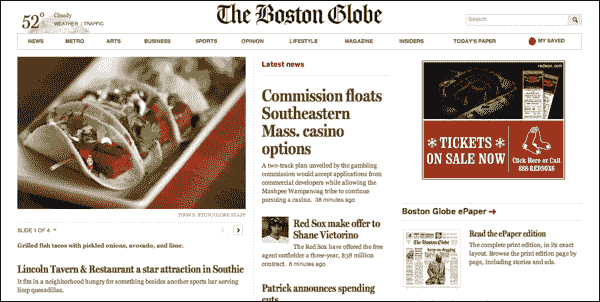

三栏布局在笔记本电脑上效果很好。但在较小的视口中，设计会调整以呈现为两栏内容，如下面的截图所示：

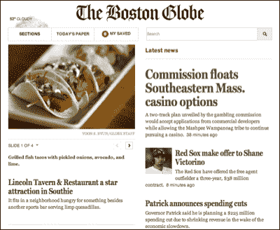

两栏布局与三栏布局是同一个 HTML 页面。两个页面的内容（文本、图像、媒体等）是相同的。环球报的工作人员不必为平板电脑或智能手机构建单独的主页。但是一个媒体查询已经链接了一个不同的 CSS 文件，在较窄的视口中显示。

## 媒体查询的简史

回顾一下，目前（CSS3 之前）的 CSS 版本已经可以检测媒体，并根据媒体启用不同的样式表。此外，Dreamweaver CS6（也适用于 CS5.5、CS5 和之前的版本）为这些功能提供了非常好的直观支持。

在 Dreamweaver 中的工作方式是，当你在 Dreamweaver 的**文档**窗口中打开一个网页时，点击**CSS 样式**面板底部的**附加样式表**图标，**附加外部样式表**对话框就会出现。

对话框中的**媒体**弹出窗口允许你附加一个专门设计用于打印、听觉（由读者软件朗读）、盲文、手持设备和其他“传统”输出选项的样式表，以及较新的基于 CSS3 的选项。在 CSS3 之前，**手持设备**选项如下截图所示是可用的：

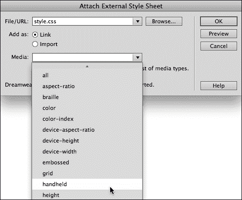

因此，总结演变路径，检测媒体并为该媒体提供自定义样式并不是 HTML5 及其伴侣 CSS3 的新功能，Dreamweaver CS6 中也支持这些功能。在 Dreamweaver 中已经可以检测并同步具有定义媒体的样式。

然而，相对较新的是检测并为特定屏幕尺寸提供定义的样式表的能力。这一新功能为特定媒体的定制页面设计打开了新的可能性。

## HTML5、CSS3 和媒体查询

使用 HTML5 和 CSS3，媒体查询已经得到了扩展。我们现在可以定义各种选择样式表应用于查看环境的条件，包括方向（手机、平板等是纵向[上下]还是横向[侧向]视图）、设备是否显示颜色、查看区域的形状，以及最有价值的是查看区域的宽度和高度。

所有这些选项都提供了为不同的查看环境创建自定义样式表的多种可能性。实际上，它们打开了一个非常庞大的可能性数组。但对于大多数设计师来说，简单地创建三个适当的样式表，一个用于笔记本/台式机查看，一个用于手机，一个用于平板电脑，就足够了。

为了定义在某个环境中显示哪个样式表，HTML5 和 CSS3 允许我们使用`if-then`语句。因此，例如，如果我们正在为平板电脑分配样式表，我们可能会指定，如果查看区域的宽度大于手机的宽度，但小于笔记本屏幕的宽度，我们希望应用平板电脑样式表。

## 为移动设备和平板电脑设计样式

虽然在本书的使命范围内，对于为不同媒体创建样式的审美维度进行全面探讨是不可能的，但值得注意的是，在为移动设备设计样式时，有一些基本的“应该”和“不应该”。

稍后在本章中，我将提供更详细的移动设备样式建议，但总的来说，挑战是：简化。一般来说，这意味着对你的页面应用以下许多或所有的调整：

+   较小的边距

+   更大（更易读）的字体

+   更简单的背景；没有图像背景

+   没有侧边栏或浮动内容（其他内容环绕的内容）

+   通常没有定义页面宽度的容器

### 注意

**在线设计建议**：如果你在网上搜索“移动设备的 css”，你会找到成千上万篇文章，其中包含不同的观点和建议，用于设计可以轻松在手持设备上访问的网页。

## 媒体查询与 jQuery Mobile 和应用程序

在转向使用媒体查询构建具有响应式设计的页面的技术维度之前，让我简要比较和对比一下媒体查询和另外两种用于在全屏和移动设备上显示内容的可用选项。

一个选项是**应用程序**。应用程序是用高级编程语言创建的完整的计算机程序。Dreamweaver CS6 包括了与在线 PhoneGap 资源连接和生成应用程序的新工具。我们在本书的最后一章第十章中对这个过程进行了比较深入的介绍，*使用 PhoneGap 构建应用程序*。

第二个选项是 jQuery Mobile 站点。jQuery Mobile 站点是基于 JavaScript 的。但是，正如我们将在本书后面看到的那样，您不需要了解 JavaScript 就可以构建 jQuery Mobile 站点。jQuery Mobile 站点和具有移动友好设计的媒体查询站点之间的主要区别在于，jQuery Mobile 站点需要不同的内容，而媒体查询站点只是使用不同的样式表重新包装相同的内容。

您应该使用哪种方法，媒体查询还是 JavaScript？这是一个判断。我在这里可以提供建议的是，媒体查询提供了创建和维护站点的移动版本的最简单方式。

# 使用 Multiscreen Preview 进行预览

Dreamweaver 的 Multiscreen Preview 提供了一个即时（虽然不精确）的预览，显示网页在三种不同的视图环境中的外观。

要在**Multiscreen Preview**中查看打开的网页，可以转到**View** | **Toolbars** | **Document**，或者从**Document**窗口菜单中转到**Window** | **Multiscreen Preview**。这样做时，**Multiscreen Preview**窗口会打开，并显示三个视图，如下截图所示：

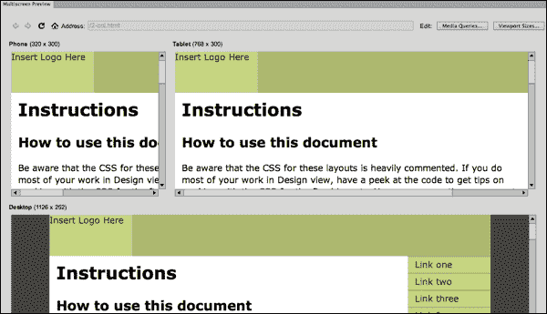

Multiscreen Preview 是一种实时预览。您不能在那里编辑内容，只能预览页面在浏览器中的外观。然而，正如我们将看到的那样，您可以编辑与每个视图相关联的样式表，并在 Multiscreen Preview 中观察效果。

**Multiscreen Preview**窗口中的三个预设视口尺寸提供了一组相当广泛的屏幕尺寸，用于预览打开页面在智能手机、平板电脑和桌面（或屏幕宽度为 1024 像素或更多的全尺寸笔记本电脑）上的外观。这些宽度设置是一种很好的、一般的预览方式，可以预览页面在不同媒体中的外观。

另一方面，如果您正在为特定的视图环境进行设计，可以自定义这些设置。要做到这一点，点击**Multiscreen Preview**窗口右上角的**Viewport Sizes**按钮。这将打开**Viewport Sizes**对话框。您可以通过更改**Width**或**Height**框中的值，并点击**OK**来更改三个可用视图中的任何一个的宽度（以及手机和平板电脑的高度）。

在**Viewport Sizes**对话框中，您可能进行的最有用的调整实际上可能是**Phone**预览的高度。通过将该值稍微增加，您可以更好地了解页面在具有更长视图屏幕的智能手机上的外观。在下面的截图中，**Phone**预览窗口的高度正在更改为**480**像素：

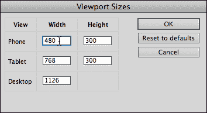

当您首次预览页面时，您很可能不会喜欢手机和平板电脑预览窗口中的外观。此时，您可以选择以下两种方法：

+   选择不担心页面在移动设备上的外观和功能，假设这个移动设备是一个很快就会消失的过时潮流

+   您可以使用 Dreamweaver 生成媒体查询，以在移动设备上呈现更具吸引力、易访问的内容

假设您选择了后者，让我们继续探讨如何为手机和平板电脑显示创建样式表，并在适当的环境中应用这些样式表。

# 在 Dreamweaver CS6 中生成媒体查询

有许多有效的方法和可能的协议可用于在 Dreamweaver CS6 中生成媒体查询的样式集。在介绍一个有效方法之前，让我们先了解一下我们试图实现的目标。

### 注意

与 Dreamweaver CS5.5 相比，CS6 中创建媒体查询的工具有所增强；因此，使用旧版本 Dreamweaver 的读者会发现下面探讨的一些选项不可用。

基本上，我们需要三套样式表——一个用于手机，一个用于平板电脑，一个用于全尺寸显示器。因为在这一点上，全尺寸显示器仍然是以某种标准方式查看网页内容的，“标准”，而手机和平板电脑的样式可能会更简单，因此有意义的是首先创建一个全尺寸页面的样式表。

换句话说，第一步是创建一个基本的 CSS 样式表，使其在全尺寸台式机或笔记本电脑显示器上打开页面时能够很好地工作。然后，可以生成简化布局的页面变体，适用于手机和平板电脑。

## 构建备用样式表

正如前面提到的，从样式和可访问性的角度来看，从“全尺寸”网页样式开始，然后构建适用于手机和平板电脑的样式变体是有意义的。

还有一个使用该工作流程的技术原因。请记住，所有三个 CSS 样式表文件将为同一个页面提供样式规则。这意味着所有三个备用 CSS 文件都必须为同一组 HTML 元素和标签提供规则。

例如，如果一个`<div>`标签在页面上定义了一个主容器，三种媒体（手机、平板和台式机）的样式表都必须定义`<div>`标签应该如何显示。手机 CSS 的规则可能包括较窄的宽度、更简单的背景颜色和其他属性。但是，关键是所有三个样式表都必须为这个主容器`div`标签定义规则。对于所有的布局元素，无论是 HTML5 布局元素、`<div>`标签还是两者的组合，都必须如此。

## 准备生成媒体查询

准备生成媒体查询的一个有效协议是准备好三个可分配给不同媒体的 CSS 文件。

一个简单的准备工作协议如下：

1.  为您的页面创建一个适用于台式机或笔记本电脑尺寸显示器的基本 CSS 文件。如果您正在从 Dreamweaver CS6 的 HTML5 布局生成页面，您可以使用相应布局附带的 CSS 文件作为“主”布局。

1.  使用文件名如`full-size.css`保存“主”CSS 文件，然后再保存两次，使用两个不同的文件名（如`tablet.css`和`smartphone.css`），创建三个相同的样式表。或者，如果您只想提供两个选项（并且让平板用户看到全尺寸样式），只需保存两个版本的 CSS 文件——`full-size.css`和`smartphone.css`。

1.  保存备用样式表后，您可以在**多屏预览**菜单中自定义它们。

有了三个备用 CSS 文件可供分配和编辑，您就可以开始定义媒体查询了。接下来我们将介绍这个过程。

## 为不同媒体分配样式

利用 Dreamweaver 构建媒体查询的最佳方式是在多屏预览模式下工作。请记住，这意味着我们在调整样式时不会编辑内容。但这种限制是我们完全可以接受的，事实上，作为一种一般方法，调整内容和样式应该被视为不同的过程。

因此，我们的情景是我们已经为打开的网页打开了**多屏预览**。并且我们已经准备好了三个不同的 CSS 文件——就像本章稍早讨论的“3 步”协议中所指出的那样。

在 Dreamweaver 站点中至少保存两个 CSS 文件，并在**多屏预览**中打开网页后，按照以下步骤为每个视图定义自定义样式：

1.  单击**媒体查询**按钮打开**媒体查询**对话框。

1.  在**编写媒体查询到**区域，选择**此文档**选项。**站点范围的媒体查询文件**选项较为棘手；它涉及 Dreamweaver 更改所有页面中的代码，并且不太可靠。

1.  保留“强制设备报告实际宽度”复选框选中。这可以克服当不同设备以扭曲其实际宽度的方式定义“像素”时可能引起的混乱。在“媒体查询”对话框中的初始选择应该如下所示：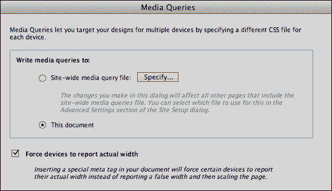

1.  单击“+”图标添加样式表。所选样式表的“属性”区域变为活动状态：

+   在“描述”字段中，输入描述样式的文本（这是为了你自己的利益，而不是公开展示）。

+   在“最小宽度”字段中，输入一个值，定义了该样式将显示的最窄视口，无论在何处都适用。如果你为智能手机定义 CSS 样式，你不需要任何最小宽度，因为该样式将适用于任何大小的视口。

+   在“最大宽度”字段中，输入一个值，定义了该样式将显示的最宽视口，无论在何处都适用。如果你为全尺寸浏览器定义 CSS 样式，你不需要任何最大宽度，因为该样式将适用于任何大小的视口。

+   在“CSS 文件”区域使用“选择文件”图标导航到并选择一个样式表文件，该文件将适用于符合定义条件的视口，如下面的屏幕截图所示：

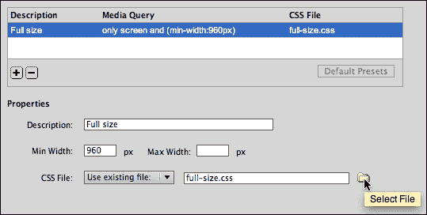

1.  重复步骤 4，为媒体查询添加其他样式表。所有相关的样式将如下屏幕截图所示列出：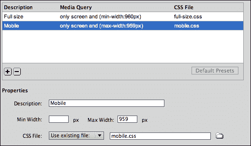

1.  单击“确定”关闭“媒体查询”对话框，并在“多屏预览”窗口中看到应用了你的媒体查询，如下所示：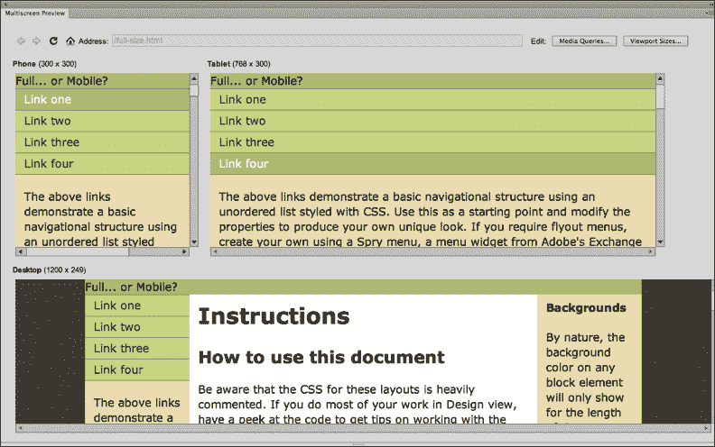

1.  在任何时候，你都可以通过选择“窗口”菜单中的“多屏预览”来切换进入或退出“多屏预览”。

# 为媒体查询格式化 CSS 文件

通过为网页定义媒体查询，我们可以交互地创建和调整每个目标浏览环境的样式。要做到这一点，重新打开页面的多屏预览。

“等等！”你可能会惊叹道，“当多屏预览窗口像文档窗口中的实时视图一样锁定任何内容编辑时，我怎么能编辑页面呢？”。这是一个值得思考的问题，但在这里我们只会编辑 CSS 样式，而不是页面内容。我们可以在“多屏预览”中做到这一点。

要在“多屏预览”中编辑样式，查看“CSS 样式”面板（“窗口”|“CSS 样式”）。附加的样式以及帮助我们记住哪种样式是哪种的括号注释显示在“CSS 样式”面板的上半部分。

你可以通过在“CSS 样式”面板的上半部分点击样式名称旁边的三角形来展开任何这些样式。在下面的屏幕截图中，`mobile.css`样式被展开。点击样式中的样式规则（在这种情况下是`body`标签样式的`font`参数）会在“CSS 样式”面板的下半部分显示该样式的参数。

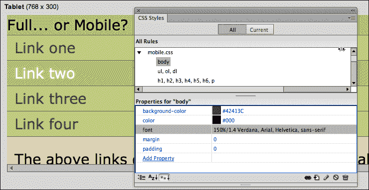

# 调整移动设备的 CSS

正如之前指出的，为移动设备设计样式的艺术，嗯，就是一种艺术。而且，正如之前建议的，有大量在线资源对手机和平板样式的包含内容提出意见和建议。但在强调移动设备样式的一些广泛认可的元素之前，重要的是要发出警告：不要从任何样式表文件中删除样式规则。

我们为媒体查询创建三种备用样式表的协议始于一个样式表，从中创建了两个副本。这些样式表以相同的样式规则集“诞生”。

更改这些样式规则的参数是可以的，也是必要的。您可以在手机样式中对容器、文本、背景等进行不同的格式设置。但请记住，您的三种样式都必须与相同的 HTML 文件相匹配，使用相同的 CSS 样式名称来定义格式和布局标签和元素。

至于移动设备的样式，以下技术是广泛适用的：

+   保持字体较大。

+   保持链接易于找到。在全尺寸的网页中，带下划线的链接已经过时，但在手机上很有帮助。

+   在容器中使用较大的边距和/或填充，以便大而粗的手指在手机屏幕上轻松选择小内容。

+   避免使用侧边栏（不要使用`float`属性）。

+   在手机样式中使用`visibility: hidden`来隐藏非必要的元素。在下面的屏幕截图中，已经将手机样式中的`visibility`设置为`hidden`，并将标题的高度减小为 1 像素，以便出于美观原因创建一条细线间距，这样它就不会占据智能手机屏幕上的宝贵空间。

下面的屏幕截图显示了在**多屏预览**中应用到同一页面的三个样式表。平板电脑视图只需要进行了一些调整，基本上是减小了布局元素（主容器、侧边栏和标题）的宽度。手机样式需要更多的试验和错误实验，包括删除所有`float`属性和减小不同元素的宽度。每个样式表也应用了不同的颜色方案，手机样式应用了非常基本的颜色方案（黑色和白色）。

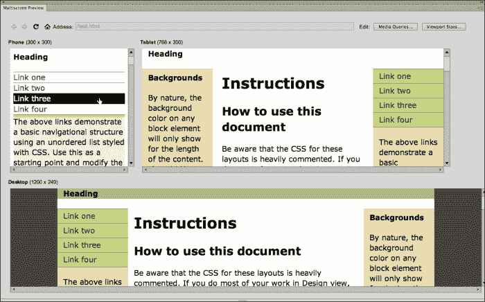

就像减肥产品的广告中所说的，“你的结果可能会有所不同。”这意味着，为手机调整样式表确实需要一些试验和错误。但基本规则仍然是：简单。通常，消除浮动（使内容不出现在第二列中）是第一步。

# 为智能手机定义媒体查询

在这个例子中，我们将逐步介绍如何使用 Dreamweaver 灵活且非常有用的三列 HTML5 布局。我们将创建一个媒体查询，以在更适合手机的布局中显示这两列内容，而不需要列或侧边栏。

一如既往，起始假设是您正在 Dreamweaver 网站中工作（如果没有，请参阅第一章, *使用 Dreamweaver CS6 创建站点和页面*）。有了定义的站点，以下步骤将为您的手机页面生成一个漂亮、适当的极简布局：

1.  转到**文件**|**新建**。在**新建文档**对话框中，选择**空白页**类别。从**页面类型**列中选择**HTML**，并从**布局**列中选择第一个 HTML5 布局，**2 列固定，居中**。在**新建文档**对话框中，将**布局 CSS**弹出选择保留在**创建新文件**。确保**附加 CSS 文件**框中没有选择任何文件（如果有，请使用**垃圾桶**图标将其删除）。设置好这些设置后，点击**创建**。

1.  **另存样式表文件为**对话框打开。将保存的样式表名称更改为`fullsize.css`，然后点击**保存**将样式表保存到您站点的文件夹中。

1.  网页在 Dreamweaver**文档**窗口中打开。让我们对内容进行两次编辑：

+   删除[`www.adobe.com/go/adc_css_layouts`](http://www.adobe.com/go/adc_css_layouts)链接。该链接过长，特别是对于手机来说。如果（在现实生活中）我们想要链接到一个具有很长 URL 的网站，我们可以通过转到**插入**|**超链接**来将链接分配给更短的文本。

+   在标题区域，键入`全尺寸...还是手机？`。

1.  转到**文件**|**保存**，将编辑后的 HTML 页面保存为`2_views.html`。

1.  接下来，我们将创建一个 CSS 文件，用于在移动设备上显示内容。转到**文件** | **新建**。在**新建文档**对话框中，从**页面类型**列表中选择**CSS**，然后单击**创建**按钮。转到**文件** | **保存**，将新的空白 CSS 文件保存为`mobile.css`。将原始的`fullsize.css`文件中的所有代码复制并粘贴到新的`mobile.css`文件中。接下来我们将编辑这些样式。

1.  返回到**文档**窗口中的`2_views.html`页面。您可以通过单击**文档**窗口顶部的**文件**选项卡栏中的文件，或者使用**窗口**菜单来执行此操作。

1.  转到**窗口** | **多屏预览**；在**多屏预览**中单击**媒体查询**按钮以打开**媒体查询**对话框。

1.  对于平板电脑和全尺寸计算机，为了举例，我们将简单地显示已附加的 CSS 文件（`fullsize.css`）。单击`+`图标添加样式表。**属性**区域将激活新样式表：

+   在**描述**字段中输入`全尺寸`。

+   在**最小宽度**字段中输入`960`。此样式将仅应用于宽度至少为 960 像素的视口。

+   将**最大宽度**字段留空。因为我们正在为全尺寸浏览器定义 CSS 样式，所以不希望设置最大宽度；无论视口有多宽，都将应用此样式。

+   在**CSS 文件**区域使用**选择文件**图标导航并选择`fullsize.css`样式表文件，该文件将应用于符合定义条件的视口。

1.  对于智能手机，我们将显示在第五步中创建的`mobile.css`文件。单击“+”图标添加样式表。**属性**区域将激活新样式表。

+   在**描述**字段中输入`移动`。

+   将**最小宽度**字段留空。此样式将应用于宽度小于 960 像素的视口。

+   在**最大宽度**字段中输入`960`。因为我们正在为手机定义 CSS 样式，所以不希望此样式表在宽度大于 960 像素的视口中显示。

+   在**CSS 文件**区域使用**选择文件**图标导航并选择`mobile.css`样式表文件，该文件将应用于符合定义条件的视口。

1.  在**多屏预览**中查看页面布局；全屏视口的布局还不错。但是页面布局和颜色在移动设备上效果不佳。让我们在页面的移动版本中进行一些调整，如下所示：

+   将`body`标签的字体大小更改为`150%`，为移动设备提供更大的文本，如下所示：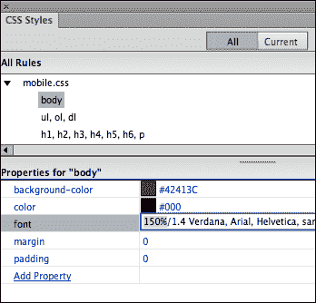

+   我们希望在我们的移动样式的每个样式规则中删除所有`width`和`float`参数。这些`width`和`float`参数会创建列，以及内容不会填满页面的整个宽度，使得在移动电话上显示变得不可访问和不吸引人。浏览`mobile.css`样式表中的每个样式，并单击`width`或`float`参数的左侧以将该代码转换为注释，如下所示：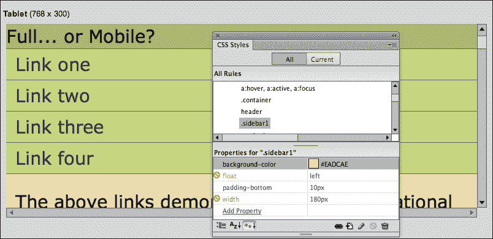

+   考虑调整颜色方案，以在移动电话用户遇到不同照明条件（包括明亮、户外和阳光）下使页面更易于阅读和导航。以下示例显示导航元素分配了更高的对比度：

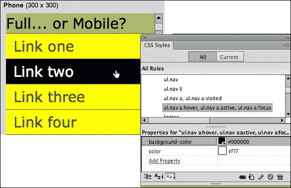

1.  就是这样！我们还可以进行更多微调，但要记住，在为移动设备设计时，少即是多。退出**多屏预览**（转到**窗口** | **多屏预览**取消选择此视图）。保存对 CSS 的更改后的页面。

# 调查替代方法

在本章中，我们专注于使用 Dreamweaver 的**多屏预览**窗口和**媒体查询**对话框创建媒体查询。

另一种定义媒体查询的方法是在单个 CSS 文件中创建它们。这种方法的优点是所有视口的样式都在同一个 CSS 文件中。缺点是这会使 CSS 文件变得两倍、三倍，甚至四倍（或更多）的长，臃肿且难以编辑。总的来说，我认为在大多数情况下，我们迄今为止采取的方法更容易管理，但由于 Dreamweaver 包含一个使用单 CSS 文件方法的大型模板，让我们看看这是如何运作的。

在 CSS 文件中定义媒体查询的语法是：

```js
@media only screen and (value)
```

值可以包括 max-width、min-width 或两者兼有。

在此示例中，`body`标签的背景颜色在`480`像素或更少的视口上为黄色，在`481`像素或更多的视口上为绿色：

```js
@media only screen and (max-width: 480px) 
{
body {  background-color: yellow;}
}

@media only screen and (min-width: 481px) 
{
body {background-color: green;}
}
```

正如我所指出的，Dreamweaver CS6 包含一个庞大而复杂的示例页面，其中包括在同一 CSS 文件中为多个视口定义样式的 CSS 文件，以及 JavaScript。

再次强调，Dreamweaver 的流体网格布局是一个具体（且复杂）的示例，例如，使用在单个 CSS 文件中为多个视口定义样式的媒体查询技术。

与所有 Dreamweaver 示例页面一样，您可以将此页面用于教育和灵感；它有很好的文档（除了 JavaScript）。如果您有兴趣查看此示例，请转到**文件** | **新流体网格布局**，并在**新文档**对话框中探索此页面示例的选项。

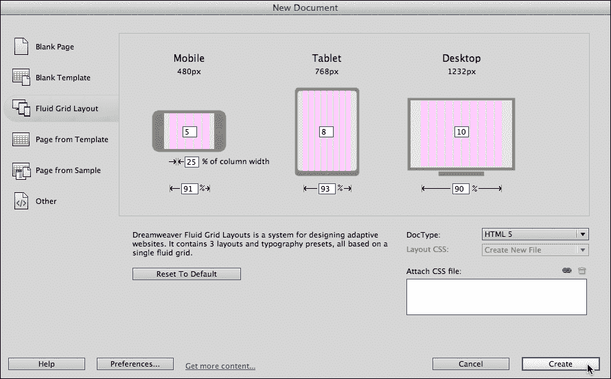

# 总结

HTML 和 CSS 的旧版本允许媒体查询识别包括打印机、盲文阅读器和音频阅读器在内的输出设备。CSS3 的新添加允许媒体查询检测屏幕大小（以像素为单位）以及浏览环境的其他更神秘的属性。

Dreamweaver CS6 的多屏预览和媒体查询对话框共同工作，预览和编辑同一 HTML 页面内容在智能手机、平板电脑和全尺寸监视器上的显示方式。

在本书的下一章中，我们将开始探索创建移动友好网站的不同方法：jQuery Mobile。jQuery Mobile 方法为移动网站提供了更动态、更有吸引力的样式，但正如您将在第七章中看到的那样，*使用 jQuery Mobile 创建移动页面*，它需要为全尺寸和移动站点分别提供内容。
