# 第七章：使用 jQuery Mobile 创建移动页面

作为网页设计顾问，我经常花时间研究统计趋势-谁在使用网络？做什么？在什么浏览环境中？但您可能不需要我的研究摘要，就知道使用移动设备的人在数量和影响上构成了网络活动的动态因素。我将分享一个统计数据，这是我从许多调查中整理出来的：随着我们的书的这一版本付印，大约一半的网站访问将来自移动设备。在娱乐和餐厅等类别中，使用移动设备进行网页浏览的数量已经是压倒性的。

他们是用网页浏览器做这个吗？还是应用程序？两者都有。但在游戏的这个阶段，移动网站为开发人员提供了一种更加可访问的技术。您可以并且将会使用 jQuery Mobile 创建完全移动设备友好的网站，看起来和感觉像应用程序，但不需要涉及构建应用程序的高级编码。

这不是我们第一次面对为多种媒体设计的挑战。在第六章中，我们开始探讨使用 HTML5 的媒体查询构建的页面，以呈现相同的内容，但在全尺寸、移动和平板尺寸的页面上具有不同的样式。在第五章中，我们探讨了使用 HTML5 音频和视频在网页中嵌入移动设备友好（非 Flash）的视频。

jQuery Mobile 页面提供了一种更激进的方法来创建移动设备友好的内容，而不仅仅是使用媒体查询和移动设备友好的视频。jQuery Mobile 页面涉及为移动设备创建*不同*、*独特*的内容（通常是更短、更压缩的内容），并以与面向台式电脑和笔记本电脑用户的网站截然不同的方式呈现该内容。我们将在下面探讨这意味着什么。

本章涵盖以下主题：

+   移动设备设计-概述

+   应用程序和移动页面

+   移动网络的三个组成部分：HTML5、CSS 和 jQuery Mobile

+   在 Dreamweaver 中使用 jQuery Mobile

+   从起始页生成移动设备就绪页面

+   自定义移动设备起始页内容

+   添加“页面”

+   自定义移动页面 CSS

# 移动页面-概述

设计移动网站所涉及的原则可以归结为一个词：简单。

移动网站的设计必须简单。人们在小型设备上查看和与它们交互。正因为如此，在笔记本电脑或台式电脑上效果良好的列、侧边栏和复杂背景在移动设备上是不吸引人和不可访问的。

在设计移动设备时，“简单”的第二个维度是，网站不能装满插件（如 Flash）、服务器端脚本（如 PHP）或复杂的导航方案。这些功能中的一些在某些移动设备上受到支持（Flash 在某些 Android 操作系统的版本中受到支持），但大多数不受支持。此外，移动设备的处理能力、电池寿命和其他限制有限，这让我们回到了关键词：简单。

一方面是笔记本电脑和台式电脑，另一方面是移动设备，它们具有完全不同的界面特点。显然，在大多数情况下，台式电脑/笔记本电脑的视口（屏幕）更宽。因此，多列页面布局不仅可能，而且通常是必要的，以呈现吸引人的内容。这在手机上并不是这样，甚至在大型平板电脑上也不是这样。

台式电脑和笔记本电脑配有鼠标或某种可以悬停在对象上的悬停设备；移动设备配有可以调整大小或滚动的触摸屏。

花些时间在全尺寸视口和移动设备上检查您喜欢的网站。您会发现，专业设计的网站有一个单独的移动页面，考虑到了这些因素。例如，YouTube 在笔记本电脑上呈现多列网格，并利用悬停来允许用户在页面上悬停在元素上时获取弹出内容。

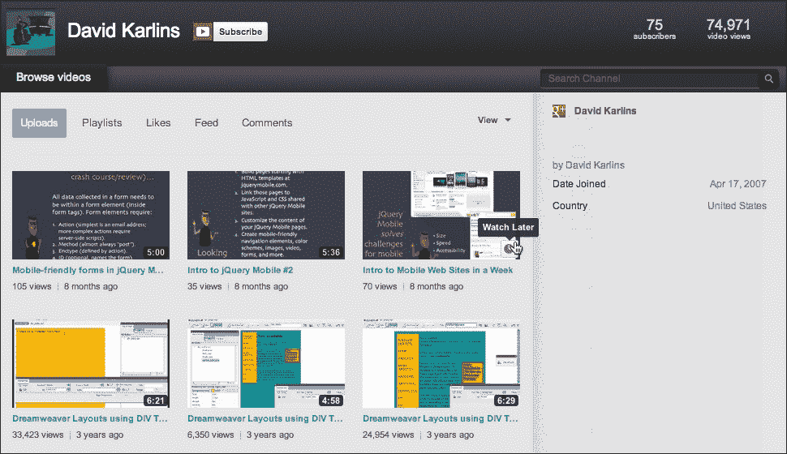

另一方面，如果您在 iPhone 上访问 YouTube，您将体验到一个不依赖悬停的单列网站。

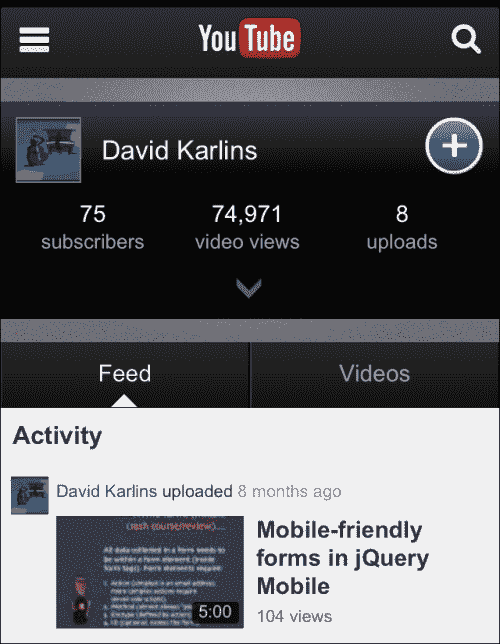

## 移动页面、应用程序和 jQuery Mobile

在本章的介绍中，我简要指出了使用响应式设计（媒体查询）、jQuery Mobile 和应用程序来呈现移动可访问页面之间的关系。让我稍微扩展一下：

+   响应式设计是从开发的角度来看，实现移动友好内容的最简单方法，因为使用这种方法，您可以在所有页面上使用相同的内容，只需呈现不同的页面布局。

+   jQuery Mobile 需要更多的工作，因为它涉及为移动页面提供不同于全屏访问者所提供的内容。另一方面，jQuery Mobile 网站有许多优势，比如：

+   它们下载速度更快

+   它们为移动用户提供了引人入胜的动画和互动

+   它们允许使用特殊的、适合移动设备的导航元素

+   它们启用在小屏幕上更好地工作的表单元素。

### 注意

本章的其余部分将带您了解它是如何工作的

+   应用程序看起来和操作起来很像 jQuery Mobile 页面，但是它们需要另一个层次的专业知识和资源来进行创建和维护。应用程序是用 Objective-C 编程语言或其他复杂的编程语言编写的。我们将在本书的最后一章深入探讨 PhoneGap。

虽然应用程序开发对于具有相对无限开发资源的主要机构或其主要目标是在 iTunes 上出售应用程序的人是有意义的，但绝大多数网站最适合使用响应式设计或 jQuery Mobile。

## 什么是 jQuery Mobile？

jQuery 是一个基于 JavaScript 的对象库。JavaScript 在任何浏览器或操作系统中都可以工作。它是一个开源（免费）软件。

好吧，JavaScript 是什么？库又是什么？

JavaScript 是一种*客户端*脚本语言。也就是说，它是一种在浏览器中运行的创建动画和互动的编程语言（“客户端”更多或多少是一个技术术语，表示浏览器）。另一种说法是：JavaScript（几乎总是）在用户的计算机上运行，而不是在服务器上。

JavaScript 一直是 Dreamweaver 的一部分，就像 Dreamweaver 存在一样。相当被遗弃的**行为**面板生成 JavaScript。Spry 小部件（在较早版本的 Dreamweaver 中引入）是基于 JavaScript 的。在网页设计的另一个维度中，也就是在 Dreamweaver 之外，jQuery 已经发展成为一组相对易于访问的可定制的 JavaScript 对象。现在当我说相对易于访问时，我的意思是通过 jQuery 库实现 JavaScript 仍然需要编辑 JavaScript 代码。

在我们这里使用这个词的语境中，库通常是 HTML、CSS 和编程语言的组合。从这些库中得到的是一组文件：一个或多个 HTML 文件，一个或多个 CSS 文件，以及一个或多个程序文件，用于为 HTML 和 CSS 添加动画和互动。这些文件一起工作——您需要 HTML、CSS 和程序脚本来使库元素工作。

随着移动设备的出现，出现了一个独特的 JavaScript 库——jQuery Mobile，其中包含一组在设计移动设备时特别有用的对象。

# 从 Dreamweaver 起始页创建移动页面

在 Dreamweaver 的**设计**视图中有一小部分非常重要的 jQuery Mobile 对象。它们不需要编码！其中最常用的对象已经捆绑到一个非常方便的可定制的起始页面集中。在本章中，我们将使用这些起始页创建页面，检查它们，并自定义控制这些页面的内容和外观的 HTML 和 CSS。

Dreamweaver 中的移动起始页中的 jQuery 对象本身是不可定制的。在这方面，它们与 Dreamweaver 中的 Spry 小部件有些不同，您通常可以自定义其中一些 JavaScript 本身。但正如我们将看到的，这不会是一个大问题，因为您可以通过编辑与 jQuery Mobile 对象相关的 HTML 和 CSS 来完成大部分您可以想象的自定义。

这是如何工作的？Dreamweaver 设置了工具，使我们能够自定义 jQuery Mobile 对象，而不必担心底层发生了什么。但作为非常基本的基础，了解 JavaScript（这适用于 Spry 和 jQuery Mobile 对象）是如何在 HTML 对象（例如标签，通常包括`div`标签）上工作的，或者在定义的 CSS 样式属性上工作的，这是有帮助的。

例如，当单击（或在移动设备上轻触）时，jQuery 对象可能会更改其背景颜色。但是，这些颜色——无论是之前还是之后——都是在关联的 CSS 规则中定义的，可以在**CSS 样式**面板中访问到。此外，该对象中的内容（文本、图像、媒体）是由您在 Dreamweaver 的**设计**视图中创建的 HTML 定义的。

Dreamweaver 带有三个基于 jQuery Mobile 的起始页面：**jQuery Mobile（CDN）**、**jQuery Mobile（本地）**和**带有主题的 jQuery Mobile（本地）**。您可以通过导航到**文件** | **新建**，并在左侧列中从**示例**中选择**页面**，在**示例文件夹**列中从**移动起始页**中选择这些选项，以打开**新文档**对话框。

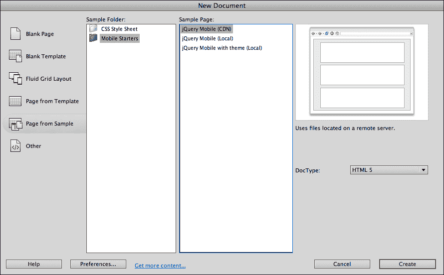

jQuery Mobile 示例页面有哪三个选项？

+   **jQuery Mobile（CDN）**使用存储和分发通过专门提供 jQuery Mobile 的**中央分发网络**（**CDN**）的 JavaScript 和 CSS 的版本。这是在 jQuery Mobile 中构建页面最可靠和稳定的方式，因为中心分发的文件不会被您的任何操作损坏。此外，随着 JavaScript 和 CSS 文件的新版本推出，您可以更新到它们的链接。缺点是，除非您在线，否则无法在 Dreamweaver 中工作于您的 jQuery Mobile 站点。

+   **jQuery Mobile（本地）**使用 Dreamweaver 提供的 JavaScript 和 CSS 版本。这些文件更容易损坏，因为它们存储在您的计算机上（并上传到您的服务器）。但是，在您没有互联网访问权限的情况下，您可以在 Dreamweaver 中使用它们来开发 jQuery Mobile 站点。

+   **带有主题的 jQuery Mobile（本地）**选项是 Dreamweaver CS6 中的新功能，是 Adobe 为了更容易编辑 jQuery Mobile 站点的主题而尝试的。主题是定义字体、颜色和其他样式选项的必需 CSS 部分。我的经验是使用其他选项更容易和可靠，并且您可以避免使用此选项。但是当我们在第九章中详细探讨自定义主题时，我们将回到这些问题。

### 提示

在大多数情况下，使用**jQuery Mobile（CDN）**选项开始创建新的 jQuery Mobile 站点。

在**新文档**对话框中单击**创建**按钮后，基于 jQuery Mobile 的网页将在 Dreamweaver **文档**窗口中打开。

## 分割视图中的移动页面

编辑和预览 jQuery Mobile 页面提出了一个特定的挑战：您无法真正看到页面的外观，而不进入实时视图，因为使页面工作的 jQuery Mobile 应用程序不会显示在实时视图中。但另一方面，您无法在打开实时视图的情况下在设计视图中编辑 jQuery Mobile 页面的内容。

处理这个挑战有两个选项：

+   您可以在“实时”视图中来回切换，关闭（编辑页面）或打开（查看页面）

+   您可以在“设计”窗口中保持“实时”视图打开，并在“代码”视图中进行编辑

在本书中，我们将使用并结合这两种技术。为此，最有用的是在分割视图中检查页面，有两个原因。在分割视图中，您既可以检查 HTML 代码，又可以看到页面预览，就像在浏览器中看到的那样。此外，您可以在较窄的预览窗口中查看页面，这将更接近模拟移动设备中页面的外观。

在为移动设备设计时，利用“设计”半部分的“分割”视图底部的“窗口大小”弹出窗口特别有用，并将“预览”窗口的大小更改为`480`像素宽——这个尺寸对应许多流行的移动设备。在 Dreamweaver 的（底部）状态栏中使用“窗口大小”弹出窗口来执行此操作。

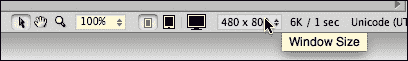

或者，您可以在状态栏中使用预设的大小按钮，用于移动设备、平板电脑或桌面大小的窗口：

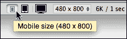

## 在实时视图中预览 jQuery Mobile 页面

当您探索由任何 jQuery Mobile 起始页面生成的模板页面时，您会立即注意到与您在 Dreamweaver 中使用的其他页面非常不同的一点；直到您打开实时视图（单击“文档”工具栏中的“实时视图”按钮），几乎没有任何格式可见。尝试来回切换，打开和关闭实时视图，查看关闭实时视图时显示和不显示的内容。

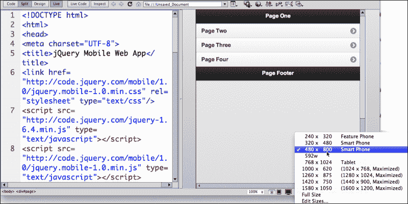

# 自定义移动页面内容

基本上，您可以像自定义任何起始页面生成的内容一样自定义 jQuery Mobile 页面内容。起始页面带有模板内容，您可以用自己的真实内容替换它。

简单吗？有点。正如我们所指出的，jQuery Mobile 页面中内容和布局之间的间隙顺序不同。换句话说，关闭实时视图后，没有任何东西与其外观接近。然而，您无法在实时视图中编辑内容。

## HTML5 数据角色属性

与 jQuery Mobile 脚本相关的 div 标签可以作为移动设备中的不同类型的元素，包括看起来和行为像页面的元素。这是通过在 HTML5 标签中实现数据角色属性，然后定义与每个数据角色相匹配的 CSS（样式表）规则来完成的。

通常情况下，这是 Dreamweaver 中起始页面的情况，jQuery Mobile 页面是使用以下四个数据角色组织和布局的：

+   页面

+   页眉

+   内容

+   页脚

## 数据角色页面

在 HTML 页面中组织页面内容的基本框架是使用具有“数据角色页面”属性的`div`标签。换句话说，在单个 HTML 页面中，通常使用`div`标签的`data-role`创建多个“页面”。

如果您查看 Dreamweaver jQuery Mobile 起始页生成的代码和页面布局，您会看到在实时视图中看起来像“页面”的实际上是`div` `data-role`页面：

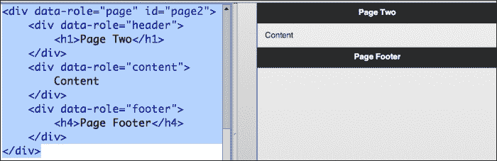

将内容组织成实际上是带有 HTML5 属性`data-role`的`div`标签，可以让人们浏览起来感觉和表现得像网页。但是这些`div`标签，就像页面一样，允许访问者在不必等待浏览器加载新页面的情况下来回跳转“页面”。使用这样的`data-page` `div`标签对于如何最好地利用移动设备上的小空间来呈现大量内容至关重要。

人们通过在移动设备上轻触、拖动或以其他方式导航来在`data-role`页面之间导航，从本质上来说是显示或隐藏不同的“页面”。您可以通过在 Dreamweaver 的实时视图中浏览 jQuery Mobile 起始页面中的“页面”来熟悉这是如何工作的。使用 Dreamweaver**文档**窗口工具栏中的**返回**按钮来模拟移动浏览设备中的**返回**按钮：

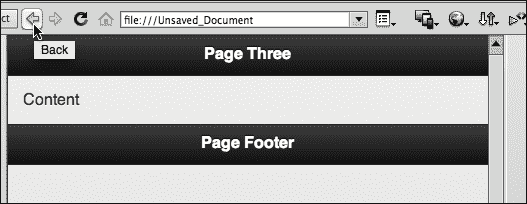

## 定制页面内容

现在您已经了解了 jQuery Mobile 页面在 HTML 页面中的组织和功能，定制起始页面中“页面”的内容将会非常自然地进行。处理这个过程的一种方法是忽略其他一切，只是用自己的内容替换 jQuery“页面”中的内容。然后，在实时视图中尝试内容，查看其流程，并根据需要编辑、移动、分割和修改内容。

使用您自己的内容替换每个页面的页眉、内容和页脚。在每个生成的页面中识别此代码：

```js
<div data-role="page" id="page2">
  <div data-role="header">
 <h1>Page Two</h1>
  </div><div data-role="content">
 Content 
</div>  
<div data-role="footer">
 <h4>Page Footer</h4>
  </div>
</div>
```

用任何 HTML5 内容替换代码中突出显示的行中的内容。

### 提示

**记住**：在您的 jQuery Mobile 页面中只使用 HTML5 内容。避免使用 Flash 等插件。此外，避免服务器端包含内容——使用服务器端脚本将数据提供到页面中——如果您使用这种方式。服务器端实时数据不是我们在本书中要探讨的内容，但如果您使用 PHP 脚本，那在 jQuery Mobile 页面中是行不通的。基本规则是：坚持使用 HTML、CSS 和 JavaScript 内容。

此外，虽然我主张最大限度地利用 Dreamweaver 中的设计视图，部分原因是 jQuery Mobile 页面中内容和格式之间的巨大差距，但我不得不承认，我通常会在分割视图的代码侧创建 HTML 内容，并在设计侧打开实时视图。

## 为不同的数据角色定制内容

一般来说，定制“页面”的内容的过程将包括浏览和定制页面的页眉、内容和页脚部分。

jQuery Mobile 页面还使用`listview`数据角色来组织一组链接。这些链接——一般来说——是 HTML 页面中到其他数据角色“页面”的链接。更常规的 HTML 术语来说，这些是指向命名锚点的链接。通过检查起始页面附带的默认（内部）列表视图链接集，您可以看到它们是如何设置的。正如您将看到的，默认情况下，它们链接到`#page2`、`#page3`和`#page4`；您可以复制并粘贴这些链接以创建更多链接到更多“页面”。我们将在下面详细探讨这个过程。

# 添加新的 jQuery Mobile 页面和对象

jQuery Mobile 起始页面带有四个页面和四个页面的链接。这是一个不错的数字，但如果您想要五个、六个或七个页面呢？

如果您需要添加更多“页面”，可以复制、粘贴并轻微编辑（更改页面编号）定义每个“页面”的 HTML 代码部分。在定制内容时，切换实时视图的开关，以查看页面在浏览器中或作为应用程序时的外观，使用**窗口大小**弹出窗口定义预览环境。

在复制和粘贴以创建新页面时，您需要做以下事情：

在页面顶部的列表中复制并粘贴一个链接，并更改`xxx`。因此，例如，当您创建第五个页面时，该代码将添加到第四个页面之后的列表中，如下所示：

```js
<li><a href="#page4">Page Four</a></li>

       <li><a href="#page5">Page Five</a></li>
```

正如您所看到的，列表中复制的代码中有两处更改。

您需要通过复制和粘贴生成的`page4`来创建一个新页面，并创建一个`page5`。选择并复制定义`page4`的代码。

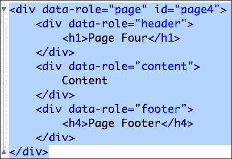

然后将该代码粘贴到**page4**的**data-role**属性的结束`</div>`标记之后。将`id`值更改为`page5`。

显然，您将希望在新页面的页眉、内容和页脚部分创建自定义内容。但是，为了使您在页面顶部列表中创建的链接起作用，您还需要确保更改页面 ID 以匹配您在页面顶部列表中定义的`href`链接。

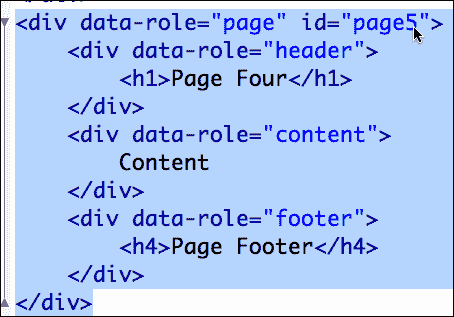

Dreamweaver 有一个菜单选项用于添加新页面。要使用该选项，导航到**插入** | **jQuery Mobile** | **页面**。**jQuery Mobile Page**对话框将出现，并提示您在最后一个现有页面后添加一个页面。复选框选项允许您在页面上包括页眉和页脚（或不包括）：

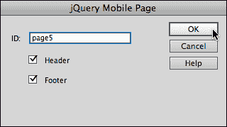

我想在介绍此对话框选项之前向您展示代码，这样您就能更好地了解发生了什么，但是在这样做之后，我鼓励您使用对话框以节省时间。

# 使用主题样式

jQuery Mobile 库中的 CSS 文件有五种主题样式。稍微技术一点，这五种主题样式都内置在单个 CSS 文件中。它们的名称分别是`a`、`b`、`c`、`d`和`e`。这些主题样式中的每一个都为页面背景和字体颜色提供了不同的、适合移动设备的（高对比度）颜色方案。

简而言之，这意味着您不会像为普通网页那样通过编辑 CSS 来为 jQuery Mobile 页面应用样式。相反，您需要更改 HTML，将五种主题样式中的一种应用于页面上的任何元素。

被限制在五种主题样式中有点束缚吗？是的。但我们将在第九章中解决这个问题，通过创建我们自己的自定义主题样式。首先，让我们熟悉一下应用主题样式。

## 应用主题

在 jQuery Mobile 中，“主题”到底是什么？jQuery Mobile CSS 文件中内置了主题：`a`、`b`、`c`、`d`和`e`。再次强调，这些不是单独的 CSS 样式表文件；它们是 CSS 文件中的主题（有时称为样式），每个主题都有不同的颜色方案。

您可以使用 HTML5 中的`data-theme`属性来定义应用于任何元素的 jQuery Mobile 主题。您可以使用**jQuery Mobile Swatches**面板为任何选定的元素分配一个主题样式。

通过导航到**窗口** | **jQuery Mobile Swatches**来查看面板。单击页面中的任何元素，然后单击一个样式来将该颜色方案分配给该元素。顺便说一句，这在打开实时视图时也可以使用。

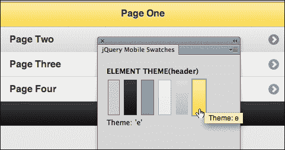

您可以手动编写主题。例如，要将主题`e`应用于具有`page` ID 的页面，请使用以下代码：

```js
<div data-role="page" id="page" data-theme="e">
```

或者举个例子，如果您希望将主题`a`应用于页面上的内容元素，请使用以下代码：

```js
<div data-role="content" data-theme="a">
```

## 编辑 jQuery Mobile 页面中的 CSS

由于 jQuery Mobile 页面中的大部分格式依赖于作为 jQuery Mobile 库一部分的中央 CSS 文件，因此您定义自定义 CSS 的选项非常有限。使 jQuery Mobile 页面工作的 CSS 文件非常复杂，包含数百种 CSS 样式。编辑该样式表文件可能会破坏整个包，并使您的 jQuery Mobile 页面无法正常工作。

如果您是高级 CSS 编码人员，可以将自己的 CSS 样式附加到 jQuery Mobile 软件包中提供的文件中。但同样，通过使用自定义 jQuery Mobile 主题，可以实现高度定制化，这是我们将在本书的第九章中探讨的内容，*使用 ThemeRoller 自定义主题*。

话虽如此，如果您确实想要“深入了解”，这里有一些关于为 jQuery Mobile 页面创建自己的 CSS 样式的建议：

+   您可以识别和编辑`div`标签的样式-主要是`class`样式-以重新格式化内容容器和其他对象。

+   您可以在 CSS 对话框中识别和编辑元素（标记）规则。例如，您可以重新定义标题和段落标记。

+   在应用前述两种方法时，您可以借鉴并应用第二章中探讨的技术，*使用 HTML5 进行页面结构*，只是您还必须额外考虑 jQuery Mobile 页面中的许多对象（`class`样式）具有每个五个主题的特定规则。

有了这三条建议，精通 CSS 编码的读者可能想要创建自己的 CSS 样式，以增强 jQuery Mobile 包中提供的样式。

# 示例-使用 jQuery Mobile 对象构建移动网页

为了回顾和强化本章中的概念，并为您提供一组快速步骤来创建自己的 jQuery Mobile 页面，让我们通过一个示例来演示。

与 Dreamweaver CS6 中的所有操作一样，前提是您正在一个定义好的 Dreamweaver 站点上工作。我称我的站点为`jqm`，但无论如何，如果创建站点，如果过程的基本性质不清楚，请查看第一章中的内容，*使用 Dreamweaver CS6 创建站点和页面*，并创建站点。

1.  通过导航到**文件** | **新建**来创建一个新的 jQuery Mobile 页面。

1.  在**新建文档**对话框中，选择**类别**列中的**示例**中的**页面**，**示例文件夹**列中的**Mobile Starters**，以及**示例页面**列中的**jQuery Mobile（CDN）**。然后单击**创建**。

1.  将页面保存为`index.html`。

1.  通过选择**分割**视图，将**设计**视图**窗口大小**设置为`480`像素宽和`800`像素高，并查看您的**CSS 样式**面板，设置一个方便的工作空间。

1.  向您的 jQuery Mobile 网站添加第五个页面元素。要将该页面插入到站点的末尾，请在**代码**视图中单击以将插入点放置在关闭的`</body>`标记之前。

1.  通过导航到**插入** | **jQuery Mobile** | **页面**来插入新的页面元素。**jQuery Mobile 页面**对话框将显示，并提示您添加**第五页**。保持选中复选框选项，以在页面上包括页眉和页脚。

1.  即使 Dreamweaver 添加了第五个页面元素，您仍然需要从主页创建到该元素的链接。在 jQuery Mobile 网站的主页上复制并粘贴**第四页**链接。将链接文本更改为**第五页**，并在**属性**检查器中将链接更改为**#page5**。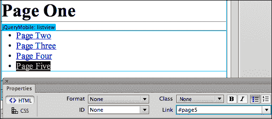

1.  为每个页面自定义页面内容。需要一些示例灵感吗？前往维基百科的濒危物种页面，将其中一些文本（和图片）复制粘贴到各个页面中。当您从维基百科（或其他来源）复制和粘贴文本时，导航到**编辑** | **特殊粘贴**以启用**特殊粘贴**对话框，并选择**仅文本**选项，以避免在将文本粘贴到 Dreamweaver 中时复制链接和样式。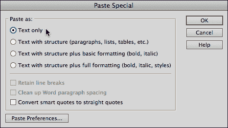

1.  检查您主页元素上的链接是否有效。如果您为四种濒危物种设置了页面，主页应该有指向每个页面的链接。并确保在页脚中适当地标明维基百科的来源。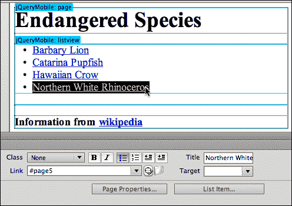

1.  在实时视图中测试您的网站。单击主页元素上的每个链接应该打开四个附加页面元素中的一个。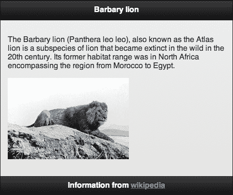

1.  确保**jQuery Mobile Swatches**面板是打开的（如果没有，请导航到**窗口** | **jQuery Mobile Swatches**）。

1.  在打开实时视图的情况下，系统地逐个选择元素并为每个元素应用主题颜色。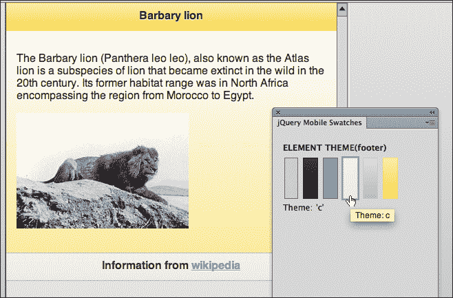

1.  保存您的页面并导航到**文件** | **在浏览器中预览**。在浏览器中测试您的页面。在开发环境（笔记本电脑或台式电脑）中测试浏览器虽然不能完全复制移动体验，但它提供了一个足够好的测试环境。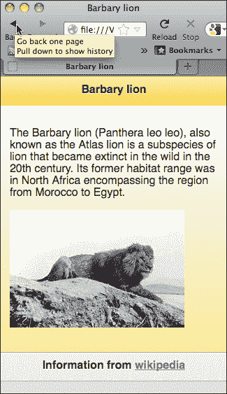

# 摘要

在本章中，我们介绍了在 Dreamweaver CS6 中创建完整 jQuery Mobile 页面的基本元素。这些“页面”是两个层面的页面。在一个层面上，它们是使用 HTML5 的常规 HTML 页面（结合了通过 jQuery Mobile 提供的 CSS 和 JavaScript）。在另一个层面上，这个 HTML 页面有 jQuery 数据页面，基本上是页面中的页面。这种技术允许我们创建一个移动网页，访问者可以在不必等待其移动设备加载其他页面的情况下进行导航。

为了创建这个 jQuery Mobile 页面（带有一组数据页面），我们依赖 Dreamweaver 的起始页面。这个页面包括许多最常用的 jQuery Mobile 元素。还有其他有用的 jQuery Mobile 页面元素，我们将在下一章中探讨。

您可以像编辑任何 HTML5 页面一样编辑 jQuery Mobile 页面的内容。因此，在前几章中掌握定制 HTML5 页面内容的基本技术所付出的所有努力都在这里得到了回报。然而，由于页面格式和导航在很大程度上依赖于 JavaScript（特别是 jQuery Mobile 库中的脚本），您需要更多地依赖实时视图来查看页面与普通 HTML5 页面的外观差异。

在 jQuery Mobile 中，编辑样式受到限制，因为 jQuery Mobile 页面涉及许多 CSS 规则，jQuery Mobile CSS 是按主题组织的。在本章中，您学会了应用主题样式。在第九章中，我们将探讨如何创建自定义主题。

在本章中，您学会了创建基本的 jQuery Mobile 页面，为创建非常复杂的 jQuery Mobile 站点奠定了基础。在下一章中，我们将探讨创建更复杂的 jQuery Mobile 页面的其他工具。
