# 第九章：使用 ThemeRoller 自定义主题

在我们的旅程的这个阶段，我们已经探索了使用 Dreamweaver CS6 创建基本和更复杂的 jQuery Mobile 页面的结构。还缺少什么？样式！我们还没有自定义字体、字体颜色、背景以及我们在本书早期章节中学习的其他所有事物。

但是，当我们为 jQuery Mobile 页面设置样式时，普通的 CSS 样式规则只在非常有限的意义上适用。为什么？因为 jQuery Mobile 页面依赖于一个集中式、相当庞大的 CSS 样式表文件。该文件包括五套配色方案。在本章中，你将学习如何在 Dreamweaver CS6 中应用这些配色方案。

但是五套配色方案并不多。为了严肃地自定义 jQuery Mobile 页面的外观，有必要改变主题，这又是说你必须自定义集中分发的 CSS 样式表。在本章的后半部分，我们将介绍如何使用 Adobe 支持的在线实用程序**ThemeRoller**创建自定义 CSS 文件和主题。

将涵盖以下主题：

+   在 Dreamweaver 中理解使用 jQuery Mobile 主题进行格式化

+   将 jQuery Mobile 主题应用于页面元素

+   将 jQuery Mobile 主题应用于页面内的特定元素

+   使用 ThemeRoller 自定义 jQuery Mobile 主题

# 应用 jQuery Mobile 主题配色

有五个标准的 jQuery Mobile 数据主题（或简称主题）。它们是：a，b，c，d，还有，你可能已经猜到了，e。这五个标准主题内置在我们链接所有 jQuery Mobile 页面的大型集中式 CSS 样式表文件中。

### 提示

如果你检查 CSS 文件，你会发现该样式表中的大多数 CSS 样式都在样式名称中有`-a`，`-b`，`-c`，`-d`或`-e`。

再次，这里的基本概念是，五个主题配色（a、b、c、d 和 e）都存储在每个 jQuery Mobile 页面链接到的单个 CSS 样式表文件中。这个链接内置在 Dreamweaver 生成的 jQuery Mobile 页面中。

## 检查五个数据主题

在印刷书籍中，甚至在我们的电子书版本中，都不可能提供五个默认 jQuery Mobile 主题配色的动态、动画、交互式演示。了解它们如何工作的最佳方法是执行以下操作之一：

+   在 Dreamweaver 中将它们应用到页面

+   在 jQuery Mobile 网站上查找它们，你可以与并比较所有五个主题，如下图所示：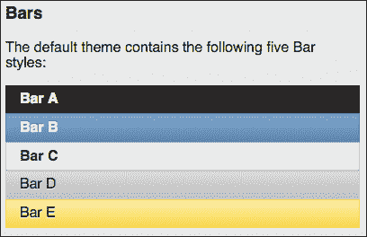

### 提示

展示这些主题配色的 jQuery Mobile 页面的 URL 会定期更改。但你可以在[www.jquerymobile.com](http://www.jquerymobile.com)找到它。网站的主页上会有一个链接，可以轻松地从网站的主页访问到该网站的主题框架部分。

作为快速的文本参考，以下是每个主题的简化描述：

+   主题*a*是一种高对比度的、以深灰色为基础的配色方案，在各种光照条件下都可以访问。

+   主题*b*是一种白色文字在蓝色背景上的风格，不太易访问，但仍然高对比度。

+   主题*c*有点像主题*a*的反面。它呈现的是深灰色文字在浅灰色背景上，而不是白色文字在深灰色背景上。

+   主题*d*与主题*c*几乎无法区分，但对比度更高，背后是白色而不是浅灰色的背景。

+   主题*e*具有黄色到橙色的渐变背景，比其他主题更具吸引力和更乐观。

要在 Dreamweaver CS6 中应用主题配色，按照以下步骤进行：

1.  定义了你的 Dreamweaver 站点后，导航到**文件** | **新建**以打开**新建文档**对话框。

1.  在左侧的**类别**列中选择**示例** | **页面**，在**示例文件夹**列中选择**移动起始页**，在**示例页面**列中选择**jQuery Mobile (CDN)**，然后单击**创建**生成一个新页面。

1.  打开 jQuery Mobile 页面后，使用**分割**视图，并打开**实时**视图。

1.  保存页面。我们将在一会儿使用 Dreamweaver CS6 的**jQuery Mobile Swatches**面板，该面板要求您先保存页面。保存页面后，导航到**窗口** | **jQuery Mobile Swatches**以显示**jQuery Mobile Swatches**面板。

1.  单击五个可用的主题样本中的任何一个（最左边的样本不分配主题），如下面的屏幕截图所示：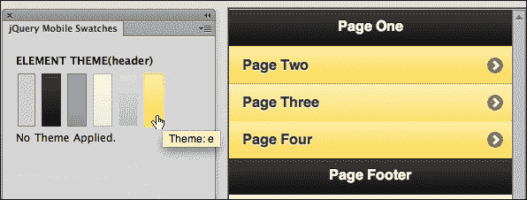

您还可以在**代码**视图中为任何元素分配数据主题。使用以下语法应用 jQuery Mobile 主题：

```js
data-theme="x"
```

其中`"x"`是`a`、`b`、`c`、`d`或`e`。以下是将数据主题`e`应用于第一个页面元素的示例：

```js
(<div data-role="page" id="page" data-theme="e">
```

该数据主题代码可以应用于任何 jQuery Mobile 元素。在**代码**视图中编辑数据主题后，单击**文档**工具栏中的**刷新**按钮以刷新视图，如下面的屏幕截图所示：

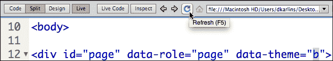

### 注意

在 CS6 之前的 Dreamweaver 版本中，用户将无法访问**jQuery Mobile Swatches**面板，并且必须在代码视图中应用数据主题，如前面所讨论的。

## 将主题应用于特定元素

当您将数据主题应用于整个页面元素时，您为该页面元素定义了一个颜色方案。但您还可以将数据主题应用于数据页面中的任何元素，以精确调整每个元素的外观。

但是这里有一个挑战；只有在 Dreamweaver 中打开**实时**视图时，您才能看到数据主题的外观。然而，打开**实时**视图后，很难选择要应用主题的元素，因为通常当您单击一个元素（例如**列表**视图中的链接）时，链接会起作用，您将不再在预览窗口中看到它。因此，我通常建议依靠**代码**视图来应用数据主题。

例如，您可以为默认情况下使用我们的 jQuery Mobile 示例页面生成的主要`listview`分配数据主题（在 jQuery Mobile 网站的第一个页面元素中）。为此，在**分割**视图的**代码**侧中，找到以下代码：

```js
<ul data-role="listview">
```

要应用数据主题`b`，我们可以将此参数添加到`listview`中：

```js
<ul data-role="listview" data-theme="b">
```

保存您的页面并在**实时**视图中查看效果。

您可以将数据主题应用于*任何*元素。这包括`listview`中的元素。例如，我们可以为`listview`中的每个列表项分配不同的数据主题。为此，在第一个页面元素的三个`<li>`标签中添加数据主题定义。以下代码分别将数据主题`c`、`d`和`e`应用于列表元素：

```js
<li data-theme="c"><a href="#page2" >Page Two</a></li>
<li data-theme="d"><a href="#page3" >Page Three</a></li>
<li data-theme="e"><a href="#page4" >Page Four</a></li>
```

# 使用 ThemeRoller 自定义主题

如果每个网站都受到 jQuery Mobile CSS 文件中提供的五个默认主题的颜色选项的限制，移动世界将会变得相当沉闷、墨守成规。

创建自定义主题的最易于访问和强大的工具是 ThemeRoller。ThemeRoller 是一个在线应用程序，将一组样本组合成一个主题。ThemeRoller 最多创建 26 个单独的样本。

### 注意

**主题和样本**

五个 jQuery Mobile 主题样本（`a`、`b`、`c`、`d`和`e`）通常被简称为主题。但从技术上讲，这些颜色和图形元素集合是主题内的样本。jQuery Mobile 主题实际上是与 jQuery Mobile 包相关联的 CSS 样式表中的一组样本。

## 移动颜色方案的美学

在让您自由在 ThemeRoller 中创建自定义主题之前，让我回顾一下为移动设备设计有效、吸引人和易于访问的颜色方案的一些基本规则。

+   所有网页设计颜色方案都是围绕一组五种颜色构建的。这五种颜色可以是您选择的任何一组颜色。但将该组限制为五种的原因是，更少会很无聊，而超过五种颜色会产生视觉混乱，太多的颜色没有连贯性或目的。

+   中性颜色，如白色、黑色、各种灰色和蓝色，不算作五种颜色之一。使用它们的数量取决于需要。

+   移动站点需要高对比度的颜色方案。在强烈背光的笔记本电脑上，石板灰色文本可能是用户在细微调光环境中的有效颜色方案。但在明亮的阳光下，这种颜色方案看起来就像一个黑色的实心块。

+   使用渐变混合将一个颜色流入另一个颜色，使移动站点更具吸引力。

在专业移动设计工作流程中，设计师选择一个颜色方案，并为您提供一组五种颜色的颜色值。

## 启动 ThemeRoller

您可以通过单击**jQuery Mobile 样本**面板底部的**获取更多主题**链接来启动 ThemeRoller，如下面的屏幕截图所示：

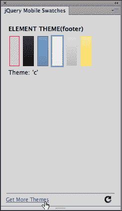

或者（或者如果您使用的是较旧版本的 Dreamweaver），您可以直接在浏览器中导航到 jQuery Mobile 的 ThemeRoller 页面，网址为[`jquerymobile.com/themeroller/`](http://jquerymobile.com/themeroller/)。

### 提示

ThemeRoller 是一个在线的开源项目，已经被 Adobe Dreamweaver 采用，但并不是其一部分。因此，ThemeRoller 不像 Dreamweaver 这样的传统软件应用程序那样稳定和易于可靠地记录。这意味着我在这里写的关于 ThemeRoller 的内容在您阅读本书时通常是准确的，但您应该期望 ThemeRoller 发展中会有一些差异。我会为此做好准备。也就是说，ThemeRoller 是一个非常强大的工具。它允许我们完全定制 jQuery Mobile 站点的外观和感觉。它相对容易使用，并且为我们作为开发人员可以为网站增加实质价值。

正如前面的提示所强调的，ThemeRoller 是一个不断发展的在线资源，因此您的屏幕看起来可能与下面的屏幕截图有些不同，但基本上是一样的。如果出现**开始**按钮，如下面的屏幕截图所示，请单击该按钮使信息框消失，并开始在 ThemeRoller 中工作。

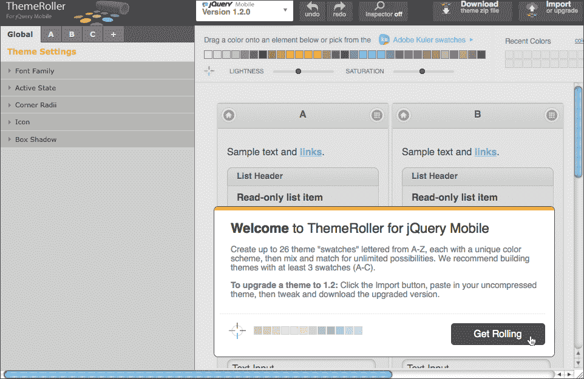

## 定义全局主题属性

在 ThemeRoller 中定义主题有两个部分：**全局**和**样本**。全局属性包括适用于*所有*样本的属性，如字体。颜色方案由样本定义。

您可以使用**ThemeRoller**窗口左上角的选项卡在全局元素和单独的样本之间导航，如下面的屏幕截图所示：

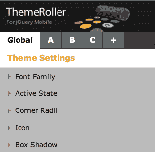

通常，首先定义自定义主题的全局主题属性是有意义的。

全局主题设置包括以下内容：

+   **字体系列**：这让您选择一组字体，从您首选的显示字体开始，就像您在普通网页的`<body>`标签中定义 CSS 字体系列属性一样

+   **活动状态**：这组选项控制活动链接的显示

+   **角半径**：此设置定义了圆角框的角半径大小

+   **图标**：此选项定义图标的颜色和样式

+   **框阴影**：这些设置控制应用于框的任何投影的颜色、不透明度和大小。

所有这些属性都是为您的整个 jQuery Mobile 页面定义的，即站点中的所有元素（包括页面元素）。它们必须是全局的。为什么？想想`listview`上的角半径，例如。如果不同颜色样本中的角半径不同，您分配给它的颜色将会影响`listview`的形状。

要在**ThemeRoller**应用程序窗口左侧的**Global**选项卡中编辑全局主题属性，请单击与该属性相关联的展开三角形以查看可用选项。

一些全局主题设置非常重要，其他更加隐晦。**Font Family**、**Corner Radii**和**Box Shadow**是对您的自定义主题影响最大的三个属性。

要更改定义的字体系列，请在**Font Family**选项卡的**FONT**字段中输入新的字体（用逗号分隔）。当您在字段外单击时，编辑后的字体系列将显示在右侧预览窗口中，如下面的屏幕截图所示：

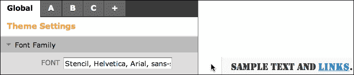

您可以使用**Corner Radii**区域中的滑块（或输入值）来更改分配给框和按钮的曲率。同样，当您在字段外单击时，您的设置将在右侧窗口中预览。

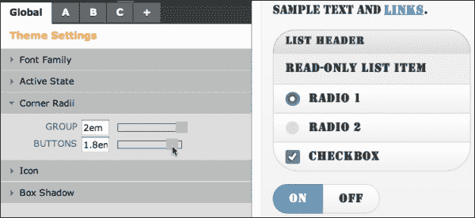

在**Box Shadow**区域，您可以在**COLOR**框中选择阴影颜色；在**OPACITY**框中选择不透明度百分比（100％是最深的阴影，0％是没有阴影）；并在**SIZE**框中选择大小（以像素为单位）。

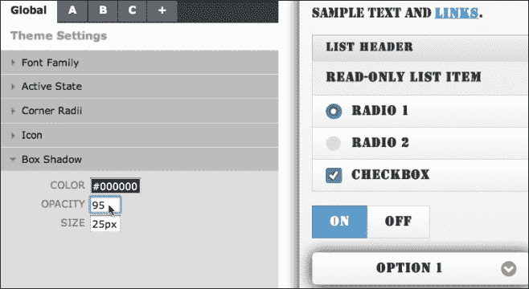

## 定义自定义样本

样本是样式表中定义 jQuery Mobile 站点的一组格式选项。您可以向自定义主题添加多达 26 个自定义颜色样本。您可以为每个样本自定义标题、页脚和内容样式以及按钮状态样式。

让我们从创建一个过程开始。如前所述，您可以通过从**ThemeRoller**页面左上角的选项卡集中选择该选项卡来访问定义特定样本的颜色（和其他属性）的界面。

要自定义标题和页脚，请展开**ThemeRoller**窗口左侧的**Header/Footer Bar**面板。执行以下步骤来为标题和页脚栏定义颜色样本：

1.  点击**文本颜色**样本。使用外环点击一个接近你想要应用于标题和页脚文本的颜色，并使用内部渐变来微调你的选择。您点击的颜色将转换为**文本颜色**框中的十六进制值，如下面的屏幕截图所示：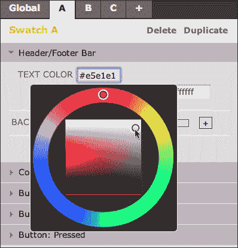

1.  文本阴影用于在文本周围生成微妙的轮廓，以便更清晰地显示。接受极简主义的默认设置（水平阴影，0px；垂直阴影，1px；模糊，1px；颜色，白色）是很好的选择。

1.  要设置背景颜色，您可以定义一个纯色（与您在步骤 1 中定义文本颜色的方式相同）。但是，渐变背景是移动站点的特色，因此请考虑生成一个。为此，请点击**BACKGROUND**标签右侧的加号（**+**）图标，展开选项。选择渐变的**START**和**END**颜色，如下面的屏幕截图所示：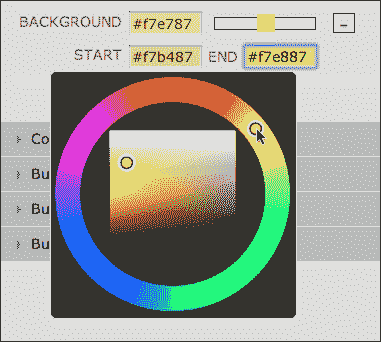

1.  为内容主体区域（即由`<body>`标签或`<content>`元素覆盖的区域）定义颜色与定义标题或页脚颜色非常相似。最大的区别在于，您可以通过展开样本的**Link Color**部分来定义链接状态颜色。点击**Link Color**旁边的加号（**+**）图标，并为每个链接状态定义颜色。您可以为三个按钮状态定义文本颜色（和阴影）、背景颜色和边框颜色。正常状态在按钮未悬停或按下时显示。请记住，大多数移动设备，因此无鼠标的移动设备，无法充分利用悬停状态。

1.  您可以使用我们迄今为止探讨的相同技术来定义特定文本颜色、文本阴影、背景颜色（或渐变）和正常按钮、悬停按钮和按下按钮的边框。

## 创建额外的调色板

默认情况下，ThemeRoller 提供了三个选项卡，允许您创建和预览三种不同的调色板（**A**，**B**和**C**）。需要更多吗？要添加更多调色板，请点击 ThemeRoller 应用程序窗口底部的**添加调色板**链接。每次点击，都会为调色板 D、E、F 等生成新的调色板面板，一直到 Z。您可以像定义调色板 A-C 一样定义这些调色板。

# 滚动主题

创建了调色板并为您的主题定义了全局属性后，执行以下步骤将它们整合到一个主题中并下载：

1.  点击**ThemeRoller**屏幕顶部的**下载**按钮。**下载主题**对话框将打开。在**下载主题**对话框的**主题名称**字段中输入`my-custom-theme`。

1.  点击**下载 Zip**按钮。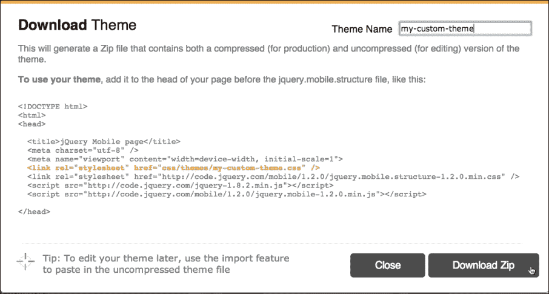

1.  您的浏览器的下载对话框将出现。这对于不同的浏览器和 Windows 和 Mac 来说是不同的。使用对话框中的设置将文件保存到定义您的 Dreamweaver 站点的文件夹中。

1.  最后，解压文件。我们需要的所有文件都在解压后的**主题**文件夹中。

# 在 Dreamweaver 中应用自定义主题

现在您已经准备好将自定义主题应用到您的 jQuery Mobile 站点中。

您可能已经注意到**下载主题**窗口中的 ThemeRoller 生成的 CSS 文件的应用说明（您用来创建 ZIP 文件的那个）是为那些没有 Dreamweaver 的人设计的。当您在 Dreamweaver 中工作时，这个过程会更容易。您只需将生成的 CSS 文件附加到带有文件名末尾带有`-min`（但在`.css`文件扩展名之前）的 jQuery Mobile 站点上。

执行以下步骤来完成这个过程：

1.  回到 Dreamweaver，查看**CSS 样式**面板，然后点击**附加样式表**图标。**附加外部样式表**对话框将打开。

1.  在**附加外部样式表**对话框中点击**浏览**按钮。**选择样式表文件**对话框将打开。在您的站点文件夹中，导航到文件名末尾带有`-min`的文件。双击该文件以将您的 jQuery Mobile 页面链接到此 CSS 文件。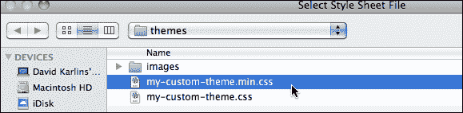

1.  在**附加外部样式表**对话框中点击**确定**。您的自定义 CSS 文件将添加到原始 CSS 文件中，并应用您的自定义主题样式。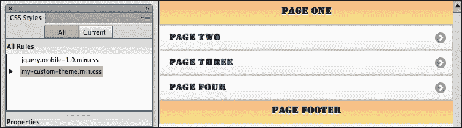

1.  点击**jQuery Mobile 调色板**面板底部的**刷新**图标，刷新面板并显示您自定义的调色板和主题属性。使用您自己的自定义主题重新加载的**jQuery Mobile 调色板**面板，您可以使用面板或**代码**视图来将您自己的自定义数据主题应用于任何元素。

# 总结

这一章有点不同寻常，因为我们大部分注意力放在了 Dreamweaver 之外。在某种程度上，我们可以将 Dreamweaver 看作是一个乐队指挥，它利用和整合自定义主题来创建真正独特的 jQuery Mobile 站点。

使用 ThemeRoller 生成自定义主题，并将其整合到 Dreamweaver jQuery Mobile 站点中，这真的是一个重大事件。它使我们摆脱了 jQuery Mobile 内置的单调的五种调色板选项，而是可以访问无限的主题和配色方案。

在构建自己的主题时，请记住一个主题包含多个调色板。因此，您的主题将定义一组标准元素（特别是字体系列）。然后您可以构建颜色调色板，最多 26 个，这些将整合到一个主题中。

在本书的最后一章中，我们将讨论 PhoneGap 在线资源，该资源可以生成全尺寸应用程序。这些应用程序在移动设备上运行而无需浏览器。Dreamweaver CS6 包括了大量新工具，可以通过 PhoneGap 生成应用程序而无需编码。
