# 第十章：使用 PhoneGap 构建应用程序

什么是应用程序？应用程序与移动友好的网站有什么不同？

您需要一个应用程序吗？如何在 Dreamweaver 中创建应用程序？

在本章中，我们将回答所有这些问题，并逐步介绍在 Dreamweaver CS6 中创建应用程序的过程。

应用程序（简称应用）与移动友好的网站不同之处在于应用程序不在浏览器中运行。相反，应用程序作为在移动设备操作系统中运行的独立程序。摆脱在浏览器中运行的限制，应用程序可以利用移动设备的整个视口。此外，即使设备未连接到互联网，应用程序也可以在移动设备上运行。

在大多数方面，应用程序看起来和感觉很像 jQuery Mobile 页面，但它们在“内部”非常不同。应用程序是用高级编程语言编写的，而移动友好的网站可以使用 HTML5、CSS3 和 JavaScript（jQuery Mobile 的三个组件）创建。

使用 Dreamweaver CS5.5，Adobe 推出了允许您将 jQuery Mobile 网站转换为应用程序的工具。这些生成应用程序的工具仍处于早期的演进阶段。事实上，与 Dreamweaver 5.5 中可用的功能相比，Dreamweaver CS6 中生成应用程序的功能有所减少。尽管如此，您仍然可以在 Dreamweaver 中生成真正的、可工作的应用程序；在本章中，我们将介绍如何做到这一点。

以下主题将被涵盖：

+   理解应用程序和移动网站之间的关系

+   两个主要移动操作系统 Android 和 iOS 的概述

+   在 PC 上模拟应用程序

+   安装 Android 软件开发工具包

+   使用 Dreamweaver 与 PhoneGap

+   配置 PhoneGap 设置

+   使用 Dreamweaver 生成应用程序

+   测试和分发应用程序

# 应用程序和移动网站

正如本章介绍中简要提到的，应用程序是完整的软件程序。这其中一个重要的含义是应用程序需要在特定的操作系统上运行。例如，Dreamweaver 是一个应用程序。Dreamweaver 可以在两个操作系统上运行：微软 Windows 和苹果的 OS X 操作系统。而且，应用程序是特定于操作系统的，因此您不能在 Mac 上运行 Dreamweaver 的 Windows 版本（也不能在 Windows 机器上运行 Dreamweaver 的 Mac 版本）。Dreamweaver 的 Mac 版本和 Windows 版本都无法在 Linux 机器上运行。

重点是什么？当您为移动设备创建应用程序时，您必须为每个移动操作系统创建单独的应用程序版本。有许多移动操作系统，包括 Google Android、Apple iOS、微软的 Windows Phone、HP 的 WebOS、Blackberry 和 Symbian。

为它们提供服务的主要移动操作系统是 Android 和 iOS，它们占据了绝大多数移动设备。

## Android 和 iOS

Google 赞助了 Android 移动操作系统的开发，并后来收购了它。Android 是开源的，意味着任何人都可以访问源代码。谷歌的做法是鼓励移动设备制造商使用 Android 作为其设备的操作系统。在移动设备发展的这一阶段，Android 操作系统出现在各种移动设备上，从亚马逊的 Kindle Fire、三星的平板电脑和智能手机，到售价低至 39 美元的廉价智能手机。Android 是最广泛使用的移动操作系统。

Android 应用程序的大量受众催生了数以十万计的 Android 应用程序。Android 应用程序的最大分发商是 Google Play 在线市场，但任何人都可以将 Android 应用程序作为带有`.apk`文件扩展名的文件进行分发。

您可以构建一个 Android 应用程序并通过电子邮件发送给客户或朋友，或者从您的网站上提供。这是我们将在本章重点关注的情景。

苹果的 iOS 移动操作系统不是开源的。iOS 仅适用于 iPhone、iPad、Apple TV 和 iPod Touch。

正如苹果严格控制对 iOS 操作系统的访问一样，它也严格控制在 iOS 上运行的应用程序的分发。分发 iOS 应用程序需要将您的应用程序放置在 iTunes 商店中，并经过苹果的批准。这个过程很复杂，甚至是政治性的。

### 注意

苹果认为，它对通过 iTunes 营销的应用程序的严格控制确保了质量控制。苹果的批评者指出，例如 2009 年禁止普利策奖获得者马克·菲奥雷的卡通应用程序*NewsToons*的事件，理由是它“嘲笑”公众人物。在广泛抗议之后，苹果改变了决定，允许*NewsToons*应用程序通过 iTunes 进行营销。

为了避免陷入成为经过批准的 iOS 应用程序开发人员的程序中，我们将在本章中专注于使用 Dreamweaver 生成和分发 Android 应用程序。也就是说，如果您是经过批准的苹果 iOS 应用程序开发人员，构建 iOS 应用程序的步骤几乎与构建 Android（和其他）应用程序的步骤相同，因此您将毫无困难地按照本章后面的逐步说明添加应用程序的 iOS 版本。

## 了解 PhoneGap

PhoneGap 是一个移动开发框架，得到了 Adobe 的支持，现在由 Adobe 拥有。PhoneGap 可以从使用 JavaScript、HTML5 和 CSS3 创建的页面生成应用程序，这意味着它可以从 jQuery Mobile 页面生成应用程序。

PhoneGap 可以从一组 HTML、CSS 和 JavaScript 文件生成多个应用程序。早期版本的 PhoneGap（Dreamweaver CS5.5 中使用的版本）只能在 OS X（苹果）计算机上生成 iOS 应用程序，但当前版本可以上传文件到云端，然后将它们转换为应用程序，因此您可以从 Windows 计算机创建 iOS 应用程序。

PhoneGap 可以在没有 Dreamweaver 的情况下访问和使用（在[www.phonegap.com](http://www.phonegap.com)），但 Dreamweaver 提供了一组简化的、更易访问的工具，可以直接从 Dreamweaver 生成使用 PhoneGap 的应用程序。

## 在构建应用程序之前

比利·乔尔有一首歌有以下歌词：

> “你听说过新风格吗，亲爱的？你只需要外貌和大量金钱。”

在 Dreamweaver 中构建应用程序不需要外貌或大量金钱，但有两件事是必须的：

1.  一个工作的 jQuery Mobile 页面。本书的前三章介绍了构建 jQuery Mobile 网站的过程，因此，如果您从这里开始阅读本书，您需要回溯几章，以掌握创建 jQuery Mobile 网站所需的技能。

1.  一个 PhoneGap Build 服务帐户。Dreamweaver 实际上充当了 PhoneGap 的前端，但 Dreamweaver 会要求您登录您的 PhoneGap 帐户。我将很快为您介绍获取 PhoneGap 帐户和登录信息的过程。

还有一个对在 Dreamweaver CS6 中构建应用程序有用但不是必需的第三个元素，那就是 Android 的**软件开发工具包**（**SDK**）（如果您是注册的 iOS 开发人员，也可以下载 iOS 的 SDK）。SDK 允许您在自己的计算机上预览和测试应用程序，因此让我们一起走过下载这些文件的过程。

### 创建 PhoneGap Build 服务帐户

让我强调一下：您不能在没有 PhoneGap Build 服务帐户的情况下使用 PhoneGap Build 和 Dreamweaver。帐户是免费且易于设置的。要创建一个帐户，请访问 PhoneGap Build 网站[`build.phonegap.com/people/sign_up`](https://build.phonegap.com/people/sign_up)。

当您访问 PhoneGap Build 网站时，您会看到两个注册选项。其中一个选项是使用 Adobe ID。如果您已经有 Adobe ID，可以在这里使用，如果没有，可以创建一个。

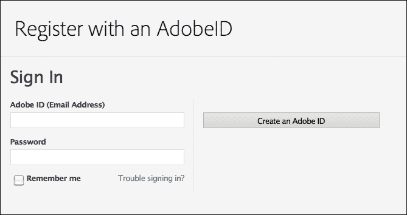

### 下载 Android SDK

虽然 Android SDK 不是构建应用程序所必需的，但在自己的计算机上预览和测试应用程序时是必需的。而且 SDK 是免费且易于下载，并且在预览和测试应用程序时非常有帮助，因此您应该下载它。

要下载包含 Android SDK 的文件集，请转到[`developer.android.com/sdk`](http://developer.android.com/sdk)。单击如下屏幕截图中所示的**下载 SDK**按钮：

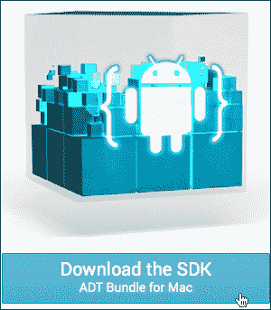

单击**下载 SDK**按钮会带您到一个法律页面。阅读条款和条件，选中**我已阅读并同意上述条款和条件**复选框，然后单击**下载 SDK**按钮（确切的措辞取决于您的操作系统）。

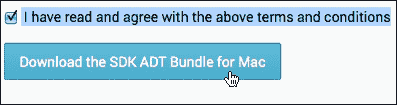

单击**下载**按钮后，下载将开始。将 ZIP 文件保存到一个您可以找到的文件夹中。解压文件——Mac 版本是`adt-bundle-mac-x86_64.zip`，Windows 版本略有不同。

重要的事情在这里：保存解压后的文件，有一个名为`SDK`的文件夹。跟踪这个文件夹在计算机文件结构中的位置。在配置 PhoneGap 构建功能的过程中，您需要导航到这个文件夹中的 Dreamweaver。

## PhoneGap 和 Dreamweaver

您会发现，在 Dreamweaver 中生成应用程序的工作 99%是在开始将页面导出到应用程序之前完成的。简而言之，这一切都是关于准备。如果所有的准备工作都就绪，生成应用程序就是无忧无虑的。

在准备将 jQuery Mobile 页面导出为应用程序时要记住的一个规则是：每个应用程序都必须基于一个独特的 Dreamweaver 站点。换句话说，您不能从同一个 Dreamweaver 站点中的文件构建两个不同的应用程序。

在整本书中，我强调了始终在 Dreamweaver 站点中工作的重要性。当您构建一个将被导出为应用程序的站点时，这一规则变得更加重要。

当然，在单个 Dreamweaver 站点中创建多个 jQuery Mobile HTML 页面是完全可能的。只要您不打算将 HTML 页面导出为应用程序，这是可以的。但是，如果您打算将 jQuery Mobile 页面导出为应用程序，请创建一个新的 Dreamweaver 站点，并在该站点中创建一个 HTML 页面。将页面命名为`index.html`。

如果您已将 jQuery Mobile 页面保存为`index.html`，则可以使用 Dreamweaver 的 PhoneGap 工具将内容导出到应用程序。

### 提示

Dreamweaver CS6 引入了生成应用程序的全新和不同的程序。在某些方面，Dreamweaver CS5.5 中生成应用程序的工具比 CS6 更强大，但是步骤又有很大不同。有关在 Dreamweaver CS5.5 中生成应用程序的逐步说明，请参见*Dreamweaver CS5.5 移动和 Web 开发与 HTML5、CSS3 和 jQuery*，*David Karlins*，*Packt Publishing*。

## 配置 PhoneGap 设置

您可以在 Dreamweaver 中生成应用程序而不配置 PhoneGap 设置。但是，除非并且直到配置 PhoneGap 设置，否则无法在计算机上模拟应用程序。这就是您需要记住您保存 Android SDK 文件的位置的地方。记住了吗？好的，那么您现在可以配置 PhoneGap 设置，以便模拟（预览和测试）您的 Android 应用程序。

要做到这一点，请执行以下步骤：

1.  打开 Dreamweaver 站点后，导航到**站点** | **PhoneGap 构建服务** | **PhoneGap 构建设置**。**PhoneGap 构建设置**面板将打开。

1.  在面板的**Android**部分（顶部），单击**选择位置**（文件夹）图标，然后导航到并选择从 Android SDK 下载文件解压缩的文件夹中的**SDK**文件夹。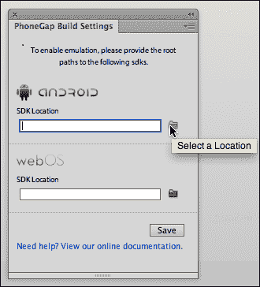

### 提示

在这里，我们不讨论 iOS SDK 的安装过程，但如果你是注册的苹果开发者，你可以在面板的 iOS 部分使用**选择位置**（文件夹）图标，并导航到并选择你保存解压后的 iOS SDK 文件的文件夹。

1.  在定义 PhoneGap SDK 设置后，点击**PhoneGap Build Settings**面板中的**保存**按钮。

在你定义了 PhoneGap Build 设置后，你可以在台式机或笔记本电脑上模拟（测试）你的应用程序。这并非必需——你仍然可以在移动设备上创建和测试应用程序，并将其下载到你的电脑，而无需配置 PhoneGap Build 设置。但是，如果你可以在用来运行 Dreamweaver 的同一台电脑上直接测试你的应用程序，你会发现开发和测试过程更加高效。

# 使用 Dreamweaver 生成应用程序

让我们回顾一下在你可以在 Dreamweaver 中生成应用程序之前需要准备的清单：

+   你需要在 PhoneGap 注册，并拥有登录 ID 和密码。

+   你需要构建并保存一个 jQuery Mobile 页面作为`index.html`。记住，每个应用程序都需要自己的 Dreamweaver 站点。

+   如果你想在自己的电脑上模拟你的应用程序，你至少需要下载 Android SDK，解压文件，并使用**PhoneGap Build Settings**面板定义这些文件的位置。

将这些部分放在一起，你就可以生成一个应用程序了。要做到这一点，请执行以下步骤：

1.  导航到**站点** | **PhoneGap Build Service** | **PhoneGap Build Service**。**PhoneGap Build Service**面板将出现。

1.  要开始创建一个新应用程序的过程，请将下拉菜单设置为默认的**创建为新项目**，然后点击**继续**按钮。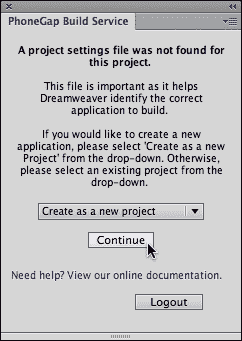

1.  点击**继续**后，会打开一个新的**PhoneGap Build Service**面板。在这里，你可以为你计划专业分发的应用程序输入密钥和密码。对于你自己分发的应用程序，密钥和密码是不需要的，通常除非你是为大规模销售而开发应用程序，否则是不必要的。你可以在 Android 的**密钥**弹出菜单中选择**无**。

### 提示

有关获取 Android 应用程序的密钥和密码的详细信息，请参阅[`developer.android.com/tools/publishing/app-signing.html#cert`](http://developer.android.com/tools/publishing/app-signing.html#cert)。

1.  在下一个面板中点击**继续**按钮：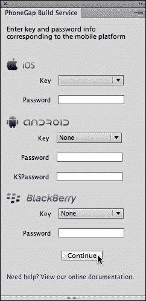

1.  另一个**PhoneGap Build Service**面板会显示应用程序生成的进度。在这里你无需做任何操作，只需坐下来，放松一下，等待 PhoneGap 生成你的应用程序。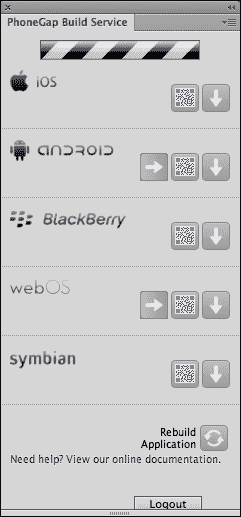

1.  当 PhoneGap 为你配置的移动操作系统生成应用程序完成时（在我们的情况下，除了 iOS 之外的所有操作系统），**PhoneGap Build Service**面板将显示每个应用程序的状态。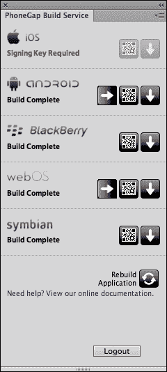

现在你已经准备好测试和分发你的应用程序了。但不要关闭**PhoneGap Build Service**面板！你需要它来测试和分发你的应用程序。

### 提示

**故障排除提示**

如果**PhoneGap Build Services**面板反复冻结，问题很可能不在于你的配置或互联网连接。Dreamweaver CS6 可能已经携带了一个似乎未被承认的错误，导致**PhoneGap Build Services**面板冻结。如果问题仍然存在，请在 Dreamweaver 中导航到**帮助** | **更新**，并使用最新版本更新你的 Dreamweaver CS6 安装，这将修复这个错误。

# 测试和分发应用程序

在你分发应用程序之前，有三种方法可以测试应用程序：

+   你可以在电脑上模拟应用程序，只要你下载并安装了该应用程序的 SDK。

+   您可以使用移动设备的 QR 阅读器将应用程序扫描到移动设备上。这将提供一个链接到 PhoneGap 网站上保存的应用程序文件，并允许将应用程序下载到您的移动设备进行测试。

+   您可以下载该应用程序并将其从计算机传输到移动设备。

在您自己的计算机上模拟应用程序是这些选项中最简单的，我们将重点关注这一点。但我也会介绍如何使用 QR 阅读器将您的应用程序加载到移动设备上，以及如何下载该应用程序。

## 使用模拟器测试应用程序

在您用来运行 Dreamweaver 的台式机或笔记本电脑上模拟应用程序，是查看您的应用程序在移动设备上的外观最简单的方法。如果您已经安装和配置了任何操作系统的 SDK（如 Android），该 SDK 包括模拟软件。

要启动任何操作系统的模拟器，请单击**PhoneGap 构建服务**面板中的**模拟应用程序**图标。

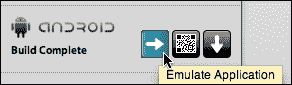

在**PhoneGap 构建服务**面板中出现的下一个屏幕提供了如何模拟您的应用程序的选项（在它们可操作时）。一般来说，您会接受默认设置，并单击**启动**按钮。

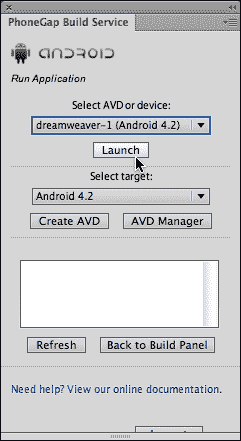

启动模拟器需要互联网连接，并需要一些时间。为什么？因为应用程序实际上是托管在 PhoneGap 网站上的，并且必须从该网站下载到模拟器窗口中。因此，在启动模拟器之前，请确保您有可用的互联网连接，并且要有耐心。最终，模拟器将启动，您可以在计算机上测试应用程序。

不同的操作系统有不同的模拟器，但它们都提供键盘和预览窗口，显示您的应用程序几乎与在移动设备上显示和工作的方式相同。

使用模拟器测试应用程序

## 修改您的应用程序

一般规则是，在生成应用程序之前，创建应用程序的测试和编辑过程会进行。您希望确保您的 jQuery Mobile 网站在转换为应用程序时能够按照您的意愿进行工作。

也就是说，有时当您在模拟器窗口中测试应用程序时，您会发现需要进行更改。您可以通过编辑 jQuery Mobile 网站来做到这一点，并通过单击**PhoneGap 构建服务**面板底部的**重新构建应用程序**图标来重新生成应用程序。

您可以在此过程中保持模拟器运行，并通过单击您的应用程序的**模拟应用程序**图标来更新模拟器。应用程序需要上传和重新生成，这需要相当长的时间，这强调了在生成应用程序之前测试和完善您的 jQuery Mobile 网站的重要性。

## 将应用程序扫描到您的 Android 设备

另一种测试生成的 Android 应用程序的方法是将其下载到 Android 设备上。要做到这一点，单击**PhoneGap 构建服务**面板中 Android 的**查看 QR 码**图标。

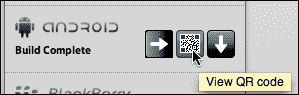

一旦单击**查看 QR 码**图标，**PhoneGap 构建服务**面板将显示一个大的可扫描的 QR 码。

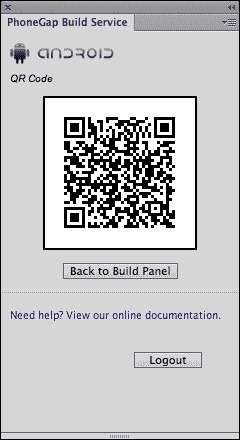

使用 Android 手机中的 QR 扫描软件，将 QR 码扫描到您的 Android 设备。您可以通过在 Android 移动设备中启动 QR 阅读器，并将扫描窗口对准 Dreamweaver 生成的 QR 码来完成这一操作。

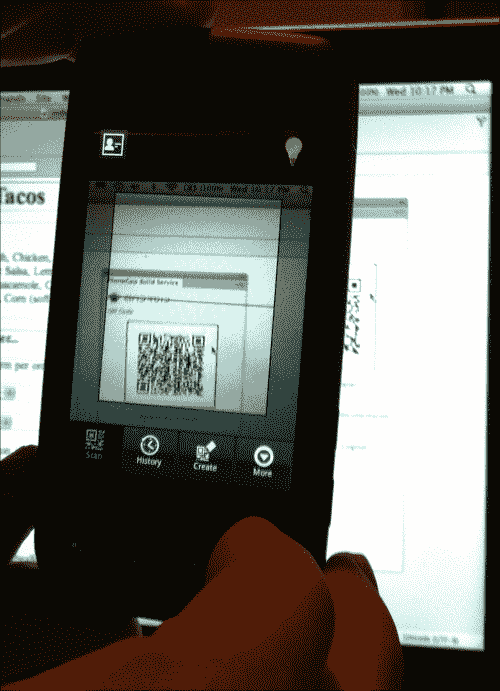

在将 QR 码扫描到您的 Android 设备后，您的设备会显示应用程序文件的链接。单击该链接，并使用您的 Android 设备中的工具下载、打开和安装应用程序文件。

### 提示

如何在不同的 Android 移动设备上下载和安装文件的全面探讨超出了本书的范围，但您可以使用 Astro 文件管理器完成整个过程，这是一款可下载到任何 Android 移动设备上的应用程序。

下载并安装应用程序后，您可以在您的 Android 移动设备上进行测试。我的 Android 手机没有屏幕截图实用程序，所以我们将使用屏幕的照片来演示应用程序在我的设备上的外观。

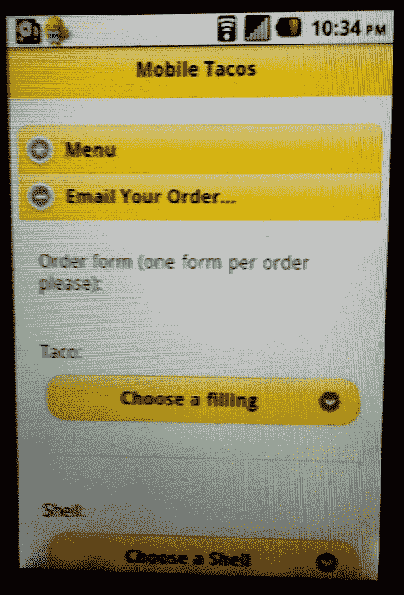

## 下载应用程序

测试应用程序的第三个选项是将其下载到您的计算机上。该应用程序不会在计算机上运行，因为它只能在为其创建的移动操作系统上运行。但是，您可以使用任何文件传输技术将文件移动到您的移动设备上进行测试。

在这里，我们再次偏离了 Dreamweaver，但一般来说，您可以通过使用 USB 线将应用程序从开发计算机传输到移动设备，然后将应用程序（其文件扩展名为.apk）拖放到移动设备上。然后，您可以在移动设备上启动应用程序，方式与启动任何应用程序相同。

## 分发应用程序

应用程序分发是针对每个操作系统的。如前所述，所有 Apple 设备的应用程序都通过 iTunes 分发。Android 应用程序通过 Google Play 出售和分发。您无需经过 Google 的批准即可通过 Google Play 分发应用程序，但有一些要求，您必须注册为 Android 开发人员（并支付注册费）。您可以在[`play.google.com/apps/publish`](https://play.google.com/apps/publish)找到有关通过 Google Play 出售或分发应用程序的所有信息。

虽然商业分发应用程序远远超出了本书的范围，但您可以直接从您的网站分发 Android 应用程序。以下是在 Dreamweaver 中如何做到这一点：

1.  在**PhoneGap Build Service**面板中，单击 Android 的**下载应用程序**图标。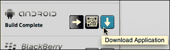

1.  **选择保存.apk 文件的位置**对话框将打开。导航到您将分发应用程序的网站，并单击**打开**按钮将应用程序下载到所选文件夹。下载应用程序后，将出现一个小对话框。在该对话框中单击**确定**。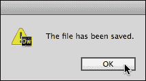

1.  您可以在 Dreamweaver 的**本地文件**面板中重命名应用程序，只需确保保留.apk 文件扩展名。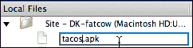

1.  将.apk 文件保存到 Dreamweaver 网站后，您可以创建一个链接到该应用程序文件，就像您创建到任何其他文件的链接一样。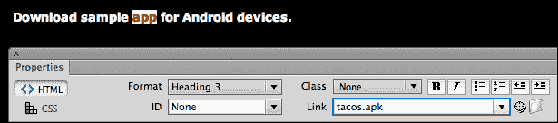

从您自己的网站分发应用程序是一种可行的、基层的方式，使您的应用程序可用。鉴于通过 Dreamweaver 构建的应用程序的技术限制，从您的网站共享应用程序是一种适当的分发方式。

# 总结

应用程序是您网站的独立版本。它们不需要在移动设备上使用浏览器，也不需要互联网连接（一旦它们被下载和安装）。应用程序是用高级编程语言编写的，专业级应用程序需要大量投资在高级编码上。

Dreamweaver CS6 与 PhoneGap 工具集合作，并作为其前端。这些工具将使用 HTML5、CSS3 和 JavaScript 构建的网页（一般来说，这意味着 Dreamweaver 中的 jQuery Mobile 页面）转换为一系列移动操作系统的应用程序，包括 Android。如果您是注册的 Apple 开发人员，您还可以使用 PhoneGap 和 Dreamweaver 创建 Apple iOS 应用程序。

Dreamweaver CS6 的 PhoneGap Build Service 管理整个构建、测试和在简单级别上分发应用程序的过程。使用 jQuery Mobile 构建的页面上传到 PhoneGap 服务器，然后转换为应用程序并保存。

您可以使用每个操作系统提供的软件开发工具包（SDK）文件中的模拟器软件来测试应用程序。您可以通过将应用程序文件下载到计算机上，并在网页中发布文件的链接来自行分发生成的应用程序，就像您发布任何文件的链接一样。

Dreamweaver CS6 的应用程序工具是否能够达到通过 Google Play 或 iTunes 销售的商业分发应用程序的水平？可能不会。由专业编码人员构建的应用程序将加载更快，运行更快，可以包含 3D 图形，最重要的是，可以针对不同的操作系统进行定制（而 PhoneGap 基于相同的源文件为每个操作系统生成应用程序）。但是，在 Dreamweaver 中构建的应用程序足够好，可以免费分发。如果您选择与专业编码人员合作创建商业质量的应用程序，您可以使用 PhoneGap 生成的应用程序作为编码团队的工作模型。
