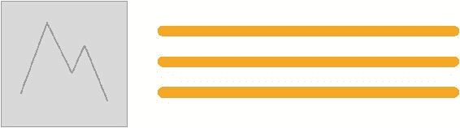

# 第三章：实施得到的智慧

> *你通常在第一次实施解决方案之后才真正理解问题 -《大教堂与集市》（[`www.catb.org/esr/writings/cathedral-bazaar/cathedral-bazaar/ar01s02.html`](http://www.catb.org/esr/writings/cathedral-bazaar/cathedral-bazaar/ar01s02.html)）*

在上一章中，我们考虑了处理大规模 CSS 代码库的一些更明显的困难。在本章中，我们将考虑一些现有的方法来解决这些问题。

在两年的时间里，我进行了 CSS 架构和维护的历程。在经历的开始，我做了任何明智的开发者都应该做的事情。我看了看聪明人是如何处理这个问题的。

CSS 架构方法似乎就像是减肥药对于超重者的等效物。很容易抓住表面上的解决方案，希望它们会正是你所需要的。然而，直到你至少尝试解决了问题之后，你可能并不知道自己确切需要什么。

这个建议在这里也适用。也许 ECSS 并不是你所面临问题的解决方案，所以如果你刚开始解决你的 CSS 问题，请务必考虑不同方法所提供的内容。

在我冒险的时候，处理大规模 CSS 的主要方法是：

+   **OOCSS**（**面向对象的 CSS**），由*Nicole Sullivan*开发（[`www.stubbornella.org/content/`](http://www.stubbornella.org/content/)）

+   **SMACSS**（**可扩展和模块化 CSS 架构**），由*Jonathan Snook*开发（[`snook.ca/`](https://snook.ca/)）

+   **BEM**（**块元素修饰符**），由*Yandex*开发（[`en.bem.info/`](https://en.bem.info/)）

现在，我会毫不羞愧地告诉你，我从每种方法中都偷了一些元素。然而，这些方法都没有真正解决我所面临的所有问题。

在我们正式介绍 ECSS 之前，我想简要介绍一下我研究的每种现有方法的优缺点。这样，至少当我们开始介绍 ECSS 时，你就能够理解它所解决的问题了。

# 关于 OOCSS

我所研究的现有方法中最广泛使用的，也是最受赞扬的是 OOCSS。这是我在试图解决不断增长的 CSS 代码库时首先采用的方法。

OOCSS 方法的一个主要论点是它消除了代码的重复，因此导致了更易维护的 CSS 代码库。实质上，您构建了一组 CSS *Lego* 片段，然后可以在 HTML/模板中使用它们来快速构建设计。希望一旦编写了 OOCSS 样式，它们就不应该增长（太多）。在可能的情况下重复使用，在需要的地方扩展。

在我们看 OOCSS 之前，我需要先说明一些警告。

1.  这并不是对 OOCSS、Atomic CSS 或任何相关的**单一职责原则**（**SRP**）方法的攻击。这只是我认为，根据你的目标，不同的方法可以提供更优选的结果。

1.  我并不是在暗示我所倡导的方法是解决所有 CSS 扩展问题的灵丹妙药。它不是（没有）。

## 响应式网页设计，OOCSS 的软肋

对我来说，OOCSS 方法最大的问题是：

+   响应式网页设计

+   频繁的设计更改和持续的维护

+   对新开发者来说是一种陌生的抽象概念

让我们看看我能否证明为什么我觉得这些问题值得考虑。

## 响应式问题

我认为*Atomic CSS*（[`www.smashingmagazine.com/2013/10/challenging-css-best-practices-atomic-approach/`](https://www.smashingmagazine.com/2013/10/challenging-css-best-practices-atomic-approach/)）（不要与*Atomic Design* ([`bradfrost.com/blog/post/atomic-web-design/`](http://bradfrost.com/blog/post/atomic-web-design/)）混淆）代表了 OOCSS 的极致。让我们考虑一个想象中的 Atomic CSS 示例：

```css
<div class="blk m-10 fr">Here I am</div>
```

在这个 OOCSS/原子 CSS 示例中，元素的视觉需求已经被拆分/抽象为可重复使用的类。一个设置了块格式上下文（`.blk`），另一个设置了一些边距（`.m-10`），最后一个为元素提供了浮动机制（`.fr`）。毫无疑问，这是一种不带偏见且简洁的方法。

### 注

原则上，原子 CSS 与我设计的第一种架构方法非常相似。

它被称为**PST!**，这是 Position Structure Theme 的缩写。其想法是：不会有语义 HTML 类/CSS 选择器。相反，页面上的每个元素都可以通过其位置、结构和主题来描述。每个新选择器只需使用下一个可用的数字。例如，`s1`，`s2`，`s3`等等。它并不完全是每个责任一个类，就像原子 CSS 一样，但它是一种大大抽象化的样式需求的方法。

标记看起来像这样：

```css
<div class="p1 s3 t4">Content</div>
```

就像原子 CSS 一样，它很简洁，你在编写时不需要思考该如何称呼某个东西，但实际上，对于我来说，它对我的需求来说是非常有问题的，就像本章描述的原因一样。

然而，当视口更改时，我们不希望有 10 像素的边距或项目浮动时会发生什么呢？

当然，我们可以在某些断点处创建一些类来执行某些操作。例如，`Mplus-cc2`可能会在*Mplus*断点（这里的 Mplus 是指*中等*大小的视口及以上）下更改颜色。但我发现这种做法很慢且费力。在某些断点处进行非常具体的更改，并将它们与必须添加到 HTML 中的类绑定起来似乎是毫无意义的复杂。此外，您最终会在样式表中得到一堆已过时的 SRP 类。当不再需要时，从编写样式表中删除任何无用的东西的机制是什么？

## 维护和迭代

让我们继续使用之前的例子。假设在将来的某个时候，我们将产品更改为更具有进步性的布局机制；我们从基于浮动的布局转移到基于 Flexbox 的布局。在这一点上，我们现在将有两倍的维护负担。我们不仅需要更改标记/模板中的类，还需要修改 CSS 规则本身（或编写全新的规则）。此外，使用`float`在 Flexbox 中是多余的，因此要么我们让`.fr`保持不变（因此它在我们的 CSS 中继续存在，毫无意义），要么我们让`.fr`负责其他事情，比如`justify-content: flex-end`。但是如果我们在特定视口下更改父元素的 flex-direction 会发生什么呢？烦死了！

希望您能看到 OOCSS 方法在设计频繁更改或需要在不同视口下呈现完全不同布局时的固有缺陷？

### 注

自 2013 年 Thierry 在 Smashing Magazine 上发表文章以来，原子 CSS 已经有了相当大的发展。根据您的目标，这可能正是您需要的东西，我鼓励您在[`acss.io`](http://acss.io)上查看该项目。

## 对新开发人员来说是一种陌生的抽象

快速启用新开发人员可能对每个人来说都不是一个重要因素。然而，在开发人员经常加入和离开团队（甚至可能是公司）的情况下，这可能是一个重要的考虑因素。我正在寻找一种解决方案，它基本上允许开发人员继续按照他们所知道的方式编写 CSS。强迫新开发人员学习陌生的抽象可能是一个额外的不需要的负担。此外，将该抽象应用到模板层可能会有问题，毕竟许多解决方案甚至可能没有传统意义上的模板层。

## 一个纯粹的 OOCSS 示例

可以说，以原子 CSS 作为示例是不公平的，也许并不公平地代表了 OOCSS。然而，试图找到一个 OOCSS 的典型示例是困难的，因为 CSS 作者对它的理解似乎存在很大的差异，以及它的实际实现方式。

因此，我将提供一些进一步的，仅限于 OOCSS 的例子。我将使用 Nicole Sullivan 在她的幻灯片*我们的最佳实践正在毁灭我们*（[`www.slideshare.net/stubbornella/our-best-practices-are-killing-us`](http://www.slideshare.net/stubbornella/our-best-practices-are-killing-us)）中的原始例子。

我不愿意这样做，因为 Nicole 的原始例子现在已经很老了（2009 年，甚至在响应式网页设计出现之前），而且，不想替她说话，我敢说她现在可能会使用不同的例子和方法。

然而，希望我们能够达成共识，OOCSS 的基本目标是*将结构与皮肤分离，将内容与容器分离*（[`github.com/stubbornella/oocss/wiki`](https://github.com/stubbornella/oocss/wiki)）？假设我们在这一点上达成一致，我坚信在某些情况下，OOCSS 对于创作速度和代码库的可维护性是有害的。

在响应式网页设计中，有时结构就是皮肤。或者说，结构在不同的上下文中有不同的作用，而使用 OOCSS 没有明智的处理方式。不过，你会做出判断。

考虑一下这个 OOCSS 的例子。首先是标记：

```css
<div class="media attribution">
  <a href="#" class="img">
    
  </a>
  <div class="bd">@Stubbornella 14 minutes ago</div>
</div>
```

现在的 CSS（注意，我在这里删除了一些旧 IE 特定的属性/值）：

```css
.media { overflow: hidden; margin: 10px; }
.media .img { float: left; margin-right: 10px; }
.media .img img { display: block; }
.media .imgExt { float: right; margin-left: 10px; }

```



OOCSS 的经典例子；媒体对象模式

然而，也许这个媒体对象在 300px 宽的视口下需要以不同的方式布局。你可以设置一个媒体查询，在这种情况下使它成为基于列的布局。但是假设你在同样的视口宽度下在不同的上下文中有相同的*对象*？在那个上下文中，它不应该是一个列布局。总结一下：

1.  一个媒体对象需要在 300px 宽的基于列的布局中（我们称之为*media1*）

1.  第二个媒体对象需要在 300px 宽的基于行的布局中（因为它在另一个上下文/容器中，我们将其称为*media2*）

让我们制作一个分离更多关注的类。它使媒体对象在特定视口上成为列布局：

```css
@media (min-width: 18.75rem) {  
  .media-vp-small {
    /* Styles */
  }
}

```

这将被添加到任何需要在该视口上成为列的元素（*media1*），所以你需要转到模板/HTML 中进行更改，在需要的地方添加这个类。

此外，*media2*需要在较大的视口上有不同的背景颜色。让我们添加另一个类来分离这个关注点：

```css
@media (min-width: 60rem) {
  .draw-focus {
    /* Styles */
  }
}

```

进入 HTML/模板，在需要的地方添加这个样式。

哦，*media1*需要在较大的视口上使`.img`更宽，而且不需要边距。我们可以为此制作另一个类：

```css
@media (min-width: 60rem) {
  .expand-img {
    width: 40%;
    margin-right: 0!important;
  }
}

```

回到 HTML/模板中使这个变化发生。

希望现在你能看出这是怎么一回事了？我们需要添加很多单一职责原则（SRP）类来满足我们的媒体对象需要满足的许多不同情况。

这种方法并没有使我的大型响应式代码库更易于维护。事实上，恰恰相反。每当需要进行更改时，就必须去寻找特定情况的 SRP 类，并经常在标记/模板中添加/删除 HTML 类。这让我思考这个问题：

> **为什么这个东西就不能是这个东西呢？**

目前，你可能会反驳说，*这是一个愚蠢的例子，如果一个设计有这么多可能性，那就应该是正常的*。在这一点上，我会反驳说这是不必要的。负责编写前端代码的人不应该因为这样会使他们的代码变得不可预测而限制设计师的创造力。他们应该能够简单轻松地编写出新的设计，而不必担心新的组件/模块/元素可能会影响其他部分。

### 提示

试图阻止项目的视觉变化仅仅是因为它们使我们的代码库难以维护和理解，这并不是一个站得住脚的立场。我们应该能够以速度和可预测性构建任何新的视觉效果，而不必担心无意中影响项目的其他部分。

当我使用 OOCSS 来满足我的需求时，我构建新视觉的速度减慢了，SRP 类的数量增加了；通常一个类在整个项目中只被使用一两次。即使对于 SRP 类有一个考虑周到的命名约定，记住特定需求的正确类名可能需要不断地进行思维操纵。

在一个快速变化的项目中使用 OOCSS 后，我发现在一段时间后，当需要进行更改时，解开这些抽象类变得非常令人沮丧。当它们很少被使用时，我不得不制作许多非常相似的抽象类。像`w10`、`w15`、`w20`、`w25`等不同宽度百分比的实用类似乎是一个好主意，也是一个明显的抽象，但最终它们被证明是无用的，并且在迭代设计时会出现问题（回到了在不同上下文中需要做不同事情的问题）。

因此，当我使用 OOCSS 时的第一个重要教训与那位优秀的同行*Kaelig Deloumeau-Prigent*([`www.kaelig.fr/`](http://www.kaelig.fr/))在 BBC 和《卫报》工作时所学到的教训是一样的：

> *两年前，我写了一本书，我在书中宣扬 DRY 代码，但在长期项目上的工作后，解耦对我来说变得更加重要。*

在大型、快速变化的项目中，能够轻松地将视觉模块与项目解耦对于持续维护非常重要，而 OOCSS 并没有很好地满足这一需求。

# SMACSS

SMACSS 代表可扩展模块化 CSS 架构，*Jonathan Snook 关于这个主题的书*（[`smacss.com/`](https://smacss.com/)）中有详细介绍。我不打算在这里详细介绍 SMACSS，因为我认为你应该自己去查看那本书。阅读 SMACSS 给了我很多思考的空间，我当时面临自己的挑战，我当然也从中学到了一些东西，比如如何思考状态变化。然而，我将详细说明为什么 SMACSS 对我不起作用。

再次强调，就像我对 OOCSS 的观点一样，这并不是对 SMACSS 的批评。它只是强调了对我来说不起作用的部分，以及为什么我觉得它未能解决我的问题。SMACSS 对网站的视觉方面有明确定义的术语和概念。因此，它规定了基础、布局、模块和可选的主题规则/文件来支持这些定义。例如，考虑这个建议的文件结构：

```css
+-layout/ 
| +-grid.scss 
| +-alternate.scss 
+-module/ 
| +-callout.scss 
| +-bookmarks.scss 
| +-btn.scss 
| +-btn-compose.scss 
+-base.scss 
+-states.scss 
+-site-settings.scss 
+-mixins.scss”
```

> *摘自：Jonathan Snook. *Scalable and Modular Architecture for CSS.**

虽然这些定义在许多情况下都是合理的，但对我来说并不是。我想要一种更宽松的方法，一种不需要我考虑如何将我需要构建的东西适应这些视觉定义的方法；我构建和维护的应用程序经常无法遵循这些定义。

# BEM

BEM 是由[`yandex.ru`](http://yandex.ru)的开发人员开发的一种方法论。

我从 BEM 中学到的关键是，命名约定在 CSS 维护方面能为你带来多大的好处。

### 注意

如果你对 BEM 感兴趣，官方资源是[`en.bem.info`](https://en.bem.info)。关于它的起源，我建议从这里开始阅读：[`en.bem.info/method/history`](https://en.bem.info/method)

再次强调，就像 SMACSS 一样，我不打算完全解释 BEM 方法论的细节。然而，我会给你一个关键点的*电梯演讲*解释。BEM 方法论围绕着页面的关键区域可以被定义为**块**的概念。然后，这些关键区域由元素组成。我们可以通过命名的方式来表示块和其元素之间的关系。考虑之前提到的 OOCSS 媒体对象示例。在 BEM 方法中，我们可能会使用这样的类：

```css
<div class="media">
  <a href="#" class="media__img">
    
  </a>
  <div class="media__attribution">@Stubbornella 14 minutes
  ago</div>
</div>

```

这种命名方案的有用之处在于它清晰地传达了元素与它们所属的块之间的关系。此外，远离 HTML，如果我们在 CSS 中遇到这样的选择器：

```css
.media__headshot {

}

```

我们立即知道这是一个名为**headshot**的元素，它位于名为**media**的块内。将组件命名为其他组件的一部分有助于隔离样式，并防止应用的样式*泄漏* - 这是我对 OOCSS 的主要不满之一。这绝对是解决我尝试解决的问题的正确方向。

BEM 还有*修饰符*的概念。修饰符是添加到块上以修改其外观的东西。假设我们想在不同的情况下以不同的方式为我们的媒体对象设置主题。BEM 可以这样实现：

```css
<div class="media media_dark">
  <a href="#" class="media__img">
    
  </a>
  <div class="media__attribution">@Stubbornella 14 minutes
  ago</div>
</div>

```

BEM 文档规定使用单个下划线字符来标识块的修饰符。这个修饰符类必须始终与块名称一起使用。例如，你必须这样做：

```css

<div class="media media_dark">

```

而不是这样：


```css
<div class="media_dark">
```

我看到了以这种方式使用修饰符的价值，但对我来说，这证明是有问题的。我经常需要对我正在设计的东西以更传统的方式进行不同的行为。也许视觉上需要根据它们被使用的上下文而显示不同，或者如果在 DOM 中添加了另一个类，或者由于某些媒体查询条件，或者任何这些情况的组合。我需要一种编写样式的方式，足够实用，可以处理发生的非理想情况。无论发生了什么，都能保持一些理智在编写样式表中。

# 总结

在我查看的所有现有 CSS 方法中，我从 BEM 中学到了最多。BEM 有很多值得赞赏的地方：

+   所有元素具有相同的特异性；一个类被添加到所有元素。

+   没有使用类型选择器，因此 HTML 结构与样式没有紧密耦合。

+   很容易推断出一个元素的父级是什么，无论是在浏览器开发者工具中查看 DOM 树，还是在代码编辑器中查看 CSS。

然而，修饰符的使用并不完全符合我的需求。尽管也许这并不是理想的，但我的现实是，通常我需要根据 DOM 中它上面或旁边的某种可能性来覆盖块的样式（在 BEM 术语中）。

例如，在应用程序中已经确定了现有逻辑的情况下，可能会出现这样的情况，即在 DOM 中的问题项上方添加一个类`contains2columns`，我需要根据这个类进行样式更改，而不是直接在问题块上进行更改。

使用 BEM，我找不到一个清晰的方法来理解应该如何处理这种可能性。或者如何在编写样式表中包含这些类型的覆盖。我想要定义项目并封装可能发生在特定项目上的所有可能性。

当浏览类时，我也发现语法令人困惑。修饰符的书写方式和元素的书写方式之间的区别微乎其微。这可能很容易解决，但这仍然是我对它感到困扰的事情。

最后，我意识到我需要一些额外的东西。我希望能够沟通和促进模块的不同上下文。当一个*东西*由相同的逻辑创建，但可以在不同的上下文中以不同的方式使用和样式化时，我希望有一种沟通的方式。

从 SMACSS 中我发现最有用的是处理状态。我喜欢类似`is-pressed`或属性`.btn[data-state=pressed]`这样的声明方式，清晰地传达了元素的状态。

OOCSS 结果证明是我所需要的东西的对立面。虽然我欣赏 OOCSS 能提供的东西，但它并不是我所面临问题的解决方案。我不想创建一个作者可以用来在 DOM/模板中构建视觉效果的乐高样式盒。OOCSS 促进的抽象本质上是*泄漏*的，这使得维护成为问题（更改一个规则中的值可能会无意中影响许多元素），而且在处理不同的视口时也很难找到方法，出于已经解释的所有原因以及添加的额外抽象在新开发人员入职时会带来更多的复杂性。

最终，通过尝试和失败，以不同程度，使用每一种现有的解决方案，我终于完全理解了我的问题。现在是时候定制一个专门的解决方案了。用巴勃罗·毕加索的话来说：

> *好的程序员抄袭，伟大的程序员窃取* **巴勃罗·毕加索**（有点像-抱歉巴勃罗）

跟我走。
