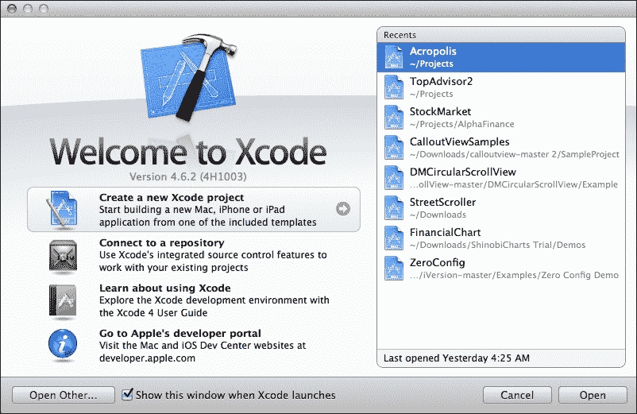

# 七、移动设备（以及平板电脑）

顾名思义，WebSocket 是使用 web 的东西。web 通常与浏览器页面交织在一起，因为这是在线显示数据的主要手段。然而，非浏览器程序也使用在线数据传输。iPhone（最初）和 iPad（后来）的发布引入了一个全新的网络互联世界，而不必使用网络浏览器。取而代之的是，新的智能手机和平板电脑设备利用本地应用的强大功能提供独特的用户体验。

# 为什么手机很重要

目前，全球有 10 亿部活动智能手机。也就是说，您的应用有数百万潜在客户。这些人用手机完成日常任务、上网、交流或购物。

智能手机已经成为应用的同义词，如今，有一款应用可以满足你所能想到的任何用途。大多数应用连接到互联网是为了检索数据、进行交易、收集新闻等等。

如果您能够利用现有的 WebSocket 知识，开发一个在智能手机或平板电脑设备上本机运行的 WebSocket 客户端，那不是很好吗？

## 本地移动应用与移动网站

嗯，这是一个常见的冲突，答案取决于你的需求和你的目标受众。如果你熟悉现代设计趋势，那么现在就必须设计一个响应迅速、便于移动的网站。然而，你应该确保真正重要的内容是可以通过智能手机访问的，就像通过经典的桌面浏览器一样。

毫无疑问，WebSocket web 应用将在任何兼容 HTML5 的浏览器上运行，包括用于 iOS 的 Safari 和用于 mobile 的 Chrome 等移动浏览器。因此，无需担心现代智能手机的兼容性问题。

如果你的应用使用特定于设备的信息，如离线存储、GPS、通知或加速计以及 WebSocket，那么会发生什么？您需要一种非 HTML 和 JavaScript 语言的更原生的实现。W3C 正在定义一些规范，允许客户端访问硬件，如摄像头、GPS 和加速计。然而，目前只有少数现代 web 浏览器支持此类规范。在撰写本文时，虽然客户端的未来似乎更有趣，但本地方法是一条可行之路！iOS 使用 Objective-C，Android 使用 Java，Windows Phone 使用 C。如果您认为您的手机用例场景没有使用任何智能手机产品，请使用基于浏览器的应用。如果需要本机功能，则需要本机解决方案。这正是我们在本章中要构建的内容！

## 先决条件

为了开发智能手机应用，您需要安装首选目标的开发工具和 SDK。我们将展示的示例背后的理念在三大移动操作系统中基本相同，即 iOS、Android 和 Windows。

如果您尚未安装移动 SDK，请在此处选择一个（它们都是免费的）：

<colgroup><col style="text-align: left"> <col style="text-align: left"> <col style="text-align: left"></colgroup> 
| 

站台

 | 

目标

 | 

SDK URL

 |
| --- | --- | --- |
| 网间网操作系统 | iPhone、iPad | [https://developer.apple.com/devcenter/ios/](https://developer.apple.com/devcenter/ios/) |
| 安卓 | 安卓手机和平板电脑 | [http://developer.android.com/sdk/](http://developer.android.com/sdk/) |
| 窗户 | Windows Phone、Windows 8 | [http://developer.windowsphone.com/ 开发](http://developer.windowsphone.com/ develop)&[http://msdn.microsoft.com/ windows/apps](http://msdn.microsoft.com/ windows/apps) |

我们假设您至少熟悉上述 SDK 和技术之一。如果没有，您可以导航到相应的开发人员门户，并遵循联机资源和教程，这是一个很好的起点。

在本章中，我们决定为 iOS 提供代码示例，但请随意使用您最熟悉的平台。

## 安装 SDK

下载所需的 SDK 后，您将按照自动向导在系统中安装它。请注意，iOS SDK 只能在 Mac 操作系统上运行，Windows SDK 在 Windows 操作系统上运行，Android SDK 在 Mac、Windows 或 Linux 上运行。除了 SDK 之外，还有一些自动安装的好东西：

*   智能手机/平板电脑模拟器
*   编写和调试代码的集成开发环境

尽管您应该总是在真实的设备（手机和平板电脑）上测试代码，但模拟器确实是持续调试的可靠解决方案。

考虑到 iOS，以下是运行 iOS 6 的 iPhone 和 iPad 模拟器。

下图显示了 iPhone 模拟器：


下图显示了一个 iPad 模拟器：


## 在手机浏览器中测试我们现有的代码

还记得我们在[第 2 章](02.html "Chapter 2. The WebSocket API")*WebSocket API*中写的 HTML 和 JavaScript 代码吗？安装 SDK 和模拟器后，我们可以使用模拟器中包含的移动浏览器访问 web。我们还可以访问本地 HTML、CSS 和 JavaScript 文件，而无需将它们上载到 web 服务器。这是一款在 iPad 上运行良好的聊天客户端。

下图显示了 Safari for iOS 上的 WebSocket web 应用（代码中没有修改）：


# 土生土长

那么，如果您的应用支持特定于设备或脱机功能，并且在 web 可用时仍希望使用 WebSocket，该怎么办？

你是土生土长的。

幸运的是，所有的主要移动平台都支持 WebSocket，因此您完全不需要更改服务器代码！毕竟，HTML5 是一个前端客户端，就像 iPhone 或 iPad 一样。使用与 JavaScript 示例相同的技术，您将在 Objective-C 中构建相同的应用。该过程类似于任何其他移动平台，因此如果您不熟悉 Objective-C 概念，请不要担心。

## 创建项目

首先，打开**XCode**，这是苹果为构建 iOS 应用提供的开发环境。Eclipse 和 Visual Studio 是 Android 和 Windows 的等价物。

按照给定的步骤创建项目

1.  Launch XCode and click on **Create a new XCode project**. The following screenshot shows XCode launch screen:

    

2.  Create a single view application. Provide a name, along with company and organization identifiers if you want to. For example, name the app `WebSocketsMobile`. Then, select a local folder to place it into, as shown in the following screenshot:

    

## 创建 WebSocket iPhone 应用

如果您需要部署应用进行生产，您需要为目标平台另外指定一些图标。我们现在将跳过这些内容，但可以随意添加应用可能需要的任何资源。XCode 会自动为我们创建一些文件。故事板文件（一个用于 iPhone，一个用于 iPad）将允许我们创建应用的用户界面，`ViewController`文件将处理所有编程逻辑。

以下屏幕截图显示了我们 iPhone 应用的初始用户界面：


1.  Add some controls to the user interface builder. For learning purposes, we'll try to keep it simple and only add `UITextField` for writing a message, a button for sending the message, and `UILabel` for displaying the chat messages. Remember to set the number of lines of the label to 0 (that is, infinite). Do not forget to connect the outlets with **View Controller,** using the assistant editor ([http://www.techotopia.com/index.php/Establishing_Outlets_and_Actions_using_the_Xcode_Assistant_Editor).](http://www.techotopia.com/index.php/Establishing_Outlets_and_Actions_using_the_Xcode_Assistant_Editor).)The following screenshot shows the iPhone app user interface:

    

2.  下载`UnittWebSocketClient`库并将其包含在项目中。此库处理大多数 WebSocket 功能。您可以选择另一个或实现自己的。按照[中规定的说明操作 https://code.google.com/p/unitt/wiki/UnittWebSocketClient](https://code.google.com/p/unitt/wiki/UnittWebSocketClient) 。
3.  在项目中包括库的头文件，并将视图控制器指定为`WebSocketDelegate`。然后订阅与 JavaScript 相同的相应事件：

    ```html
    // ViewController.h

    #import <UIKit/UIKit.h>
    #import "WebSocket.h"
    @interface ViewController : UIViewController <WebSocketDelegate>
    @end

    // ViewController.m

    #import "ViewController.h"

    @interface ViewController ()

    @end

    @implementation ViewController

    - (void)viewDidLoad
    {
      [super viewDidLoad];
    }

    - (void)didReceiveMemoryWarning
    {
      [super didReceiveMemoryWarning];
    }

    - (void)didOpen
    {
      // JavaScript event: onopen
    }

    - (void)didClose:(NSUInteger)aStatusCode message:(NSString *)aMessage error:(NSError *)aError
    {
      // JavaScript event: onclose
    }

    - (void)didReceiveError:(NSError *)aError
    {
      // JavaScript event: onerror
    }

    - (void)didReceiveTextMessage:(NSString *)aMessage
    {
      // JavaScript event: onmessage
    }

    - (void)didReceiveBinaryMessage:(NSData *)aMessage
    {
      // JavaScript event: onmessage
    }

    @end
    ```

4.  现在是填充这些方法的时候了，就像我们在 JavaScript 示例中所做的那样。以下是您需要执行的操作，以便设置应用并运行：

    ```html
    // ViewController.h

    @interface ViewController : UIViewController <WebSocketDelegate>
    {
      // Create a new WebSocket object.
      WebSocket *socket;
    }

    // ViewController.m

    - (void)viewDidLoad
    {
      [super viewDidLoad];

      // Specify the WebSocket configuration. The only necessary parameter is the URL.
      WebSocketConnectConfig *config = [WebSocketConnectConfig
        configWithURLString:@"ws://echo.websocket.org"
        origin:nil protocols:nil tlsSettings:nil headers:nil
          verifySecurityKey:YES extensions:nil];

      // Initialize the WebSocket object.
      socket = [WebSocket webSocketWithConfig:config
        delegate:self];

      // Open the WebSocket connection and start listening for
        events.
      [socket open];
    }

    - (void)didReceiveTextMessage:(NSString *)aMessage
    {
      // JavaScript event: onmessage

      labelChat.text = [NSString stringWithFormat:@"%@\r%@",
        labelChat.text, aMessage];
    }

    - (IBAction)sendTapped:(id)sender
    {
      [socket sendText:textMessage.text];
    }
    ```

下面的图显示了本机 iOS WebSocket 客户端已启动并正在运行！


# iPad 怎么样？

尽管您创建的应用在 iPad 设备上运行得很好，但为平板电脑提供不同的界面总是更好的。只需导航到`MainStoryboard_iPad.storyboard`文件，重新排列 UI 元素，并提供特定于平板电脑的功能。然后，选择项目目标，在摘要选项卡中展开`iPad Deployment Info`选项并确保选中`MainStoryboard_iPad`。如果应用不太复杂，您可以选择 iPhone 情节提要，或者指定应用目标仅为 iPhone。这样，当有人在 iPad 设备上运行你的应用时，他/她会看到一个较小的屏幕，集中在 iPad 设备上。

# 总结

在本章中，我们了解了 WebSockets 如何成为连接的移动和平板电脑客户端之间传输消息的通用集线器。我们实现了一个本机 iOS 应用，它与 WebSocket 服务器通信，就像 html5javascript 客户端一样。