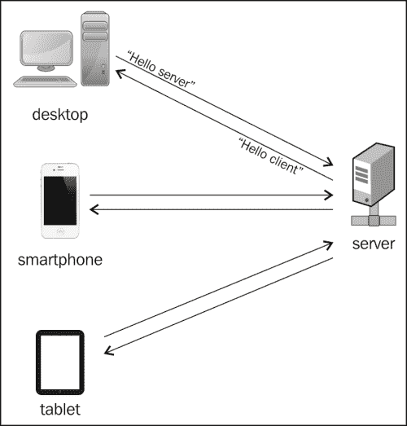
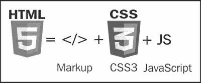
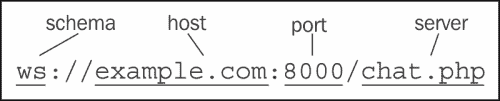

# 第一章：WebSocket – a Handshake!

在现实生活中，握手是温柔地握住两个人的手，然后进行简短的上下移动。如果你以这种方式问候过某人，那么你已经理解了 HTML5 WebSocket 协议的基本概念。

WebSocket 定义了 Web 服务器和 Web 客户端之间的持久双向通信，这意味着双方可以同时交换消息数据。WebSocket 引入了真正的并发性，它们针对高性能进行了优化，并且可以实现更加响应迅速和丰富的 Web 应用程序。

以下图表显示了服务器与多个客户端的握手：

值得一提的是，WebSocket 协议已经由**互联网工程任务组**（**IETF**）标准化，用于 Web 浏览器的 WebSocket API 目前正在由**万维网联盟**（**W3C**）标准化——是的，这是一个正在进行中的工作。不，你不需要担心巨大的变化，因为当前的规范已经发布为“建议标准”。

# WebSocket 之前的生活

在深入研究 WebSocket 的世界之前，让我们看看用于服务器和客户端之间双向通信的现有技术。

## 轮询

Web 工程师最初使用一种称为轮询的技术来处理这个问题。轮询是一种同步方法（即没有并发），它执行周期性请求，无论是否存在要传输的数据。客户端在指定的时间间隔后进行连续的请求。每次，服务器都会用可用的数据或适当的警告消息进行响应。

虽然轮询“只是起作用”，但很容易理解这种方法对于大多数情况来说是过度的，并且对于现代 Web 应用程序来说非常消耗资源。

## 长轮询

长轮询是一种类似的技术，正如其名称所示，客户端打开连接，服务器保持连接活动，直到获取一些数据或超时发生。然后客户端可以重新开始并执行顺序请求。长轮询是对轮询的性能改进，但是不断的请求可能会减慢过程。

## 流式传输

流式传输似乎是实时数据传输的最佳选择。在使用流式传输时，客户端发出请求，服务器保持连接无限期地打开，准备好时获取新数据。虽然这是一个很大的改进，但流式传输仍然包括 HTTP 头，这会增加文件大小并导致不必要的延迟。

## 回发和 AJAX

Web 是围绕 HTTP 请求-响应模型构建的。HTTP 是一种无状态协议，这意味着两个部分之间的通信由独立的请求和响应对组成。简单地说，客户端向服务器请求一些信息，服务器用适当的 HTML 文档进行响应，然后页面刷新（实际上称为回发）。在此期间没有发生任何事情，直到执行新的操作（例如单击按钮或从下拉菜单中进行选择）。任何页面加载都会导致令人讨厌的（从用户体验角度来看）闪烁效果。

直到 2005 年，通过**异步 JavaScript 和 XML**（**AJAX**）绕过了回发闪烁。AJAX 基于 JavaScript 的`XmlHttpRequest`对象，允许异步执行 JavaScript 代码，而不干扰用户界面的其余部分。AJAX 发送和接收的只是网页的一部分，而不是重新加载整个页面。

想象一下，你正在使用 Facebook，并且想在你的时间线上发表评论。你在适当的文本字段中输入状态更新，按 Enter 键，然后...哇！你的评论会自动发布，而不需要重新加载整个页面。除非 Facebook 使用了 AJAX，否则浏览器需要刷新整个页面才能显示你的新状态。

AJAX，加上流行的 JavaScript 库如 jQuery，极大地改善了最终用户体验，并被广泛认为是每个网站必备的属性。只有在 AJAX 之后，JavaScript 才成为了一个值得尊敬的编程语言，而不再被视为必要的邪恶。

但这还不够。长轮询是一种有用的技术，它让你的浏览器看起来保持了一个持久的连接，而事实上客户端在不断地发出调用！这可能会极大地消耗资源，特别是在移动设备上，速度和数据大小真的很重要。

前面描述的所有方法都提供了实时的双向通信，但与 WebSockets 相比有三个明显的缺点：

+   它们发送 HTTP 头，使总文件大小变大

+   通信类型是半双工的，意味着每个方（客户端/服务器）必须等待另一个方完成

+   Web 服务器消耗更多资源

后台世界看起来像一部对讲机-你需要等待对方讲完话（半双工）。在 WebSocket 世界中，参与者可以同时说话（全双工）！

Web 最初是用于显示文本文档的，但想想它如今的用途。我们显示多媒体内容，添加位置功能，完成复杂任务，因此传输的数据不同于文本。AJAX 和浏览器插件如 Flash 都很棒，但需要一种更本地的做事方式。我们如今使用 Web 的方式需要一个全新的应用程序开发框架。

# 然后来了 HTML5

HTML5 如今引起了巨大的关注，因为它为之前讨论的问题提供了重要的解决方案。如果您已经熟悉 HTML5，请随意跳过本节并继续。

HTML5 是一个强大的框架，用于开发和设计 Web 应用程序。

HTML5 不仅仅是一种新的标记或一些新的样式选择器，也不是一种新的编程语言。HTML5 代表着一系列技术、编程语言和工具，每种都有各自的作用，所有这些一起完成了一个特定的任务-即为任何类型的设备构建丰富的 Web 应用程序。

HTML5 的主要支柱包括标记、CSS3 和 JavaScript API。

以下图表显示了 HTML5 组件：

以下是 HTML5 家族的主要成员。由于本书未涵盖 HTML5 的全部内容，建议您访问[html5rocks.com](http://html5rocks.com)并开始使用实际示例和演示。

| 标记 | 结构元素表单元素属性 |
| --- | --- |
| 图形 | 样式表 CanvasSVGWebGL |
| 多媒体 | 音视频 |
| 存储 | 缓存本地存储 Web SQL |
| 连接 | Web 消息 WebSocketWebWorkers |
| 位置 | 地理位置 |

尽管存储和连接被认为是最先进的主题，但如果您不是经验丰富的 Web 开发人员，您不需要担心。在本书中，我们将解释如何完成常见任务，并创建一些逐步示例，您可以稍后下载并进行实验。此外，通过 HTML5 API 管理 WebSockets 非常简单，因此深呼吸，毫无恐惧地投入其中。

# WebSocket 协议

WebSocket 协议从根本上重新定义了全双工通信。实际上，WebSockets 和 WebWorkers 在将桌面丰富功能带到 Web 浏览器方面迈出了一大步。在后台世界中，并发和多线程并不存在。它们以一种相当受限的方式被模拟。

## URL

HTTP 协议需要自己的模式（http 和 https）。WebSocket 协议也是如此。以下是一个典型的 WebSocket URL 示例：

`ws://example.com:8000/chat.php`

首先要注意的是`ws`前缀。这很正常，因为我们需要一个新的 URL 模式来支持新协议。`wss`也得到支持，它是 WebSocket 的安全连接（SSL）等价物。URL 的其余部分类似于旧的 HTTP URL，并在下图中有所说明。

下图显示了 WebSocket URL 的标记：

## 浏览器支持

目前，WebSocket 协议的最新规范是 RFC 6455，幸运的是，每个现代 web 浏览器的最新版本都支持它。具体来说，RFC 6455 在以下浏览器中得到支持：

+   Internet Explorer 10+

+   Mozilla Firefox 11+

+   Google Chrome 16+

+   Safari 6+

+   Opera 12+

值得一提的是，Safari（iOS 版）、Firefox（Android 版）、Chrome（Android 版、iOS 版）和 Opera Mobile 的移动版本都支持 WebSocket，将 WebSocket 的功能带到了智能手机和平板电脑上！

但是，等等。许多人仍在全球范围内使用的旧版浏览器呢？好吧，不用担心，因为在本书中，我们将研究一些备用技术，使我们的网站能够被尽可能多的用户访问。

## 谁在使用 WebSocket

尽管 WebSocket 是一种全新的技术，但相当多的有前途的公司利用其各种能力，以提供更丰富的用户体验。最著名的范例是 Kaazing（[`demo.kaazing.com/livefeed/`](http://demo.kaazing.com/livefeed/)），这是一家初创公司，为其实时通信平台筹集了 1700 万美元的投资。

其他业务包括以下内容：

| 名称 | 网站 | 描述 |
| --- | --- | --- |
| Gamooga | [`www.gamooga.com/`](http://www.gamooga.com/) | 应用程序和游戏的实时后端 |
| GitLive | [`gitlive.com/`](http://gitlive.com/) | GitHub 项目的通知 |
| Superfeedr | [`superfeedr.com/`](http://superfeedr.com/) | 实时数据推送 |
| Pusher | [`pusher.com/`](http://pusher.com/) | 用于 web 和移动应用程序的可扩展实时功能 API |
| Smarkets | [`smarkets.com/`](https://smarkets.com/) | 实时投注 |
| IRC Cloud | [`www.irccloud.com/`](https://www.irccloud.com/) | 聊天 |

包含大量 WebSocket 演示的两个重要资源如下：

+   [`www.websocket.org/demos.html`](http://www.websocket.org/demos.html)

+   [`www.html5rocks.com/en/features/connectivity`](http://www.html5rocks.com/en/features/connectivity)

# 移动？

WebSocket，顾名思义，与网络有关。正如你所知，网络不仅仅是一些浏览器的技术，而是一个广泛的通信平台，适用于大量设备，包括台式电脑、智能手机和平板电脑。

显然，任何利用 WebSocket 的 HTML5 应用程序都可以在（几乎）任何支持 HTML5 的移动 web 浏览器上运行。想象一下，你想要使用原生移动应用程序的增强功能来实现相同的功能。WebSocket 在主流移动操作系统中得到支持吗？简短的答案是：是的。目前，移动行业的所有主要参与者（苹果、谷歌、微软）都提供了 WebSocket API，供你在自己的原生应用程序中使用。iOS、Android 和 Windows 智能手机和平板电脑都以类似的方式集成了 WebSocket，就像 HTML5 一样。

# 未来就在眼前

新的神经科学研究证实了关于握手的古老格言的力量：人们对那些伸出手来打招呼的人留下更好的印象（[`www.sciencedaily.com/releases/2012/10/121019141300.htm`](http://www.sciencedaily.com/releases/2012/10/121019141300.htm)）。正如人类的握手可以带来更好的交易一样，WebSocket 的握手可以带来更好的用户体验。我们将用户体验视为性能（用户等待时间更短）和简单性（开发者构建直接快速）的结合。

所以，这取决于你：你想构建现代的、真正实时的 Web 应用程序吗？你想为用户提供最大的体验吗？你想为现有的 Web 应用程序提供出色的性能提升吗？如果对任何一个问题的答案是肯定的，那么现在是时候意识到 WebSocket API 已经足够成熟，可以立即提供其好处了。

# 我们要做什么？

在整本书中，我们将实施一个真实的项目：一个简单的、多用户的、基于 WebSocket 的聊天应用程序。实时聊天是所有现代社交网络中非常常见的功能。我们将逐步学习如何配置 Web 服务器，实现 HTML5 客户端，并在它们之间传递消息。

除了纯文本消息，我们还将看到 WebSocket 如何处理各种类型的数据，如二进制文件、图像和视频。是的，我们也会演示实时媒体流！

此外，我们将增强我们应用程序的安全性，检查一些已知的安全风险，并找出如何避免常见的陷阱。此外，我们将瞥一眼一些针对那些不能（或不想）更新他们的浏览器的可怜家伙的备用技术。

最后但并非最不重要的是，我们将涉及移动端。您可以使用台式机浏览器、手机或平板电脑进行聊天。如果您可以在多个目标上使用相同的技术和原则，那不是很好吗？通过阅读本书，您将了解如何轻松将您的 Web 应用程序转换为原生移动和平板应用程序。

# 总结

在本章中，我们介绍了 WebSocket 协议，提到了实时通信的现有技术，并确定了 WebSocket 满足的特定需求。此外，我们还检查了它与 HTML5 的关系，并说明了用户如何从这些增强中受益。现在是时候更详细地介绍 WebSocket 客户端 API 了。
