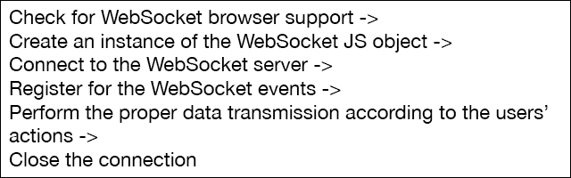

# 第二章：WebSocket API

如果您熟悉 HTML 和 JavaScript，您已经了解足够的知识来立即开始开发 HTML5 WebSockets。WebSocket 通信和数据传输是双向的，因此我们需要两方来建立它：服务器和客户端。本章重点介绍 HTML5 Web 客户端，并介绍 WebSocket 客户端 API。

# HTML5 基础知识

任何 HTML5 Web 客户端都是结构、样式和编程逻辑的组合。正如我们已经提到的，HTML5 框架为每种用途提供了离散的技术集。尽管我们假设您已经对这些概念有一定了解，让我们快速浏览一下它们。

## 标记

标记定义了您的 Web 应用程序的结构。它是一组 XML 标记，让您指定 HTML 文档中可视元素的层次结构。流行的新 HTML5 标记包括`header`、`article`、`footer`、`aside`和`nav`标记。这些元素具有特定的含义，并有助于区分 Web 文档的不同部分。

以下是 HTML5 标记代码的一个简单示例，用于生成我们聊天应用程序的基本元素：一个文本字段、两个按钮和一个标签。文本字段用于输入我们的消息，第一个按钮将发送消息，第二个按钮将终止聊天，标签将显示来自服务器的交互：

```js
<!DOCTYPE html>
<head>
  <title>HTML5 WebSockets</title>
</head>
<body>
  <h1> HTML5 WebSocket chat. </h1>
  <input type="text" id="text-view" />
  <input type="button" id="send-button" value="Send!" />
  <input type="button" id="stop-button" value="Stop" />
  <br/>
  <label id="status-label">Status</label>
</body>
```

前面代码的第一行（`DOCTYPE`）表示我们正在使用最新版本的 HTML，即 HTML5。

有关 HTML5 标记的更多信息，请访问[`html5doctor.com/`](http://html5doctor.com/)。在[`html5doctor.com/element-index/`](http://html5doctor.com/element-index/)上有一个支持的 HTML5 标记的完整参考。

## 样式

为了显示颜色、背景、字体、对齐等，您需要熟悉**层叠样式表**（**CSS**）。CSS 相当直观，因此，如果要更改标题样式（例如颜色、对齐和字体），您可以编写类似以下代码：

```js
h1 {
  color: blue;
  text-align: center;
  font-family: "Helvetica Neue", Arial, Sans-Serif;
  font-size: 1em;
}
```

[`www.css3.info/`](http://www.css3.info/) 是 CSS3 和进一步阅读的绝佳资源。

## 逻辑

标记定义了结构，CSS 规则应用了样式。那么事件处理和用户操作呢？JavaScript 就派上用场了！JavaScript 是一种脚本编程语言，可以根据伴随的操作控制和改变 Web 应用程序的行为。使用 JavaScript，您可以处理按钮点击、页面加载，应用额外样式，添加特殊效果，甚至从 Web 服务获取数据。使用 JavaScript，您可以创建对象，分配属性和方法，并在发生某些事件时引发和捕获它们。

以下是一个简单的 JavaScript 示例：

```js
var buttonSend = document.getElementById("send-button");

buttonSend.onclick = function() {
  console.log("Button clicked!");
}
```

第一行搜索文档树，找到名为`action-button`的元素，并将其存储在名为`buttonSend`的对象中。然后，将一个函数分配给按钮的 onclick 事件。每次单击按钮时，函数的主体都会被执行。

全新的 HTML5 功能主要基于 JavaScript，因此在实现任何 Web 应用程序之前，对这种语言的基本了解是必不可少的。最重要的是，WebSocket API 也是纯 JavaScript！

# 聊天应用程序

全双工通信中最受欢迎的类型是聊天。我们将从这里开始开发一个简单的聊天应用程序。首先要做的是配置客户端，它由三个基本文件组成：

+   包含网页标记结构的 HTML（`.html`）文件

+   包含所有样式信息的 CSS（`.css`）文件

+   包含应用程序逻辑的 JavaScript（`.js`）文件

目前，这就是您需要为功能齐全的 HTML5 聊天客户端。不需要浏览器插件或其他外部库。

# API 概述

**API**，代表**应用程序编程接口**，是一组对象、方法和例程，让您与底层功能层进行交互。考虑到 WebSocket 协议，其 API 包括 WebSocket 主要对象、事件、方法和属性。

将这些特性转化为操作，WebSocket API 允许您连接到本地或远程服务器，监听消息，发送数据，并关闭连接。

以下是 WebSocket API 的典型用法。

以下插图显示了典型的 WebSocket 工作流程：



## 浏览器支持

WebSocket 协议是 HTML5 的一个新功能，因此并非每个浏览器都支持它。如果您曾经尝试在不支持的浏览器上运行特定于 WebSocket 的代码，将不会发生任何事情。考虑一下您的用户：他们在无响应的网站上冲浪并不好。此外，您也不想错过任何潜在的客户！

因此，在运行任何 WebSocket 代码之前，应检查浏览器兼容性。如果浏览器无法运行代码，应提供错误消息或备用方案，如 AJAX 或基于 Flash 的功能。在第六章 *错误处理和备用方案*中将会更多地介绍备用方案。我也喜欢提供温和提示用户更新其浏览器的消息。

JavaScript 提供了一种简单的方法来查找浏览器是否可以执行特定于 WebSocket 的代码：

```js
if (window.WebSocket) {
  console.log("WebSockets supported.");

  // Continue with the rest of the WebSockets-specific functionality…
}
else {
  console.log("WebSockets not supported.");
  alert("Consider updating your browser for a richer experience.");
}
```

`window.WebSocket`语句指示浏览器是否实现了 WebSocket 协议。以下语句是等效的：

```js
window.WebSocket

"WebSocket" in window

window["WebSocket"]
```

它们中的每一个都会导致相同的验证检查。您还可以使用浏览器的开发人员工具检查任何功能支持。

想知道哪些浏览器支持 WebSocket 协议吗？可以在[`caniuse.com/#feat=websockets`](http://caniuse.com/#feat=websockets)上找到最新的资源。

截至目前，WebSocket 已完全受到 Internet Explorer 10+、Firefox 20+、Chrome 26+、Safari 6+、Opera 12.1+、Safari for iOS 6+和 Blackberry Browser 7+的支持。

## WebSocket 对象

现在是时候初始化与服务器的连接了。我们所需要做的就是创建一个 WebSocket JavaScript 对象，并提供远程或本地服务器的 URL：

```js
var socket = new WebSocket("ws://echo.websocket.org");
```

当构造此对象时，它会立即打开到指定服务器的连接。第三章 *配置服务器*，将详细向我们展示如何开发服务器端程序。现在，只需记住需要一个有效的 WebSocket URL。

示例 URL `ws://echo.websocket.org`是一个我们可以用于测试和实验的公共地址。[Websocket.org](http://Websocket.org)服务器一直在运行，当它接收到消息时，会将其发送回客户端！这就是我们确保客户端应用程序正常工作所需的一切。

## 事件

创建`WebSocket`对象后，我们需要处理其暴露的事件。WebSocket API 中有四个主要事件：打开、消息、关闭和错误。您可以通过实现`onopen`、`onmessage`、`onclose`和`onerror`函数来处理它们，也可以使用`addEventListener`方法。对于我们需要做的事情，这两种方式几乎是等效的，但第一种方式更清晰。

显然，我们将为事件提供的函数不会按顺序执行。它们将在特定操作发生时异步执行。

因此，让我们仔细看看它们。

### 打开

`onopen`事件在连接成功建立后立即触发。这意味着客户端和服务器之间的初始握手已经导致了成功的第一次交易，应用程序现在已准备好传输数据：

```js
socket.onopen = function(event) {
  console.log("Connection established.");

  // Initialize any resources here and display some user-friendly messages.
  var label = document.getElementById("status-label");
  label.innerHTML = "Connection established!";
}
```

在等待连接打开时，为用户提供适当的反馈是一个好的做法。WebSockets 绝对很快，但是互联网连接可能很慢！

### onmessage

`onmessage`事件是客户端与服务器的通信。每当服务器发送一些数据时，`onmessage`事件就会触发。消息可能包含纯文本、图像或二进制数据。如何解释和可视化这些数据由您决定：

```js
socket.onmessage = function (event) {
  console.log("Data received!");
}
```

检查数据类型非常简单。以下是如何显示字符串响应的方法：

```js
socket.onmessage = function (event) {
  if (typeof event.data === "string") {
    // If the server has sent text data, then display it.
    var label = document.getElementById("status-label");
    label.innerHTML = event.data;
  }
}
```

我们将在第四章中了解更多关于支持的数据类型，*数据传输-发送、接收和解码*

### onclose

`onclose`事件标志着对话的结束。每当触发此事件时，除非重新打开连接，否则服务器和客户端之间无法传输消息。连接可能由多种原因终止。它可能被服务器关闭，也可能被客户端使用`close()`方法关闭，或者由于 TCP 错误而关闭。

您可以通过检查事件的`code`、`reason`和`wasClean`参数轻松检测连接关闭的原因。

`code`参数为您提供一个唯一的数字，指示中断的来源。

`reason`参数以字符串格式提供中断的描述。

最后，`wasClean`参数指示连接是由于服务器决定还是由于意外的网络行为而关闭。以下代码片段说明了参数的正确使用方式：

```js
socket.onclose = function(event) {
  console.log("Connection closed.");

  var code = event.code;
  var reason = event.reason;
  var wasClean = event.wasClean;

  var label = document.getElementById("status-label");

  if (wasClean) {
    label.innerHTML = "Connection closed normally.";
  }
  else {
    label.innerHTML = "Connection closed with message " + reason + "(Code: " + code + ")";
  }
}
```

您可以在本书附录中找到代码值的详细列表。

### onerror

当发生错误（通常是意外行为或失败）时，将触发`onerror`事件。请注意，`onerror`事件总是跟随连接终止，即关闭事件。

当发生意外错误时，一个好的做法是通知用户，并可能尝试重新连接：

```js
socket.onclose = function(event) {
  console.log("Error occurred.");

  // Inform the user about the error.
  var label = document.getElementById("status-label");
  label.innerHTML = "Error: " + event;
}
```

## 操作

事件发生时会触发。当我们希望发生某事时，我们会明确调用操作（或方法）！WebSocket 协议支持两个主要操作：`send()`和`close()`。

### send()

在连接打开时，您可以与服务器交换消息。`send()`方法允许您向 Web 服务器传输各种数据。以下是我们如何向聊天室中的每个人发送聊天消息（实际上是 HTML 文本字段的内容）：

```js
// Find the text view and the button.
var textView = document.getElementById("text-view");
var buttonSend = document.getElementById("send-button");

// Handle the button click event.
buttonSend.onclick = function() {
  // Send the data!!!
  socket.send(textView.value);
}
```

就是这么简单！

但是...前面的代码并不完全正确。请记住，只有在连接打开时才能发送消息。这意味着我们需要将`send()`方法放在`onopen`事件处理程序中，或者检查`readyState`属性。该属性返回 WebSocket 连接的状态。因此，前面的代码片段应相应地进行修改：

```js
button.onclick = function() {
  // Send the data if the connection is open.
  if (socket.readyState === WebSocket.OPEN) {
    socket.send(textView.value);
  }
}
```

发送所需数据后，您可以等待服务器的交互或关闭连接。在我们的演示示例中，除非单击停止按钮，否则我们会保持连接开放。

### close()

`close()`方法作为告别握手。它终止连接，除非连接再次打开，否则无法交换数据。

与前面的示例类似，当用户单击第二个按钮时，我们调用`close()`方法：

```js
var textView = document.getElementById("text-view");
var buttonStop = document.getElementById("stop-button");

buttonStop.onclick = function() {
  // Close the connection, if open.
  if (socket.readyState === WebSocket.OPEN) {
    socket.close();
  }
}
```

我们还可以传递我们之前提到的`code`和`reason`参数：

```js
socket.close(1000, "Deliberate disconnection");
```

## 属性

`WebSocket`对象公开了一些属性值，让我们了解其特定特性。我们已经遇到了`readyState`属性。以下是其余的：

| 属性 | 描述 |
| --- | --- |
| `url` | 返回 WebSocket 的 URL |
| `protocol` | 返回服务器使用的协议 |
| `readyState` | 报告连接的状态，并可以采用以下自解释的值：`WebSocket.OPEN``WebSocket.CLOSED``WebSocket.CONNECTING``WebSocket.CLOSING` |
| `bufferedAmount` | 返回调用`send()`方法时排队的总字节数 |
| `binaryType` | 返回`onmessage`事件触发时接收到的二进制数据格式 |

## 完整的示例

这里是我们使用的完整 HTML 和 JavaScript 文件。为了保持重点简单，我们省略了样式表文件。但是，您可以在[`pterneas.com/books/websockets/source-code`](http://pterneas.com/books/websockets/source-code)下载完整的源代码。

### index.html

我们网页应用程序页面的完整标记代码如下：

```js
<!DOCTYPE html>
<html>
<head>
  <title>HTML5 WebSockets</title>
  <link rel="stylesheet" href="style.css" />
  <script src="img/chat.js"></script>
</head>
<body>
  <h1> HTML5 WebSocket chat. </h1>
  <input type="text" id="text-view" />
  <input type="button" id="send-button" value="Send!"  />
  <input type="button" id="stop-button" value="Stop" />
  </br>
  <label id="status-label">Status</label>
</body>
</html>
```

### chat.js

所有用于聊天功能的 JavaScript 代码如下：

```js
window.onload = function() {
  var textView = document.getElementById("text-view");
  var buttonSend = document.getElementById("send-button");
  var buttonStop = document.getElementById("stop-button");
  var label = document.getElementById("status-label");

  var socket = new WebSocket("ws://echo.websocket.org");

  socket.onopen = function(event) {
    label.innerHTML = "Connection open";
  }

  socket.onmessage = function(event) {
    if (typeof event.data === "string") {
      label.innerHTML = label.innerHTML + "<br />" + event.data;
    }
  }

  socket.onclose = function(event) {
    var code = event.code;
    var reason = event.reason;
    var wasClean = event.wasClean;

    if (wasClean) {
      label.innerHTML = "Connection closed normally.";
    }
    else {
      label.innerHTML = "Connection closed with message: " + reason + " (Code: " + code + ")";
    }
  }

  socket.onerror = function(event) {
    label.innerHTML = "Error: " + event;
  }

  buttonSend.onclick = function() {
    if (socket.readyState == WebSocket.OPEN) {
      socket.send(textView.value);
    }
  }

  buttonStop.onclick = function() {
    if (socket.readyState == WebSocket.OPEN) {
      socket.close();
    }
  }
}
```

## 服务器怎么样？

您可能已经注意到，我们在这个演示中使用了`echo.websocket.org`服务器。这个公共服务简单地返回您发送的数据。在下一章中，我们将构建自己的 WebSocket 服务器并开发一个真正的聊天应用程序。

# 摘要

在本章中，我们构建了我们的第一个 WebSocket 客户端应用程序！我们介绍了`WebSocket`对象并解释了它的各种方法、事件和属性。我们还在几行 HTML 和 JavaScript 代码中开发了一个基本的聊天客户端。正如您在当前示例中所注意到的，只有一个虚拟服务器回显消息。继续阅读，了解如何配置您自己的 WebSocket 服务器以实现更多的魔法。

### 提示

**下载示例代码**

您可以从您在[`www.packtpub.com`](http://www.packtpub.com)购买的所有 Packt 图书中下载示例代码文件。如果您在其他地方购买了本书，您可以访问[`www.packtpub.com/support`](http://www.packtpub.com/support)并注册，以便文件直接通过电子邮件发送给您。
