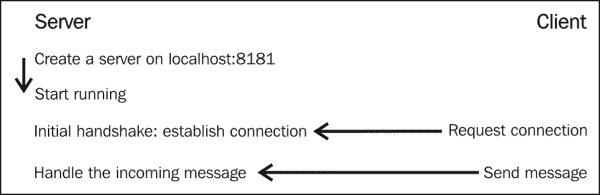
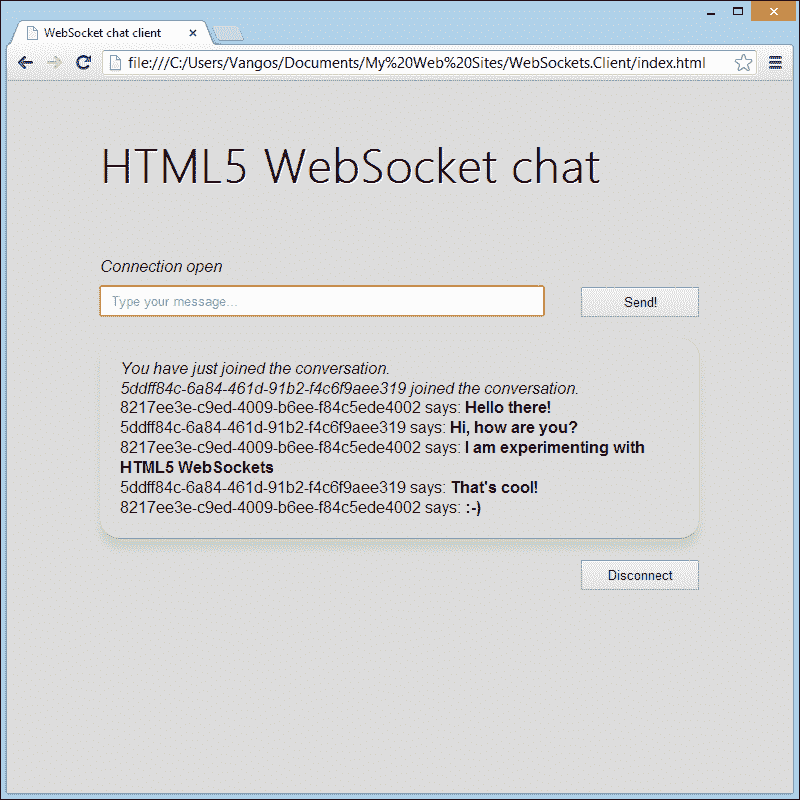
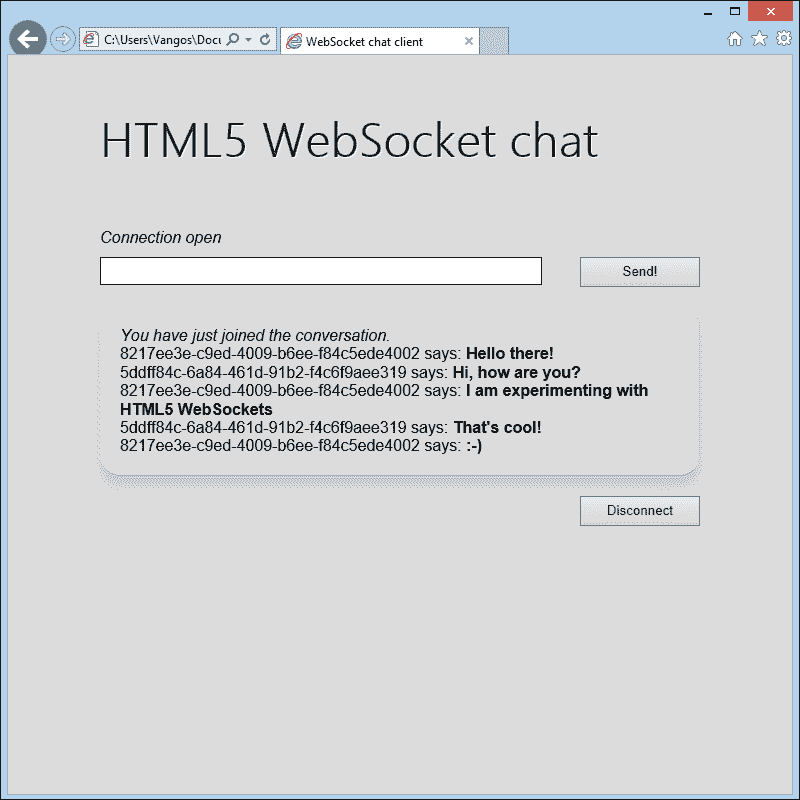

# 第三章：配置服务器

WebSocket 代表双向全双工通信。因此，我们需要两方参与这种对话。在上一章中，我们实现了 WebSocket 客户端应用程序。现在是时候建立通道的另一端了，也就是 WebSocket 服务器。

# 为什么我需要一个 WebSocket 服务器？

我们假设你对服务器有一定的了解。服务器只是一个具有特定硬件和软件要求的远程计算机，以实现高可用性和正常运行、增强的安全性和管理多个并发连接。

WebSocket 服务器只是一个能够处理 WebSocket 事件和操作的简单程序。它通常公开类似于 WebSocket 客户端 API 的方法，并且大多数编程语言都提供了实现。以下图表说明了 WebSocket 服务器和 WebSocket 客户端之间的通信过程，强调了触发的事件和操作。

以下图表显示了 WebSocket 服务器和客户端事件触发：



不要混淆——Web 服务器可以在 Apache 或 IIS 之上运行，也可以是一个完全不同的应用程序。

考虑到硬件，你可以使用超级计算机或你的开发者机器作为服务器。这完全取决于每个项目的要求和预算。

# 设置服务器

从头开始实现一个 WebSocket 服务器并不是一个困难的过程，尽管它需要特定的知识，而且远非本书的目的。因此，我们将使用当前已经存在的 WebSocket 实现之一。由于有着庞大的开发者社区，我们可以轻松地选择我们喜欢的编程语言或框架的 WebSocket 服务器。此外，大多数实现都是开源的，所以如果需要，你甚至可以调整它们以满足自己的需求！

## 选择适合你的技术

我们列出了一些流行的 WebSocket 服务器实现。在选择之前，以下是一些你应该问自己的问题：

+   你最熟悉哪种技术？

+   你的项目有什么具体的要求？

+   你已经有一个想要增强的解决方案了吗？

+   服务器的文档是否详尽且易懂？

+   服务器是否有一个活跃的支持社区？

现在让我们来看看最流行的 WebSocket 服务器库，适用于最广泛使用的编程语言。

### C/C++

| Tufao | [`github.com/vinipsmaker/tufao`](https://github.com/vinipsmaker/tufao) |
| --- | --- |
| Wslay | [`wslay.sourceforge.net/`](http://wslay.sourceforge.net/) |
| Libwebsockets | [`libwebsockets.org/trac`](http://libwebsockets.org/trac) |
| Mongoose | [`code.google.com/p/mongoose/`](https://code.google.com/p/mongoose/) |

### Java

| Apache Tomcat | [`tomcat.apache.org/`](http://tomcat.apache.org/) |
| --- | --- |
| JBoss | [`www.jboss.org/`](http://www.jboss.org/) |
| GlassFish | [`glassfish.java.net/`](http://glassfish.java.net/) |
| Atmosphere | [`github.com/Atmosphere/atmosphere`](https://github.com/Atmosphere/atmosphere) |
| Play Framework | [`www.playframework.com/`](http://www.playframework.com/) |
| Jetty | [`www.eclipse.org/jetty/`](http://www.eclipse.org/jetty/) |
| jWebSocket | [`jwebsocket.org/`](http://jwebsocket.org/) |
| Migratory data | [`migratorydata.com/`](http://migratorydata.com/) |
| Bristleback | [`bristleback.pl/`](http://bristleback.pl/) |

### .NET

| Internet Information Services 8 | [`www.iis.net/`](http://www.iis.net/) |
| --- | --- |
| Fleck | [`github.com/statianzo/Fleck`](https://github.com/statianzo/Fleck) |
| SuperWebSocket | [`superwebsocket.codeplex.com/`](http://superwebsocket.codeplex.com/) |

### PHP

| Php-websocket | [`github.com/nicokaiser/php-websocket`](https://github.com/nicokaiser/php-websocket) |
| --- | --- |
| Rachet | [`socketo.me/`](http://socketo.me/) |
| Hoar | [`github.com/hoaproject/Websocket`](https://github.com/hoaproject/Websocket) |

### Python

| Tornado | [`www.tornadoweb.org/en/stable/`](http://www.tornadoweb.org/en/stable/) |
| --- | --- |
| Pywebsocket | [`code.google.com/p/pywebsocket/`](https://code.google.com/p/pywebsocket/) |
| Autobahn | [`autobahn.ws/`](http://autobahn.ws/) |
| txWS | [`github.com/MostAwesomeDude/txWS`](https://github.com/MostAwesomeDude/txWS) |
| WebSocket for Python | [`github.com/Lawouach/WebSocket-for-Python`](https://github.com/Lawouach/WebSocket-for-Python) |

### Ruby

| EM-WebSocket | [`github.com/igrigorik/em-websocket`](https://github.com/igrigorik/em-websocket) |
| --- | --- |
| Socky 服务器 | [`github.com/socky/socky-server-ruby`](https://github.com/socky/socky-server-ruby) |

### JavaScript

这不是开玩笑。你可以使用 JavaScript 创建一个 Web 服务器，这要感谢`Node.js`。`Node.js` ([`nodejs.org`](http://nodejs.org))是一个事件驱动的框架，让你构建实时 Web 应用程序。它也是由谷歌的 JavaScript 引擎 V8 解释的。虽然该框架不直接支持 WebSockets，但有一些相当不错的扩展支持 WebSockets。

| Socket IO | [`socket.io/`](http://socket.io/) |
| --- | --- |
| WebSocket-Node | [`github.com/Worlize/WebSocket-Node`](https://github.com/Worlize/WebSocket-Node) |
| Node WebSocket 服务器 | [`github.com/miksago/node-websocket-server`](https://github.com/miksago/node-websocket-server) |

`Node.js`不断吸引更多的粉丝，所以值得一试。

## 搭建开发环境

你将创建服务器的环境取决于你计划使用的技术、框架和编程语言。有着惊人多样性的**集成开发环境**（**IDEs**）和实用工具可以让你的生活更轻松！

以下是我们提议的一些 IDE，以及它们支持的 Web 编程语言：

| IDE | 操作系统 | 支持的语言 |
| --- | --- | --- |
| Aptana | Windows，Mac，Linux | HTML5JavaScriptPHP |
| NetBeans | Windows，Mac，Linux | HTML5C/C++Java |
| Eclipse（带有 Web 开发插件） | Windows，Mac，Linux | HTML5JavaScriptC/C++Java |
| Visual Studio | Windows | HTML5JavaScript.NET |
| WebMatrix | Windows | HTML5JavaScriptPHP.NET |

在整本书中，我们决定使用 C#.NET 和 Fleck，但这对你来说没有任何影响。随意选择你喜欢的语言或你现有项目所需的语言。

出于教学目的，C#具有以下优势：

+   它在 Windows 上使用.NET 框架，在 Mac 和 Linux 上使用 Mono

+   它有一个活跃的开发者社区，更容易找到支持

+   它很容易学习

+   你可以快速设置一个最小配置的 WebSocket 服务器

Fleck 库之所以被选择，是因为有三个原因：

+   它支持 Windows 和基于 Unix 的操作系统

+   它非常易于使用和配置

+   它得到了很好的维护和文档支持

这是如何快速使用 C#设置 Fleck WebSocket 服务器的方法：

1.  下载 Visual Studio Express（它可以免费获取，网址为[`www.microsoft.com/visualstudio/eng/products/visual-studio-express-for-windows-desktop`](http://www.microsoft.com/visualstudio/eng/products/visual-studio-express-for-windows-desktop)）。

1.  下载 Fleck ([`github.com/statianzo/Fleck`](https://github.com/statianzo/Fleck))。

1.  启动 Visual Studio，点击**文件** | **新建** | **项目**。

1.  在 Visual C#下选择**Windows**。

1.  选择**控制台应用程序**（是的，基于控制台的服务器是设置 WebSocket 服务器的最简单方式）。

1.  给你的项目取任何你喜欢的名字，然后点击**确定**。

1.  在**解决方案资源管理器**选项卡上，右键单击**引用**图标，然后选择**添加新引用**。

1.  点击**浏览**，找到`Fleck.dll`文件。

1.  点击**确定**，你就完成了！

# 连接到 Web 服务器

WebSocket 服务器的工作方式与 WebSocket 客户端类似。它响应事件，并在必要时执行操作。无论您使用的编程语言是什么，每个 WebSocket 服务器都会执行一些特定的操作。它被初始化为 WebSocket 地址，处理`OnOpen`、`OnClose`和`OnMessage`事件，并向客户端发送消息。

## 创建 WebSocket 服务器实例

每个 WebSocket 服务器都需要一个有效的主机和端口。以下是我们在 Fleck 中创建 WebSocketServer 实例的方法：

```js
var server = new WebSocketServer("ws://localhost:8181");
```

您可以输入任何有效的 URL，并指定一个未被使用的端口。

保留连接的客户端记录非常有用，因为您可能需要为它们提供不同的数据或向每个客户端发送不同的消息。

Fleck 使用`IWebSocketConnection`接口表示传入的连接（客户端）。我们可以创建一个空列表，并在有人连接或断开连接时更新它：

```js
var clients = new List<IWebSocketConnection>();
```

之后，我们可以调用`Start`方法，并等待客户端连接。一旦启动，服务器就能够接受传入的连接。

在 Fleck 中，`Start`方法需要一个参数，指示引发事件的套接字：

```js
server.Start(socket) =>
{
});
```

一些语法解释：`Start`声明后面的内容称为 C# Action，如果您使用不同的语言，可以完全忽略它。我们将在`Start`块内处理所有事件。

## 打开

`OnOpen`事件确定了一个新的客户端请求访问并执行初始握手。我们应该将客户端添加到列表中，并可能存储与之相关的任何信息，比如 IP 地址。Fleck 为我们提供了这样的信息，以及连接的唯一标识符。

```js
server.Start(socket) =>
{
  socket.OnOpen = () =>
  {
    // Add the incoming connection to our list.
    clients.Add(socket);
  }

  // Handle the other events here…
}); 
```

## 关闭

`OnClose`事件在客户端断开连接时触发。我们可以从列表中删除该客户端，并通知其他客户端有人断开连接：

```js
socket.OnClose = () =>
{
  // Remove the disconnected client from the list.
  clients.Remove(socket);
};
```

## 消息

`OnMessage`事件在客户端向服务器发送数据时触发。在此事件处理程序内，我们可以将传入的消息传输给所有客户端，或者可能只选择其中一些。这个过程很简单。请注意，此处理程序接受名为`message`的字符串作为参数：

```js
socket.OnMessage = () =>
{
  // Display the message on the console.
  Console.WriteLine(message);
};
```

## 发送

`Send()`方法简单地将所需的消息传输给指定的客户端。使用`Send()`，我们可以在客户端之间传递文本或二进制数据。让我们遍历注册的客户端并将消息传递给他们。我们需要修改`OnMessage`事件如下：

```js
socket.OnMessage = () =>
{
foreach (var client in clients)
{
  // Send the message to everyone!
  // Also, send the client connection's unique identifier in order to recognize who is who.
  client.Send(client.ConnectionInfo.Id + " says: " + message);
}
};
```

显然，您不需要公开每个人的 IP 地址或 ID！这对您的用户来说完全没有意义，除非他们是黑客。当然，在真正的聊天对话中，用户选择昵称而不是字符串文字。我们将在下一章中为他们提供昵称选项。

Fleck 接受字符串和字节数组。字符串包含纯文本、XML 或 JSON 消息。字节数组在处理图像或二进制文件时非常有用。

# 其他方法

根据您使用的 WebSocket 服务器实现，可能会有额外的事件或方法。例如，Fleck 支持`OnBinary`事件，这是`OnMessage`事件的二进制支持等价物。

请记住，Web 服务器将连接存储在列表中，我们需要遍历所有连接以发送消息。

# 完整的源代码

以下是完整的服务器端源代码，还有一些额外的添加以提供更好的用户体验。截图显示了 Chrome 和 Internet Explorer 10 窗口并排聊天！

以下截图显示了使用 Chrome 进行聊天的用户：



以下截图显示了使用 Internet Explorer 10 同时进行聊天的第二个用户：



```js
namespace WebSockets.Server
{
  class Program
  {
    static void Main(string[] args)
    {
      // Store the subscribed clients.
      var clients = new List<IWebSocketConnection>();

      // Initialize the WebSocket server connection.
      var server = new WebSocketServer("ws://localhost:8181");

      server.Start(socket) =>
      {
        socket.OnOpen = () =>
        {
          // Add the incoming connection to our list.
          clients.Add(socket);

          // Inform the others that someone has just joined the conversation.
          foreach (var client in clients)
          {
            // Check the connection unique ID and display a different welcome message!
            if (client.ConnectionInfo.Id != socket.ConnectionInfo.Id)
            {
              client.Send("<i>" + socket.ConnectionInfo.Id + " joined the conversation.</i>");
            }
            else
            {
              client.Send("<i>You have just joined the conversation.</i>");
            }
          }
        };

        socket.OnClose = () =>
        {
          // Remove the disconnected client from the list.
          clients.Remove(socket);

          // Inform the others that someone left the conversation.
          foreach (var client in clients)
          {
            if (client.ConnectionInfo.Id != socket.ConnectionInfo.Id)
            {
              client.Send("<i>" + socket.ConnectionInfo.Id + " left the chat room.</i>");
              }
            }
          };

          socket.OnMessage = message =>
          {
            // Send the message to everyone!
            // Also, send the client connection's unique identifier in order to recognize who is who.
            foreach (var client in clients)
            {
              client.Send(socket.ConnectionInfo.Id + " says: <strong>" + message + "</strong>");
            }
          };
        });

        // Wait for a key press to close...
        Console.ReadLine();
      }
  }
}
```

# 总结

到目前为止，您应该能够创建一个完整的 WebSocket 应用程序！《第二章》*WebSocket API*，介绍了如何使用 JavaScript 配置客户端，而本章则向您展示了如何使用您最熟悉的环境和编程语言配置 WebSocket 服务器。此外，我们还研究了 WebSocket 服务器事件和操作。在接下来的章节中，我们将学习如何有效处理不同的数据格式并保护我们基于 WebSocket 的应用程序。
