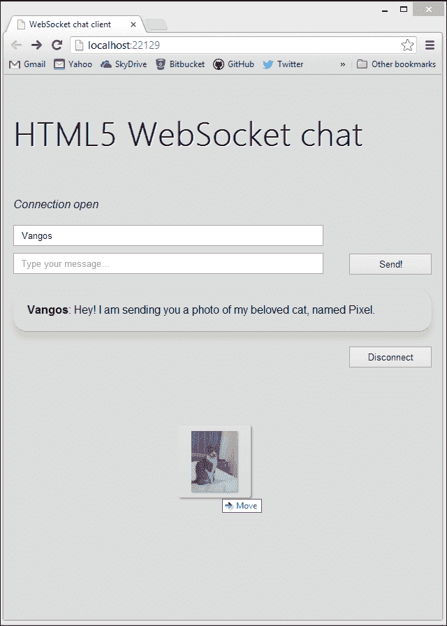
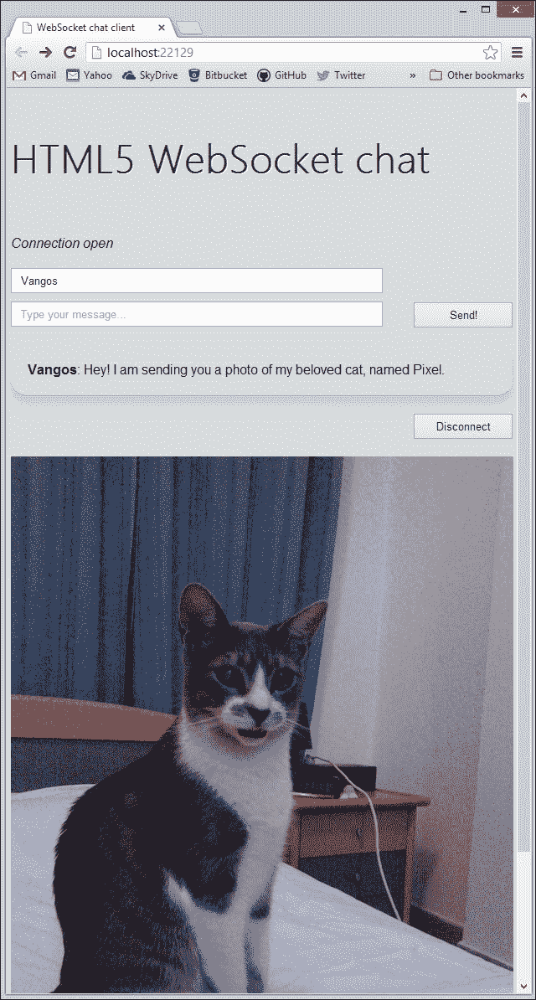

# 第四章：数据传输-发送、接收和解码

现代网页开发都是关于内容的。无论您正在构建什么样的应用程序，用户都会停止使用它，除非他们得到他们想要的。在早期的网络时代，某人可以在自己的网站上发布的内容非常有限。如今，内容远不止是静态文本和图像；您可以交换消息，观看视频，下载程序等等。作为网页开发人员，您应该能够以快速高效的方式传递所需的内容。WebSocket 协议支持各种可传输数据，尽可能地加快整个过程的速度。

在本章的演示中，您将通过 WebSockets 处理图像和视频数据。让我们开始吧！

# WebSockets 可以传输哪些类型的数据？

WebSocket 协议支持文本和二进制数据。在 JavaScript 中，文本称为字符串，而二进制数据由 ArrayBuffer 和 Blob 类表示（第一个仍处于实验阶段）。使用纯文本和二进制格式，您可以传输和解码几乎任何类型的 HTML5 媒体。

请记住，WebSockets 一次只支持一种二进制格式，并且您必须明确声明如下：

```js
socket.binaryType = "arraybuffer";
```

另一种方法是：

```js
socket.binaryType = "blob"
```

在本书中，我们将演示使用每种数据类型的具体示例。

## 字符串

在之前的章节中，您已经简单了解了传输纯文本数据的情况，其中您交换了简单的聊天消息。除此之外，字符串在处理人类可读的数据格式（如**XML**和**JSON**）时非常有帮助。

请记住，每当`onmessage`事件被触发时，客户端需要检查数据类型并相应地采取行动。JavaScript 可以轻松确定数据类型是否为`string`类型，使用严格相等运算符（即`===`）。

```js
socket.onmessage = function(event) {
  if (typeof event.data === "string") {
    console.log("Received string data.");
  }
}
```

如果您对核心 JavaScript 有一般的经验，您可能会注意到您可以使用以下表达式代替：

```js
if (event.data instanceof String)
```

尽管此代码非常有效，但在您的情况下不起作用。原因是`instanceof`表达式要求左侧的对象是使用 JavaScript 字符串构造函数创建的。在您的情况下，数据是从服务器生成的，因此您只能确定它们的基础类型，而不是它们的 JavaScript 类。

### JSON

**JSON**（**JavaScript 对象表示法**）是一种在计算机之间传输人类可读数据的轻量级格式。它以键值对的形式结构化，通常描述属性和值。由于其高效性，JSON 是服务器和客户端之间传输数据的主要格式。如今，包括 Facebook、Twitter 和 Github 在内的最流行的 RESTful API 完全支持 JSON。此外，JSON 是 JavaScript 的子集，因此您可以立即解析它，而无需使用外部解析器！

假设 Web 服务器以某种方式发送了以下 JSON 字符串：

```js
{
"name" : "Vangos Pterneas",
"message" : "Hello world!"
}
```

显然，前面的表示包含两个键值对。猜猜看？在您的聊天演示中，它代表来自另一个用户的聊天数据。您将在几分钟内使用这些信息。

以下代码显示了如何处理 JSON 对象并提取其属性：

socket.onmessage = function(event) {

```js
  if (typeof event.data === "string") {
    // Create a JSON object.
    var jsonObject = JSON.parse(event.data);

    // Extract the values for each key.
    var userName = jsonObject.name;
    var userMessage = jsonObject.message;
  }
}
```

前面的代码很简单。使用`eval`函数，您可以从输入字符串创建一个 JSON 对象。`eval`实际上是调用 JavaScript 编译器并执行封闭的字符串参数。生成对象的属性是 JSON 键的名称，每个属性都包含其相应的值。

### XML

与 JSON 类似，您可以使用 JavaScript 解析 XML 编码的字符串。我们不会深入研究 XML 解析，因为这超出了本书的范围。解析 XML 并不困难，尽管它需要不同的技术来处理不同的浏览器（**DOMParser**与**ActiveXObject**）。最好的方法是使用第三方库，比如**jQuery**。

### 注意

在 XML 和 JSON 的情况下，服务器应该向您发送一个字符串值，而不是实际的 XML/JSON 文件（当然是二进制类型的）！

## ArrayBuffer

ArrayBuffer 包含结构化的二进制数据。关键词在于**结构化**，这意味着封闭的位按顺序给出，因此您可以检索其中的部分。为了针对特定格式操作 ArrayBuffer，您需要创建相应的`ArrayBufferView`对象。

ArrayBuffers 非常适用于存储图像文件。假设您的聊天室客人可以通过在聊天窗口上拖放图像文件来交换图像。以下代码解释了 JavaScript 如何处理 HTML5 浏览器中的拖放事件：

```js
document.ondrop = function(event) {
  var file = event.dataTransfer.files[0];
  var reader = new FileReader();

  reader.readAsArrayBuffer(file);

  reader.onload = function() {
    socket.send(reader.result);
  }

  return false;
}
```

在前面的代码片段中，您首先为拖放事件创建了一个事件处理程序。事件处理程序接受一个参数，让您访问已放置的文件。您只放置了一个单一的图像，因此您需要零索引文件。之后，您创建一个文件读取器，将文件的数据读取为 ArrayBuffer。当读取器完成处理文件时，您处理`onload`事件，其中您使用 WebSocket 将图像发送到 Web 服务器。

在[`www.html5rocks.com/en/tutorials/file/dndfiles/`](http://www.html5rocks.com/en/tutorials/file/dndfiles/)了解更多有关 FileReader 的信息。

以下是提高发送方法的拖放效果的屏幕截图：



将图像拖放到浏览器并发送到服务器

接收 ArrayBuffers 数据相当简单。请注意，您使用`instanceof`进行检查，而不是使用严格相等运算符。

```js
socket.onmessage = function(event) {
  if (event.data instanceof ArrayBuffer) {
    var buffer = event.data;
  }
}
```

## Blob

**Blob**（二进制大对象）以其最原始的形式包含完全原始的数据。理论上，Blob 可能是任何东西，甚至是非 JavaScript 对象。因此，解释 Blob 数据可能会非常棘手。作为一个经验法则，最好确切地知道服务器应该发送什么，否则您将需要做相当不具体的假设。

然而，Blob 数据的一个很大的优势是它们的文件大小。二进制格式是机器级格式，因此几乎没有使用会增加其大小的抽象层。

当您通过网络传输多媒体时，您需要尽可能快的速度，以实现最佳的用户体验。WebSocket Blob 不会为您的互联网连接增加额外的负担，并且它们依赖客户端进行正确的解释。

以下代码显示了如何显示作为一组原始位发送的传入图像：

```js
socket.onmessage = function(event) {
  if (event.data instanceof Blob) {
    // 1\. Get the raw data.
var blob = event.data;

    // 2\. Create a new URL for the blob object.
    window.URL = window.URL || window.webkitURL;
    var source = window.URL.createObjectURL(blob);

    // 3\. Create an image tag programmatically.
    var image = document.createElement("img");
    image.src = source;
    image.alt = "Image generated from blob";

    // 4\. Insert the new image at the end of the document.
    document.body.appendChild(image);
  }
}
```

前面的代码片段通过正确解释传入的原始数据生成了图像。您已经使用了一些全新的 HTML5 JavaScript 方法来轻松处理 Blob。让我们更具体一些。

首先，您验证服务器消息是否是 Blob 的实例，类似于您检查缓冲数组的方式。然后，您将原始数据存储到一个名为`blob`的本地变量中。

为了以图像格式显示 Blob，您需要正确解码它。新的 JavaScript API 使基本图像操作变得非常简单。您不是读取字节，而是创建一个指定数据源的普通 URL。只要 HTML 文档存在，这个 URL 就是活动的。这意味着在关闭浏览器窗口后无法检索它。

`window.URL`属性目前在所有主要浏览器中都受支持，尽管**Google Chrome**将其命名为`window.webkitURL`。`createObjectURL`方法为指定的临时文件生成 URL。您不需要提供任何进一步的细节或编写任何进一步的代码！JavaScript 将您收到的 Blob 表示为正常的浏览器 URL！

最后，使用您已经了解的 DOM 操作方法，您创建一个图像元素，为其提供新的 URL，并将其插入到 HTML 文档的末尾。

### 注意

`createObjectURL`方法在 Chrome 23+、Firefox 8+、Internet Explorer 10+、Opera 16+和 Safari 6+以及它们的移动对应版本中都受支持（除了 IE 和 Opera）。

试一下，你会看到类似以下截图的东西：



显示为 HTML 图像的传入 blob 数据

### 视频流

许多网页设计师和开发人员认为网络的未来是视频。直到现在，视频是通过第三方插件和技术（如 Flash 或 Silverlight）传递的。尽管这些技术在桌面浏览器上运行得很好，但它们需要额外的软件，并且对移动和平板设备的电池寿命造成了灾难。在苹果决定停止 iPhone 和 iPad 对 Flash 的支持之后，HTML5 成为了通过网络传递视频和丰富图形的唯一可用途径。

就 WebSockets 而言，使用快速高效的方式在不同客户端之间流式传输视频是有意义的。实时视频流目前被认为是 Flash 仍然存在的最后原因之一。让我们看看如何可以通过 WebSocket 方式从服务器向客户端流式传输实时视频数据。

视频只不过是一系列连续的图像。每个图像被称为**帧**。当每秒显示多个帧（通常超过 20 帧）时，人眼无法区分这些图像，会认为是连续的流。这就是你要用来从服务器向客户端流式传输视频文件的技术。

服务器每秒发送 20 帧或更多帧（图像），因此客户端不断等待新消息。还记得你为显示图像编写的代码吗？在实时视频流上下文中，你不需要将数据存储为 URL，直到网页关闭。相反，当你不再使用它们时，最好将帧 URL 丢弃。此外，无需使用 JavaScript 创建``元素，因为你可以将它放在我们的标记中：

```js

```

...并在你的 JavaScript 代码中创建一个引用：

```js
var video = document.getElementById("video");
```

因此，这是修改后的 onmessage 客户端事件，每秒将被触发 20 次或更多次：

```js
socket.onmessage = function(event) {
  if (event.data instanceof Blob) {
    // 1\. Get the raw data.
var blob = event.data;

    // 2\. Create a new URL for the blob object.
    window.URL = window.URL || window.webkitURL;
    var source = window.URL.createObjectURL(blob);

    // 3\. Update the image source.
    video.src = source;
    // 4\. Release the allocated memory.
    window.URL.revokeObjectURL(source);
  }
}
```

这段代码与您用来在 HTML 文档中放置图像的代码类似。有两件事需要注意：

+   你已经为``元素创建了一个引用，以便不断修改它的`src`属性。

+   在每次`src`赋值之后，通过调用`revokeObjectURL`函数释放图像。这个函数清理分配给指定 URL 的内存，并让浏览器知道它不需要再保留 URL 的引用了。

以下截图显示了使用连续帧进行视频流传输：


### 注意

虽然它表达了观点，但这可能不是流式传输视频的最佳方式。为了更专业的方法，看看 WebRTC（[`www.webrtc.org`](http://www.webrtc.org)），这是一个由谷歌、Mozilla 和 Opera 实现的出色的多媒体开发 API。

# 把所有东西放在一起

你可能想知道处理请求、接收图像并更新视频帧的服务器端代码在哪里。我们故意留出了服务器端部分，以便专注于客户端 JavaScript 代码。对于我们的聊天演示 Web 应用程序，我们现在将向您展示客户端和服务器端代码。再次注意，您可以使用您选择的编程语言和框架来实现 WebSocket 服务器。

让我们仔细看看你将要实现的新部分。

## 使用 JSON 发送昵称和消息

首先，在 HTML 文档中添加一个文本字段，以便用户输入他/她喜欢的昵称。你将通过以 JSON 格式对它们进行编码，将昵称和文本消息发送出去。

在消息输入框之前添加一个新的文本输入：

```js
<label id="status-label">Status...</label>
<input type="text" id="name-view" placeholder="Your name" />
<input type="text" id="text-view" placeholder="Type yourmessage..." />
```

然后，在 JavaScript 代码中创建一个引用：

```js
var nameView = document.getElementById("name-view");
```

最后，像几页前一样，将昵称和消息发送到服务器！

```js
buttonSend.onclick = function (event) {
  if (socket.readyState == WebSocket.OPEN) {
    var json = "{ 'name' : '" + nameView.value + "', 'message' :
      '" + textView.value + "' }";
    socket.send(json);
    textView.value = "";
  }
}
```

服务器现在需要将这条消息传输给客户端。与上一章相比，没有任何改变：

```js
socket.OnMessage = message =>
  {
    // Send the text message to everyone!
    foreach (var client in clients)
      {
        client.Send(message);
      }
  };
```

客户端解码 JSON 字符串并相应地显示消息。您已为在聊天区域显示文本添加了更漂亮的呈现样式。

```js
socket.onmessage = function (event) {
  if (typeof event.data === "string") {
    // Display message.
    var jsonObject = eval('(' + event.data + ')');
    var userName = jsonObject.name;
    var userMessage = jsonObject.message;

    chatArea.innerHTML = chatArea.innerHTML + 
      "<p><strong>" + userName + "</strong>: " + userMessage +
        "</p>";
  }
}
```

## 将图像发送到服务器

还记得我们之前讨论过的`ondrop`事件吗？出于一致性原因，这里使用 Blob 而不是 ArrayBuffers 实现了相同的功能：

```js
document.ondrop = function(event) {
  var file = event.dataTransfer.files[0];

  socket.send(file);

  return false;
}
```

处理 HTML5 拖放时，记住始终要阻止默认的拖放行为！除非您明确定义要覆盖默认功能，否则您实现的任何内容都不会显示正确。幸运的是，阻止预定义的操作发生非常简单：

```js
document.ondragover = function (event) {
  event.preventDefault();
}
```

服务器需要将 blob 图像分发给所有客户端。`Fleck`库引入了`OnBinary`事件，当接收到二进制数据时会触发。

```js
socket.OnBinary = data =>
  {
    // Send the binary data to everyone!
    foreach (var client in clients)
      {
        client.Send(data);
      }
};
```

该方法与`OnMessage`方法类似。唯一的区别是它以字节数组（数据）而不是字符串作为参数。字节数组是最本地和高效的图像表示。

当其余客户端接收到图像时，将创建一个新的``元素。您已经看到了方法，所以相应地更新`onmessage`函数：

```js
socket.onmessage = function(event) {
if (typeof event.data === "string") {
  // Decode JSON, then display nickname and message.
  // …
}
  else if (event.data instanceof Blob) {
  // Get the raw data and create an image element.
var blob = event.data;

    window.URL = window.URL || window.webkitURL;
    var source = window.URL.createObjectURL(blob);

var image = document.createElement("img");
    image.src = source;
    image.alt = "Image generated from blob";

    document.body.appendChild(image);
  }
}
```

# 总结

在本章中，您详细了解了 WebSocket 协议支持的各种数据格式。您使用字符串和二进制数据（文本、图像和视频）实现了各种示例，找出了如何正确地对客户端数据进行编码和解码，最后扩展了聊天演示以操纵图像和视频。下一章将讨论网络上的安全考虑，这将使您的应用程序更加健壮。
