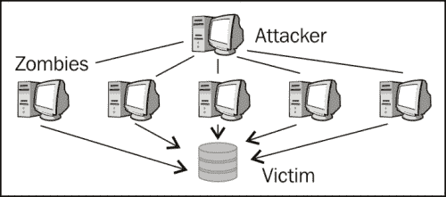
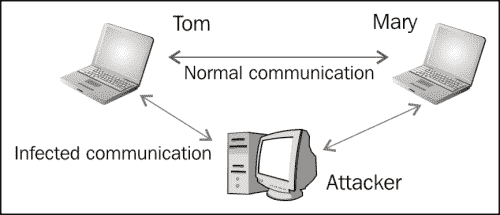
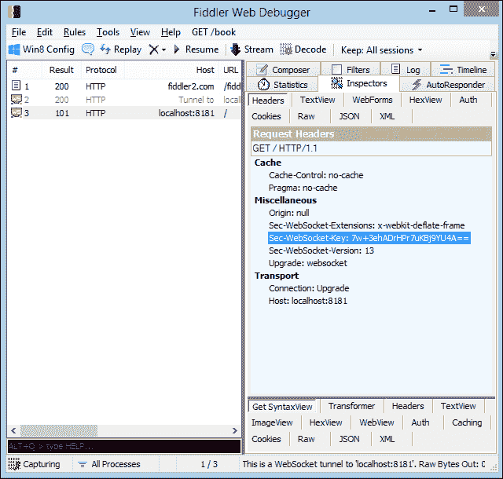
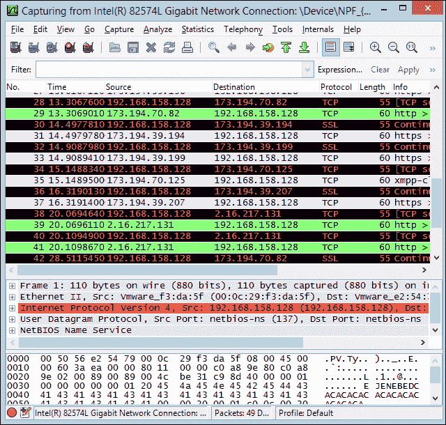
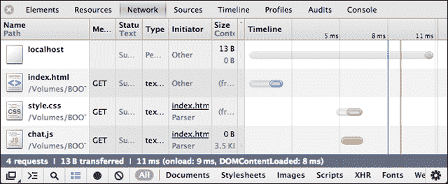
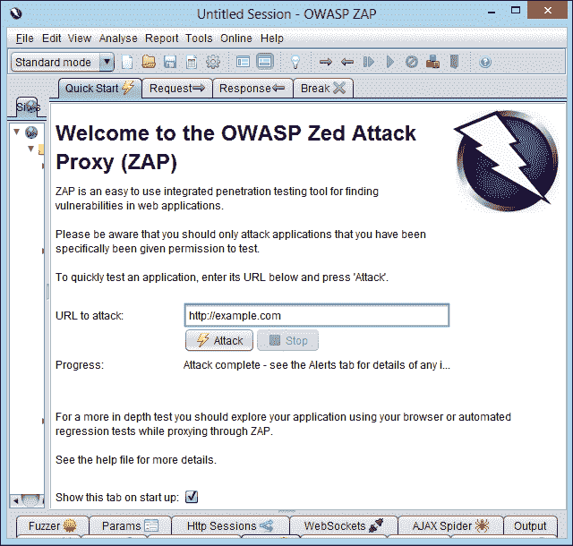

# 第五章：安全

安全对于交换数据的 Web 应用程序来说是一个至关重要的问题。每个在网络中生存和发展的站点或应用程序都可能受到人类或机器入侵者的攻击。这是一个令人沮丧但却真实存在的现实，我们都必须接受。

当然，这并不意味着您的 Web 应用是完全不安全的。幸运的是，原生 HTML5 安全机制可以在不进行任何配置的情况下保护您免受最常见的安全攻击。此外，WebSocket 协议旨在成为一个安全服务，因此基本的保护是有保障的。

在本章中，我们将介绍 WebSocket 应用可能存在的一些已知安全风险，并为您提供工具和知识，以防止、对抗和克服这些风险，以保护您的用户。

# WebSocket 标头

通常您不会与一个不认识的人或不愿透露身份的人握手。在 WebSocket 世界中，您需要确保请求的来源。**来源**是客户端发送的一个标头，对于跨域通信至关重要，因为它允许 Web 服务器拒绝特定的连接。来源是 WebSocket 中引入和记录的第一个也是最重要的安全方面。

还需要一些额外的标头才能允许客户端升级到 WebSocket 协议。这些标头以`Sec-`前缀开头，并保证每个 WebSocket 请求都将通过 WebSocket 构造函数初始化，而不是任何可能要访问交换信息的 HTTP API。

以下是客户端发送的 WebSocket 标头的示例：

```js
GET /chat HTTP/1.1
Host: server.example.com
Upgrade: websocket
Connection: Upgrade
Origin: http://example.com
Pragma: no-cache
Cache-Control: no-cache
Sec-WebSocket-Key: AAf/gvkPw6szicrMH3Rwbg==
Sec-WebSocket-Version: 13
Sec-WebSocket-Extensions: x-webkit-deflate-frame
```

`Sec-WebSocket-Version`参数可以帮助您识别所使用的浏览器。如果您需要针对特定浏览器进行特定调整，请注意。服务器的相应握手应如下所示：

```js
HTTP/1.1 101 Switching Protocols
  Upgrade: websocket
  Connection: Upgrade
  Sec-WebSocket-Accept: s3pPLMBiTxaQ9kYGzzhZRbK+xOo=
```

如果您对更多理论细节感兴趣，请随时阅读 RFC 6455 的完整规范[`tools.ietf.org/html/rfc6455`](http://tools.ietf.org/html/rfc6455)。

# 常见攻击

目前，您需要知道的是，该协议旨在尽可能安全。不过要小心！WebSocket 是一个全新的协议，而并非所有的 Web 浏览器都正确实现了它。例如，其中一些仍允许 HTTP 和 WS 的混合使用，尽管规范暗示相反。一切都可能发生变化，而在等待浏览器成熟的同时，您可以轻松地自行采用一些保护技术。

因此，老式的问题并没有得到解决。还记得那些窃听 HTTP 并拦截网络流量的坏人吗？嗯，WS 也可以被同样的方式窃听。

以下是您需要注意的一些常见安全攻击，以及因此您可以保护您的应用程序和用户的一些方法。

## 拒绝服务

**拒绝服务**（**DoS**）攻击试图使机器或网络资源对请求它的用户不可用。想象一下，有人以无限次数的请求以极短的时间间隔向 Web 服务器发出请求。显然，服务器无法处理每个连接，要么停止响应，要么响应过慢。这是 DoS 攻击的最简单形式。

无需多言，这对最终用户来说可能是多么令人沮丧，他们甚至无法加载一个网页。

DoS 攻击甚至可以应用于点对点通信，迫使 P2P 网络的客户端同时连接到受害的 Web 服务器。

以下图描述了 DoS 攻击：



DoS 攻击

## 中间人攻击

假设您正在通过即时通讯客户端与女友聊天。她的前男友想要查看您交换的消息，因此他与您两个独立建立连接，并窃听您的消息。他还向您和您的女友发送消息，作为您通信的隐形中间人。这就是所谓的中间人攻击。中间人攻击更容易发生在未加密的连接上，因为入侵者可以直接读取数据包。当连接加密时，信息必须由攻击者解密，这可能会非常困难。

从技术角度来看，攻击者拦截公钥消息交换并发送消息，同时用自己的密钥替换请求的密钥。

显然，使攻击者的工作变得困难的一个坚实策略是使用带有 WebSockets 的 SSH。在交换关键数据时，最好使用 WSS 安全连接，而不是未加密的 WS。

以下图表描述了间谍如何干扰和获取数据：



中间人攻击

## XSS

**跨站脚本**（**XSS**）是一种漏洞，使攻击者能够将客户端脚本注入到网页或应用程序中。攻击者可以使用您的应用程序中心发送 HTML 或 JavaScript 代码，并让该代码在客户端机器上执行。

当填写网页表单时，您可能会遇到最简单形式的 XSS 攻击。想象一下，有人使用我们开发的聊天应用程序发送了以下数据：

```js

```

试一下！在消息文本字段中输入上述行，点击**发送**，并等待结果。

以下图像显示了对我们的 WebSocket 聊天应用程序的 XSS 攻击：


尽管在聊天应用程序中图像传输并不坏，但用户通过注入 HTML 代码发送了图像。以类似的方式，某人可能会执行 JavaScript 代码并损害对话。

我们能做些什么？考虑到关于 XSS 攻击的旧规则仍然有效并且是最佳实践。您可以检查您的代码中的 HTML 实体或 JavaScript 语法，并用适当的表示形式替换它们，或者简单地拒绝它们。

[`www.owasp.org/index.php/XSS_Filter_Evasion_Cheat_Sheet`](https://www.owasp.org/index.php/XSS_Filter_Evasion_Cheat_Sheet) 包含了更多信息，如果您想了解 XSS 攻击的各个方面以及如何避免它们。

# WebSocket 本地防御机制

默认情况下，WebSocket 协议设计为安全的。在现实世界中，您可能会遇到由于浏览器实现不佳而可能发生的各种问题。不过不用担心。随着时间的推移，浏览器供应商会立即修复任何问题，如果您仍然感到害怕，您总是可以使用一些老式的回退技术（在下一章中描述）。

## SSH/TLS

正如您可能已经猜到的那样，当您在 SSH（或 TLS）上使用安全的 WebSocket 连接时，会增加一层额外的安全性。还记得当您需要在 HTTP 和 HTTPS 之间做出决定吗？只有在绝对必要时才选择 HTTPS 进行交易（例如，银行账户信息，私人数据等）。否则，HTTP 是更轻量级和更快速的选择。HTTPS 需要更多的 CPU 资源，比 HTTP 慢得多。

在 WebSocket 世界中，您不需要担心安全连接的性能。尽管顶部仍然有额外的 TLS 层，但协议本身包含了针对这种用途的优化，此外，WSS 通过代理更加流畅。

## 客户端到服务器的掩码

WebSocket 服务器和 WebSocket 客户端之间传输的每条消息都包含一个名为**掩码密钥**的特定密钥，这允许任何符合 WebSocket 标准的中间人解除掩码并检查消息。如果中间人不符合 WebSocket 标准，则消息不会受到影响。掩码由实现 WebSocket 协议的浏览器处理。

# 安全工具箱

最后，我们介绍了一些有用的工具，帮助您调查 WebSocket 客户端和服务器之间信息流动，分析交换的数据，并识别可能的风险。

## Fiddler

**Fiddler**是一个很棒的工具，用于监视网络活动并检查任何传入或传出数据的流量。

以下截图显示了 fiddler 的操作，显示了 WebSocket 的标头：



Fiddler 可以从[`www.fiddler2.com/fiddler2/`](http://www.fiddler2.com/fiddler2/)下载

## Wireshark

**Wireshark**是一个网络数据包分析器，捕获数据包并尽可能准确地显示其数据。

以下截图显示了 wireshark 的操作：



Wireshark 可以从[`www.wireshark.org/`](http://www.wireshark.org/)下载

## 浏览器开发者工具

Chrome，Firefox 和 Opera 在开发者支持方面是很棒的浏览器。它们内置的工具帮助我们确定几乎任何客户端交互和资源的方面。

以下截图显示了 Chrome 开发者工具的操作：



## ZAP

**ZAP**是一个渗透测试工具，通过对 Web 应用程序和站点进行攻击，发现它们的漏洞！与所有先前的工具一样，ZAP 带有方便的 GUI 可视化。

以下截图显示了 ZAP 的操作：



ZAP 可以从[`code.google.com/p/zaproxy/`](https://code.google.com/p/zaproxy/)下载

# 总结

在本章中，您调查了您的 Web 应用程序必须意识到的各种安全威胁，看到了内置的 WebSocket 安全机制，并介绍了一些流行的工具，帮助我们更好地管理网络传输。接下来，我们将描述一些针对缺乏完整或部分 WebSocket 支持的浏览器的备用技术。
