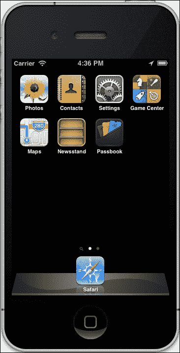
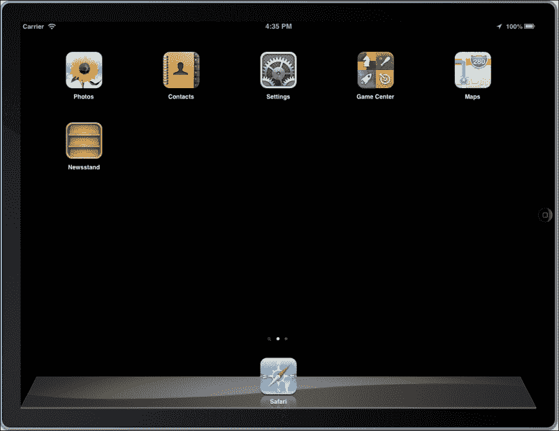
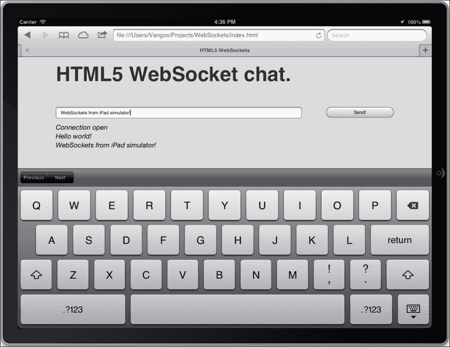
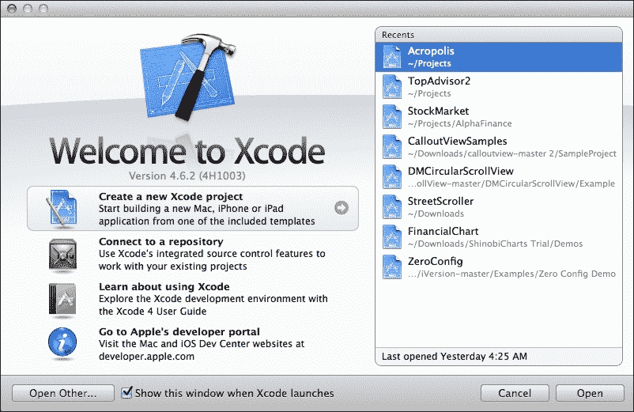
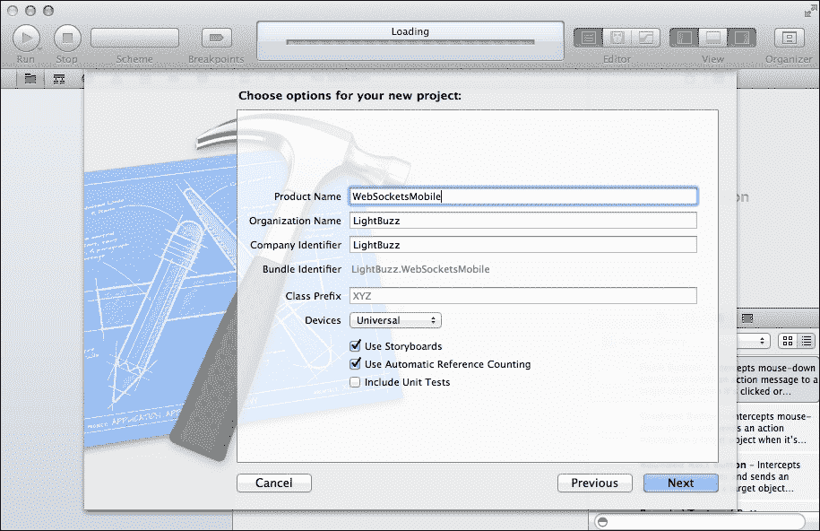
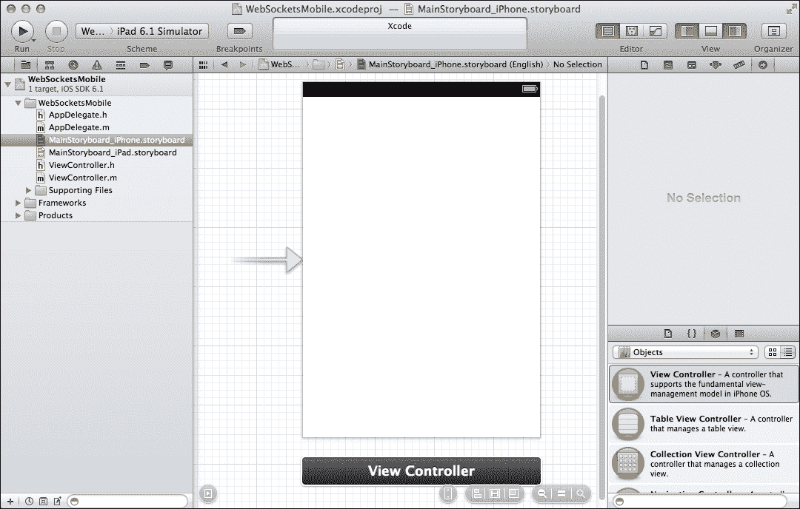
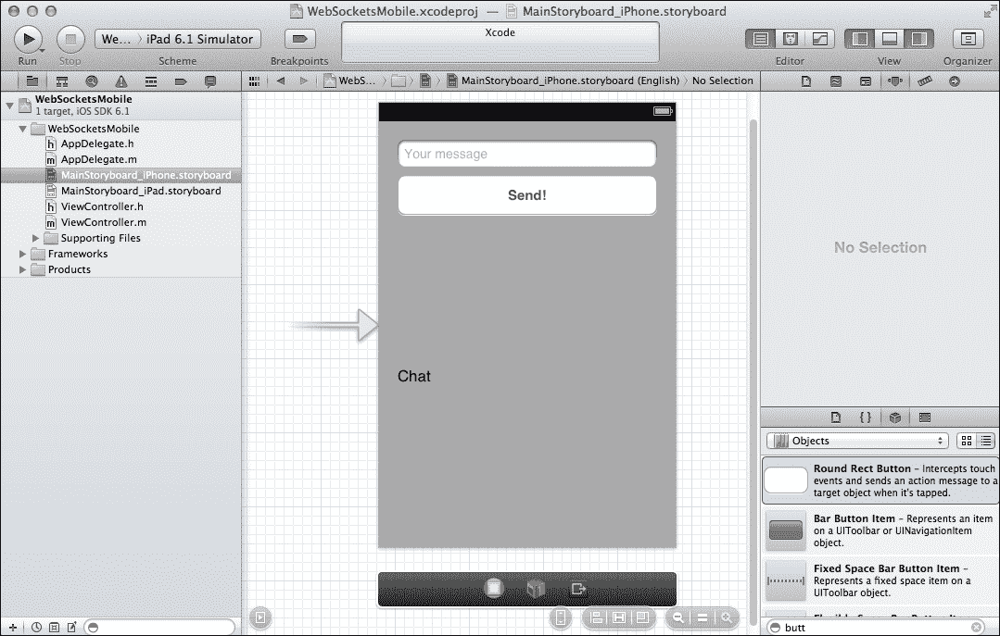
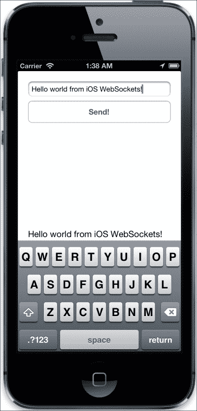

# 第七章：进入移动（还有平板）

WebSockets，顾名思义，是使用网络的东西。网络通常与浏览器页面交织在一起，因为这是显示在线数据的主要手段。然而，非浏览器程序也使用在线数据传输。iPhone（最初）和 iPad（后来）的发布引入了一个全新的网络互联世界，而不一定需要使用网络浏览器。相反，新的智能手机和平板设备利用原生应用程序的力量提供了独特的用户体验。

# 为什么移动设备很重要

目前，全球有十亿部活跃的智能手机。也就是说，有数百万潜在的应用程序客户。这些人使用他们的手机来完成日常任务、上网、交流或购物。

智能手机已经成为应用程序的代名词，如今，几乎任何用途都有相应的应用程序。大多数应用程序连接到互联网以检索数据，进行交易，收集新闻等。

如果您能够利用现有的 WebSocket 知识并开发在智能手机或平板设备上本地运行的 WebSocket 客户端，那将是多么美妙啊！

## 原生移动应用与移动网站

嗯，这是一个常见的冲突，通常情况下，答案取决于您的需求和目标受众。如果您熟悉现代设计趋势，设计一个响应式和移动友好的网站现在是必须的。然而，您应该确保内容，也就是真正重要的东西，通过智能手机和经典桌面浏览器同样可以访问。

毫无疑问，WebSocket 网络应用程序将在任何符合 HTML5 标准的浏览器上运行，包括 iOS 的 Safari 和移动设备的 Chrome。因此，在现代智能手机上不需要担心兼容性问题。

然而，如果您的应用程序利用设备特定信息，如离线存储、GPS、通知或加速计，以及 WebSockets，您需要使用除 HTML 和 JavaScript 之外的更本地的实现语言。W3C 正在定义一些规范，让客户端可以访问摄像头、GPS 和加速计等硬件。然而，目前只有少数现代网络浏览器支持这些规范。在撰写本文时，本地方法是前进的道路，尽管客户端的未来似乎更加有趣！iOS 使用 Objective-C，Android 使用 Java，Windows Phone 使用 C#。如果您认为您的移动使用情景不需要利用智能手机的任何功能，可以选择基于浏览器的应用程序。如果需要原生功能，则需要原生解决方案。这正是我们将在本章中构建的内容！

## 先决条件

为了开发智能手机应用程序，您需要安装首选目标的开发工具和 SDK。我们将演示的示例背后的哲学在三大主要移动操作系统中基本相同，即 iOS、Android 和 Windows。

如果您尚未安装移动 SDK，请在以下位置选择一个（它们都是免费的）：

| 平台 | 目标 | SDK 网址 |
| --- | --- | --- |
| iOS | iPhone, iPad | [`developer.apple.com/devcenter/ios/`](https://developer.apple.com/devcenter/ios/) |
| Android | Android 手机和平板 | [`developer.android.com/sdk/`](http://developer.android.com/sdk/) |
| Windows | Windows Phone, Windows 8 | [`developer.windowsphone.com/ develop`](http://developer.windowsphone.com/ develop)&[`msdn.microsoft.com/ windows/apps`](http://msdn.microsoft.com/ windows/apps) |

我们假设您至少熟悉上述 SDK 和技术之一。如果不熟悉，您可以转到相应的开发者门户网站，并按照在线资源和教程进行操作，这将为您提供一个很好的起点。

在本章中，我们决定为 iOS 提供代码示例，但请随意使用您最熟悉的平台。

## 安装 SDK

下载所需的 SDK 后，您将按照自动化向导的步骤在系统中安装它。请注意，iOS SDK 只能在 Mac 操作系统上运行，Windows SDK 在 Windows 操作系统上运行，Android SDK 在 Mac、Windows 或 Linux 上运行。除了 SDK，还有一些自动安装的好东西：

+   智能手机/平板电脑模拟器

+   一个集成开发环境，您可以在其中编写和调试代码

尽管您应该始终在真实设备（手机和平板电脑）上测试代码，但模拟器是一个非常可靠的持续调试解决方案。

考虑到 iOS，这里有 iPhone 和 iPad 模拟器，运行 iOS 6。

下图显示了一个 iPhone 模拟器：



下图显示了一个 iPad 模拟器：



## 在移动浏览器中测试我们现有的代码

还记得我们在第二章中编写的 HTML 和 JavaScript 代码吗，*WebSocket API*？安装了 SDK 和模拟器后，我们可以使用模拟器中包含的移动浏览器访问网络。我们还可以访问本地的 HTML、CSS 和 JavaScript 文件，而无需将它们上传到 Web 服务器。这是一个在 iPad 上运行良好的聊天客户端。

以下图片显示了 Safari 上的 iOS WebSocket web 应用（代码没有修改）：



# 使用原生方式

那么，如果您的应用程序支持特定设备或离线功能，并且仍希望在网络可用时使用 WebSockets 呢？

您可以使用原生方式。

幸运的是，所有主要的移动平台都支持 WebSockets，因此您无需对服务器代码进行任何更改！毕竟，HTML5 就像 iPhone 或 iPad 一样是一个前端客户端。使用与 JavaScript 示例相同的技术，您将使用 Objective-C 构建相同的应用程序。这个过程与任何其他移动平台类似，所以如果您对 Objective-C 概念不熟悉，也不用担心。

## 创建项目

首先，打开**XCode**，这是苹果提供的用于构建 iOS 应用的开发环境。Eclipse 和 Visual Studio 是 Android 和 Windows 的等价物。

按照给定的步骤创建项目

1.  启动 XCode，然后点击**创建新的 XCode 项目**。以下截图显示了 XCode 的启动画面：

1.  创建一个单视图应用程序。提供一个名称，以及公司和组织标识符（如果需要）。例如，将应用程序命名为`WebSocketsMobile`。然后，选择一个本地文件夹放置它，如下图所示：

## 创建 WebSocket iPhone 应用

如果您需要为生产部署应用程序，还需要为目标平台指定一些图标。我们现在将跳过这些内容，但请随意添加应用程序可能需要的任何资源。XCode 会自动为我们创建一些文件。故事板文件（一个用于 iPhone，一个用于 iPad）将让我们创建应用程序的用户界面，`ViewController`文件将处理所有编程逻辑。

以下截图显示了我们 iPhone 应用的初始 UI：



1.  在用户界面构建器中添加一些控件。为了学习目的，我们将尽量保持简单，只添加一个用于编写消息的`UITextField`，一个用于发送消息的按钮，以及一个用于显示聊天消息的`UILabel`。记得将标签的行数设置为 0（即无限）。不要忘记使用助理编辑器将输出连接到**视图控制器**，（[`www.techotopia.com/index.php/Establishing_Outlets_and_Actions_using_the_Xcode_Assistant_Editor).`](http://www.techotopia.com/index.php/Establishing_Outlets_and_Actions_using_the_Xcode_Assistant_Editor).)下面的截图显示了 iPhone 应用程序的用户界面：

1.  下载`UnittWebSocketClient`库并将其包含在项目中。该库处理大部分 WebSocket 功能。您可以选择另一个库或者实现自己的库。按照[`code.google.com/p/unitt/wiki/UnittWebSocketClient`](https://code.google.com/p/unitt/wiki/UnittWebSocketClient)中指定的方向进行操作。

1.  在项目中包含库的头文件，并将您的视图控制器指定为`WebSocketDelegate`。然后订阅相应的事件，这些事件与 JavaScript 的事件相同：

```js
// ViewController.h

#import <UIKit/UIKit.h>
#import "WebSocket.h"
@interface ViewController : UIViewController <WebSocketDelegate>
@end

// ViewController.m

#import "ViewController.h"

@interface ViewController ()

@end

@implementation ViewController

- (void)viewDidLoad
{
  [super viewDidLoad];
}

- (void)didReceiveMemoryWarning
{
  [super didReceiveMemoryWarning];
}

- (void)didOpen
{
  // JavaScript event: onopen
}

- (void)didClose:(NSUInteger)aStatusCode message:(NSString *)aMessage error:(NSError *)aError
{
  // JavaScript event: onclose
}

- (void)didReceiveError:(NSError *)aError
{
  // JavaScript event: onerror
}

- (void)didReceiveTextMessage:(NSString *)aMessage
{
  // JavaScript event: onmessage
}

- (void)didReceiveBinaryMessage:(NSData *)aMessage
{
  // JavaScript event: onmessage
}

@end
```

1.  现在是时候填充方法了，就像我们在 JavaScript 示例中所做的那样。以下是设置应用程序并运行所需做的事情：

```js
// ViewController.h

@interface ViewController : UIViewController <WebSocketDelegate>
{
  // Create a new WebSocket object.
  WebSocket *socket;
}

// ViewController.m

- (void)viewDidLoad
{
  [super viewDidLoad];

  // Specify the WebSocket configuration. The only necessary parameter is the URL.
  WebSocketConnectConfig *config = [WebSocketConnectConfig
    configWithURLString:@"ws://echo.websocket.org"
    origin:nil protocols:nil tlsSettings:nil headers:nil
      verifySecurityKey:YES extensions:nil];

  // Initialize the WebSocket object.
  socket = [WebSocket webSocketWithConfig:config
    delegate:self];

  // Open the WebSocket connection and start listening for
    events.
  [socket open];
}

- (void)didReceiveTextMessage:(NSString *)aMessage
{
  // JavaScript event: onmessage

  labelChat.text = [NSString stringWithFormat:@"%@\r%@",
    labelChat.text, aMessage];
}

- (IBAction)sendTapped:(id)sender
{
  [socket sendText:textMessage.text];
}
```

下图显示了本机 iOS WebSocket 客户端正在运行！



# iPad 怎么样呢？

虽然您创建的应用程序在 iPad 设备上运行得很好，但最好为平板提供不同的界面。只需转到`MainStoryboard_iPad.storyboard`文件，重新排列 UI 元素，并提供特定于平板的功能。然后，选择项目目标，在摘要选项卡中展开`iPad 部署信息`选项，并确保选择了`MainStoryboard_iPad`。如果您的应用程序不太复杂，可以选择 iPhone storyboard，或者指定应用程序目标仅为 iPhone。这样，当有人在 iPad 设备上运行您的应用程序时，他/她将在 iPad 设备上看到一个居中显示的较小屏幕。

# 摘要

在本章中，我们发现了 WebSockets 如何可以作为在连接的移动和平板客户端之间传输消息的通用枢纽。我们实现了一个原生的 iOS 应用程序，它与一个 WebSocket 服务器进行通信，就像 HTML5 JavaScript 客户端一样。
