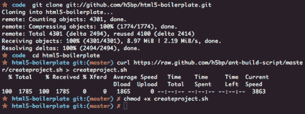
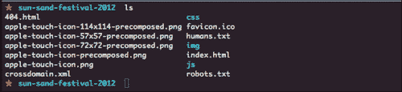
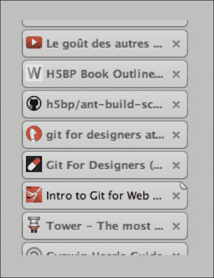
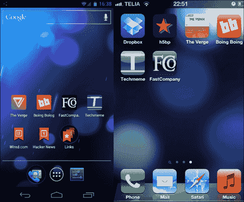
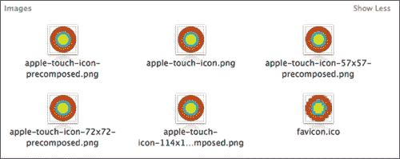
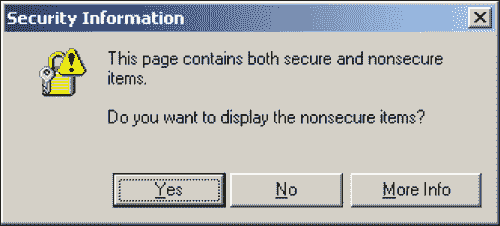
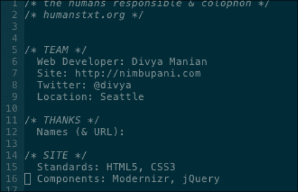

# 第二章：开始你的项目

你希望尽快开始你的项目，并在本章中我们将看到一些使用 HTML5 Boilerplate 的最快方法。

有许多种 HTML5 Boilerplate 可供选择，我们将研究一些创建起始文件夹的机制，并查看一旦开始后你可以处理的即时任务。

# 创建你的初始项目文件夹

HTML5 Boilerplate 可以从网站上以三个版本获得，就像我们在上一章中看到的那样。以下是使用最新文件的两种最快方法：

+   下载 HTML5 Boilerplate 的最新版本，用于你开始的每个新项目

+   维护 HTML5 Boilerplate 的本地最新副本，并使用脚本将文件复制到你的项目中

现在我们将看看这两种方式。

## 下载 HTML5 Boilerplate 的最新版本

这是使用 HTML5 Boilerplate 最新文件的最简单方法。如果你熟悉 Git，你可以将 HTML5 Boilerplate 下载为一个文件夹。在你的命令行界面中，导航到你通常存储项目的文件夹，然后在命令行界面中输入以下命令：

```js
git clone git://github.com/h5bp/html5-boilerplate.git

```

这将在该文件夹中下载一个名为`html5-boilerplate`的文件夹。然后你可以将其重命名为你自己的项目并开始使用。

如果你不熟悉命令行界面，你可以将最新文件下载为 ZIP 文件并解压到一个你想要使用的项目的文件夹中。

如果你觉得这些选项很繁琐，我建议你使用 shell 脚本。但是，这需要你已经设置好 Git 并熟悉命令行界面。

### 注意

如果你使用 Windows，请确保下载**Cygwin**，网址为`sources.redhat.com/cygwin/cygwin-ug-net/cygwin-ug-net.html`，并在输入我提到的所有命令行时使用它。

在`nathanj.github.com/gitguide/tour.html`上还有一个关于在 Windows 上设置和使用 Git 的图解指南。

## 使用 shell 脚本

使用这个脚本，我们将为 HTML5 Boilerplate 设置一个本地存储库，以便随着项目中的更改进行更新。

前往你想要存储最新 HTML5 Boilerplate 文件副本的文件夹。在我的情况下，我想将它保存在一个名为`source`的文件夹中。

然后，使用前一节中提到的相同命令行脚本来下载文件的最新副本。脚本如下：

```js
git clone git://github.com/h5bp/html5-boilerplate.git

```

我们将让这个文件夹保持原样，而不是重命名文件夹。接下来，我们将把`createproject.sh` shell 脚本复制到这个文件夹中。

在你的 shell 中，导航到`html5 Boilerplate`文件夹，并按照以下命令行脚本中所示下载`createproject.sh`文件：

```js
curl https://raw.github.com/h5bp/ant-build-script/master/createproject.sh > createproject.sh

```

确保它是可执行的，通过在 shell 中执行以下命令：

```js
chmod +x createproject.sh

```

这些命令行脚本的执行如下截图所示：



然后从命令行执行以下脚本：

```js
./createproject.sh <project-name>

```

这将在`html5-boilerplate`文件夹的父文件夹中创建一个以项目名称命名的文件夹。如果你希望将项目文件放在其他地方，你也可以使用项目文件夹的绝对路径，如下面的脚本所示：

```js
./createproject.sh /Users/divya/projects/<project-name>

```

# 创建我们的项目

在本书中，我们将通过一个示例项目来理解如何使用 HTML5 Boilerplate。我们所有的项目源文件都可以在`nimbu.in/h5bp-book/sun-shine-festival-2012/`上找到。

假设我们需要为塞内加尔达喀尔的 Ngor 和 Terou Bi 举办的一个虚构的阳光和沙滩节创建一个网站，时间是 2012 年 11 月 12 日至 2012 年 11 月 16 日。我想将这个项目标记为`sun-sand-festival-2012`。

我将所有项目存储在一个`projects`文件夹中，所有框架和起始工具包存储在一个`source`文件夹中。

在我的源文件夹中，我有最初使用以下脚本创建的`html5-boilerplate`文件夹：

```js
git clone git://github.com/h5bp/html5-boilerplate.git

```

我通过使用以下脚本定期从 Github 托管的主存储库中拉取最新更改来保持其最新：

```js
git pull origin master

```

我还在同一个文件夹中有`createproject.sh` shell 脚本，我们将用它来创建我们的新项目。在 shell 界面中，我导航到`html5-boilerplate`文件夹并输入以下脚本：

```js
./createproject.sh ../projects/sun-sand-festival-2012

```

这将创建包含所有所需文件的项目文件夹，以便开始。创建的文件如下截图所示：



# House-keeping

现在我们的项目准备好了，让我们开始做一些基本的工作，这是我们在任何项目中都需要做的。在任何你习惯使用的文本编辑器中打开项目。

### 提示

我强烈推荐跨平台的**Sublime Text**文本编辑器，可从[www.sublimetext.com](http://www.sublimetext.com)下载。命令行大师可能想尝试使用**Vim**文本编辑器，可从[www.vim.org](http://www.vim.org)下载。

## 设置标签

我们的`index.html`页面包含一些需要填写的标签：

```js
<title></title>
<meta name="description" content="">
```

对于我们项目的标题标签，让我们输入以下内容：

```js
<title>Home | Sun and Sand Festival 2012, Dakar</title>
```

带有`name`描述的`meta`标签在网站在搜索引擎结果中列出时非常有用。此标签将用于呈现解释此页面内容的文本片段。让我们将其设置为以下内容：

```js
<meta name="description" content="Sun and Sand Festival is occurring between Nov 12 to Nov 16 2012 at the Ngor and Terou Bi, Dakar featuring performances by top Senegal artists">
```

## 编辑网站图标

添加网站图标是我们大多数人在开始项目时忘记做的下一个琐事。这是你可以在开始思考你将要创建的代码之前轻松达成的下一个目标。

网站图标有助于唯一标识您的网站。如下截图所示，拥有一个网站图标可以轻松识别您想要访问的标签或书签：



当你的页面被添加到 iOS 的主屏幕（如右侧的截图所示）和 Android 设备（如左侧的截图所示）时，触摸图标非常有用：



HTML5 Boilerplate 在根文件夹中附带了一组图标，这些图标的尺寸适合触摸屏图标（Android 和 iOS 设备都使用）和网站图标的所有所需图标。在制作图标时，您可以将它们用作指南。

HTML5 Boilerplate 附带以下一组图标：

+   **favicon.ico**：桌面浏览器用于在标签上或标题旁渲染图标的默认图标。

+   **apple-touch-icon.png**：如果没有指定其他内容，iOS 将使用此图标在主屏幕上呈现。不幸的是，这也意味着 iOS 将在此图标上添加自己的效果，如阴影、圆角和反射光。如果没有其他支持，这也是一个很好的后备图标格式，例如 iOS 1 和 BlackBerry OS 6。

+   **apple-touch-icon-precomposed.png**：这可以防止 iOS 在你的图标上应用任何效果，并使其呈现原样。提供此图标还将确保 Android 2.1 及以上设备在将你的网页添加到主屏幕时使用此图标。

+   **apple-touch-icon-57x57-precomposed.png**：这将被没有 Retina 显示屏的 iOS 设备使用。

+   **apple-touch-icon-72x72-precomposed.png**：这将被没有高分辨率显示屏的 iPad 使用。

+   **apple-touch-icons-114x114-precomposed.png**：这将被高分辨率的 iPhone Retina 显示屏使用。

+   **apple-touch-icons-144x144-precomposed.png**：这将被高分辨率的 iPad Retina 显示屏使用。

为什么我们有这么多图标的原因已经由 Mathias Bynens 在[`mathiasbynens.be/notes/touch-icons`](http://mathiasbynens.be/notes/touch-icons)中记录。

### 注意

Hans Christian Reinl 在 `drublic.de/blog/html5-boilerplate-favicons-psd-template/` 上托管了所有图标的 `PSD` 模板，你可以使用它来开始为你的项目创建图标。如果你需要关于如何创建这些图标的指导，Jon Hicks 在 [www.netmagazine.com/features/create-perfect-favicon](http://www.netmagazine.com/features/create-perfect-favicon) 上写了关于如何做的文章。

如果你有必要创建图标的图形元素，你可以开始将这些图标添加到项目的根文件夹中。当截止日期临近时，你很可能会忘记这样做。

对于我们的阳光和沙滩节例子，我们已经收集了关键的图形元素，下面的截图显示了从 `PSD` 模板生成的图标：



## 添加第三方库

如果你已经有一个将要使用的库列表，你可以开始将它们添加到文件夹中。

HTML5 Boilerplate 自带最新稳定版本的 jQuery，所以你已经有了。如果你想使用其他库，比如 jQuery UI，你可以将它们复制到 `libs` 文件夹中。

假设你想在项目中使用 jQuery UI，在 [www.jqueryui.com](http://www.jqueryui.com) 上可用，那么将最新版本的 jQuery UI 复制到 `libs` 文件夹中，然后在 `index.html` 标记的底部使用 `script` 标签引用它。

### 使用内容传送网络

通过使用**内容传送网络**（**CDN**），我们可以减少在我们的网络服务器上提供的资源数量，并通过引用由谷歌或微软普遍托管的资源，更有可能文件会被缓存，因为用户访问的许多其他网站也会引用这个特定的资源。

如果你仔细观察，你会注意到链接到 jQuery 的脚本的源与我们的 jQuery UI 源不同。这有两个原因，这两个原因在以下部分中有解释。

#### 协议相对 URL

通常，大多数链接到网络上资源的 URL 以 `http://` 开头。然而，有时页面托管在使用加密通信的服务器上。因此，你的页面将使用 `https://` 而不是典型的 `http://`。然而，由于你的脚本源仍然使用 `http://` 协议，IE 将向你的页面访问者抛出一个令人讨厌的对话框，询问以下问题：



你绝对不希望你的访问者因此而恐慌。所以，最简单的方法是完全删除 URL 中的协议（`http:`）部分，如下所示：

```js
//ajax.googleapis.com/ajax/libs/jquery/1.7.1/jquery.min.js

```

这样，浏览器将使用页面所使用的任何协议进行请求。你可以在附录部分了解更多关于协议相对 URL 的信息。

当然，这意味着如果你在本地测试，并且在浏览器上查看你的页面，浏览器将使用类似 `file://users/divya/projects` 的 URL，因此浏览器将尝试使用以下 URL 查找 jQuery 文件：

```js
file://ajax.googleapis.com/ajax/libs/jquery/1.7.1/jquery.min.js

```

这个请求肯定会失败，因为在该路径下没有本地资源。因此，如果你使用协议相对 URL，你需要设置一个本地服务器来测试你的文件。在 Mac 或基于 Unix 的操作系统上，通过在你的 shell 界面中导航到项目文件夹并执行以下命令来轻松完成这个操作：

```js
python -m SimpleHTTPServer

```

这将启动一个服务器，你的项目的 `index.html` 文件将在 `http://localhost:8000` 上可用。

### 提示

如果你使用的是 Windows，将 Mongoose 可执行文件（写作时的最新版本是 `mongoose-3.3.exe`）从 `code.google.com/p/mongoose/` 复制到你的项目文件夹并启动它。然后你的项目的 `index.html` 将在 `http://localhost:8080` 上可用。

#### 谷歌 CDN 托管

Google 托管了许多流行的 JavaScript 库。在`code.google.com/apis/libraries/devguide.html`上可以找到托管在 Google 的 CDN 上的所有库的列表。

我们也可以利用 Google 的 CDN 来托管 jQuery UI，因为它也托管在上面。让我们通过将脚本文件的来源从`js/libs/jqueryui-jquery-ui-1.8.17.min.js`更改为以下内容来将其转换为使用 Google 的 CDN：

```js
//ajax.googleapis.com/ajax/libs/jqueryui/1.8.16/jquery-ui.min.js

```

但等等！让我们看看在 HTML5 Boilerplate 中如何引用 jQuery CDN。如下代码片段所示：

```js
<script src="img/jquery.min.js"></script>
<script>window.jQuery || document.write('<script src="img/jquery-1.8.2.min.js"><\/script>')
</script>
```

您是否注意到我们还引用了 jQuery 文件的本地副本？我们这样做只是为了在 Google 的 CDN 失败时仍然有本地副本可用。尽管这种情况并不经常发生，但在发生时有一个备用方案是很有用的。

`window.jQuery || document.write(…)` 这个语句有两个作用。具体如下：

+   检查 jQuery 对象是否存在：如果存在，这意味着 Google 的 CDN 起作用了。如果存在，就什么也不做。

+   如果`window.jQuery`对象不存在：这意味着 Google 的 CDN 失败了；它会立即呈现一个带有对项目`libs`文件夹中 jQuery 副本的引用的`script`标签。这告诉浏览器立即请求该资源。

我们可以对 jQuery UI 做类似的操作。

所有的 jQuery 插件都是 jQuery 对象内的对象。因此，我们只需要验证插件对象是否存在，如果不存在，就使用以下代码片段加载`libs`文件夹中的插件副本：

```js
<script>window.jQuery.ui || document.write('<script src="img/jqueryui-jquery-ui-1.8.17.min.js"><\/script>')
</script>
```

因此，我们引用 jQuery UI 的完整脚本文件如下所示：

```js
<script src="img/jquery-ui.min.js "></script>
<script>window.jQuery.ui || document.write('<script src="img/jqueryui-jquery-ui-1.8.16.custom.min.js"><\/script>')
</script>
```

### 注意

还有其他托管库的 CDN。`cdnjs.com`网址托管了许多 JavaScript 库。微软也在其 CDN 上托管了一些库；列表可在[www.asp.net/ajaxlibrary/cdn.ashx](http://www.asp.net/ajaxlibrary/cdn.ashx)上找到。

## 添加 Google Analytics ID

这是另一个在截止日期到来时被遗忘的小动作。HTML5 Boilerplate 已经为您提供了准备好的代码片段。您只需要包含您网站的唯一标识符即可。

请注意，HTML5 Boilerplate 将代码片段包含在页面的页脚中，这意味着指标只有在页面加载后才会发送。然而，有一些人认为分析应该在页面加载之前就发生，以衡量在页面加载完成之前离开页面的人数。如果您想这样做，您应该将分析代码片段移到`index.html`页面的`</head>`标签的正上方。

## 更新`humans.txt`

`humans.txt`公布了在网站上工作的人员。任何人都可以简单地访问`example.com/humanx.txt`立即知道在该网站上工作的人员的姓名。将您和您团队成员的姓名添加到 HTML5 Boilerplate 中的`humans.txt`文件中。

对于我们的阳光和沙滩节的示例，以下截图显示了我们的`humans.txt`的外观：



# 总结

在本章中，我们看了如何使用 HTML5 Boilerplate 开始项目以及我们新项目中应该采取的第一步。在此过程中，我们了解了协议相对 URL 和链接到托管在 CDN 上的库。我们更新了`humans.txt`文件和要在项目中使用的图标。到目前为止，我们对示例项目所做的所有更改都可以在`nimbu.in/h5bp-book/chapter-2/`上找到。在下一章中，我们将看看为我们的项目编写一些代码。
