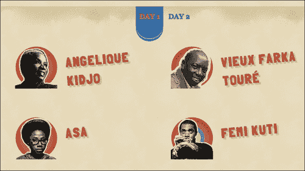

# 第三章：创建您的网站

现在我们已经完成了关于我们项目的所有基本工作，让我们来看看构建这个网站的实际任务。我们将首先从标记开始，然后转入样式表，最后添加脚本交互性。

# 在标记上工作

我们对 Sun and Sand 音乐节项目有一个简单的设计构想。设计如下截图所示：


从组织结构上看，页面的总体结构如下所述：

+   **页眉**：带有一组导航链接的横幅标志

+   **主要内容**：页面的主要部分，其中包含导航链接将链接到的部分

+   **左列**：这包含了主要内容

+   **右列**：这包含了对观众可能有趣但不是必要的次要信息

+   **页脚**：赞助商标志和带有音乐的音频播放器，这些音乐将参加音乐节

## 创建标记

**HTML5 Doctor**在`html5doctor.com/element-index/`上列出了您可以在网页中使用的所有元素。将其与我们之前制作的列表进行比较，看起来`header`标记很适合放置我们的标志和导航链接，而赞助商标志和音频播放器可以放在`footer`标记中。这就留下了我们的主要内容；看起来带有主要角色的`div`标记是最适合它的！

以下是我们最终得到的标记。第二章中的`index.html`页面，*开始您的项目*，也包含以下代码：

```js
<header>
  <a href="#main">Skip Navigation</a>

  <h1>Sun &amp; Sand Festival 2012</h1>
  <h2>Ngor&amp; Terou Bi, Dakar</h2>
  <nav class="site-nav">
  <a href="#tickets">Tickets</a>
  <ahref="#about">About</a>
  <a href="#line-up">Line-up</a>
  <a href="#contact">Contact</a>
  <a href="#gettinghere">Getting Here</a>
  </nav>
</header>
<div role="main">
  <section id="primary">
    <article id="tickets">

    </article>
    <article id="about">
    </article>
    <article id="lineup">

    </article>
    <article id="contact">

    </article>
    <article id="gettinghere">
    </article>
  </section>

  <aside id="secondary">
    <article>
      <h2>Get some sun!</h2>
      <ul>
      <li>Follow us on <a href="http://twitter.com/sunnsand">twitter</a>!</li>
      <li>Stalk us on <a href="http://facebook.com">facebook</a>!</li>
      <li>Get some sun through <a href="http://flickr.com/photos/sunnsand">flickr</a>!</li>
      </ul>
    </article>
  </aside>
</div>
<footer>
    <article class="sponsors">
    <a href="#">Boca-Cola</a>
    <a href="#">Darbucks</a>
    <a href="#">Kugle</a>
    <a href="#">Pling</a>
    </article>
    <audio src="img/audio.webm" controls></audio>
</footer>
```

### 提示

您可以从您在[`www.PacktPub.com`](http://www.PacktPu)购买的所有 Packt 图书的帐户中下载示例代码文件。如果您在其他地方购买了这本书，您可以访问[`www.PacktPub.com/support`](http://www.PacktPub.com/su)并注册，文件将直接通过电子邮件发送给您。

### 决定使用哪个元素

使用 HTML5，我们有大量元素可供选择，这可能会导致一些人选择困难。如果您的文档结构中有任何明显适合任何新元素的地方，请标记它们。如果没有，请继续使用`div`或任何其他明显适合的元素。

在我们的代码中，当我们有结构上不同的主要内容时，我们使用`section`元素，当我们有类似但重复的内容部分时，我们使用`article`元素。您对这些选择的看法可能会有所不同；在这种情况下，我建议您选择您感到舒适的内容。

如果您想了解更多关于新的 HTML5 元素的信息，我建议您查看*HTML5: Up & Running, Mark Pilgrim, O'Reilly*中关于语义的章节，该书由 Google Press 印刷，在`diveintohtml5.info/semantics.html`上可以找到。

### 编写有效的标记

编写有效的标记可以确保您的页面在所有呈现它的浏览器中表现一致。有效的标记是指符合浏览器遵循的 Web 标准的标记。这样，您将防止任何不可预测的行为。

编写有效的标记的最简单方法是使用可以在保存文件时立即验证的工具。

在第二章中，*开始您的项目*，我建议在 Web 开发中使用 Sublime Text 和 Vim。这两种工具都有内联验证，您可以使用它们来编写有效的标记。此外，这些工具还提供标签和元素的自动完成，使编写有效的标记变得微不足道。

如果您无法访问这些工具，我建议使用`validator.w3.org/`来验证您的标记。

对于您来说，自动化这些工具非常重要，以确保将您网站上的任何问题减少到最低限度。

# 创建样式

现在我们已经准备好了标记，让我们看看应该如何进行样式设置。HTML5 样板带有最佳默认样式的样式表。如果您打开`main.css`，您会在`Chrome 框架提示`样式规则和`辅助类`部分之间找到以下部分：


这就是我们将撰写样式规则的地方。稍后，我们将看看如何使用**Sass** ([`sass-lang.com`](http://sass-lang.com))或**Less** ([`lesscss.org/`](http://lesscss.org/))来使用一些样式框架，以便更轻松地编写样式。

即使不写一行 CSS 代码，您会注意到我们的页面看起来就像以下截图中显示的网站：


这个默认样式要归功于 HTML5 样板中可用的规范化样式规则。

## 为什么不使用 reset.css？

很长一段时间以来，建议使用`reset.css`，它可以在`html5doctor.com/html-5-reset-stylesheet/`上找到，并将每个可用元素的边距和填充重置为`0`，并使所有标题的字体大小与正文文本相同，而没有更高的字体重量。

HTML5 样板建议不要这样做。浏览器提供有用的浏览器默认值，这将使您的样式表更小，因为您不必重新声明这些样式。

使用`normalize.css`，您将不会在调试工具中看到以下类型的混乱：


`normalize.css`的联合创始人之一 Nicolas Gallagher 在[nicolasgallagher.com/about-normalize-css/](http://www.w3.org/community/webed/wiki/Inheritance_and_cascade#Specificity)上详细介绍了为什么它比`reset.css`更好，对于那些仍然不确定 CSS 规范化的优点的人来说，这是一篇很好的文章。

## 我们可以使用的有用样式类

在第一章*开始之前*中，我们简要地看到 HTML5 样板带有一堆默认类，这些类对工作很有用。您可能已经注意到我们在样式规则中使用了其中一些类。

我们所有的辅助类都是最后定义的，因此当使用时它们可以覆盖所有其他样式。确保它们覆盖的属性在其他地方没有过度指定；您可以在[www.w3.org/community/webed/wiki/Inheritance_and_cascade#Specificity](http://www.w3.org/community/webed/wiki/Inheritance_and_cascade#Specificity)上阅读更多关于特异性的信息。

### 图像替换

在我们的项目中，我们希望为`Sun & Sand Festival 2012`标题添加一个时髦的徽标。HTML5 样板有一个方便的图像替换类可用于此目的。在标记中，我们只需向`h1`标签添加一个名为`ir`的类，如下面的代码所示：

```js
<h1 class="ir">Sun &amp; Sand Festival 2012</h1>
```

这样做的作用是将 HTML5 样板中图像替换类（`ir`）中指定的样式应用于隐藏文本。然后，您只需要向`h1`元素添加背景图像以及其宽度和高度，以便按照您的规范显示，如以下代码所示：

```js
header h1 {
background-image: url('/img/heading-banner.png');
width: 800px;
height: 300px;
}
```

这将导致标题看起来类似于以下截图：


### 隐藏元素

我们的标记中有内容，我们希望只有在用户点击时才显示。在我们的网站中，当用户点击**到这里**链接时，我们希望显示一个 Google 地图。通过使用`iframe`，这样做非常简单，如下面的代码片段所示：

```js
<iframe width="425" height="350" frameborder="0" scrolling="no" marginheight="0" marginwidth="0" src="img/maps?f=q&amp;source=s_q&amp;hl=en&amp;geocode=&amp;q=ngor+terrou+bi,+dakar,+senegal&amp;aq=&amp;sll=37.0625,-95.677068&amp;sspn=90.404249,95.976562&amp;ie=UTF8&amp;hq=ngor&amp;hnear=Terrou-Bi,+Bd+Martin+Luther+King,+Gueule+Tapee,+Dakar+Region,+Guediawaye,+Dakar+221,+Senegal&amp;t=m&amp;fll=14.751996,-17.513559&amp;fspn=0.014276,0.011716&amp;st=109146043351405611748&amp;rq=1&amp;ev=p&amp;split=1&amp;ll=14.711109,-17.483921&amp;spn=0.014276,0.011716&amp;output=embed">
</iframe>
```

但这意味着，一旦您的页面在浏览器中加载，浏览器将立即尝试显示地图并从 Google 地图获取资源。但我们只希望在用户点击**到这里**链接时才显示这张地图。HTML5 样板提供了一个可以用于此类目的的类名。我们将应用一个名为`hidden`的类，以确保这些元素在明确设置为显示之前不会呈现。`hidden`类在以下代码片段中使用：

```js
<iframe class="hidden" width="425" height="350" frameborder="0" scrolling="no" marginheight="0" marginwidth="0" src="img/maps?f=q&amp;source=s_q&amp;hl=en&amp;geocode=&amp;q=ngor+terrou+bi,+dakar,+senegal&amp;aq=&amp;sll=37.0625,-95.677068&amp;sspn=90.404249,95.976562&amp;ie=UTF8&amp;hq=ngor&amp;hnear=Terrou-Bi,+Bd+Martin+Luther+King,+Gueule+Tapee,+Dakar+Region,+Guediawaye,+Dakar+221,+Senegal&amp;t=m&amp;fll=14.751996,-17.513559&amp;fspn=0.014276,0.011716&amp;st=109146043351405611748&amp;rq=1&amp;ev=p&amp;split=1&amp;ll=14.711109,-17.483921&amp;spn=0.014276,0.011716&amp;output=embed">
</iframe>
```

请注意，这会使内容从屏幕阅读器和浏览器显示中消失。

### 注意

屏幕阅读器是用于帮助那些无法在屏幕上查看文本的人阅读网页的设备。Victor Tsaran 在[www.yuiblog.com/blog/2007/05/14/video-intro-to-screenreaders/](http://www.yuiblog.com/blog/2007/05/14/video-intro-to-screenreaders/)上有一个关于屏幕阅读器的很好的介绍视频。

使这种情况发生的规则如下：

```js
.hidden {
display: none !important;
visibility: hidden;
}
```

这确保了所有屏幕阅读器（**JAWS**和**Windows-Eyes**是最流行的）都会隐藏所有具有此类名称的元素。

如果您希望内容对使用屏幕阅读器的用户可用，您应该使用我们将要学习的`visuallyhidden`类。

### 在不影响布局的情况下隐藏元素

有时，您不希望将某些内容呈现到屏幕上，但希望使用**跳转导航**链接使其对屏幕阅读器可用。这将确保那些使用屏幕阅读器的人可以立即跳转到内容的重点，而不必听一长串导航链接。因此，让我们将这个类添加到我们在页眉中的**跳转导航**链接中，如下面的代码所示：

```js
<a class="visuallyhidden" href="#main">Skip Navigation</a>
```

这使得链接从我们的屏幕上消失，但对于屏幕阅读器是可用的。下面的网页截图不显示**跳转导航**链接：


使这种情况发生的 CSS 规则如下：

```js
.visuallyhidden {
border: 0;
clip: rect(0 000);
height: 1px;
margin: -1px;
overflow: hidden;
padding: 0;
position: absolute;
width: 1px;
}
```

通常使用的解决方案涉及将它们绝对定位，并将高度设置为`0px`，但这会阻止苹果的 VoiceOver 屏幕阅读器读取内容。

另一种解决方案涉及使用`text-indent`属性将文本定位到屏幕之外，但当内容用从右到左的语言书写时，需要小心，这种解决方案会失败。

使用`clip`属性可以避免所有这些问题，同时使内容在所有屏幕阅读器上可读。

### 注意

乔纳森·斯努克在`snook.ca/archives/html_and_css/hiding-content-for-accessibility`上写道，`clip`属性是在视觉上隐藏内容但仍然可供屏幕阅读器使用的最佳方式。

那些广泛使用键盘导航的人也希望跳过导航。但是，因为它在视觉上是隐藏的，他们不会知道这个选项存在。对于这种情况，您希望在此元素获得焦点时可用。让我们添加一个额外的类`focusable`，使我们的**跳转导航**链接在通过键盘导航激活此链接时可见。

```js
<a class="visuallyhidden focusable" href="#main">Skip Navigation</a>
```

下面的截图显示了当用户将键盘焦点切换到**跳转导航**链接时，它会立即可见：


### 在不影响布局的情况下隐藏元素

在我们的网站上，我们希望在几天内以选项卡形式显示阵容，如下截图所示：



以下是标记的简化视图：

```js
<article class="t-tabs t-section" id="lineup">
<nav class="t-tab__nav">
<a class="t-tab__navitem--active t-tab__navitem" href="#day-1">Day 1</a>
<a class="t-tab__navitem" href="#day-2">Day 2</a>
</nav>
<ul id="day-1" class="t-tab__body t-grid t-before-1-6 t-after-1-6">
<li class="t-grid__cell t-unit-1-2">
<a class="t-media--row" href="#">

<b class="t-media__body t-title-tabartist t-artist__name">Angelique Kidjo</b>
</a>
</li>
</ul>
<ul id="day-2" class="t-tab__body t-grid t-before-1-6 t-after-1-6">
<li class="t-grid__cell t-unit-1-2">
<a class="t-media--row" href="#">

<b class="t-media__body t-title-tabartist t-artist__name">Oumou Sangre</b>
</a>
</li>
</ul>
</article>
```

最简单的方法是只显示**Day 1**，并使用`hidden`类隐藏其余的天数，如下面的代码片段所示：

```js
<article class="t-tabs t-section" id="lineup">
<nav class="t-tab__nav">
<a class="t-tab__navitem--active t-tab__navitem" href="#day-1">Day 1</a>
<a class="t-tab__navitem" href="#day-2">Day 2</a>
</nav>
<ul id="day-1" class="t-tab__body t-grid t-before-1-6 t-after-1-6">
<!--list content below -->
</ul>
<ul id="day-2" class="t-tab__body t-grid t-before-1-6 t-after-1-6 hidden">
<!--list content below -->

</ul>
</article>
```

通过隐藏元素，我们使其占用的尺寸消失为 0。这意味着以前由该内容占用的区域会坍塌。

当用户点击每天阵容的导航链接时，每天的内容将经常被隐藏和显示，这看起来会很突兀，如下截图所示：


在这种情况下，我们可以使用辅助类`invisible`来使元素不渲染，但保持其尺寸；它在屏幕上不可见，也不可供屏幕阅读器使用。如下截图所示，**TICKETS**部分不会根据哪个选项卡处于活动状态而改变位置：


### 清除浮动

我们将图像元素定位在艺术家姓名的左侧。我们通过将图像浮动到左侧来实现这一点。幸运的是，我们没有任何跟随浮动元素的内容。如果有的话，那么该内容将覆盖在浮动元素上。您可以通过在浮动元素的父容器上设置一个名为`clearfix`的类来防止发生这种情况。在我们的情况下，为了确保我们的浮动元素永远不会触发这种行为，我们将在艺术家图像元素的父元素上添加`clearfix`类：

```js
<a class="t-media--row  clearfix" href="#">
```

要了解`clearfix`类的工作原理，请阅读附录中的相关内容，*You Are an Expert, Now What?*

现在我们已经处理了基本要点，让我们将样式应用到页面上，使其看起来更像我们心目中的设计。以下代码片段显示了如何向我们的页面添加样式：

```js
html {
background: url('/img/waves-bg.png') repeat-x, 
url(/img/heading-banner-back.png) 50% 100px no-repeat, 
url(/img/bg-active.png) 50% 72px repeat-x, 
url('/img/bg.png') #e7dcbb;  
box-sizing: border-box;  
margin: 0 1em;
font: 100%/1.5 georgia, serif;
}

body {
max-width: 80%;
margin: 0 auto;
text-align: center;
}

.t-tabs {
min-height: 400px;
position: relative;
}

.t-tab__body {
position: absolute;
left: 0;
right: 0;  
}

.t-tab__navitem--active { 
position: relative;
}

.t-tab__navitem--active::after{
position: absolute;
bottom: -2em;
left: 0;
height: 2em;
width: 100%;
content: "";
border-radius: 0 0 20em 20em;
background: #305da1;
box-shadow: 0 -0.3em 0 0 #77aec3 inset, 0 0.3em 0 0 #1A9DC8;
}

/* TICKETS */
.t-tickets__currency {
font-family: georgia, serif;
text-align: center;
position: absolute;
transform-origin: 100% 100%;
transform: rotate(-90deg) translate(0, -2.1em);
 }

/* MEDIA OBJECT */
.t-media,
.t-media--column,
.t-media--row,
.t-media__body {  
text-align: left;  
list-style: none;
}
.t-media--row .t-media__aside {
float:left; 
margin-right: 16px;
}

/* Image replaced social media links */
.t-links__item--twitter,
.t-links__item--facebook,
.t-links__item--flickr {
padding: 0.25rem 1rem;
display: inline-block;
}

.ir.t-links__item--twitter,
.ir.t-links__item--facebook,
.ir.t-links__item--flickr {
background-size: contain;
background-repeat: no-repeat;
width: 1rem;
height: 1rem;
background-position: center center;
display: inline-block;
}

.ir.t-links__item--twitter {
background-image: url(/img/logo-twitter.svg);
}

.t-title--h1,
.t-title--h2,
.t-title--navsite,
.t-title-tabartist {
font-family: FolkSolidRegular, sans-serif;
text-transform: uppercase;  
color: #E4773A;
text-shadow:  3px 3px 1px #C84134, 
                4px 4px 1px #C84134;  
letter-spacing: 2px;  
}
```

## 编写有效的样式表

当我们浏览时，您可能已经注意到样式中没有任何拼写错误。编辑人员毫无疑问做得很好，但我意识到在编写样式表时您没有这样的助手！一个错误的拼写错误可能会给我们带来无法估量的创伤，因为我们要找出为什么某个特定的样式没有被应用。这就是为什么自动验证样式并尽可能自动完成样式声明也很重要。

Sublime Text 和 Vim 都提供 CSS 属性的自动补全，并且您还可以自动插入分号！如果您无法使用这些工具，您可以使用在线 CSS 验证器`jigsaw.w3.org/css-validator/`来测试您的 CSS。

还有另一种自动编写有效和高效样式规则的方法——使用编译成 CSS 的替代样式语言。接下来我们将研究一些这样的语言。

## 使用样式语言编写高效的样式表

很长一段时间以来，编写样式表的唯一方法是使用 W3C 在其规范中提供的语法。然而，通过使用一些编程逻辑来编写样式表，可以获得许多生产力上的好处。但是浏览器只能理解 W3C 规范规定的语法。这意味着任何使用额外可编程功能的样式语言都应该转换为浏览器可理解的典型样式表（这称为编译）。

最早为此设计的样式语言之一称为 Sass。现在，我们有了一些更多，最流行的是 Sass、Less 和 Stylus。在 Sass 和 Less 中，有效的 CSS 自动成为有效的 Sass 和 Less 代码。这使得从 CSS 转换到这些语言变得微不足道。

通常，您会在名为`main.scss`（如果您使用 Sass）、`main.less`（如果您使用 Less）或`main.styl`（如果您使用 Stylus）的文件中编写样式规则。使用每种语言自带的编译器，这些文件将分别编译为`styles.css`。

### 优点

使用样式语言有许多优点，例如以下：

+   这些语言使您始终可以编写语法有效的样式表，因为如果使用任何无效的语法，它们都会抛出错误。

+   所有这些语言都提供了一些在 CSS 中受欢迎的功能，例如变量、能够在其他类中重复使用样式规则而不必重复多次、算术计算、颜色函数等等。

+   在开发时，您可以选择输出扩展可读的样式，然后在生产中使用时输出紧凑的性能优化、去除空白的样式表。

### 缺点

然而，使用样式语言也有一些缺点，如下所述：

+   虽然很容易转换为 Sass 或 Less，但不可能对生成的样式表进行修改，并将这些更改传输到其原始的 Sass/Less/Style 文件中。因此，您需要小心确保没有人编辑生成的 CSS 文件。

+   团队合作需要整个团队共同使用其中一种语言。如果没有这样做，就不可能维护两个样式表的分支并使它们保持同步。

+   在调试时，如果您正在检查一个元素，大多数调试器只会显示样式表中的行号，而不是原始语言文件中的行号。这可能会使得难以找出在原始文件中特定规则的位置。

### 学习的地方？

如果您对了解更多关于这些语言感兴趣，请继续阅读一些好的入门地点。

#### Sass

官方网站是`sass-lang.com`。Chris Coyier 在`css-tricks.com/video-screencasts/88-intro-to-compass-sass/`上有一个关于 Sass 的很好的介绍视频。

#### Less

官方网站是`lesscss.org`。有一个 Less 的视频概述可在`net.tutsplus.com/tutorials/html-css-techniques/quick-tip-you-need-to-check-out-less-js/`上找到。

#### Stylus

官方官方网站在`learnboost.github.com/stylus`。有一个 Stylus 的视频概述可在`thechangelog.com/post/3036532096/stylus-expressive-robust-feature-rich-css-language`上找到。

### 使用样式语言的 HTML5 Boilerplate

如果您对任何这些语言有相当自信的掌握，那么您可以使用我们接下来将要看的任何可用端口来启动您的项目：

#### Sass

HTML5 Boilerplate 的 Sass 版本相当更新，需要**Compass**，这是在`github.com/sporkd/compass-html5-boilerplate`上的 Sass 框架。

#### Less

存在一个不太经常更新的 HTML5 Boilerplate 到 Less 的端口，位于`github.com/m6tt/less-boilerplate`。

#### Stylus

目前没有针对 Stylus 的 HTML5 Boilerplate 的完全功能性端口，尽管使用命令行将其转换为 stylus 似乎是最简单的方法。有关使用此方法的更多信息，请访问`learnboost.github.com/stylus/docs/executable.html`。

# 总结

哇！那是一个紧张的编码会话。在本章中，我们几乎基于 HTML5 Boilerplate 创建了一个完整的网站。我们看了如何编写标记、样式和脚本。此外，我们还探索了一些工具，使编写有效的标记和样式更容易。

到目前为止，我们对示例项目所做的所有更改都可以在`nimbu.in/h5bp-book/chapter-3/`上找到。

在下一章中，我们将看看如何使用 jQuery 为这个相当静态的页面添加一些交互性，并使其更容易在网站上进行导航。
