# 第四章：添加交互性并完成您的网站

我们已经创建了网站的第一个版本。虽然网站看起来非常可读和可导航，但使交互更加流畅将使其成为一个显著更好的体验。

# 使用 jQuery

正如我们在第二章中看到的，*开始你的项目*，HTML5 Boilerplate 提供了一种方便且安全的方式来加载 jQuery。使用 jQuery，编写访问元素的脚本变得非常简单。

如果您正在编写自定义的 jQuery 脚本，要么启动您正在使用的插件，要么执行一些小的交互，请将其放在`js`文件夹中的`main.js`文件中。

# 使用其他库

如果您更喜欢使用其他库，您也可以以类似的方式加载和使用它们。

以下是我们加载 jQuery 的方式：

```js
<script src="img/jquery.min.js"></script>
<script>window.jQuery || document.write('<script src="img/jquery-1.8.2.min.js"><\/script>')
</script>
```

假设您想使用另一个库（如 MooTools），然后查看 Google Libraries API，看看该库是否可在`developers.google.com/speed/libraries/`上找到。如果可以找到，只需用该网站上的适当引用替换引用。例如，如果我们想用 MooTools 替换我们的 jQuery 链接，我们只需替换以下代码：

```js
<script src="img/jquery.min.js">
</script>
```

使用以下代码行：

```js
<script src="img/mootools-yui-compressed.js">
</script>
```

我们还将在本地的`js/vendor`文件夹中下载 Mootools 的压缩文件，并替换以下代码：

```js
<script>window.jQuery||document.write('<script src="img/jquery-1.7.2.min.js"><\/script>')
</script>
```

使用以下代码行：

```js
<script>window.jQuery||document.write('<script src="img/mootools-core-1.4.5-full-compat-yc.js"><\/script>')
</script>
```

有关为什么我们使用代码的本地副本的更多信息，请查看第二章，*开始你的项目*。但是我们对我们默认选择的 jQuery 非常满意，所以让我们继续使用它。

# 添加平滑滚动插件和交互

如果您还没有注意到，我们正在构建的网站是一个单页面网站！所需的所有内容都在同一页上找到。根据我们目前的网站设计，点击站点导航链接将大致滚动到导航链接所指的部分。我们希望这种交互是平滑的。让我们使用 jQuery 的平滑滚动插件来实现这一点。

让我们从 Github 仓库下载插件文件，托管在`github.com/kswedberg/jquery-smooth-scroll`上。

在其中，我们找到了插件的压缩版本（`jquery.smooth-scroll.min.js`），我们将在文本编辑器中打开它。

然后复制所有代码并粘贴到`plugins.js`文件中。

让我们添加一个类名`js-scrollitem`，以便我们可以区分这个元素是否有一个将在这些元素上使用的脚本。这样，意外删除通过 JavaScript 提示的交互所需的类名的机会将会更小。

现在，我们将编写代码在`main.js`文件中调用这个插件。在文本编辑器中打开`main.js`文件并输入：

```js
$('.js-scrollitem').smoothScroll();
```

这将使所有链接到同一页内具有`js-scrollitem`类的父容器的可点击链接通过插件平滑滚动。如果我们已经正确使用了 HTML5 Boilerplate 的默认设置，添加这个将足以开始平滑滚动。

接下来，我们希望行程部分中的导航链接根据点击的日期打开右侧的行程。目前，在下面的截图中，它只显示了第一天的行程，没有做其他任何事情：


让我们继续编辑`main.js`文件并添加启用此功能的代码。

首先，让我们添加我们将用于控制样式和代码内部的隐藏/显示行为的类名。此功能的代码如下：

```js
<nav class="t-tab__nav">
<a class="t-tab__navitem--active t-tab__navitemjs-tabitem" href="#day-1">Day 1</a>
<a class="t-tab__navitemjs-tabitem" href="#day-2">Day 2</a>
</nav>
```

现在，我们将编写代码来显示我们点击的元素。这段代码如下：

```js
var $navlinks = $('#lineup .js-tabitem');
var $tabs = $('.t-tab__body');

var hiddenClass = 'hidden';

var activeClass = 't-tab__navitem--active';

$navlinks.click(function() {
// our code for showing or hiding the current day's line up
$(this.hash).removeClass(hiddenClass);
});
```

通过检查我们迄今为止所做的工作，我们注意到它始终保持每天的行程可见，并且完成后不会隐藏它们！让我们也添加这一点，如下面的代码片段所示：

```js
var $navlinks = $('#lineup .js-tabitem');
var $tabs = $('.t-tab__body');

var hiddenClass = 'hidden';

var activeClass = 't-tab__navitem--active';

var $lastactivetab = null;

$navlinks.click(function() {
var $this = $(this);
  //take note of what was the immediately previous tab and tab nav that was active
  $lastactivetab = $lastactivetab || $tabs.not('.' + hiddenClass);
  // our code for showing or hiding the current day's line up
$lastactivetab.addClass(hiddenClass);
$(this.hash).removeClass(hiddenClass);
$lastactivetab = $(this.hash);
return false;
}
```

您会注意到活动标签导航项似乎仍然表明它是**第 1 天**！让我们通过更改我们的代码来修复这个问题，以便与选项卡导航锚点类似，如下面的代码片段所示：

```js
var $navlinks = $('#lineup .js-tabitem');
var $tabs = $('.t-tab__body');

var hiddenClass = 'hidden';

var activeClass = 't-tab__navitem--active';

var $lastactivetab = null;
var $lastactivenav = null;

$navlinks.click(function() {
var $this = $(this);
//take note of what was the immediately previous tab and tab nav that was active
$lastactivetab = $lastactivetab || $tabs.not('.' + hiddenClass);
$lastactivenav = $lastactivenav || $navlinks.filter('.' + activeClass);

  // our code for showing or hiding the current day's line up
$lastactivetab.addClass(hiddenClass);   
$(this.hash).removeClass(hiddenClass);   
$lastactivetab = $(this.hash);

  // change active navigation item
$lastactivenav.removeClass(activeClass);
$this.addClass(activeClass);
$lastactivenav = $this;

return false;
});
```

太棒了！我们已经准备好按天排列了。现在我们需要确保当用户单击**在地图上查找**链接时，我们的 Google Maps `iframe`会呈现。我们还希望使用相同的链接来隐藏地图，如果用户想要这样做的话。

首先，我们为用于触发地图显示/隐藏和地图的`iframe`的锚元素添加一些可识别的特征，如下面的代码片段所示：

```js
<p>The festival will be held on the beautiful beaches of NgorTerrou Bi in Dakar. 
<ahref="#" class="js-map-link">Locate it on a map</a>
</p>

<iframe id="venue-map" class="hidden" width="425" 
height="350" frameborder="0" scrolling="no" marginheight="0" marginwidth="0" src="img/maps?f=q&amp;source=s_q&amp;hl=en&amp;geocode=&amp;q=ngor+terrou+bi,+dakar,+senegal&amp;aq=&amp;sll=37.0625,-95.677068&amp;sspn=90.404249,95.976562&amp;ie=UTF8&amp;hq=ngor&amp;hnear=Terrou-Bi,+Bd+Martin+Luther+King,+Gueule+Tapee,+Dakar+Region,+Guediawaye,+Dakar+221,+Senegal&amp;t=m&amp;fll=14.751996,-17.513559&amp;fspn=0.014276,0.011716&amp;st=109146043351405611748&amp;rq=1&amp;ev=p&amp;split=1&amp;ll=14.711109,-17.483921&amp;spn=0.014276,0.011716&amp;output=embed">
</iframe>
```

然后，我们使用以下 JavaScript 来触发链接：

```js
  $maplink = $('.js-map-link');
  $maplinkText = $maplink.text();

  $maplink.toggle(function() {
    $('#venue-map').removeClass(hiddenClass);
    $maplink.text('Hide Map');
  }, function() {
    $('#venue-map').addClass(hiddenClass);
    $maplink.text($maplinkText);
  });
```

现在，让我们看看如何使我们的音频播放器在所有浏览器上工作。

# 使用 Modernizr 安全添加 HTML5 功能

我们在第一章中简要介绍了 Modernizr，*开始之前*，但我们还没有为它做过太多事情。强烈建议我们创建一个自定义的 Modernizr 构建。HTML5 Boilerplate 附带了一个 Modernizr 的自定义构建，其中包括自定义构建器（`modernizr.com/download/`）中的所有选项，包括额外的功能，如 HTML5Shiv、资源加载器（`modernizr.load`）、媒体查询测试，并根据 Modernizr 的测试结果向`html`标签添加 CSS 类名。

Modernizr 的自定义构建在 IE 中启用了 HTML5 元素（在`paulirish.com/2011/the-history-of-the-html5-shiv/`中了解更多信息）。但是，现在，通过我们的音频播放器，我们有机会使用另一个作为额外功能可用的 Modernizr 函数，即`modernizr.load`。

浏览器中的音频支持并不像我们期望的那样简单。由于许可限制，不同的浏览器期望不同的格式。一些浏览器甚至不支持 HTML5 音频。使用一个可以为我们抽象出所有这些问题的框架将是完美的。在`html5please.com`上看到，推荐建议是使用一个名为`mediaelement.js`的框架来帮助我们处理这些问题。

### 注意

`html5please.com`是一个网站，告诉您这些新功能中哪些是可用的，以及在不支持它们的浏览器上应该如何使用它们。

让我们仅在未检测到音频支持时使用这个框架作为我们的音频播放器。

首先，我们从`mediaelementjs.com`下载框架，并将构建文件夹中的所有文件复制到`js/vendor/mediaelement/`中。然后，我们应该在`index.html`中为我们的播放器添加跨浏览器友好的音频标记，如下面的代码片段所示：

```js
<article class="t-audio">
<audio controls preload="none" autobuffer>
<sourcesrc="img/festival.mp3" />
<sourcesrc="img/festival.ogg" />
</audio>
</article>
```

请注意，我们需要在`head`元素中指定样式表，以确保它在所有浏览器上都能完美工作（而不是及时加载），如下面的代码所示：

```js
<link rel="stylesheet" href="js/vendor/mediaelement/mediaelementplayer.css">
```

然后，我们在`main.js`文件中使用 Modernizr 仅在缺少音频支持时加载`mediaelement.js`，如下面的代码所示：

```js
Modernizr.load({
test: Modernizr.audio,
nope: {
'mediaelementjs': 'js/vendor/mediaelement/mediaelement-and-player.min.js'
},

callback: {
    'mediaelementjs': function() {
$('audio').mediaelementplayer();
}
} 
});
```

这段代码首先使用 Modernizr 测试音频是否受支持。如果不支持，那么我们将加载必要的资源来使音频在我们的`mediaelement.js`框架中工作。一旦加载了`mediaelement.js`，我们就调用它，这样它就会运行并将我们的音频文件转换为那些缺少音频支持的浏览器能够理解的格式。

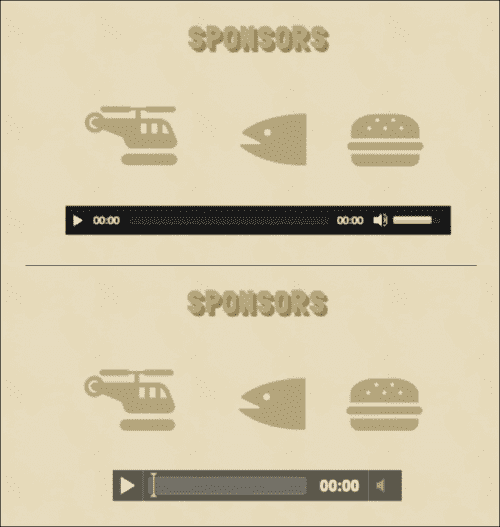

前面的屏幕截图显示了我们的页面在不支持 HTML5 音频的浏览器上的呈现（回退到使用`mediaelement.js`的 Flash），以及在支持 HTML5 音频的浏览器上的呈现（使用浏览器提供的本机控件）。

## 何时使用 Modernizr.load？

`Modernizr.load`是一个很好的实用工具，当您有多个文件需要有条件地加载时，比如我们的音频播放器。

有时，您希望只有在用户单击链接或元素时才发生某些事情。您可以在用户单击元素后及时加载这些资产，而不是预先加载所有所需的资产，并使浏览器渲染页面变慢。

## 使用 Modernizr 加载 CSS 功能

Modernizr 还会在页面的`html`标签上输出其对各种 HTML5/CSS3 功能的测试结果，如下截图所示：

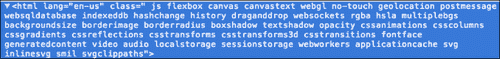

这对于基于可用功能的体验进行样式设计非常有用。例如，我们注意到`html`元素中有一个名为`no-touch`的类名。这意味着加载此页面的浏览器不支持触摸界面。如果支持触摸，那么我们可以为所有链接添加更多的填充，以适应尝试点击它们的大手指。让我们在`css/style.css`文件中添加样式来实现这一点，如下所示：

```js
.touch a {
padding: 0.25em;
background: #CEC3A1;
border-radius: 0.5em;
display: inline-block;
}
```

这是我们的网站在支持触摸事件的浏览器上的外观（左侧）和不支持触摸事件的浏览器上的外观（右侧）：


# 测试我们的网站

哇！这真是太多了！但是等等，我们还没有完成！我们已经编写了所有的代码，但是怎么样进行一些测试呢？那里有很多种浏览器的变体，不可能对每一种都进行测试。幸运的是，在大多数主要版本的浏览器上进行测试是相当简单的。

如果您使用 Windows，我建议您安装 Opera、Opera Next、Safari、Chrome、Chrome Canary、Firefox、Firefox Nightly、IE8 和 IE10 的最新版本。

如果您使用的是 Mac，获取上面列出的所有浏览器，除了 IE。如果您有能力的话，购买一个 Windows 操作系统，并将其安装为 Virtual Box 上的虚拟镜像（[www.virtualbox.org/](http://www.virtualbox.org/)）。微软提供了旧版 IE 的虚拟镜像供测试使用，您也可以使用 ievms（`github.com/xdissent/ievms`）在 Virtual Box 上安装。

对于一个更简单但不太严格的测试选项——比如当您还没有最终确定您的网站时——尝试[www.browserstack.com](http://www.browserstack.com)或`browserling.com`。

所有这些浏览器都有开发者工具，可以很容易地检测页面是否按预期渲染。

让我们在 Internet Explorer 7 中测试我们的 Sun and Sand Festival 网站。乍一看，一切似乎都按预期工作。但是看着标签，似乎一切都乱了！以下截图显示了我们在 Internet Explorer 浏览器上的页面：

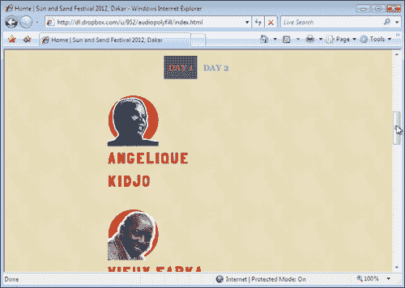

为了调试这个问题，让我们使用 Firebug Lite 来检查这些元素上应用了哪些样式。您可以在 IE7 上安装 Firebug Lite（[`getfirebug.com/firebuglite`](http://getfirebug.com/firebuglite)）的书签。点击该书签将使我们能够在 IE7 上使用受限版本的 Firebug。

使用 Firebug，我们看到一个调试窗口，如下截图所示：

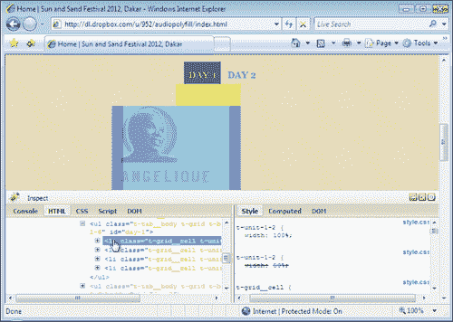

检查我们的`main.css`，似乎我们基于媒体查询的样式都被 IE7 解析和解释，而不管其中的条件如何！例如：

```js
.t-unit-1-2{
width: 100%;
}
```

先前的样式是在媒体查询`@media only screen and (max-width: 750px)`中声明的，这个查询应该只在满足条件时覆盖现有规则`(.t-unit-1-2 { width: 50%; })`。但是 IE7 简单地忽略了提到的功能，并盲目地应用它找到的所有样式规则。

由于条件 CSS 类名的存在，我们可以通过在原始 CSS 声明中添加额外的样式规则来轻松解决这个问题，以防止 IE6 到 IE8 覆盖原始样式。附录，*您是专家，现在怎么办？*详细介绍了条件 CSS 类名。

HTML5 Boilerplate 为您提供了三个类名，用于这种情况，描述如下：

+   `.lt-ie7`：以这个类名来定位所有低于 IE7 的 IE 版本。这将应用样式到 IE 6 及以下版本。

+   `.lt-ie8`：以这个类名来定位所有低于 IE8 的 IE 版本。这将应用样式到 IE6 和 IE7。

+   `.lt-ie9`：针对所有低于 IE9 的 IE 版本。这将应用样式到所有低于 IE9 的 IE 版本。

多亏了这个，我们现在可以应用针对 IE8 及以下版本的规则，这些版本不理解媒体查询中的条件，通过以下方式应用样式规则：

```js
.lt-ie9 .t-unit-1-2 {
width: 45%;
}
```

由于 IE8 及以下版本也不支持`box-sizing`属性（Mozilla 开发者网络在`developer.mozilla.org/En/CSS/Box-sizing`描述了此属性的效果），这意味着这些框的宽度将随着我们添加填充而扩展。让我们删除父元素的边距，以防止框堆叠，如下面的代码片段所示：

```js
.lt-ie9 .t-before-1-6,
.lt-ie9 .t-after-1-6 {
margin-left: 0;
margin-right: 0;
}
```

然而，这并没有完全解决我们的问题。然后，再往上看，我们注意到我们的网格单元，也就是具有类`t-grid__cell`的元素，其`display`属性设置为 inline-block。知道 IE7 不会将此应用于除具有自然内联属性的元素之外的任何元素，我们需要添加额外的声明才能使其工作，如下面的代码片段所示：

```js
.lt-ie9 .t-grid__cell {
display: inline;
}
```

最后，现在这样就可以了！

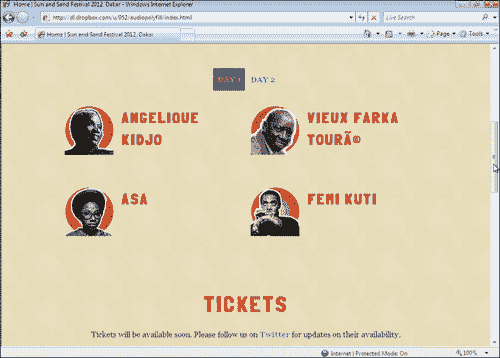

让我们滚动到页面底部。我们注意到价格都混乱了，因为 IE7 不支持 CSS3 变换，如下面的截图所示：

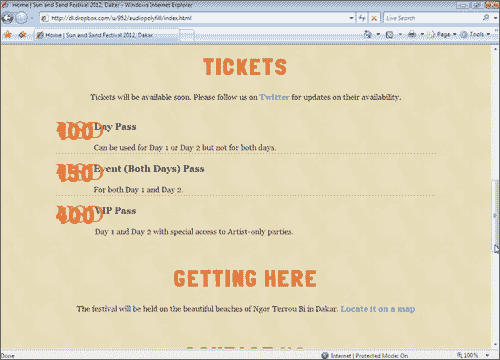

有了 Modernizr，我们只需要将这个规则添加到我们的样式表中：

```js
.no-csstransforms .t-tickets__currency {
position: static;
}
```

这将使任何不支持 CSS 变换的浏览器更易读，如下面的截图所示：

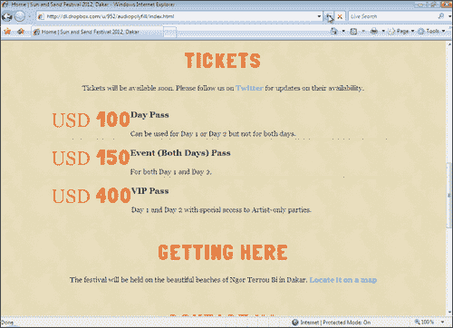

继续向下滚动，我们注意到我们的 SVG 图标在 IE8 及以下版本中丢失，因为它们不识别 SVG 文件，如下面的截图所示：

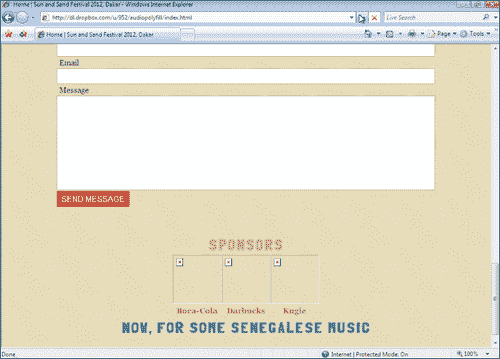

再次感谢 Modernizr！在我们的`main.js`文件中，我们将检查 Modernizr 中 SVG 测试的结果，然后用它们的等效 PNG 图像替换所有 SVG 图像。请注意，这意味着您需要为 HTML 页面中使用的每个 SVG 文件都有一个 PNG 等效文件。替换 SVG 为 PNG 文件的代码如下：

```js
if(Modernizr.svg == false) {
  $('img[src$=".svg"]').each(function() {
	this.src = /(.*)\.svg$/.exec(this.src)[1] + '.png';
 });
}
```

### 提示

**为什么使用 SVG？**

我们使用 SVG 图标，因为这些图标可以根据我们对响应式网站的需求进行缩放，SVG 是一种矢量图像格式。此外，与典型的 PNG 文件相比，它们非常轻量，并且可以比 PNG 格式加载得更快。

下面的截图显示了 IE7 如何以 PNG 格式呈现图标，这要感谢 Modernizr：

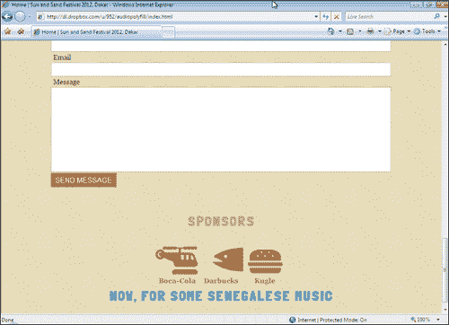

当您开始进行 Web 开发时，您应该花更多时间使用浏览器开发工具；Andi Smith 在`andismith.com/blog/2011/11/25-dev-tool-secrets/`写了一篇很好的文章，概述了每个工具的一些特性。

## 在非桌面浏览器上测试

让我们看看在小规模设备上网站的外观。最快最简单的方法是从[www.opera.com/developer/tools/mobile/](http://www.opera.com/developer/tools/mobile/)下载**Opera Mobile Emulator**，然后使用其中的几个选项之一加载我们的页面。这个模拟器显示在下面的截图中：

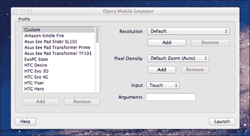

在模拟器左侧选择一个选项，然后单击**启动**按钮，打开一个模拟 Opera 浏览器实例，模拟您选择的设备上的显示效果。

例如，下面的截图显示了我们的页面在**Opera Mobile Emulator**上的渲染实例，用于**Amazon Kindle Fire**：

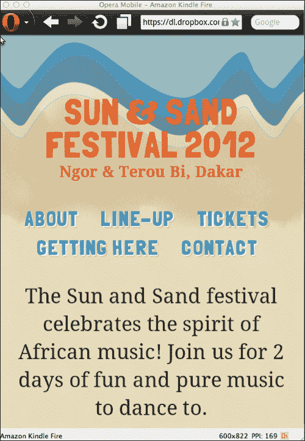

最好的部分是**Opera Mobile**浏览器是最现代的移动浏览器之一，这使得它成为您积极开发网站时进行测试的非常好的浏览器。它还适用于各种设备，这使得使用**Opera Mobile Emulator**测试各种设备宽度变得很容易，如果您正在使用媒体查询来调整页面以适应不同的设备尺寸。

如果您也拥有运行 iOS 6 的 iPhone，使用**Safari 6 进行远程调试**并使用 Safari 开发者工具检查代码是相当容易的（Max Firtman 在[`www.mobilexweb.com/blog/iphone-5-ios-6-html5-developers`](http://www.mobilexweb.com/blog/iphone-5-ios-6-html5-developers)上有更多信息）。

如果您有 Android 设备，您可以在 Chrome for Android 浏览器上启用调试，但您需要安装 Android 开发者工具才能这样做。关于如何做到这一点的更多帮助，请参阅 Chrome for Android 远程调试指南[`developers.google.com/chrome/mobile/docs/debugging`](https://developers.google.com/chrome/mobile
/docs/debugging)。

### 注意

如果您有多个运行不同浏览器的移动设备，您还可以使用`html.adobe.com/edge/inspect/`上的**Adobe Edge Inspect**来测试这些页面在所有这些设备上的外观。

# 摘要

在本章中，我们看了如何使用 jQuery 插件为网站添加一些交互。我们还学习了如何使用`Modernizr.load`来加载脚本，以便轻松地有条件地检测对 HTML5 音频的支持，并为不支持的浏览器加载资源并正确呈现音频。我们还研究了一些使用浏览器开发者工具调试网站和验证页面在各种浏览器上显示方式的方法。

在下一章中，我们将学习如何在 Apache 和其他 Web 服务器上优化我们的网站。
