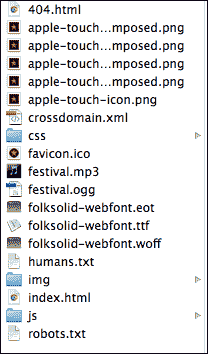
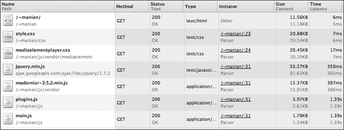
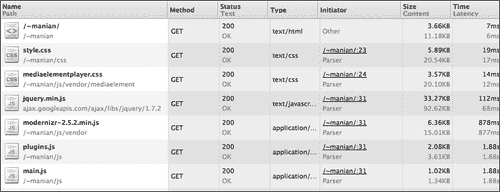
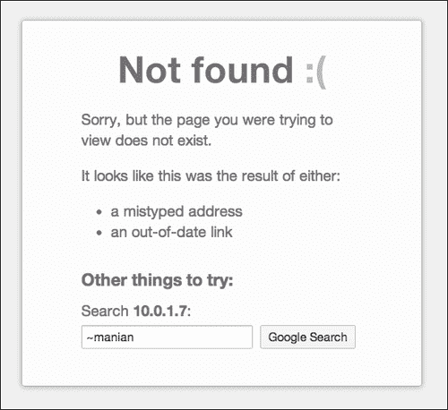
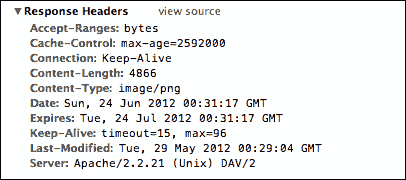
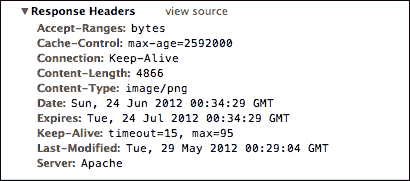

# 第五章：自定义 Apache 服务器

我们的 Sun and Sand 节日网站基本上已经完成了！但在部署到生产环境之前，让我们确保我们已经优化了页面和相关文件所在的服务器的配置，以便最终用户可以尽快加载页面，同时我们检查可能导致我们的网站被黑客攻击的安全漏洞。

# 服务器端配置

在我们继续之前，让我们简要地看一下服务器的作用。服务器理解浏览器对站点页面的请求，然后寻找 URL 请求的文件。服务器然后以 HTTP 头的形式将文件发送回浏览器。**Apache**是网站最流行的服务器软件，HTML5 Boilerplate 附带了一个名为`.htaccess`的 Apache 配置文件。

# 设置 Apache 服务器

在我们查看 HTML5 Boilerplate 提供的 Apache 配置文件的各种功能之前，让我们设置一个本地 Apache 服务器，这样我们就可以看到这些功能的运行情况。

## 安装 Apache

我们将看一下在 Mac、Windows 和 Linux 上安装 Apache。

### Mac

您无需做任何特殊操作；Apache 已经安装好了。但是为了在这个项目中使用它，请确保将所有文件复制到您的主文件夹中的网站文件夹（`/~<username>`）。编辑`/etc/apache2/httpd.conf`文件以更改以下突出显示的代码：

```js
<Directory /usr/share/web>
AllowOverride None
        Options MultiViewsFollowSymlinks
        Order allow,deny
        Allow from all
        Header Set Cache-Control no-cache
</Directory>
```

到以下：

```js
<Directory /usr/share/web>
AllowOverrideAll
 Options MultiViewsFollowSymlinks
        Order allow,deny
        Allow from all
        Header Set Cache-Control no-cache
</Directory>
```

您还需要以相同的方式更改`/etc/apache2/<username>.conf`中的条目。

### Windows

您需要在 Windows 上下载并安装 Apache；可以从`httpd.apache.org/docs/2.2/platform/windows.html`下载。请注意，您需要将以下代码片段添加到`conf/httpd.conf`中，该文件位于找到 Apache 应用程序的文件夹内：

```js
<Directory "/apache/htdocs/">
AllowOverride All
Options None
Order deny, allow
</Directory>
```

### Linux

如果您使用 Ubuntu，可以在[`help.ubuntu.com/8.04/serverguide/C/httpd.html`](https://help.ubuntu.com/8.04/serverguide/C/httpd.html)找到友好的文档。要启用`.htaccess`文件，用于配置您的 Apache 服务器，您需要编辑`/etc/apache2/sites-available/default`，从以下代码片段中：

```js
<Directory /var/www/>
Options Indexes FollowSymLinksMultiViews
AllowOverride None
   Order allow,deny
allow from all
   # Uncomment this directive is you want to see apache2's
   # default start page (in /apache2-default) when you go to /
   #RedirectMatch ^/$ /apache2-default/
</Directory>
```

到以下代码片段：

```js
<Directory /var/www/>
Options Indexes FollowSymLinksMultiViews
AllowOverrideAll
   Order allow,deny
allow from all
   # Uncomment this directive is you want to see apache2's
   # default start page (in /apache2-default) when you go to /
   #RedirectMatch ^/$ /apache2-default/
</Directory>
```

## 配置 Apache

我们的 HTML5 Boilerplate 文件夹中包含一个名为`.htaccess`的文件。由于文件名以`.`开头，因此在 Finder/Windows 资源管理器或其他文件管理工具中列出文件时，`.htaccess`可能不会显示出来，如下面的截图所示：



但是，如果您启用了操作系统上的隐藏文件显示，您将能够看到这个文件。

现在所需的就是将我们的网站文件（包括`.htaccess`文件）移动到我们刚刚设置的服务器上。Apache 会在所有文件夹中寻找`.htaccess`文件（除非通过配置设置告知不要这样做），因此将我们的`.htaccess`文件放在站点的父文件夹中就可以了。

一般来说，使用`.htaccess`文件进行测试并不是一个坏主意。但是，如果您想让您的网站真正快速，最好将配置直接放在 Apache 服务器的主配置文件（`httpd.conf`）中。不幸的是，并非所有的托管提供商都允许这样做。

如果您可以访问 Apache 服务器的主配置文件（`httpd.conf`），您应该从 HTML5 Boilerplate 的`.htaccess`文件中复制配置，并将其放在`httpd.conf`中的`Directory`标签内，如下面的代码片段所示：

```js
<Directory /path/to/website/root>
[htaccess rules]
</Directory>
```

然后，您应该删除`.htaccess`文件，因为指令已经在服务器的主配置文件中了。

# 开箱即用的功能

HTML5 Boilerplate 的`.htaccess`文件提供的大多数优势并不是立即显而易见的。如果您的网站流量较低，且不会发出太多网络请求，您可能不会注意到使用 HTML5 Boilerplate 的`.htaccess`文件会有显著的差异。但是，当您出现高活动量的峰值（这并不罕见！）或突然有很多您网站所需的图像和视频的网络请求时，HTML5 Boilerplate 的`.htaccess`会自动帮助您。

只要您将`.htaccess`文件放在项目文件夹中，或者按照前面指示的设置 Apache 的主配置文件，所有这些功能都可以立即使用。

## 删除 ETags

**实体标签**（**ETags**）验证浏览器缓存中的组件（如图像、文件等）是否与服务器上的组件匹配。不幸的是，ETags 带来的害处大于好处。大多数服务器默认启用 ETags，这就是为什么 HTML5 Boilerplate 的服务器配置文件阻止服务器提供它们的原因，如下面的代码片段所示：

```js
<IfModule mod_headers.c>
  Header unset ETag
</IfModule>
FileETag None
```

### 注意

Steve Souders 深入探讨了为什么 ETags 无法解决它们设计的问题以及为什么您应该删除它们，网址为`developer.yahoo.com/blogs/ydn/posts/2007/07/high_performanc_11/`。

## Gzip 组件

**Gzip**是最流行的压缩方法。通过使用 Gzip 压缩文件，您可以确保文件在低带宽连接下更快地传输。有时，节省的文件大小高达 70％，使其成为一个很好的性能配置默认值。

让我们看看没有`.htaccess` Gzip 功能时我们的文件有多大。为了做到这一点，我们只需注释掉该部分，如下面的代码片段所示：

```js
#<IfModule mod_deflate.c>
#
#  # Force deflate for mangled headers developer.yahoo.com/blogs/ydn/posts/2010/12/pushing-beyond-gzipping/
#  <IfModule mod_setenvif.c>
#    <IfModule mod_headers.c>
#      SetEnvIfNoCase ^(Accept-EncodXng|X-cept-Encoding|X{15}|~{15}|-{15})$ ^((gzip|deflate)\s*,?\s*)+|[X~-]{4,13}$ #HAVE_Accept-Encoding
#      RequestHeader append Accept-Encoding "gzip,deflate" env=HAVE_Accept-Encoding
#    </IfModule>
#  </IfModule>
#
#  # HTML, TXT, CSS, JavaScript, JSON, XML, HTC:
#  <IfModule filter_module>
#    FilterDeclare   COMPRESS
#    FilterProvider  COMPRESS  DEFLATE resp=Content-Type $text/html
#    FilterProvider  COMPRESS  DEFLATE resp=Content-Type $text/css
#    FilterProvider  COMPRESS  DEFLATE resp=Content-Type $text/plain
#    FilterProvider  COMPRESS  DEFLATE resp=Content-Type $text/xml
#    FilterProvider  COMPRESS  DEFLATE resp=Content-Type $text/x-component
#    FilterProvider  COMPRESS  DEFLATE resp=Content-Type $application/javascript
#    FilterProvider  COMPRESS  DEFLATE resp=Content-Type $application/json
#    FilterProvider  COMPRESS  DEFLATE resp=Content-Type $application/xml
#    FilterProvider  COMPRESS  DEFLATE resp=Content-Type $application/xhtml+xml
#    FilterProvider  COMPRESS  DEFLATE resp=Content-Type $application/rss+xml
#    FilterProvider  COMPRESS  DEFLATE resp=Content-Type $application/atom+xml
#    FilterProvider  COMPRESS  DEFLATE resp=Content-Type $application/vnd.ms-fontobject
#    FilterProvider  COMPRESS  DEFLATE resp=Content-Type $image/svg+xml
#    FilterProvider  COMPRESS  DEFLATE resp=Content-Type $image/x-icon
#    FilterProvider  COMPRESS  DEFLATE resp=Content-Type $application/x-font-ttf
#    FilterProvider  COMPRESS  DEFLATE resp=Content-Type $font/opentype
#    FilterChain     COMPRESS
#    FilterProtocol  COMPRESS  DEFLATE change=yes;byteranges=no
#  </IfModule>
#
#  <IfModule !mod_filter.c>
#    # Legacy versions of Apache
#    AddOutputFilterByType DEFLATE text/html text/plain text/css application/json
#    AddOutputFilterByType DEFLATE application/javascript
#    AddOutputFilterByType DEFLATE text/xml application/xml text/x-component
#    AddOutputFilterByType DEFLATE application/xhtml+xml application/rss+xml application/atom+xml
#    AddOutputFilterByType DEFLATE image/x-icon image/svg+xml application/vnd.ms-fontobject application/x-font-ttf #font/opentype
#  </IfModule>
#
#</IfModule>
```

现在，让我们通过浏览器开发者工具中的网络工具来查看通过网络传递到我们浏览器的文件的大小（在本例中是 Chrome 开发者工具）：



现在，让我们通过从`.htaccess`中删除行首的`#`来启用 Gzip 的适当规则。注意下面的截图中的差异：



如果您想了解更多关于 Gzip 的信息，第四章, *Smaller Components, Book of Speed, Stoyan Stefanov*，网址为[www.bookofspeed.com/chapter4.html](http://www.bookofspeed.com/chapter4.html)，将是一个很好的起点。

## 使用 Expires 头文件进行更好的缓存控制

服务器可以告诉浏览器它们可以将文件保存在缓存中的时间有多长。这对于不经常更改的静态文件非常有用，并且将减少页面加载时间。HTML5 Boilerplate 的`.htaccess`文件有一组默认值适用于大多数静态文件，如下面的代码片段所示：

```js
<IfModule mod_expires.c>
ExpiresActive on

# Perhaps better to whitelist expires rules? Perhaps.
ExpiresDefault                          "access plus 1 month"

# cache.appcache needs re-requests in FF 3.6 (thanks Remy ~Introducing HTML5)
ExpiresByType text/cache-manifest       "access plus 0 seconds"

# Your document html
ExpiresByType text/html                 "access plus 0 seconds"

# Data
ExpiresByType text/xml                  "access plus 0 seconds"
ExpiresByType application/xml           "access plus 0 seconds"
ExpiresByType application/json          "access plus 0 seconds"

# Feed
ExpiresByType application/rss+xml       "access plus 1 hour"
ExpiresByType application/atom+xml      "access plus 1 hour"

# Favicon (cannot be renamed)
ExpiresByType image/x-icon              "access plus 1 week"

# Media: images, video, audio
ExpiresByType image/gif                 "access plus 1 month"
ExpiresByType image/png                 "access plus 1 month"
ExpiresByType image/jpg                 "access plus 1 month"
ExpiresByType image/jpeg                "access plus 1 month"
ExpiresByType video/ogg                 "access plus 1 month"
ExpiresByType audio/ogg                 "access plus 1 month"
ExpiresByType video/mp4                 "access plus 1 month"
ExpiresByType video/webm                "access plus 1 month"

# HTC files  (css3pie)
ExpiresByType text/x-component          "access plus 1 month"

# Webfonts
ExpiresByType application/x-font-ttf    "access plus 1 month"
ExpiresByType font/opentype             "access plus 1 month"
ExpiresByType application/x-font-woff   "access plus 1 month"
ExpiresByType image/svg+xml             "access plus 1 month"
ExpiresByType application/vnd.ms-fontobject "access plus 1 month"

# CSS and JavaScript
ExpiresByType text/css                  "access plus 1 year"
ExpiresByType application/javascript    "access plus 1 year"
</IfModule>
```

这告诉服务器在每个类型的文件被访问后立即缓存请求，缓存时间由文本`"access plus…"`指定。例如，考虑以下代码片段：

```js
# CSS and JavaScript
ExpiresByType text/css                  "access plus 1 year"
ExpiresByType application/javascript    "access plus 1 year"
```

这个片段让服务器告诉浏览器请求 CSS 和 JavaScript 文件时，要至少缓存这些文件一年，除非用户故意清除他们的缓存。

### 注意

Yahoo 关于加速网站的最佳实践详细解释了 Expires 头文件的作用，网址为`developer.yahoo.com/performance/rules.html#expires`。

## 自定义 404 页面

HTML5 Boilerplate 提供了一个名为`404.html`的自定义 404 页面。但是，除非服务器知道在找不到资源时每次都要提供此文件，否则永远不会被使用。HTML5 Boilerplate 的`.htaccess`文件有一个配置，告诉服务器按如下方式使用此文件：

```js
ErrorDocument 404 /404.html
```

确保使用完整路径引用`404.html`。例如，在 Mac 上，如果您将其托管在您的`<username>`文件夹下的网站文件夹中，则完整路径将是`/~<username>/404.html`。

以下截图显示了当使用 HTML5 Boilerplate 的`.htaccess`文件时，浏览器如何呈现默认的 HTML5 Boilerplate 404 页面：



## 强制使用最新的 IE 版本

Internet Explorer 利用`meta`标签来决定是否应该以兼容模式呈现站点，还是使用最新的渲染引擎来呈现它。

Google Chrome 发布了一个名为**Chrome Frame**的插件，可以从[`developers.google.com/chrome/chrome-frame/`](https://developers.google.com/chrome/chrome-frame/)下载，如果安装在用户的计算机上，当用户使用较旧版本的 Internet Explorer 时，将提供现代浏览器的体验。当您的页面在较旧版本的 Internet Explorer 上被查看时，您的网站可以选择使用这个插件。要自动选择使用这个插件，将`", chrome=1"`附加到`http-equiv` `meta`标签的`content`属性值。

这个标签可以在 HTML 文件本身中设置，这就是 HTML5 Boilerplate 所做的，如下面的代码片段所示：

```js
<meta http-equiv="X-UA-Compatible" content="IE=edge,chrome=1">
```

然而，由于 HTML5 Boilerplate 在`html`标签周围使用了条件注释，IE 将以**兼容视图**而不是 Chrome Frame 来呈现 HTML。因此，在`html`标签周围使用带有条件注释的`meta`标签是行不通的。HTML5 Boilerplate 的`.htaccess`文件将其设置为 HTTP 头，如下面的代码片段所示：

```js
<IfModule mod_headers.c>
  Header set X-UA-Compatible "IE=Edge,chrome=1"
  # mod_headers can't match by content-type, but we don't want to send this header on *everything*...
<FilesMatch "\.(js|css|gif|png|jpe?g|pdf|xml|oga|ogg|m4a|ogv|mp4|m4v|webm|svg|svgz|eot|ttf|otf|woff|ico|webp|appcache|manifest|htc|crx|oex|xpi|safariextz|vcf)$" >
    Header unset X-UA-Compatible
</FilesMatch>
</IfModule>
```

这将强制 IE 尊重发送的 HTTP 头，并使用最新的渲染引擎，而不管`meta`标签陈述的是什么。您还可以设置 IE 使用任何您喜欢的渲染引擎。我们在附录中深入讨论了这个功能，*你是专家，现在怎么办？*，在*什么是 meta x-ua-compatible？*一节下。

### 注意

我们经过了大量详细的测试和评论，这些测试和评论为我们推荐使用这种方法设置 IE 兼容模式提供了信息，这些信息可以在 Github 的**Issue 跟踪器**上找到，网址为[github.com/h5bp/html5-boilerplate/issues/378](http://github.com/h5bp/html5-boilerplate/issues/378)。

## 使用 UTF-8 编码

字符编码是一种以字节序列表示文本数据的方式。不同的脚本有不同的标准，例如希腊语、日语等，但是创建 HTML 规范的标准机构 W3C 强烈推荐在 Web 上提供的所有文本都使用**UTF-8**作为事实上的编码方案，以确保所有浏览器都能正确呈现您的文本数据。`.htaccess`文件以以下方式设置它：

```js
# Use UTF-8 encoding for anything served text/plain or text/html
AddDefaultCharset utf-8
# Force UTF-8 for a number of file formats
AddCharset utf-8 .css .js .xml .json .rss .atom
```

### 注意

Edward Z. Yang 在`htmlpurifier.org/docs/enduser-utf8.html#whyutf8`上写了一篇信息丰富的文章，解释了为什么 UTF-8 是字符编码的最佳选择；如果您对这个话题感兴趣，这篇文章值得一读。

## 提供正确的 MIME 类型

作为 HTTP 头发送的**多用途互联网邮件扩展**（**MIME**）类型有助于浏览器决定如何处理发送的内容。例如，浏览器需要知道文件是样式表还是可下载的文本文档。服务器发送资源时返回的 MIME 类型 HTTP 头提供了这些信息。HTML5 Boilerplate 的`.htaccess`文件确保服务器在提供内容时提供正确的 MIME 类型。

例如，在我们的塞内加尔音乐节网站中，我们需要让浏览器理解我们的 Web 字体是字体文件而不是乱码文本。在我们的 HTML5 Boilerplate`.htaccess`文件中，以下行确保服务器返回正确的 MIME 类型，以便浏览器可以做到这一点：

```js
AddType application/vnd.ms-fontobjecteot
AddType application/x-font-ttfttfttc
AddType font/opentypeotf
AddType application/x-font-woffwoff
```

### 注意

有关 MIME 类型的更多信息可以在**Mozilla 开发者网络**上找到，网址为`developer.mozilla.org/en/Properly_Configuring_Server_MIME_Types#What_are_MIME_types.3F`。

## 阻止访问隐藏文件夹

如果您使用**版本控制系统**（**VCS**）来管理网站的代码，则用于管理版本的隐藏文件夹（`.git`或`.svn`）可能也存在于您的生产服务器中。您不希望任何人访问这些文件并找到可能被用来黑客攻击您的网站的任何信息。HTML5 Boilerplate 通过`.htaccess`文件阻止服务器提供对这些文件的内容的请求，如以下代码片段所示：

```js
# Block access to "hidden" directories whose names begin with a period. This
# includes directories used by version control systems such as Subversion or Git.
<IfModule mod_rewrite.c>
RewriteCond %{SCRIPT_FILENAME} -d
RewriteCond %{SCRIPT_FILENAME} -f
RewriteRule "(^|/)\." - [F]
</IfModule>
```

## 阻止访问备份和源文件

例如，如果您的数据库在服务器上备份，例如`database.sql.bak`，您也不希望任何人访问，也不希望访问日志文件或任何源文件，例如用于 logo 的 Photoshop 文件 - 我们知道这种情况经常发生！`.htaccess`文件中的以下代码阻止访问这些文件：

```js
# Block access to backup and source files
# This files may be left by some text/html editors and
# pose a great security danger, when someone can access them
<FilesMatch "(\.(bak|config|sql|fla|psd|ini|log|sh|inc|swp|dist)|~)$">
  Order allow,deny
  Deny from all
  Satisfy All
</FilesMatch>
```

这告诉服务器查找以以下任何扩展名结尾的文件：`<filename>.bak`，`<filename>.config`等等，如果是这样，拒绝处理对这些文件的请求。它将返回`403 Forbidden`错误。

## 启动重写引擎

在进行任何 URL 重写之前，Apache 服务器要求您启动重写引擎。HTML5 Boilerplate 的`.htaccess`文件通过以下代码片段启用了这一点：

```js
<IfModule mod_rewrite.c>
  Options +FollowSymlinks
RewriteEngine On
# RewriteBase /
</IfModule>
```

如果您的站点在子文件夹中，请删除`RewriteBase`行前的`#`并将其设置为从根目录到子文件夹的完整路径。

## 防止不存在的重定向文件夹出现 404 错误

在 Apache 中，如果您希望重定向从不存在的路径请求的 URL 到另一个路径，您需要禁用`MultiViews`。

例如，如果您收到对`http://example.com/beaches/10`的请求，并且希望将其内部重定向到`http://example.com/index.php?q=10`，并且`beaches`文件夹不存在于您网站的根文件夹中，Apache 将抛出错误。HTML5 Boilerplate 的`.htaccess`文件通过使用以下代码语句防止这种情况发生：

```js
Options -MultiViews
```

# 其他自定义

提供了许多其他自定义选项，但它们都被注释掉，因为它们需要仔细考虑，有时可能会产生意想不到的后果。

## 抑制或强制 URL 开头的“www。”

大多数人没有意识到`http://example.com`和`http://www.example.com`在搜索引擎中被视为两个不同的站点。您可以强制重写 URL 以使用 www 或非 www。我更喜欢非 www URL，因为它比较短！

HTML5 Boilerplate 的`.htaccess`文件为您提供了这两种选择。默认情况下，配置会强制服务器将对`http://www.example.com`的请求重写为`http://example.com`。如果您喜欢另一种方式，可以让服务器将对`http://example.com`的请求重写为`http://www.example.com`，如以下步骤所述：

1.  注释掉以下代码片段中显示的默认选项：

```js
# Option 1:
# Rewrite "www.example.com -> example.com"
<IfModule mod_rewrite.c>
  RewriteCond %{HTTPS} !=on
  RewriteCond %{HTTP_HOST} ^www\.(.+)$ [NC]
  RewriteRule ^ http://%1%{REQUEST_URI} [R=301,L]
</IfModule>
```

1.  现在注释掉的默认部分应该看起来像以下代码片段：

```js
# Option 1:
# Rewrite "www.example.com -> example.com"

# <IfModule mod_rewrite.c>
#  RewriteCond %{HTTPS} !=on
#  RewriteCond %{HTTP_HOST} ^www\.(.+)$ [NC]
#  RewriteRule ^ http://%1%{REQUEST_URI} [R=301,L]
#</IfModule>
```

您可能已经注意到，我们所做的就是在每行前添加一个`#`字符和一个空格。

1.  现在，我们将通过取消注释来启用第二个选项。通过取消注释更改以下代码片段：

```js
# Option 2:
# To rewrite "example.com -> www.example.com" uncomment the following lines.
# Be aware that the following rule might not be a good idea if you
# use "real" subdomains for certain parts of your website.

# <IfModule mod_rewrite.c>
#   RewriteCond %{HTTPS} !=on
#   RewriteCond %{HTTP_HOST} !^www\..+$ [NC]
#   RewriteRule ^ http://www.%{HTTP_HOST}%{REQUEST_URI} [R=301,L]
# </IfModule>
```

1.  取消注释的代码部分应该看起来像以下代码片段：

```js
# Option 2:
# To rewrite "example.com -> www.example.com" uncomment the following lines.
# Be aware that the following rule might not be a good idea if you
# use "real" subdomains for certain parts of your website.

<IfModule mod_rewrite.c>
RewriteCond %{HTTPS} !=on
RewriteCond %{HTTP_HOST} !^www\..+$ [NC]
RewriteRule ^ http://www.%{HTTP_HOST}%{REQUEST_URI} [R=301,L]
</IfModule>
```

我们所做的就是删除以`<IfModule mod_rewrite.c>`开头并以`</IfModule>`结尾的行前的`#`字符和空格。

无论您想使用哪个选项，请确保您不要同时启用这两个选项，因为这将阻止 Apache 提供您的页面。

## 从 iFrames 设置 cookies

IE 通常会阻止从 IFrame 中设置的 cookies。如果您需要设置这样的 cookies，特别是如果您有广告或社交网络插件，您需要发送**隐私偏好平台项目**（**P3P**）标头。

在`.htaccess`文件中查找与本节标题相同的注释，并更改以下行：

```js
# <IfModule mod_headers.c>
#   Header set P3P "policyref=\"/w3c/p3p.xml\", CP=\"IDC DSP COR ADM DEVi TAIi PSA PSD IVAi IVDi CONi HIS OUR IND CNT\""
# </IfModule>
```

在以下代码片段中：

```js
<IfModule mod_headers.c>
  Header set P3P "policyref=\"/w3c/p3p.xml\", CP=\"IDC DSP COR ADM DEVi TAIi PSA PSD IVAi IVDi CONi HIS OUR IND CNT\""
</IfModule>
```

### 注意

Eric Law 详细介绍了 IE 的 cookie 策略，可以在`blogs.msdn.com/b/ieinternals/archive/2009/08/20/wininet-ie-cookie-internals-faq.aspx`上阅读。

## PHP 安全默认值

如果你正在使用 PHP，HTML5 Boilerplate 的`.htaccess`文件中有很多配置选项，可以使你的 PHP 安装更安全。如果你使用 PHP，你可以使用与*抑制或强制 URL 开头的"www。"*一节中概述的相同过程打开它们。

鉴于我们的网站不使用 PHP，我们不需要打开它们。

## 停止广告 Apache 版本

你可以防止 Apache 广告其版本，以减少恶意程序员利用特定版本的漏洞的可能性。以下是 Apache 版本的广告方式：



这个先前的截图显示了 Apache 版本号作为 HTTP 头发送到浏览器。

### 注意

你可以使用大多数浏览器自带的开发者工具来验证 HTTP 头。在这种情况下，我们使用 Chrome 的开发者工具**资源**选项卡。关于如何使用这个工具的更多信息，请参考 Chrome 的帮助中心`developers.google.com/chrome-developer-tools/docs/network`。

这需要从服务器的主配置文件中进行配置，我们无法从`.htaccess`文件中进行配置。因此，让我们从 HTML5 Boilerplate 的`.htaccess`文件中删除以下指令，并替换为在`/etc/apache2/httpd.conf`中找到的指令（如果你使用 Windows 或 Linux，则该文件的路径将不同）：

```js
ServerTokens Prod
```

在将配置值应用到 Apache 服务器的主配置文件后，下面的截图显示了 Apache 发送的无版本 HTTP 头：



## 允许在特定 JS 和 CSS 文件中进行合并

有时，当请求发出时，你可能希望服务器将多个脚本或样式表文件合并为一个响应。请注意，这样做并不会加快页面加载速度，因为服务器需要自己的时间将这些文件拼接在一起。

这是我建议你在其他解决方案都失败时最后考虑的选项。理想情况下，你永远不应该这样做。

要做到这一点，首先取消`.htaccess`文件中的以下行：

```js
#<FilesMatch "\.combined\.js$">
#  Options +Includes
#  AddOutputFilterByType INCLUDES application/javascript application/json
#  SetOutputFilter INCLUDES
#</FilesMatch>
#<FilesMatch "\.combined\.css$">
#  Options +Includes
#  AddOutputFilterByType INCLUDES text/css
#  SetOutputFilter INCLUDES
#</FilesMatch>
```

改为以下代码片段：

```js
<FilesMatch "\.combined\.js$">
  Options +Includes
AddOutputFilterByType INCLUDES application/javascript application/json
SetOutputFilter INCLUDES
</FilesMatch>
<FilesMatch "\.combined\.css$">
  Options +Includes
AddOutputFilterByType INCLUDES text/css
SetOutputFilter INCLUDES
</FilesMatch>
```

然后，在`js`文件夹中，创建一个名为`script.combined.js`的文件。

在文本编辑器中打开`script.combined.js`文件，并使用以下语法将所有应该合并并输出到`script.combined.js`文件中的文件：

```js
#   <!--#include file="<path/to/file.js>" -->
#   <!--#include file="<path/to/another-file.js>" -->
```

如果你想要动态合并样式表，你可以这样做。在`css`文件夹中创建一个名为`style.combined.css`的文件。

在文本编辑器中打开`style.combined.css`文件，并使用以下语法将所有应该合并并输出到`style.combined.css`文件中的文件：

```js
#   <!--#include file="<path/to/file.css " -->
#   <!--#include file="<path/to/another-file.css>" -->
```

正如我之前提到的，这样做会使 Apache 对这些请求的响应变慢。你应该使用一个构建脚本来连接文件（我们将在第七章中研究构建脚本，*使用构建脚本自动部署*）。所以只有在没有其他选择的情况下取消这个设置。

## 在 CSS 的鼠标悬停效果中停止 IE 的屏幕闪烁

当你使用背景图片在链接上悬停时发生变化，IE 会出现闪烁。你可以通过更改`.htaccess`文件中的以下行来防止这种情况发生：

```js
# BrowserMatch "MSIE" brokenvary=1
# BrowserMatch "Mozilla/4.[0-9]{2}" brokenvary=1
# BrowserMatch "Opera" !brokenvary
# SetEnvIfbrokenvary 1 force-no-vary
```

改为以下代码片段：

```js
BrowserMatch "MSIE" brokenvary=1
BrowserMatch "Mozilla/4.[0-9]{2}" brokenvary=1
BrowserMatch "Opera" !brokenvary
SetEnvIfbrokenvary 1 force-no-vary
```

## 防止 SSL 证书警告

如果您只想在安全连接上提供您的网站，您需要获取一个**安全套接字层**（**SSL**）证书，浏览器将使用该证书来识别您的网站。如果证书上的域与传入请求上的域不匹配，例如，您为`https://secure.example.com`拥有 SSL 证书，而在该域上托管的页面上加载的资产是从`https://example.com`提供的，但所有文件都托管在同一个 Apache 服务器上；那么浏览器将抛出警告，并通知用户无法验证网页的真实性。

您可以确保对没有 SSL 证书的域的请求被重定向到您拥有 SSL 证书的域。如果需要，您可以取消注释以下代码片段：

```js
# <IfModule mod_rewrite.c>
#   RewriteCond %{SERVER_PORT} !⁴⁴³
#   RewriteRule ^ https://example-domain-please-change-me.com%{REQUEST_URI} [R=301,L]
# </IfModule>
```

以下是代码片段：

```js
<IfModule mod_rewrite.c>
RewriteCond %{SERVER_PORT} !⁴⁴³
RewriteRule ^ https://example-domain-please-change-me.com%{REQUEST_URI} [R=301,L]
</IfModule>
```

请注意，`https://example-domain-please-change-me.com`的 URL 需要指向您拥有 SSL 证书的域。

### 注意

有关 SSL 和 SSL 证书的更多详细信息，请参阅 Linux 文档项目中的`tldp.org/HOWTO/SSL-Certificates-HOWTO/x64.html`。

这涵盖了 HTML5 Boilerplate 的`.htaccess`文件提供的所有可选功能。让我们看看跨域策略以及如何设置它们。

## 您应该了解的跨域策略

当来自一个域的页面（例如`http://example.com`）需要来自另一个域（例如`http://foo.com`）的数据时，HTTP 请求被称为**跨域**请求。默认情况下，大多数浏览器不允许跨域请求数据，无论是数据还是 Flash 资产，以防止恶意访问。

但是，您可以在服务器上设置一个跨域策略文件（在上一个示例中，是从`http://foo.com`提供服务的服务器），允许浏览器访问这些资源。

Flash 需要在名为`crossdomain.xml`的文件中指定此策略文件，您可以在其中指定哪些域可以从服务器请求资产。

此文件包含在 HTML5 Boilerplate 中，默认情况下启用最严格的策略。如果您确实希望使用最不严格的策略，可以取消注释该选项，并注释掉最严格的选项。

### 注意

在放宽限制之前，确保充分了解允许跨域请求访问资产的影响。

您还可以通过设置 HTTP 标头来进行跨域 AJAX 请求，或限制对图像或字体的访问。这被称为**跨域资源共享**（**CORS**）策略。

## 跨域 AJAX 请求

只有在请求页面与请求数据的 URL 位于同一域上时，才能进行 AJAX 请求。CORS 是 HTML5 的一个新功能，允许您从任何域进行 AJAX 请求，前提是已经给予了请求域的权限。通过在服务器上设置一个 HTTP 标头，您可以克服这个限制。让我们看看如何做到这一点。

以下是您可以进行的跨域请求的示例：

```js
var CORSRequest = new XMLHttpRequest();
CORSRequest.onload = function(e){
  // Process returned data
}
CORSRequest.open('GET', 'http://nimbupani.com/data.json');
CORSRequest.send( null );
```

我们注意到浏览器会抛出错误，显示访问被禁止，如下面的截图所示：


现在，在我们托管在[`nimbupani.com`](http://nimbupani.com)上的`.htaccess`文件中，我们将取消注释以下指令：

```js
#  <IfModule mod_headers.c>
#    Header set Access-Control-Allow-Origin "*"
#  </IfModule>
```

让我们再试一下我们的代码。啊哈！现在可以了！

这是最不严格的设置，可以允许任何域在您的服务器上进行 AJAX 请求。由于这个原因，非常容易进行大量的请求，也可以假装是您的网站并欺骗访问者等。请谨慎使用此设置。

## 启用 CORS 的图像

通常，浏览器允许从任何其他域链接所有图像。这称为**热链接**。在`en.wikipedia.org/wiki/Inline_linking`上了解更多信息。如果一个高流量的网站链接到托管在您服务器上的资产，您的托管提供商甚至可能因为带宽的过度使用对您处以罚款（或者您的网站可能会崩溃！）。如果您想要阻止这种情况，例如，如果您不希望`http://example.com`使用指向您服务器上图像的`img`元素的`src`属性，您可以通过更改`.htaccess`文件中的以下行来启用更严格的策略：

```js
Header set Access-Control-Allow-Origin "*" env=IS_CORS
```

到以下行：

```js
Header set Access-Control-Allow-Origin "http://example.com" env=IS_CORS
```

在这里，用只允许访问该图像的域名替换`http://example.com`。服务器将阻止任何其他域访问您域上的图像。

如果您希望多个域访问您的图像，您将不得不编写一个复杂的正则表达式比较原点，如下面的代码片段所示：

```js
SetEnvIf Origin »
    "^http(s)?://(.+\.)?(example-1\.com|example-2\.com)$" origin_is=$0
  Header always set Access-Control-Allow-Origin %{origin_is}eenv=origin_is
```

在这种情况下，用您的域替换`example-1\.com`（注意在`.com`之前放置斜杠），同样适用于`example-2\.com`。

## Webfont 访问

大多数情况下，您将在与您将使用它们的相同域上托管字体。如果您在单独的域中托管字体，Firefox 将不会在没有正确的 HTTP 标头的情况下请求它们。这个指令已经在`.htaccess`文件中默认启用。如果您想要限制访问，您需要将这些行从以下内容更改：

```js
<IfModule mod_headers.c>
  <FilesMatch "\.(ttf|ttc|otf|eot|woff|font.css)$">
    Header set Access-Control-Allow-Origin "*"
  </FilesMatch>
</IfModule>
```

到以下代码片段：

```js
<IfModule mod_headers.c>
  <FilesMatch "\.(ttf|ttc|otf|eot|woff|font.css)$">
    Header set Access-Control-Allow-Origin "http://example.com"
  </FilesMatch>
</IfModule>
```

用您希望特别允许访问 Webfonts 的域名替换`http://example.com`。

### 注意

如果您想要了解 CORS 启用的图像、Webfont 和 AJAX 请求的工作原理，并了解与`crossdomain.xml`的区别，您应该阅读`code.google.com/p/html5security/wiki/CrossOriginRequestSecurity`上的 HTML5security 项目 wiki 页面。

# 使用其他服务器配置文件

我们已经看到了如何使用 Apache`.htaccess`文件中提供的功能。但是还有其他类型服务器的配置文件的存储库，如 Ngnix、Node、Google App Engine、IIS 和 Lighttpd。以下表格包含配置文件名及其对应的服务器软件：

| 配置文件名 | 服务器软件 |
| --- | --- |
| `.htaccess` | Apache Web 服务器在`httpd.apache.org/docs/2.2/howto/htaccess.html`上。 |
| `Web.config` | IIS Web 服务器在`learn.iis.net/page.aspx/376/delegating-configuration-to-webconfig-files/`上。 |
| `Node.js` | Node Web 服务器从`nodejs.org`。 |
| `Ngnix.conf` | Ngnix 服务器在`wiki.nginx.org/Configuration`上。 |
| `Lighttpd.conf` | Lighttpd 服务器在`redmine.lighttpd.net/projects/lighttpd/wiki/TutorialConfiguration`上。 |
| `App.yaml` 和 `gae.py` | Google App Engine 在`code.google.com/appengine/docs/python/config/appconfig.html`上。 |

这些服务器的配置文件可在`github.com/h5bp/server-configs`上找到。

## web.config

HTML5 Boilerplate 的`web.config`文件用于配置在 IIS7 服务器或更高版本上运行的站点的选项。

与`.htaccess`文件一样，将其放在您网站的根文件夹中，即可被识别并用于配置 IIS7 服务器。

## lighttpd.conf

与其他配置文件一样，将其放在 Lighttpd 服务器的根文件夹中以配置服务器。

## nginx.conf

Nginx 是一个轻量级服务器，受到使用 Ruby on Rails 框架的网站的欢迎。

与`.htaccess`文件一样，将此文件放在您网站的根文件夹中。此外，确保`nginx-mime.types`也在根文件夹中。这个文件是 Ngnix 所必需的，以确保它发送每个文件的正确 MIME 类型。

## node.js

对于`node.js`配置文件，使用方式不同。配置文件假定您正在使用 Express/Connect 框架来管理应用程序的资源请求。在服务器端应用程序代码中，您可以使用以下内容启动服务器：

```js
var h5bp = require('h5bp'); 
var app = express.createServer();
app.use(h5bp.server());
app.listen(3000);
```

这需要您使用 Node Package Manager（NPM）安装`h5bp`包和相同的`express`包。`h5bp`包有一系列配置，将在服务器启动时使用。如果您只想使用一些特定的配置，可以将它们作为选项传递给服务器函数，如下面的代码片段所示：

```js
app.use(h5bp.server({
server: true,
setContentType: true,
removeEtag: true
});
```

## Google App Engine

有些网站也是从 Google App Engine（[`code.google.com/appengine/`](http://code.google.com/appengine/)）提供的，这需要您的网站后端使用 Java、Python 或 Go 编写。

您需要确保`app.yaml`文件位于您网站的根文件夹中。

以下表格包含 HTML5 Boilerplate 服务器配置中所有功能的摘要：

| 功能名称 | Apache | Nginx | IIS | Lighttpd | Node.js | Google App Engine |
| --- | --- | --- | --- | --- | --- | --- |
| ETags | 是 | 是 | 是 | 是 | 否 | 否 |
| Gzip | 是 | 是 | 是 | 是 | 是 | 是 |
| 过期头 | 是 | 否 | 否 | 否 | 是 | 否 |
| 自定义 404 页面 | 是 | 是 | 是 | 否 | 否 | 否 |
| 强制使用最新的 IE 版本 | 是 | 是 | 是 | 是 | 是 | 是 |
| 使用 UTF-8 编码 | 是 | 是 | 是 | 否 | 否 | 否 |
| 提供正确的 MIME 类型 | 是 | 是 | 是 | 是 | 否 | 是 |
| 阻止访问隐藏文件夹 | 是 | 否 | 否 | 否 | 是 | 否 |
| 阻止访问备份和源文件 | 是 | 否 | 否 | 是（仅`~&.inc`） | 是 | 否 |
| 停止广告服务器信息 | 否 | 否 | 是 | 否 | 是 | 否 |
| 启动重写引擎 | 是 | 否 | 否 | 否 | 否 | 否 |
| 防止不存在的重定向文件夹出现 404 错误 | 是 | 否 | 否 | 否 | 否 | 否 |
| 抑制或强制 URL 开头的“www。” | 是 | 否 | 是 | 否 | 是 | 否 |
| 从 iFrames 设置 cookies | 是 | 否 | 是 | 否 | 否 | 否 |
| PHP 安全默认值 | 是 | 否 | 是 | 否 | 否 | 否 |
| 停止广告 Apache 版本 | 是 | 否 | 否 | 否 | 否 | 否 |
| 允许在 JS 和 CSS 文件中进行串联 | 是 | 否 | 是 | 否 | 否 | 否 |
| 在 CSS 滚动时停止 IE 中的屏幕闪烁 | 是 | 否 | 是 | 否 | 否 | 否 |
| 防止 SSL 证书警告 | 是 | 否 | 是 | 否 | 否 | 否 |
| 跨域 AJAX 请求 | 是 | 否 | 是 | 否 | 是 | 否 |
| 支持 CORS 的图像 | 是 | 否 | 否 | 否 | 否 | 否 |
| Webfont 访问 | 是 | 否 | 否 | 否 | 否 | 否 |

# 摘要

我们深入研究了在几个服务器和配置文件上提供页面的内部工作。我们查看了一些默认提供的良好配置以及一些可选配置，您可以通过仔细理解来启用它们。

现在我们的网站几乎准备好出门了，我们将看一些其他方法来使它变得更好。
