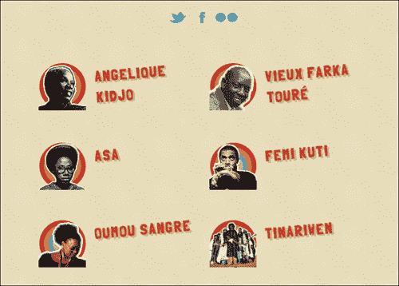

# 第六章：让您的网站更好

网站设计和开发的性质是这样的，不是所有的优化和建议都适用于所有情况。在本章中，我们将看看各种可用的优化工具以及它们最适合的情况，以使 HTML5 Boilerplate 网站加载和呈现更快。

# 为 Internet Explorer 找到最佳体验

Internet Explorer 8 及以下版本对标准和一致的呈现支持非常混乱。根据使用 Internet Explorer 访问您的网站的用户数量，您可能会或不会花费精力优化 Internet Explorer。

## IE 的移动优先样式

**媒体查询**是 CSS 功能，允许您根据特定媒体特征的值应用不同的规则集。例如，如果浏览器的最小宽度为`500`像素，您可以使所有的`h1`元素变成`红色`，如下面的代码所示：

```js
@media only screen and (min-width: 500px) {
h1 { color: red; }
}
```

然而，IE6、IE7 和 IE8 不理解媒体查询，通常用于根据不同的屏幕宽度调整宽度。因此，它们永远不会呈现出您为与某个媒体查询断点匹配的屏幕宽度的浏览器创建的优化样式（在上面的片段中为`min-width: 500px`）。在我们的 Sun and Sand Music Festival 网站中，我们在三个不同的媒体查询中有样式规则，如下面的代码片段所示：

```js
@media only screen and (max-width: 300px){ /*CSS rules */ }

@media only screen and (max-width: 750px) { /*CSS rules */ }

@media only screen and (max-width: 1150px) { /*CSS rules */ }
```

这意味着 IE6、IE7 和 IE8 将呈现样式，就好像这些查询不存在一样！如果您指定的设备宽度规则在最后较小，那么这些规则很可能会覆盖较大设备宽度的规则，导致 Internet Explorer 8 及以下版本上的设计不够理想。

理想情况下，在这种情况下，您只希望 IE 呈现所有样式，并且用户可以滚动，如果必要的话，以便最大宽度的样式规则始终适用。为此，我们可以创建一个单独的`ie.css`文件，它将呈现`main.css`中的所有规则，除了这些规则将不再包含在媒体查询中。

手动完成这项工作很困难，几乎不可能维护。然而，Nicolas Gallagher 写了一个他发明的优雅解决方案，使用 Sass 来导入每个媒体查询断点的单独样式表，并将它们编译成两个单独的样式表；一个没有媒体查询（`ie.css`），另一个有媒体查询（`main.css`）；我们将在下面看到这个。

### ie.scss

`ie.scss`的代码片段如下：

```js
@import "300-up";
@import "750-up";
@import "1150-up" /* Make sure largest is last */
```

### main.scss

`main.scss`的代码片段如下：

```js
@import "base";
@media (min-width:300px) {
    @import "300-up"; }
@media (min-width:750px) {
    @import "750-up"; }
@media (min-width:1150px) {
    @import "1150-up"; }
```

请注意，您需要在与`main.scss`和`ie.scss`相同的父文件夹中分别命名为`300-up.scss`、`750-up.scss`和`1150-up.scss`的每个文件。

在`index.html`页面的`head`标签中，您现在可以编写以下代码：

```js
<!--[if (gt IE 8) | (IEMobile)]><!-->
<link rel="stylesheet" href="/css/style.css">
<!--<![endif]-->

<!--[if (lt IE 9) & (!IEMobile)]>
<linkrel="stylesheet" href="/css/ie.css">
<![endif]-->
```

### 注意

Jake Archibald 还提供了一个更容易编写的解决方案，使用 Sass 在`jakearchibald.github.com/sass-ie/`。它利用了 Sass 3.2 的新功能，并且`main.scss`和`ie.scss`的组合略有不同。这需要对 Sass 有深入的了解，这超出了本书的范围。

## 在 IE6 和 IE7 中使用 jQuery 打印

IE6 和 IE7 不支持所有其他浏览器支持的`:after`伪选择器。这意味着我们的打印样式表，提供所有链接与链接文本一起打印的功能，在 IE6 和 IE7 中将无法工作。您可以简单地使用 jQuery 代码来克服这个问题。

### 注意

Bill Beckelman 在他的博客`beckelman.net/2009/02/16/use-jquery-to-show-a-links-address-after-its-text-when-printing-in-ie6-and-ie7/`上写了一篇关于这个问题的文章。IE 支持自己的专有`onbeforeprint`和`onafterprint`事件，可以用于我们的优势。根据 Bill Beckelman 的工作，我们可以编写我们自己简单的 jQuery 代码来在 IE6 和 IE7 中打印链接 URL。

首先，我们检查`window.onbeforeprint`是否存在，因为这将表明此代码正在一个 IE 浏览器上执行。我们还想验证此浏览器是否支持生成的内容，因为我们只需要在不支持时使用此代码。以下代码片段检查`window.onbeforeprint`事件是否存在：

```js
if (Modernizr.generatedcontent == false &&window.onbeforeprint !== undefined) {
```

然后，我们设置函数在`onbeforeprint`或`onafterprint`发生时执行，如下所示的代码：

```js
window.onbeforeprint = printLinkURLs;
window.onafterprint = hideLinkURLs;
```

然后，我们编写以下函数：

```js
functionprintLinkURLs() {
$("a[href]").each(function() {
$this = $(this);
$this.data("originalText", $this.text());
$this.append(" (" + $this.attr("href") + ")");                
});
}

functionhideLinkURLs() {
  $("a[href]").each (function() {            
     $(this).text($(this).data("originalText"));
  });
}
```

## 在 Internet Explorer 中为禁用的表单元素设置样式

直到 9 版本，Internet Explorer 没有办法指示表单字段是否被禁用，除了使用该字段中的文本的颜色。有时，一个字段只是一个图标而不是文本（或者可能是一个空的输入文本框），在这种情况下，几乎不可能分辨哪些按钮被禁用，哪些没有。

对于 Internet Explorer 7 及以上版本，只需在`main.css`中添加以下规则，即可使禁用的字段显示方式与启用的字段明显不同：

```js
.lt-ie9 input[type='text'][disabled], 
.lt-ie9 textarea[disabled] {
background-color: #EBEBE4;
}
```

如果您需要支持 Internet Explorer 6，则确保在具有`disabled`属性设置的表单元素上添加一个名为`disabled`的类，并将上一个规则修改为以下内容：

```js
.lt-ie9 input.disabled, 
.lt-ie9 textarea.disabled {
background-color: #EBEBE4;
}
```

## 抑制 IE6 图像工具栏

在 IE6 中，当鼠标悬停在所有图像上时，都会显示工具栏。您可以通过在`index.html`文件的`head`标签中添加以下代码来禁用它们：

```js
<metahttp-equiv="imagetoolbar" content="false">
```

# 使用工具更轻松地编写 CSS3

CSS3 处于前沿。一些属性需要所谓的供应商前缀。例如，3D 变换属性`perspective`在不同的浏览器中实现如下：

```js
-webkit-perspective //Safari, Chrome
-ms-perspective // Internet Explorer
perspective // Firefox
```

就在不久之前，Firefox 将此属性实现为`-moz-perspective`，但后来放弃了对`-moz-`前缀的支持。

正如您将意识到的那样，很难跟踪哪个浏览器需要前缀，哪个浏览器不需要，而且不太可行的是，每次浏览器添加或删除对前缀的支持时，都要定期更新我们创建的所有网站。

为了使这更容易，我们可以使用没有这些前缀的抽象，这样一个具有哪个属性需要哪个前缀的更新索引的工具可以将它们转换为所需的最终 CSS。

这正是 Sass（`sass-lang.com`）或 Less（`lesscss.org`）提供的。Sass 是一种语言，带有一个编译器，将用 Sass 编写的代码转换为 Ruby 中的 CSS。Less 是一种类似的语言，但是用 JavaScript 编写。

在这两种情况下，这些语言都是 CSS 语法的扩展，这意味着您可以将现有的 CSS 文件复制到 Sass 或 Less 文件中，并将它们编译为纯 CSS 文件，而不会出现任何错误。

这些语言提供的额外功能包括使用 mixin、变量、函数等。

对于 Sass，**Compass**是一个额外的框架，提供了一个在`compass-style.org/reference/compass/css3`中找到的 CSS3 mixin 的库。Less 有许多选项；最受欢迎和经常更新的可以在 Twitter Bootstrap 中找到，在`twitter.github.com/bootstrap/less.html#mixins`中可用。以下部分向您展示如何在 Sass 和 Less 中创建使用 CSS 变换的规则。

## Sass

Sass 的代码片段如下：

```js
.btn-arrow {
  @include transform(scale(2));
}
```

## Less

Less 的代码片段如下：

```js
.btn-arrow {
.scale(2);
}
```

## 输出的 CSS

输出的 CSS 将如下所示：

```js
.btn-arrow {
-webkit-transform: scale(2);
     -moz-transform: scale(2);
      -ms-transform: scale(2);
       -o-transform: scale(2);
transform: scale(2);
}
```

## 将 HTML5 Boilerplate CSS 转换为 Sass 或 Less

您通常只需将`main.css`文件重命名为`main.scss`或`main.less`，然后开始使用它作为基本的 Sass 或 Less 文件。要将这些文件编译为相应的 Less 或 Sass 文件，您可以使用 GUI-based 浏览器刷新软件，它会自动编译这些文件，比如**LiveReload**(`livereload.com/`)或**Codekit**(`incident57.com/codekit`)。

如果您熟悉命令行，可以安装 Less 或 Sass，并运行它们各自的命令行解释器将文件编译为纯 CSS。

如果您希望使用纯 Sass 或 Less 文件（而不是`main.css`文件的内容）开始，还有 HTML5 Boilerplate 的分支将样式表转换为 Sass。我们将在以下部分看到其中的两个。

### HTML5 Boilerplate Compass 扩展

有一个可用于与 Compass 一起使用的 Compass 扩展，位于`github.com/sporkd/compass-html5-boilerplate`。请注意，它的更新频率不如在 HTML5 Boilerplate 中找到的`main.css`文件。这是广泛模块化的，并将`main.css`文件拆分为多个 Sass 文件。结果 CSS 文件中的 CSS 注释也被删除。

### HTML5 Boilerplate Sass 分支

有一个 Sass 分支的`main.css`经常更新，网址为`github.com/grayghostvisuals/html5-boilerplate/tree/h5bp-scss`，您可以使用它，如果您只想要一个基本的 Sass 文件来开始。这个版本使用 Sass 变量，但不会将文件拆分为单独的文件。

不幸的是，HTML5 Boilerplate 没有最新的 Less 分支。但是，您可以将`main.css`重命名为`main.less`，然后将其用作 Less 文件。

# 打印注意事项

如果您的网页可能会被打印，您可能希望考虑使用可打印的颜色。一些浏览器认为一些颜色太浅，无法打印，并会强制使用较深的颜色进行打印；`merttol.com/articles/code/too-light-for-print.html`上有关于这个有趣怪癖的更多细节。

附录，*您是专家，现在怎么办？*，详细介绍了打印样式背后的推理和原理。

# 查找和使用 polyfills

大多数 HTML5 和 CSS3 功能在不同浏览器中具有不同级别的支持，因此，要么使用 JavaScript 代码在不支持这些功能的浏览器中模拟这些功能，要么提供一个可变的视图。这些代码片段称为 polyfills。

我帮助维护`html5please.com`，这是一个关于一些流行的 HTML5 和 CSS3 功能的 polyfills 的主观列表。

要注意的是，在不支持许多功能的浏览器上使用大量 polyfills 会带来性能损失。

当您使用 polyfills 时，请确保使用 Modernizr 的`load`函数，就像我们在第四章中为 Sun and Sand 音乐节网站的音频 polyfill 所做的那样。这将防止在支持您想要使用的功能的浏览器上不必要地加载 polyfills。

在 Modernizr Wiki 上提供了所有类型 polyfills 的全面列表，网址为`github.com/Modernizr/Modernizr/wiki/HTML5-Cross-browser-Polyfills`。

# 加快您的网站速度

如果您的页面使用了大量资源，比如图片，那么也许预取这些资源会更明智，这样您的页面加载速度会更快。**DNS 预取**就是一种方法。

## DNS 预取

DNS 预取通知浏览器页面加载过程中提前引用的其他域名资源，以便它可以解析这些域名的 DNS 解析。

浏览器必须在域名服务器（DNS）上查找域名，以确定其在互联网上的位置。有时，它必须经过多层域名服务器，这可能非常缓慢，而且并不总是一致的。通过使用 DNS 预取，即使在用户点击链接或加载资源之前，也会对特定域名的 DNS 解析进行处理，并且资源可以更快地获取。

谷歌表示，这可以节省大约 200 毫秒的时间，用于托管在外部域名上的资源。

如果您将资产托管在像亚马逊的 S3 这样的内容交付网络（CDN）上，甚至是引用 Google 的 API 或 Microsoft 的 API CDN，那么在预取这些文件时会更快。

通过在 HTML 文件的`head`标签中编写以下代码来调用 DNS 预取：

```js
<link rel="dns-prefetch" href="//image.cdn.url.example.com">
```

理解预取的浏览器将立即开始尝试解析`href`属性中的链接的 DNS。以下是它在 Amazon S3 上的样子：

```js
<link rel="dns-prefetch" href="//s3.amazonaws.com">
```

目前，Firefox 3.5 及更高版本，Safari 5 及更高版本，以及 IE9 及更高版本支持 DNS 预取。

# 使您的站点在搜索引擎上更加可见

尽管您网站的内容最重要，但确保其他一切都支持更好地在搜索引擎上显示内容也很重要。以下部分解释了一些您可以做到这一点的方法。

## 引导搜索蜘蛛到您的站点地图

站点地图通知搜索引擎站点内页面的存在，否则这些页面是无法发现的；也许它们在站点的其他页面或外部站点上都没有链接。

一些 CMS 提供插件来生成站点地图，列在`code.google.com/p/sitemap-generators/wiki/SitemapGenerators`，或者您可以按照[www.sitemaps.org/protocol.html](http://www.sitemaps.org/protocol.html)上的指南自己编写一个。

一旦编写了站点地图，您可以通过添加以下内容，让搜索引擎蜘蛛在爬行您的网站时发现它：

```js
<linkrel="sitemap" type="application/xml" title="Sitemap" href="/sitemap.xml">
```

您还可以将站点地图提交给各个搜索引擎，而不是在 HTML 页面中链接到站点地图，如果您希望尽可能减小页面大小。

## 实施 X-Robots-Tag 标头

您可能会有一个暂存服务器，例如`staging.example.com`，用于您的站点`example.com`。如果外部站点链接到暂存服务器上的文件（比如您在论坛上询问某些功能不起作用并链接到暂存服务器），即使域名不在`robots.txt`文件中，或者没有`robots.txt`文件，它也可能被搜索引擎索引。

为了防止这种情况，您可以通过将以下代码片段附加并取消注释的方式，将`X-Robots-Tag` HTTP 标头标签添加到暂存服务器上的`.htaccess`文件中：

```js
# ------------------------------------------------------------
# Disable URL indexing by crawlers (FOR DEVELOPMENT/STAGE)
# ------------------------------------------------------------

# Avoid search engines (Google, Yahoo, etc) indexing website's content
# http://yoast.com/prevent-site-being-indexed/
# http://code.google.com/web/controlcrawlindex/docs/robots_meta_tag.html
# Matt Cutt (from Google Webmaster Central) on this topic:
# http://www.youtube.com/watch?v=KBdEwpRQRD0

# IMPORTANT: serving this header is recommended only for
# development/stage websites (or for live websites that don't
# want to be indexed). This will avoid the website
# being indexed in SERPs (search engines result pages).
# This is a better approach than using robots.txt
# to disallow the SE robots crawling your website,
# because disallowing the robots doesn't exactly
# mean that your website won't get indexed (read links above).

# <IfModulemod_headers.c>
#   Header set X-Robots-Tag "noindex, nofollow, noarchive"
#   <FilesMatch "\.(doc|pdf|png|jpe?g|gif)$">
#     Header set X-Robots-Tag "noindex, noarchive, nosnippet"
#   </FilesMatch>
# </IfModule>
```

## 尾部斜杠重定向

搜索引擎将文件夹 URL `http://example.com/foo`和`http://example.com/foo/`视为两个不同的 URL，因此会将内容视为彼此的副本。为了防止这种情况，重写 URL，要么将`http://example.com/foo`改为`http://example.com/foo/`，要么将`http://example.com/foo/`改为`http://example.com/foo`。

我们这样做的方法是编辑 Apache 服务器的`.htaccess`文件，并添加以下重写规则（有关如何编辑`.htaccess`文件的详细信息，请参见第五章，“自定义 Apache 服务器”）。

### 选项 1：将 example.com/foo 重写为 example.com/foo/

以下代码片段帮助我们将`example.com/foo`重写为`example.com/foo/`：

```js
RewriteCond %{REQUEST_FILENAME} !-f
RewriteCond %{REQUEST_URI} !(\.[a-zA-Z0-9]{1,5}|/|#(.*))$
RewriteRule ^(.*)$ $1/ [R=301,L]
```

### 选项 2：将 example.com/foo/重写为 example.com/foo

以下代码片段帮助我们将`example.com/foo/`重写为`example.com/foo`：

```js
RewriteRule ^(.*)/$ $1 [R=301,L]
```

如果您有现有的重写规则，请执行以下步骤，以确保正确设置重写规则。不这样做可能会导致不正确的重定向和 404 错误。

+   备份：在开始添加重定向之前，备份您要添加重定向的`.htaccess`文件。这样，如果因为`.htaccess`文件中的错误而无法访问您的站点，您可以快速返回到备份文件。

+   不要附加或替换现有的重写规则：不要附加或替换您正在使用的 CMS 的现有规则，而是将它们合并在一起。

+   观察重写规则的顺序：确保您先添加斜杠，然后再添加可能重写末尾路径的现有规则。

+   确认`RewriteBase`路径：如果您的网站在子文件夹中，请确保为您的重写规则设置了正确的`RewriteBase`路径。如果您有一个有效的`RewriteBase`路径，请不要删除它。

### 注意

最后，考虑从 Google 的*SEO 入门指南*中实施指南，网址为[`googlewebmastercentral.blogspot.com/2008/11/googles-seo-starter-guide.html`](http://googlewebmastercentral.blogspot.com/2008/11/googles-seo-starter-guide.html)。

# 处理没有 JavaScript 的用户

HTML5 Boilerplate 提供了一个名为`no-js`的类，当 Modernizr 在`html`标签上检测到 JavaScript 时，它会被替换为一个名为`js`的类。使用这个类名，你可以为禁用 JavaScript 时网站的外观制定样式。

在我们的 Sun and Sand Festival 网站上，当 JavaScript 未启用时，点击**Day 2**链接不会产生任何效果。

你可以通过以下方式查看在各种浏览器上禁用 JavaScript 时网站的工作方式：

+   **Firefox**：进入**偏好设置**，点击**内容**，然后取消勾选**启用 JavaScript**复选框。

+   **Chrome**：下载**Chrome Web Developer**扩展，并在扩展内禁用 JavaScript。

+   **Safari**：在**开发**菜单上点击**禁用 JavaScript**菜单项。当你在 Safari 的**偏好设置**窗格的**高级**选项卡上勾选**显示开发**工具栏时，你就可以看到**开发**菜单。

+   **Internet Explorer**：在**设置**菜单中点击**Internet 选项**，然后点击**自定义级别**，勾选**在 Active scripting 中禁用**菜单。

+   **Opera**：点击**快速偏好设置**，取消选择**启用 JavaScript**选项。

让我们确保在 JavaScript 不可用时选项卡不会渲染，并确保整个列表同时显示，如下面的截图所示：



我们可以通过编辑`main.css`来利用`no-js`类来实现这一点。首先，我们需要删除选项卡导航，如下面的代码所示：

```js
.no-js .t-tab__nav {
display: none;
}
```

然后，我们需要确保这两个列表在特定情况下是静态定位，而不是绝对定位在彼此下方，如下面的代码所示：

```js
.no-js .t-tab__body {
position: static;
}
```

我们需要确保在**Day 2**的特定情况下不应用`hidden`类，这样我们就可以一次看到所有的艺术家，如下面的代码所示：

```js
.no-js .t-tab__body.hidden {
display: block !important;
visibility: visible;
}
```

现在，当你重新启用 JavaScript 时，你会注意到选项卡导航出现了，一切都按你的预期运行。

# 优化你的图片

你添加到页面上的每个资源都是对服务器的额外请求，也是浏览器在宣布页面完成之前额外的网络请求。网络请求通常是页面加载中最慢的组件。这在移动设备上特别明显，当在 3G 甚至更低的连接上浏览网站时。你的文件越小，它们就会越快地到达浏览器。

如果可以避免使用大图片，最好不要使用。

## 8 位 PNG 文件

如果考虑使用 GIF 格式的图片，应该始终使用 PNG。PNG 格式的图片要轻得多，体积也小得多。此外，8 位 PNG 文件的体积要小得多。

如果你使用 PNG 格式的图片，应该使用带有完整 alpha 通道的 PNG-8，这样可以兼容 IE6。确保验证最终输出，以确保它们不会太粗糙或像素化。

## 图片优化工具

HTML5 Boilerplate 中有构建工具可以优化图片，我们将在下一章中进行讨论。还有一些独立的工具也值得一看，当你想要一次压缩一堆图片时。如果你希望上传你的图片并对其进行优化，可以在`smushit.com/ysmush.it/`上进行。

### ImageAlpha

如果你有 24 位 PNG 图片，可以使用从`pngmini.com`下载的工具将它们转换为带有完整 alpha 通道的 8 位 PNG 文件。这个工具只适用于 Mac OS X。

在`pngquant.org`上列出了适用于其他操作系统的图形用户界面和命令行工具。

### ImageOptim

如果您想一次优化各种格式的图像，**ImageOptim**将是您最佳的选择。您可以从`imageoptim.com`下载。这也仅适用于 Mac OS X，并利用多个工具执行这些优化。

如果您想在其他系统上使用类似的东西，您可以为每种图像格式下载您需要的特定工具。以下表格列出了一些流行图像格式的工具：

| 格式 | 工具 |
| --- | --- |
| 动画 GIF | `Gifsiclewww.lcdf.org/gifsicle/` |
| JPEG | `Jpegtranjpegclub.org/` |
| PNG | `Pngcrushpmt.sourceforge.net/pngcrush/``Imageworsenerentropymine.com/imageworsener/``Optipngoptipng.sourceforge.net/``PNGOUT advsys.net/ken/utils.htm` |

如果您想了解更多关于使用这些优化工具的信息，请阅读 Stoyan Stefanov 关于网络图像优化的幻灯片，网址为[www.slideshare.net/stoyan/image-optimization-for-the-web-at-phpworks-presentation](http://www.slideshare.net/stoyan/image-optimization-for-the-web-at-phpworks-presentation)。关于 PNG 和 JPEG 图像格式还有更多巧妙的优化方法，可以在*Smashing Magazine*上找到详细信息，网址分别为[www.smashingmagazine.com/2009/07/15/clever-png-optimization-techniques](http://www.smashingmagazine.com/2009/07/15/clever-png-optimization-techniques
)和[`www.smashingmagazine.com/2009/07/01/clever-jpeg-optimization-techniques/`](http://www.smashingmagazine.com/2009/07/01/clever-jpeg-optimization-techniques/)。

## 使用图像精灵

对于每个资源进行网络请求需要很长时间。为了使这些更小，您可以将多个图像文件合并为一个单一的图像文件，只需请求一次，并且可以缓存很长时间，以便页面加载速度显著加快。如果您的页面将在互联网连接非常低带宽的设备上查看，这将特别有用。

这意味着，您可以将多个图像合并为一个大图像，并在所有选择器上使用 CSS 背景属性，其中这些图像将被使用。让我们将所有艺术家的图像转换为一个大精灵，并将图像元素替换为背景图像。

以下是我们的最终精灵：


让我们替换`index.html`中的图像元素，就像以下这样：

```js

```

使用以下内容：

```js
<i class="t-artist__image artist-tinariwen"></i>
```

我们为每位艺术家都这样做。然后，在我们的`style.css`中，我们添加以下代码片段：

```js
.t-artist__image {  
background: url(../img/artists-image.png) top left no-repeat, 
url(../img/bg-artist.png) no-repeat center center;
float: left;  
display: block;  
}
.artist-asa { background-position:  -0px -0px, 0 0; }
.artist-kidjo { background-position:  -0px -100px, 0 0; }
.artist-kuti { background-position:  -100px -0px, 0 0; }
.artist-sangre { background-position:  -100px -100px, 0 0; }
.artist-tinariwen { background-position:  -200px -0px, 0 0; }
.artist-toure { background-position:  -200px -100px, 0 0; }
```

最终页面没有发生任何变化，只是我们现在将这些图像的网络请求数量减少到 1 个而不是 6 个。通过优化最终的精灵，我们甚至可以使这个请求更快。

生成精灵似乎是很多工作，但有许多工具可以帮助完成这项工作。

### 从 Adobe Photoshop 中的 CSS 精灵

使用`arnaumarch.com/en/sprites.html`中记录的说明，您可以使用 Photoshop 中的脚本文件选择一个图像文件夹，并生成使用这些文件中的图像定位和校正为背景图像的相关 CSS 文件。

在使用此工具时，有一些需要注意的事项，如下所述：

+   确保文件夹只包含您想要添加到精灵中的图像

+   生成的 CSS 文件位于用于创建精灵的文件夹内

+   生成的精灵在 Adobe Photoshop 中打开，您需要在将其保存到所选位置之前裁剪它

### 使用 Compass 的 CSS 精灵

Compass——Sass 的框架——可以在编译时将您的图像拼接在一起，并在您的 Sass 文件中引用这些图像，然后在生成的 CSS 文件中将其转换为精灵。

您只需要确保在图像文件夹中设置一个文件夹，以便为每个图像设置正确的名称，如下列表所述（摘自 Compass 文档）：

+   `images/my-icons/new.png`

+   `images/my-icons/edit.png`

+   `images/my-icons/save.png`

+   `images/my-icons/delete.png`

名称`my-icons`可以是您喜欢的任何名称。然后在 Sass 文件中，使用以下代码：

```js
@import "my-icons/*.png";
@include all-my-icons-sprites;
```

在上一步中使用的名称与`my-icons`相同。完成！Compass 会生成一个包含以下代码的 CSS 文件：

```js
.my-icons-sprite,
.my-icons-delete,
.my-icons-edit,
.my-icons-new,
.my-icons-save   { background: url('/images/my-icons-s34fe0604ab.png') no-repeat; }

.my-icons-delete { background-position: 0 0; }
.my-icons-edit   { background-position: 0 -32px; }
.my-icons-new    { background-position: 0 -64px; }
.my-icons-save   { background-position: 0 -96px; }
```

现在，在您的标记中使用适当的类名，以向您的元素添加适当的图像。

### SpriteMe

SpriteME，可在`spriteme.org/`上获得，是一个书签工具，可分析页面上使用的图像并将其制作成精灵。如果您有现有站点要转换为使用精灵，这将是一个很好的起点。

# 增强 Google Analytics

**Google Analytics**可以跟踪多种数据类型，以下是一些易于明显的增强，您可以对您的分析数据进行的。 

## 添加更多跟踪设置

Google Analytics 提供了许多可选设置来进行跟踪，您无需在`.push()`方法上使用；而是可以直接附加到初始数组上。而不是以下内容：

```js
var _gaq = _gaq || [];
_gaq.push(['_setAccount', 'UA-XXXXX-X'']);
_gaq.push(['_trackPageview']);
```

您可以执行以下操作：

```js
var _gaq = [['_setAccount', 'UA-XXXXX-X'],['_trackPageview']];
```

## 匿名化 IP 地址

在一些国家，不得将个人数据转移到法律不那么严格的司法管辖区之外（即从德国到欧盟之外）。因此，使用 Google Analytics 脚本的网站管理员可能需要确保不会将个人（可跟踪的）数据传输到美国。您可以使用`_gat.anonymizeIp`选项来实现。使用时看起来像这样：

```js
var _gaq = [['_setAccount', 'UA-XXXXX-X'], ['_gat._anonymizeIp'], ['_trackPageview']];
```

## 在 Google Analytics 中跟踪 jQuery AJAX 请求

史蒂夫·施瓦茨写道，您可以在`plugins.js`中使用的代码，可以让您跟踪 jQuery AJAX 请求，网址是[www.alfajango.com/blog/track-jquery-ajax-requests-in-google-analytics](http://www.alfajango.com/blog/track-jquery-ajax-requests-in-google-analytics)。以下代码片段显示了该脚本：

```js
/*
 * Log all jQuery AJAX requests to Google Analytics
 * See: http://www.alfajango.com/blog/track-jquery-ajax-requests-in-google-analytics/
 */
if (typeof _gaq !== "undefined" && _gaq !== null) {
  $(document).ajaxSend(function(event, xhr, settings){
    _gaq.push(['_trackPageview', settings.url]);
  });
}
```

## 在 Google Analytics 中跟踪 JavaScript 错误

如果您想要使用 Google Analytics 在页面上跟踪 JavaScript 错误，可以使用以下脚本来实现，在`index.html`页面中定义了 Google Analytics 变量`_gaq`之后添加：

```js
(function(window){
var undefined, 
link = function (href) {
var a = window.document.createElement('a');
a.href = href;
return a;
    };
window.onerror = function (message, file, row) {
var host = link(file).hostname;
    _gaq.push([
      '_trackEvent',
      (host == window.location.hostname || host == undefined || host == '' ? '' : 'external ') + 'error',
message, file + ' LINE: ' + row, undefined, undefined, true
    ]);
  };
}(window));
```

# 总结

在本章中，我们看了如何为 Internet Explorer 的用户提供更好的体验。我们还简要考虑了一些工具，可以帮助我们编写更高效、更健壮的样式表，更易于在 CSS 的最新发展中进行维护。我们看了如何使用 polyfills 编写加载更快、更安全的页面。我们详细了解了在禁用 JavaScript 时如何渲染 Sun and Sand 网站，并将艺术家的图像拼接成精灵并保存在多个网络请求中。

在下一章中，我们将看看如何使用 HTML5 Boilerplate 提供的构建脚本来自动部署我们的网站。 
