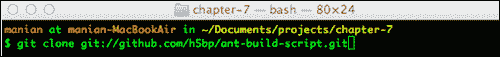
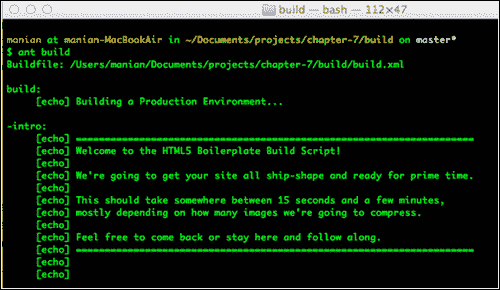
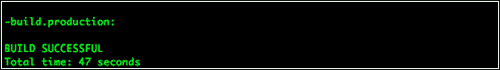
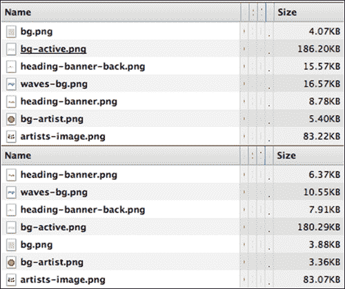
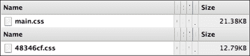
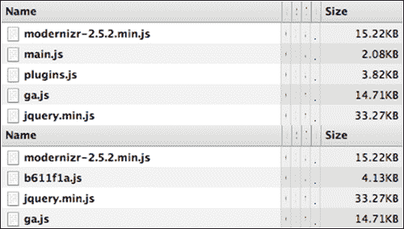
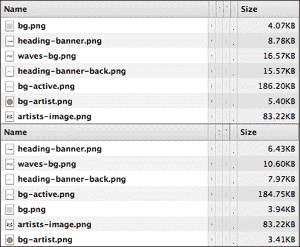
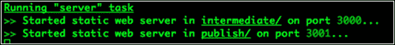

# 第七章：使用构建脚本自动化部署

我们准备部署我们的网站了！但在我们这样做之前，我们应该确保我们最小化了所有脚本和优化了图像，这样这些页面就可以在全球任何地方尽可能快地加载。我们可以通过在命令行执行脚本来自动化这些任务。让我们看看我们有以下哪些选项。

# 构建脚本

一旦你的项目完成，你想要生成剥离注释并优化快速加载的文件。在软件项目中通常使用软件构建系统来实现类似的目标。HTML5 Boilerplate 的构建脚本提供了针对典型网页开发项目所需的任务范围。

脚本只能在您确认您的项目已准备好部署并且已经经过充分测试后使用。构建脚本只是自动化了去除注释、优化文件和确保文件适合生产的过程。

目前 HTML5 Boilerplate 贡献者积极维护有两种构建脚本；这些在下一节中探讨。

## Ant 构建脚本

Ant 构建脚本是一组在 Apache Ant 构建系统（`ant.apache.org/`）之上工作的文件，这个系统自从 HTML5 Boilerplate 的早期版本以来就一直存在。它提供了各种选项，如下所述：

+   发布文件到测试、开发和生产环境

+   使用**JSHint**或**JSLint**检查你的脚本文件的语法和代码质量，或使用**CSSLint**检查你的样式表

+   合并并压缩所有 JavaScript 文件到一个文件中，并更新 HTML 页面，引用这个新文件

+   通过删除注释、空白字符并压缩内联样式和脚本来清理和整理 HTML 标记

+   合并并压缩所有样式表，并更新 HTML 页面，引用新文件，而不是多个 CSS 文件

+   编译样式预处理器文件，如 Less 或 Sass，生成最终的 CSS 样式表，并更新 HTML 页面中的引用

+   使用来自`optipng.sourceforge.net/`的 OptiPNG 和来自`jpegclub.org/jpegtran/`的 JPEGTran 分别优化`img`文件夹内的 PNG 和 JPEG 图像

+   使用来自`github.com/jsdoc3/jsdoc`的 JSDoc3 从你的脚本构建文档

## Node 构建脚本

一个新的基于 Node 的构建脚本，位于`nodejs.org/`，正在积极开发中。虽然它还没有用于生产，但它提供了很多与 Ant 构建脚本相似的任务，还有一些以下描述的新特性：

+   合并并压缩所有 JavaScript 文件到一个文件中，并更新 HTML 页面，引用这个新文件

+   合并并压缩所有样式表，并更新 HTML 页面，引用新文件，而不是多个 CSS 文件

+   通过删除注释、空白字符并压缩内联样式和脚本来清理和整理 HTML 标记

+   使用 OptiPNG 和 JPEGTran 分别优化`img`文件夹内的 PNG 和 JPEG 图像

监视项目文件的变化，并在它们发生变化时自动运行构建脚本并在浏览器中重新加载打开的页面。

## 使用哪个构建脚本？

根据你熟悉的平台，你可以选择一个而不是另一个。这两个构建脚本都足够稳定，可以用来部署你的生产文件，所以你的选择取决于你最习惯使用哪个。

如果你已经安装了 Ant，那么 Ant 构建脚本可能是一个明显的选择。如果你发现自己经常使用 Node 或者在你的项目中使用它，那么 Node 构建脚本可能是一个好的起点。在本章中，我们将查看如何使用这两个工具，这样你就可以熟练掌握它们中的任何一个。

# 使用 Ant 构建脚本

首先，通过在你的命令行工具中输入以下内容来确认你的系统上是否安装了 Ant：

```java
ant–version
```

如果你还没有安装 Ant，请在进行下一步之前先安装它。

### 注意

Ant 默认安装在 Mac 上，而在大多数 Linux 平台上作为软件包安装。对于 Windows，安装 Ant 稍微复杂一些。你需要从[www.oracle.com/technetwork/java/javase/downloads/index.html](http://www.oracle.com/technetwork/java/javase/downloads/index.html)安装 Java SDK，然后下载`WinAntcode.google.com/p/winant/`并将其安装程序指向`Program Files/Java/jre6/bin/`。

接下来，你需要安装**ant-contrib** ，这是一个为 Ant 提供了许多功能的工具，HTML5 构建脚本使用了这些功能。**WinAnt** 在你使用它在 Windows 上安装 Ant 时会自动安装这个工具。然而，对于 Linux 用户，你可以使用**yum** 作为软件包来安装它。在 Mac 上，你可以安装 MacPorts ([www.macports.org/install.php](http://www.macports.org/install.php))，然后在你通常的命令行工具（通常是终端）中输入以下内容：

```java
sudo port install ant-contrib
```

最后，确保图像优化工具已安装。对于 Mac 用户，你需要确保你有**jpegt** **ran** ([www.ijg.org/](http://www.ijg.org/))和**optipng** (`optipng.sourceforge.net/`)安装在你的路径上。你可以通过在你的命令行终端中输入以下内容来安装这两个文件：

```java
sudoport install jpeg optipng
```

### 注意

`PATH`是一个环境变量，它包含了一系列文件夹，当您输入一个命令时，命令行界面会在这些文件夹中搜索。你可以从[www.cs.purdue.edu/homes/cs348/unix_path.html](http://www.cs.purdue.edu/homes/cs348/unix_path.html)了解如何添加文件夹到路径。

如果你在 Windows 上，Ant 构建脚本项目中包含了这些图像工具所需的二进制文件供你安装。

## 安装构建脚本

在终端（或你的命令行工具）中，我们将导航到我们的项目文件夹并使用 Git 安装构建脚本，如下面的屏幕截图所示：



现在我们必须将构建脚本的文件夹名称从`ant-build-script`更改为`build`，然后才能继续。这可以通过使用以下命令来完成：

```java
mv ant-build-script build
```

完成后，让我们使用以下命令导航到构建脚本文件夹：

```java
cd build
```

现在，让我们执行构建脚本！打开你的命令行工具并输入以下内容：

```java
ant build
```

如果你正确设置了你的构建脚本文件夹，那么你应该得到以下屏幕：



然后，在任务执行后，你应该得到以下输出：



现在，你有一个全新的**发布**文件夹，其中存储了优化后的文件。让我们打开**发布**文件夹中的`index.html`页面，在 Chrome 浏览器中使用 Chrome 开发者工具的**网络**标签，观察加载的文件及其相关大小，看看所有已经优化的内容。

请注意，你必须打开**网络**标签来记录正在请求的文件。

## 缩小后的图片文件

**网络**标签记录了所有用于`index.html`的图片。我们可以看到，在**发布**文件夹中用于`index.html`页面的图片明显比原来的大小要小。

在以下屏幕截图中，屏幕截图的底部部分显示了**发布**文件夹中的图片列表，这些图片明显比我们原始项目中使用的图片要小（列表在屏幕截图的顶部部分）：



## 缩小后的 CSS 文件

我们注意到，在我们使用构建脚本之前，我们的 CSS 文件叫做`main.css`，大约有 21KB，但在使用构建脚本后，文件被重命名，现在几乎是原来大小的一半，如下屏幕截图所示：



## 缩小且更少的 JS 文件

执行构建脚本后，你会注意到`main.js`和`plugin.js`已经合并成了一 个。他们不仅被合并在一起，而且被压缩了，导致最终脚本文件的大小更小。

通过构建脚本生成的`index.html`页面仅调用以下屏幕截图底部部分所示的四种 JavaScript 文件，与原来放在文件夹顶部的五种 JavaScript 文件相比：



## 文件中没有注释

**发布**文件夹中的 HTML、CSS 和 JS 文件没有包含 HTML5 Boilerplate 文件中的注释。

## 构建选项

Ant 构建脚本有一些默认不执行的任务，但当你需要时可以为你提供。以下各节解释了这些任务允许你做什么。

### 压缩标记

默认情况下，Ant 构建脚本在优化时不会从`index.html`页面中移除空白字符；如果你也想移除 HTML 文件中的空白字符并对其进行压缩，你可以执行以下操作：

```java
ant minify
```

### 防止图片优化

当执行构建脚本时，你会注意到脚本花在优化图像上的时间最长。如果你仅仅是为了测试最终的生产准备文件而执行构建脚本，那么你就不需要优化图像。在这种情况下，你应该执行以下命令：

```java
ant text
```

### 使用 CSSLint

CSS Lint（`csslint.net`）是一个开源的 CSS 代码质量工具，它对你的代码进行静态分析，并标记出无效或可能导致问题的样式规则。要在你项目的 CSS 文件上使用 CSS Lint，只需输入以下内容：

```java
ant csslint
```

通常，你会看到一大堆警告。CSS Lint 有很多你可以设置的选项。要做到这一点，打开`build`中的`config`文件夹内的`project.properties`文件。通过使用以下命令取消注释这一行：

```java
#tool.csslint.opts =
```

在`=`符号后输入你想与 CSS Lint 一起使用的所有选项并保存。你可以在`github.com/stubbornella/csslint/tree/master/src/rules`中找到可以使用的各种选项。

### 使用 JSHint

JSHint（`jshint.com`）是一个由社区驱动的工具，用于检测你的 JavaScript 代码中的错误和潜在问题，并强制执行你的团队的编码约定。要对你的 JavaScript 文件执行 JSHint，去到你的项目并执行以下操作：

```java
ant jshint
```

执行后，我们会看到一大堆错误被列出来，针对我们的`main.js`。 corrected file 包含在本章的代码中。一旦纠正，你还会注意到有一大堆错误被抛出，针对`plugin.js`中的代码。这是因为我们使用了平滑滚动插件的压缩代码。让我们用项目仓库中的未压缩代码替换它，项目仓库的地址是`github.com/kswedberg/jquery-smooth-scroll/blob/master/jquery.smooth-scroll.js`。

现在，我们得到一大堆错误，所有的错误都在告诉我们需要使用更严格的比较运算符。让我们为当前项目关闭这个选项。我们可以通过打开`build`文件夹内的`config`文件夹中的`project.properties`文件并取消注释以下允许你使用自己的 JSHint 选项的行来实现：

```java
#tool.jshint.opts
```

改为以下代码片段：

```java
tool.jshint.opts = maxerr=25,eqeqeq=false
```

### 注意

更多关于选项的信息可以在 JSHint 网站上的`jshint.com`找到。

我们的错误消失不见了！

### 设置 SHA 文件名

合并和压缩后的 CSS 和 JS 文件名被设置为唯一生成的字符串，这确保了当新的生产构建部署到服务器时，这些文件的高速缓存本地副本永远不会被加载。默认情况下，文件名中使用的字符数为`7`。你可以通过改变`build`文件夹中`config`文件夹内的`project.properties`中的以下行来将其设置为更小或更大的数字：

```java
#hash.length = 7
```

取消注释上一行，然后将`7`改为你喜欢的字符数，使用以下语法：

```java
hash.length = <number of characters you prefer>
```

## 使用 Drupal 或 WordPress

为了确保这些 Ant 构建脚本能如预期般为 Drupal 工作，需要做出一些小修改。请注意，对 HTML 页面进行压缩的帮助不大，因为 Drupal 或 WordPress 会生成大部分的标记。

### 更新 build.xml

你需要对 `build.xml` 文件进行一次小修改，以使其能与 Drupal 或 WordPress 的文件结构协同工作。

在文件中寻找 `<echo message="Minifying any unconcatenatedcss files..."/>`。就在那行代码之后，更改以下内容：

```java
<filesetdir="${dir.source}/${dir.css}/" excludes="${concat-files}" includes="**/*.css"/>
```

以下内容需要更新：

```java
<filesetdir="${dir.source}/${dir.css}/" excludes="${concat-files}, ${dir.build.tools}/**/*.css, ${dir.intermediate}/**/*.css, ${dir.publish}/**/*.css" includes="**/*.css"/>
```

### 设置项目配置属性

在 `build` 文件夹中的 `config` 文件夹里的 `project.properties` 文件中，加入以下代码：

```java
dir.css = .
dir.images = images
file.root.stylesheet = style.css
```

### 设置 JS 文件分隔符

WordPress 或 Drupal 主题需要你将你的标记分割到不同的文件中（例如，对于 WordPress 就是 `footer.php`，对于 Drupal 就是 `footer.tpl.php`）。你需要知道以下代码位于以下哪个文件中：

```java
<!-- scripts concatenated and minified via build script -->
<scriptsrc="img/plugins.js"></script>
<scriptsrc="img/main.js"></script>
<!-- end scripts -->
```

使用文件名（例如，`footer.php`）在 `project.properties` 文件中设置 `file.root.page` 属性，使用以下代码：

```java
file.root.page = <name of file>
```

本章的代码中提供了一个经过修改的构建脚本的示例 Drupal 和 WordPress 主题。

# 使用 Node 构建脚本

Node 构建脚本与 Ant 构建脚本的不同之处在于：

+   它具有普遍的安装性，不需要从一个项目复制到另一个项目。

+   所有项目都应该使用 Node 构建脚本进行初始化。在一个已经开始的项目中添加它要麻烦得多。

Node 构建脚本需要 Node 环境，所以通过输入以下命令验证你是否已经安装了 Node：

```java
node -v
```

如果你还没有安装 Node，可以从 `nodejs.org/` 安装（或者通过 [github.com/joyent/node/wiki/Installing-Node.js-via-package-manager](http://github.com/joyent/node/wiki/Installing-Node.js-via-package-manager) 使用包管理器安装）。

## 使用 Grunt

**Grunt** (`gruntjs.com/`) 是一个基于 Node 的命令行构建工具，这个 Node 构建脚本就是基于它开发的。Node 构建脚本提供了可插入到 Grunt 中的 HTML5 Boilerplate 优化的任务。

这需要你在项目文件夹内使用一个 `package.json` 文件和一个 `grunt.js` 文件，这可以在你初始化项目时设置。

## 安装 Node 构建脚本

在你的命令行工具中，首先通过输入以下命令来安装 Node 构建脚本包：

```java
npm install https://github.com/h5bp/node-build-script/tarball/master -g
```

Node 构建脚本也可以作为更大构建设置的一部分使用。如果你倾向于以不同的方式使用它，请在这里查看所有可能的使用方式：[github.com/h5bp/node-build-script/wiki/install](https://github.com/h5bp/node-build-script/wiki/install)。

安装后，你可以通过初始化来创建你的 HTML5 Boilerplate 项目文件夹。

### 初始化你的项目

你可以选择不同的选项来为你自己设置项目文件夹。让我们用这个来设置一个临时的项目，学习如何使用这个脚本启动你的 HTML5 Boilerplate 项目。

创建一个文件夹，你的 HTML5 Boilerplate 项目应该放在这里。使用命令行工具导航到该文件夹，并输入以下命令：

```java
h5bpinit
```

这将开始为你设置一整套命令行交互，供你选择。它主要用于设置将由 Grunt 使用的包管理信息。

一旦你这样做，你有三个选项可以选择开始设置你想要的文件；这些选项如下：

+   `[D]efault`：HTML5 Boilerplate 的标准文件集合。

+   `[C]ustom`：获取所有标准文件，可以选择重命名`js/`、`css/`或`img/`文件夹。如果你的文件将被用作其他系统（如 Drupal 或 WordPress）的模板，你可能希望这样做。

+   `[S]illy`：提示重命名 HTML5 Boilerplate 中的每个文件夹/文件。除非你是语义完美主义者，否则你不太可能使用这个选项。

在你选择想要进行的安装类型之后，还会问更多问题。注意，如果你按*Enter*，括号内显示的默认值将被设置。

这将然后从 Github 仓库下载 HTML5 Boilerplate 的最新版本，作为你的起点。

### 使用 Node 构建脚本与现有项目一起工作

不可能不可能使用脚本与现有项目一起工作，只是有点繁琐。项目正在进行中，以实现在`github.com/h5bp/node-build-script/issues/55`中使用此脚本，但在此之前，以下是我们如何与我们的 Sun and Sand 网站一起使用它的方法：

1.  首先，创建一个临时文件夹，然后从命令行执行 Node 构建脚本，按照早前的部分描述初始化一个空项目。

1.  然后，只将`package.json`和`grunt.js`复制到你的项目文件夹中。

你可以在`nimbu.in/h5bp-book/chapter-7-node-init/`文件夹中查看实际的代码来看到这个操作。

## 使用 Node 构建脚本构建你的项目

在命令行工具中导航到你在上一节初始化的 Sun and Sand 项目文件夹，并输入以下命令：

```java
h5bpbuild:default
```

这将合并文件，结果与 Ant 构建脚本一样，发布在`publish`文件夹中。你也可以像使用 Ant 构建脚本一样使用这些其他的构建选项。

### 文本

如果你想在构建项目时省略图像压缩，请使用以下命令：

```java
h5bpbuild:text
```

### 最小化

如果你还想最小化 HTML 文件，请使用以下命令：

```java
h5bpbuild:minify
```

结果与 Ant 构建脚本找到的结果类似；下面的屏幕截图显示了压缩过程的结果：



有一些额外的选项是 Ant 构建脚本所没有的。

### 服务器

这将打开一个本地服务器实例，你可以立即预览你的网站。当想测试使用协议相关 URL 链接到文件的页面时，这个功能很有用。要实现这一点，只需在你的命令行工具中进入你的项目文件夹，并输入以下命令：

```java
h5bp server
```

你会看到为`publish`文件夹和`intermediate`文件夹都启动了服务器，如下面的屏幕截图所示：



然后，打开`http://localhost:3001`来查看发布的网站。

### 连接

使用这个命令，你可以看到在你做出项目中的任何资产更改后，它会在打开的浏览器中自动刷新页面。这节省了你手动刷新页面以查看更改的麻烦。要实现这一点，只需在你的命令行工具中进入你的项目文件夹，并输入以下命令：

```java
h5bp connect
```

## 与 Drupal 或 WordPress 一起使用

使用 Node 构建脚本初始化一个 HTML5 Boilerplate 项目，然后将其转换为为 Drupal 或 WordPress 构建的模板是相当简单的。首先，确保在执行`h5bp init`时选择`Custom`选项。然后，在设置文件夹时，将`inc`设为样式表所在的文件夹，将`images`设为包含模板图片的文件夹的名称。当你再次被提示时，输入相同的值，项目框架将会为你生成。确保你用你的模板文件替换`index.html`。

一旦完成上述步骤，打开你项目文件夹中的`grunt.js`文件，并确认通过以下代码，样式表的文件夹被设置为父文件夹：

```java
css: {
      'style.css': ['*.css']
    },
```

确保只有 JavaScript 文件和样式表在文件名前加上 SHA 文件名，通过编辑或删除被重命名的图片来实现。这可以通过以下代码完成：

```java
rev: {
js: 'js/**/*.js',
css: '*.css',
},
```

脚本还需要知道`images`文件夹的新位置。我们可以通过设置图像的源和目标文件夹来实现，如下面的代码片段所示：

```java
img: {
dist: {
src: 'images',
dest: 'images'
      }
    },
```

# 下一步

一旦我们对`publish`文件夹中的生产文件感到满意，然后我们可以将其移动到我们的托管提供商那里，以替换使我们的网站运行的文件。

理想情况下，你会使用版本控制系统来做这件事，这样在极不可能的情况下更新使得某些页面无法访问时，你可以快速回滚更新。

如果你只是为 Drupal 或 WordPress 创建一个模板，那么将此移动到服务器上的 WordPress 文件夹中，该服务器位于版本控制系统之下可能会有所帮助。

或者，你可以压缩你的项目，然后将文件复制到服务器上，在那里它们可以被解压缩并使用。Node 构建脚本提供了一个这样做选项。在你的命令行工具中进入你的项目文件夹，并输入以下命令：

```java
h5bptar –-input publish –-output <project-name>.tgz
```

使用能最好地描述你项目的名称，而不是`<project-name>`。然后，将`<project-name>.tgz`文件复制到你的服务器上，并将其解压到你希望文件所在的文件夹。

# 总结

在本章，我们学习了如何使用 HTML5 Boilerplate 团队提供的两种构建脚本。我们还查看了如何将它们都与 Drupal 或 WordPress 模板一起使用。我们还探讨了文件构建完成后我们可以做什么。

在下一章，我们将探讨一些高级任务，你现在知道如何使用 HTML5 Boilerplate 创建和部署项目后，可以尝试这些任务。
