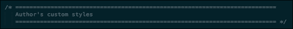
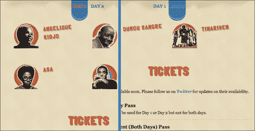

# 三、创建您的网站

现在，我们已经完成了与我们的项目相关的所有基本内务处理，让我们看看建设这个网站的实际任务。我们将首先从标记开始，跳转到样式表，最后添加与脚本的交互性。

# 处理标记

对于我们的阳光沙滩节项目，我们有一个简单的设计。设计如下图所示:


看看它是如何组织的，页面的大致结构解释如下:

*   **标题**:带有一组导航链接的横幅标志
*   **主要内容**:导航链接将链接到的页面的主要部分
*   **左栏**:这里包含主要内容
*   **右栏**:包含观众感兴趣的次要信息，但不是必不可少的
*   **页脚**:赞助商标志和一个带有艺术家音乐的音频播放器，他们将参加这个节日

## 创建标记

**HTML5 博士** 有一个列表，列出了你可以在`html5doctor.com/element-index/`在网页中使用的所有元素。与我们之前列出的列表相比，看起来`header`标签可以很好地存放我们的徽标和导航链接，而赞助商徽标和音频播放器可以放在`footer`标签内。这就给我们留下了主要内容；看起来`div`标签上的 main 角色最适合了！

这是我们最终得到的标记。[第二章](02.html "Chapter 2. Starting Your Project")、*启动您的项目*中的`index.html`页面也包含以下代码:

```html
<header>
  <a href="#main">Skip Navigation</a>

  <h1>Sun &amp; Sand Festival 2012</h1>
  <h2>Ngor&amp; Terou Bi, Dakar</h2>
  <nav class="site-nav">
  <a href="#tickets">Tickets</a>
  <ahref="#about">About</a>
  <a href="#line-up">Line-up</a>
  <a href="#contact">Contact</a>
  <a href="#gettinghere">Getting Here</a>
  </nav>
</header>
<div role="main">
  <section id="primary">
    <article id="tickets">

    </article>
    <article id="about">
    </article>
    <article id="lineup">

    </article>
    <article id="contact">

    </article>
    <article id="gettinghere">
    </article>
  </section>

  <aside id="secondary">
    <article>
      <h2>Get some sun!</h2>
      <ul>
      <li>Follow us on <a href="http://twitter.com/sunnsand">twitter</a>!</li>
      <li>Stalk us on <a href="http://facebook.com">facebook</a>!</li>
      <li>Get some sun through <a href="http://flickr.com/photos/sunnsand">flickr</a>!</li>
      </ul>
    </article>
  </aside>
</div>
<footer>
    <article class="sponsors">
    <a href="#">Boca-Cola</a>
    <a href="#">Darbucks</a>
    <a href="#">Kugle</a>
    <a href="#">Pling</a>
    </article>
    <audio src="audio.webm" controls></audio>
</footer>
```

### 类型

您可以从您在[http://www.PacktPub.com](http://www.PacktPu)的账户中下载您购买的所有 Packt 书籍的示例代码文件。如果您在其他地方购买了这本书，您可以访问[http://www.PacktPub.com/support](http://www.PacktPub.com/su)并注册，以便将文件直接通过电子邮件发送给您。

### 决定使用哪个元素

有了 HTML5，我们有太多的元素可以选择，导致我们中的一些人选择瘫痪。如果您的文档结构中有任何内容似乎非常明显地适合任何新元素，请继续标记它们。如果没有，继续使用`div`或任何其他看起来明显合适的元素。

在我们的代码中，当我们有结构不同的主要内容时，我们使用`section`元素，当我们有相似但重复的内容部分时，我们使用`article`元素。你对这些选择的看法很可能不同；在这种情况下，我建议你选择你觉得舒服的。

如果你想了解更多关于新的 HTML5 元素，我建议你查看一下 *HTML5: Up & Running，Mark Pilgrim，O'Reilly* 中关于语义的章节，在`diveintohtml5.info/semantics.html`的谷歌新闻印记下。

### 编写有效标记

编写有效的标记可以确保您的页面在所有呈现它的浏览器中表现一致。有效标记是指符合浏览器遵守的网络标准的标记。这样，你将防止任何不可预测的行为。

编写有效标记的最简单方法是使用工具，在保存文件时立即对其进行验证。

在[第二章](02.html "Chapter 2. Starting Your Project")*启动你的项目*中，我推荐使用威震文字和 Vim 进行 Web 开发。这两个工具的都有内嵌验证，您可以使用来编写有效的标记。此外，这些工具还提供了标签和元素的自动完成，这使得编写有效的标记变得微不足道。

如果您无法访问这些工具，我建议使用`validator.w3.org/`来验证您的标记。

让这些工具自动化对你来说是很重要的，以确保你把你网站的任何问题减少到绝对最小。

# 创建样式

现在我们已经准备好了标记，让我们看看应该如何设计它。HTML5 样板文件附带了一个具有最佳默认样式的样式表。如果您打开`main.css`，您会在`Chrome Frame prompt`样式规则和`Helper classes`部分之间找到以下部分:



这是我们制定风格规则的地方。稍后，我们将了解如何使用一些风格框架，通过**Sass**([http://sass-lang.com](http://sass-lang.com))或 T6】Less([http://lesscss.org/](http://lesscss.org/))来简化写作。

甚至不用写一行 CSS，你会注意到我们的页面看起来像下面截图中显示的网站:


这个默认样式得益于 HTML5 样板中可用的规范化样式规则。

## 为什么不重置. css？

很长一段时间，建议使用`html5doctor.com/html-5-reset-stylesheet/`提供的`reset.css` ，并将每个可用元素的边距和填充重置为`0`，此外，使所有标题的字体大小与正文相同，并且没有更高的字体权重。

HTML5 样板文件建议不要采用此策略。浏览器提供了有用的浏览器默认值，这将使样式表变得更小，因为您不必再次重新声明这些样式。

有了`normalize.css` ，你就不会在你的调试工具中看到下面这种混乱了:


《T0》的联合创作者之一尼古拉斯·加拉格尔详细描述了为什么它比《T2》中的《T1》更好，对于那些仍然不相信 CSS 正常化好处的人来说，这是一本好书。

## 我们可以使用的有用的样式类

在[第 1 章](01.html "Chapter 1. Before We Begin")*中，在我们开始*之前，我们简要地看到 HTML5 样板附带了一堆默认类，这些类非常有用。您可能已经注意到，我们在样式规则中使用了其中一些类。

我们所有的辅助类都是最后定义的，所以当使用时它们可以覆盖你所有的其他样式。确保它们覆盖的属性在其他地方没有被过度指定；你可以在上阅读更多关于特异性的信息。

### 图像替换

在我们的项目中，我们希望`Sun & Sand Festival 2012`标题有一个漂亮的标志。HTML5 样板有一个方便的图像替换类可以用于此。在标记中，我们将简单地向`h1`标签添加一个名为`ir`的类，如下面的代码所示:

```html
<h1 class="ir">Sun &amp; Sand Festival 2012</h1>
```

这是应用 HTML5 样板的图像替换类 ( `ir`)中指定的样式来隐藏文本。然后你所需要做的就是给`h1`元素添加一个背景图像以及它的宽度和高度，这样它就会按照你的规格显示，如下面的代码所示:

```html
header h1 {
background-image: urlimg/heading-banner.png');
width: 800px;
height: 300px;
}
```

这将导致标题看起来类似于下面的截图:


### 隐藏元素

我们的标记有内容，我们只希望在用户点击时显示。在我们的网站上，当用户点击**到达这里**链接时，我们希望显示一张谷歌地图。通过使用`iframe`来实现非常简单，如下面的代码片段所示:

```html
<iframe width="425" height="350" frameborder="0" scrolling="no" marginheight="0" marginwidth="0" src="http://maps.google.com/maps?f=q&amp;source=s_q&amp;hl=en&amp;geocode=&amp;q=ngor+terrou+bi,+dakar,+senegal&amp;aq=&amp;sll=37.0625,-95.677068&amp;sspn=90.404249,95.976562&amp;ie=UTF8&amp;hq=ngor&amp;hnear=Terrou-Bi,+Bd+Martin+Luther+King,+Gueule+Tapee,+Dakar+Region,+Guediawaye,+Dakar+221,+Senegal&amp;t=m&amp;fll=14.751996,-17.513559&amp;fspn=0.014276,0.011716&amp;st=109146043351405611748&amp;rq=1&amp;ev=p&amp;split=1&amp;ll=14.711109,-17.483921&amp;spn=0.014276,0.011716&amp;output=embed">
</iframe>
```

但这意味着，一旦你的页面加载到浏览器中，浏览器将立即尝试显示地图，并从谷歌地图获取资产。但是我们只希望这个地图在用户点击**到达**链接时显示。HTML5 样板文件提供了一个类名，您可以将其用于此类目的。我们将应用一个名为`hidden`的类来确保这些元素在被显式显示之前不会被渲染。在以下代码片段中使用了`hidden`类:

```html
<iframe class="hidden" width="425" height="350" frameborder="0" scrolling="no" marginheight="0" marginwidth="0" src="http://maps.google.com/maps?f=q&amp;source=s_q&amp;hl=en&amp;geocode=&amp;q=ngor+terrou+bi,+dakar,+senegal&amp;aq=&amp;sll=37.0625,-95.677068&amp;sspn=90.404249,95.976562&amp;ie=UTF8&amp;hq=ngor&amp;hnear=Terrou-Bi,+Bd+Martin+Luther+King,+Gueule+Tapee,+Dakar+Region,+Guediawaye,+Dakar+221,+Senegal&amp;t=m&amp;fll=14.751996,-17.513559&amp;fspn=0.014276,0.011716&amp;st=109146043351405611748&amp;rq=1&amp;ev=p&amp;split=1&amp;ll=14.711109,-17.483921&amp;spn=0.014276,0.011716&amp;output=embed">
</iframe>
```

请注意，这将使内容从屏幕阅读器和浏览器显示中消失。

### 注

屏幕阅读器是用于帮助那些无法在屏幕上查看文本的人阅读网页的设备。Victor Tsaran 在[www . yuiblog . com/blog/2007/05/14/video-intro-to-screen readers/](http://www.yuiblog.com/blog/2007/05/14/video-intro-to-screenreaders/)上有一段关于屏幕阅读器的精彩介绍。

发生这种情况的规则如下:

```html
.hidden {
display: none !important;
visibility: hidden;
}
```

这确保了所有屏幕阅读器( **JAWS** 和 **Windows-Eyes** 是最受欢迎的)将隐藏应用了该类名的所有元素。

如果你想让那些使用屏幕阅读器的人可以使用这些内容，你应该使用我们将要学习的下一节`visuallyhidden`课。

### 可视化隐藏元素

有时，您不想在屏幕上呈现某些内容，但可以使用**跳过导航**链接让屏幕阅读器看到这些内容。这将确保那些使用屏幕阅读器的人可以立即跳到内容的主要部分，而不是听导航链接的列表。因此，让我们将这个类添加到标题中的**跳过导航**链接，如以下代码所示:

```html
<a class="visuallyhidden" href="#main">Skip Navigation</a>
```

这使得链接从我们的屏幕上消失，但它对屏幕阅读器可用吗？下面截图显示的网页没有显示**跳过导航**链接:


发生这种情况的 CSS 规则如下:

```html
.visuallyhidden {
border: 0;
clip: rect(0 000);
height: 1px;
margin: -1px;
overflow: hidden;
padding: 0;
position: absolute;
width: 1px;
}
```

一个典型的解决方案是将它们绝对放置在`0px`的`height`位置，但这将阻止苹果的画外音屏幕阅读器读取内容。

另一种解决方案是使用`text-indent`属性将文本定位在屏幕之外，但是当内容用从右向左的语言编写时需要小心，这种解决方案会失败。

使用`clip`属性可以避免所有这些问题，同时让所有屏幕阅读器都能读取内容。

### 注

乔纳森·斯努克写道，为什么`clip`属性是可视化隐藏内容的最佳方式，但它仍然可供屏幕阅读器在`snook.ca/archives/html_and_css/hiding-content-for-accessibility`使用。

那些广泛使用键盘导航的人也想跳过导航。但是，因为它在视觉上是隐藏的，他们不会知道这个选项的存在。在这种情况下，您希望在此元素处于焦点时该选项可用。让我们添加一个名为`focusable`的额外类，使其可用于我们的**跳过导航**链接，当他们通过键盘导航激活该链接时，该选项将可见。

```html
<a class="visuallyhidden focusable" href="#main">Skip Navigation</a>
```

以下截图显示了当用户将键盘焦点切换到**跳过导航**链接时，该链接是如何立即可见的:


### 隐藏元素而不影响布局

在我们的网站上，我们希望显示几天内的排队情况，如下图所示:


以下是标记的简化视图:

```html
<article class="t-tabs t-section" id="lineup">
<nav class="t-tab__nav">
<a class="t-tab__navitem--active t-tab__navitem" href="#day-1">Day 1</a>
<a class="t-tab__navitem" href="#day-2">Day 2</a>
</nav>
<ul id="day-1" class="t-tab__body t-grid t-before-1-6 t-after-1-6">
<li class="t-grid__cell t-unit-1-2">
<a class="t-media--row" href="#">

<b class="t-media__body t-title-tabartist t-artist__name">Angelique Kidjo</b>
</a>
</li>
</ul>
<ul id="day-2" class="t-tab__body t-grid t-before-1-6 t-after-1-6">
<li class="t-grid__cell t-unit-1-2">
<a class="t-media--row" href="#">

<b class="t-media__body t-title-tabartist t-artist__name">Oumou Sangre</b>
</a>
</li>
</ul>
</article>
```

最简单的方法是只显示**第 1 天**，并使用`hidden`类隐藏剩余的几天，如下面的代码片段所示:

```html
<article class="t-tabs t-section" id="lineup">
<nav class="t-tab__nav">
<a class="t-tab__navitem--active t-tab__navitem" href="#day-1">Day 1</a>
<a class="t-tab__navitem" href="#day-2">Day 2</a>
</nav>
<ul id="day-1" class="t-tab__body t-grid t-before-1-6 t-after-1-6">
<!--list content below -->
</ul>
<ul id="day-2" class="t-tab__body t-grid t-before-1-6 t-after-1-6 hidden">
<!--list content below -->

</ul>
</article>
```

通过隐藏元素，我们使它们占据的维度消失为 0。这意味着先前被该内容占据的区域会塌陷。

当用户点击每一天的导航链接时，每一天的内容都会被隐藏和显示，这看起来很不和谐，如下图所示:



在这种情况下，我们可以使用辅助类`invisible` 使元素不渲染，但保持其尺寸；它在屏幕上不可见，或者对屏幕阅读器不可用。正如您在下面的截图中看到的那样，**票**部分不会根据哪个选项卡处于活动状态而改变其位置:


### 清理漂浮物

我们是将图像元素定位在艺术家姓名的左侧。我们通过向左浮动图像来实现。幸运的是，我们没有任何内容跟随带有浮动元素的容器。如果我们这样做了，那么内容将被覆盖在浮动元素的顶部。您可以通过在浮动元素的父容器上设置名为`clearfix`的类来防止这种情况发生。在我们的例子中，为了确保我们的浮动元素永远不会触发这个行为，我们将把`clearfix`类添加到艺术家图像元素的父元素中:

```html
<a class="t-media--row  clearfix" href="#">
```

要了解更多关于 `clearfix`课程如何运作的信息，请阅读[附录](08.html "Appendix A. You Are an Expert,Now What?")*你是专家，现在是什么？*

现在，我们已经处理了基本的要素，让我们应用样式来修饰页面本身，使其看起来更像我们心目中的设计。下面的代码片段显示了如何向我们的页面添加样式:

```html
html {
background: urlimg/waves-bg.png') repeat-x, 
urimg/heading-banner-back.png) 50% 100px no-repeat, 
urimg/bg-active.png) 50% 72px repeat-x, 
urlimg/bg.png') #e7dcbb;  
box-sizing: border-box;  
margin: 0 1em;
font: 100%/1.5 georgia, serif;
}

body {
max-width: 80%;
margin: 0 auto;
text-align: center;
}

.t-tabs {
min-height: 400px;
position: relative;
}

.t-tab__body {
position: absolute;
left: 0;
right: 0;  
}

.t-tab__navitem--active { 
position: relative;
}

.t-tab__navitem--active::after{
position: absolute;
bottom: -2em;
left: 0;
height: 2em;
width: 100%;
content: "";
border-radius: 0 0 20em 20em;
background: #305da1;
box-shadow: 0 -0.3em 0 0 #77aec3 inset, 0 0.3em 0 0 #1A9DC8;
}

/* TICKETS */
.t-tickets__currency {
font-family: georgia, serif;
text-align: center;
position: absolute;
transform-origin: 100% 100%;
transform: rotate(-90deg) translate(0, -2.1em);
 }

/* MEDIA OBJECT */
.t-media,
.t-media--column,
.t-media--row,
.t-media__body {  
text-align: left;  
list-style: none;
}
.t-media--row .t-media__aside {
float:left; 
margin-right: 16px;
}

/* Image replaced social media links */
.t-links__item--twitter,
.t-links__item--facebook,
.t-links__item--flickr {
padding: 0.25rem 1rem;
display: inline-block;
}

.ir.t-links__item--twitter,
.ir.t-links__item--facebook,
.ir.t-links__item--flickr {
background-size: contain;
background-repeat: no-repeat;
width: 1rem;
height: 1rem;
background-position: center center;
display: inline-block;
}

.ir.t-links__item--twitter {
background-image: urimg/logo-twitter.svg);
}

.t-title--h1,
.t-title--h2,
.t-title--navsite,
.t-title-tabartist {
font-family: FolkSolidRegular, sans-serif;
text-transform: uppercase;  
color: #E4773A;
text-shadow:  3px 3px 1px #C84134, 
                4px 4px 1px #C84134;  
letter-spacing: 2px;  
}
```

## 编写有效的样式表

当我们浏览时，你可能已经注意到风格没有任何错别字。善良的文案编辑无疑做得很好，但我意识到当你写样式表时，你没有这样的助手！一个错误的错别字可能会给我们带来难以言表的创伤，因为我们在寻找为什么一种特定的风格没有被应用。这就是为什么自动验证您的样式并使用自动完成来尽可能多地自动化您的样式声明是很重要的。

崇高文本和 Vim 都有 CSS 属性的自动完成功能，你也可以在末尾自动插入分号！如果您无法访问这些工具，您可以在`jigsaw.w3.org/css-validator/`使用在线 CSS 验证器来测试您的 CSS。

还有另一种方法可以自动编写有效的样式规则——通过使用编译成 CSS 的替代样式语言。接下来我们将研究其中的一些语言。

## 编写高效样式表的风格语言

很长一段时间以来，编写样式表的唯一方法是使用 W3C 在其产生的规范中提供的语法。然而，通过使用一些编程逻辑来编写样式表，可以获得很多生产力上的好处。但是浏览器只能理解 W3C 规范规定的语法。这意味着，任何使用附加可编程特性的样式语言都应该转换为浏览器可理解的典型样式表(这称为编译)。

为此设计的最早的风格语言之一叫做萨斯。现在，我们有更多的几个，最受欢迎的是萨斯，少，和铁笔。在 Sass 和 Less 中，有效的 CSS 自动成为有效的 Sass 和 Less 代码。这使得将它从 CSS 移植到这些语言变得微不足道。

通常，您会在名为`main.scss`(如果您使用的是 Sass)、`main.less`(如果您使用的是 Less)或`main.styl`(如果您使用的是手写笔)的文件中编写样式规则。使用这些语言附带的编译器，这些文件将分别编译到`styles.css`。

### 优势

使用风格语言有很多优点，例如:

*   这些语言使您能够始终编写语法有效的样式表，因为如果您使用任何无效的语法，它们都会引发错误。
*   所有这些语言都提供了 CSS 中一些受欢迎的特性，例如变量、在其他类中重用样式规则而不重复自己几次的能力、算术计算、颜色函数等等。
*   您可以选择在开发时输出扩展的可读样式，然后在生产中使用时输出一个紧凑的性能优化的、去除空白的样式表。

### 缺点

然而，使用风格语言也有一些缺点，如下所述:

*   虽然转换为 Sass 或 Less 很容易，但不可能在生成的样式表中进行修改，也不可能将这些更改移植到原始的 Sass/Less/Style 文件中。因此，您需要小心确保没有人编辑生成的 CSS 文件。
*   在团队中工作需要整个团队选择使用其中一种语言。没有它，就不可能保持样式表的两个分叉并保持同步。
*   调试时，如果您正在检查一个元素，大多数调试器只显示样式表中的行号，而不显示原始语言文件中的行号。这可能会使您很难在原始文件中找到特定的规则。

### 哪里学？

如果你有兴趣了解更多关于这些语言的知识，请继续阅读一些好的地方。

#### 萨斯

官方网站为`sass-lang.com`。Chris Coyier 在`css-tricks.com/video-screencasts/88-intro-to-compass-sass/`有一个很好的关于 Sass 的介绍视频。

#### 少

官方网站为`lesscss.org`。`net.tutsplus.com/tutorials/html-css-techniques/quick-tip-you-need-to-check-out-less-js/`提供 Less 的视频概述。

#### 手写笔

官方官网在`learnboost.github.com/stylus`。`thechangelog.com/post/3036532096/stylus-expressive-robust-feature-rich-css-language`提供手写笔的视频概述。

### 使用带有样式语言的 HTML5 样板

如果您对使用这些语言中的任何一种都相当有信心，那么您可以使用我们接下来将介绍的任何可用端口来开始您的项目:

#### 萨斯

有一个相当新的 HTML5 样板到 Sass 的端口，需要**罗盘**T4，这是在`github.com/sporkd/compass-html5-boilerplate`Sass 之上的一个框架。

#### 少

在`github.com/m6tt/less-boilerplate`存在一个不太频繁更新的 HTML5 样板到更少的端口。

#### 手写笔

虽然使用命令行将其转换为手写笔似乎是最简单的方法，但没有可供手写笔使用的 HTML5 样板的全功能端口。更多关于使用这种方法的信息可以在`learnboost.github.com/stylus/docs/executable.html`找到。

# 总结

哇哦！那是一次紧张的编码会议。在这一章中，我们几乎创建了一个基于 HTML5 样板的整个网站。我们研究了如何编写标记、样式和脚本。此外，我们还探索了一些工具，使编写有效的标记和样式变得更加容易。

到目前为止，我们对示例项目所做的所有更改都可以在`nimbu.in/h5bp-book/chapter-3/`处获得。

在下一章中，我们将考虑用 jQuery 为这个静态页面添加一些交互性，并使它更容易在站点中导航。