# 第二章：形状绘制和复合

在本章中，我们将涵盖：

+   绘制矩形

+   绘制圆形

+   使用自定义形状和填充样式

+   贝塞尔曲线的乐趣：绘制云

+   绘制透明形状

+   使用上下文状态堆栈保存和恢复样式

+   使用复合操作

+   使用循环创建图案：绘制齿轮

+   随机化形状属性：绘制一片花田

+   创建自定义形状函数：纸牌花色

+   将所有内容组合在一起：绘制喷气机

# 介绍

在第一章*路径和文本入门*中，我们学习了如何绘制子路径，如线条、弧线、二次曲线和贝塞尔曲线，然后学习了如何将它们连接在一起形成路径。在本章中，我们将专注于基本和高级形状绘制技术，如绘制矩形和圆形、绘制自定义形状、填充形状、使用复合操作和绘制图片。让我们开始吧！

# 绘制矩形

在本示例中，我们将学习如何绘制 HTML5 画布 API 提供的唯一内置形状，即矩形。尽管矩形可能看起来不那么令人兴奋，但许多应用程序以某种方式使用它们，因此您最好熟悉一下。

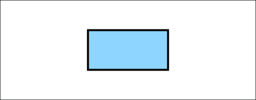

## 如何做...

按照以下步骤在画布上绘制一个简单的居中矩形：

1.  定义 2D 画布上下文：

```js
window.onload = function(){
    var canvas = document.getElementById("myCanvas");
    var context = canvas.getContext("2d");
```

1.  使用`rect()`方法绘制一个矩形，使用`fillStyle`属性设置填充颜色，然后使用`fill()`方法填充形状：

```js
    context.rect(canvas.width / 2 - 100, canvas.height / 2 - 50, 200, 100);
    context.fillStyle = "#8ED6FF";
    context.fill();
    context.lineWidth = 5;
    context.strokeStyle = "black";
    context.stroke();
};
```

1.  将画布标签嵌入 HTML 文档的主体中：

```js
<canvas id="myCanvas" width="600" height="250" style="border:1px solid black;">
</canvas>
```

## 它是如何工作的...

从前面的代码中可以看出，我们可以使用`rect()`方法来绘制一个简单的矩形：

```js
context.rect(x,y,width,height);
```

`rect()`方法在位置`x，y`处绘制一个矩形，并使用`width`和`height`定义其大小。在本示例中需要注意的另一件重要的事情是使用`fillStyle`和`fill()`。与`strokeStyle`和`stroke()`类似，我们可以使用`fillStyle`方法分配填充颜色，并使用`fill()`填充形状。

### 提示

请注意，我们在`stroke()`之前使用了`fill()`。如果我们在填充形状之前描边形状，填充样式实际上会覆盖描边样式的一半，有效地减半了使用`lineWidth`设置的线宽样式。因此，最好在使用`stroke()`之前使用`fill()`。

## 还有更多...

除了`rect()`方法，还有两种额外的方法可以用一行代码绘制矩形并应用样式，即`fillRect()`方法和`strokeRect()`方法。

### `fillRect()`方法

如果我们打算在使用`rect()`绘制矩形后填充它，我们可以考虑使用`fillRect()`方法同时绘制和填充矩形：

```js
context.fillRect(x,y,width,height);
```

`fillRect()`方法相当于使用`rect()`方法后跟`fill()`。在使用此方法时，您需要在调用它之前定义填充样式。

### `strokeRect()`方法

除了`fillRect()`方法，我们还可以使用`strokeRect()`方法一次绘制矩形并描边：

```js
context.strokeRect(x,y,width,height);
```

`strokeRect()`方法相当于使用`rect()`方法后跟`stroke()`。与`fillRect()`类似，您需要在调用此方法之前定义描边样式。

### 提示

不幸的是，HTML5 画布 API 不支持同时填充和描边矩形的方法。个人而言，我喜欢使用`rect()`方法，并根据需要使用`stroke()`和`fill()`应用描边样式和填充，因为这更符合自定义形状绘制的一致性。但是，如果您想要在使用这些简写方法之一时同时应用描边和填充矩形，最好使用`fillRect()`后跟`stroke()`。如果您使用`strokeRect()`后跟`fill()`，您会通过填充覆盖描边样式，使描边线宽减半。

## 另见...

+   在第五章中创建线性运动

+   在第六章中检测区域事件

+   在第七章中创建条形图

# 绘制一个圆

尽管 HTML5 画布 API 不支持圆形方法，但我们可以通过绘制完全封闭的弧线来创建一个圆。

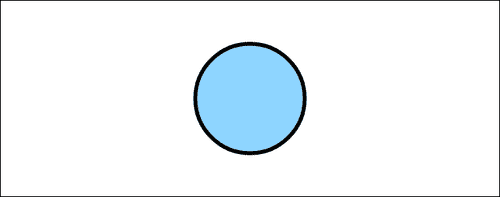

## 如何做...

按照以下步骤绘制一个居中在画布上的圆：

1.  定义一个 2D 画布上下文：

```js
window.onload = function(){
    var canvas = document.getElementById("myCanvas");
    var context = canvas.getContext("2d");
```

1.  使用`arc()`方法创建一个圆，使用`fillStyle`属性设置颜色填充，然后使用`fill()`方法填充形状：

```js
    context.arc(canvas.width / 2, canvas.height / 2, 70, 0, 2 * Math.PI, false);
    context.fillStyle = "#8ED6FF";
    context.fill();
    context.lineWidth = 5;
    context.strokeStyle = "black";
    context.stroke();
};
```

1.  将画布标签嵌入到 HTML 文档的主体中：

```js
<canvas id="myCanvas" width="600" height="250" style="border:1px solid black;">
</canvas>
```

## 工作原理...

正如您可能还记得的那样，我们可以使用`arc()`方法创建一个弧线，该方法绘制由起始角和结束角定义的圆的一部分。然而，如果我们将起始角和结束角之间的差定义为 360 度（2π），我们将有效地绘制了一个完整的圆：

```js
context.arc(centerX, centerY, radius, 0, 2 * Math.PI, false);
```

## 另请参阅...

+   使用循环创建图案：绘制齿轮

+   将圆形变换为椭圆在第四章中

+   在第五章中摆动钟摆

+   在第五章中模拟粒子物理

+   在第五章中制作动画时钟

+   在第六章中检测区域事件

+   在第七章中创建饼图

# 使用自定义形状和填充样式

在这个配方中，我们将绘制四个三角形，然后用不同的填充样式填充每一个。HTML5 画布 API 提供的填充样式包括颜色填充、线性渐变、径向渐变和图案。

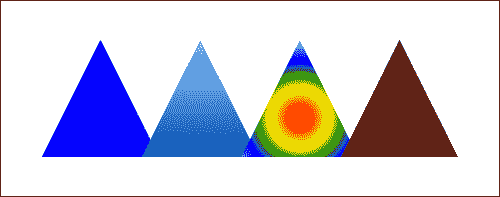

## 如何做...

按照以下步骤绘制四个三角形，一个用颜色填充，一个用线性渐变填充，一个用径向渐变填充，一个用图案填充：

1.  创建一个绘制三角形的简单函数：

```js
function drawTriangle(context, x, y, triangleWidth, triangleHeight, fillStyle){
    context.beginPath();
    context.moveTo(x, y);
    context.lineTo(x + triangleWidth / 2, y + triangleHeight);
    context.lineTo(x - triangleWidth / 2, y + triangleHeight);
    context.closePath();
    context.fillStyle = fillStyle;
    context.fill();
}
```

1.  定义一个 2D 画布上下文，并设置三角形的高度、宽度和 y 位置：

```js
window.onload = function(){
    var canvas = document.getElementById("myCanvas");
    var context = canvas.getContext("2d");

    var grd;
    var triangleWidth = 150;
    var triangleHeight = 150;
    var triangleY = canvas.height / 2 - triangleWidth / 2;
```

1.  使用颜色填充绘制三角形：

```js
    // color fill (left)
    drawTriangle(context, canvas.width * 1 / 5, triangleY, triangleWidth, triangleHeight, "blue");
```

1.  使用线性渐变填充绘制三角形：

```js
    // linear gradient fill (second from left)
    grd = context.createLinearGradient(canvas.width * 2 / 5, triangleY, canvas.width * 2 / 5, triangleY + triangleHeight);
    grd.addColorStop(0, "#8ED6FF"); // light blue
    grd.addColorStop(1, "#004CB3"); // dark blue
    drawTriangle(context, canvas.width * 2 / 5, triangleY, triangleWidth, triangleHeight, grd);
```

1.  使用径向渐变填充绘制三角形：

```js
    // radial gradient fill (second from right)
    var centerX = (canvas.width * 3 / 5 +
    (canvas.width * 3 / 5 - triangleWidth / 2) +
    (canvas.width * 3 / 5 + triangleWidth / 2)) / 3;

    var centerY = (triangleY +
    (triangleY + triangleHeight) +
    (triangleY + triangleHeight)) / 3;

    grd = context.createRadialGradient(centerX, centerY, 10, centerX, centerY, 100);
    grd.addColorStop(0, "red");
    grd.addColorStop(0.17, "orange");
    grd.addColorStop(0.33, "yellow");
    grd.addColorStop(0.5, "green");
    grd.addColorStop(0.666, "blue");
    grd.addColorStop(1, "violet");
    drawTriangle(context, canvas.width * 3 / 5, triangleY, triangleWidth, triangleHeight, grd);
```

1.  使用图案填充绘制三角形：

```js
    // pattern fill (right)
    var imageObj = new Image();
    imageObj.onload = function(){
        var pattern = context.createPattern(imageObj, "repeat");
        drawTriangle(context, canvas.width * 4 / 5, triangleY, triangleWidth, triangleHeight, pattern);
    };
    imageObj.src = "wood-pattern.png";
}; 
```

1.  将画布标签嵌入到 HTML 文档的主体中：

```js
<canvas id="myCanvas" width="600" height="250" style="border:1px solid black;">
</canvas>
```

## 工作原理...

正如您可能还记得的那样，我们可以使用`beginPath()`方法开始一个新路径，使用`moveTo()`放置我们的绘图光标，然后绘制连续的子路径以形成路径。我们可以通过使用画布上下文的`closePath()`方法来关闭路径，从而创建一个形状：

```js
context.closePath();
```

这种方法基本上告诉画布上下文通过连接路径中的最后一个点和路径的起点来完成当前路径。

在`drawTriangle()`方法中，我们可以使用`beginPath()`开始一个新路径，使用`moveTo()`定位绘图光标，使用`lineTo()`绘制三角形的两条边，然后使用`closePath()`完成三角形的第三条边。

从上面的截图中可以看出，从左边数第二个三角形是用线性渐变填充的。线性渐变可以使用画布上下文的`createLinearGradient()`方法创建，该方法由起点和终点定义：

```js
var grd=context.createLinearGradient(startX,startY,endX,endY);
```

接下来，我们可以使用`addColorStop()`方法设置渐变的颜色，该方法在 0 到 1 的渐变线偏移位置处分配颜色值：

```js
grd.addColorStop(offset,color);
```

偏移值为 0 的颜色将位于线性渐变的起点，偏移值为 1 的颜色将位于线性渐变的终点。在这个例子中，我们将浅蓝色放在三角形的顶部，深蓝色放在三角形的底部。

接下来，让我们来介绍径向渐变。右侧的第二个三角形填充有一个由六种不同颜色组成的径向渐变。可以使用画布上下文的`createRadialGradient()`方法创建径向渐变，该方法需要一个起点、起始半径、终点和终点半径：

```js
var grd=context.createRadialGradient(startX,startY,
   startRadius,endX,endY,endRadius);
```

径向渐变由两个虚拟圆定义。第一个虚拟圆由`startX`，`startY`和`startRadius`定义。第二个虚拟圆由`endX`，`endY`和`endRadius`定义。与线性渐变类似，我们可以使用画布上下文的`addColorStop()`方法沿径向渐变线位置颜色。

最后，HTML5 画布 API 提供的第四种填充样式是图案。我们可以使用画布上下文的`createPattern()`方法创建一个`pattern`对象，该方法需要一个`image`对象和一个重复选项：

```js
var pattern=context.createPattern(imageObj, repeatOption);
```

`repeatOption`可以选择四个选项之一，`repeat`，`repeat-x`，`repeat-y`和`no-repeat`。除非另有说明，否则`repeatOption`默认为`repeat`。我们将在第三章中更深入地介绍图像，*使用图像和视频*。

## 另请参阅...

+   *将所有内容放在一起：绘制一架喷气机*

# 贝塞尔曲线的乐趣：绘制一朵云

在这个示例中，我们将学习如何通过连接一系列贝塞尔曲线子路径来绘制自定义形状，从而创建一朵蓬松的云。

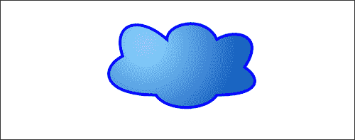

## 如何做...

按照以下步骤在画布中心绘制一朵蓬松的云：

1.  定义一个 2D 画布上下文：

```js
window.onload = function(){
    var canvas = document.getElementById("myCanvas");
    var context = canvas.getContext("2d");
```

1.  通过连接六个贝塞尔曲线来绘制一朵云：

```js
    var startX = 200;
    var startY = 100;

  // draw cloud shape
    context.beginPath(); 
    context.moveTo(startX, startY);
    context.bezierCurveTo(startX - 40, startY + 20, startX - 40, startY + 70, startX + 60, startY + 70);
    context.bezierCurveTo(startX + 80, startY + 100, startX + 150, startY + 100, startX + 170, startY + 70);
    context.bezierCurveTo(startX + 250, startY + 70, startX + 250, startY + 40, startX + 220, startY + 20);
    context.bezierCurveTo(startX + 260, startY - 40, startX + 200, startY - 50, startX + 170, startY - 30);
    context.bezierCurveTo(startX + 150, startY - 75, startX + 80, startY - 60, startX + 80, startY - 30);
    context.bezierCurveTo(startX + 30, startY - 75, startX - 20, startY - 60, startX, startY);
    context.closePath();
```

1.  使用`createRadialGradient()`方法定义一个径向渐变并填充形状：

```js
  //add a radial gradient
    var grdCenterX = 260;
    var grdCenterY = 80;
    var grd = context.createRadialGradient(grdCenterX, grdCenterY, 10, grdCenterX, grdCenterY, 200);
    grd.addColorStop(0, "#8ED6FF"); // light blue
    grd.addColorStop(1, "#004CB3"); // dark blue
    context.fillStyle = grd;
    context.fill();
```

1.  设置线宽并描绘云：

```js
  // set the line width and stroke color
    context.lineWidth = 5;
    context.strokeStyle = "#0000ff";
    context.stroke();
};
```

1.  将画布标签嵌入 HTML 文档的主体中：

```js
<canvas id="myCanvas" width="600" height="250" style="border:1px solid black;"> 
</canvas>
```

## 它是如何工作的...

使用 HTML5 画布 API 绘制一朵蓬松的云，可以连接多个贝塞尔曲线以形成云形的周边。为了营造一个球形表面的幻觉，我们可以使用`createRadialGradient()`方法创建径向渐变，使用`addColorStop()`方法设置渐变颜色和偏移，使用`fillStyle`设置径向渐变为填充样式，然后使用`fill()`应用渐变。

# 绘制透明形状

对于需要形状分层的应用程序，通常希望使用透明度。在这个示例中，我们将学习如何使用全局 alpha 合成来设置形状的透明度。

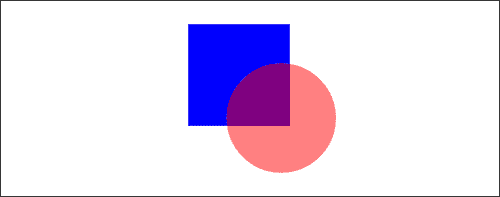

## 如何做...

按照以下步骤在不透明正方形上方绘制一个透明圆：

1.  定义一个 2D 画布上下文：

```js
window.onload = function(){
    var canvas = document.getElementById("myCanvas");
    var context = canvas.getContext("2d");
```

1.  绘制一个矩形：

```js
    // draw rectangle
    context.beginPath();
    context.rect(240, 30, 130, 130);
    context.fillStyle = "blue";
    context.fill();
```

1.  使用`globalAlpha`属性设置画布的全局 alpha，并绘制一个圆：

```js
    // draw circle
    context.globalAlpha = 0.5; // set global alpha
    context.beginPath();
    context.arc(359, 150, 70, 0, 2 * Math.PI, false);
    context.fillStyle = "red";
    context.fill();
}; 
```

1.  将画布标签嵌入 HTML 文档的主体中：

```js
<canvas id="myCanvas" width="600" height="250" style="border:1px solid black;">
</canvas>
```

## 它是如何工作的...

使用 HTML5 画布 API 设置形状的不透明度，可以使用`globalAlpha`属性：

```js
context.globalAlpha=[value]
```

`globalAlpha`属性接受 0 到 1 之间的任何实数。我们可以将`globalAlpha`属性设置为`1`，使形状完全不透明，也可以将`globalAlpha`属性设置为`0`，使形状完全透明。

# 使用上下文状态堆栈来保存和恢复样式

在创建更复杂的 HTML5 画布应用程序时，您会发现自己需要一种方法来恢复到以前的样式组合，这样您就不必在绘图过程的不同点设置和重置几十种样式属性。幸运的是，HTML5 画布 API 为我们提供了访问上下文状态堆栈的方式，允许我们保存和恢复上下文状态。在这个示例中，我们将演示状态堆栈是如何工作的，通过保存上下文状态，设置全局 alpha，绘制一个透明圆，将状态堆栈恢复到设置全局 alpha 之前的状态，然后绘制一个不透明的正方形。让我们来看看！

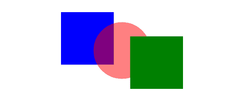

## 准备好了...

在我们讨论画布状态堆栈之前，您必须了解堆栈数据结构的工作原理（如果您已经了解，可以跳到*它是如何工作*部分）。

堆栈数据结构是一种后进先出（LIFO）结构。堆栈有三个主要操作-**push**，**pop**和**stack top**。当一个元素被推送到堆栈上时，它被添加到堆栈的顶部。当堆栈被弹出时，顶部元素被从堆栈中移除。*stack top*操作简单地返回堆栈顶部的元素。

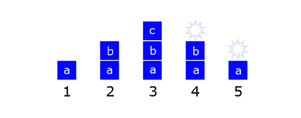

看一下前面的图表，它代表了在多个操作中堆栈的状态。在步骤 1 中，我们开始时有一个包含一个元素“a”的堆栈。在步骤 2 中，“b”元素被推送到堆栈上。在步骤 3 中，“c”元素被推送到堆栈上。在步骤 4 中，我们弹出堆栈，这将移除最后推送到堆栈上的元素。由于元素“c”位于堆栈顶部，因此它被移除。在步骤 5 中，我们再次弹出堆栈，这将移除最后推送到堆栈上的元素。由于元素“b”位于堆栈顶部，因此它被移除。

正如我们将在下一节中看到的，堆栈是一个很好的数据结构，用于保存随时间变化的状态，然后通过弹出堆栈来恢复它们。

## 如何做...

按照以下步骤在透明圆上绘制一个不透明的正方形：

1.  定义一个 2D 画布上下文：

```js
window.onload = function(){
    var canvas = document.getElementById("myCanvas");
    var context = canvas.getContext("2d");
```

1.  画一个矩形：

```js
    // draw rectangle
    context.beginPath();
    context.rect(150, 30, 130, 130);
    context.fillStyle = "blue";
    context.fill();
```

1.  使用`save()`保存上下文状态，使用`globalAlpha`属性设置画布的全局 alpha，绘制一个圆，然后使用`restore()`恢复画布状态：

```js
    // wrap circle drawing code with save-restore combination
    context.save();
    context.globalAlpha = 0.5; // set global alpha
    context.beginPath();
    context.arc(canvas.width / 2, canvas.height / 2, 70, 0, 2 * Math.PI, false);
    context.fillStyle = "red";
    context.fill();
    context.restore();
```

1.  绘制另一个矩形（将是不透明的），以显示上下文状态已恢复到设置全局 alpha 属性之前的状态：

```js
    // draw another rectangle
    context.beginPath();
    context.rect(canvas.width - (150 + 130), canvas.height - (30 + 130), 130, 130);
    context.fillStyle = "green";
    context.fill();
};
```

1.  将 canvas 标签嵌入到 HTML 文档的 body 中：

```js
<canvas id="myCanvas" width="600" height="250" style="border:1px solid black;">
</canvas>

```

## 它是如何工作...

如您在前面的代码中所见，通过将圆形绘制代码包装在 save-restore 组合中，我们实质上是在`save()`方法和`restore()`方法之间封装了我们使用的任何样式，以便它们不会影响之后绘制的形状。可以将 save-restore 组合视为一种引入样式作用域的方式，类似于函数在 JavaScript 中引入变量作用域的方式。尽管您可能会说“嗯，这听起来像是一个复杂的方法来将 globalAlpha 设置回 1！” 等一下伙计。在现实世界中，您通常会处理大量不同的样式组合，用于代码的不同部分。在这种情况下，save-restore 组合是救命稻草。在没有 save-restore 组合的情况下编写复杂的 HTML5 画布应用程序，就像使用全局变量在一个大的 JavaScript 代码块中构建复杂的 Web 应用程序一样。天啊！

## 还有更多...

在第四章中，我们将看到*掌握变换*，状态堆栈的另一个常见用法是保存和恢复变换状态。

## 另请参阅...

+   *使用状态堆栈处理多个变换*在第四章中

# 使用复合操作进行工作

在这个示例中，我们将通过创建每种变化的表格来探索复合操作。复合操作对于创建复杂形状、在其他形状下面绘制形状而不是在其上面以及创建其他有趣的效果非常有用。

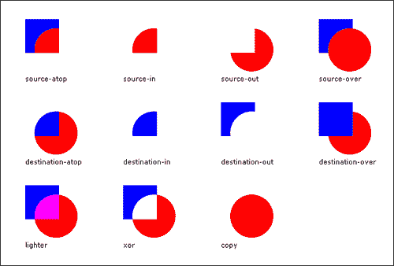

## 准备好了...

以下是 HTML5 画布 API 中可用的每种可能的复合操作的描述，其中红色圆表示源（S），蓝色正方形表示目标（D）。为了进一步加深对复合操作的理解，在阅读每个描述时，有助于查看相应的操作：

| 操作 | 描述 |
| --- | --- |
| `source-atop` (S atop D) | 在两个图像都不透明的地方显示源图像。在目标图像不透明但源图像透明的地方显示目标图像。在其他地方显示透明度。 |
| `source-in` (S in D) | 在源图像和目标图像都不透明的地方显示源图像。在其他地方显示透明度。 |
| `source-out` (S out D) | 在源图像不透明且目标图像透明的地方显示源图像。在其他地方显示透明度。 |
| `source-over` (S over D, default) | 在源图像不透明的地方显示源图像。在其他地方显示目标图像。 |
| `destination-atop` (S atop D) | 在两个图像都不透明的地方显示目标图像。在源图像不透明但目标图像透明的地方显示源图像。在其他地方显示透明度。 |
| `destination-in` (S in D) | 在目标图像和源图像都不透明的地方显示目标图像。在其他地方显示透明度。 |
| `destination -out` (S out D) | 在目标图像不透明且源图像透明的地方显示目标图像。在其他地方显示透明度。 |
| `destination -over` (S over D) | 在目标图像不透明的地方显示目标图像。在其他地方显示目标图像。 |
| `lighter` (S plus D) | 显示源图像和目标图像的总和。 |
| `xor` (S xor D) | 源图像和目标图像的异或。 |
| `copy` (D is ignored) | 显示源图像而不是目标图像。 |

在撰写本文时，处理复合操作相当棘手，因为五个主要浏览器——Chrome、Firefox、Safari、Opera 和 IE9——对复合操作的处理方式不同。与其向您展示当前支持的复合操作的图表，您应该上网搜索类似"canvas composite operation support by browser"的内容，以查看每个浏览器当前的支持情况，如果您打算使用它们。

## 如何做...

按照以下步骤创建复合操作的实时表格：

1.  为画布和文本显示定义样式：

```js
/* select the div child element of the body */
body > div {
    width: 680px;
    height: 430px;
    border: 1px solid black;
    float: left;
    overflow: hidden;
}

canvas {
    float: left;
    margin-top: 30px;
}

div {
    font-size: 11px;
    font-family: verdana;
    height: 15px;
    float: left;
  width: 160px;
}

/* select the 1st, 5th, and 9th label div */
body > div > div:nth-of-type(4n+1) {
    margin-left: 40px;
}
```

1.  定义每个正方形和圆的大小和相对距离：

```js
window.onload = function(){
    var squareWidth = 55;
    var circleRadius = 35;
    var rectCircleDistX = 50;
    var rectCircleDistY = 50;
```

1.  构建一个复合操作的数组：

```js
    // define an array of composite operations
    var operationArray = [];
    operationArray.push("source-atop"); // 0
    operationArray.push("source-in"); // 1
    operationArray.push("source-out"); // 2
    operationArray.push("source-over"); // 3
    operationArray.push("destination-atop"); // 4
    operationArray.push("destination-in"); // 5
    operationArray.push("destination-out"); // 6
    operationArray.push("destination-over"); // 7
    operationArray.push("lighter"); // 8
    operationArray.push("xor"); // 9
    operationArray.push("copy"); // 10
```

1.  执行每个操作并在相应的画布上绘制结果：

```js
    // draw each of the eleven operations
    for (var n = 0; n < operationArray.length; n++) {
        var thisOperation = operationArray[n];
        var canvas = document.getElementById(thisOperation);
        var context = canvas.getContext("2d");

        // draw rectangle
        context.beginPath();
        context.rect(40, 0, squareWidth, squareWidth);
        context.fillStyle = "blue";
        context.fill();

        // set the global composite operation
        context.globalCompositeOperation = thisOperation;

        // draw circle
        context.beginPath();
        context.arc(40 + rectCircleDistX, rectCircleDistY, circleRadius, 0, 2 * Math.PI, false);
        context.fillStyle = "red";
        context.fill();
    }
};
```

1.  在 HTML 文档的主体中嵌入每个操作的画布标签：

```js
<body>
    <div>
        <canvas id="source-atop" width="160" height="90">
        </canvas>
        <canvas id="source-in" width="160" height="90">
        </canvas>
        <canvas id="source-out" width="160" height="90">
        </canvas>
        <canvas id="source-over" width="160" height="90">
        </canvas>
        <div>
            source-atop
        </div>
        <div>
            source-in
        </div>
        <div>
            source-out
        </div>
        <div>
            source-over
        </div>
        <canvas id="destination-atop" width="160" height="90">
        </canvas>
        <canvas id="destination-in" width="160" height="90">
        </canvas>
        <canvas id="destination-out" width="160" height="90">
        </canvas>
        <canvas id="destination-over" width="160" height="90">
        </canvas>
        <div>
            destination-atop
        </div>
        <div>
            destination-in
        </div>
        <div>
            destination-out
        </div>
        <div>
            destination-over
        </div>
        <canvas id="lighter" width="160" height="90">
        </canvas>
        <canvas id="xor" width="160" height="90">
        </canvas>
        <canvas id="copy" width="160" height="90">
        </canvas>
        <canvas width="160" height="90">
        </canvas>
        <div>
            lighter
        </div>
        <div>
            xor
        </div>
        <div>
            copy
        </div>
    </div>
</body>

```

## 它是如何工作的...

我们可以使用画布上下文的`globalCompositeOperation`属性来设置复合操作：

```js
context.globalCompositeOperation=[value];
```

`globalCompositeOperaton`属性接受十一个值之一，包括`source-atop`，`source-in`，`source-out`，`source-over`，`destination-atop`，`destination-in`，`destination-out`，`destination-over`，`lighter`，`xor`和`copy`。`Source`指的是操作后在画布上绘制的所有内容，`destination`指的是操作前在画布上绘制的所有内容。除非另有规定，默认的复合操作设置为`source-over`，这基本上意味着每次在画布上绘制东西时，它都会绘制在已经存在的东西的顶部。

我们可以为每个复合操作创建一个数组，然后循环遍历每个数组，将结果绘制到相应的画布上。对于每次迭代，我们可以绘制一个正方形，设置复合操作，然后绘制一个圆。

# 使用循环创建图案：绘制齿轮

在这个食谱中，我们将通过迭代绘制径向锯齿来创建一个机械齿轮，然后绘制圆来形成齿轮的主体。


## 如何做...

按照以下步骤在画布中心绘制齿轮：

1.  定义 2D 画布上下文并设置齿轮属性：

```js
window.onload = function(){
    var canvas = document.getElementById("myCanvas");
    var context = canvas.getContext("2d");

    // gear position
    var centerX = canvas.width / 2;
    var centerY = canvas.height / 2;

  // radius of the teeth tips
    var outerRadius = 95;

  // radius of the teeth intersections
    var innerRadius = 50;

  // radius of the gear without the teeth
    var midRadius = innerRadius * 1.6;

  // radius of the hole
    var holeRadius = 10;

  // num points is the number of points that are required
  // to make the gear teeth.  The number of teeth on the gear
  // are equal to half of the number of points.  In this recipe,
  // we will use 50 points which corresponds to 25 gear teeth.
    var numPoints = 50;
```

1.  绘制齿轮齿：

```js

    // draw gear teeth
    context.beginPath();
  // we can set the lineJoinproperty to bevel so that the tips
  // of the gear teeth are flat and don't come to a sharp point
    context.lineJoin = "bevel";

  // loop through the number of points to create the gear shape
    for (var n = 0; n < numPoints; n++) {
        var radius = null;

    // draw tip of teeth on even iterations
        if (n % 2 == 0) {
            radius = outerRadius;
        }
    // draw teeth connection which lies somewhere between
    // the gear center and gear radius
        else {
            radius = innerRadius;
        }

        var theta = ((Math.PI * 2) / numPoints) * (n + 1);
        var x = (radius * Math.sin(theta)) + centerX;
        var y = (radius * Math.cos(theta)) + centerY;

    // if first iteration, use moveTo() to position
    // the drawing cursor
        if (n == 0) {
            context.moveTo(x, y);
        }
    // if any other iteration, use lineTo() to connect sub paths
        else {
            context.lineTo(x, y);
        }
    }

    context.closePath();

  // define the line width and stroke color
    context.lineWidth = 5;
    context.strokeStyle = "#004CB3";
    context.stroke();
```

1.  绘制齿轮主体：

```js
    // draw gear body
    context.beginPath();
    context.arc(centerX, centerY, midRadius, 0, 2 * Math.PI, false);

  // create a linear gradient
    var grd = context.createLinearGradient(230, 0, 370, 200);
    grd.addColorStop(0, "#8ED6FF"); // light blue
    grd.addColorStop(1, "#004CB3"); // dark blue
    context.fillStyle = grd;
    context.fill();
    context.lineWidth = 5;
    context.strokeStyle = "#004CB3";
    context.stroke();
```

1.  绘制齿轮孔：

```js
    // draw gear hole
    context.beginPath();
    context.arc(centerX, centerY, holeRadius, 0, 2 * Math.PI, false);
    context.fillStyle = "white";
    context.fill();
    context.strokeStyle = "#004CB3";
    context.stroke();
};
```

1.  将画布标签嵌入 HTML 文档的主体中：

```js
<canvas id="myCanvas" width="600" height="250" style="border:1px solid black;">
</canvas>
```

## 它是如何工作的...

要在 HTML5 画布上绘制齿轮，我们可以从齿轮周围绘制齿。绘制齿轮的一种方法是使用倒角线连接绘制径向锯齿图案。径向锯齿的一个很好的例子是星星，它沿着想象的内圆有五个点，沿着想象的外圆有五个点。要创建一个星星，我们可以设置一个循环，进行 10 次迭代，每个点进行一次迭代。对于偶数次迭代，我们可以沿着外圆绘制一个点，对于奇数次迭代，我们可以沿着内圆绘制一个点。由于我们的星星有 10 个点，每个点之间的间隔为（2π / 10）弧度。

您可能会问自己“星星与齿轮齿有什么关系？”如果我们将这种逻辑扩展到绘制 50 个点的锯齿形状而不是 10 个点，我们将有效地创建了一个具有 25 个楔形齿的齿轮。

一旦处理了齿轮齿，我们可以绘制一个圆，并使用“createLinearGradient（）”方法应用线性渐变，然后为齿轮的孔绘制一个较小的圆。

## 另请参阅...

+   *在第五章中制作机械齿轮*

# 随机化形状属性：绘制一片花海

在这个食谱中，我们将通过创建一片色彩缤纷的花海来拥抱我们内心的嬉皮士。

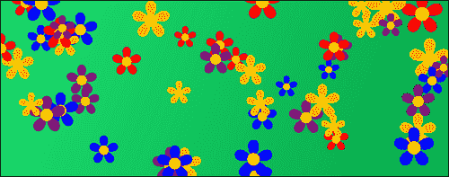

## 如何做...

按照以下步骤在整个画布上绘制随机花朵：

1.  定义`Flower`对象的构造函数：

```js
// define Flower constructor
function Flower(context, centerX, centerY, radius, numPetals, color){
    this.context = context;
    this.centerX = centerX;
    this.centerY = centerY;
    this.radius = radius;
    this.numPetals = numPetals;
    this.color = color;
}
```

1.  定义一个`Flower`对象的`draw`方法，该方法使用`for`循环创建花瓣，然后绘制一个黄色中心：

```js
// Define Flower draw method
Flower.prototype.draw = function(){
    var context = this.context;
    context.beginPath();

    // draw petals
    for (var n = 0; n < this.numPetals; n++) {
        var theta1 = ((Math.PI * 2) / this.numPetals) * (n + 1);
        var theta2 = ((Math.PI * 2) / this.numPetals) * (n);

        var x1 = (this.radius * Math.sin(theta1)) + this.centerX;
        var y1 = (this.radius * Math.cos(theta1)) + this.centerY;
        var x2 = (this.radius * Math.sin(theta2)) + this.centerX;
        var y2 = (this.radius * Math.cos(theta2)) + this.centerY;

        context.moveTo(this.centerX, this.centerY);
        context.bezierCurveTo(x1, y1, x2, y2, this.centerX, this.centerY);
    }

    context.closePath();
    context.fillStyle = this.color;
    context.fill();

    // draw yellow center
    context.beginPath();
    context.arc(this.centerX, this.centerY, this.radius / 5, 0, 2 * Math.PI, false);
    context.fillStyle = "yellow";
    context.fill();
};
```

1.  设置 2D 画布上下文：

```js
window.onload = function(){
    var canvas = document.getElementById("myCanvas");
    var context = canvas.getContext("2d");
```

1.  为背景创建绿色渐变：

```js
    // create a green gradation for background
    context.beginPath();
    context.rect(0, 0, canvas.width, canvas.height);
    var grd = context.createLinearGradient(0, 0, canvas.width, canvas.height);
    grd.addColorStop(0, "#1EDE70"); // light green
    grd.addColorStop(1, "#00A747"); // dark green
    context.fillStyle = grd;
    context.fill();
```

1.  创建一个花色数组：

```js
    // define an array of colors
    var colorArray = [];
    colorArray.push("red"); // 0
    colorArray.push("orange"); // 1
    colorArray.push("blue"); // 2
    colorArray.push("purple"); // 3
```

1.  创建一个生成具有随机位置、大小和颜色的花朵的循环：

```js
    // define number of flowers
    var numFlowers = 50;

    // draw randomly placed flowers
    for (var n = 0; n < numFlowers; n++) {
        var centerX = Math.random() * canvas.width;
        var centerY = Math.random() * canvas.height;
        var radius = (Math.random() * 25) + 25;
        var colorIndex = Math.round(Math.random() * (colorArray.length - 1));

        var thisFlower = new Flower(context, centerX, centerY, radius, 5, colorArray[colorIndex]);
        thisFlower.draw();
    }
};
```

1.  将画布标签嵌入 HTML 文档的主体中：

```js
<canvas id="myCanvas" width="600" height="250" style="border:1px solid black;">
</canvas>
```

## 它是如何工作的...

这个食谱主要是关于随机化对象属性并使用 HTML5 画布在屏幕上绘制结果。其想法是创建一堆具有不同位置、大小和颜色的花朵。

为了帮助我们创建一片花海，创建一个`Flower`类非常有用，该类定义了花的属性和绘制花的方法。对于这个食谱，我保持了花瓣数量恒定，尽管您可以自行尝试每朵花的花瓣数量不同。

绘制一朵花实际上与我们以前的食谱“使用循环创建图案：绘制齿轮”非常相似，只是这一次，我们将在圆周围绘制花瓣，而不是锯齿。我发现使用 HTML5 画布绘制花瓣的最简单方法是绘制贝塞尔曲线，其起点连接到终点。贝塞尔曲线的起点和终点在花的中心，控制点在`Flower`类的“draw（）”方法中的每次迭代中定义。

一旦我们的`Flower`类设置好并准备就绪，我们可以创建一个循环，每次迭代都实例化随机的`Flower`对象，然后用“draw（）”方法渲染它们。

如果你自己尝试这个教程，你会发现每次刷新屏幕时花朵完全是随机的。

# 创建自定义形状函数：纸牌花色

如果皇家同花顺让你的肾上腺素飙升，那么这个教程适合你。在这个教程中，我们将为黑桃、红心、梅花和方块花色创建绘图函数。

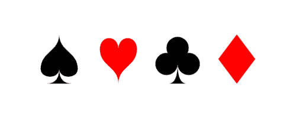

## 如何做…

按照以下步骤绘制黑桃、红心、梅花和方块花色：

1.  定义 drawSpade()函数，使用四条贝塞尔曲线、两条二次曲线和一条直线绘制黑桃：

```js
function drawSpade(context, x, y, width, height){
    context.save();
    var bottomWidth = width * 0.7;
    var topHeight = height * 0.7;
    var bottomHeight = height * 0.3;

    context.beginPath();
    context.moveTo(x, y);

    // top left of spade          
    context.bezierCurveTo(
        x, y + topHeight / 2, // control point 1
        x - width / 2, y + topHeight / 2, // control point 2
        x - width / 2, y + topHeight // end point
    );

    // bottom left of spade
    context.bezierCurveTo(
        x - width / 2, y + topHeight * 1.3, // control point 1
        x, y + topHeight * 1.3, // control point 2
        x, y + topHeight // end point
    );

    // bottom right of spade
    context.bezierCurveTo(
        x, y + topHeight * 1.3, // control point 1
        x + width / 2, y + topHeight * 1.3, // control point 2
        x + width / 2, y + topHeight // end point
    );

    // top right of spade
    context.bezierCurveTo(
        x + width / 2, y + topHeight / 2, // control point 1
        x, y + topHeight / 2, // control point 2
        x, y // end point
    );

    context.closePath();
    context.fill();

    // bottom of spade
    context.beginPath();
    context.moveTo(x, y + topHeight);
    context.quadraticCurveTo(
        x, y + topHeight + bottomHeight, // control point
        x - bottomWidth / 2, y + topHeight + bottomHeight // end point
    );
    context.lineTo(x + bottomWidth / 2, y + topHeight + bottomHeight);
    context.quadraticCurveTo(
        x, y + topHeight + bottomHeight, // control point
        x, y + topHeight // end point
    );
    context.closePath();
    context.fillStyle = "black";
    context.fill();
    context.restore();
}
```

1.  定义 drawHeart()函数，使用四条贝塞尔曲线绘制心形：

```js
function drawHeart(context, x, y, width, height){
    context.save();
    context.beginPath();
    var topCurveHeight = height * 0.3;
    context.moveTo(x, y + topCurveHeight);
    // top left curve
    context.bezierCurveTo(
        x, y, 
        x - width / 2, y, 
        x - width / 2, y + topCurveHeight
    );

    // bottom left curve
    context.bezierCurveTo(
        x - width / 2, y + (height + topCurveHeight) / 2, 
        x, y + (height + topCurveHeight) / 2, 
        x, y + height
    );

    // bottom right curve
    context.bezierCurveTo(
        x, y + (height + topCurveHeight) / 2, 
        x + width / 2, y + (height + topCurveHeight) / 2, 
        x + width / 2, y + topCurveHeight
    );

    // top right curve
    context.bezierCurveTo(
        x + width / 2, y, 
        x, y, 
        x, y + topCurveHeight
    );

    context.closePath();
    context.fillStyle = "red";
    context.fill();
    context.restore();
}
```

1.  定义 drawClub()函数，使用四个圆形、两条二次曲线和一条直线绘制梅花：

```js
function drawClub(context, x, y, width, height){
    context.save();
    var circleRadius = width * 0.3;
    var bottomWidth = width * 0.5;
    var bottomHeight = height * 0.35;
    context.fillStyle = "black";

    // top circle
    context.beginPath();
    context.arc(
        x, y + circleRadius + (height * 0.05), 
        circleRadius, 0, 2 * Math.PI, false
    );
    context.fill();

    // bottom right circle
    context.beginPath();
    context.arc(
        x + circleRadius, y + (height * 0.6), 
        circleRadius, 0, 2 * Math.PI, false
    );
    context.fill();

    // bottom left circle
    context.beginPath();
    context.arc(
        x - circleRadius, y + (height * 0.6), 
        circleRadius, 0, 2 * Math.PI, false
    );
    context.fill();

    // center filler circle
    context.beginPath();
    context.arc(
        x, y + (height * 0.5), 
        circleRadius / 2, 0, 2 * Math.PI, false
    );
    context.fill();

    // bottom of club
    context.moveTo(x, y + (height * 0.6));
    context.quadraticCurveTo(
        x, y + height, 
        x - bottomWidth / 2, y + height
    );
    context.lineTo(x + bottomWidth / 2, y + height);
    context.quadraticCurveTo(
        x, y + height, 
        x, y + (height * 0.6)
    );
    context.closePath();
    context.fill();
    context.restore();
}
```

1.  定义 drawDiamond()函数，使用四条直线绘制菱形：

```js
function drawDiamond(context, x, y, width, height){
    context.save();
    context.beginPath();
    context.moveTo(x, y);

    // top left edge
    context.lineTo(x - width / 2, y + height / 2);

    // bottom left edge
    context.lineTo(x, y + height);

    // bottom right edge
    context.lineTo(x + width / 2, y + height / 2);

    // closing the path automatically creates
    // the top right edge
    context.closePath();

    context.fillStyle = "red";
    context.fill();
    context.restore();
}
```

1.  页面加载时，定义画布上下文，然后使用四个绘图函数来渲染黑桃、红心、梅花和方块：

```js
window.onload = function(){
    var canvas = document.getElementById("myCanvas");
    var context = canvas.getContext("2d");

    drawSpade(context, canvas.width * 0.2, 70, 75, 100);
    drawHeart(context, canvas.width * 0.4, 70, 75, 100);
    drawClub(context, canvas.width * 0.6, 70, 75, 100);
    drawDiamond(context, canvas.width * 0.8, 70, 75, 100);
};
```

1.  在 HTML 文档的 body 内嵌入 canvas 标签：

```js
<canvas id="myCanvas" width="600" height="250" style="border:1px solid black;">
</canvas>
```

## 它是如何工作的…

这个教程演示了如何通过组合 HTML5 画布提供的四种主要子路径类型：直线、圆弧、二次曲线和贝塞尔曲线来绘制任何形状。

要绘制黑桃，我们可以连接四条贝塞尔曲线形成顶部部分，然后使用两条二次曲线和一条直线形成底部部分。要绘制红心，我们可以以与黑桃相同的方式连接四条贝塞尔曲线，只是形状的顶点在底部而不是顶部。要创建梅花，我们可以使用圆弧绘制三个圆形作为顶部部分，与黑桃类似，我们可以使用两条二次曲线和一条直线来形成底部部分。最后，要绘制方块，我们可以简单地连接四条直线。

# 将所有内容放在一起：绘制飞机

在这个教程中，我们将通过使用线条、曲线、形状、颜色、线性渐变和径向渐变来推动 HTML5 画布绘图 API 的极限，绘制出矢量飞机。

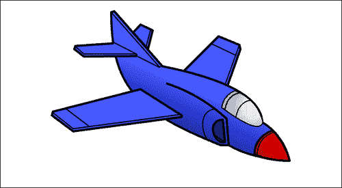

## 如何做…

按照以下步骤绘制矢量飞机：

1.  定义一个 2D 画布上下文，并设置线连接样式：

```js
window.onload = function(){
    var canvas = document.getElementById("myCanvas");
    var context = canvas.getContext("2d");
  var grd;

    context.lineJoin = "round";
```

1.  绘制右尾翼：

```js
    // outline right tail wing
    context.beginPath();
    context.moveTo(248, 60); //13
    context.lineTo(262, 45); // 12
    context.lineTo(285, 56); //11
    context.lineTo(284, 59); // 10
    context.lineTo(276, 91); // 9
    context.closePath();
    context.fillStyle = "#495AFE";
    context.fill();
    context.lineWidth = 4;
    context.stroke();

    // right tail wing detail
    context.beginPath();
    context.moveTo(281, 54); // 10
    context.lineTo(273, 84); // 9
    context.closePath();
    context.lineWidth = 2;
    context.stroke();
```

1.  绘制右翼：

```js
    // outline right wing
    context.beginPath();
    context.moveTo(425, 159);
    context.lineTo(449, 91); // 4
    context.lineTo(447, 83); // 5
    context.lineTo(408, 67); // 6
    context.lineTo(343, 132); // 7
    context.fillStyle = "#495AFE";
    context.fill();
    context.lineWidth = 4;
    context.stroke();

    // right wing detail
    context.beginPath();
    context.moveTo(420, 158);
    context.lineTo(447, 83); // 4
    context.lineWidth = 2;
    context.stroke();

    context.beginPath();
    context.moveTo(439, 102);
    context.lineTo(395, 81);
    context.lineWidth = 2;
    context.stroke();
```

1.  绘制机身和尾部顶部：

```js
    // outline body
    context.beginPath();
    context.moveTo(541, 300); // 1
    context.quadraticCurveTo(529, 252, 490, 228); // 2
    context.quadraticCurveTo(487, 160, 303, 123); // 3

    // outline tail
    context.lineTo(213, 20); // 14
    context.lineTo(207, 22); // 15
    context.bezierCurveTo(208, 164, 255, 207, 412, 271); // 27
    context.lineTo(427, 271); // 28
    context.quadraticCurveTo(470, 296, 541, 300); // 1
    context.closePath();
    grd = context.createLinearGradient(304, 246, 345, 155);
    grd.addColorStop(0, "#000E91"); // dark blue
    grd.addColorStop(1, "#495AFE"); // light blue
    context.fillStyle = grd;
    context.fill();
    context.lineWidth = 4;
    context.stroke();

    // tail detail
    context.beginPath();
    context.moveTo(297, 124);
    context.lineTo(207, 22);
    context.lineWidth = 2;
    context.stroke();
```

1.  绘制左尾翼：

```js
    // outline left tail wing
    context.beginPath();
    context.moveTo(303, 121); // 8
    context.lineTo(297, 125); // 8
    context.lineTo(255, 104);
    context.lineWidth = 2;
    context.stroke();

    context.beginPath();
    context.moveTo(212, 80);
    context.lineTo(140, 85); // 18
    context.lineTo(138, 91); // 19
    context.lineTo(156, 105); // 20
    context.lineTo(254, 104);
    context.lineTo(254, 100);
    context.lineWidth = 4;
    context.fillStyle = "#495AFE";
    context.fill();
    context.stroke();

    // left tail wing detail
    context.beginPath();
    context.moveTo(140, 86); // 18
    context.lineTo(156, 100); // 20
    context.lineTo(254, 100);
    context.lineTo(209, 77);
    context.lineWidth = 2;
    context.stroke();
```

1.  绘制左翼：

```js
    // outline left wing
    context.beginPath();
    context.moveTo(262, 166); // 22
    context.lineTo(98, 208); // 23
    context.lineTo(96, 215); // 24
    context.lineTo(136, 245); // 25
    context.lineTo(339, 218);
    context.lineTo(339, 215);
    context.closePath();
    context.fillStyle = "#495AFE";
    context.fill();
    context.lineWidth = 4;
    context.stroke();

    // left wing detail
    context.beginPath();
    context.moveTo(98, 210);
    context.lineTo(136, 240); // 25
    context.lineTo(339, 213);
    context.lineWidth = 2;
    context.stroke();

    context.beginPath();
    context.moveTo(165, 235);
    context.lineTo(123, 203);
    context.lineWidth = 2;
    context.stroke();
```

1.  绘制侧面细节：

```js
    // side detail
    context.beginPath();
    context.moveTo(427, 271);
    context.lineTo(423, 221);
    context.quadraticCurveTo(372, 175, 310, 155);
    context.lineWidth = 4;
    context.stroke();
```

1.  绘制机头细节：

```js
    // nose detail
    context.beginPath();
    context.moveTo(475, 288);
    context.quadraticCurveTo(476, 256, 509, 243);
    context.quadraticCurveTo(533, 268, 541, 300); // 1
    context.quadraticCurveTo(501, 300, 475, 288);
    grd = context.createLinearGradient(491, 301, 530, 263);
    grd.addColorStop(0, "#9D0000"); // dark red
    grd.addColorStop(1, "#FF0000"); // light red
    context.fillStyle = grd;
    context.fill();
    context.lineWidth = 4;
    context.stroke();

    context.beginPath();
    context.moveTo(480, 293);
    context.quadraticCurveTo(480, 256, 513, 246);
    context.lineWidth = 2;
    context.stroke();
```

1.  绘制座舱：

```js
    // cockpit detail
    context.beginPath();
    context.moveTo(442, 169);
    context.quadraticCurveTo(419, 176, 415, 200);
    context.quadraticCurveTo(483, 250, 490, 228);
    context.quadraticCurveTo(480, 186, 439, 170);
    context.lineWidth = 4;
    context.stroke();
    grd = context.createRadialGradient(473, 200, 20, 473, 200, 70);
    grd.addColorStop(0, "#E1E7FF"); // dark gray
    grd.addColorStop(1, "#737784"); // light gray
    context.fillStyle = grd;
    context.fill();

    context.beginPath();
    context.moveTo(448, 173);
    context.quadraticCurveTo(425, 176, 420, 204);
    context.lineWidth = 2;
    context.stroke();

    context.beginPath();
    context.moveTo(470, 186);
    context.quadraticCurveTo(445, 190, 440, 220);
    context.lineWidth = 2;
    context.stroke();
```

1.  绘制进气口：

```js
    // intake outline
    context.beginPath();
    context.moveTo(420, 265);
    context.lineTo(416, 223);
    context.bezierCurveTo(384, 224, 399, 270, 420, 265);
    context.closePath();
    context.fillStyle = "#001975";
    context.fill();
    context.lineWidth = 4;
    context.stroke();

    context.beginPath();
    context.moveTo(420, 265);
    context.lineTo(402, 253);
    context.lineWidth = 2;
    context.stroke();

    context.beginPath();
    context.moveTo(404, 203);
    context.bezierCurveTo(364, 204, 379, 265, 394, 263);
    context.lineWidth = 2;
    context.stroke();
};
```

1.  在 HTML 文档的 body 内嵌入 canvas 标签：

```js
<canvas id="myCanvas" width="650" height="350" style="border:1px solid black;">
</canvas>
```

## 它是如何工作的…

这个教程结合了线条、二次曲线、贝塞尔曲线、路径、形状、实心填充、线性渐变和径向渐变的使用。尽管 HTML5 画布相当基础，但它提供了我们绘制出优秀图形所需的一切，包括矢量飞机。

要使用 HTML5 画布绘制飞机，我们可以先在 Adobe Photoshop 或其他带有绘图区域大小等于画布大小的图像编辑器中绘制一架飞机，本例中为 650 x 350 像素。接下来，我们可以使用鼠标在绘图中找到形成飞机形状的主要点，通过悬停在绘图的每条线的端点上记录 x、y 坐标。有了这些坐标，我们可以用 4 像素的线宽绘制飞机的主要轮廓，然后我们可以回去用 2 像素的线宽填充飞机的细节。

### 提示

最好的做法是首先绘制远离观众的图形部分，因为你在画布上绘制的每个形状都会重叠在前面的形状上。如果你看一下前面的代码，你会注意到右翼先被绘制，然后是飞机的机身，最后是左翼。这是因为右翼离观众最远，而左翼离观众最近。

一旦线条绘制完成，我们可以用纯色填充喷气机，给机身添加线性渐变，给座舱添加径向渐变，使绘画具有一定的深度。最后，我们可以在飞机的机头上添加醒目的红色渐变，为起飞做准备，激发我们的想象力。
