# 第四章：掌握变换

在本章中，我们将涵盖：

+   转换画布上下文

+   旋转画布上下文

+   缩放画布上下文

+   创建镜像变换

+   创建自定义变换

+   剪切画布上下文

+   使用状态堆栈处理多个变换

+   将圆形变换为椭圆

+   旋转图像

+   绘制一个简单的标志并随机化其位置、旋转和缩放

# 介绍

本章将揭示画布变换的威力，它可以极大地简化复杂的绘图，并提供新的功能，否则我们将无法拥有。到目前为止，我们一直在屏幕上直接定位元素的 x 和 y 坐标。如果您已经计算出复杂绘图的每个点的坐标，然后后来决定整个绘图需要重新定位、旋转或缩放，这可能很快成为一个问题。画布变换通过使开发人员能够在不必重新计算构成绘图的每个点的坐标的情况下，转换、旋转和缩放画布的整个部分来解决这个问题。此外，画布变换还使开发人员能够旋转和缩放图像和文本，这是没有变换不可能的。让我们开始吧！

# 转换画布上下文

在这个示例中，我们将学习如何执行 HTML5 画布 API 提供的最基本和最常用的变换——平移。如果您对变换术语不熟悉，“平移”只是一种花哨的说法，意思是“移动”。在这种情况下，我们将把上下文移动到画布上的新位置。


## 如何做...

按照以下步骤绘制一个移动到画布中心的平移矩形：

1.  定义画布上下文和矩形的尺寸：

```js
window.onload = function(){
    var canvas = document.getElementById("myCanvas");
    var context = canvas.getContext("2d");

    var rectWidth = 150;
    var rectHeight = 75;
```

1.  将上下文转换为画布的中心：

```js
    // translate context to center of canvas
    context.translate(canvas.width / 2, canvas.height / 2);
```

1.  绘制一个中心位于平移画布上下文左上角的矩形：

```js
    context.fillStyle = "blue";
    context.fillRect(-rectWidth / 2, -rectHeight / 2, rectWidth, rectHeight);
};
```

1.  在 HTML 文档的 body 内嵌入 canvas 标签：

```js
<canvas id="myCanvas" width="600" height="250" style="border:1px solid black;">
</canvas>
```

## 它是如何工作的...

它是如何工作的！

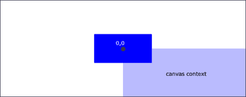

HTML5 画布变换的思想是以某种方式变换画布上下文，然后在画布上绘制。在这个示例中，我们已经将画布上下文平移，使得上下文的左上角移动到画布的中心：

```js
context.translate(tx,ty);
```

*tx*参数对应于水平平移，*ty*参数对应于垂直平移。一旦上下文被变换，我们就可以在画布上下文的左上角上绘制一个居中的矩形。最终结果是一个被平移的矩形，它被移动到画布的中心。

# 旋转画布上下文

HTML5 画布 API 提供的下一种类型的变换，也可以说是最方便的变换，是旋转变换。在这个示例中，我们将首先使用平移变换来定位画布上下文，然后使用`rotate()`方法来旋转上下文。

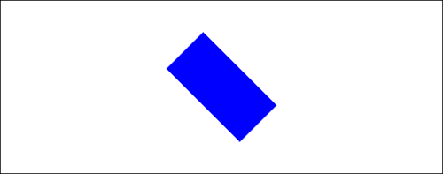

## 如何做...

按照以下步骤绘制一个旋转的矩形：

1.  定义画布上下文和矩形的尺寸：

```js
window.onload = function(){
    var canvas = document.getElementById("myCanvas");
    var context = canvas.getContext("2d");

    var rectWidth = 150;
    var rectHeight = 75;
```

1.  将画布上下文平移，然后将其旋转 45 度：

```js
    // translate context to center of canvas
    context.translate(canvas.width / 2, canvas.height / 2);

    // rotate context 45 degrees clockwise
    context.rotate(Math.PI / 4);
```

1.  绘制矩形：

```js
    context.fillStyle = "blue";
    context.fillRect(-rectWidth / 2, -rectHeight / 2, rectWidth, rectHeight);
};
```

1.  在 HTML 文档的 body 内嵌入 canvas 标签：

```js
<canvas id="myCanvas" width="600" height="250" style="border:1px solid black;">
</canvas>
```

## 它是如何工作的...

它是如何工作的！

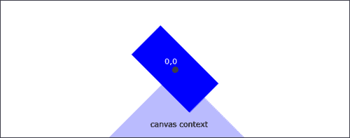

为了定位和旋转矩形，我们可以将画布上下文转换为画布的中心，就像我们在上一个示例中所做的那样，然后我们可以使用旋转变换来旋转画布上下文，这将使上下文围绕上下文的左上角旋转：

```js
canvas.rotate(theta);
```

参数*theta*以弧度表示，变换将上下文顺时针旋转。一旦上下文被平移和旋转，我们就可以在画布上下文的左上角上绘制一个居中的矩形。最终结果是一个以画布为中心的旋转矩形。

### 提示

请注意，我们通过链接两种不同的变换（平移和旋转）来实现了这个结果。HTML5 画布 API 提供的三种变换都会将一个变换矩阵应用于当前状态。例如，如果我们连续应用三次将画布上下文向右移动 10 像素的平移，最终结果将是向右移动 30 像素的平移。

如果我们想要围绕不同的点旋转矩形，比如说矩形的右下角，我们可以简单地在画布上下文的原点处绘制矩形的右下角。

在创建复杂的 HTML5 画布绘图时，平移和旋转是最常用的变换链。正如我们将在下一章中看到的那样，旋转在动画形状围绕轴旋转时非常有用。

## 参见...

+   *在第五章中摆动钟摆*

+   *在第五章中制作机械齿轮的动画*

+   *在第五章中制作时钟的动画*

# 缩放画布上下文

除了平移和旋转之外，HTML5 画布 API 还为我们提供了一种缩放画布上下文的方法。在这个示例中，我们将使用`scale()`方法缩小画布上下文的高度。

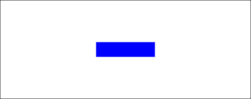

## 如何做...

按照以下步骤绘制一个缩放的矩形：

1.  定义画布上下文和矩形的尺寸：

```js
window.onload = function(){
    var canvas = document.getElementById("myCanvas");
    var context = canvas.getContext("2d");

    var rectWidth = 150;
    var rectHeight = 75;
```

1.  平移画布上下文，然后将画布上下文的高度缩小 50%：

```js
    // translate context to center of canvas
    context.translate(canvas.width / 2, canvas.height / 2);

    // scale down canvas height by half
    context.scale(1, 0.5);
```

1.  绘制一个中心位于画布上下文左上角的矩形：

```js
    context.fillStyle = "blue";
    context.fillRect(-rectWidth / 2, -rectHeight / 2, rectWidth, rectHeight);
};
```

1.  将画布标签嵌入 HTML 文档的主体中：

```js
<canvas id="myCanvas" width="600" height="250" style="border:1px solid black;">
</canvas>
```

## 工作原理...

要缩放画布上下文，我们可以简单地使用缩放变换：

```js
context.scale(sx,sy);
```

在上下文的默认状态下，`sx`和`sy`参数被标准化为`1`和`1`。正如您所期望的那样，`sx`参数对应于水平比例，`sy`参数对应于垂直比例。

在这个示例中，我们通过将`sy`参数设置为`0.5`来将垂直上下文缩小了 50%。另一方面，如果我们将`sy`分配给大于`1`的值，上下文将垂直拉伸。正如我们将在下一个示例中看到的，如果我们将`sx`或`sy`值分配为负值，我们将水平或垂直地翻转画布上下文，从而创建一个镜像变换。

## 参见...

+   *在第五章中振荡气泡*

# 创建镜像变换

缩放变换的另一个有趣用途是它能够垂直或水平地镜像画布上下文。在这个示例中，我们将水平镜像画布上下文，然后写出一些倒序的文本。

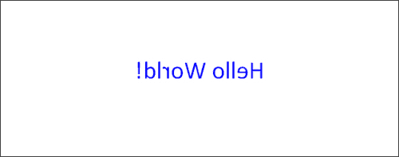

## 如何做...

按照以下步骤将文本写成倒序：

1.  定义画布上下文：

```js
window.onload = function(){
    var canvas = document.getElementById("myCanvas");
    var context = canvas.getContext("2d");
```

1.  平移画布上下文，然后使用负的`x`值水平翻转上下文：

```js
    // translate context to center of canvas
    context.translate(canvas.width / 2, canvas.height / 2);

    // flip context horizontally
    context.scale(-1, 1);
```

1.  写出“Hello World!”：

```js
    context.font = "30pt Calibri";
    context.textAlign = "center";
    context.fillStyle = "blue";
    context.fillText("Hello World!", 0, 0);
};
```

1.  将画布标签嵌入 HTML 文档的主体中：

```js
<canvas id="myCanvas" width="600" height="250" style="border:1px solid black;">
</canvas>
```

## 工作原理...

要使用 HTML5 画布 API 创建镜像变换，我们可以在使用画布上下文的`scale`方法时将`sx`或`sy`赋予负值：

```js
context.scale(-sx,-sy);
```

在这个示例中，我们将画布上下文平移到画布的中心，然后通过应用`scale()`变换的`-sx`值来水平翻转上下文。

# 创建自定义变换

如果您想执行除平移、缩放或旋转之外的自定义变换，HTML5 画布 API 还提供了一种方法，允许我们定义一个自定义变换矩阵，该矩阵可以应用于当前上下文。在这个示例中，我们将手动创建一个平移变换，以演示`transform()`方法的工作原理。


## 如何做...

按照以下步骤执行自定义变换：

1.  定义矩形的画布上下文和尺寸：

```js
window.onload = function(){
    var canvas = document.getElementById("myCanvas");
    var context = canvas.getContext("2d");

    var rectWidth = 150;
    var rectHeight = 75;
```

1.  通过手动平移画布上下文应用自定义变换：

```js
    // translation matrix:
    //  1  0  tx              
    //  0  1  ty
    //  0  0  1  
    var tx = canvas.width / 2;
    var ty = canvas.height / 2;

    // apply custom transform
    context.transform(1, 0, 0, 1, tx, ty); 
```

1.  绘制矩形：

```js
    context.fillStyle = "blue";
    context.fillRect(-rectWidth / 2, -rectHeight / 2, rectWidth, rectHeight);
};
```

1.  将画布元素嵌入到 HTML 文档的主体中：

```js
<canvas id="myCanvas" width="600" height="250" style="border:1px solid black;">
</canvas>
```

## 它是如何工作的...

在本示例中，我们通过将自定义平移变换矩阵应用于上下文状态来创建了自定义平移变换。变换矩阵只是一个二维矩阵，可以用来将当前矩阵转换为新矩阵。可以使用画布上下文的`transform()`方法将自定义变换应用于上下文状态：

```js
context.transform(a,b,c,d,e,f);
```

其中参数`a`、`b`、`c`、`d`、`e`和`f`对应于变换矩阵的以下组成部分：

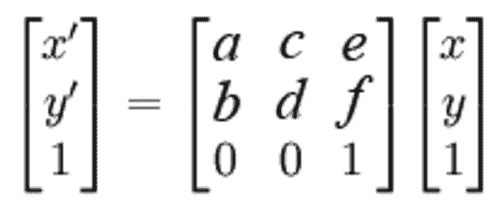

这里，*x'*和*y'*是应用变换后的新矩阵*x*和*y*分量。平移变换的变换矩阵如下所示：

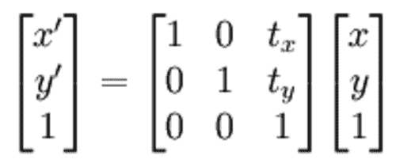

其中*tx*是水平平移，*ty*是垂直平移。

## 还有更多...

除了`transform()`方法之外，还可以使用画布上下文的`setTransform()`方法*设置*变换矩阵，该方法将变换矩阵应用于当前上下文状态：

```js
context.setTransform(a,b,c,d,e,f);
```

如果您想直接使用经过公式化的变换矩阵设置上下文的变换矩阵，而不是通过一系列变换获得相同的结果，那么这种方法可能会很有用。

# 倾斜画布上下文

在本示例中，我们将使用画布上下文的`transform()`方法从水平方向对画布上下文进行自定义剪切变换，利用了我们从画布上下文的`transform()`方法中学到的知识。

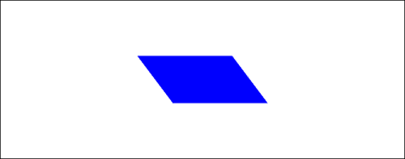

## 如何做...

按照以下步骤绘制一个倾斜的矩形：

1.  定义矩形的画布上下文和尺寸：

```js
window.onload = function(){
    var canvas = document.getElementById("myCanvas");
    var context = canvas.getContext("2d");

    var rectWidth = 150;
    var rectHeight = 75;
```

1.  平移画布上下文，然后对上下文应用自定义剪切变换：

```js
    // shear matrix:
    //  1  sx  0              
    //  sy  1  0
    //  0  0  1  

    var sx = 0.75; // 0.75 horizontal shear
    var sy = 0; // no vertical shear
    // translate context to center of canvas
    context.translate(canvas.width / 2, canvas.height / 2);

    // apply custom transform
    context.transform(1, sy, sx, 1, 0, 0); 
```

1.  绘制矩形：

```js
    context.fillStyle = "blue";
    context.fillRect(-rectWidth / 2, -rectHeight / 2, rectWidth, rectHeight);
};
```

1.  将画布元素嵌入到 HTML 文档的主体中：

```js
<canvas id="myCanvas" width="600" height="250" style="border:1px solid black;">
</canvas>
```

## 它是如何工作的...

要使画布上下文倾斜，可以应用以下变换矩阵：

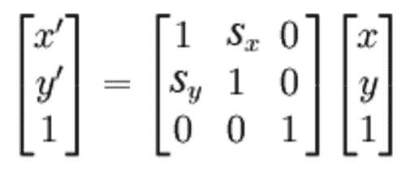

我们可以使用`transform()`方法和以下参数：

```js
context.transform(1,sy,sx,1,0,0);
```

我们增加`sx`的值，上下文水平倾斜就越大。我们增加`sy`的值，上下文垂直倾斜就越大。

# 使用状态堆栈处理多个变换

现在我们已经很好地掌握了 HTML5 画布 API 的变换，我们现在可以进一步探索画布状态堆栈，并了解它在变换方面对我们有什么作用。在第二章中，*形状绘制和合成*，我们介绍了状态堆栈，这是画布 API 的一个非常强大但有时被忽视的属性。尽管画布状态堆栈可以帮助管理样式，但它最常见的用法是保存和恢复变换状态。在本示例中，我们将在每次变换之间保存画布状态，并在恢复每个状态后绘制一系列矩形，以查看效果。

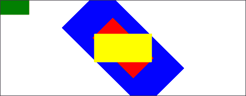

## 如何做...

按照以下步骤构建具有四种不同状态的状态堆栈，然后在弹出每个状态后绘制一个矩形：

1.  定义矩形的画布上下文和尺寸：

```js
window.onload = function(){
    var canvas = document.getElementById("myCanvas");
    var context = canvas.getContext("2d");

    var rectWidth = 150;
    var rectHeight = 75;
```

1.  将当前变换状态，即默认状态，推入状态堆栈，并平移上下文：

```js
    context.save(); // save state 1
    context.translate(canvas.width / 2, canvas.height / 2);
```

1.  将当前变换状态，即已平移的状态，推入堆栈，并旋转上下文：

```js
    context.save(); // save state 2
    context.rotate(Math.PI / 4);
```

1.  将当前变换状态，即已平移和旋转的状态，推入堆栈，并缩放上下文：

```js
    context.save(); // save state 3
    context.scale(2, 2);
```

1.  绘制一个蓝色的矩形：

```js
  // draw the rectangle
    context.fillStyle = "blue";
    context.fillRect(-rectWidth / 2, -rectHeight / 2, rectWidth, rectHeight);
```

1.  从状态堆栈中弹出当前状态以恢复先前的状态，然后绘制一个红色的矩形：

```js
    context.restore(); // restore state 3
    context.fillStyle = "red";
    context.fillRect(-rectWidth / 2, -rectHeight / 2, rectWidth, rectHeight);
```

1.  从状态堆栈中弹出当前状态以恢复先前的状态，然后绘制一个黄色的矩形：

```js
    context.restore(); // restore state 2
    context.fillStyle = "yellow";
    context.fillRect(-rectWidth / 2, -rectHeight / 2, rectWidth, rectHeight);
```

1.  从状态堆栈中弹出当前状态以恢复先前的状态，然后绘制一个绿色的矩形：

```js
    context.restore(); // restore state 1
    context.fillStyle = "green";
    context.fillRect(-rectWidth / 2, -rectHeight / 2, rectWidth, rectHeight);
};
```

1.  将画布标签嵌入 HTML 文档的主体中：

```js
<canvas id="myCanvas" width="600" height="250" style="border:1px solid black;">
</canvas>
```

## 工作原理...

这个方法执行了一系列三次变换，平移、旋转和缩放变换，同时使用`save()`操作将每个变换状态推送到状态堆栈上。当绘制蓝色矩形时，它被居中、旋转和缩放。此时，状态堆栈有四个状态（从底部到顶部）：

1.  默认状态

1.  已翻译状态

1.  已翻译和旋转状态

1.  当前状态（已翻译、旋转和缩放状态）

绘制蓝色矩形后，我们使用`restore()`方法弹出状态堆栈中的顶部状态，并将画布上下文恢复到第三个状态，其中画布上下文被平移和旋转。然后绘制红色矩形，您会看到它已经被平移和旋转，但没有被缩放。接下来，我们再次使用`restore()`方法弹出状态堆栈中的顶部状态，并恢复第二个状态，其中画布上下文仅被平移。然后我们绘制一个黄色的矩形，它确实只是被平移。最后，我们再次调用`restore()`方法，弹出状态堆栈中的顶部状态，并返回到默认状态。当我们绘制绿色矩形时，它出现在原点，因为没有应用任何变换。

### 提示

使用状态堆栈，我们可以在变换状态之间跳转，这样我们就不必不断地将状态重置为默认状态，然后分别对每个元素进行平移。此外，我们还可以使用保存-恢复组合来封装一小段代码的变换，而不会影响后面绘制的形状。

# 将圆形变成椭圆

缩放变换最常见的应用之一是将圆水平或垂直拉伸以创建椭圆。在这个方法中，我们将通过平移画布上下文、水平拉伸它，然后绘制一个圆来创建一个椭圆。

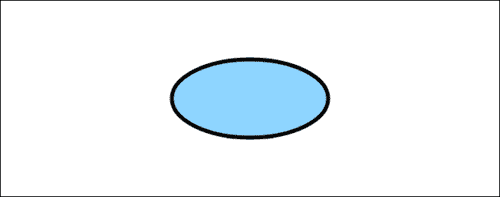

## 如何做...

按照以下步骤绘制一个椭圆：

1.  定义画布上下文：

```js
window.onload = function(){
    var canvas = document.getElementById("myCanvas");
    var context = canvas.getContext("2d");
```

1.  将当前变换状态（默认状态）推送到状态堆栈上：

```js
    context.save(); // save state
```

1.  定义圆的尺寸：

```js
    var centerX = 0;
    var centerY = 0;
    var radius = 50;
```

1.  将画布上下文平移到画布的中心，然后缩放上下文宽度以向外伸展：

```js
    context.translate(canvas.width / 2, canvas.height / 2);
    context.scale(2, 1);
```

1.  绘制圆：

```js
    context.beginPath();
    context.arc(centerX, centerY, radius, 0, 2 * Math.PI, false);
```

1.  恢复先前的变换状态，即默认状态，并从状态堆栈中弹出当前的变换状态：

```js
    context.restore(); // restore original state
```

1.  对椭圆应用样式：

```js
    context.fillStyle = "#8ED6FF";
    context.fill();
    context.lineWidth = 5;
    context.strokeStyle = "black";
    context.stroke();
};
```

1.  将画布标签嵌入 HTML 文档的主体中：

```js
<canvas id="myCanvas" width="600" height="250" style="border:1px solid black;">
</canvas>

```

## 工作原理...

要使用 HTML5 画布 API 绘制椭圆，我们可以简单地使用`translate()`方法将上下文平移到所需的位置，使用`scale()`方法在垂直或水平方向上拉伸上下文，然后绘制圆。在这个方法中，我们已经将画布上下文水平拉伸，以创建一个宽度是高度两倍的椭圆。

因为我们想要对椭圆应用描边样式，我们可以使用保存-恢复组合来封装用于创建椭圆的变换，以便它们不会影响椭圆后面的样式。

如果您自己尝试这个方法，并且删除`save()`和`restore()`方法，您会发现椭圆顶部和底部的线条厚度为 5 像素，椭圆两侧的线条厚度为 10 像素，因为描边样式也随着圆形在水平方向被拉伸。

## 另请参阅...

+   *在第五章中*振荡一个气泡*

# 旋转图像

在这个食谱中，我们将通过平移和旋转画布上下文来旋转图像，然后在变换后的上下文上绘制图像。

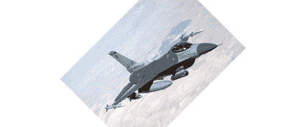

## 如何做...

按照以下步骤旋转图像：

1.  定义一个画布上下文：

```js
window.onload = function(){
    var canvas = document.getElementById("myCanvas");
    var context = canvas.getContext("2d");
```

1.  创建一个新的`image`对象并设置其`onload`属性：

```js
    var imageObj = new Image();
    imageObj.onload = function(){
```

1.  当图像加载时，将上下文转换到画布的中心，逆时针旋转上下文 45 度，然后绘制图像：

```js
        // translate context to center of canvas
        context.translate(canvas.width / 2, canvas.height / 2);

        // rotate context by 45 degrees counter clockwise
        context.rotate(-1 * Math.PI / 4);
        context.drawImage(this, -1 * imageObj.width / 2, -1 * imageObj.height / 2);
    };
```

1.  设置图像的来源：

```js
    imageObj.src = "jet_300x214.jpg";
};
```

1.  在 HTML 文档的 body 中嵌入 canvas 标签：

```js
<canvas id="myCanvas" width="600" height="250" style="border:1px solid black;">
</canvas>
```

## 它是如何工作的...

要旋转图像，我们可以简单地使用`translate()`方法定位画布上下文，使用`rotate()`方法旋转上下文，然后使用`drawImage()`方法绘制图像。

## 还有更多...

值得注意的是，除了旋转图像之外，与图像一起使用的另一个常见变换是镜像变换。要镜像图像，我们可以将上下文转换到所需的位置，使用`scale(-1,1)`水平反转上下文，或者使用`scale(1,-1)`垂直反转上下文，然后使用`drawImage()`绘制图像。

## 另请参阅...

+   *创建镜像变换*食谱

# 绘制一个简单的标志并随机化其位置、旋转和比例

这个食谱的目的是通过转换复杂的形状来演示变换的实际用途。在这种情况下，我们的复杂形状将是一个标志，它只是一些文本，下面有几条波浪线。当我们想要转换、旋转或缩放复杂的形状时，变换非常有用。开发人员经常创建函数，在原点绘制复杂的东西，然后使用变换将其移动到屏幕上的某个位置。在这个食谱中，我们将在屏幕上绘制五个随机位置、旋转和缩放的标志。

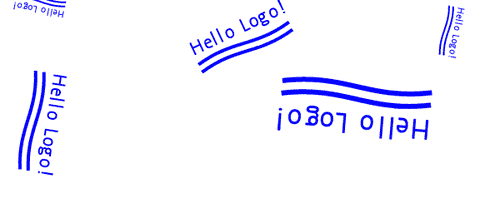

## 如何做...

按照以下步骤绘制五个随机位置、旋转和缩放的标志：

1.  定义`drawLogo()`函数，通过写出文本并在其下方绘制两条波浪线来绘制一个简单的标志：

```js
function drawLogo(context){
    // draw Hello Logo! text
    context.beginPath();
    context.font = "10pt Calibri";
    context.textAlign = "center";
    context.textBaseline = "middle";
    context.fillStyle = "blue";
    context.fillText("Hello Logo!", 0, 0);
    context.closePath();

  // define style for both waves
    context.lineWidth = 2;
    context.strokeStyle = "blue";

    // draw top wave
    context.beginPath();
    context.moveTo(-30, 10);
    context.bezierCurveTo(-5, 5, 5, 15, 30, 10);
    context.stroke();

    // draw bottom wave
    context.beginPath();
    context.moveTo(-30, 15);
    context.bezierCurveTo(-5, 10, 5, 20, 30, 15);
    context.stroke();
}
```

1.  定义`getRandomX()`函数，返回 0 到画布宽度之间的随机`X`值：

```js
function getRandomX(canvas){
    return Math.round(Math.random() * canvas.width);
}
```

1.  定义`getRandomY()`函数，返回 0 到画布高度之间的随机`Y`值：

```js
function getRandomY(canvas){
    return Math.round(Math.random() * canvas.height);
}
```

1.  定义`getRandomSize()`函数，返回 0 到 5 之间的随机大小：

```js
function getRandomSize(){
    return Math.round(Math.random() * 5);
}
```

1.  定义`getRandomAngle()`函数，返回 0 到 2π之间的随机角度：

```js
function getRandomAngle(){
    return Math.random() * Math.PI * 2;
}
```

1.  定义画布上下文：

```js
window.onload = function(){
    var canvas = document.getElementById("myCanvas");
    var context = canvas.getContext("2d");
```

1.  创建一个循环，绘制五个随机位置、旋转和缩放的标志：

```js
    // draw 5 randomly transformed logos
    for (var n = 0; n < 5; n++) {
        context.save();
        // translate to random position
        context.translate(getRandomX(canvas), getRandomY(canvas));

        // rotate by random angle
        context.rotate(getRandomAngle());

        // scale by random size
        var randSize = getRandomSize();
        context.scale(randSize, randSize);

        // draw logo
        drawLogo(context);
        context.restore();
    }
};
```

1.  在 HTML 文档的 body 中嵌入 canvas 标签：

```js
<canvas id="myCanvas" width="600" height="250" style="border:1px solid black;">
</canvas>
```

## 它是如何工作的...

首先，要绘制我们简单的标志，我们可以创建一个名为`drawLogo()`的函数，它在原点写出文本**Hello Logo!**，然后使用`bezierCurveTo()`方法为每个波绘制两条波浪线。

接下来，要绘制五个随机位置、旋转和缩放的标志，我们可以创建一些实用函数，返回位置、旋转和缩放的随机值，然后创建一个`for`循环，每次迭代使用保存-恢复组合来引入状态范围，执行三次变换，然后使用`drawLogo()`方法绘制标志。如果你自己尝试这个食谱，你会发现每次刷新屏幕时，五个标志的位置、旋转和缩放都不同。
