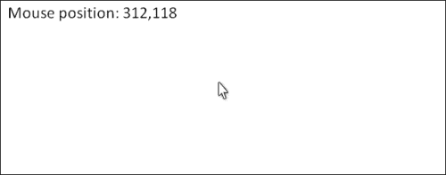
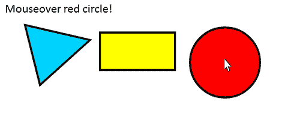
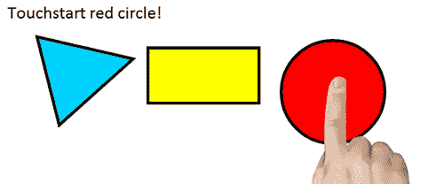
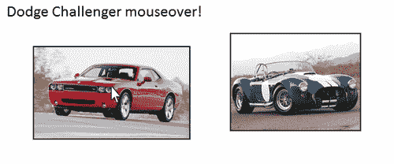
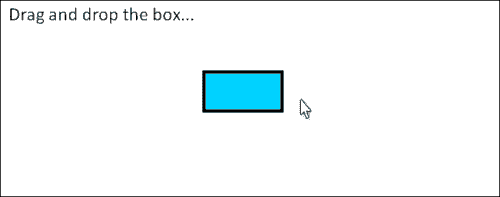
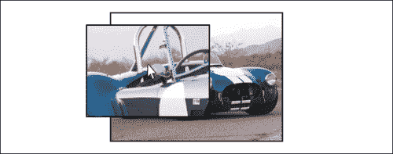
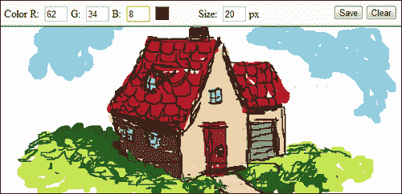

# 第六章：与画布交互：将事件监听器附加到形状和区域

在本章中，我们将涵盖：

+   创建一个 Events 类

+   使用画布鼠标坐标

+   将鼠标事件监听器附加到区域

+   将触摸事件监听器附加到移动设备上的区域

+   将事件监听器附加到图像

+   拖放形状

+   拖放图像

+   创建一个图像放大器

+   创建一个绘图应用程序

# 介绍

到目前为止，我们已经学会了如何在画布上绘制，处理图像和视频，并创建流畅的动画。本章重点是画布的交互性。到目前为止，我们所有的画布项目都非常不响应和与用户脱节。尽管 HTML5 画布 API 没有提供一种方法来将事件监听器附加到形状和区域，但我们可以通过扩展 API 来实现这种功能。根据 HTML5 规范，一旦形状被绘制，我们就无法像在 HTML 文档中对待 DOM 元素那样访问它。直到 HTML5 画布规范包括将事件监听器附加到形状和区域的方法（希望有一天会有），我们需要构建自己的 Events 类来实现这一点。我们的类将使我们能够将事件监听器附加到包装一个或多个形状的区域，类似于将事件监听器附加到 DOM 元素。

*这是一个非常强大的概念，因为它使我们能够在画布上绘制用户可以交互的形状。我们的 Events 类将支持* **mousedown**, **mouseup**, **mouseover**, **mouseout**, **mousemove**, **touchstart**, **touchend**, 和 **touchmove** 事件。

### 提示

尽管本章中的大多数示例都使用鼠标事件，但也可以通过用`touchstart`替换`mousedown`，用`touchend`替换`mouseup`，用`touchmove`替换`mousemove`来修改以支持移动触摸事件。

让我们开始吧！

# 创建一个 Events 类

类似于第五章，“通过动画使画布生动起来”，在那一章中，我们创建了一个自定义类来处理动画，本章中我们将创建一个自定义类来处理画布事件。

由于画布形状不可作为对象访问（遗憾！），我们无法像对待 div 元素那样附加事件监听器：

```js
document.getElementById("foo").addEventListener("mouseup", function() {
  // do stuff
}, false);
```

那么我们能做什么呢？如果我们遵循画布 API 的模式，在其中形状的开始由`beginPath()`定义，形状的结束由`closePath()`定义，我们可以通过引入封装多个形状的区域的概念进一步扩展这个想法。此外，如果我们能够以类似的方式向区域添加事件监听器，就像我们向 DOM 元素添加事件监听器一样，那将非常好：

```js
this.addRegionEventListener("mouseup", function() {
 // do stuff
});
```

Events 类的目标就是通过扩展画布 API 来支持画布事件，引入可以附加桌面事件监听器（如`mousedown`，`mouseup`，`mouseover`，`mouseout`和`mousemove`）以及移动事件监听器（如`touchstart`，`touchend`和`touchmove`）的区域。

### 提示

与其手动输入 Events 类，不如考虑从本书的在线资源中下载该类[www.html5canvastutorials.com/cookbook](http://www.html5canvastutorials.com/cookbook)。

## 如何做...

按照以下步骤创建一个 Events 类，它将使我们能够将事件监听器附加到画布上的形状和区域：

1.  定义`Events`构造函数：

```js
var Events = function(canvasId){
    this.canvas = document.getElementById(canvasId);
    this.context = this.canvas.getContext("2d");
    this.stage = undefined;
    this.listening = false;

    // desktop flags
    this.mousePos = null;
    this.mouseDown = false;
    this.mouseUp = false;
    this.mouseOver = false;
    this.mouseMove = false;

    // mobile flags
    this.touchPos = null;
    this.touchStart = false;
    this.touchMove = false;
    this.touchEnd = false;

    // Region Events
    this.currentRegion = null;
    this.regionIndex = 0;
    this.lastRegionIndex = -1;
    this.mouseOverRegionIndex = -1;
};
```

1.  定义`getContext()`方法，返回画布上下文：

```js
Events.prototype.getContext = function(){
    return this.context;
};
```

1.  定义`getCanvas()`方法，返回画布 DOM 元素：

```js
Events.prototype.getCanvas = function(){
    return this.canvas;
};
```

1.  定义`clear()`方法，清除画布：

```js
Events.prototype.clear = function(){
    this.context.clearRect(0, 0, this.canvas.width, this.canvas.height);
};
```

1.  定义`getCanvasPos()`方法，返回画布位置：

```js
Events.prototype.getCanvasPos = function(){
    var obj = this.getCanvas();
    var top = 0;
    var left = 0;
    while (obj.tagName != "BODY") {
        top += obj.offsetTop;
        left += obj.offsetLeft;
        obj = obj.offsetParent;
    }
    return {
        top: top,
        left: left
    };
};
```

1.  定义`setStage()`方法，设置`stage()`函数：

```js
Events.prototype.setStage = function(func){
    this.stage = func;
    this.listen();
};
```

1.  定义`reset()`方法，用于设置鼠标位置和触摸位置，重置区域索引，调用`stage()`函数，然后重置事件标志：

```js
Events.prototype.reset = function(evt){
    if (!evt) {
        evt = window.event;
    }

    this.setMousePosition(evt);
    this.setTouchPosition(evt);
    this.regionIndex = 0;

    if (this.stage !== undefined) {
        this.stage();
    }

    // desktop flags
    this.mouseOver = false;
    this.mouseMove = false;
    this.mouseDown = false;
    this.mouseUp = false;

    // mobile touch flags
    this.touchStart = false;
    this.touchMove = false;
    this.touchEnd = false;
};
```

1.  定义`listen()`方法，向画布元素添加事件监听器：

```js
Events.prototype.listen = function(){
    var that = this;

    if (this.stage !== undefined) {
        this.stage();
    }

    // desktop events
    this.canvas.addEventListener("mousedown", function(evt){
        that.mouseDown = true;
        that.reset(evt);
    }, false);

    this.canvas.addEventListener("mousemove", function(evt){
        that.reset(evt);
    }, false);

    this.canvas.addEventListener("mouseup", function(evt){
        that.mouseUp = true;
        that.reset(evt);
    }, false);

    this.canvas.addEventListener("mouseover", function(evt){
        that.reset(evt);
    }, false);

    this.canvas.addEventListener("mouseout", function(evt){
        that.mousePos = null;
    }, false);

    // mobile events
    this.canvas.addEventListener("touchstart", function(evt){
        evt.preventDefault();
        that.touchStart = true;
        that.reset(evt);
    }, false);

    this.canvas.addEventListener("touchmove", function(evt){
        evt.preventDefault();
        that.reset(evt);
    }, false);

    this.canvas.addEventListener("touchend", function(evt){
        evt.preventDefault();
        that.touchEnd = true;
        that.reset(evt);
    }, false);
};
```

1.  定义`getMousePos()`方法，用于桌面应用程序返回鼠标位置：

```js
Events.prototype.getMousePos = function(evt){
    return this.mousePos;
};
```

1.  定义`getTouchPos()`方法，用于移动应用程序返回触摸位置：

```js
Events.prototype.getTouchPos = function(evt){
    return this.touchPos;
};
```

1.  定义`setMousePos()`方法，用于设置鼠标位置：

```js
Events.prototype.setMousePosition = function(evt){
    var mouseX = evt.clientX - this.getCanvasPos().left + window.pageXOffset;
    var mouseY = evt.clientY - this.getCanvasPos().top + window.pageYOffset;
    this.mousePos = {
        x: mouseX,
        y: mouseY
    };
};
```

1.  定义`setTouchPos()`方法，用于设置触摸位置：

```js
Events.prototype.setTouchPosition = function(evt){
    if (evt.touches !== undefined && evt.touches.length == 1) { // Only deal with one finger
        var touch = evt.touches[0]; // Get the information for finger #1
        var touchX = touch.pageX - this.getCanvasPos().left + window.pageXOffset;
        var touchY = touch.pageY - this.getCanvasPos().top + window.pageYOffset;

        this.touchPos = {
            x: touchX,
            y: touchY
        };
    }
};
```

1.  定义`beginRegion()`方法，用于定义一个新区域：

```js
Events.prototype.beginRegion = function(){
    this.currentRegion = {};
    this.regionIndex++;
};
```

1.  定义`addRegionEventListener()`方法，用于向区域添加事件监听器：

```js
Events.prototype.addRegionEventListener = function(type, func){
    var event = (type.indexOf('touch') == -1) ? 'on' + type : type;
    this.currentRegion[event] = func;
};
```

1.  定义`closeRegion()`方法，用于关闭一个区域并确定是否发生了与当前区域相关的事件：

```js
Events.prototype.closeRegion = function(){
    var pos = this.touchPos || this.mousePos;

    if (pos !== null && this.context.isPointInPath(pos.x, pos.y)) {
        if (this.lastRegionIndex != this.regionIndex) {
            this.lastRegionIndex = this.regionIndex;
        }

        // handle onmousedown
        if (this.mouseDown && this.currentRegion.onmousedown !== undefined) {
            this.currentRegion.onmousedown();
            this.mouseDown = false;
        }

        // handle onmouseup
        else if (this.mouseUp && this.currentRegion.onmouseup !== undefined) {
            this.currentRegion.onmouseup();
            this.mouseUp = false;
        }

        // handle onmouseover
        else if (!this.mouseOver && this.regionIndex != this.mouseOverRegionIndex && this.currentRegion.onmouseover !== undefined) {
            this.currentRegion.onmouseover();
            this.mouseOver = true;
            this.mouseOverRegionIndex = this.regionIndex;
        }

        // handle onmousemove
        else if (!this.mouseMove && this.currentRegion.onmousemove !== undefined) {
            this.currentRegion.onmousemove();
            this.mouseMove = true;
        }

        // handle touchstart
        if (this.touchStart && this.currentRegion.touchstart !== undefined) {
            this.currentRegion.touchstart();
            this.touchStart = false;
        }

        // handle touchend
        if (this.touchEnd && this.currentRegion.touchend !== undefined) {
            this.currentRegion.touchend();
            this.touchEnd = false;
        }

        // handle touchmove
        if (!this.touchMove && this.currentRegion.touchmove !== undefined) {
            this.currentRegion.touchmove();
            this.touchMove = true;
        }

    }
    else if (this.regionIndex == this.lastRegionIndex) {
        this.lastRegionIndex = -1;
        this.mouseOverRegionIndex = -1;

        // handle mouseout condition
        if (this.currentRegion.onmouseout !== undefined) {
            this.currentRegion.onmouseout();
        }
    }
};
```

## 工作原理...

尽管 HTML5 画布 API 没有提供一种方便处理事件监听器的方法，但它提供了一个关键方法，使这成为可能：

```js
context.isPointInPath(x,y);
```

`isPointInPath()`方法如果给定的坐标在画布上绘制的*任何*路径内，则返回 true。由于画布是位图，这里没有图层和形状的概念，因此我们必须想办法利用`isPointInPath()`方法来确定特定区域的坐标，特别是鼠标坐标，是否在画布上。一旦我们能够检测鼠标光标是否在特定区域上方，我们可以添加额外的逻辑来处理`mouseover`、`mousemove`、`mouseout`、`mousedown`、`mouseup`、`touchstart`、`touchend`和`touchmove`事件。

在深入讨论之前，让我们举个例子，制定一个模拟区域事件的流程，然后利用所学知识来制定我们需要创建`Events`类的方法。假设我们想在画布上绘制一个三角形、一个矩形和一个圆，然后当用户将鼠标放在圆上时，我们想要弹出一些文本。我们可以先绘制三角形，然后使用`isPointInPath()`来检查鼠标坐标是否在当前路径内。如果该方法返回 false，我们就知道鼠标光标在三角形外面。接下来，我们可以绘制矩形，再次检查鼠标坐标是否在任何路径内，这时包括了三角形和矩形。如果`isPointInPath()`仍然返回 false，我们现在知道鼠标光标在三角形和矩形外面。最后，我们可以绘制圆，再次检查鼠标坐标是否在画布上的任何路径内，这时包括了三角形、矩形和圆。如果该方法返回 true，则鼠标确实在圆上。如果返回 false，则鼠标光标在三角形、矩形和圆外面。

当然，这仅在我们假设在元素实际绘制之前，光标已经位于画布的某个位置时才有效。在光标移动后，我们能够检测鼠标光标是否在元素上方的唯一方法是在每次触发事件时重新绘制我们的元素，然后检查鼠标坐标是否在绘制每个元素后存在的形状内。我们可以通过使用`Events`类的`setStage()`方法来定义`stage()`函数来实现这一点。

接下来，我们需要一种方法来定义区域的开始和结束。我们可以创建一个`beginRegion()`方法来定义一个新的`Region`对象。`Region`对象可以有八个属性：`mouseover`、`mouseout`、`mousemove`、`mousedown`、`mouseup`、`touchstart`、`touchend`和`touchmove`，所有这些都是用户定义的函数。接下来，我们可以创建一个名为`addRegionEventListener()`的方法，用于附加需要事件类型和事件发生时要调用的函数的区域事件。由于我们有一个开始新区域的方法，我们还需要创建一个`closeRegion()`方法。该方法包含了大部分逻辑，用于确定是否发生了八个事件中的一个。最后，我们可以创建一个`listen()`方法，该方法向画布元素添加事件监听器，以便适当处理区域事件。

本文介绍的 Events 类通过使用`beginRegion()`和`closeRegion()`方法定义区域，然后在每次触发事件时重新绘制区域，以便检测事件属于哪个区域。这种方法的优点是易于实现，而且我们只需要一个画布元素。

尽管这种方法对于具有合理数量的区域和附加事件监听器的画布应用程序非常有效，但对于使用大量区域的应用程序来说可能不是最佳方法。需要成千上万个区域，每个区域都有自己的事件监听器的应用程序可能会因为每次鼠标移动时重绘的形状数量而遇到性能问题。

对于这样的应用程序，可以使用更复杂的方法，为每个区域分配自己的画布，然后将画布堆叠在一起，这样每次触发事件时就不必重新绘制区域。这种方法的一个很好的例子是 KineticJS 库（[`www.kineticjs.com`](http://www.kineticjs.com)）。

# 使用画布鼠标坐标

为了熟悉 Events 类，我们将简单地使用 Events 类的`getMousePos()`方法获取鼠标光标的坐标，然后在画布的左上角显示它。`getMousePos()`方法返回相对于画布的鼠标坐标，考虑了画布相对于页面的偏移位置，以及页面的滚动位置。



## 如何做到这一点...

按照以下步骤获取画布鼠标坐标，并在鼠标光标移动时将其显示在画布的左上角：

1.  链接到`Events`类：

```js
<script src="img/events.js">
</script>
```

1.  定义`writeMessage()`函数，用于写出消息：

```js
<script>
    function writeMessage(context, message){
        context.font = "18pt Calibri";
        context.fillStyle = "black";
        context.fillText(message, 10, 25);
    }
```

1.  实例化一个新的 Events 对象并获取画布和上下文：

```js
    window.onload = function(){
        var events = new Events("myCanvas");
        var canvas = events.getCanvas();
        var context = events.getContext();
```

1.  当用户鼠标移出画布时，清除画布，然后写出消息“Mouseover me!”：

```js
        canvas.addEventListener("mouseout", function(){
            events.clear();
            writeMessage(context, "Mouseover me!");
        }, false);
```

1.  当用户在画布中移动鼠标时，清除画布，然后写出鼠标位置：

```js
        canvas.addEventListener("mousemove", function(){
            var mousePos = events.getMousePos();
            events.clear();

            if (mousePos !== null) {
                message = "Mouse position: " + mousePos.x + "," + mousePos.y;
                writeMessage(context, message);
            }
        }, false);
```

1.  开始监听事件：

```js
    // if we don't set the stage function,
    // we'll have to manually start listening for events
        events.listen();
```

1.  在用户开始之前写出初始消息：

```js
        writeMessage(context, "Mouseover me!");
    };
</script>
```

1.  将画布嵌入到 HTML 文档的主体中：

```js
<canvas id="myCanvas" width="600" height="250" style="border:1px solid black;">
</canvas>
```

## 它是如何工作的...

页面加载后，我们可以实例化一个 Events 对象，以便我们可以访问`getMousePos()`方法。接下来，我们可以为 canvas 对象附加一个`mouseout`事件监听器，该监听器将事件显示设置为“Mouseover me!”，并且还可以为 canvas 对象附加一个`mousemove`事件监听器，该监听器使用`getMousePos()`方法获取鼠标位置，然后写出坐标。最后，我们可以使用`listen()`方法开始监听事件。

# 将鼠标事件监听器附加到区域

在这个示例中，我们将通过定义区域并向其添加事件侦听器来深入了解`Events`类。我们将绘制一个三角形，为其附加`mouseout`和`mousemove`事件侦听器，然后绘制一个没有事件侦听器的矩形，最后绘制一个圆形，并为其附加`mouseover`、`mouseout`、`mousedown`和`mouseup`事件侦听器，以尝试`Events`类支持的不同桌面事件侦听器。



## 如何做...

按照以下步骤绘制一个三角形、一个矩形和一个圆形，然后为每个形状附加鼠标事件侦听器：

1.  链接到`Events`类：

```js
<script src="img/events.js">
</script>
```

1.  定义`writeMessage()`函数，用于写出一条消息：

```js
<script>
    function writeMessage(context, message){
        context.font = "18pt Calibri";
        context.fillStyle = "black";
        context.fillText(message, 10, 25);
    }
```

1.  实例化一个新的`Events`对象并获取画布和上下文：

```js
    window.onload = function(){
        var events = new Events("myCanvas");
        var canvas = events.getCanvas();
        var context = events.getContext();
        var message = "";
```

1.  开始定义`stage()`函数，首先清除画布：

```js
        events.setStage(function(){
          this.clear();
```

1.  使用`beginRegion()`开始一个新区域，然后绘制一个蓝色三角形：

```js
            // draw blue triangle
            this.beginRegion();
            context.beginPath();
            context.lineWidth = 4;
            context.strokeStyle = "black";
            context.fillStyle = "#00D2FF";
            context.moveTo(50, 50);
            context.lineTo(180, 80);
            context.lineTo(80, 170);
            context.closePath();
            context.fill();
            context.stroke();
```

1.  向三角形添加`mousemove`和`mouseout`事件侦听器，并使用`closeRegion()`关闭该区域：

```js
            this.addRegionEventListener("mousemove", function(){
                var mousePos = events.getMousePos();
                var mouseX = mousePos.x - 50;
                var mouseY = mousePos.y - 50;
                message = "Triangle mouse Position: " + mouseX + "," + mouseY;
            });

            this.addRegionEventListener("mouseout", function(){
                message = "Mouseout blue triangle!";
            });

            this.closeRegion();
```

1.  绘制一个没有事件侦听器的黄色矩形：

```js
            // draw yellow rectangle
            // this is an example of a shape
            // with no event listeners
            context.beginPath();
            context.lineWidth = 4;
            context.strokeStyle = "black";
            context.fillStyle = "yellow";
            context.rect(200, 65, 150, 75);
            context.fill();
            context.stroke();
```

1.  开始一个新区域并绘制一个红色圆形：

```js
            // draw red circle
            this.beginRegion();
            context.beginPath();
            context.arc(450, canvas.height / 2, 70, 0, Math.PI * 2, true);
            context.fillStyle = "red";
            context.fill();
            context.stroke();
```

1.  向圆形附加`mousedown`、`mouseup`、`mouseover`和`mouseout`事件侦听器，并关闭该区域：

```js
            this.addRegionEventListener("mousedown", function(){
                message = "Mousedown red circle!";
            });
            this.addRegionEventListener("mouseup", function(){
                message = "Mouseup red circle!";
            });
            this.addRegionEventListener("mouseover", function(){
                message = "Mouseover red circle!";
            });
            this.addRegionEventListener("mouseout", function(){
                message = "Mouseout red circle!";
            });

            this.closeRegion();
```

1.  写出一条消息：

```js
      writeMessage(context, message);
        });

    // since we set the draw stage function, the listen()
    // method is automatically called for us
    };
</script>
```

1.  将画布嵌入到 HTML 文档的主体中：

```js
<canvas id="myCanvas" width="600" height="250" style="border:1px solid black;">
</canvas>
```

## 它是如何工作的...

要将事件附加到本示例中的三个形状，我们首先需要初始化一个`Events`对象，然后设置`stage()`函数。在`stage()`函数内部，我们可以使用`beginRegion()`定义一个新区域，绘制蓝色三角形，使用`addRegionEventListener()`附加事件，然后使用`closeRegion()`关闭该区域。接下来，我们可以绘制黄色矩形，而不需要定义区域，因为我们不会为其附加任何事件。最后，我们可以定义第二个区域，绘制红色圆形，附加事件侦听器，然后关闭该区域，完成`stage()`函数的定义。

## 另请参阅...

+   *在第二章中绘制一个矩形*

+   *在第二章中绘制一个圆形*

+   *在第二章中使用自定义形状和填充样式*

+   *在移动设备上将触摸事件侦听器附加到区域*

# 在移动设备上附加触摸事件侦听器到区域

对于那些喊着“移动设备怎么办？台式机和笔记本电脑已经过时了！”的人来说，这个示例就是为你准备的。随着互联网用户从巨大的桌面设备转向移动设备，并开始从移动设备消费互联网内容，每天都越来越明显，包括 canvas 在内的 Web 的未来主要在移动空间中。

与在台式机和笔记本电脑上运行的 Web 应用程序不同，移动设备上运行的 Web 应用程序是通过`touchstart`、`touchend`和`touchmove`事件的触摸事件来检测用户交互的。

在这个示例中，我们将通过向三角形和圆形添加触摸事件侦听器来创建前一个示例的移动版本。

如前所述，本章中的任何示例都可以通过添加触摸事件侦听器来修改以支持移动设备。



## 如何做...

按照以下步骤绘制一个三角形、一个矩形和一个圆形，然后为每个形状附加移动触摸事件：

1.  在头标签内添加一个 viewport meta 标签，以设置移动设备的宽度，设置初始比例，并禁用用户缩放：

```js
<meta name="viewport" content="width=device-width, initial-scale=0.552, user-scalable=no"/>
```

1.  链接到`Events`类：

```js
<script src="img/events.js">
</script>
```

1.  定义`writeMessage()`函数，用于写出一条消息：

```js
<script>
    function writeMessage(context, message){
        context.font = "18pt Calibri";
        context.fillStyle = "black";
        context.fillText(message, 10, 25);
    }
```

1.  实例化一个新的`Events`对象并获取画布和上下文：

```js
    window.onload = function(){
        var events = new Events("myCanvas");
        var canvas = events.getCanvas();
        var context = events.getContext();
        var message = "";
```

1.  开始定义`sStage()`函数，首先清除画布：

```js
        events.setStage(function(){
      this.clear();
```

1.  使用`beginRegion()`开始一个新区域，然后绘制一个蓝色三角形：

```js
            // draw blue triangle
            this.beginRegion();
            context.beginPath();
            context.lineWidth = 4;
            context.strokeStyle = "black";
            context.fillStyle = "#00D2FF";
            context.moveTo(50, 50);
            context.lineTo(180, 80);
            context.lineTo(80, 170);
            context.closePath();
            context.fill();
            context.stroke();
```

1.  将`touchmove`事件监听器添加到三角形上，并使用`closeRegion()`关闭区域：

```js
            this.addRegionEventListener("touchmove", function(){
                var touchPos = events.getTouchPos();

                if (touchPos !== null) {
                    var touchX = touchPos.x - 20;
                    var touchY = touchPos.y - 50;

                    message = "Triangle touch position: " + touchX + "," + touchY;
                }
            });

            this.closeRegion();
```

1.  绘制一个没有事件监听器的黄色矩形：

```js
            // draw yellow rectangle
            // this is an example of a shape
            // with no event listeners
            context.beginPath();
            context.lineWidth = 4;
            context.strokeStyle = "black";
            context.fillStyle = "yellow";
            context.rect(200, 65, 150, 75);
            context.fill();
            context.stroke();
```

1.  开始一个新的区域并绘制一个红色圆：

```js
            // draw red circle
            this.beginRegion();
            context.beginPath();
            context.arc(450, canvas.height / 2, 70, 0, Math.PI * 2, true);
            context.fillStyle = "red";
            context.fill();
            context.stroke();
```

1.  将`touchstart`和`touchend`事件监听器附加到圆上并关闭区域：

```js
            this.addRegionEventListener("touchstart", function(){
                message = "Touchstart red circle!";
            });

            this.addRegionEventListener("touchend", function(){
                message = "Touchend red circle!";
            });

            this.closeRegion();
```

1.  写出一条消息：

```js
      writeMessage(context, message);
        });

    // since we set the draw stage function, the listen()
    // method is automatically called for us
    };
</script>
```

1.  将画布嵌入到 HTML 文档的主体中：

```js
<canvas id="myCanvas" width="600" height="250" style="border:1px solid black;">
</canvas>
```

## 它是如何工作的...

与上一个示例类似，在这个示例中，我们将事件监听器附加到三角形和圆上，只是这一次我们将附加触摸事件监听器，以便演示可以在移动设备上运行。

移动设备上的触摸事件实际上非常简单，并且工作方式与桌面事件基本相同。 `mousedown` 的移动设备等效是 `touchstart`，`mouseup` 的等效是 `touchend`，`mousemove` 的等效是 `touchmove`。由于移动设备无法检测到手指是否悬停在区域上，因此移动设备没有 `mouseover` 或 `mouseout` 的等效，我不会感到惊讶，如果将来移动设备*可以*检测到手指是否接近屏幕但没有触碰到它。

为了显示蓝色三角形的触摸坐标，我们可以使用`touchmove`事件监听器，并且为了检测红色圆何时被触摸或释放，我们可以使用`touchstart`和`touchend`事件。

## 另请参阅...

+   *在第二章中绘制一个矩形*

+   *在第二章中绘制一个圆*

+   *在第二章中使用自定义形状和填充样式*

+   *将鼠标事件监听器附加到区域*

# 附加事件监听器到图像

在这个示例中，我们将事件监听器附加到图像上。由于我们只能使用`Events`类将事件监听器附加到路径上，并且在画布上绘制的图像不被归类为路径，因此我们可以创建一个覆盖图像的矩形区域，以便将事件监听器附加到矩形区域，并因此将事件监听器附加到图像。



## 如何做...

按照以下步骤绘制两个不同的图像，然后将`mouseover`、`mouseout`、`mousedown`和`mouseup`事件监听器附加到它们：

1.  链接到`Events`类：

```js
<script src="img/events.js">
</script>
```

1.  定义`writeMessage()`函数，用于写出一条消息：

```js
<script>
    function writeMessage(context, message){
        context.font = "18pt Calibri";
        context.fillStyle = "black";
        context.fillText(message, 10, 25);
    }
```

1.  创建一个图像加载器，加载一组图像，然后在所有图像加载完成时调用`callback`函数：

```js
    /*
     * loads the images and then calls the callback function
     * with a hash of image objects when the images have loaded
     */
    function loadImages(sources, callback){
        var loadedImages = 0;
        var numImages = 0;
        var images = {};
        // get num of sources
        for (var src in sources) {
            numImages++;
        }
       // load images
        for (var src in sources) {
            images[src] = new Image();
            images[src].onload = function(){
        // call callback function() when images
        // have loaded
                if (++loadedImages >= numImages) {
                    callback(images);
                }
            };
            images[src].src = sources[src];
        }
    }
```

1.  定义`drawImages()`函数，该函数实例化一个新的`Events`对象并开始定义`stage()`函数：

```js
    function drawImages(images){
        var events = new Events("myCanvas");
        var canvas = events.getCanvas();
        var context = events.getContext();
        var message = "";

        events.setStage(function(){
      this.clear();
```

1.  开始一个新的区域，绘制左侧图像，定义代表图像路径的矩形区域，将事件监听器附加到矩形区域，然后关闭区域。然后重复这些步骤来创建右侧图像，并写出一条消息：

```js
            this.beginRegion();

            context.drawImage(images.challengerImg, 50, 70, 240, 143);
            // draw rectangular region for image
            context.beginPath();
            context.rect(50, 70, 240, 143);
            context.closePath();

            this.addRegionEventListener("mouseover", function(){
                message = "Dodge Challenger mouseover!";
            });
            this.addRegionEventListener("mouseout", function(){
                message = "Dodge Challenger mouseout!";
            });
            this.addRegionEventListener("mousedown", function(){
                message = "Dodge Challenger mousedown!";
            });
            this.addRegionEventListener("mouseup", function(){
                message = "Dodge Challenger mouseup!";
            });
            this.closeRegion();

            this.beginRegion();
            context.drawImage(images.cobraImg, 350, 50, 200, 150);
            // draw rectangular region for image
            context.beginPath();
            context.rect(350, 50, 200, 150);
            context.closePath();
            this.addRegionEventListener("mouseover", function(){
                message = "AC Cobra mouseover!";
            });
            this.addRegionEventListener("mouseout", function(){
                message = "AC Cobra mouseout!";
            });
            this.addRegionEventListener("mousedown", function(){
                message = "AC Cobra mousedown!";
            });
            this.addRegionEventListener("mouseup", function(){
                message = "AC Cobra mouseup!";
            });
            this.closeRegion();

            writeMessage(context, message);
        });
    }
```

1.  页面加载时创建图像源的哈希，然后将其传递给`loadImages()`函数：

```js
    window.onload = function(){
        var sources = {
            challengerImg: "challenger.jpg",
            cobraImg: "cobra.jpg"
        };

        loadImages(sources, drawImages);
    };
</script>
```

1.  将画布嵌入到 HTML 文档的主体中：

```js
<canvas id="myCanvas" width="600" height="250" style="border:1px solid black;">
</canvas>
```

## 它是如何工作的...

页面加载后，我们可以使用图像加载器函数加载两个图像。当两个图像都加载完成时，将调用`drawImages()`函数并实例化一个`Events`对象。在`stage()`函数内部，我们可以使用`beginRegion()`开始一个新的区域，绘制第一张图像，绘制一个矩形路径来定义图像路径，使用`addRegionEventListener()`附加事件，然后关闭区域。接下来，我们可以重复此过程，创建第二个图像及其自己的一组事件监听器。

## 另请参阅...

+   *在第三章中绘制一个图像*

# 拖放形状

在这个食谱中，我们将解决事件侦听器的圣杯——拖放。如果没有`Events`类或其他轻量级的 JavaScript 库，拖放操作可能会相当繁琐。我们可以使用`Events`类将`mouseover`、`mousedown`、`mousemove`、`mouseup`和`mouseout`事件侦听器附加到矩形上，以处理拖放操作的不同阶段。



## 如何做...

按照以下步骤拖放矩形：

1.  链接到`Events`类：

```js
<script src="img/events.js">
</script>
```

1.  定义`writeMessage()`函数，用于写出消息：

```js
<script>
    function writeMessage(context, message){
        context.font = "18pt Calibri";
        context.fillStyle = "black";
        context.fillText(message, 10, 25);
    }
```

1.  页面加载时，实例化一个新的`Events`对象，定义将要拖放的矩形的起始位置，并为拖放操作定义`draggingRect`、`draggingRectOffsetX`和`draggingRectOffsetY`：

```js
    window.onload = function(){
        events = new Events("myCanvas");
        var canvas = events.getCanvas();
        var context = events.getContext();

        var rectX = canvas.width / 2 - 50;
        var rectY = canvas.height / 2 - 25;
        var draggingRect = false;
        var draggingRectOffsetX = 0;
        var draggingRectOffsetY = 0;
```

1.  对于`stage()`函数，首先根据鼠标的坐标设置矩形的坐标，如果`draggingRect`布尔值为 true：

```js
        events.setStage(function(){                    
            // get the mouse position
            var mousePos = this.getMousePos();

            if (draggingRect) {
                rectX = mousePos.x - draggingRectOffsetX;
                rectY = mousePos.y - draggingRectOffsetY;
            }
```

1.  清除画布，写出消息，开始一个新的区域，绘制矩形，附加事件，然后关闭区域：

```js
            // clear the canvas
            this.clear();

            writeMessage(context, "Drag and drop the box...");

            this.beginRegion();

            // draw the box
            context.beginPath();
            context.rect(rectX, rectY, 100, 50);
            context.lineWidth = 4;
            context.strokeStyle = "black";
            context.fillStyle = "#00D2FF";
            context.fill();
            context.stroke();
            context.closePath();

            // attach event listeners
            this.addRegionEventListener("mousedown", function(){
                draggingRect = true;
                var mousePos = events.getMousePos();

                draggingRectOffsetX = mousePos.x - rectX;
                draggingRectOffsetY = mousePos.y - rectY;
            });
            this.addRegionEventListener("mouseup", function(){
                draggingRect = false;
            });
            this.addRegionEventListener("mouseover", function(){
                document.body.style.cursor = "pointer";
            });
            this.addRegionEventListener("mouseout", function(){
                document.body.style.cursor = "default";
            });

            this.closeRegion();
        });
    };
</script>
```

1.  将画布嵌入到 HTML 文档的主体中：

```js
<canvas id="myCanvas" width="600" height="250" style="border:1px solid black;">
</canvas>
```

## 它是如何工作的...

拖放由三个阶段处理：

1.  检测形状上的`mousedown`事件，开始操作

1.  使用`mousemove`事件侦听器根据鼠标坐标定位形状

1.  当鼠标按钮释放时放下形状（`mouseup`）

在`stage()`函数内，如果`draggingRect`布尔值为 true，我们可以设置矩形相对于鼠标位置的位置。然后我们可以使用`beginRegion()`开始一个新的区域，绘制矩形，然后使用`addRegionEventListener()`方法附加事件侦听器。我们可以添加一个`mousedown`事件侦听器，将`draggingRect`布尔值设置为 true，然后计算`draggingRectOffsetX`和`draggingRectOffsetY`变量，这些变量考虑了鼠标和矩形左上角之间的位置偏移。接下来，我们可以添加一个`mouseup`事件侦听器，将`draggingRect`布尔值设置为 false，完成拖放操作。我们还可以附加一个`mouseover`事件侦听器，将光标变成手形，以显示可以与元素交互，还可以附加一个`mouseout`事件侦听器，将光标图像恢复为默认指针，以指示鼠标光标不再位于元素上。

## 另请参见...

+   *拖放图像*

# 拖放图像

这个食谱基本上结合了前两个食谱的概念，演示了如何拖放图像。

## 如何做...

按照以下步骤拖放图像：

1.  链接到`Events`类：

```js
<script src="img/events.js">
</script>
```

1.  定义`writeMessage()`函数，用于写出消息：

```js
<script>
    function writeMessage(context, message){
        context.font = "18pt Calibri";
        context.fillStyle = "black";
        context.fillText(message, 10, 25);
    }
```

1.  定义`drawImage()`函数，该函数首先实例化一个新的`Events`对象，并设置覆盖图像的矩形区域的初始位置：

```js
    function drawImage(challengerImg){
        var events = new Events("myCanvas");
        var canvas = events.getCanvas();
        var context = events.getContext();

        var rectX = canvas.width / 2 - challengerImg.width / 2;
        var rectY = canvas.height / 2 - challengerImg.height / 2;
        var draggingRect = false;
        var draggingRectOffsetX = 0;
        var draggingRectOffsetY = 0;
```

1.  定义`stage()`函数，该函数首先根据鼠标的坐标设置图像的位置，如果`draggingRect`布尔值为 true：

```js
        events.setStage(function(){
            var mousePos = this.getMousePos();

            if (draggingRect) {
                rectX = mousePos.x - draggingRectOffsetX;
                rectY = mousePos.y - draggingRectOffsetY;
            }
```

1.  清除画布并写出消息：

```js
            // clear the canvas
            this.clear();
            writeMessage(context, "Drag and drop the car...");
```

1.  开始一个新的区域，绘制图像，绘制一个矩形区域来定义图像路径，附加事件侦听器，然后关闭区域：

```js
            this.beginRegion();
            context.drawImage(challengerImg, rectX, rectY, challengerImg.width, challengerImg.height);
            // draw rectangular region for image
            context.beginPath();
            context.rect(rectX, rectY, challengerImg.width, challengerImg.height);
            context.closePath();

            this.addRegionEventListener("mousedown", function(){
                draggingRect = true;
                var mousePos = events.getMousePos();

                draggingRectOffsetX = mousePos.x - rectX;
                draggingRectOffsetY = mousePos.y - rectY;
            });
            this.addRegionEventListener("mouseup", function(){
                draggingRect = false;
            });
            this.addRegionEventListener("mouseover", function(){
                document.body.style.cursor = "pointer";
            });
            this.addRegionEventListener("mouseout", function(){
                document.body.style.cursor = "default";
            });

            this.closeRegion();
        });
    }
```

1.  页面加载时，加载图像，然后调用`drawImage()`函数：

```js
    window.onload = function(){
        // load image
        challengerImg = new Image();
        challengerImg.onload = function(){
            drawImage(this);
        };
        challengerImg.src = "challenger.jpg";
    };
</script>
```

1.  将画布嵌入到 HTML 文档的主体中：

```js
<canvas id="myCanvas" width="600" height="250" style="border:1px solid black;">
</canvas>
```

## 它是如何工作的...

要拖放图像，我们可以在图像上方绘制一个不可见的矩形路径，为图像提供路径，并且可以像处理前一个食谱一样附加`mousedown`、`mouseup`和`mousemove`事件来处理拖放的三个阶段。

当用户拖放图像时，实质上是在拖放图像及其对应的矩形路径。

## 另请参见...

+   *在第三章中绘制图像

+   *拖放形状*

# 创建图像放大器

在本教程中，我们将通过根据小图像的鼠标坐标裁剪大图像的一部分来创建一个非常漂亮的图像放大器，然后在小图像上方显示结果。



## 操作步骤...

按照以下步骤创建一个图像放大器，当用户将鼠标悬停在图像上方时，它会呈现图像的放大部分：

1.  链接到`Events`类：

```js
<script src="img/events.js">
</script>
```

1.  创建一个图像加载器，加载小图像和大图像，然后在图像加载完成时调用回调函数：

```js
<script>
    /*
     * loads the images and then calls the callback function
     * with a hash of image objects  when the images have loaded
     */
    function loadImages(sources, callback){
        var loadedImages = 0;
        var numImages = 0;
        var images = {};
        // get num of sources
        for (var src in sources) {
            numImages++;
        }
        // load images
        for (var src in sources) {
            images[src] = new Image();
            images[src].onload = function(){
                // call callback function when images
                // have loaded
                if (++loadedImages >= numImages) {
                    callback(images);
                }
            };
            images[src].src = sources[src];
        }
    }
```

1.  定义`drawMagnifier()`函数，绘制放大的图像：

```js
    function drawMagnifier(config){
        var context = config.context;
    var images = config.images;
        var mousePos = config.mousePos;
        var imageX = config.imageX;
        var imageY = config.imageY;
        var magWidth = config.magWidth;
        var magHeight = config.magHeight;
        var smallWidth = config.smallWidth;
        var smallHeight = config.smallHeight;
        var largeWidth = config.largeWidth;
        var largeHeight = config.largeHeight;

        /*
         * sourceX and sourceY assume that the rectangle we are
         * cropping out of the large image exists within the large
         * image. We'll have to make some adjustments for the
         * cases where the magnifier goes past the edges of the * large image
         */
        var sourceX = ((mousePos.x - imageX) * largeWidth / smallWidth) - magWidth / 2;
        var sourceY = ((mousePos.y - imageY) * largeHeight / smallHeight) - magHeight / 2;
        var destX = mousePos.x - magWidth / 2;
        var destY = mousePos.y - magHeight / 2;
        var viewWidth = magWidth;
        var viewHeight = magHeight;
        var viewX = destX;
        var viewY = destY;
        var drawMagImage = true;
        // boundary checks and adjustments for cases
        // where the magnifyer goes past the edges of the large image
        if (sourceX < 0) {
            if (sourceX > -1 * magWidth) {
                var diffX = -1 * sourceX;
                viewX += diffX;
                viewWidth -= diffX;
                sourceX = 0;
            }
            else {
                drawMagImage = false;
            }
        }

        if (sourceX > largeWidth - magWidth) {
            if (sourceX < largeWidth) {
                viewWidth = largeWidth - sourceX;
            }
            else {
                drawMagImage = false;
            }
        }

        if (sourceY < 0) {
            if (sourceY > -1 * magHeight) {
                var diffY = -1 * sourceY;
                viewY += diffY;
                viewHeight -= diffY;
                sourceY = 0;
            }
            else {
                drawMagImage = false;
            }
        }

        if (sourceY > largeHeight - magHeight) {
            if (sourceY < largeHeight) {
                viewHeight = largeHeight - sourceY;
            }
            else {
                drawMagImage = false;
            }
        }
        // draw white magnifier background
        context.beginPath();
        context.fillStyle = "white";
        context.fillRect(destX, destY, magWidth, magHeight);

        // draw image
        if (drawMagImage) {
            context.beginPath();
            context.drawImage(images.cobraLargeImg, sourceX, sourceY, viewWidth, viewHeight, viewX, viewY, viewWidth, viewHeight);
        }

        // draw magnifier border
        context.beginPath();
        context.lineWidth = 2;
        context.strokeStyle = "black";
        context.strokeRect(destX, destY, magWidth, magHeight);
    }
```

1.  定义`drawImages()`函数，该函数首先实例化一个新的`Events`对象，并定义放大镜的属性：

```js
    function drawImages(images){
        var events = new Events("myCanvas");
        var canvas = events.getCanvas();
        var context = events.getContext();

        // define magnifier dependencies
        var imageX = canvas.width / 2 - images.cobraSmallImg.width / 2;
        var imageY = canvas.height / 2 - images.cobraSmallImg.height / 2;
        var magWidth = 200;
        var magHeight = 150;
        var smallWidth = images.cobraSmallImg.width;
        var smallHeight = images.cobraSmallImg.height;
        var largeWidth = images.cobraLargeImg.width;
        var largeHeight = images.cobraLargeImg.height;
```

1.  设置`stage()`函数，绘制小图像，然后调用`drawMagnifier()`绘制放大的图像：

```js
        events.setStage(function(){
            var mousePos = events.getMousePos();
            this.clear();
            context.drawImage(images.cobraSmallImg, imageX, imageY, smallWidth, smallHeight);
            // draw border around image
            context.beginPath();
            context.lineWidth = 2;
            context.strokeStyle = "black";
            context.strokeRect(imageX, imageY, smallWidth, smallHeight);
            context.closePath();

            if (mousePos !== null) {
                drawMagnifier({
                    context: context,
          images: images,
                    mousePos: mousePos,
                    imageX: imageX,
                    imageY: imageY,
                    magWidth: magWidth,
                    magHeight: magHeight,
                    smallWidth: smallWidth,
                    smallHeight: smallHeight,
                    largeWidth: largeWidth,
                    largeHeight: largeHeight
                });
            }
        });
```

1.  向画布元素添加事件侦听器，如果用户将鼠标移出画布，则重新绘制舞台以移除放大的图像：

```js
        canvas.addEventListener("mouseout", function(){
            events.stage();
        }, false);
    }
```

1.  页面加载时，构建图像源的哈希，并将其传递给图像加载器函数：

```js
    window.onload = function(){
        var sources = {
            cobraSmallImg: "cobra_280x210.jpg",
            cobraLargeImg: "cobra_800x600.jpg"
        };

        loadImages(sources, drawImages);
    };
</script>
```

1.  将画布嵌入到 HTML 文档的主体中。

```js
<canvas id="myCanvas" width="600" height="250" style="border:1px solid black;">
</canvas>
```

## 工作原理...

要创建图像放大器，我们需要两个图像，一个小图像和一个大图像。小图像将始终显示在画布上，而大图像将用作缓冲图像以绘制放大镜。页面加载后，两个图像都加载完成后，我们可以实例化一个`Events`对象并开始定义`stage()`函数。

在画布上绘制小图像后，我们可以通过计算`drawImage()`方法的`sourceX`、`sourceY`、`destX`和`destY`参数来绘制放大的图像，该方法将裁剪出大图像的放大部分，然后在小图像上方显示结果。

要获取`sourceX`和`sourceY`，我们可以通过鼠标位置与小图像左上角位置的差值来获取相对于小图像的鼠标坐标，然后我们可以通过放大倍数（即大图像宽度除以小宽度）乘以结果，并减去放大窗口大小的一半，来获取大图像的相应坐标：

```js
        var sourceX = ((mousePos.x - imageX) * largeWidth / smallWidth) - magWidth / 2;
        var sourceY = ((mousePos.y - imageY) * largeHeight / smallHeight) - magHeight / 2;
```

为了使放大的图像居中在鼠标光标上，我们可以将`destX`设置为鼠标位置的 x 偏移量减去放大镜宽度的一半，并且我们可以将`destY`设置为鼠标位置的 y 偏移量减去放大镜高度的一半：

```js
var destX = mousePos.x - magWidth / 2;
var destY = mousePos.y - magHeight / 2;
```

## 另请参阅...

+   *在第三章中绘制图像*

+   *在第三章中裁剪图像*

# 创建绘图应用程序

在本教程中，我们将创建一个漂亮的绘图应用程序，以便用户可以在浏览器中绘制图片。



## 操作步骤...

按照以下步骤创建一个简单的绘图应用程序：

1.  样式化工具栏、输入和按钮：

```js
        <style>
            canvas {
                border: 1px solid black;
                font-family: “Helvetica Neue”, “Arial”, “Lucida Grande”, “Lucida Sans Unicode”, “Microsoft YaHei”, sans-serif;
                font-size: 13px;
                line-height: 1.5;
                color: #474747;
            }

            #toolbar {
                width: 590px;
                border: 1px solid black;
                border-bottom: 0px;
                padding: 5px;
                background-color: #f8f8f8;
            }

            input[type = ‘text’] {
                width: 30px;
				margin: 0px 5px 0px 5px;
            }
            label {
                margin-left: 40px;
            }

            label:first-of-type {
                margin-left: 0px;
            }

            input[type = ‘button’] {
                float: right;
            }

            #colorSquare {
                position: relative;
                display: inline-block;
                width: 20px;
                height: 20px;
                background-color: blue;
                top: 4px;
            }
        </style>
```

1.  链接到`Events`类：

```js
<script src=”events.js”>
</script>
```

1.  定义`addPoint()`函数，向点数组添加一个点：

```js
        <script>
            function addPoint(events, points){
                var context = events.getContext();
                var drawingPos = events.getMousePos();

                if (drawingPos !== null) {
                    points.push(drawingPos);
                }
            }
```

1.  定义`drawPath()`函数，清除画布，在路径开始之前重新绘制画布绘图，然后使用点数组中的点绘制绘图路径：

```js
            function drawPath(canvas, points, canvasImg){
                var context = canvas.getContext(“2d”);

                // clear canvas
                context.clearRect(0, 0, canvas.width, canvas.height);

                // redraw canvas before path
                context.drawImage(canvasImg, 0, 0, canvas.width, canvas.height);

                // draw patch
                context.beginPath();
                context.lineTo(points[0].x, points[0].y);
                for (var n = 1; n < points.length; n++) {
                    var point = points[n];
                    context.lineTo(point.x, point.y);
                }
                context.stroke();
            }
```

1.  定义`updateColorSquare()`函数，更新工具栏颜色方块的颜色：

```js
            function updateColorSquare(){
                var red = document.getElementById(“red”).value;
                var green = document.getElementById(“green”).value;
                var blue = document.getElementById(“blue”).value;

                var colorSquare = document.getElementById(“colorSquare”);
                colorSquare.style.backgroundColor = “rgb(“ + red + “,” + green + “,” + blue + “)”;
            }
```

1.  定义`getCanvasImg()`方法，返回画布绘图的图像对象：

```js
            function getCanvasImg(canvas){
                var img = new Image();
                img.src = canvas.toDataURL();
                return img;
            }
```

1.  页面加载时，实例化一个新的`Events`对象，定义`isMouseDown`标志，获取画布图像，并初始化绘图颜色和大小：

```js
            window.onload = function(){
                var events = new Events(“myCanvas”);
                var canvas = events.getCanvas();
                var context = events.getContext();
                var isMouseDown = false;
                var canvasImg = getCanvasImg(canvas);
                var points = [];

                // initialize drawing params
                var red = document.getElementById(“red”).value;
                var green = document.getElementById(“green”).value;
                var blue = document.getElementById(“blue”).value;
                var size = document.getElementById(“size”).value;
```

1.  输入新颜色时更新颜色方块：

```js
                // attach listeners
                document.getElementById(“red”).addEventListener(“keyup”, function(evt){
                    updateColorSquare();
                }, false);

                document.getElementById(“green”).addEventListener(“keyup”, function(evt){
                    updateColorSquare();
                }, false);

                document.getElementById(“blue”).addEventListener(“keyup”, function(evt){
                    updateColorSquare();
                }, false);
```

1.  按下清除按钮时清除画布：

```js
                document.getElementById(“clearButton”).addEventListener(“click”, function(evt){
                    events.clear();
                    points = [];
                    canvasImg = getCanvasImg(canvas);
                }, false);
```

1.  按下**保存**按钮时，将画布绘图转换为数据 URL，并在新窗口中打开绘图作为图像：

```js
                document.getElementById(“saveButton”).addEventListener(“click”, function(evt){
                    // open new window with saved image so user
                    // can right click and save to their computer
                    window.open(canvas.toDataURL());
                }, false);
```

1.  当用户在画布上`mousedown`时，获取绘图位置、颜色和大小，设置路径样式，将第一个点添加到点数组中，然后将`isMouseDown`标志设置为 true：

```js
                canvas.addEventListener(“mousedown”, function(){
                    var drawingPos = events.getMousePos();

                    // update drawing params
                    red = document.getElementById(“red”).value;
                    green = document.getElementById(“green”).value;
                    blue = document.getElementById(“blue”).value;
                    size = document.getElementById(“size”).value;

                    // start drawing path
                    context.strokeStyle = “rgb(“ + red + “,” + green + “,” + blue + “)”;
                    context.lineWidth = size;
                    context.lineJoin = “round”;
                    context.lineCap = “round”;
                    addPoint(events, points);
                    isMouseDown = true;
                }, false);
```

1.  当用户从画布上`mouseup`时，将`isMouseDown`标志设置为 false，绘制路径，然后保存当前图像绘制：

```js
                canvas.addEventListener(“mouseup”, function(){
                    isMouseDown = false;
                    if (points.length > 0) {
                        drawPath(this, points, canvasImg);
                        // reset points
                        points = [];
                    }
                    canvasImg = getCanvasImg(this);
                }, false);
```

1.  当用户的鼠标离开画布时，模拟一个`mouseup`事件：

```js
                canvas.addEventListener(“mouseout”, function(){
                    if (document.createEvent) {
                        var evt = document.createEvent(‘MouseEvents’);
                        evt.initEvent(“mouseup”, true, false);
                        this.dispatchEvent(evt);
                    }
                    else {
                        this.fireEvent(“onmouseup”);
                    }
                }, false);
```

1.  设置`stage()`函数，如果鼠标按下并移动，则不断向当前绘图路径添加新点：

```js
                events.setStage(function(){
                    if (isMouseDown) {
                        addPoint(this, points);
                        drawPath(canvas, points, canvasImg);
                    }
                });
            };
        </script>
```

1.  构建工具栏并添加画布元素：

```js
    <body>
        <div id=”toolbar”>
            <label>
                Color
            </label>
            R: <input type=”text” id=”red” maxlength=”3” class=”short” value=”0”>G: <input type=”text” id=”green” maxlength=”3” class=”short” value=”0”>B: <input type=”text” id=”blue” maxlength=”3” class=”short” value=”255”>
            <div id=”colorSquare”>
            </div>
            <label>
                Size:
            </label>
            <input type=”text” id=”size” maxlength=”3” class=”short” value=”20”>px<input type=”button” id=”clearButton” value=”Clear”><input type=”button” id=”saveButton” value=”Save”>
        </div>
        <canvas id=”myCanvas” width=”600” height=”250”>
        </canvas>
    </body>
```

## 它是如何工作的...

绘图应用程序通常具有以下核心功能：

+   `mousedown`事件开始绘图路径，`mouseup`事件结束绘图路径

+   可以设置线宽

+   可以设置颜色

+   可以清除绘图

+   可以保存绘图

当然，如果你想在网页上创建类似于 Photoshop 或 Gimp 的绘图应用程序，你可以添加数百种其他功能，但在这里，我们只是确定了一些基本功能来开始。

前面列表中的第一条显然是最重要的-我们需要找出一种用户可以在屏幕上绘制线条的方法。最直接的方法是按照以下步骤进行：

1.  当用户在画布上的某个地方`mousedown`时，设置路径样式并将鼠标位置坐标添加到点数组中，以定义绘图路径的起点。

1.  当用户移动鼠标时，获取鼠标位置并向点数组添加另一个点，然后用新点重新绘制路径。

1.  当用户从画布上`mouseup`时，设置一个标志，表示路径结束，并保存当前绘图图像以便在下一个绘图路径中使用。

为了保持简单，我们可以让用户使用文本输入设置线宽，并让用户使用三个文本输入设置颜色（颜色的红色、绿色和蓝色分量）。

最后，我们可以创建一个清除按钮，使用`Events`对象的`clear()`方法清除画布，并创建一个保存按钮，使用画布上下文的`toDataURL()`方法将画布绘图转换为数据 URL，然后打开一个新窗口显示数据 URL。然后，用户可以右键单击图像将其保存到计算机上。

## 还有更多...

如果你正在创建一个更复杂的绘图应用程序，以下是一些更多的想法：

+   在所有主要浏览器都支持颜色选择器输入之前，你可以创建一个自定义颜色选择器小部件，让用户以图形方式选择颜色，而不是输入他们想要的颜色的红色、绿色和蓝色分量

+   你可以使用 HTML5 范围输入创建滑块条来设置画笔大小

+   你可以通过动态创建每个图层的新画布元素来创建图层支持。类似于 Photoshop 和 Gimp，你可以提供删除图层和合并图层的功能

+   如果你的应用程序支持分层，你还可以为每个图层添加不透明度控制

+   你可以通过将绘图保存在本地存储或离线数据库中来增强保存功能（参见第三章中的*将画布绘图转换为数据 URL*）

+   提供预先构建的绘图形状，如直线、矩形和圆形

+   允许形状进行缩放和旋转

+   允许用户将图像导入其绘图中

+   列表还在继续...

希望这个教程能进一步激发你对画布的兴趣，并让你思考其他可能性。我认为可以肯定地说，最终会有人创建一个完全由画布驱动的全功能图像编辑网页应用程序，并让 Adobe 感到压力。也许这个人就是你！

## 另请参阅...

+   *在第一章中绘制螺旋线*

+   *在第三章中将画布绘制转换为数据 URL*

+   在第三章中将画布绘图保存为图像

+   使用画布鼠标坐标
