# 第八章：用游戏开发拯救世界

在本章中，我们将涵盖：

+   为英雄和敌人创建精灵表

+   创建关卡图像和边界地图

+   为英雄和敌人创建一个 Actor 类

+   创建一个关卡类

+   创建一个生命条类

+   创建一个控制器类

+   创建一个模型类

+   创建一个 View 类

+   设置 HTML 文档并开始游戏

# 介绍

如果有人仅仅因为这一章而购买了这本书，我一点也不会感到惊讶——毕竟，掌握 HTML5 画布而不能创建自己的视频游戏有什么乐趣呢？在这本书中的所有章节中，这一章无疑是我最喜欢的（下一章是紧随其后的）。我们可能实际上无法通过游戏开发拯救世界，但创建我们自己的虚拟世界并拯救它们确实很有趣。在这一章中，我们将把我们新学到的知识整合起来，创建 Canvas Hero，一个以 Canvas Hero 为主角的横向卷轴动作游戏，他可以在一个充满邪恶坏人的未来世界中奔跑、跳跃、升空和出拳。以下是游戏的一些特点：

+   英雄可以向左跑，向右跑，跳跃和出拳攻击

+   关卡将看起来很未来

+   关卡将充满四处奔跑寻找麻烦的敌人

+   关卡将有一个前景图像，随着玩家的移动而向左和向右移动，并且还将有一个静止的背景图像以创建深度

+   玩家可以跳得足够高，以跳过坏人并避免被出拳

+   当玩家或敌人被击中时，它们会闪白色，以显示它们受到了伤害

+   重力将始终作用于玩家

+   玩家不能穿过地板，穿过墙壁，或者跳过天花板

+   尽管英雄可以跳得很高，但关卡中会有策略性放置的升空舱，以给玩家垂直提升，使他能够到达高处的平台

+   当玩家的健康值降至零或玩家掉入洞中时，游戏结束

+   当所有坏人被打败时，玩家赢得游戏

这里有一些截图，让你了解游戏完成后会是什么样子：

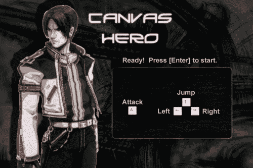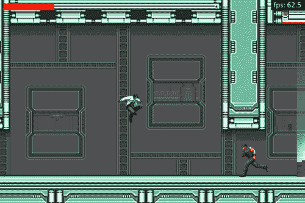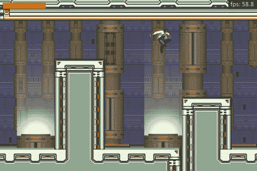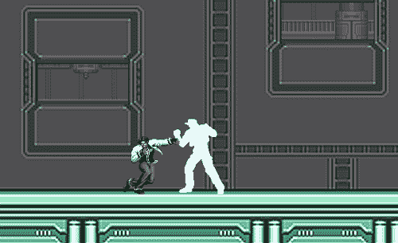

本章的前两个配方涵盖了为英雄和坏人创建精灵表以及关卡图像和边界地图图像的技术。接下来的三个配方涵盖了为英雄、坏人、关卡和生命条对象创建类的步骤。之后的配方涵盖了游戏的**MVC**（**模型**，**视图**，**控制器**）架构，最后一个配方将涵盖 HTML 标记。让我们开始吧！

# 为英雄和敌人创建精灵表

精灵表是包含不同玩家和敌人不同动作的快照的图像文件。精灵表是与数十甚至数百个单独图像一起工作的替代方案，这些图像可能会影响初始加载时间，也会成为图形艺术家的噩梦。Canvas Hero 包含一个英雄的精灵表，一个坏人的精灵表，以及当英雄或坏人受到伤害时使用的一组白色精灵表。

## 准备好了...

在我们开始之前，值得注意的是，即使是最有才华的游戏艺术家也可能花费比编写游戏代码更多的时间来创建游戏图形，这是经常被忽视的事情。对于 Canvas Hero，我们可以通过从我最喜欢的精灵资源网站[`www.spriters-resource.com`](http://www.spriters-resource.com)下载一些精灵来简化我们的生活，这是一个包含大量经典老式游戏的精灵表和关卡图像的免费网站。

## 如何做到这一点

一旦我们找到了适合英雄和坏家伙的精灵表，我们可以裁剪出所需的精灵，然后使用 Adobe Photoshop、Gimp 或其他一些图像编辑软件制作精灵表。这是完成的英雄精灵表：

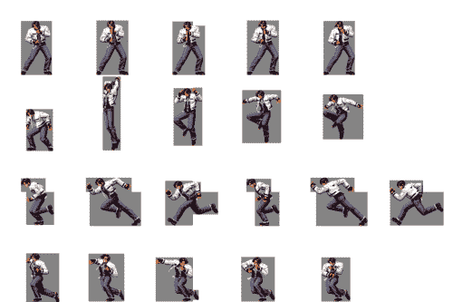

正如您所看到的，英雄的精灵表包含四种动作，站立、跳跃、奔跑和出拳（从上到下）。在创建精灵表时，重要的是所有精灵图像都适合于定义的精灵大小。对于 Canvas Hero，每个精灵图像都适合于 144 x 144 像素的正方形。我们还应确保每个精灵图像面向同一方向，因为我们可以在需要渲染面向另一个方向的精灵时，在程序上水平翻转这些图像。

同样，我们也可以使用相同的过程为坏家伙创建精灵表：

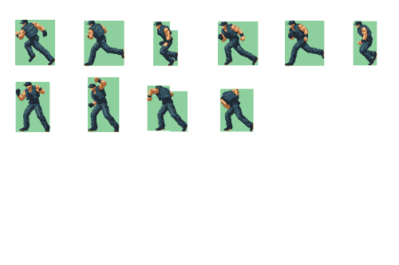

您会注意到坏家伙的精灵表比英雄的精灵表简单得多，因为他们的动作局限于奔跑和战斗（他们从不站立或跳跃）。为了保持一致，我们也可以将坏家伙的精灵设为 144 x 144 像素。

# 创建级别图像和边界地图

现在我们已经为英雄和坏家伙准备好了精灵表，是时候为他们创建一个虚拟世界了。在 Canvas Hero 中，我们的虚拟世界将是一个单一的级别，随着玩家的移动而向左右移动，其中包括墙壁、天花板、地板、平台和洞。在这个配方中，我们将介绍制作级别图像以及边界地图图像的步骤，这些图像以图形方式包含有关级别边界的信息，并用不同颜色标识特殊区域。

## 操作方法...

要为 Canvas Hero 创建级别图像，我们可以使用从[`www.spriters-resource.com`](http://www.spriters-resource.com)下载的一些预先构建的图形，并使用 Photoshop、Gimp 或您选择的其他图像编辑器添加新的平台、洞和悬浮器。为了保持级别的大小适中，我们可以创建一个 6944 x 600 像素的前景级别图像。900 x 600 像素的画布将作为级别的查看窗口。这是包含透明前景和几个悬浮器的级别部分的快照：


接下来，我们可以创建一个背景图像，以营造深度的错觉。这是 Canvas Hero 的完成背景图像：

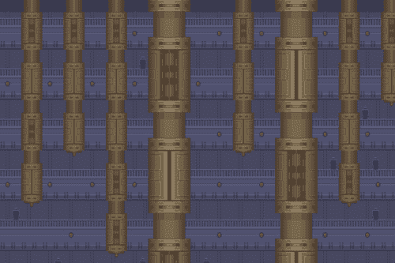

这是前景和背景图像在一起的样子：

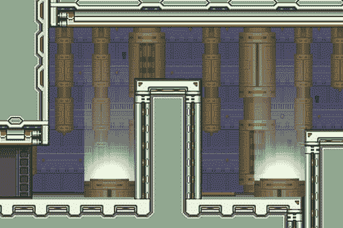

一旦我们完成了前景和背景图像，我们的下一步是创建边界地图。边界地图是一种图形方式，用于将玩家限制在某些区域内，并定义特殊区域。

要为 Canvas Hero 创建边界地图，我们可以从黑色背景开始，将其与级别图像叠加在一起，然后在演员可以自由奔跑的地方绘制品红色矩形，并添加青色矩形来表示悬浮区域。保持背景图像为纯色有助于减小边界地图图像的大小，并减少图像加载时间。以下图像是与前面图像对应的边界地图的一部分：


## 它是如何工作的...

为了更好地理解边界地图的工作原理，让我们走一遍玩家在从左到右穿过前面屏幕时的步骤。还要记住，玩家的 x，y 位置位于精灵图像的中心，大约与英雄的臀部齐平：

+   从左边开始，注意品红色部分，RGB（255,0,255），边界地图非常薄（大约只有 10 像素左右）。这个区域对应于玩家可以在低悬的天花板上方的小空间内驻留。如果玩家在这个区域跳跃，他的垂直上升将被阻止。

+   一旦英雄走过低悬的天花板，他就会来到一个升空舱。请注意，有足够的垂直品红色空间供他向上跳跃并进入青色的升空区域，RGB（0,255,255）。

+   一旦玩家进入青色区域，他就会开始向上飘，直到他能到达屏幕中间的平台。

+   当玩家站在平台上时，天花板就在他的头上，这阻止了他跳跃。

+   玩家可以继续向右走，然后从平台上掉下来。

+   一旦着陆，玩家可以跳入由青色矩形标识的第二个升空区域，这将使他跳到下一个平台上。

## 还有更多...

还有更多内容！

### 边界地图替代方案

如果您不想使用边界地图来定义级别边界，您可以考虑构建一个大的边界点数组，该数组定义了玩家可以驻留的空间区域。这种方法的缺点是，随着级别变得越来越大和复杂，数组的维护可能非常耗时。此外，这种方法可能会产生显着的性能开销，因为不断循环遍历数组并为每个动画帧执行边界计算。

### 级别图像替代方案

为了使本章尽可能简单，我们选择使用一个大图像创建级别。不幸的是，这个图像在加载游戏时是主要的瓶颈。尽管其他图像尺寸较小，包括边界地图，但级别图像约为 1.6 MB，可能需要几秒钟才能加载。如果您的级别很大，或者您只是想尽快加载游戏，您可能会考虑以下替代方案：

+   **懒加载器** - 懒加载器将根据玩家的位置请求级别的各个部分，因此只有可见的和周围的级别块被下载，而不是一次性下载整个级别图像。这种方法的好处是改进了初始加载时间，缺点是您必须以编程方式管理何时下载级别的哪些部分。

+   **平铺布局** - 平铺布局是由平铺图像构建的级别。换句话说，您可以创建小的平铺图像（例如 30 x 30 像素），用于构建地板、墙壁、天花板、升空舱等的纹理，然后使用这些图像来构建级别。这种方法的好处是几乎没有加载时间，因为图像非常小，缺点是级别可能开始看起来有点重复和乏味。

# 为英雄和敌人创建一个 Actor 类

现在我们已经设置好了所有的主要图像，准备好了，是时候进行有趣的部分了（至少在我看来），我们将使用 JavaScript 和 HTML5 画布为我们的虚拟世界注入生命。我们的首要任务是创建一个 Actor 类，其中包含英雄和坏人的属性和方法。换句话说，英雄和坏人都将是 Actor 类的实例。Actor 类将负责使用诸如`moveRight()`和`moveLeft()`等方法指导演员，并负责通过使用精灵表对演员进行动画渲染。

## 如何做...

按照以下步骤创建一个 Actor 类，该类可用于实例化英雄或坏人：

1.  定义`Actor`构造函数：

```js
/*
 * Actor class should have no knowledge
 * of the Level or HealthBar classes to
 * keep it decoupled
 */
function Actor(config){
    this.controller = config.controller;
    this.normalSpriteSheet = config.normalSpriteSheet;
    this.hitSpriteSheet = config.hitSpriteSheet;
    this.x = config.x; // absolute x
    this.y = config.y; // absolute y
    this.playerSpeed = config.playerSpeed; // px / s
    this.motions = config.motions;
    this.startMotion = config.startMotion;
    this.facingRight = config.facingRight;
    this.moving = config.moving;
    this.spriteInterval = config.spriteInterval; // ms
    this.maxHealth = config.maxHealth;
    this.attackRange = config.attackRange;
    this.minAttackInterval = config.minAttackInterval;

    this.SPRITE_SIZE = 144;
    this.FADE_RATE = 1; // full fade in 1s
    this.spriteSheet = this.normalSpriteSheet;
    this.vx = 0;
    this.vy = 0;
    this.spriteSeq = 0;
    this.motion = this.startMotion;
    this.lastMotion = this.motion;
    this.airborne = false;
    this.attacking = false;
    this.canAttack = true;
    this.health = this.maxHealth;
    this.alive = true;
    this.opacity = 1;
    this.timeSinceLastSpriteFrame = 0;
}
```

1.  定义`attack()`方法触发攻击：

```js
Actor.prototype.attack = function(){
    this.attacking = true;
    this.canAttack = false;
    var that = this;
    setTimeout(function(){
       that.canAttack = true;
    }, this.minAttackInterval);
};
```

1.  定义`stop()`方法停止演员移动：

```js
Actor.prototype.stop = function(){
    this.moving = false;
};
```

1.  定义`isFacingRight()`方法：

```js
Actor.prototype.isFacingRight = function(){
    return this.facingRight;
};
```

1.  定义`moveRight()`方法：

```js
Actor.prototype.moveRight = function(){
    this.moving = true;
    this.facingRight = true;
};
```

1.  定义`moveLeft()`方法：

```js
Actor.prototype.moveLeft = function(){
    this.moving = true;
    this.facingRight = false;
};
```

1.  定义`jump()`方法，触发角色跳跃：

```js
Actor.prototype.jump = function(){
    if (!this.airborne) {
        this.airborne = true;
        this.vy = -1;
    }
};
```

1.  定义`draw()`方法：

```js
Actor.prototype.draw = function(pos){
    var context = this.controller.view.context;
    var sourceX = this.spriteSeq * this.SPRITE_SIZE;
    var sourceY = this.motion.index * this.SPRITE_SIZE;

    context.save();
    context.translate(pos.x, pos.y);

    if (this.facingRight) {
        context.translate(this.SPRITE_SIZE, 0);
        context.scale(-1, 1);
    }
    context.globalAlpha = this.opacity;
    context.drawImage(this.spriteSheet, sourceX, sourceY, this.SPRITE_SIZE, this.SPRITE_SIZE, 0, 0, this.SPRITE_SIZE, this.SPRITE_SIZE);
    context.restore();
};
```

1.  定义`fade()`方法，当角色被击败时淡出：

```js
Actor.prototype.fade = function(){
  var opacityChange = this.controller.anim.getTimeInterval() * this.FADE_RATE / 1000;
    this.opacity -= opacityChange;
    if (this.opacity < 0) {
        this.opacity = 0;
    }
};
```

1.  定义`updateSpriteMotion()`方法：

```js
Actor.prototype.updateSpriteMotion = function(){
  // if attack sequence has finished, set attacking = false
    if (this.attacking && this.spriteSeq == this.motion.numSprites - 1) {
        this.attacking = false;
    }

    if (this.attacking) {
        this.motion = this.motions.ATTACKING;
    }
    else {
        if (this.airborne) {
            this.motion = this.motions.AIRBORNE;
        }
        else {
            this.vy = 0;
            if (this.moving) {
                this.motion = this.motions.RUNNING;
            }
            else {
                this.motion = this.motions.STANDING;
            }
        }
    }
};
```

1.  定义`updateSpriteSeqNum()`方法，递增或重置每个精灵间隔的精灵序列号：

```js
Actor.prototype.updateSpriteSeqNum = function() {
    var anim = this.controller.anim;
    this.timeSinceLastSpriteFrame += anim.getTimeInterval();

    if (this.timeSinceLastSpriteFrame > this.spriteInterval) {
        if (this.spriteSeq < this.motion.numSprites - 1) {
            this.spriteSeq++;
        }
        else {
            if (this.motion.loop) {
                this.spriteSeq = 0;
            }
        }

        this.timeSinceLastSpriteFrame = 0;
    }

    if (this.motion != this.lastMotion) {
        this.spriteSeq = 0;
        this.lastMotion = this.motion;
    }
};
```

1.  定义`damage()`方法，减少角色的健康值，并将精灵表设置为被击中的精灵表，导致角色在短暂的时间内闪烁白色：

```js
Actor.prototype.damage = function(){
    this.health = this.health <= 0 ? 0 : this.health - 1;

    this.spriteSheet = this.hitSpriteSheet;
    var that = this;
    setTimeout(function(){
        that.spriteSheet = that.normalSpriteSheet;
    }, 200);
};
```

1.  定义`getCenter()`方法，返回角色中心的位置：

```js
Actor.prototype.getCenter = function(){
    return {
        x: Math.round(this.x) + this.SPRITE_SIZE / 2,
        y: Math.round(this.y) + this.SPRITE_SIZE / 2
    };
};
```

### 它是如何工作的...

`Actor`类的想法是创建一个可以用于实例化英雄和坏人的类。它包括控制角色的方法，如`moveRight()`、`moveLeft()`、`jump()`和`attack()`，游戏引擎或人类玩家可以调用。游戏引擎将使用这些方法来控制坏人，人类玩家将使用这些方法通过键盘按键来控制英雄。

除了控件，`Actor`类还通过`updateSpriteMotion()`方法更新精灵动画，并通过`updateSpriteSeqNum()`方法递增或循环精灵序列号。

最后，`draw()`方法挑选出与角色动作对应的精灵图像，如果角色面向右侧，则水平翻转图像，然后使用画布上下文的`drawImage()`方法在屏幕上绘制角色。

## 另请参阅...

+   *在第三章中裁剪图像*

+   *在第四章中翻译画布上下文*

+   *在第四章中创建镜像变换*

# 创建一个 Level 类

在这个示例中，我们将创建一个 Level 类，用于渲染关卡并提供对边界地图的 API。

## 如何做...

按照以下步骤创建一个 Level 类：

1.  定义`Level`构造函数：

```js
/*
 * Level class should have no knowledge
 * of the Actor or HealthBar classes to
 * keep it decoupled
 */
function Level(config){
  this.controller = config.controller;
    this.x = config.x;
    this.y = config.y;
    this.leftBounds = config.leftBounds;
    this.rightBounds = config.rightBounds;
  this.boundsData = null;
    this.GRAVITY = 3; // px / second²
    this.MID_RGB_COMPONENT_VALUE = 128; 
    this.LEVEL_WIDTH = 6944;

    this.setBoundsData();
}
```

1.  定义`setBoundsData()`方法，从边界地图图像中提取区域数据：

```js
Level.prototype.setBoundsData = function(){
  var controller = this.controller;
  var canvas = controller.view.canvas;
  var context = controller.view.context;
    canvas.width = 6944;
    context.drawImage(controller.images.levelBounds, 0, 0);
    imageData = context.getImageData(0, 0, 6944, 600);
    this.boundsData = imageData.data;
    canvas.width = 900;
};
```

1.  定义`draw()`方法，绘制背景图像和关卡图像：

```js
Level.prototype.draw = function(){
  var context = this.controller.view.context;
    context.drawImage(this.controller.images.background, 0, 0);
    context.drawImage(this.controller.images.level, this.x, this.y);
};
```

1.  定义`getZoneInfo()`方法，返回边界地图中某一点的区域信息：

```js
Level.prototype.getZoneInfo = function(pos){
  var x = pos.x;
  var y = pos.y;
    var red = this.boundsData[((this.LEVEL_WIDTH * y) + x) * 4];
    var green = this.boundsData[((this.LEVEL_WIDTH * y) + x) * 4 + 1];
    var blue = this.boundsData[((this.LEVEL_WIDTH * y) + x) * 4 + 2];

    var inBounds = false;
    var levitating = false;

    /*
     * COLOR KEY
     *
     * PINK: 255 0   255
     * CYAN: 0   255 255
     *
     * COLOR NOTATION
     *
     * PINK: player is in bounds and can jump
     * CYAN: player is in bounds and is levitating
     */
  var mid = this.MID_RGB_COMPONENT_VALUE;
    if ((red > mid && green < mid && blue > mid) || (red < mid && green > mid && blue > mid)) {
        inBounds = true;
    }
    if (red < mid && green > mid && blue > mid) {
        levitating = true;
    }

    return {
        inBounds: inBounds,
        levitating: levitating
    };
};
```

## 它是如何工作的...

`Level`类中的大部分工作是在`setBoundsData()`方法和`getZoneInfo()`方法中完成的。`setBoundsData()`方法将边界地图图像转换为像素数据数组，使用画布上下文的`getImageData()`方法。`getZoneInfo()`方法用于访问边界地图中的点，然后返回相应的区域信息。

对于 Canvas Hero，区域信息对象包含两个标志：`inBounds`和`levitating`。如果边界地图中对应的像素为青色，则该点对应于一个在边界内且也在悬浮区域内的区域。如果边界地图中对应的像素为品红色，则该点对应于一个在边界内但不在悬浮区域内的区域。最后，如果边界地图中对应的像素为黑色，则意味着该点不在边界内或悬浮区域内。

## 另请参阅...

+   *在第三章中绘制图像*

+   *在第三章中获取图像数据*

# 创建一个 Health Bar 类

在这个示例中，我们将创建一个 Health Bar 类，用于更新和渲染英雄的健康显示。

## 如何做...

按照以下步骤创建一个健康条类：

1.  定义`HealthBar`构造函数：

```js
/*
 * HealthBar class should have no knowledge
 * of the Actor or Level classes to
 * keep it decoupled
 */
function HealthBar(config){
  this.controller = config.controller;
    this.maxHealth = config.maxHealth;
    this.x = config.x;
    this.y = config.y;
    this.maxWidth = config.maxWidth;
    this.height = config.height;

    this.health = this.maxHealth;
}
```

1.  定义`setHealth()`方法，设置健康值：

```js
HealthBar.prototype.setHealth = function(health){
    this.health = health;
};
```

1.  定义`draw()`方法，绘制健康条：

```js
HealthBar.prototype.draw = function(){
  var context = this.controller.view.context;
    context.beginPath();
    context.rect(this.x, this.y, this.maxWidth, this.height);
    context.fillStyle = "black";
    context.fill();
    context.closePath();

    context.beginPath();
    var width = this.maxWidth * this.health / this.maxHealth;
    context.rect(this.x, this.y, width, this.eight);
    context.fillStyle = "red";
    context.fill();
    context.closePath();
};

```

## 它是如何工作的...

`HealthBar`对象有一个简单的构造函数，初始化了血条的位置和大小，并包含两个方法，`setHealth()`和`draw()`。`setHealth()`方法设置`HealthBar`对象的`health`属性，`draw()`方法使用画布上下文的`rect()`方法绘制血条。

# 创建一个控制器类

现在我们已经拥有游戏中对象的所有图像和类，我们下一个任务是构建游戏引擎。Canvas Hero 采用标准的 MVC 架构构建，将数据、呈现和控制方法分离。在这个示例中，我们将创建一个控制器类，负责实例化模型和视图，初始化游戏，控制游戏状态和管理键盘事件。

## 如何做...

按照以下步骤为 Canvas Hero 创建控制器：

1.  定义`Controller`构造函数：

```js
/*
 * Game controller
 * 
 * The controller is responsible for instantiating
 * the view and the model, initializing the game,
 * controlling the game state, and managing keyboard events
 */
function Controller(canvasId){
    this.imageSources = {
        levelBounds: "img/level_bounds.png",
        level: "img/level.png",
        heroSprites: "img/hero_sprites.png",
        heroHitSprites: "img/hero_hit_sprites.png",
        badGuySprites: "img/bad_guy_sprites.png",
        badGuyHitSprites: "img/bad_guy_hit_sprites.png",
        background: "img/background.png",
        readyScreen: "img/readyScreen.png",
        gameoverScreen: "img/gameoverScreen.png",
        winScreen: "img/winScreen.png"
    };
    this.images = {};

    this.states = {
        INIT: "INIT",
        READY: "READY",
        PLAYING: "PLAYING",
        WON: "WON",
        GAMEOVER: "GAMEOVER"
    };

  this.keys = {
    ENTER: 13,
    UP: 38,
    LEFT: 37,
    RIGHT: 39,
    A: 65 
  };

  this.anim = new Animation(canvasId);
    this.state = this.states.INIT;
    this.model = new Model(this);
    this.view = new View(this);
  this.avgFps = 0;
  this.leftKeyup = true;
  this.rightKeyup = true;
    this.addKeyboardListeners();
    this.loadImages();
}
```

1.  定义`loadImages()`方法，加载所有游戏图像，然后在它们全部加载完毕时调用`initGame()`：

```js
Controller.prototype.loadImages = function(){
  /*
   * we need to load the loading image first
   * so go ahead and insert it into the dom
   * and them load the rest of the images
   */
  this.view.canvas.style.background = "url('img/loadingScreen.png')";

    var that = this;
    var loadedImages = 0;
    var numImages = 0;
    for (var src in this.imageSources) {
        numImages++;
    }
    for (var src in this.imageSources) {
        this.images[src] = new Image();
        this.images[src].onload = function(){
            if (++loadedImages >= numImages) {
                that.initGame();
            }
        };
        this.images[src].src = this.imageSources[src];
    }
};
```

1.  定义`addKeyboardListeners()`方法，将键盘事件监听器附加到游戏上：

```js
Controller.prototype.addKeyboardListeners = function(){
    var that = this;
    document.onkeydown = function(evt){
        that.handleKeydown(evt);
    };
    document.onkeyup = function(evt){
        that.handleKeyup(evt);
    };
};
```

1.  定义`handleKeyUp()`方法，当释放键时触发：

```js
Controller.prototype.handleKeyup = function(evt){
    keycode = ((evt.which) || (evt.keyCode));

    switch (keycode) {
        case this.keys.LEFT: 
            this.leftKeyup = true;
            if (this.leftKeyup && this.rightKeyup) {
                this.model.hero.stop();
            }
            break;

        case this.keys.UP: 
            break;

        case this.keys.RIGHT: 
            this.rightKeyup = true;
            if (this.leftKeyup && this.rightKeyup) {
                this.model.hero.stop();
            }
            break;
    }
};
```

1.  定义`handleKeyDown()`方法，当按键按下时触发：

```js
Controller.prototype.handleKeydown = function(evt){
    var that = this;
    keycode = ((evt.which) || (evt.keyCode));
    switch (keycode) {
        case this.keys.ENTER: // enter
            if (this.state == this.states.READY) {
                this.state = this.states.PLAYING;
                // start animation
                this.anim.start();
            }
            else if (this.state == this.states.GAMEOVER || this.state == this.states.WON) {
                this.resetGame();
                this.state = this.states.PLAYING;
            }
            break;
        case this.keys.LEFT: 
            this.leftKeyup = false;
            this.model.hero.moveLeft();
            break;

        case this.keys.UP: 
            this.model.hero.jump();
            break;

        case this.keys.RIGHT: 
            this.rightKeyup = false;
            this.model.hero.moveRight();
            break;

        case this.keys.A: // attack
          var model = this.model;
      var hero = model.hero; 
            hero.attack();
            setTimeout(function(){
                for (var n = 0; n < model.badGuys.length; n++) {
                    (function(){
                        var badGuy = model.badGuys[n];
                        if (model.nearby(hero, badGuy)
              && ((badGuy.x - hero.x > 0 && hero.isFacingRight()) || (hero.x - badGuy.x > 0 && !hero.isFacingRight()))) {
                            badGuy.damage();
                        }
                    })();
                }
            }, 200);
            break;
    }
};
```

1.  定义`initGame()`方法，初始化游戏：

```js
Controller.prototype.initGame = function(){
  var model = this.model;
  var view = this.view;
    model.initLevel();
    model.initHero();
    model.initBadGuys();
    model.initHealthBar();

    // set stage method
    this.anim.setStage(function(){
        model.updateStage();
        view.stage();
    });

    // game is now ready to play
    this.state = this.states.READY;
    view.drawScreen(this.images.readyScreen);
};
```

1.  定义`resetGame()`方法，通过重新初始化游戏对象重置游戏：

```js
Controller.prototype.resetGame = function(){
    var model = this.model;
    model.level = null;
    model.hero = null;
    model.healthBar = null;
    model.badGuys = [];

    model.initLevel();
    model.initHero();
    model.initBadGuys();
    model.initHealthBar();
};
```

## 工作原理...

游戏控制器最重要的作用是通过游戏状态控制游戏的流程。在 Canvas Hero 中，第一个游戏状态是加载状态。这是玩家可以在游戏加载时阅读游戏玩法的状态。一旦游戏加载完成，控制器负责将游戏状态更改为准备状态。在这个状态下，游戏等待用户按 Enter 键继续。一旦用户按下 Enter 键，控制器现在将游戏状态更改为游戏状态。

此刻，实际游戏开始，用户完全控制英雄。如果玩家的健康值降到零，或者玩家掉入洞中，控制器将把游戏状态更改为游戏结束状态。另一方面，如果玩家成功击败所有敌人，控制器将把游戏状态更改为胜利状态，并祝贺英雄取得了惊人的成就。看一下以下状态机：

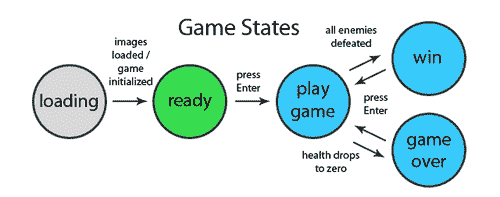

除了控制游戏状态，控制器还负责管理键盘事件。键盘事件通过`addKeyboardListeners()`方法附加。

# 创建一个模型类

在这个示例中，我们将创建一个模型类，负责初始化和更新英雄、坏人、关卡和血条。这些对象可以被视为游戏的“数据”。

## 如何做...

按照以下步骤为 Canvas Hero 创建模型：

1.  定义`Model`构造函数：

```js
/*
 * Game model
 * 
 * The model is responsible for initializing and
 * updating the hero, level, bad guys, and health bar
 */
function Model(controller){
    this.controller = controller;
    this.healthBar = null;
    this.hero = null;
    this.level = null;
    this.badGuys = []; // array of bad guys
    this.heroCanvasPos = {};
}
```

1.  定义`removeDefeatedBadGuys()`方法，循环遍历坏人数组，然后移除已经死亡的坏人：

```js
Model.prototype.removeDefeatedBadGuys = function(){
    for (var n = 0; n < this.badGuys.length; n++) {
        var badGuy = this.badGuys[n];
        if (!badGuy.alive && badGuy.opacity == 0) {
            this.badGuys.splice(n, 1);
        }
    }
};
```

1.  定义`updateBadGuys()`方法：

```js
Model.prototype.updateBadGuys = function(){
    var that = this;
    for (var n = 0; n < this.badGuys.length; n++) {
        var badGuy = this.badGuys[n];
        if (badGuy.alive
      && this.hero.alive
      && !badGuy.attacking
      && badGuy.canAttack 
      && this.nearby(this.hero, badGuy)
      && ((badGuy.x - this.hero.x > 0 && !badGuy.isFacingRight()) || (this.hero.x - badGuy.x > 0 && badGuy.isFacingRight()))) {
      badGuy.attack();
            setTimeout(function(){
                that.hero.damage();
            }, 200);
        }
        this.updateActor(badGuy);
    }
};
```

1.  定义`updateStage()`方法，更新每个动画帧的所有游戏对象：

```js
Model.prototype.updateStage = function(){
    var controller = this.controller;
    var canvas = controller.view.canvas;
    if (controller.state == controller.states.PLAYING) {
        this.removeDefeatedBadGuys();

        // if hero dies then set state to GAMEOVER
        if (!this.hero.alive && controller.state == controller.states.PLAYING) {
            controller.state = controller.states.GAMEOVER;
        }

        // if all bad guys defeated, change state to WON
        if (this.badGuys.length == 0) {
            controller.state = controller.states.WON;
        }

        // move bad guys around
        this.moveBadGuys();

        // update level position
        this.updateLevel();

    /*
     * update bad guys and also see
     * if they can attack the hero
     */
        this.updateBadGuys();

        // update hero
        var oldHeroX = this.hero.x;
        this.updateActor(this.hero);
        this.updateHeroCanvasPos(oldHeroX);
        // update health bar
        this.healthBar.setHealth(this.hero.health);

        // if hero falls into a hole set health to zero
        if (this.hero.y > canvas.height - this.hero.spriteSize * 2 / 3) {
            this.hero.health = 0;
        }

        // update avg fps
        var anim = controller.anim;
        if (anim.getFrame() % 20 == 0) {
            this.controller.avgFps = Math.round(anim.getFps() * 10) / 10;
        }
    }
};
```

1.  定义`initHealthBar()`方法，初始化血条：

```js
Model.prototype.initHealthBar = function(){
    this.healthBar = new HealthBar({
        controller: this.controller,
        maxHealth: this.hero.maxHealth,
        x: 10,
        y: 10,
        maxWidth: 150,
        height: 20
    });
};
```

1.  定义`initLevel()`方法，初始化关卡：

```js
Model.prototype.initLevel = function(){
    this.level = new Level({
        controller: this.controller,
        x: 0,
        y: 0,
        leftBounds: 100,
        rightBounds: 500
    });
};
```

1.  定义`initHero()`方法，初始化英雄：

```js
	Model.prototype.initHero = function(){
    // initialize Hero
    var heroMotions = {
        STANDING: {
            index: 0,
            numSprites: 5,
            loop: true
        },
        AIRBORNE: {
            index: 1,
            numSprites: 5,
            loop: false
        },
        RUNNING: {
            index: 2,
            numSprites: 6,
            loop: true
        },
        ATTACKING: {
            index: 3,
            numSprites: 5,
            loop: false
        }
    };

    this.hero = new Actor({
        controller: this.controller,
        normalSpriteSheet: this.controller.images.heroSprites,
        hitSpriteSheet: this.controller.images.heroHitSprites,
        x: 30,
        y: 381,
        playerSpeed: 300,
        motions: heroMotions,
        startMotion: heroMotions.STANDING,
        facingRight: true,
        moving: false,
        spriteInterval: 90,
        maxHealth: 3,
        attackRange: 100,
        minAttackInterval: 200
    });

    this.heroCanvasPos = {
        x: this.hero.x,
        y: this.hero.y
    };
};
```

1.  定义`initBadGuys()`方法，初始化一个坏人数组：

```js
Model.prototype.initBadGuys = function(){
    // notice that AIRBORNE and RUNNING
    // both use the same sprite animation
    var badGuyMotions = {
        RUNNING: {
            index: 0,
            numSprites: 6,
            loop: true
        },
        AIRBORNE: {
            index: 0,
            numSprites: 4,
            loop: false
        },
        ATTACKING: {
            index: 1,
            numSprites: 4,
            loop: false
        }
    };

    var badGuyStartConfig = [{
        x: 600,
        facingRight: true
    }, {
        x: 1460,
        facingRight: true
    }, {
        x: 2602,
        facingRight: true
    }, {
        x: 3000,
        facingRight: true
    }, {
        x: 6402,
        facingRight: true
    }, {
        x: 6602,
        facingRight: true
    }];

    for (var n = 0; n < badGuyStartConfig.length; n++) {
        this.badGuys.push(new Actor({
            controller: this.controller,
            normalSpriteSheet: this.controller.images.badGuySprites,
            hitSpriteSheet: this.controller.images.badGuyHitSprites,
            x: badGuyStartConfig[n].x,
            y: 381,
            playerSpeed: 100,
            motions: badGuyMotions,
            startMotion: badGuyMotions.RUNNING,
            facingRight: badGuyStartConfig[n].facingRight,
            moving: true,
            spriteInterval: 160,
            maxHealth: 3,
            attackRange: 100,
            minAttackInterval: 2000
        }));
    }
};
```

1.  定义`moveBadGuys()`方法，作为简单的 AI 引擎：

```js
Model.prototype.moveBadGuys = function(){
    var level = this.level;
    for (var n = 0; n < this.badGuys.length; n++) {
        var badGuy = this.badGuys[n];

        if (badGuy.alive) {
            if (badGuy.isFacingRight()) {
                badGuy.x += 5;
                if (!level.getZoneInfo(badGuy.getCenter()).inBounds) {
                    badGuy.facingRight = false;
                }
                badGuy.x -= 5;
            }

            else {
                badGuy.x -= 5;
                if (!level.getZoneInfo(badGuy.getCenter()).inBounds) {
                    badGuy.facingRight = true;
                }
                badGuy.x += 5;
            }
        }
    }
};
```

1.  定义`updateLevel()`方法：

```js
Model.prototype.updateLevel = function(){
    var hero = this.hero;
    var level = this.level;
    level.x = -hero.x + this.heroCanvasPos.x;
};
```

1.  定义`updateHeroCanvasPos()`方法，更新英雄相对于画布的位置：

```js
Model.prototype.updateHeroCanvasPos = function(oldHeroX){
    this.heroCanvasPos.y = this.hero.y;
    var heroDiffX = this.hero.x - oldHeroX;
    var newHeroCanvasPosX = this.heroCanvasPos.x + heroDiffX;
    // if moving right and not past right bounds
    if (heroDiffX > 0 && newHeroCanvasPosX < this.level.rightBounds) {
        this.heroCanvasPos.x += heroDiffX;
    }
    // if moving left and not past left bounds
    if (heroDiffX < 0 && newHeroCanvasPosX > this.level.leftBounds) {
        this.heroCanvasPos.x += heroDiffX;
    }

  if (this.hero.x < this.level.leftBounds) {
    this.heroCanvasPos.x = this.hero.x;
  }
};
```

1.  定义`updateActor()`方法：

```js
Model.prototype.updateActor = function(actor){
    if (actor.alive) {
        if (actor.health <= 0 || actor.y + actor.SPRITE_SIZE > this.controller.view.canvas.height) {
            actor.alive = false;
        }
        else {
      this.updateActorVY(actor);            
      this.updateActorY(actor);
      this.updateActorX(actor);

            actor.updateSpriteMotion();
      actor.updateSpriteSeqNum();
        }
    }
    else {
        if (actor.opacity > 0) {
            actor.fade();
        }
    }
};
```

1.  定义`updateActorVY()`方法，使用重力的向下力和升力舱的向上力来更新角色的垂直速度：

```js
Model.prototype.updateActorVY = function(actor) {
  var anim = this.controller.anim;
  var level = this.level;

    // apply gravity (+y)
    var gravity = this.controller.model.level.GRAVITY;
    var speedIncrementEachFrame = gravity * anim.getTimeInterval() / 1000; // pixels / second
    actor.vy += speedIncrementEachFrame;        

    // apply levitation (-y)
    if (level.getZoneInfo(actor.getCenter()).levitating) {
        actor.vy = (65 - actor.y) / 200;
    }
};
```

1.  定义`updateActorY()`方法，根据角色的垂直速度更新角色的 y 位置：

```js
Model.prototype.updateActorY = function(actor) {
  var anim = this.controller.anim;
  var level = this.level;
    var oldY = actor.y;
    actor.y += actor.vy * anim.getTimeInterval();

    if (level.getZoneInfo(actor.getCenter()).inBounds) {
        actor.airborne = true;
    }
    else {
        actor.y = oldY;

        // handle case where player has fallen to the ground
        // if vy is less than zero, this means the player has just
        // hit the ceiling, in which case we can simply leave
        // this.y as oldY to prevent the player from going
        // past the ceiling
        if (actor.vy > 0) {
            while (level.getZoneInfo(actor.getCenter()).inBounds){
                actor.y++;
            }
            actor.y--;
            actor.vy = 0;
            actor.airborne = false;
        }
    }
};
```

1.  定义`updateActorX()`方法，更新角色的 x 位置：

```js
Model.prototype.updateActorX = function(actor) {
  var anim = this.controller.anim;
  var level = this.level;
  var oldX = actor.x;
  var changeX = actor.playerSpeed * (anim.getTimeInterval() / 1000);
    if (actor.moving) {
        actor.facingRight ? actor.x += changeX : actor.x -= changeX;
    }

    if (!level.getZoneInfo(actor.getCenter()).inBounds) {
        actor.x = oldX;

        while (level.getZoneInfo(actor.getCenter()).inBounds) {
            actor.facingRight ? actor.x++ : actor.x--;
        }

        // reposition to nearest placement in bounds
        actor.facingRight ? actor.x-- : actor.x++;
    }
};
```

1.  定义`nearby()`方法，确定两个角色是否彼此靠近：

```js
Model.prototype.nearby = function(actor1, actor2){
    return (Math.abs(actor1.x - actor2.x) < actor1.attackRange)
    && Math.abs(actor1.y - actor2.y) < 30;
};
```

## 它是如何工作的...

在 MVC 架构中，模型被认为是架构的“核心”，因为它代表数据层。由于 Canvas Hero 是一个游戏，我们的数据包括英雄、坏家伙、级别和血条对象。这些对象中的每一个都包含必须在每个动画帧期间更新和访问的属性。

Canvas Hero 的模型有三个关键责任：

+   初始化游戏对象

+   更新游戏对象

+   处理坏家伙的人工智能

在我们的模型中，可以说最有趣的方法是`moveBadGuys()`方法。这个方法可以被认为是我们游戏引擎的“人工智能”。我加了引号是因为说实话，在 Canvas Hero 中，坏家伙们相当愚蠢。`moveBadGuys()`方法循环遍历所有坏家伙对象，使用`Level`对象的`getZoneInfo()`方法确定它们是否靠近墙壁，然后在它们即将撞到墙壁时改变它们的方向。

## 还有更多...

如果你想创建一个更具挑战性的游戏，你可以考虑通过让坏家伙们具有跳跃或使用升空舱的能力来加强`moveBadGuys()`方法。

## 另请参阅...

+   *在第五章中创建一个动画类*

# 创建一个 View 类

在这个示例中，我们将创建 View 类，这是三个 MVC 类中最简单的一个。View 类负责绘制状态屏幕图像，并通过调用`draw()`方法为每个级别、每个坏家伙、英雄和血条渲染每个动画帧。此外，View 类还在屏幕右上角渲染一个方便的 FPS 显示，以便我们可以看到游戏的表现如何。

## 如何做...

按照以下步骤为 Canvas Hero 创建视图：

1.  定义`View`构造函数：

```js
/*
 * Game view
 * 
 * The view has access to the canvas context
 * and is responsible for the drawing logic
 */
function View(controller){
    this.controller = controller;
    this.canvas = controller.anim.getCanvas();
    this.context = controller.anim.getContext();
}
```

1.  定义`drawScreen()`方法，绘制加载、就绪、游戏结束或胜利状态屏幕：

```js
View.prototype.drawScreen = function(screenImg){
    this.context.drawImage(screenImg, 0, 0, this.canvas.width, this.canvas.height);
};
```

1.  定义`drawBadGuys()`方法，绘制坏家伙们：

```js
View.prototype.drawBadGuys = function() {
    var controller = this.controller;
    var model = controller.model;
  for (var n = 0; n < model.badGuys.length; n++) {
      var badGuy = model.badGuys[n];
    var offsetPos = {
      x: badGuy.x + model.level.x,
      y: badGuy.y + model.level.y
    };
      badGuy.draw(offsetPos);
  }
};
```

1.  定义`drawFps()`方法，绘制游戏右上角的 FPS 值，以便我们可以看到游戏的表现如何：

```js
View.prototype.drawFps = function() {
    var context = this.context;
    context.fillStyle = "black";
    context.fillRect(this.canvas.width - 100, 0, 100, 30);
    context.font = "18pt Calibri";
    context.fillStyle = "white";
    context.fillText("fps: " + this.cntroller.avgFps.toFixed(1), this.canvas.width - 93, 22);
};
```

1.  定义`stage()`方法，绘制屏幕上的所有对象：

```js
View.prototype.stage = function(){
    var controller = this.controller;
    var model = controller.model;
    if (controller.state == controller.states.PLAYING || controller.state == controller.states.GAMEOVER || controller.state == controller.states.WON) {
        model.level.draw();
    this.drawBadGuys();
        model.hero.draw(model.heroCanvasPos);
        model.healthBar.draw();

        // draw screen overlay
        if (controller.state == controller.states.GAMEOVER) {
            this.drawScreen(controller.images.gameoverScreen);
        }
        else if (controller.state == controller.states.WON) {
            this.drawScreen(controller.images.winScreen);
        }

        this.drawFps();
    }
    else if (controller.state == controller.states.READY) {
        this.drawScreen(controller.images.readyScreen);
    }
};
```

## 它是如何工作的...

如前所述，`View`类的主要责任是绘制状态屏幕和游戏屏幕。Canvas Hero 有四个不同的状态屏幕：

+   加载状态

+   就绪状态

+   游戏结束状态

+   胜利状态

每当游戏状态改变并且需要状态屏幕时，控制器调用`View`对象的`drawScreen()`方法。以下是每个游戏状态屏幕的截图：

加载状态：

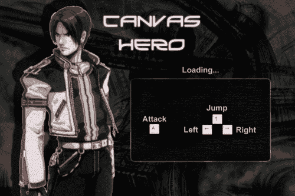

就绪状态：


游戏结束状态：

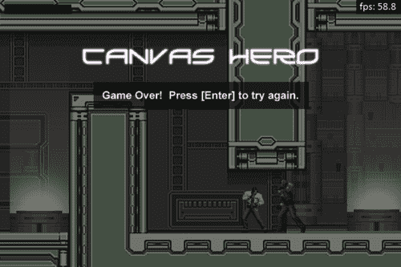

胜利状态：


## 另请参阅...

+   *强调画布并显示 FPS*在第五章中

# 设置 HTML 文档并开始游戏

现在我们已经拥有游戏的所有部分，包括图形、角色类、级别、血条和一个完整的游戏引擎，是时候通过设置 HTML 文档并开始游戏来将它们全部联系在一起了。

## 如何做...

按照以下步骤设置 HTML 文档并开始游戏：

1.  链接到 JavaScript 文件：

```js
</style>
<script src="img/animation.js">
</script>
<script src="img/Controller.js">
</script>
<script src="img/Model.js">
</script>
<script src="img/View.js">
</script>
<script src="img/Level.js">
</script>
<script src="img/Actor.js">
</script>
<script src="img/HealthBar.js">
</script>
```

1.  初始化控制器：

```js
<script>
    window.onload = function(){
        new Controller("myCanvas");
    };
</script>
```

1.  将画布嵌入 HTML 文档的主体内：

```js
<canvas id="myCanvas" width="900" height="600">
</canvas>
```

## 它是如何工作的...

正如您所看到的，HTML 标记非常简单。它的目的纯粹是链接到所需的 JavaScript 文件，嵌入画布标记，并初始化控制器。控制器初始化模型和视图。模型初始化英雄、坏人、关卡和生命条。一旦图像加载完成，游戏状态改变为准备状态，玩家按下回车键游戏开始。

## 还有更多...

您现在已经准备好玩游戏并拯救世界了！如果您按照模型配方中定义的方式初始化了英雄和坏人的健康值为三个单位，那么英雄在游戏结束之前最多可以承受三次打击，每个坏人需要三次打击才能被击败。我发现最容易击败坏人的方法是跳过他们并反复击打他们的背部，直到他们被击败（我知道这很便宜，但它有效）。跳进升降舱并在空中飘浮一段时间，等待合适的时机，像忍者一样从上方袭击坏人也非常有趣。

如果您将本章作为自己的横向卷轴游戏的基础，这里有一些其他功能可以考虑添加：

+   使用 HTML5 音频标记进行跳跃、着陆和拳击的音效

+   暂停功能，可以冻结游戏直到恢复

+   计时器和最高分

+   更多关卡、敌人和 boss

+   增强道具

+   使用 HTML5 本地存储保存游戏状态或通过在在线数据库中保存状态的选项

+   您可以想象的其他任何东西

## 另请参阅...

+   *在第五章中创建一个动画类*
