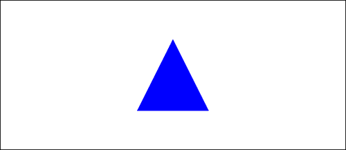
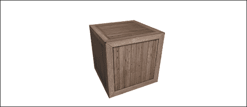
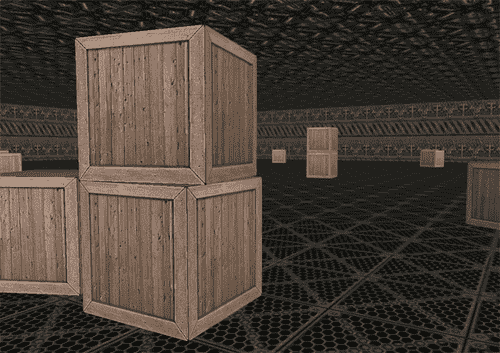

# 第九章：介绍 WebGL

在本章中，我们将涵盖：

+   创建一个简化 WebGL API 的 WebGL 包装器

+   创建一个三角形平面

+   在 3D 空间中旋转一个三角形平面

+   创建一个旋转的立方体

+   添加纹理和光照

+   创建一个可以探索的 3D 世界

# 介绍

最初，当我开始写这本书时，我原本打算只涵盖 HTML5 画布的 2D 上下文（我坚信大多数使用画布的人都会使用这个上下文）。我也原本打算覆盖在 2D 上下文中使用 3D 投影方法和矢量运算渲染 3D 形状的技术。人们已经忙着为 2D 上下文创建一些非常令人难以置信的 3D JavaScript 库，包括 Kevin Roast 的 K3D 库（本书的审阅者之一），以及 Dean McNamee 的 Pre3d 库。

当我接近写这一章时，WebGL——一个真正的 3D 上下文——开始在 Web 上主导 3D 画布演示。WebGL 代表**基于 Web 的图形库**，它基于 OpenGL ES 2.0，提供了一个用于 3D 图形的 API。因为 WebGL 通过直接将缓冲区推送到图形卡上来渲染 3D 模型，利用硬件加速，它的性能要比 2D 上下文、3D 投影库的对手好得多。此外，它还暴露了 OpenGL 已经完成的多年工作。正如你现在可能已经想到的那样，我决定覆盖 WebGL，而不是覆盖 2D 上下文的 3D 投影库，因为我非常相信 WebGL 将成为不久的将来 3D 应用的标准。WebGL 对于想要在 Web 上创建 3D 游戏或 3D 模型的人来说特别有趣。

本章将通过涵盖缓冲区、着色器、透视和模型视图矩阵、法线、纹理、光照、摄像机处理等概念，让你开始学习 WebGL 的基础知识。让我们开始吧！

# 创建一个简化 WebGL API 的 WebGL 包装器

如果你已经提前查看了这个食谱的代码，并且对 OpenGL 或 WebGL 不是很熟悉，你可能会感到非常不知所措，这是有充分理由的。尽管 WebGL 非常强大，但初次接触时学习曲线相当陡峭。坦率地说，执行简单任务需要很多行代码。因此，我发现使用 WebGL 包装器非常方便，它可以将繁琐的代码块简化为简单的方法。这个食谱提供了创建一个简单的 WebGL 包装器的步骤，这个包装器将用于本章的所有食谱。让我们开始吧！

### 提示

由于 WebGL 包装器相当复杂，你可能会考虑从本书的在线资源中获取 WebGL 包装器代码[`www.html5canvastutorials.com/cookbook/`](http://www.html5canvastutorials.com/cookbook)。

## 操作步骤...

按照以下步骤创建一个 WebGL 包装器对象来简化 WebGL API，或者转到[`www.html5canvastutorials.com/cookbook`](http://www.html5canvastutorials.com/cookbook)并从资源部分下载`WebGL.js`：

1.  开始定义 WebGL 构造函数，初始化画布上下文并定义动画属性：

```js
var WebGL = function(canvasId){
    this.canvas = document.getElementById(canvasId);
    this.context = this.canvas.getContext("experimental-webgl");
    this.stage = undefined;

    // Animation 
    this.t = 0;
    this.timeInterval = 0;
    this.startTime = 0;
    this.lastTime = 0;
    this.frame = 0;
    this.animating = false;
```

1.  使用*Paul Irish*的`requestAnimFrame` shim 来创建一个跨浏览器的`requestAnimationFrame`函数，它使浏览器能够处理我们动画的 FPS：

```js
    // provided by Paul Irish
    window.requestAnimFrame = (function(callback){
        return window.requestAnimationFrame ||
        window.webkitRequestAnimationFrame ||
        window.mozRequestAnimationFrame ||
        window.oRequestAnimationFrame ||
        window.msRequestAnimationFrame ||
        function(callback){
            window.setTimeout(callback, 1000 / 60);
        };
    })();
```

1.  由于*Brandon Jones*的`glMatrix`使用全局变量，我们可以封装它们，这样这些变量就不能在包装器外部被改变：

```js
   /*
   * encapsulte mat3, mat4, and vec3 from
   * glMatrix globals
   */
    this.mat3 = mat3;
    this.mat4 = mat4;
 this.vec3 = vec3;
```

1.  定义着色器类型常量并初始化模型视图矩阵、透视矩阵和视口尺寸：

```js
    // shader type constants
    this.BLUE_COLOR = "BLUE_COLOR";
    this.VARYING_COLOR = "VARYING_COLOR";
    this.TEXTURE = "TEXTURE";
    this.TEXTURE_DIRECTIONAL_LIGHTING = "TEXTURE_DIRECTIONAL_LIGHTING";

    this.shaderProgram = null;
    this.mvMatrix = this.mat4.create();
    this.pMatrix = this.mat4.create();
    this.mvMatrixStack = [];
    this.context.viewportWidth = this.canvas.width;
    this.context.viewportHeight = this.canvas.height;
```

1.  启用深度测试：

```js
    // init depth test
    this.context.enable(this.context.DEPTH_TEST);
};
```

1.  为上下文和画布属性定义 getter 方法：

```js
WebGL.prototype.getContext = function(){
    return this.context;
};

WebGL.prototype.getCanvas = function(){
    return this.canvas;
};
```

1.  定义一个`clear()`方法，清除 WebGL 视口：

```js
WebGL.prototype.clear = function(){
    this.context.viewport(0, 0, this.context.viewportWidth, this.context.viewportHeight);
    this.context.clear(this.context.COLOR_BUFFER_BIT | this.context.DEPTH_BUFFER_BIT);
};
```

1.  定义`setStage()`方法：

```js
WebGL.prototype.setStage = function(func){
    this.stage = func;
};
```

1.  定义`isAnimating()`方法，返回动画是否正在运行：

```js
WebGL.prototype.isAnimating = function(){
    return this.animating;
};
```

1.  定义`getFrame()`方法，它返回当前帧数：

```js
WebGL.prototype.getFrame = function(){
    return this.frame;
};
```

1.  定义`start()`方法，开始动画：

```js
WebGL.prototype.start = function(){
    this.animating = true;
    var date = new Date();
    this.startTime = date.getTime();
    this.lastTime = this.startTime;

    if (this.stage !== undefined) {
        this.stage();
    }

    this.animationLoop();
};
```

1.  定义`stopAnimation()`方法，用于停止动画：

```js
WebGL.prototype.stopAnimation = function(){
    this.animating = false;
};
```

1.  定义`getTimeInterval()`方法，返回自上一帧渲染以来经过的毫秒数：

```js
WebGL.prototype.getTimeInterval = function(){
    return this.timeInterval;
};
```

1.  定义`getTime()`方法，返回自动画开始以来经过的毫秒数：

```js
WebGL.prototype.getTime = function(){
    return this.t;
};
```

1.  定义`getFps()`方法，返回浏览器确定的当前 FPS 值：

```js
WebGL.prototype.getFps = function(){
    return this.timeInterval > 0 ? 1000 / this.timeInterval : 0;
};
```

1.  定义`animationLoop()`方法，负责更新动画属性、绘制舞台并请求新的动画帧：

```js
WebGL.prototype.animationLoop = function(){
    var that = this;

    this.frame++;
    var date = new Date();
    var thisTime = date.getTime();
    this.timeInterval = thisTime - this.lastTime;
    this.t += this.timeInterval;
    this.lastTime = thisTime;

    if (this.stage !== undefined) {
        this.stage();
    }

    if (this.animating) {
        requestAnimFrame(function(){
            that.animationLoop();
        });
    }
};
```

1.  定义`save()`方法，通过将当前状态推送到模型视图矩阵堆栈上保存模型视图矩阵状态：

```js
WebGL.prototype.save = function(){
    var copy = this.mat4.create();
    this.mat4.set(this.mvMatrix, copy);
    this.mvMatrixStack.push(copy);
};
```

1.  定义`restore()`方法，恢复先前的模型视图状态：

```js
WebGL.prototype.restore = function(){
    if (this.mvMatrixStack.length == 0) {
        throw "Invalid popMatrix!";
    }
    this.mvMatrix = this.mvMatrixStack.pop();
};
```

1.  定义`getFragmentShaderGLSL()`方法，根据着色器类型参数获取**GLSL**（**GL Shader Language**）片段代码。本质上，该方法包含四种不同的独立 GLSL 片段着色器程序，通过`case`语句进行选择：

```js
WebGL.prototype.getFragmentShaderGLSL = function(shaderType){
    switch (shaderType) {
        case this.BLUE_COLOR:
            return "#ifdef GL_ES\n" +
            "precision highp float;\n" +
            "#endif\n" +
            "void main(void) {\n" +
            "gl_FragColor = vec4(0.0, 0.0, 1.0, 1.0);\n" +
            "}";
        case this.VARYING_COLOR:
            return "#ifdef GL_ES\n" +
            "precision highp float;\n" +
            "#endif\n" +
            "varying vec4 vColor;\n" +
            "void main(void) {\n" +
            "gl_FragColor = vColor;\n" +
            "}";
        case this.TEXTURE:
            return "#ifdef GL_ES\n" +
            "precision highp float;\n" +
            "#endif\n" +
            "varying vec2 vTextureCoord;\n" +
            "uniform sampler2D uSampler;\n" +
            "void main(void) {\n" +
            "gl_FragColor = texture2D(uSampler, vec2(vTextureCoord.s, vTextureCoord.t));\n" +
            "}";
        case this.TEXTURE_DIRECTIONAL_LIGHTING:
            return "#ifdef GL_ES\n" +
            "precision highp float;\n" +
            "#endif\n" +
            "varying vec2 vTextureCoord;\n" +
            "varying vec3 vLightWeighting;\n" +
            "uniform sampler2D uSampler;\n" +
            "void main(void) {\n" +
            "vec4 textureColor = texture2D(uSampler, vec2(vTextureCoord.s, vTextureCoord.t));\n" +
            "gl_FragColor = vec4(textureColor.rgb * vLightWeighting, textureColor.a);\n" +
            "}";
    }
};
```

1.  定义`getVertexShaderGLSL()`方法，根据着色器类型参数获取 GLSL 顶点代码：

```js
WebGL.prototype.getVertexShaderGLSL = function(shaderType){
    switch (shaderType) {
        case this.BLUE_COLOR:
            return "attribute vec3 aVertexPosition;\n" +
            "uniform mat4 uMVMatrix;\n" +
            "uniform mat4 uPMatrix;\n" +
            "void main(void) {\n" +
            "gl_Position = uPMatrix * uMVMatrix * vec4(aVertexPosition, 1.0);\n" +
            "}";
        case this.VARYING_COLOR:
            return "attribute vec3 aVertexPosition;\n" +
            "attribute vec4 aVertexColor;\n" +
            "uniform mat4 uMVMatrix;\n" +
            "uniform mat4 uPMatrix;\n" +
            "varying vec4 vColor;\n" +
            "void main(void) {\n" +
            "gl_Position = uPMatrix * uMVMatrix * vec4(aVertexPosition, 1.0);\n" +
            "vColor = aVertexColor;\n" +
            "}";
        case this.TEXTURE:
            return "attribute vec3 aVertexPosition;\n" +
            "attribute vec2 aTextureCoord;\n" +
            "uniform mat4 uMVMatrix;\n" +
            "uniform mat4 uPMatrix;\n" +
            "varying vec2 vTextureCoord;\n" +
            "void main(void) {\n" +
            "gl_Position = uPMatrix * uMVMatrix * vec4(aVertexPosition, 1.0);\n" +
            "vTextureCoord = aTextureCoord;\n" +
            "}";
        case this.TEXTURE_DIRECTIONAL_LIGHTING:
            return "attribute vec3 aVertexPosition;\n" +
            "attribute vec3 aVertexNormal;\n" +
            "attribute vec2 aTextureCoord;\n" +
            "uniform mat4 uMVMatrix;\n" +
            "uniform mat4 uPMatrix;\n" +
            "uniform mat3 uNMatrix;\n" +
            "uniform vec3 uAmbientColor;\n" +
            "uniform vec3 uLightingDirection;\n" +
            "uniform vec3 uDirectionalColor;\n" +
            "uniform bool uUseLighting;\n" +
            "varying vec2 vTextureCoord;\n" +
            "varying vec3 vLightWeighting;\n" +
            "void main(void) {\n" +
            "gl_Position = uPMatrix * uMVMatrix * vec4(aVertexPosition, 1.0);\n" +
            "vTextureCoord = aTextureCoord;\n" +
            "if (!uUseLighting) {\n" +
            "vLightWeighting = vec3(1.0, 1.0, 1.0);\n" +
            "} else {\n" +
          "vec3 transformedNormal = uNMatrix * aVertexNormal;\n" +
            "float directionalLightWeighting = max(dot(transformedNormal, uLightingDirection), 0.0);\n" +
            "vLightWeighting = uAmbientColor + uDirectionalColor * directionalLightWeighting;\n" +
            "}\n" +
            "}";
    }
};

```

1.  定义`initShaders()`方法，根据着色器类型参数初始化适当的着色器：

```js
WebGL.prototype.initShaders = function(shaderType){
    this.initPositionShader();

    switch (shaderType) {
        case this.VARYING_COLOR:
            this.initColorShader();
            break;
        case this.TEXTURE:
            this.initTextureShader();
            break;
        case this.TEXTURE_DIRECTIONAL_LIGHTING:
            this.initTextureShader();
            this.initNormalShader();
            this.initLightingShader();
            break;
    }
};
```

1.  定义`setShaderProgram()`方法，根据着色器类型参数设置着色器程序：

```js
WebGL.prototype.setShaderProgram = function(shaderType){
    var fragmentGLSL = this.getFragmentShaderGLSL(shaderType);
    var vertexGLSL = this.getVertexShaderGLSL(shaderType);

    var fragmentShader = this.context.createShader(this.context.FRAGMENT_SHADER);
    this.context.shaderSource(fragmentShader, fragmentGLSL);
    this.context.compileShader(fragmentShader);

    var vertexShader = this.context.createShader(this.context.VERTEX_SHADER);
    this.context.shaderSource(vertexShader, vertexGLSL);
    this.context.compileShader(vertexShader);

    this.shaderProgram = this.context.createProgram();
    this.context.attachShader(this.shaderProgram, vertexShader);
    this.context.attachShader(this.shaderProgram, fragmentShader);
    this.context.linkProgram(this.shaderProgram);

    if (!this.context.getProgramParameter(this.shaderProgram, this.context.LINK_STATUS)) {
        alert("Could not initialize shaders");
    }

    this.context.useProgram(this.shaderProgram);

    // once shader program is loaded, it's time to init the shaders
    this.initShaders(shaderType);
};
```

1.  定义`perspective()`方法，包装了 glMatrix 的`perspective()`方法，用于操作透视矩阵：

```js
WebGL.prototype.perspective = function(viewAngle, minDist, maxDist){
    this.mat4.perspective(viewAngle, this.context.viewportWidth / this.context.viewportHeight, minDist, maxDist, this.pMatrix);
};
```

1.  定义`identity()`方法，包装了 glMatrix 的`identity()`方法，用于操作模型视图矩阵：

```js
WebGL.prototype.identity = function(){
    this.mat4.identity(this.mvMatrix);
};
```

1.  定义`translate()`方法，包装了 glMatrix 的`translate()`方法，用于操作模型视图矩阵：

```js
WebGL.prototype.translate = function(x, y, z){
    this.mat4.translate(this.mvMatrix, [x, y, z]);
};
```

1.  定义`rotate()`方法，包装了 glMatrix 的`rotate()`方法，用于操作模型视图矩阵：

```js
WebGL.prototype.rotate = function(angle, x, y, z){
    this.mat4.rotate(this.mvMatrix, angle, [x, y, z]);
};
```

1.  定义`initPositionShader()`方法，初始化用于位置缓冲的位置着色器：

```js
WebGL.prototype.initPositionShader = function(){
    this.shaderProgram.vertexPositionAttribute = this.context.getAttribLocation(this.shaderProgram, "aVertexPosition");
    this.context.enableVertexAttribArray(this.shaderProgram.vertexPositionAttribute);
    this.shaderProgram.pMatrixUniform = this.context.getUniformLocation(this.shaderProgram, "uPMatrix");
    this.shaderProgram.mvMatrixUniform = this.context.getUniformLocation(this.shaderProgram, "uMVMatrix");
};
```

1.  定义`initColorShader()`方法，初始化用于颜色缓冲的颜色着色器：

```js
WebGL.prototype.initColorShader = function(){
    this.shaderProgram.vertexColorAttribute = this.context.getAttribLocation(this.shaderProgram, "aVertexColor");
    this.context.enableVertexAttribArray(this.shaderProgram.vertexColorAttribute);
};
```

1.  定义`initTextureShader()`方法，初始化用于纹理缓冲的纹理着色器：

```js
WebGL.prototype.initTextureShader = function(){
    this.shaderProgram.textureCoordAttribute = this.context.getAttribLocation(this.shaderProgram, "aTextureCoord");
    this.context.enableVertexAttribArray(this.shaderProgram.textureCoordAttribute);
    this.shaderProgram.samplerUniform = this.context.getUniformLocation(this.shaderProgram, "uSampler");
};
```

1.  定义`initNormalShader()`方法，初始化用于法线缓冲的法线着色器：

```js
WebGL.prototype.initNormalShader = function(){
    this.shaderProgram.vertexNormalAttribute = this.context.getAttribLocation(this.shaderProgram, "aVertexNormal");
    this.context.enableVertexAttribArray(this.shaderProgram.vertexNormalAttribute);
    this.shaderProgram.nMatrixUniform = this.context.getUniformLocation(this.shaderProgram, "uNMatrix");
};
```

1.  定义`initLightingShader()`方法，初始化环境光和定向光照着色器：

```js
WebGL.prototype.initLightingShader = function(){
    this.shaderProgram.useLightingUniform = this.context.getUniformLocation(this.shaderProgram, "uUseLighting");
    this.shaderProgram.ambientColorUniform = this.context.getUniformLocation(this.shaderProgram, "uAmbientColor");
    this.shaderProgram.lightingDirectionUniform = this.context.getUniformLocation(this.shaderProgram, "uLightingDirection");
    this.shaderProgram.directionalColorUniform = this.context.getUniformLocation(this.shaderProgram, "uDirectionalColor");
};
```

1.  定义`initTexture()`方法，包装了初始化 WebGL 纹理对象所需的 WebGL API 代码：

```js
WebGL.prototype.initTexture = function(texture){
    this.context.pixelStorei(this.context.UNPACK_FLIP_Y_WEBGL, true);
    this.context.bindTexture(this.context.TEXTURE_2D, texture);
    this.context.texImage2D(this.context.TEXTURE_2D, 0, this.context.RGBA, this.context.RGBA, this.context.UNSIGNED_BYTE, texture.image);
    this.context.texParameteri(this.context.TEXTURE_2D, this.context.TEXTURE_MAG_FILTER, this.context.NEAREST);
    this.context.texParameteri(this.context.TEXTURE_2D, this.context.TEXTURE_MIN_FILTER, this.context.LINEAR_MIPMAP_NEAREST);
    this.context.generateMipmap(this.context.TEXTURE_2D);
    this.context.bindTexture(this.context.TEXTURE_2D, null);
};
```

1.  定义`createArrayBuffer()`方法，包装了创建数组缓冲所需的 WebGL API 代码：

```js
WebGL.prototype.createArrayBuffer = function(vertices){
    var buffer = this.context.createBuffer();
    buffer.numElements = vertices.length;
    this.context.bindBuffer(this.context.ARRAY_BUFFER, buffer);
    this.context.bufferData(this.context.ARRAY_BUFFER, new Float32Array(vertices), this.context.STATIC_DRAW);
    return buffer;
};
```

1.  定义`createElementArrayBuffer()`方法，包装了创建元素数组缓冲所需的 WebGL API 代码：

```js
WebGL.prototype.createElementArrayBuffer = function(vertices){
    var buffer = this.context.createBuffer();
    buffer.numElements = vertices.length;
    this.context.bindBuffer(this.context.ELEMENT_ARRAY_BUFFER, buffer);
    this.context.bufferData(this.context.ELEMENT_ARRAY_BUFFER, new Uint16Array(vertices), this.context.STATIC_DRAW);
    return buffer;
};
```

1.  定义`pushPositionBuffer()`方法，将位置缓冲推送到显卡上：

```js
WebGL.prototype.pushPositionBuffer = function(buffers){
    this.context.bindBuffer(this.context.ARRAY_BUFFER, buffers.positionBuffer);
    this.context.vertexAttribPointer(this.shaderProgram.vertexPositionAttribute, 3, this.context.FLOAT, false, 0, 0);
};
```

1.  定义`pushColorBuffer()`方法，将颜色缓冲推送到显卡上：

```js
WebGL.prototype.pushColorBuffer = function(buffers){
    this.context.bindBuffer(this.context.ARRAY_BUFFER, buffers.colorBuffer);
    this.context.vertexAttribPointer(this.shaderProgram.vertexColorAttribute, 4, this.context.FLOAT, false, 0, 0);
};
```

1.  定义`pushTextureBuffer()`方法，将纹理缓冲推送到显卡上：

```js
WebGL.prototype.pushTextureBuffer = function(buffers, texture){
    this.context.bindBuffer(this.context.ARRAY_BUFFER, buffers.textureBuffer);
    this.context.vertexAttribPointer(this.shaderProgram.textureCoordAttribute, 2, this.context.FLOAT, false, 0, 0);
    this.context.activeTexture(this.context.TEXTURE0);
    this.context.bindTexture(this.context.TEXTURE_2D, texture);
    this.context.uniform1i(this.shaderProgram.samplerUniform, 0);
};
```

1.  定义`pushIndexBuffer()`方法，将索引缓冲推送到显卡上：

```js
WebGL.prototype.pushIndexBuffer = function(buffers){
    this.context.bindBuffer(this.context.ELEMENT_ARRAY_BUFFER, buffers.indexBuffer);
};
```

1.  定义`pushNormalBuffer()`方法，将法线缓冲推送到显卡上：

```js
WebGL.prototype.pushNormalBuffer = function(buffers){
    this.context.bindBuffer(this.context.ARRAY_BUFFER, buffers.normalBuffer);
    this.context.vertexAttribPointer(this.shaderProgram.vertexNormalAttribute, 3, this.context.FLOAT, false, 0, 0);
};
```

1.  定义`setMatrixUniforms()`方法，包装了设置矩阵统一变量所需的 WebGL API 代码：

```js
WebGL.prototype.setMatrixUniforms = function(){
    this.context.uniformMatrix4fv(this.shaderProgram.pMatrixUniform, false, this.pMatrix);
    this.context.uniformMatrix4fv(this.shaderProgram.mvMatrixUniform, false, this.mvMatrix);

    var normalMatrix = this.mat3.create();
    this.mat4.toInverseMat3(this.mvMatrix, normalMatrix);
    this.mat3.transpose(normalMatrix);
    this.context.uniformMatrix3fv(this.shaderProgram.nMatrixUniform, false, normalMatrix);
};
```

1.  定义`drawElements()`方法，包装了根据索引缓冲绘制非三角形位置缓冲所需的 WebGL API 代码：

```js
WebGL.prototype.drawElements = function(buffers){
    this.setMatrixUniforms();

    // draw elements
    this.context.drawElements(this.context.TRIANGLES, buffers.indexBuffer.numElements, this.context.UNSIGNED_SHORT, 0);
};

```

1.  定义`drawArrays()`方法，包装了绘制三角形位置缓冲所需的 WebGL API 代码：

```js
WebGL.prototype.drawArrays = function(buffers){
    this.setMatrixUniforms();

    // draw arrays
    this.context.drawArrays(this.context.TRIANGLES, 0, buffers.positionBuffer.numElements / 3);
};
```

1.  定义`enableLighting()`方法，包装了启用光照所需的 WebGL API 代码：

```js
WebGL.prototype.enableLighting = function(){
    this.context.uniform1i(this.shaderProgram.useLightingUniform, true);
};
```

1.  定义`setAmbientLighting()`方法，该方法包装了设置环境光照所需的 WebGL API 代码：

```js
WebGL.prototype.setAmbientLighting = function(red, green, blue){
    this.context.uniform3f(this.shaderProgram.ambientColorUniform, parseFloat(red), parseFloat(green), parseFloat(blue));
};
```

1.  定义`setDirectionalLighting()`方法，该方法包装了设置定向光照所需的 WebGL API 代码：

```js
WebGL.prototype.setDirectionalLighting = function(x, y, z, red, green, blue){
    // directional lighting
    var lightingDirection = [x, y, z];
    var adjustedLD = this.vec3.create();
    this.vec3.normalize(lightingDirection, adjustedLD);
    this.vec3.scale(adjustedLD, -1);
    this.context.uniform3fv(this.shaderProgram.lightingDirectionUniform, adjustedLD);

    // directional color
    this.context.uniform3f(this.shaderProgram.directionalColorUniform, parseFloat(red), parseFloat(green), parseFloat(blue));
};

```

## 工作原理...

WebGL 包装器对象的想法是处理 WebGL API 没有提供的一些东西，并包装一些繁琐的代码块，这些代码块是执行简单事情所必需的。

WebGL 中有两个主要组件没有内置在 API 中——矩阵变换数学和着色器程序。在本章中，我们将使用由*Brandon Jones*专门为 WebGL 构建的一个方便的矩阵库 glMatrix 来处理所有的向量操作。至于缺少对着色器程序的支持，我们的 WebGL 包装器对象包括预先构建的 GLSL 着色器程序。着色器程序是用 GLSL 编写的，GLSL 是 OpenGL 着色语言的缩写，用于以编程方式定义顶点和片段的渲染方式。顶点着色器操作构成我们的 3D 模型形状的每个顶点，片段着色器操作由光栅化产生的每个片段。要使用着色器程序，我们实际上需要将 GLSL 代码的字符串传递给 WebGL API。

除了包装器方法之外，WebGL 包装器对象还包括我们在第五章中组合的动画方法，*通过动画使画布生动起来*。

我们的 WebGL 包装器对象中剩余的大部分方法只是简单地包装了一些必要的代码块，用于将缓冲区推送到显卡，然后绘制结果。在接下来的五个示例中，我们将更深入地了解每种缓冲区类型，包括位置缓冲区、颜色缓冲区、索引缓冲区、纹理缓冲区和法线缓冲区。

## 还有更多...

要更深入地了解 WebGL 和 OpenGL，请查看这两个很棒的资源：

+   [`learningwebgl.com/`](http://learningwebgl.com/)

+   [`nehe.gamedev.net/`](http://nehe.gamedev.net/)

## 另请参阅...

+   附录 A, *检测 Canvas 支持*

# 创建三角形平面

现在我们已经设置好了 WebGL 包装器，让我们通过在屏幕上绘制一个简单的三角形来创建我们的第一个 WebGL 应用程序。这将为创建更复杂的 3D 模型所需的典型步骤奠定良好的基础。在这个示例中，我们将介绍位置缓冲区的概念，它们只是用于定义 3D 模型的位置和形状的顶点数组。



## 如何做...

按照以下步骤使用 WebGL 渲染 2D 三角形：

1.  链接到`glMatrix`库和 WebGL 包装器：

```js
<script type="text/javascript" src="img/glMatrix-1.0.1.min.js">
</script>
<script type="text/javascript" src="img/WebGL.js">
</script>
```

1.  定义`initBuffers()`函数，用于初始化三角形的位置缓冲区：

```js
    function initBuffers(gl){
        var triangleBuffers = {};
        triangleBuffers.positionBuffer = gl.createArrayBuffer([
            0, 1, 0,
            -1, -1, 0,
            1, -1, 0
        ]);
        return triangleBuffers;
    }
```

1.  定义`stage()`函数，设置透视矩阵，将模型视图矩阵设置为单位矩阵，将模型视图矩阵在 z 方向上平移-5 个单位，将位置缓冲区推送到显卡，然后使用`drawArrays()`绘制三角形：

```js
    function stage(gl, triangleBuffers){
        gl.clear();
        // set field of view at 45 degrees
        // set viewing range between 0.1 and 100.0 units away.
        gl.perspective(45, 0.1, 100.0);
        gl.identity();

        // translate model-view matrix
        gl.translate(0, 0, -5);

        gl.pushPositionBuffer(triangleBuffers);
        gl.drawArrays(triangleBuffers);
    }
```

1.  当页面加载时，创建 WebGL 包装器对象的新实例，将着色器程序设置为`"BLUE_COLOR"`，初始化三角形缓冲区，然后绘制舞台：

```js
    window.onload = function(){
        var gl = new WebGL("myCanvas", "experimental-webgl");
        gl.setShaderProgram("BLUE_COLOR");
        var triangleBuffers = initBuffers(gl);
        stage(gl, triangleBuffers);
    };
```

1.  在 HTML 文档的 body 内嵌入 canvas 标签：

```js
        <canvas id="myCanvas" width="600" height="250"
            style="border:1px solid black;"></canvas>
```

## 它是如何工作的...

当页面加载时，我们需要做的第一件事是使用`experimental-webgl`上下文初始化 WebGL 包装器对象。在撰写本文时，`experimental-webgl`上下文是唯一在所有主要支持 WebGL 的浏览器中支持的画布上下文，包括 Google Chrome、Firefox 和 Safari。

接下来，我们可以将着色器程序设置为`"BLUE_COLOR"`，这将使用一个预先构建的 GLSL 程序来渲染蓝色顶点和片段。一旦着色器程序设置好，我们需要初始化我们的缓冲区。缓冲区是用来定义我们的 3D 模型的顶点数组。对于这个教程，我们只会使用一个位置缓冲区，它定义了我们三角形的顶点位置。在以后的教程中，我们将介绍其他类型的缓冲区，包括索引缓冲区、纹理缓冲区和法线缓冲区。对于这个教程，位置缓冲区包含九个元素，代表三个顶点（每个顶点有 x、y 和 z 分量）。

一旦三角形缓冲区被初始化，我们可以绘制舞台。`stage()`函数首先清除画布，然后设置透视矩阵。我们的 WebGL 包装对象的`perspective()`方法接受三个参数，一个视角，一个最小可见距离和一个最大可见距离。在这个教程中，我们将最小可见距离设置为 0.1 个单位，最大可见距离设置为 100 个单位。任何距离小于 0.1 个单位的对象将是不可见的，任何距离大于 100 个单位的对象也将是不可见的。如果我们的舞台包含了许多复杂的模型分布在整个空间中，那么有一个很大的最大可见距离可能会导致性能问题，因为屏幕上渲染了太多东西。

接下来，我们可以使用`identity()`函数将模型视图矩阵设置为单位矩阵，然后将模型视图矩阵平移至(0, 0, -5)。这意味着我们只是将我们的模型向 z 方向移动了-5 个单位，即离用户 5 个单位。

最后，我们可以使用`pushPositionBuffer()`方法将位置缓冲区推送到显卡上，然后使用`drawArrays()`绘制三角形。

# 在 3D 空间中旋转一个三角形平面

现在我们可以在 3D 空间中绘制一个 2D 三角形，让我们尝试使用我们添加到 WebGL 包装对象的动画方法围绕 y 轴旋转它。


## 如何做...

按照以下步骤在 WebGL 中围绕 y 轴旋转一个三角形：

1.  链接到`glMatrix`库和 WebGL 包装器：

```js
<script type="text/javascript" src="img/glMatrix-1.0.1.min.js">
</script>
<script type="text/javascript" src="img/WebGL.js">
</script>
```

1.  定义`initBuffers()`函数，初始化我们三角形的位置缓冲区：

```js
    function initBuffers(gl){
        var triangleBuffers = {};
        triangleBuffers.positionBuffer = gl.createArrayBuffer([
            0, 1, 0,
            -1, -1, 0,
            1, -1, 0
        ]);

        return triangleBuffers;
    }
```

1.  定义`stage()`函数，设置透视，将模型视图矩阵设置为单位矩阵，平移三角形，围绕 y 轴旋转三角形，将位置缓冲区推送到显卡上，并使用`drawArrays()`绘制三角形：

```js
    function stage(gl, triangleBuffers, angle){                
        // set field of view at 45 degrees
        // set viewing range between 0.1 and 100.0 units away.
        gl.perspective(45, 0.1, 100.0);
        gl.identity();

        // translate model-view matrix
        gl.translate(0, 0, -5);
        // rotate model-view matrix about y-axis
        gl.rotate(angle, 0, 1, 0);

        gl.pushPositionBuffer(triangleBuffers);
        gl.drawArrays(triangleBuffers);
    }
```

1.  当页面加载时，初始化 WebGL 包装对象，设置着色器程序，初始化缓冲区，为动画设置`stage`函数，然后开始动画：

```js
    window.onload = function(){
        var gl = new WebGL("myCanvas", "experimental-webgl");
        gl.setShaderProgram("BLUE_COLOR");
        var triangleBuffers = initBuffers(gl);
        var angle = 0;

        gl.setStage(function(){
            // update angle
            var angularVelocity = Math.PI / 2; // radians / second
            var angleEachFrame = angularVelocity * gl.getTimeInterval() / 1000;
            angle += angleEachFrame;

            this.clear();

            stage(gl, triangleBuffers, angle);
        });
        gl.start();
    };
```

1.  在 HTML 文档的 body 内嵌入 canvas 标签：

```js
        <canvas id="myCanvas" width="600" height="250"
            style="border:1px solid black;"></canvas>
```

## 它是如何工作的...

为了围绕 y 轴旋转我们的三角形，我们首先需要通过设置 WebGL 包装对象的`stage()`函数（类似于我们在第五章中使用`Animation`对象所做的）来设置一个动画阶段，然后用`start()`开始动画。对于每一帧动画，我们可以通过使用`rotate()`方法来旋转模型视图矩阵来增加三角形围绕 y 轴的角度。

## 另请参阅...

+   *在第五章中创建一个动画类*

# 创建一个旋转的立方体

好了，现在真正的乐趣开始了。在这个教程中，我们将创建一个旋转的 3D 立方体，其面颜色不同。为此，我们将引入两种新的缓冲区——颜色缓冲区和索引缓冲区。

创建一个旋转的立方体

## 如何做...

按照以下步骤在 WebGL 中创建一个旋转的立方体：

1.  链接到`glMatrix`库和 WebGL 包装器：

```js
<script type="text/javascript" src="img/glMatrix-1.0.1.min.js">
</script>
<script type="text/javascript" src="img/WebGL.js">
</script>
```

1.  定义`initBuffers()`函数，初始化我们立方体的位置缓冲区、颜色缓冲区和索引缓冲区：

```js
    function initBuffers(gl){ 
        var cubeBuffers = {}
        cubeBuffers.positionBuffer = gl.createArrayBuffer([
            // Front face
            -1, -1,  1,
             1, -1,  1,
             1,  1,  1,
            -1,  1,  1,

            // Back face
            -1, -1, -1,
            -1,  1, -1,
             1,  1, -1,
             1, -1, -1,

            // Top face
            -1,  1, -1,
            -1,  1,  1,
             1,  1,  1,
             1,  1, -1,

            // Bottom face
            -1, -1, -1,
             1, -1, -1,
             1, -1,  1,
            -1, -1,  1,

            // Right face
             1, -1, -1,
             1,  1, -1,
             1,  1,  1,
             1, -1,  1,

            // Left face
            -1, -1, -1,
            -1, -1,  1,
            -1,  1,  1,
            -1,  1, -1
        ]);

        // build color Vertices
        var colors = [
            [1, 0, 1, 1], // Front face - Pink
            [0, 1, 0, 1], // Back face - Green
            [0, 0, 1, 1], // Top face - Blue
            [0, 1, 1, 1], // Bottom face - Turquoise
            [1, 1, 0, 1], // Right face - Yellow
            [1, 0, 0, 1]  // Left face - Red
        ];

        var colorVertices = [];

        for (var n in colors) {
            var color = colors[n];
            for (var i=0; i < 4; i++) {
                colorVertices = colorVertices.concat(color);
            }
        }

        cubeBuffers.colorBuffer = gl.createArrayBuffer(colorVertices);
        cubeBuffers.indexBuffer = gl.createElementArrayBuffer([
            0, 1, 2,      0, 2, 3,    // Front face
            4, 5, 6,      4, 6, 7,    // Back face
            8, 9, 10,     8, 10, 11,  // Top face
            12, 13, 14,   12, 14, 15, // Bottom face
            16, 17, 18,   16, 18, 19, // Right face
            20, 21, 22,   20, 22, 23  // Left face
        ]);

        return cubeBuffers;
    }
```

1.  定义`stage()`函数，该函数设置透视，将模型视图矩阵设置为单位矩阵，平移立方体，旋转立方体，将位置缓冲、颜色缓冲和索引缓冲推送到图形卡上，最后使用`drawElements()`绘制立方体，因为我们的模型的面不是三角形的：

```js
    function stage(gl, cubeBuffers, angle){         
        // set field of view at 45 degrees
        // set viewing range between 0.1 and 100.0 units away.
        gl.perspective(45, 0.1, 100);
        gl.identity();

        // translate model-view matrix
        gl.translate(0, 0, -5);
        // rotate model-view matrix about x-axis (tilt box downwards)
        gl.rotate(Math.PI * 0.15, 1, 0, 0);
        // rotate model-view matrix about y-axis
        gl.rotate(angle, 0, 1, 0);

        gl.pushPositionBuffer(cubeBuffers);
        gl.pushColorBuffer(cubeBuffers);
        gl.pushIndexBuffer(cubeBuffers);
        gl.drawElements(cubeBuffers);
    }
```

1.  当页面加载时，初始化 WebGL 包装器对象，将着色器程序设置为`"VARYING_COLOR"`，因为每个面的颜色是可变的，并且依赖于颜色缓冲，初始化缓冲区，为动画设置`stage`函数，然后开始动画：

```js
    window.onload = function(){
        var gl = new WebGL("myCanvas", "experimental-webgl");
        gl.setShaderProgram("VARYING_COLOR");
        var cubeBuffers = initBuffers(gl);
        var angle = 0;
        gl.setStage(function(){
            // update angle
            var angularVelocity = Math.PI / 4; // radians / second
            var angleEachFrame = angularVelocity * this.getTimeInterval() / 1000;
            angle += angleEachFrame;

            this.clear();

            stage(this, cubeBuffers, angle);
        });
        gl.start();
    };
```

1.  将 canvas 标签嵌入到 HTML 文档的 body 中：

```js
        <canvas id="myCanvas" width="600" height="250"
            style="border:1px solid black;"></canvas>
```

## 它是如何工作的...

这个教程介绍了索引缓冲和颜色缓冲的概念。在前两个教程中，我们创建了一个三角形平面，因为具有三角形面的模型在 WebGL 中最容易实现，因为只需要一个缓冲区——位置缓冲。当我们想要创建一个具有非三角形面的 3D 模型，比如立方体时，就会复杂一些，因为我们需要一种方法来将立方体表示为一组三角形面。我们可以通过创建一个索引缓冲来实现这一点，该缓冲将三角形映射到位置缓冲的顶点。

看一下前面代码中的索引缓冲顶点。您会注意到前六个元素是`[0, 1, 2, 0, 2, 3]`。前三个元素`[0, 1, 2]`指的是位置缓冲的第 0、1、2 个顶点，形成了一个覆盖立方体正面一半的三角形。第二组元素`[0, 2, 3]`对应于位置缓冲的第 0、2、3 个顶点，形成了覆盖立方体正面另一半的第二个三角形。这两个三角形一起形成了立方体正面的实心面。当索引缓冲完成时，它将包含一个映射，该映射将位置缓冲顶点组成的三角形面覆盖立方体的六个面。

除了索引缓冲，这个教程还需要使用颜色缓冲。颜色缓冲用于定义模型面的颜色。在这个教程中，颜色缓冲将为我们的立方体的六个面定义六种不同的颜色。与索引缓冲类似，颜色缓冲用于将颜色映射到位置缓冲中的每个顶点。每种颜色由四个元素定义，[红，绿，蓝，alpha]。根据位置缓冲的定义，我们的立方体由六个面组成，每个面有四个顶点。因此，我们的颜色缓冲数组应包含(6 个面) * (每个面 4 个顶点) * (每种颜色 4 个元素) = 96 个元素。

一旦我们定义了位置缓冲、颜色缓冲和索引缓冲，我们所要做的就是将每个缓冲推送到图形卡上并渲染模型。与前两个教程不同的是，我们使用`drawArrays()`方法直接渲染三角形，而在这个教程中，我们将不得不使用`drawElements()`方法，因为我们的模型由非三角形面组成，需要一个索引缓冲将三角形面映射到模型的方形面。

## 另请参阅...

+   *在第五章中创建一个动画类*

# 添加纹理和光照

现在我们知道如何使用位置缓冲和索引缓冲创建一个简单的 3D 模型，让我们通过使用一个箱子纹理包裹我们的模型，然后添加一些环境和定向光照来创建阴影表面。这个教程介绍了纹理缓冲来创建纹理和需要处理光照效果的法线缓冲。



## 如何做...

按照以下步骤在 WebGL 中创建一个旋转的带光照的箱子：

1.  链接到`glMatrix`库和 WebGL 包装器：

```js
<script type="text/javascript" src="img/glMatrix-1.0.1.min.js">
</script>
<script type="text/javascript" src="img/WebGL.js">
</script>
```

1.  定义`initBuffers()`函数，该函数初始化了我们的立方体的位置缓冲、法线缓冲、纹理缓冲和索引缓冲：

```js
    function initBuffers(gl){
        var cubeBuffers = {};
        cubeBuffers.positionBuffer = gl.createArrayBuffer([
            // Front face
            -1, -1, 1, 
            1, -1, 1, 
            1, 1, 1, 
            -1, 1, 1, 

            // Back face
            -1, -1, -1, 
            -1, 1, -1, 
            1, 1, -1, 
            1, -1, -1, 

            // Top face
            -1, 1, -1, 
            -1, 1, 1, 
            1, 1, 1, 
            1, 1, -1, 

            // Bottom face
            -1, -1, -1, 
            1, -1, -1, 
            1, -1, 1, 
            -1, -1, 1, 

            // Right face
            1, -1, -1, 
            1, 1, -1, 
            1, 1, 1, 
            1, -1, 1, 

            // Left face
            -1, -1, -1, 
            -1, -1, 1, 
            -1, 1, 1, 
            -1, 1, -1
        ]);

        cubeBuffers.normalBuffer = gl.createArrayBuffer([
            // Front face
             0,  0,  1,
             0,  0,  1,
             0,  0,  1,
             0,  0,  1,

            // Back face
             0,  0, -1,
             0,  0, -1,
             0,  0, -1,
             0,  0, -1,

            // Top face
             0,  1,  0,
             0,  1,  0,
             0,  1,  0,
             0,  1,  0,

            // Bottom face
             0, -1,  0,
             0, -1,  0,
             0, -1,  0,
             0, -1,  0,

            // Right face
             1,  0,  0,
             1,  0,  0,
             1,  0,  0,
             1,  0,  0,

            // Left face
            -1,  0,  0,
            -1,  0,  0,
            -1,  0,  0,
            -1,  0,  0
        ]);

        cubeBuffers.textureBuffer = gl.createArrayBuffer([ 
            // Front face
            0, 0, 
            1, 0, 
            1, 1, 
            0, 1, 

            // Back face
             1, 0, 
            1, 1, 
            0, 1, 
            0, 0, 

            // Top face
             0, 1, 
            0, 0, 
            1, 0, 
            1, 1, 

            // Bottom face
             1, 1, 
            0, 1, 
            0, 0, 
            1, 0, 

            // Right face
             1, 0, 
            1, 1, 
            0, 1, 
            0, 0, 

            // Left face
             0, 0, 
            1, 0, 
            1, 1, 
            0, 1
        ]);

        cubeBuffers.indexBuffer = gl.createElementArrayBuffer([
             0, 1, 2,         0, 2, 3, // Front face
             4, 5, 6,         4, 6, 7, // Back face
             8, 9, 10,         8, 10, 11, // Top face
             12, 13, 14,     12, 14, 15, // Bottom face
             16, 17, 18,     16, 18, 19, // Right face
             20, 21, 22,     20, 22, 23 // Left face
        ]); 

        return cubeBuffers;            
    }
```

1.  定义`stage()`函数，该函数设置透视，将模型视图矩阵设置为单位矩阵，平移立方体，旋转立方体，启用光照，设置环境光，设置定向光，将位置缓冲区、法线缓冲区、纹理缓冲区和索引缓冲区推送到显卡上，并最终使用`drawElements()`绘制立方体：

```js
    function stage(gl, cubeBuffers, crateTexture, angle){
        // set field of view at 45 degrees
        // set viewing range between 0.1 and 100 units away.
        gl.perspective(45, 0.1, 100.0);
        gl.identity();

        // translate model-view matrix
        gl.translate(0, 0.0, -5);
        // rotate model-view matrix about x-axis (tilt box downwards)
        gl.rotate(Math.PI * 0.15, 1, 0, 0);
        // rotate model-view matrix about y-axis
        gl.rotate(angle, 0, 1, 0);

            // enable lighting
        gl.enableLighting();
        gl.setAmbientLighting(0.5, 0.5, 0.5);
        gl.setDirectionalLighting(-0.25, -0.25, -1, 0.8, 0.8, 0.8);

        gl.pushPositionBuffer(cubeBuffers);
        gl.pushNormalBuffer(cubeBuffers);
        gl.pushTextureBuffer(cubeBuffers, crateTexture);
        gl.pushIndexBuffer(cubeBuffers);
        gl.drawElements(cubeBuffers);
    }
```

1.  定义`init()`方法，该方法初始化板条箱纹理，设置`stage()`函数，并开始动画：

```js
    function init(gl, crateTexture){
        var cubeBuffers = initBuffers(gl);
        var angle = 0;
        gl.initTexture(crateTexture);
        gl.setStage(function(){
            // update angle
            var angularVelocity = Math.PI / 4; // radians / second
            var angleEachFrame = angularVelocity * this.getTimeInterval() / 1000;
            angle += angleEachFrame;
            this.clear();

            stage(this, cubeBuffers, crateTexture, angle);
        });
        gl.start();
    }
```

1.  定义`loadTexture()`函数，该函数创建一个新的纹理对象，创建一个新的图像对象，初始化纹理并在纹理图像加载后开始动画：

```js
    function loadTexture(gl){
        var crateTexture = gl.getContext().createTexture();
        crateTexture.image = new Image();

        crateTexture.image.onload = function(){
            init(gl, crateTexture);
        };
        crateTexture.image.src = "crate.jpg";
    }
```

1.  页面加载时，初始化 WebGL 包装器对象，将着色器程序设置为`"TEXTURE_DIRECTIONAL_LIGHTING"`，并加载纹理：

```js
    window.onload = function(){
        var gl = new WebGL("myCanvas", "experimental-webgl");
        gl.setShaderProgram("TEXTURE_DIRECTIONAL_LIGHTING");
        loadTexture(gl);
    };
```

1.  在 HTML 文档的 body 中嵌入 canvas 标签：

```js
        <canvas id="myCanvas" width="600" height="250"
            style="border:1px solid black;"></canvas>
```

## 工作原理...

本示例介绍了纹理缓冲区和法线缓冲区的概念。纹理缓冲区允许我们为 3D 模型的每个面定义纹理图像的方向和比例。要定义木箱的纹理缓冲区，我们需要将纹理图像的四个角映射到立方体每个面的四个角。

为了处理 WebGL 的光照效果，我们需要使用法线缓冲区定义立方体构成的面的法线。法线是垂直于表面的向量。例如，地板的法线指向正上方，天花板的法线指向正下方。一旦我们定义了法线，我们现在可以设置环境光和定向光。

尽管在 WebGL 中可以实现许多其他类型的光照效果，但本示例侧重于两种最常见的——环境光和定向光，它们可以一起使用或独立使用：

+   **环境光**指的是房间或世界的一般照明，并用 RGB 定义。具有环境光值`[0,0,0]`的房间将完全黑暗，而具有环境光值`[1,1,1]`的房间将完全照亮。此外，例如，如果我们有一个环境光值为`[1,0,0]`的房间，那么房间将被红光照亮。

+   **定向光**使得面向光源的 3D 模型的面更亮，而背对光源的 3D 模型的面更暗。定向光通常用于模拟远处非常强的光源，比如太阳。

要同时使用纹理和定向光，我们可以使用`setShaderProgram()`方法将着色器程序设置为`TEXTURE_DIRECTIONAL_LIGHTING`，并使用`enableLighting()`方法启用光照。最后，我们可以使用`setAmbientLighting()`方法设置世界的环境光，并使用`setDirectionalLighting()`方法设置定向光。

## 另请参阅...

+   *在第五章中创建一个动画类*

# 创建一个可以探索的 3D 世界

现在我们知道如何使用纹理和光照创建一些基本的 3D 模型，我们现在可以创建自己的 3D 世界。在这个示例中，我们将创建三组缓冲区——立方体缓冲区、墙壁缓冲区和地板缓冲区。我们可以使用立方体缓冲区在世界各处随机放置板条箱，使用墙壁缓冲区创建四面墙，使用地板缓冲区创建地板和天花板（我们可以重用地板缓冲区作为天花板缓冲区，因为它们是相同的形状）。接下来，我们将在文档中添加键盘事件监听器，以便我们可以使用箭头键和鼠标探索世界。让我们开始吧！



## 操作步骤...

按照以下步骤在 WebGL 中创建一个充满随机放置的板条箱的 3D 世界，可以使用键盘和鼠标进行探索：

1.  链接到`glMatrix`库和 WebGL 包装器：

```js
<script type="text/javascript" src="img/glMatrix-1.0.1.min.js">
</script>
<script type="text/javascript" src="img/WebGL.js">
</script>
```

1.  定义`Controller`构造函数，用于初始化视图、WebGL 包装对象和模型，附加键盘事件侦听器，并加载世界纹理：

```js
    /*************************************
     * Controller
     */
    function Controller(){
        this.view = new View(this);
        this.gl = new WebGL("myCanvas");
        this.gl.setShaderProgram("TEXTURE_DIRECTIONAL_LIGHTING");
        this.model = new Model(this);

        this.attachListeners();

        var sources = {
            crate: "crate.jpg",
            metalFloor: "metalFloor.jpg",
            metalWall: "metalWall.jpg",
            ceiling: "ceiling.jpg"
        };

        this.mouseDownPos = null;
        this.mouseDownPitch = 0;
        this.mouseDownYaw = 0;

        var that = this;
        this.loadTextures(sources, function(){
            that.gl.setStage(function(){
                that.view.stage();
            });

            that.gl.start();
        });
    }
```

1.  定义`loadTextures()`方法，用于加载世界纹理：

```js
    Controller.prototype.loadTextures = function(sources, callback){
        var gl = this.gl;
        var context = gl.getContext();
        var textures = this.model.textures;
        var loadedImages = 0;
        var numImages = 0;
        for (var src in sources) {
            // anonymous function to induce scope
            (function(){
                var key = src;
                numImages++;
                textures[key] = context.createTexture();
                textures[key].image = new Image();
                textures[key].image.onload = function(){
                    gl.initTexture(textures[key]);
                    if (++loadedImages >= numImages) {
                        callback();
                    }
                };

                textures[key].image.src = sources[key];
            })();
        }
    };
```

1.  定义`getMousePos()`方法，用于获取鼠标位置：

```js
    Controller.prototype.getMousePos = function(evt){
        return {
            x: evt.clientX,
            y: evt.clientY
        };
    };
```

1.  定义`handleMouseDown()`方法，用于捕获起始鼠标位置、摄像机俯仰和摄像机偏航：

```js
    Controller.prototype.handleMouseDown = function(evt){
        var camera = this.model.camera;
        this.mouseDownPos = this.getMousePos(evt);
        this.mouseDownPitch = camera.pitch;
        this.mouseDownYaw = camera.yaw;
    };
```

1.  定义`handleMouseMove()`方法，用于更新摄像机：

```js
    Controller.prototype.handleMouseMove = function(evt){
        var mouseDownPos = this.mouseDownPos;
        var gl = this.gl;
        if (mouseDownPos !== null) {
            var mousePos = this.getMousePos(evt);

            // update pitch
            var yDiff = mousePos.y - mouseDownPos.y;
            this.model.camera.pitch = this.mouseDownPitch + yDiff / gl.getCanvas().height;

            // update yaw
            var xDiff = mousePos.x - mouseDownPos.x;
            this.model.camera.yaw = this.mouseDownYaw + xDiff / gl.getCanvas().width;
        }
    };
```

1.  定义`handleKeyDown()`方法，用于控制用户在世界中的移动：

```js
    Controller.prototype.handleKeyDown = function(evt){
        var keycode = ((evt.which) || (evt.keyCode));
        var model = this.model;
        switch (keycode) {
            case 37:
                // left key
                model.sideMovement = model.LEFT;
                break;
            case 38:
                // up key
                model.straightMovement = model.FORWARD;
                break;
            case 39:
                // right key
                model.sideMovement = model.RIGHT;
                break;
            case 40:
                // down key
                model.straightMovement = model.BACKWARD;
                break;
        }
    };
```

1.  定义`handleKeyUp()`方法，如果释放了左右箭头键，则将用户侧向移动设置为`STILL`，如果释放了上下箭头键，则将用户直线移动设置为`STILL`：

```js
    Controller.prototype.handleKeyUp = function(evt){
        var keycode = ((evt.which) || (evt.keyCode));
        var model = this.model;
        switch (keycode) {
            case 37:
                // left key
                model.sideMovement = model.STILL;
                break;
            case 38:
                // up key
                model.straightMovement = model.STILL;
                break;
            case 39:
                // right key
                model.sideMovement = model.STILL;
                break;
            case 40:
                // down key
                model.straightMovement = model.STILL;
                break;
        }
    };
```

1.  定义`attachListeners()`方法，用于将侦听器附加到画布和文档：

```js
    Controller.prototype.attachListeners = function(){
        var gl = this.gl;
        var that = this;
        gl.getCanvas().addEventListener("mousedown", function(evt){
            that.handleMouseDown(evt);
        }, false);

        gl.getCanvas().addEventListener("mousemove", function(evt){
            that.handleMouseMove(evt);
        }, false);

        document.addEventListener("mouseup", function(evt){
            that.mouseDownPos = null;
        }, false);

        document.addEventListener("mouseout", function(evt){
            // same as mouseup functionality
            that.mouseDownPos = null;
        }, false);

        document.addEventListener("keydown", function(evt){
            that.handleKeyDown(evt);
        }, false);

        document.addEventListener("keyup", function(evt){
            that.handleKeyUp(evt);
        }, false);
    };
```

1.  定义`Model`构造函数，用于初始化摄像机和箱子、地板和墙壁的缓冲区：

```js
    /*************************************
     * Model
     */
    function Model(controller){
        this.controller = controller;
        this.cubeBuffers = {};
        this.floorBuffers = {};
        this.wallBuffers = {};
        this.angle = 0;
        this.textures = {};
        this.cratePositions = [];

        // movements
        this.STILL = "STILL";
        this.FORWARD = "FORWARD";
        this.BACKWARD = "BACKWARD";
        this.LEFT = "LEFT";
        this.RIGHT = "RIGHT";

        // camera
        this.camera = {
            x: 0,
            y: 1.5,
            z: 5,
            pitch: 0,
            yaw: 0
        };

        this.straightMovement = this.STILL;
        this.sideMovement = this.STILL;
        this.speed = 8; // units per second    
        this.initBuffers();
        this.initCratePositions();
    }
```

1.  定义`initCratePositions()`方法，用于在世界中生成 20 个具有随机位置的箱子，并随机堆叠箱子：

```js
    Model.prototype.initCratePositions = function(){
        var crateRange = 45;
        // randomize 20 floor crates
        for (var n = 0; n < 20; n++) {
            var cratePos = {};
            cratePos.x = (Math.random() * crateRange * 2) - crateRange;
            cratePos.y = 0;
            cratePos.z = (Math.random() * crateRange * 2) - crateRange;
            cratePos.rotationY = Math.random() * Math.PI * 2;
            this.cratePositions.push(cratePos);

            if (Math.round(Math.random() * 3) == 3) {
                var stackedCratePosition = {};
                stackedCratePosition.x = cratePos.x;
                stackedCratePosition.y = 2.01;
                stackedCratePosition.z = cratePos.z;
                stackedCratePosition.rotationY = cratePos.rotationY + ((Math.random() * Math.PI / 8) - Math.PI / 16);
                this.cratePositions.push(stackedCratePosition);
            }
        }
    };
```

1.  定义`initCubeBuffers()`方法，用于初始化箱子的立方体缓冲区：

```js
    Model.prototype.initCubeBuffers = function(){
        var gl = this.controller.gl;
        this.cubeBuffers.positionBuffer = gl.createArrayBuffer([    
            -1, -1, 1, 1, -1, 1, 1, 1, 1, -1, 1, 1, // Front face    
            -1, -1, -1, -1, 1, -1, 1, 1, -1, 1, -1, -1, // Back face    
            -1, 1, -1, -1, 1, 1, 1, 1, 1, 1, 1, -1, // Top face    
            -1, -1, -1, 1, -1, -1, 1, -1, 1, -1, -1, 1, // Bottom face    
            1, -1, -1, 1, 1, -1, 1, 1, 1, 1, -1, 1, // Right face    
            -1, -1, -1, -1, -1, 1, -1, 1, 1, -1, 1, -1 // Left face
        ]);

        this.cubeBuffers.normalBuffer = gl.createArrayBuffer([    
            0, 0, 1, 0, 0, 1, 0, 0, 1, 0, 0, 1, // Front face    
            0, 0, -1, 0, 0, -1, 0, 0, -1, 0, 0, -1, // Back face   
            0, 1, 0, 0, 1, 0, 0, 1, 0, 0, 1, 0, // Top face    
            0, -1, 0, 0, -1, 0, 0, -1, 0, 0, -1, 0, // Bottom face    
            1, 0, 0, 1, 0, 0, 1, 0, 0, 1, 0, 0, // Right face    
            -1, 0, 0, -1, 0, 0, -1, 0, 0, -1, 0, 0 // Left face
        ]);

        this.cubeBuffers.textureBuffer = gl.createArrayBuffer([    
            0, 0, 1, 0, 1, 1, 0, 1, // Front face   
            1, 0, 1, 1, 0, 1, 0, 0, // Back face   
            0, 1, 0, 0, 1, 0, 1, 1, // Top face    
            1, 1, 0, 1, 0, 0, 1, 0, // Bottom face   
            1, 0, 1, 1, 0, 1, 0, 0, // Right face    
            0, 0, 1, 0, 1, 1, 0, 1 // Left face
        ]);

        this.cubeBuffers.indexBuffer = gl.createElementArrayBuffer([
            0, 1, 2, 0, 2, 3, // Front face
             4, 5, 6, 4, 6, 7, // Back face
             8, 9, 10, 8, 10, 11, // Top face
             12, 13, 14, 12, 14, 15, // Bottom face
             16, 17, 18, 16, 18, 19, // Right face
             20, 21, 22, 20, 22, 23 // Left face
        ]);
    };
```

1.  定义`initFloorBuffers()`方法，用于初始化地板缓冲区（这些缓冲区也将用于天花板）：

```js
    Model.prototype.initFloorBuffers = function(){
        var gl = this.controller.gl;
        this.floorBuffers.positionBuffer = gl.createArrayBuffer([
            -50, 0, -50, -50, 0, 50, 50, 0, 50, 50, 0, -50
        ]);

        this.floorBuffers.textureBuffer = gl.createArrayBuffer([
            0, 25, 0, 0, 25, 0, 25, 25
        ]);

        this.floorBuffers.indexBuffer = gl.createElementArrayBuffer([
            0, 1, 2, 0, 2, 3
        ]);

        // floor normal points upwards
        this.floorBuffers.normalBuffer = gl.createArrayBuffer([
            0, 1, 0, 0, 1, 0, 0, 1, 0, 0, 1, 0
        ]);
    };
```

1.  定义`initWallBuffers()`方法，用于初始化墙壁缓冲区：

```js
    Model.prototype.initWallBuffers = function(){
        var gl = this.controller.gl;
        this.wallBuffers.positionBuffer = gl.createArrayBuffer([
            -50, 5, 0, 50, 5, 0, 50, -5, 0, -50, -5, 0
        ]);

        this.wallBuffers.textureBuffer = gl.createArrayBuffer([
            0, 0, 25, 0, 25, 1.5, 0, 1.5
        ]);

        this.wallBuffers.indexBuffer = gl.createElementArrayBuffer([
            0, 1, 2, 0, 2, 3
        ]);

        // floor normal points upwards
        this.wallBuffers.normalBuffer = gl.createArrayBuffer([
            0, 0, 1, 0, 0, 1, 0, 0, 1, 0, 0, 1
        ]);
    };
```

1.  定义`initBuffers()`方法，用于初始化立方体、地板和墙壁缓冲区：

```js
    Model.prototype.initBuffers = function(){
        this.initCubeBuffers();
        this.initFloorBuffers();
        this.initWallBuffers();
    };
```

1.  定义`updateCameraPos()`方法，用于更新每个动画帧的摄像机位置：

```js
    Model.prototype.updateCameraPos = function(){
        var gl = this.controller.gl;
        if (this.straightMovement != this.STILL) {
            var direction = this.straightMovement == this.FORWARD ? -1 : 1;
            var distEachFrame = direction * this.speed * gl.getTimeInterval() / 1000;
            this.camera.z += distEachFrame * Math.cos(this.camera.yaw);
            this.camera.x += distEachFrame * Math.sin(this.camera.yaw);
        }

        if (this.sideMovement != this.STILL) {
            var direction = this.sideMovement == this.RIGHT ? 1 : -1;
            var distEachFrame = direction * this.speed * gl.getTimeInterval() / 1000;
            this.camera.z += distEachFrame * Math.cos(this.camera.yaw + Math.PI / 2);
            this.camera.x += distEachFrame * Math.sin(this.camera.yaw + Math.PI / 2);
        }
    };
```

1.  定义`View`构造函数，用于设置画布尺寸：

```js
    /*************************************
     * View
     */
    function View(controller){
        this.controller = controller;
        this.canvas = document.getElementById("myCanvas");
        this.canvas.width = window.innerWidth;
        this.canvas.height = window.innerHeight;
    }
```

1.  定义`drawFloor()`方法，用于绘制地板：

```js
    View.prototype.drawFloor = function(){
        var controller = this.controller;
        var gl = controller.gl;
        var model = controller.model;
        var floorBuffers = model.floorBuffers;

        gl.save();
        gl.translate(0, -1.1, 0);
        gl.pushPositionBuffer(floorBuffers);
        gl.pushNormalBuffer(floorBuffers);
        gl.pushTextureBuffer(floorBuffers, model.textures.metalFloor);
        gl.pushIndexBuffer(floorBuffers);
        gl.drawElements(floorBuffers);
        gl.restore();
    };
```

1.  定义`drawCeiling()`方法，用于绘制天花板：

```js
    View.prototype.drawCeiling = function(){
        var controller = this.controller;
        var gl = controller.gl;
        var model = controller.model;
        var floorBuffers = model.floorBuffers;

        gl.save();
        gl.translate(0, 8.9, 0);
        // use floor buffers with ceiling texture
        gl.pushPositionBuffer(floorBuffers);
        gl.pushNormalBuffer(floorBuffers);
        gl.pushTextureBuffer(floorBuffers, model.textures.ceiling);
        gl.pushIndexBuffer(floorBuffers);
        gl.drawElements(floorBuffers);
        gl.restore();
    };
```

1.  定义`drawCrates()`方法，用于绘制箱子：

```js
    View.prototype.drawCrates = function(){
        var controller = this.controller;
        var gl = controller.gl;
        var model = controller.model;
        var cubeBuffers = model.cubeBuffers;

        for (var n = 0; n < model.cratePositions.length; n++) {
            gl.save();
            var cratePos = model.cratePositions[n];
            gl.translate(cratePos.x, cratePos.y, cratePos.z);
            gl.rotate(cratePos.rotationY, 0, 1, 0);
            gl.pushPositionBuffer(cubeBuffers);
            gl.pushNormalBuffer(cubeBuffers);
            gl.pushTextureBuffer(cubeBuffers, model.textures.crate);
            gl.pushIndexBuffer(cubeBuffers);
            gl.drawElements(cubeBuffers);
            gl.restore();
        }
    };
```

1.  定义`drawWalls()`方法，用于绘制墙壁：

```js
    View.prototype.drawWalls = function(){
        var controller = this.controller;
        var gl = controller.gl;
        var model = controller.model;
        var wallBuffers = model.wallBuffers;
        var metalWallTexture = model.textures.metalWall;

        gl.save();
        gl.translate(0, 3.9, -50);
        gl.pushPositionBuffer(wallBuffers);
        gl.pushNormalBuffer(wallBuffers);
        gl.pushTextureBuffer(wallBuffers, metalWallTexture);
        gl.pushIndexBuffer(wallBuffers);
        gl.drawElements(wallBuffers);
        gl.restore();

        gl.save();
        gl.translate(0, 3.9, 50);
        gl.rotate(Math.PI, 0, 1, 0);
        gl.pushPositionBuffer(wallBuffers);
        gl.pushNormalBuffer(wallBuffers);
        gl.pushTextureBuffer(wallBuffers, metalWallTexture);
        gl.pushIndexBuffer(wallBuffers);
        gl.drawElements(wallBuffers);
        gl.restore();

        gl.save();
        gl.translate(50, 3.9, 0);
        gl.rotate(Math.PI * 1.5, 0, 1, 0);
        gl.pushPositionBuffer(wallBuffers);
        gl.pushNormalBuffer(wallBuffers);
        gl.pushTextureBuffer(wallBuffers, metalWallTexture);
        gl.pushIndexBuffer(wallBuffers);
        gl.drawElements(wallBuffers);
        gl.restore();

        gl.save();
        gl.translate(-50, 3.9, 0);
        gl.rotate(Math.PI / 2, 0, 1, 0);
        gl.pushPositionBuffer(wallBuffers);
        gl.pushNormalBuffer(wallBuffers);
        gl.pushTextureBuffer(wallBuffers, metalWallTexture);
        gl.pushIndexBuffer(wallBuffers);
        gl.drawElements(wallBuffers);
        gl.restore();
    };
```

1.  定义`stage()`方法，用于更新摄像机位置，清除画布，将世界相对于摄像机位置定位，然后绘制地板、墙壁、天花板和箱子：

```js
    View.prototype.stage = function(){
        var controller = this.controller;
        var gl = controller.gl;
        var model = controller.model;
        var view = controller.view;
        var camera = model.camera;
        model.updateCameraPos();
        gl.clear();

        // set field of view at 45 degrees
        // set viewing range between 0.1 and 100 units away.
        gl.perspective(45, 0.1, 150.0);
        gl.identity();

        gl.rotate(-camera.pitch, 1, 0, 0);
        gl.rotate(-camera.yaw, 0, 1, 0);
        gl.translate(-camera.x, -camera.y, -camera.z);

        // enable lighting
        gl.enableLighting();
        gl.setAmbientLighting(0.5, 0.5, 0.5);
        gl.setDirectionalLighting(-0.25, -0.25, -1, 0.8, 0.8, 0.8);

        view.drawFloor();
        view.drawWalls();
        view.drawCeiling();
        view.drawCrates();
    };
```

1.  页面加载时，初始化`Controller`：

```js
    window.onload = function(){
        new Controller();
    };
```

1.  将 canvas 标签嵌入到 HTML 文档的 body 中：

```js
        <canvas id="myCanvas" width="" height="">
        </canvas>
```

## 工作原理...

此示例使用 MVC（模型、视图、控制器）设计模式，将绘图逻辑与数据逻辑分离。

`Controller`类负责指导模型和视图，还管理用户操作。它使用`handleKeyDown()`和`handleKeyUp()`方法处理箭头键事件，并使用`handleMouseDown()`和`handleMouseMove()`方法处理屏幕拖动。此外，控制器还负责在模拟开始之前预加载所有纹理。

接下来，模型负责处理所有数据设置逻辑。我们模拟的数据包括立方体、地板和墙壁缓冲区、纹理、箱子位置、摄像机位置、俯仰和偏航，以及用户移动。箱子位置使用`initCratePositions()`方法初始化，世界的缓冲区使用`initCubeBuffers()`、`initFloorBuffers()`和`initWallBuffers()`方法初始化，摄像机位置、俯仰和偏航使用`updateCameraPos()`方法更新。

最后，视图负责使用模型数据渲染 3D 世界。缓冲区被推送到图形卡，并使用`drawFloor()`、`drawCeiling()`、`drawCrates()`和`drawWalls()`方法进行渲染。对于每个动画帧，调用`stage()`方法更新摄像机位置，清除画布，设置照明，并使用上述绘图方法绘制场景。

## 还有更多...

如果您想扩展此示例，以下是一些更多的想法：

+   添加边界条件，使玩家无法穿过箱子和墙壁

+   使玩家能够跳跃，甚至跳上箱子

+   创建通往其他房间的门

+   创建楼梯，以便玩家可以探索其他楼层

+   使用 HTML5 画布音频标签添加行走声音

现在你能够创建带有纹理和光照的 3D 模型，并将它们组合在一起形成 3D 世界的部分，你和真实的 Tron 之间唯一的障碍就是你自己的想象力。玩得开心！

## 另请参阅...

+   在第五章中创建一个动画类
