# 第一章：开始使用路径和文本

在这一章中，我们将涵盖：

+   绘制一条线

+   绘制一条弧线

+   绘制二次曲线

+   绘制贝塞尔曲线

+   绘制锯齿

+   绘制螺旋

+   使用文本

+   使用阴影绘制 3D 文本

+   释放分形的力量：绘制一棵幽灵树

# 介绍

本章旨在通过一系列逐渐复杂的任务来演示 HTML5 画布的基本功能。HTML5 画布 API 提供了绘制和样式化不同类型子路径的基本工具，包括线条、弧线、二次曲线和贝塞尔曲线，以及通过连接子路径创建路径的方法。该 API 还提供了对文本绘制的良好支持，具有几种样式属性。让我们开始吧！

# 绘制一条线

当第一次学习如何使用 HTML5 画布绘制时，大多数人都对绘制最基本和最原始的画布元素感兴趣。这个配方将向您展示如何通过绘制简单的直线来做到这一点。

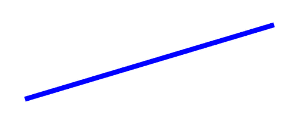

## 如何做...

按照以下步骤绘制一条对角线：

1.  定义一个 2D 画布上下文并设置线条样式：

```js
window.onload = function(){
  // get the canvas DOM element by its ID
     var canvas = document.getElementById("myCanvas");
  // declare a 2-d context using the getContext() method of the 
  // canvas object
     var context = canvas.getContext("2d");

  // set the line width to 10 pixels
     context.lineWidth = 10;
  // set the line color to blue
     context.strokeStyle = "blue";
```

1.  定位画布上下文并绘制线条：

```js
  // position the drawing cursor
     context.moveTo(50, canvas.height - 50);
  // draw the line
     context.lineTo(canvas.width - 50, 50);
  // make the line visible with the stroke color
     context.stroke();
};
```

1.  将画布标签嵌入到 HTML 文档的主体中：

```js
<canvas id="myCanvas" width="600" height="250" style="border:1px solid black;">
</canvas>

```

### 注意

**下载示例代码** 

您可以从[www.html5canvastutorials.com/cookbook](http://www.html5canvastutorials.com/cookbook)运行演示并下载本书的资源，或者您可以从您在[`www.PacktPub.com`](http://www.PacktPub.com)购买的所有 Packt 图书的帐户中下载示例代码文件。如果您在其他地方购买了本书，您可以访问[`www.PacktPub.com/support`](http://www.PacktPub.com/support)并注册，以便直接通过电子邮件接收文件。

# 它是如何工作的...

从前面的代码中可以看出，我们需要等待页面加载完成，然后再尝试通过其 ID 访问画布标签。我们可以通过`window.onload`初始化器来实现这一点。页面加载完成后，我们可以使用`document.getElementById()`访问画布 DOM 元素，并通过将`2d`传递给画布对象的`getContext()`方法来定义一个 2D 画布上下文。正如我们将在最后两章中看到的，我们还可以通过传递其他上下文（如`webgl`、`experimental-webgl`等）来定义 3D 上下文。

在绘制特定元素（如路径、子路径或形状）时，重要的是要理解样式可以在任何时候设置，无论是在元素绘制之前还是之后，但是样式必须在元素绘制后立即应用才能生效，我们可以使用`lineWidth`属性设置线条的宽度，使用`strokeStyle`属性设置线条颜色。想象一下，这个行为就像我们在纸上画东西时会采取的步骤。在我们开始画之前，我们会选择一个带有特定尖端厚度的彩色标记（`strokeStyle`）。

现在我们手里有了标记，可以使用`moveTo()`方法将其定位到画布上：

```js
context.moveTo(x,y);
```

将画布上下文视为绘图光标。`moveTo()`方法为给定点创建一个新的子路径。画布左上角的坐标为（0,0），右下角的坐标为（画布宽度，画布高度）。

一旦我们定位了绘图光标，我们可以使用`lineTo()`方法绘制线条，定义线条终点的坐标：

```js
context.lineTo(x,y);
```

最后，为了使线条可见，我们可以使用`stroke()`方法。除非另有规定，默认的描边颜色是黑色。

总结一下，当使用 HTML5 画布 API 绘制线条时，我们应该遵循的典型绘制过程如下：

1.  样式你的线条（比如选择一个特定尖端厚度的彩色标记）。

1.  使用`moveTo()`定位画布上下文（就像把标记放在纸上）。

1.  使用`lineTo()`绘制线条。

1.  使用`stroke()`使线条可见。

# 还有更多...

HTML5 画布线条也可以具有三种不同的线帽，包括**butt**、**round**和**square**。线帽样式可以使用画布上下文的`lineCap`属性进行设置。除非另有规定，线帽样式默认为 butt。下图显示了三条线，每条线都具有不同的线帽样式。顶部线使用默认的 butt 线帽，中间线使用 round 线帽，底部线使用 square 线帽：

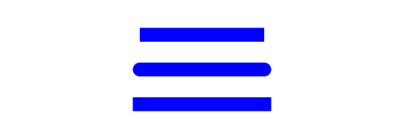

请注意，中间和底部线比顶部线稍长，尽管所有线宽度相等。这是因为 round 线帽和 square 线帽会使线的长度增加，增加的量等于线的宽度。例如，如果我们的线长为 200 像素，宽度为 10 像素，并且使用 round 或 square 线帽样式，那么结果线的长度将为 210 像素，因为每个线帽都会增加 5 像素的线长。

# 另请参阅...

+   *绘制锯齿*

+   *将所有内容放在一起：在第二章中绘制喷气式飞机

# 绘制一条弧

在使用 HTML5 画布绘制时，有时需要绘制完美的弧。如果你对绘制快乐的彩虹、笑脸或图表感兴趣，这个方法将是你努力的良好起点。

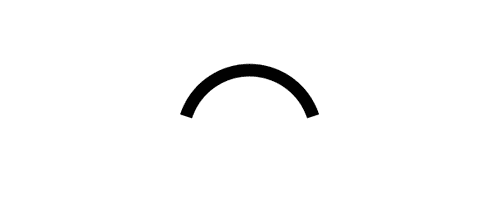

## 如何做...

按照以下步骤绘制简单的弧：

1.  定义一个 2D 画布上下文并设置弧线样式：

```js
window.onload = function(){
    var canvas = document.getElementById("myCanvas");
    var context = canvas.getContext("2d");
    context.lineWidth = 15;
    context.strokeStyle = "black"; // line color
```

1.  绘制弧：

```js
context.arc(canvas.width / 2, canvas.height / 2 + 40, 80, 1.1 * Math.PI, 1.9 * Math.PI, false);
    context.stroke();
};
```

1.  将 canvas 标签嵌入 HTML 文档的 body 中：

```js
<canvas id="myCanvas" width="600" height="250" style="border:1px solid black;">
</canvas>
```

## 工作原理...

我们可以使用`arc()`方法创建 HTML5 弧，该方法由虚拟圆的圆周部分定义。看一下下面的图表：

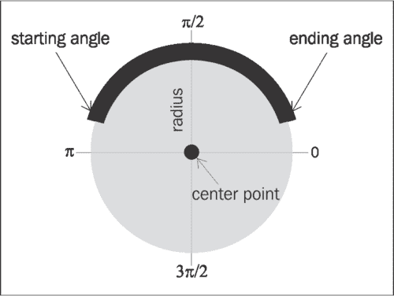

虚拟圆由一个中心点和一个半径定义。圆周部分由起始角度、结束角度以及弧是顺时针绘制还是逆时针绘制来定义：

```js
context.arc(centerX,centerY, radius, startingAngle, 
      endingAngle,counterclockwise);
```

注意，角度从圆的右侧 0π开始，顺时针移动到 3π/2、π、π/2，然后返回 0。对于这个方法，我们使用 1.1π作为起始角度，1.9π作为结束角度。这意味着起始角度略高于虚拟圆左侧的中心，结束角度略高于虚拟圆右侧的中心。

## 还有更多...

起始角度和结束角度的值不一定要在 0π和 2π之间。实际上，起始角度和结束角度可以是任何实数，因为角度可以在围绕圆圈旋转时重叠。

例如，假设我们将起始角度定义为 3π。这相当于围绕圆圈一周（2π）再围绕圆圈半周（1π）。换句话说，3π等同于 1π。另一个例子，-3π也等同于 1π，因为角度沿着圆圈逆时针旋转一周半，最终到达 1π。

使用 HTML5 画布创建弧的另一种方法是利用`arcTo()`方法。`arcTo()`方法生成的弧由上下文点、控制点、结束点和半径定义：

```js
context.arcTo(controlPointX1, controlPointY1, endingPointX,   endingPointY, radius);
```

与`arc()`方法不同，`arcTo()`方法依赖于上下文点来定位弧，类似于`lineTo()`方法。`arcTo()`方法在创建路径或形状的圆角时最常用。

## 另请参阅...

+   *在第二章中绘制一个圆

+   *在第五章中制作机械齿轮动画

+   *在第五章中制作时钟动画

# 绘制二次曲线

在这个配方中，我们将学习如何绘制二次曲线。与其表亲弧线相比，二次曲线提供了更多的灵活性和自然的曲线，是创建自定义形状的绝佳工具。

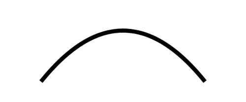

## 操作步骤...

按照以下步骤绘制二次曲线：

1.  定义一个 2D 画布上下文并设置曲线样式：

```js
window.onload = function(){
    var canvas = document.getElementById("myCanvas");
    var context = canvas.getContext("2d");

    context.lineWidth = 10;
    context.strokeStyle = "black"; // line color
```

1.  定位画布上下文并绘制二次曲线：

```js
context.moveTo(100, canvas.height - 50);
    context.quadraticCurveTo(canvas.width / 2, -50, canvas.width - 100, canvas.height - 50);
    context.stroke();
};
```

1.  将 canvas 标签嵌入 HTML 文档的主体中：

```js
<canvas id="myCanvas" width="600" height="250" style="border:1px solid black;">
</canvas>
```

## 工作原理...

HTML5 二次曲线由上下文点、一个控制点和一个结束点定义：

```js
  context.quadraticCurveTo(controlX, controlY, endingPointX,       endingPointY);
```

查看以下图表：

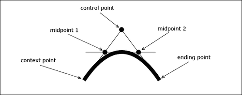

二次曲线的曲率由三个特征切线定义。曲线的第一部分与一条虚拟线相切，该虚拟线从上下文点开始，到控制点结束。曲线的顶点与从中点 1 开始到中点 2 结束的虚拟线相切。最后，曲线的最后一部分与从控制点开始到结束点结束的虚拟线相切。

## 另请参阅...

+   *将所有内容放在一起：在第二章中绘制喷气机*

+   *解锁分形的力量：绘制一棵幽灵树*

# 绘制贝塞尔曲线

如果二次曲线不能满足您的需求，贝塞尔曲线可能会起作用。贝塞尔曲线也被称为三次曲线，是 HTML5 画布 API 中最先进的曲线。

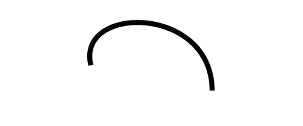

## 操作步骤...

按照以下步骤绘制任意贝塞尔曲线：

1.  定义一个 2D 画布上下文并设置曲线样式：

```js
window.onload = function(){
    var canvas = document.getElementById("myCanvas");
    var context = canvas.getContext("2d");

    context.lineWidth = 10;
    context.strokeStyle = "black"; // line color
    context.moveTo(180, 130);
```

1.  定位画布上下文并绘制贝塞尔曲线：

```js
context.bezierCurveTo(150, 10, 420, 10, 420, 180);
    context.stroke();
};
```

1.  将 canvas 标签嵌入 HTML 文档的主体中：

```js
<canvas id="myCanvas" width="600" height="250" style="border:1px solid black;">
</canvas>

```

## 工作原理...

HTML5 画布贝塞尔曲线由上下文点、两个控制点和一个结束点定义。与二次曲线相比，额外的控制点使我们对其曲率有更多控制：

```js
  context.bezierCurveTo(controlPointX1, controlPointY1, 
      controlPointX2, controlPointY2, 
      endingPointX, endingPointY);
```

查看以下图表：


与二次曲线不同，贝塞尔曲线由五个特征切线定义，而不是三个。曲线的第一部分与一条虚拟线相切，该虚拟线从上下文点开始，到第一个控制点结束。曲线的下一部分与从中点 1 开始到中点 3 结束的虚拟线相切。曲线的顶点与从中点 2 开始到中点 4 结束的虚拟线相切。曲线的第四部分与从中点 3 开始到中点 5 结束的虚拟线相切。最后，曲线的最后一部分与从第二个控制点开始到结束点结束的虚拟线相切。

## 另请参阅...

+   *随机化形状属性：在第二章中绘制一片花海*

+   *将所有内容放在一起：在第二章中绘制喷气机*

# 绘制锯齿

在这个配方中，我们将通过迭代连接线子路径来介绍路径绘制，以绘制锯齿路径。

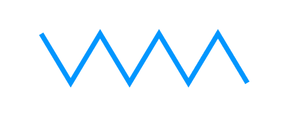

## 操作步骤...

按照以下步骤绘制锯齿路径：

1.  定义一个 2D 画布上下文并初始化锯齿参数：

```js
window.onload = function(){
    var canvas = document.getElementById("myCanvas");
    var context = canvas.getContext("2d");

    var startX = 85;
    var startY = 70;
    var zigzagSpacing = 60;
```

1.  定义锯齿样式并开始路径：

```js
context.lineWidth = 10;
    context.strokeStyle = "#0096FF"; // blue-ish color
    context.beginPath();
    context.moveTo(startX, startY);
```

1.  绘制七条连接的锯齿线，然后使用`stroke()`使锯齿路径可见：

```js
// draw seven lines
    for (var n = 0; n < 7; n++) {
        var x = startX + ((n + 1) * zigzagSpacing);
        var y;

        if (n % 2 == 0) { // if n is even...
            y = startY + 100;
        }
        else { // if n is odd...
            y = startY;
        }
        context.lineTo(x, y);
    }

    context.stroke();
};
```

1.  将 canvas 标签嵌入 HTML 文档的主体中：

```js
<canvas id="myCanvas" width="600" height="250" style="border:1px solid black;">
</canvas>
```

## 工作原理...

要绘制锯齿，我们可以连接交替的对角线以形成路径。通过设置一个循环来实现，该循环在奇数迭代上向上和向右绘制对角线，在偶数迭代上向下和向右绘制对角线。

在这个示例中需要注意的关键事项是`beginPath()`方法。这个方法本质上声明正在绘制一个路径，以便每个线段子路径的结束定义下一个子路径的开始。如果不使用`beginPath()`方法，我们将不得不费力地使用`moveTo()`来定位每个线段，同时确保前一个线段的结束点与当前线段的起点匹配。正如我们将在下一章中看到的，`beginPath()`方法也是创建形状的必要步骤。

### 线连接样式

注意每个线段之间的连接是如何形成尖锐点的。这是因为 HTML5 canvas 路径的线连接样式默认为**miter**。或者，我们也可以使用画布上下文的`lineJoin`属性将线连接样式设置为**round**或**bevel**。

如果您的线段相当细，并且不以陡峭的角度连接，要区分不同的线连接样式可能有些困难。通常，当路径厚度超过 5 像素且线段之间的角度相对较小时，不同的线连接样式会更加明显。

# 绘制螺旋线

注意，这个示例可能会引起催眠。在这个示例中，我们将通过连接一系列短线段来形成螺旋路径来绘制一个螺旋线。

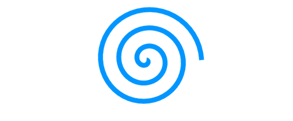

## 如何做...

按照以下步骤绘制一个居中的螺旋线：

1.  定义一个 2D 画布上下文并初始化螺旋参数：

```js
window.onload = function(){
    var canvas = document.getElementById("myCanvas");
    var context = canvas.getContext("2d");

    var radius = 0;
    var angle = 0;
```

1.  设置螺旋线样式：

```js
context.lineWidth = 10;
    context.strokeStyle = "#0096FF"; // blue-ish color
    context.beginPath();
    context.moveTo(canvas.width / 2, canvas.height / 2);
```

1.  围绕画布中心旋转三次（每次完整旋转 50 次迭代），同时增加半径 0.75，并使用`lineTo()`从上一个点到当前点绘制一条线段。最后，使用`stroke()`使螺旋线可见：

```js
for (var n = 0; n < 150; n++) {
        radius += 0.75;
        // make a complete circle every 50 iterations
        angle += (Math.PI * 2) / 50;
        var x = canvas.width / 2 + radius * Math.cos(angle);
        var y = canvas.height / 2 + radius * Math.sin(angle);
        context.lineTo(x, y);
    }

    context.stroke();
};
```

1.  将 canvas 标签嵌入 HTML 文档的 body 中：

```js
<canvas id="myCanvas" width="600" height="250" style="border:1px solid black;">
</canvas>

```

## 它是如何工作的...

要使用 HTML5 canvas 绘制螺旋线，我们可以将绘图游标放在画布中心，迭代增加半径和角度，然后从上一个点到当前点绘制一个超短的线段。另一种思考方式是想象自己站在人行道上，手里拿着一支彩色粉笔。弯下腰把粉笔放在人行道上，然后开始围绕中心转圈（不要转得太快，除非你想晕倒）。当你转动时，把粉笔向外移动。几圈之后，你就画出了一个漂亮的小螺旋线。

# 处理文本

几乎所有的应用程序都需要一些文本来有效地向用户传达信息。这个示例将向您展示如何绘制一个简单的文本字符串，带有一种乐观的欢迎。

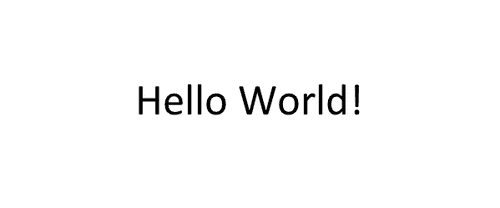

## 如何做...

按照以下步骤在 canvas 上写字：

1.  定义一个 2D 画布上下文并设置文本样式：

```js
window.onload = function(){
    var canvas = document.getElementById("myCanvas");
    var context = canvas.getContext("2d");

    context.font = "40pt Calibri";
    context.fillStyle = "black";
```

1.  水平和垂直对齐文本，然后绘制它：

```js
// align text horizontally center
    context.textAlign = "center";
    // align text vertically center
    context.textBaseline = "middle";
    context.fillText("Hello World!", canvas.width / 2, 120);
};
```

1.  将 canvas 标签嵌入 HTML 文档的 body 中：

```js
<canvas id="myCanvas" width="600" height="250" style="border:1px solid black;">
</canvas>
```

## 它是如何工作的...

要在 HTML5 canvas 上绘制文本，我们可以使用`font`属性定义字体样式和大小，使用`fillStyle`属性定义字体颜色，使用`textAlign`属性定义水平文本对齐，使用`textBaseline`属性定义垂直文本对齐。`textAlign`属性可以设置为`left`、`center`或`right`，`textBaseline`属性可以设置为`top`、`hanging`、`middle`、`alphabetic`、`ideographic`或`bottom`。除非另有规定，否则`textAlign`属性默认为`left`，`textBaseline`属性默认为 alphabetic。

## 还有更多...

除了`fillText()`之外，HTML5 canvas API 还支持`strokeText()`：

```js
  context.strokeText("Hello World!", x, y);
```

这种方法将为文本的周边着色而不是填充。要为 HTML 画布文本设置填充和描边，可以同时使用`fillText（）`和`strokeText（）`方法。在渲染描边厚度时，最好先使用`fillText（）`方法，然后再使用`strokeText（）`方法。

## 另请参阅...

+   *带阴影的 3D 文字绘制*

+   *在* 第四章 *中创建镜像变换*

+   *在* 第四章 *中绘制简单的标志并随机化其位置、旋转和比例*

# 带阴影的 3D 文字绘制

如果 2D 文本不能激发你的热情，你可以考虑绘制 3D 文本。尽管 HTML5 画布 API 并没有直接为我们提供创建 3D 文本的手段，但我们可以使用现有的 API 创建自定义的`draw3dText（）`方法。

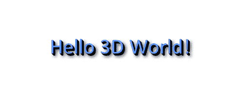

## 如何做...

按照以下步骤创建 3D 文本：

1.  设置画布上下文和文本样式：

```js
  window.onload = function(){
    canvas = document.getElementById("myCanvas");
    context = canvas.getContext("2d");

    context.font = "40pt Calibri";
    context.fillStyle = "black";
```

1.  对齐并绘制 3D 文本：

```js
// align text horizontally center
    context.textAlign = "center";
    // align text vertically center
    context.textBaseline = "middle";
    draw3dText(context, "Hello 3D World!", canvas.width / 2, 120, 5);
};
```

1.  定义`draw3dText（）`函数，绘制多个文本层并添加阴影：

```js
function draw3dText(context, text, x, y, textDepth){
    var n;

    // draw bottom layers
    for (n = 0; n < textDepth; n++) {
        context.fillText(text, x - n, y - n);
    }

    // draw top layer with shadow casting over
    // bottom layers
    context.fillStyle = "#5E97FF";
    context.shadowColor = "black";
    context.shadowBlur = 10;
    context.shadowOffsetX = textDepth + 2;
    context.shadowOffsetY = textDepth + 2;
    context.fillText(text, x - n, y - n);
}
```

1.  在 HTML 文档的主体中嵌入画布标记：

```js
<canvas id="myCanvas" width="600" height="250" style="border:1px solid black;">
</canvas>
```

## 它是如何工作的...

要使用 HTML5 画布绘制 3D 文本，我们可以将多个相同文本的图层叠加在一起，以创建深度的错觉。在这个示例中，我们将文本深度设置为五，这意味着我们的自定义`draw3dText（）`方法会在一起叠加五个“Hello 3D World！”的实例。我们可以将这些图层着色为黑色，以在文本下方创建黑暗的错觉。

接下来，我们可以添加一个有颜色的顶层来描绘一个朝前的表面。最后，我们可以通过设置画布上下文的`shadowColor`，`shadowBlur`，`shadowOffsetX`和`shadowOffsetY`属性，在文本下方应用柔和的阴影。正如我们将在后面的示例中看到的，这些属性不仅限于文本，还可以应用于子路径、路径和形状。

# 释放分形的力量：绘制一棵幽灵树

首先，什么是分形？如果你还不知道，分形是数学与艺术相结合的令人惊叹的结果，可以在构成生活的各种模式中找到。从算法上讲，分形是基于经历递归的方程。在这个示例中，我们将通过绘制一个分叉成两个分支的树干，然后从我们刚刚绘制的两个分支中再绘制两个分支，来创建一个有机的树。

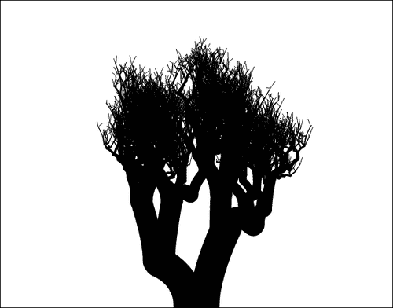

## 如何做...

按照以下步骤绘制使用分形的树：

1.  创建一个递归函数，绘制一个分叉成两个分支的单个分支，然后递归调用自身，从分叉分支的端点绘制另外两个分支：

```js
function drawBranches(context, startX, startY, trunkWidth, level){
    if (level < 12) {
        var changeX = 100 / (level + 1);
        var changeY = 200 / (level + 1);

        var topRightX = startX + Math.random() * changeX;
        var topRightY = startY - Math.random() * changeY;

        var topLeftX = startX - Math.random() * changeX;
        var topLeftY = startY - Math.random() * changeY;
        // draw right branch
        context.beginPath();
        context.moveTo(startX + trunkWidth / 4, startY);
        context.quadraticCurveTo(startX + trunkWidth / 4, startY - trunkWidth, topRightX, topRightY);
        context.lineWidth = trunkWidth;
        context.lineCap = "round";
        context.stroke();

        // draw left branch
        context.beginPath();
        context.moveTo(startX - trunkWidth / 4, startY);
        context.quadraticCurveTo(startX - trunkWidth / 4, startY -
        trunkWidth, topLeftX, topLeftY);
        context.lineWidth = trunkWidth;
        context.lineCap = "round";
        context.stroke();

        drawBranches(context, topRightX, topRightY, trunkWidth * 0.7, level + 1);
        drawBranches(context, topLeftX, topLeftY, trunkWidth * 0.7, level + 1);
    }
}
```

1.  初始化画布上下文，并通过调用`drawBranches（）`开始绘制树分形：

```js
window.onload = function(){
    canvas = document.getElementById("myCanvas");
    context = canvas.getContext("2d");

    drawBranches(context, canvas.width / 2, canvas.height, 50, 0);
};
```

1.  在 HTML 文档的主体中嵌入画布标记：

```js
<canvas id="myCanvas" width="600" height="500" style="border:1px solid black;">
</canvas>
```

## 它是如何工作的...

要使用分形创建树，我们需要设计定义树的数学特性的递归函数。如果你花一点时间研究一棵树（如果你仔细想想，它们是相当美丽的），你会注意到每个分支都分叉成更小的分支。反过来，这些分支又分叉成更小的分支，依此类推。这意味着我们的递归函数应该绘制一个分叉成两个分支的单个分支，然后递归调用自身，从我们刚刚绘制的两个分支中再绘制两个分支。

现在我们有了创建分形的计划，我们可以使用 HTML5 画布 API 来实现它。绘制一个分叉成两个分支的最简单方法是通过绘制两个二次曲线，这些曲线从彼此弯曲向外。

如果我们对每次迭代使用完全相同的绘图过程，我们的树将会是完全对称且相当无趣的。为了使我们的树看起来更自然，我们可以引入随机变量来偏移每个分支的结束点。

## 还有更多...

这个配方的有趣之处在于每棵树都是不同的。如果你自己编写这个代码并不断刷新你的浏览器，你会发现每棵树的形成都是完全独特的。你可能还会对调整分支绘制算法以创建不同类型的树，甚至在最小的分支尖端绘制叶子感兴趣。

一些其他很好的分形例子可以在海贝壳、雪花、羽毛、植物、晶体、山脉、河流和闪电中找到。
