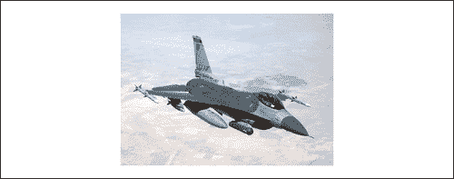
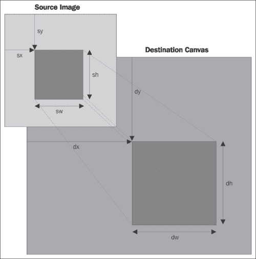
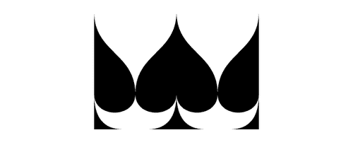
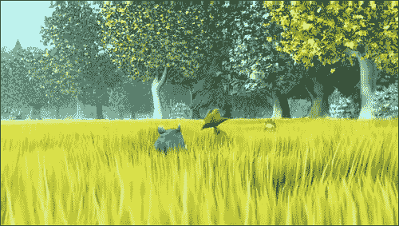
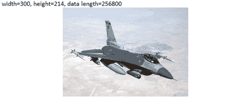
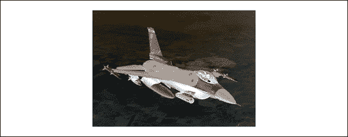
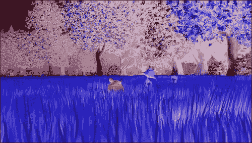
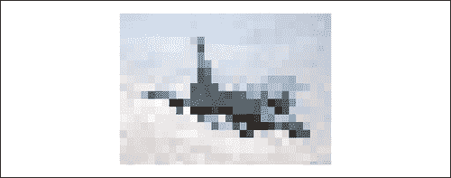

# 第三章：使用图像和视频

在本章中，我们将涵盖：

+   绘制图像

+   裁剪图像

+   复制和粘贴画布的部分

+   使用视频

+   获取图像数据

+   像素操作简介：反转图像颜色

+   反转视频颜色

+   将图像颜色转换为灰度

+   将画布绘制转换为数据 URL

+   将画布绘制保存为图像

+   使用数据 URL 加载画布

+   创建像素化图像焦点

# 介绍

本章重点介绍 HTML5 画布、图像和视频的另一个非常令人兴奋的主题。除了提供定位、调整大小和裁剪图像和视频的基本功能外，HTML5 画布 API 还允许我们访问和修改每个像素的颜色和透明度。让我们开始吧！

# 绘制图像

让我们通过绘制一个简单的图像来开始。在本示例中，我们将学习如何加载图像并在画布上的某个位置绘制它。



按照以下步骤在画布中央绘制图像：

## 如何做...

1.  定义画布上下文：

```js
window.onload = function(){
    var canvas = document.getElementById("myCanvas");
    var context = canvas.getContext("2d");
```

1.  创建一个`image`对象，将`onload`属性设置为绘制图像的函数，然后设置图像的源：

```js
    var imageObj = new Image();
    imageObj.onload = function(){
        var destX = canvas.width / 2 - this.width / 2;
        var destY = canvas.height / 2 - this.height / 2;

        context.drawImage(this, destX, destY);
    };
    imageObj.src = "jet_300x214.jpg";
};
```

1.  将 canvas 标签嵌入 HTML 文档的主体中：

```js
<canvas id="myCanvas" width="600" height="250" style="border:1px solid black;">
</canvas>
```

## 它是如何工作的...

要绘制图像，我们首先需要使用`new Image()`创建一个`image`对象。请注意，我们在定义图像的源*之前*设置了`image`对象的`onload`属性。

### 提示

在设置图像源*之前*定义加载图像时要执行的操作是一个很好的做法。理论上，如果我们在定义`onload`属性之前定义图像的源，图像可能会在定义完成之前加载（尽管这很不太可能）。

本示例中的关键方法是`drawImage()`方法：

```js
context.drawImage(imageObj,destX,destY);
```

其中`imageObj`是`image`对象，`destX`和`destY`是我们想要放置图像的位置。

## 还有更多...

除了使用`destX`和`destY`定义图像位置外，我们还可以添加两个额外的参数，`destWidth`和`destHeight`来定义图像的大小：

```js
context.drawImage(imageObj,destX,destY,destWidth,destHeight);
```

在大多数情况下，最好不要使用`drawImage()`方法调整图像的大小，因为缩放图像的质量会明显降低，类似于使用 HTML 图像元素的宽度和高度属性调整图像大小时的结果。如果图像质量是您关心的问题（为什么你不会关心？），通常最好在创建需要缩放图像的应用程序时使用缩略图图像。另一方面，如果您的应用程序动态缩小和扩展图像，使用`drawImage()`方法和`destWidth`和`destHeight`来缩放图像是一个完全可以接受的方法。

# 裁剪图像

在本示例中，我们将裁剪图像的一部分，然后将结果绘制到画布上。


按照以下步骤裁剪图像的一部分并将结果绘制到画布上。

## 如何做...

1.  定义画布上下文：

```js
window.onload = function(){
    var canvas = document.getElementById("myCanvas");
    var context = canvas.getContext("2d");
```

1.  创建一个图像对象，将`onload`属性设置为裁剪图像的函数，然后设置图像的源：

```js
    var imageObj = new Image();
    imageObj.onload = function(){
    // source rectangular area
        var sourceX = 550;
        var sourceY = 300;
        var sourceWidth = 300;
        var sourceHeight = 214;

    // destination image size and position
        var destWidth = sourceWidth;
        var destHeight = sourceHeight;
        var destX = canvas.width / 2 - destWidth / 2;
        var destY = canvas.height / 2 - destHeight / 2;

        context.drawImage(this, sourceX, sourceY, sourceWidth, sourceHeight, destX, destY, destWidth, destHeight);
    };
    imageObj.src = "jet_1000x714.jpg";
};
```

1.  将 canvas 标签嵌入 HTML 文档的主体中：

```js
<canvas id="myCanvas" width="600" height="250" style="border:1px solid black;">
</canvas>
```

## 它是如何工作的...

在上一个示例中，我们讨论了使用`drawImage()`方法在画布上绘制图像的两种不同方式。在第一种情况下，我们可以传递一个`image`对象和一个位置，简单地在给定位置绘制图像。在第二种情况下，我们可以传递一个`image`对象，一个位置和一个大小，在给定位置以给定大小绘制图像。此外，如果我们想要裁剪图像，还可以向`drawImage()`方法添加六个参数：

```js
Context.drawImage(imageObj,sourceX,sourceY,sourceWidth, sourceHight, sourceHeight,sourceHeight, destX, destY, destWidth, destHeight);
```

看一下下面的图表：



正如您所看到的，`sourceX`和`sourceY`指的是源图像中裁剪区域的左上角。`sourceWidth`和`sourceHeight`指的是源图像中裁剪图像的宽度和高度。`destX`和`destY`指的是裁剪图像在画布上的位置，`destWidth`和`destHeight`指的是结果裁剪图像的宽度和高度。

### 提示

如果您不打算缩放裁剪的图像，则`destWidth`等于`sourceWidth`，`destHeight`等于`sourceHeight`。

# 复制和粘贴画布的部分

在这个示例中，我们将介绍`drawImage()`方法的另一个有趣用法——复制画布的部分。首先，我们将在画布中心绘制一个梅花，然后我们将复制梅花的右侧，然后粘贴到左侧，然后我们将复制梅花的左侧，然后粘贴到右侧。



按照以下步骤在画布中心绘制一个梅花，然后将形状的部分复制并粘贴回画布上：

## 如何做...

1.  定义画布上下文：

```js
window.onload = function(){
    // drawing canvas and context
    var canvas = document.getElementById("myCanvas");
    var context = canvas.getContext("2d");
```

1.  使用我们在第二章中创建的`drawSpade()`函数，在画布中心绘制一个梅花，*形状绘制和合成*：

```js
    // draw spade
    var spadeX = canvas.width / 2;
    var spadeY = 20;
    var spadeWidth = 140;
    var spadeHeight = 200;

    // draw spade in center of canvas
    drawSpade(context, spadeX, spadeY, spadeWidth, spadeHeight);
```

1.  复制梅花的右半部分，然后使用`drawImage()`方法将其粘贴到梅花左侧的画布上：

```js
    context.drawImage(
    canvas,         
    spadeX,         // source x
    spadeY,         // source y
    spadeWidth / 2,     // source width
    spadeHeight,       // source height
    spadeX - spadeWidth,  // dest x
    spadeY,         // dest y
    spadeWidth / 2,     // dest width
    spadeHeight        // dest height
  );
```

1.  复制梅花的左半部分，然后使用`drawImage()`方法将其粘贴到梅花右侧的画布上：

```js
    context.drawImage(
    canvas, 
    spadeX - spadeWidth / 2,  // source x   
    spadeY,           // source y
    spadeWidth / 2,       // source width
    spadeHeight,         // source height
    spadeX + spadeWidth / 2,   // dest x
    spadeY,           // dest y
    spadeWidth / 2,       // dest width
    spadeHeight          // dest height
  );
};
```

1.  将画布嵌入到 HTML 文档的主体中：

```js
<canvas id="myCanvas" width="600" height="250" style="border:1px solid black;">
</canvas>
```

## 它是如何工作的...

要复制画布的一部分，我们可以将`canvas`对象传递给`drawImage()`方法，而不是一个`image`对象：

```js
Context.drawImage(canvas,sourceX,sourceY,sourceWidth, sourceHight, sourceHeight,sourceHeight, destX, destY, destWidth, destHeight);
```

正如我们将在下一个示例中看到的，我们不仅可以使用`drawImage()`复制图像或画布的部分，还可以复制 HTML5 视频的部分。

# 使用视频

尽管 HTML5 画布 API 没有提供像图像那样在画布上绘制视频的直接方法，但我们可以通过从隐藏的视频标签中捕获帧，然后通过循环将它们复制到画布上来处理视频。



## 准备工作...

在开始之前，让我们谈谈每个浏览器支持的 HTML5 视频格式。在撰写本文时，视频格式之争仍在继续，所有主要浏览器——Chrome、Firefox、Opera、Safari 和 IE——继续增加和删除对不同视频格式的支持。更糟糕的是，每当一个主要浏览器增加或删除对特定视频格式的支持时，开发人员就必须重新制定所需的最小视频格式集，以确保其应用程序在所有浏览器中正常工作。

在撰写本文时，三种主要的视频格式是 Ogg Theora、H.264 和 WebM。在本章的视频示例中，我们将使用 Ogg Theora 和 H.264 的组合。在处理视频时，强烈建议您在网上搜索，了解视频支持的当前状态，因为它可能随时发生变化。

还有更多！一旦您决定支持哪些视频格式，您可能需要一个视频格式转换器，将手头的视频文件转换为其他视频格式。一个很好的视频格式转换选项是 Miro Video Converter，它支持几乎任何视频格式的视频格式转换，包括 Ogg Theora、H.264 或 WebM 格式。

Miro Video Converter 可能是目前最常见的视频转换器，尽管您当然可以使用任何其他您喜欢的视频格式转换器。您可以从以下网址下载 Miro Video Converter：[`www.mirovideoconverter.com/`](http://www.mirovideoconverter.com/)。

按照以下步骤将视频绘制到画布上：

## 如何做...

1.  创建一个跨浏览器的方法来请求动画帧：

```js
window.requestAnimFrame = (function(callback){
    return window.requestAnimationFrame ||
    window.webkitRequestAnimationFrame ||
    window.mozRequestAnimationFrame ||
    window.oRequestAnimationFrame ||
    window.msRequestAnimationFrame ||
    function(callback){
        window.setTimeout(callback, 1000 / 60);
    };
})();
```

1.  定义`drawFrame()`函数，它会复制当前视频帧，使用`drawImage()`方法将其粘贴到 canvas 上，然后请求新的动画帧来绘制下一帧：

```js
function drawFrame(context, video){
    context.drawImage(video, 0, 0);
    requestAnimFrame(function(){
        drawFrame(context, video);
    });
}
```

1.  定义 canvas 上下文，获取视频标签，并绘制第一帧视频：

```js
window.onload = function(){
    var canvas = document.getElementById("myCanvas");
    var context = canvas.getContext("2d");
    var video = document.getElementById("myVideo");
    drawFrame(context, video);
};
```

1.  在 HTML 文档的 body 中嵌入 canvas 和 video 标签：

```js
<video id="myVideo" autoplay="true" loop="true" style="display:none;">
    <source src="img/BigBuckBunny_640x360.ogv" type="video/ogg"/><source src="img/BigBuckBunny_640x360.mp4" type="video/mp4"/>
</video>
<canvas id="myCanvas" width="600" height="360" style="border:1px solid black;">
</canvas>
```

## 它是如何工作的...

要在 HTML5 画布上绘制视频，我们首先需要在 HTML 文档中嵌入一个隐藏的视频标签。在这个示例中，以及将来的视频示例中，我使用了 Ogg Theora 和 H.264（mp4）视频格式。

接下来，当页面加载时，我们可以使用跨浏览器的`requestAnimFrame()`方法尽可能快地捕获视频帧，然后将它们绘制到 canvas 上。

# 获取图像数据

现在我们知道如何绘制图像和视频，让我们尝试访问图像数据，看看我们可以玩的属性有哪些。



### 注意

警告：由于`getImageData()`方法的安全限制，此示例必须在 Web 服务器上运行。

## 准备工作...

在开始处理图像数据之前，重要的是我们要了解画布安全和 RGBA 颜色空间。

那么为什么画布安全对于访问图像数据很重要呢？简单来说，为了访问图像数据，我们需要使用画布上下文的`getImageData()`方法，如果我们尝试从非 Web 服务器文件系统上的图像或不同域上的图像访问图像数据，它将抛出`SECURITY_ERR`异常。换句话说，如果你要自己尝试这些演示，如果你的文件存储在本地文件系统上，它们将无法工作。你需要在 Web 服务器上运行本章的其余部分。

接下来，由于像素操作主要是改变像素的 RGB 值，我们可能应该在这里介绍 RGB 颜色模型和 RGBA 颜色空间。RGB 代表像素颜色的红色、绿色和蓝色分量。每个分量都是 0 到 255 之间的整数，其中 0 表示没有颜色，255 表示完整的颜色。RGB 值通常表示如下：

```js
rgb(red,green,blue)
```

以下是用 RGB 颜色模型表示的一些常见颜色值：

```js
rgb(0,0,0) = black
rgb(255,255,255) = white
rgb(255,0,0) = red
rgb(0,255,0) = green
rgb(0,0,255) = blue
rgb(255,255,0) = yellow
rgb(255,0,255) = magenta
rgb(0,255,255) = cyan
```

除了 RGB，像素还可以有一个 alpha 通道，它指的是像素的不透明度。alpha 通道为 0 是完全透明的像素，alpha 通道为 255 是完全不透明的像素。RGBA 颜色空间简单地指的是 RGB 颜色模型（RGB）加上 alpha 通道（A）。

### 提示

请注意不要混淆 HTML5 画布像素的 alpha 通道范围（整数 0 到 255）和 CSS 颜色的 alpha 通道范围（小数 0.0 到 1.0）。

按照以下步骤写出图像数据的属性：

## 如何做...

1.  定义一个 canvas 上下文：

```js
window.onload = function(){
    var canvas = document.getElementById("myCanvas");
    var context = canvas.getContext("2d");
```

1.  创建一个`image`对象，将`onload`属性设置为一个绘制图像的函数：

```js
    var imageObj = new Image();
    imageObj.onload = function(){
        var sourceWidth = this.width;
        var sourceHeight = this.height;
        var destX = canvas.width / 2 - sourceWidth / 2;
        var destY = canvas.height / 2 - sourceHeight / 2;
        var sourceX = destX;
        var sourceY = destY;

    // draw image on canvas
        context.drawImage(this, destX, destY);
```

1.  获取图像数据，写出其属性，然后在`onload`定义之外设置`image`对象的源：

```js
    // get image data from the rectangular area 
    // of the canvas containing the image
        var imageData = context.getImageData(sourceX, sourceY, sourceWidth, sourceHeight);
        var data = imageData.data;

    // write out the image data properties
        var str = "width=" + imageData.width + ", height=" + imageData.height + ", data length=" + data.length;
        context.font = "12pt Calibri";
        context.fillText(str, 4, 14);
    };
    imageObj.src = "jet_300x214.jpg";
};
```

1.  将 canvas 标签嵌入 HTML 文档的 body 中：

```js
<canvas id="myCanvas" width="600" height="250" style="border:1px solid black;">
</canvas>
```

## 它是如何工作的...

这个示例的思路是绘制图像，获取其图像数据，然后将图像数据属性写到屏幕上。从前面的代码中可以看到，我们可以使用 canvas 上下文的`getImageData()`方法获取图像数据：

```js
context.getImageData(sourceX,sourceY,sourceWidth,sourceHeight);
```

请注意，`getImageData()`方法只能与 canvas 上下文一起使用，而不能直接使用`image`对象本身。因此，为了获取图像数据，我们必须先将图像绘制到 canvas 上，然后使用 canvas 上下文的`getImageData()`方法。

`ImageData`对象包含三个属性：`width`、`height`和`data`。从这个食谱开头的截图中可以看到，我们的`ImageData`对象包含一个宽度属性为 300，一个高度属性为 214，以及一个`data`属性，它是一个像素信息数组，在这种情况下，长度为 256,800 个元素。说实话，`ImageData`对象的关键是`data`属性。`data`属性包含我们图像中每个像素的 RGBA 信息。由于我们的图像由 300 * 214 = 64,200 像素组成，因此这个数组的长度为 4 * 64,200 = 256,800 个元素。

# 像素处理简介：反转图像颜色

现在我们知道如何访问图像数据，包括图像或视频中每个像素的 RGBA，我们的下一步是探索像素处理的可能性。在这个食谱中，我们将通过反转每个像素的颜色来反转图像的颜色。



### 注意

警告：由于`getImageData()`方法的安全限制，这个食谱必须在 web 服务器上运行。

按照以下步骤反转图像的颜色：

## 操作步骤...

1.  定义 canvas 上下文：

```js
window.onload = function(){
    var canvas = document.getElementById("myCanvas");
    var context = canvas.getContext("2d");
```

1.  创建一个`image`对象，并将`onload`属性设置为绘制图像和获取图像数据的函数：

```js
    var imageObj = new Image();
    imageObj.onload = function(){
        var sourceWidth = this.width;
        var sourceHeight = this.height;
        var sourceX = canvas.width / 2 - sourceWidth / 2;
        var sourceY = canvas.height / 2 - sourceHeight / 2;
        var destX = sourceX;
        var destY = sourceY;
        context.drawImage(this, destX, destY);

        var imageData = context.getImageData(sourceX, sourceY, sourceWidth, sourceHeight);
        var data = imageData.data;
```

1.  循环遍历图像中的所有像素并反转颜色：

```js
        for (var i = 0; i < data.length; i += 4) {
            data[i] = 255 - data[i]; // red
            data[i + 1] = 255 - data[i + 1]; // green
            data[i + 2] = 255 - data[i + 2]; // blue
            // i+3 is alpha (the fourth element)
        }
```

1.  用处理后的图像覆盖原始图像，然后在`onload`定义之外设置图像的源：

```js
        // overwrite original image with
        // new image data
        context.putImageData(imageData, destX, destY);
    };
    imageObj.src = "jet_300x214.jpg";
};
```

1.  将 canvas 标签嵌入到 HTML 文档的 body 中：

```js
<canvas id="myCanvas" width="600" height="250" style="border:1px solid black;">
</canvas>
```

## 它是如何工作的...

使用 HTML5 画布反转图像的颜色，我们可以简单地循环遍历图像中的所有像素，然后使用颜色反转算法反转每个像素。别担心，这比听起来容易。要反转像素的颜色，我们可以通过从 255 中减去每个值来反转其 RGB 分量中的每一个值，如下所示：

```js
data[i  ] = 255 - data[i  ]; // red
data[i+1] = 255 - data[i+1]; // green
data[i+2] = 255 - data[i+2]; // blue
```

一旦像素被更新，我们可以使用画布上下文的`putImageData()`方法重新绘制图像：

```js
context.putImageData(imageData, destX, destY); 
```

这个方法基本上允许我们使用图像数据而不是`drawImage()`方法的源图像来绘制图像。

# 反转视频颜色

这个食谱的目的是演示如何对视频进行像素处理，方法与处理图像的方式基本相同。在这个食谱中，我们将反转一个短视频片段的颜色。



### 注意

警告：由于`getImageData()`方法的安全限制，这个食谱必须在 web 服务器上运行。

按照以下步骤反转视频的颜色：

## 操作步骤...

1.  创建一个跨浏览器的方法来请求动画帧：

```js
window.requestAnimFrame = (function(callback){
    return window.requestAnimationFrame ||
    window.webkitRequestAnimationFrame ||
    window.mozRequestAnimationFrame ||
    window.oRequestAnimationFrame ||
    window.msRequestAnimationFrame ||
    function(callback){
        window.setTimeout(callback, 1000 / 60);
    };
})();
```

1.  定义`drawFrame()`函数，捕获当前视频帧，反转颜色，将帧绘制在画布上，然后请求一个新的动画帧：

```js
function drawFrame(canvas, context, video){
    context.drawImage(video, 0, 0);

    var imageData = context.getImageData(0, 0, canvas.width, canvas.height);
    var data = imageData.data;

    for (var i = 0; i < data.length; i += 4) {
        data[i] = 255 - data[i]; // red
        data[i + 1] = 255 - data[i + 1]; // green
        data[i + 2] = 255 - data[i + 2]; // blue
        // i+3 is alpha (the fourth element)
    }

    // overwrite original image
    context.putImageData(imageData, 0, 0);

    requestAnimFrame(function(){
        drawFrame(canvas, context, video);
    });
}
```

1.  定义画布上下文，获取视频标签，并绘制第一个动画帧：

```js
window.onload = function(){
    var canvas = document.getElementById("myCanvas");
    var context = canvas.getContext("2d");
    var video = document.getElementById("myVideo");
    drawFrame(canvas, context, video);
};
```

1.  将视频和 canvas 元素嵌入到 HTML 文档的 body 中：

```js
<video id="myVideo" autoplay="true" loop="true" style="display:none;">
    <source src="img/BigBuckBunny_640x360.ogv" type="video/ogg"/><source src="img/BigBuckBunny_640x360.mp4" type="video/mp4"/>
</video>
<canvas id="myCanvas" width="640" height="360" style="border:1px solid black;">
</canvas>
```

## 它是如何工作的...

与之前的食谱类似，我们可以对视频进行像素处理，方法与处理图像的方式基本相同，因为`getImageData()`方法从画布上下文获取图像数据，而不管上下文是如何渲染的。在这个食谱中，我们可以简单地反转画布上每个像素的颜色，对应`requestAnimFrame()`方法提供的每个视频帧。

# 将图像颜色转换为灰度

在这个食谱中，我们将探讨另一个常见的像素处理算法，将颜色转换为灰度。


### 注意

警告：由于`getImageData()`方法的安全限制，这个食谱必须在 web 服务器上运行。

按照以下步骤将图像的颜色转换为灰度：

## 操作步骤...

1.  定义 canvas 上下文：

```js
window.onload = function(){
    var canvas = document.getElementById("myCanvas");
    var context = canvas.getContext("2d");
```

1.  创建一个`image`对象，并将`onload`属性设置为绘制图像并获取图像数据的函数：

```js
    var imageObj = new Image();
    imageObj.onload = function(){
        var sourceWidth = this.width;
        var sourceHeight = this.height;
        var destX = canvas.width / 2 - sourceWidth / 2;
        var destY = canvas.height / 2 - sourceHeight / 2;
        var sourceX = destX;
        var sourceY = destY;

        context.drawImage(this, destX, destY);

        var imageData = context.getImageData(sourceX, sourceY, sourceWidth, sourceHeight);
        var data = imageData.data;
```

1.  循环遍历图像中的像素，并使用亮度方程将颜色转换为灰度：

```js
        for (var i = 0; i < data.length; i += 4) {
            var brightness = 0.34 * data[i] + 0.5 * data[i + 1] + 0.16 * data[i + 2];

            data[i] = brightness; // red
            data[i + 1] = brightness; // green
            data[i + 2] = brightness; // blue
            // i+3 is alpha (the fourth element)
        }
```

1.  用处理后的图像覆盖原始图像，然后在`onload`定义后设置图像源：

```js
        // overwrite original image
        context.putImageData(imageData, destX, destY);
    };
    imageObj.src = "jet_300x214.jpg";
};
```

1.  将 canvas 元素嵌入 HTML 文档的 body 中：

```js
<canvas id="myCanvas" width="600" height="250" style="border:1px solid black;">
</canvas>
```

## 工作原理...

要将 RGB 颜色转换为灰度渐变，我们需要获取颜色的亮度。我们可以使用亮度方程来获取彩色像素的灰度值。这个方程基于这样一个事实，即人类对绿光最敏感，其次是红光，对蓝光最不敏感：

`亮度= 0.34 * R + 0.5 * G + 0.16 * B`

为了考虑生理效应，请注意我们已经增加了对绿色值的权重（最敏感），然后是红色值（较不敏感），最后是蓝色值（最不敏感）。

有了这个方程，我们可以简单地循环遍历图像中的所有像素，计算感知亮度，将这个值分配给 RGB 值中的每个值，然后重新绘制图像到画布上。

# 将画布绘图转换为数据 URL

除了图像数据，我们还可以提取图像数据 URL，它基本上只是一个包含有关画布图像的编码信息的非常长的文本字符串。如果我们想要将画布绘图保存在本地存储或离线数据库中，数据 URL 非常方便。在这个示例中，我们将绘制一个云形状，获取其数据 URL，然后将其插入到 HTML 页面中，以便我们可以看到它的样子。

按照以下步骤将画布绘图转换为数据 URL：

## 如何做...

1.  定义画布上下文并绘制云形状：

```js
window.onload = function(){
    var canvas = document.getElementById("myCanvas");
    var context = canvas.getContext("2d");

    var startX = 200;
    var startY = 100;

    // draw cloud shape
    context.beginPath();
    context.moveTo(startX, startY);
    context.bezierCurveTo(startX - 40, startY + 20, startX - 40, startY + 70, startX + 60, startY + 70);
    context.bezierCurveTo(startX + 80, startY + 100, startX + 150, startY + 100, startX + 170, startY + 70);
    context.bezierCurveTo(startX + 250, startY + 70, startX + 250, startY + 40, startX + 220, startY + 20);
    context.bezierCurveTo(startX + 260, startY - 40, startX + 200, startY - 50, startX + 170, startY - 30);
    context.bezierCurveTo(startX + 150, startY - 75, startX + 80, startY - 60, startX + 80, startY - 30);
    context.bezierCurveTo(startX + 30, startY - 75, startX - 20, startY - 60, startX, startY);
    context.closePath();

    context.lineWidth = 5;
    context.fillStyle = "#8ED6FF";
    context.fill();
    context.strokeStyle = "#0000ff";
    context.stroke();
```

1.  使用`canvas`对象的`toDataURL()`方法获取画布的数据 URL：

```js
    // save canvas image as data url (png format by default)
    var dataURL = canvas.toDataURL();
```

1.  将（长）数据 URL 插入到`<p>`标签中，以便我们可以看到它：

```js
    // insert url into the HTML document so we can see it
    document.getElementById("dataURL").innerHTML = "<b>dataURL:</b> " + dataURL;
};
```

1.  将 canvas 标签嵌入 HTML 文档的 body 中，并创建一个`<p>`标签，用于存储数据 URL：

```js
<canvas id="myCanvas" width="600" height="250" style="border:1px solid black;">
</canvas>
<p id="dataURL" style="width:600px;word-wrap: break-word;">
</p>
```

## 工作原理...

这个示例的关键是`toDataURL()`方法，它将画布绘图转换为数据 URL：

```js
var dataURL = canvas.toDataURL();
```

运行此演示时，您将看到一个非常长的数据 URL，看起来像这样：

```js
data:image/png;base64,iVBORw0KGgoAAAANSUhEUgAAAlg
AAAD6CAYAAAB9LTkQAAAgAElEQVR4Xu3dXbAUxd3H8f+5i09
VrEjuDlRFBSvoo1ETD/HmEcQIXskRc6FViaA+N7woRlNJUDQm4
kueeiS+INz4wEGfilwocLxSUASvDMf4XokpQbFKuAtYSdWT3PXz
/885C3t2Z3dndntme3q+W7UehN2e7k/3sj96enpGhAcCCCCAAAI
IIICAV4ERr6VRGAIIIIAAAggggIAQsBgECCCAAAIIIICAZwECl
mdQikMAAQQQQAABBAhYjAEEEEAAAQQQQMCzAAHLMyjFIYAAAgg
ggAACBCzGAAIIIIAAAggg4FmAgOUZlOIQQAABBBBAAAECFmMAA
QQQQAABBBDwLEDA8gxKcQgggAACCCCAAAGLMYAAAggggAACCHgWI
GB5BqU4BBBAAAEEEECAgMUYQAABBBBAAAEEPAsQsDyDUhwCCCCAA
AIIIEDAYgwggAACCCCAAAKeBQhYnkEpDgEEEEAAAQQQIGAxBhBAA
AEEEEAAAc8CBCzPoBSHAAIIIIAAAggQsBgDCCCAAAIIIICAZwECl
mdQikMAAQQQQAABBAhYjAEEEEAAAQQQQMCzAAHLMyjFIYAAAgggg
AACBCzGAAIIIIAAAggg4FmAgOUZlOIQQAABBBBAAAECFmMAAQQQQ
AABBBDwLEDA8gxKcQgggAACCCCAAAGLMYAAAggggAACCHgWIGB5
BqU4BBBAAAEEEECAgMUYQAABBBBAAAEEPAsQsDyDUhwCCCCAAAI
IIEDAYgwggAACCCCAAAKeBQhYnkEpDgEEEEAAAQQQIGAxBhBAAA
EEEEAAAc8CBCzPoBSHAAIIIIAAAggQsBgDCCCAAAIIIICAZwECl
mdQikMAAQQQQAABBAhYjAEEEEAAAQQQQMCzAAHLMyj
```

在这里看到的只是整个数据 URL 的一小部分。URL 中需要注意的重要部分是非常开始的部分，以`data:image/png;base64`开头。这意味着数据 URL 是一个 PNG 图像，由 base 64 编码表示。

与图像数据不同，图像数据 URL 是特殊的，因为它是一个字符串，可以与本地存储一起存储，或者可以传递到 Web 服务器以保存在离线数据库中。换句话说，图像数据用于检查和操作构成图像的每个单独像素，而图像数据 URL 旨在用于存储画布绘图并在客户端和服务器之间传递。

# 将画布绘图保存为图像

除了将画布绘图保存在本地存储或离线数据库中，我们还可以使用图像数据 URL 将画布绘图保存为图像，以便用户可以将其保存到本地计算机。在这个示例中，我们将获取画布绘图的图像数据 URL，然后将其设置为`image`对象的源，以便用户可以右键单击并将图像下载为 PNG。

按照以下步骤将画布绘图保存为图像：

## 如何做...

1.  定义画布上下文并绘制云形状：

```js
window.onload = function(){
    var canvas = document.getElementById("myCanvas");
    var context = canvas.getContext("2d");

    // draw cloud
    context.beginPath(); // begin custom shape
    context.moveTo(170, 80);
    context.bezierCurveTo(130, 100, 130, 150, 230, 150);
    context.bezierCurveTo(250, 180, 320, 180, 340, 150);
    context.bezierCurveTo(420, 150, 420, 120, 390, 100);
    context.bezierCurveTo(430, 40, 370, 30, 340, 50);
    context.bezierCurveTo(320, 5, 250, 20, 250, 50);
    context.bezierCurveTo(200, 5, 150, 20, 170, 80);
    context.closePath(); // complete custom shape
    context.lineWidth = 5;
    context.fillStyle = "#8ED6FF";
    context.fill();
    context.strokeStyle = "#0000ff";
    context.stroke();
```

1.  获取数据 URL：

```js
    // save canvas image as data url (png format by default)
    var dataURL = canvas.toDataURL();
```

1.  将图像标签的源设置为数据 URL，以便用户可以下载它：

```js
    // set canvasImg image src to dataURL
    // so it can be saved as an image
    document.getElementById("canvasImg").src = dataURL;
};
```

1.  将 canvas 标签嵌入 HTML 文档的 body 中，并添加一个图像标签，其中将包含画布绘图：

```js
<canvas id="myCanvas" width="578" height="200">
</canvas>
<p>
    Image:
</p>

```

## 工作原理...

在画布上绘制完某些内容后，我们可以创建一个用户可以保存的图像，方法是使用`toDataURL()`方法获取图像数据 URL，然后将`image`对象的源设置为数据 URL。一旦图像加载完成（因为图像是直接加载的，不需要向 Web 服务器发出请求，所以几乎是瞬间完成的），用户可以右键单击图像将其保存到本地计算机。

# 使用数据 URL 加载画布

要使用数据 URL 加载画布，我们可以通过创建一个带有数据 URL 的`image`对象并使用我们的好朋友`drawImage()`将其绘制到画布上来扩展上一个示例。在这个示例中，我们将通过创建一个简单的 Ajax 调用来从文本文件获取数据 URL，然后使用该 URL 将图像绘制到画布上。当然，在现实世界中，您可能会从本地存储获取图像数据 URL，或者通过调用数据服务来获取。

按照以下步骤使用数据 URL 加载画布绘图：

## 操作步骤...

1.  定义`loadCanvas()`函数，该函数以数据 URL 作为输入，定义画布上下文，使用数据 URL 创建一个新的图像，然后在加载完成后将图像绘制到画布上：

```js
function loadCanvas(dataURL){
    var canvas = document.getElementById("myCanvas");
    var context = canvas.getContext("2d");

    // load image from data url
    var imageObj = new Image();
    imageObj.onload = function(){
        context.drawImage(this, 0, 0);
    };

    imageObj.src = dataURL;
}
```

1.  进行一个 AJAX 调用，以获取存储在服务器上的数据 URL，然后在接收到响应时使用响应文本调用`loadCanvas()`：

```js
window.onload = function(){
    // make ajax call to get image data url
    var request = new XMLHttpRequest();
    request.open("GET", "dataURL.txt", true);
    request.onreadystatechange = function(){
        if (request.readyState == 4) { 
            if (request.status == 200) { // successful response
                loadCanvas(request.responseText);
            }
        }
    };
    request.send(null);
};
```

1.  将 canvas 标签嵌入到 HTML 文档的 body 中：

```js
<canvas id="myCanvas" width="600" height="250" style="border:1px solid black;">
</canvas>
```

## 工作原理...

要从 Web 服务器获取图像数据 URL，我们可以设置一个 AJAX 调用（异步 JavaScript 和 XML）来向 Web 服务器发出请求并获取数据 URL 作为响应。当我们得到状态码 200 时，这意味着请求和响应成功，我们可以从`request.responseText`获取图像数据 URL，然后将其传递给`loadCanvas()`函数。然后，该函数将创建一个新的`image`对象，将其源设置为数据 URL，然后在加载完成后将图像绘制到画布上。

# 创建一个像素化图像焦点

寻找一种时髦的方法来聚焦图像？像素化图像焦点怎么样？在这个示例中，我们将通过循环一个像素化算法来探索图像像素化的艺术，直到完全聚焦。



### 注意

警告：由于`getImageData()`方法的安全限制，必须在 Web 服务器上运行此示例。

按照以下步骤创建一个逐渐聚焦图像的像素化函数：

## 操作步骤...

1.  定义`focusImage()`函数，该函数根据像素化值去像素化图像：

```js
function focusImage(canvas, context, imageObj, pixelation){
    var sourceWidth = imageObj.width;
    var sourceHeight = imageObj.height;
    var sourceX = canvas.width / 2 - sourceWidth / 2;
    var sourceY = canvas.height / 2 - sourceHeight / 2;
    var destX = sourceX;
    var destY = sourceY;

    var imageData = context.getImageData(sourceX, sourceY, sourceWidth, sourceHeight);
    var data = imageData.data;

    for (var y = 0; y < sourceHeight; y += pixelation) {
        for (var x = 0; x < sourceWidth; x += pixelation) {
            // get the color components of the sample pixel
            var red = data[((sourceWidth * y) + x) * 4];
            var green = data[((sourceWidth * y) + x) * 4 + 1];
            var blue = data[((sourceWidth * y) + x) * 4 + 2];

            // overwrite pixels in a square below and to
            // the right of the sample pixel, whos width and
            // height are equal to the pixelation amount
            for (var n = 0; n < pixelation; n++) {
                for (var m = 0; m < pixelation; m++) {
                    if (x + m < sourceWidth) {
                        data[((sourceWidth * (y + n)) + (x + m)) * 4] = red;
                        data[((sourceWidth * (y + n)) + (x + m)) * 4 + 1] = green;
                        data[((sourceWidth * (y + n)) + (x + m)) * 4 + 2] = blue;
                    }
                }
            }
        }
    }

    // overwrite original image
    context.putImageData(imageData, destX, destY);
}
```

1.  定义画布上下文、决定图像聚焦速度的 fps 值、相应的时间间隔和初始像素化量：

```js
window.onload = function(){
    var canvas = document.getElementById("myCanvas");
    var context = canvas.getContext("2d");
    var fps = 20; // frames / second
    var timeInterval = 1000 / fps; // milliseconds

    // define initial pixelation.  The higher the value,
    // the more pixelated the image is.  The image is
    // perfectly focused when pixelation = 1;
    var pixelation = 40;
```

1.  创建一个新的`image`对象，将`onload`属性设置为创建一个定时循环的函数，该函数调用`focusImage()`函数并递减每次调用的像素化值，直到图像聚焦，然后在`onload`定义之外设置图像源：

```js
    var imageObj = new Image();
    imageObj.onload = function(){
        var sourceWidth = imageObj.width;
        var sourceHeight = imageObj.height;
        var destX = canvas.width / 2 - sourceWidth / 2;
        var destY = canvas.height / 2 - sourceHeight / 2;

        var intervalId = setInterval(function(){
            context.drawImage(imageObj, destX, destY);

            if (pixelation < 1) {
                clearInterval(intervalId);
            }
            else {
                focusImage(canvas, context, imageObj, pixelation--);
            }
        }, timeInterval);
    };
    imageObj.src = "jet_300x214.jpg";
};
```

1.  将 canvas 标签嵌入到 HTML 文档的 body 中：

```js
<canvas id="myCanvas" width="600" height="250" style="border:1px solid black;">
</canvas>
```

## 工作原理...

在进入像素化算法之前，让我们定义像素化。当人眼可以检测到构成图像的单个像素时，图像就会出现像素化。老式视频游戏图形和被放大的小图像是像素化的很好的例子。通俗地说，如果我们将像素化定义为构成图像的像素可见的条件，这就意味着像素本身相当大。事实上，像素越大，图像就越像素化。我们可以利用这一观察结果来创建像素化算法。

要创建一个像素化图像的算法，我们可以对图像进行颜色采样，然后用超大像素代替。由于像素需要是正方形的，我们可以构造 1 x 1（标准像素大小）、2 x 2、3 x 3、4 x 4 等像素大小。像素越大，图像看起来就越像素化。

到目前为止，我们的方法只是简单地循环遍历`data`属性中的所有像素，并用简单的算法转换它们，而没有太关注哪些像素正在被更新。然而，在这个方法中，我们需要通过查看基于 x，y 坐标的图像特定区域来检查样本像素。我们可以使用以下方程式根据 x，y 坐标来挑选出像素的 RGBA 分量：

```js
var red = data[((sourceWidth * y) + x) * 4];
var green = data[((sourceWidth * y) + x) * 4 + 1];
var blue = data[((sourceWidth * y) + x) * 4 + 2];
```

有了这些方程，我们可以使用`setInterval()`在一段时间内渲染一系列像素化的图像，其中每个连续的像素化图像都比上一个图像少像素化，直到像素化值等于 0，图像恢复到原始状态。
