# 第五章：通过动画让画布活跃起来

在本章中，我们将涵盖：

+   创建一个动画类

+   创建线性运动

+   创建加速度

+   创建振荡

+   振荡气泡

+   摆动钟摆

+   动画机械齿轮

+   动画时钟

+   模拟粒子物理

+   创建微观生命形式

+   压力测试画布并显示 FPS

# 介绍

在本书的前半部分，我们介绍了 HTML5 画布的基本功能，包括路径绘制、形状绘制、图像和视频处理以及变换。本章重点介绍动画，这不是 HTML5 画布 API 的一部分。尽管 API 没有提供动画功能，但我们肯定可以创建一个动画类，用于支持动画项目。我们将涵盖基本的运动类型，包括线性运动、加速度和振荡，并利用所学知识创建一些真正令人惊叹的演示。让我们开始吧！

# 创建一个动画类

由于 HTML5 画布 API 没有提供动画方法，我们必须为处理动画阶段创建自己的动画类。本教程将介绍动画的基础知识，并为我们未来的动画项目提供一个动画类。

## 准备好了...

由于浏览器和计算机硬件并非完全相同，因此重要的是要了解每个动画的最佳 FPS（每秒帧数）值取决于浏览器、计算机硬件和动画算法。因此，开发人员很难弄清楚每个用户的最佳 FPS 值是多少。幸运的是，浏览器现在正在实现`window`对象的`requestAnimationFrame`方法，该方法可以自动确定动画的最佳 FPS（谢天谢地）。正如我们将在本章后面看到的，流畅动画的典型 FPS 值在 40 到 60 帧之间。

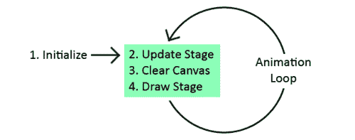

看一下前面的图表。要创建动画，我们首先需要初始化舞台上的对象。我们可以将画布称为“舞台”，因为画布上的移动对象可以看作是舞台上的“演员”。此外，舞台的类比使我们感到画布中的东西正在发生，而不仅仅是静静地坐在那里。一旦我们的对象初始化完成，我们就可以开始一个动画循环，更新舞台，清除画布，重绘舞台，然后请求一个新的动画帧。

由于这种行为可以定义任何类型的动画，所以我们创建一个处理这些步骤的动画类对我们来说是有意义的。

## 操作方法...

按照以下步骤创建一个动画类，该类将支持本章的动画示例：

1.  定义`Animation`构造函数并创建一个跨浏览器的`requestAnimationFrame`方法：

```js
var Animation = function(canvasId){
    this.canvas = document.getElementById(canvasId);
    this.context = this.canvas.getContext("2d");
    this.t = 0;
    this.timeInterval = 0;
    this.startTime = 0;
    this.lastTime = 0;
    this.frame = 0;
    this.animating = false;

    // provided by Paul Irish
    window.requestAnimFrame = (function(callback){
        return window.requestAnimationFrame ||
        window.webkitRequestAnimationFrame ||
        window.mozRequestAnimationFrame ||
        window.oRequestAnimationFrame ||
        window.msRequestAnimationFrame ||
        function(callback){
            window.setTimeout(callback, 1000 / 60);
        };
    })();
};
```

1.  定义`getContext()`方法：

```js
Animation.prototype.getContext = function(){
    return this.context;
};
```

1.  定义`getCanvas()`方法：

```js
Animation.prototype.getCanvas = function(){
    return this.canvas;
};
```

1.  定义`clear()`方法，清除画布：

```js
Animation.prototype.clear = function(){
    this.context.clearRect(0, 0, this.canvas.width, this.canvas.height);
};
```

1.  定义`setStage()`方法，设置`stage()`函数。该函数将为每个动画帧执行：

```js
Animation.prototype.setStage = function(func){
    this.stage = func;
};
```

1.  定义`isAnimating()`方法：

```js
Animation.prototype.isAnimating = function(){
    return this.animating;
};
```

1.  定义`getFrame()`方法，返回帧数：

```js
Animation.prototype.getFrame = function(){
    return this.frame;
};
```

1.  定义`start()`方法，开始动画：

```js
Animation.prototype.start = function(){
    this.animating = true; 
    var date = new Date();
    this.startTime = date.getTime();
    this.lastTime = this.startTime;

    if (this.stage !== undefined) {
        this.stage();
    }

    this.animationLoop();
};
```

1.  定义`stop()`方法，停止动画：

```js
Animation.prototype.stop = function(){
    this.animating = false;
};
```

1.  定义`getTimeInterval()`方法，返回上一帧和当前帧之间的毫秒时间：

```js
Animation.prototype.getTimeInterval = function(){
    return this.timeInterval;
};
```

1.  定义`getTime()`方法，返回动画运行的毫秒时间：

```js
Animation.prototype.getTime = function(){
    return this.t;
};
```

1.  定义`getFps()`方法，返回动画的当前 FPS：

```js
Animation.prototype.getFps = function(){
    return this.timeInterval > 0 ? 1000 / this.timeInterval : 0;
};
```

1.  定义`animationLoop()`方法，处理动画循环：

```js
Animation.prototype.animationLoop = function(){
    var that = this;

    this.frame++;
    var date = new Date();
    var thisTime = date.getTime();
    this.timeInterval = thisTime - this.lastTime;
    this.t += this.timeInterval;
    this.lastTime = thisTime;

    if (this.stage !== undefined) {
        this.stage();
    }

    if (this.animating) {
        requestAnimFrame(function(){
            that.animationLoop();
        });
    }
};
```

## 工作原理...

`Animation`类的思想是通过封装和隐藏动画所需的所有逻辑，简化我们的动画项目，例如提供帧之间的时间间隔，处理动画循环和清除画布。

`Animation`类的关键在于`Animation`构造函数中，我们设置了`window`对象的`requestAnimFrame`方法。这个方法充当了`requestAnimationFrame`的跨浏览器实现，允许用户的浏览器决定动画的最佳 FPS。FPS 是完全动态的，并且会在整个动画过程中发生变化。

我们的`Animation`类还提供了一些方便的方法，比如“getTimeInterval（）”，它返回自上一个动画帧以来的毫秒数，“getTime（）”方法返回动画自启动以来运行的毫秒数，“start（）”方法启动动画，“stop（）”方法停止动画，“clear（）”方法清除画布。

现在我们已经有一个可以投入使用的`Animation`类，本章中的其余动画以及您未来的动画项目都将变得轻而易举。

# 创建线性运动

在这个示例中，我们将通过创建一个简单的线性运动动画来尝试我们的`Animation`类，将一个盒子从画布的左侧移动到右侧：

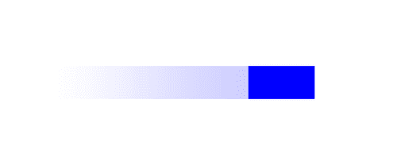

## 如何做…

按照以下步骤将一个盒子从画布的一侧移动到另一侧：

1.  链接到`Animation`类：

```js
<head>
    <script src="img/animation.js">
    </script>
```

1.  实例化一个`Animation`对象并获取画布上下文：

```js
    <script>
        window.onload = function(){
            var anim = new Animation("myCanvas");
            var canvas = anim.getCanvas();
            var context = anim.getContext();
```

1.  定义盒子的线性速度并创建一个包含盒子位置和大小的`box`对象：

```js
            var linearSpeed = 100; // pixels / second
            var box = {
                x: 0,
                y: canvas.height / 2 - 25,
                width: 100,
                height: 50
            };
```

1.  设置“stage（）”函数，更新盒子的位置，清除画布并绘制盒子：

```js
        anim.setStage(function(){
            // update
            var linearDistEachFrame = linearSpeed * this.getTimeInterval() / 1000;

            if (box.x < canvas.width - box.width) {
                box.x += linearDistEachFrame;
            }
            else {
                anim.stop();
            }

            // clear
            this.clear();

            // draw
            context.beginPath();
            context.fillStyle = "blue";
            context.fillRect(box.x, box.y, box.width, box.height);
        });
```

1.  开始动画：

```js
        anim.start();
    };
    </script>
</head>
```

1.  将画布嵌入到 HTML 文档的主体中：

```js
<body>
    <canvas id="myCanvas" width="600" height="250" style="border:1px solid black;">
    </canvas>
</body>
```

## 它是如何工作…

要创建简单的线性运动，首先我们需要实例化一个新的`Animation`对象，然后获取画布和上下文。接下来，我们可以定义盒子的速度，对于这个示例，我们将速度设置为每秒 100 像素，并且可以创建一个包含盒子位置和大小的`box`对象。

现在我们的盒子已经初始化，我们可以定义“stage（）”函数，该函数将在动画循环中执行。对于每个动画循环，我们可以通过首先计算盒子在上一帧和当前帧之间移动的距离，然后通过添加它移动的距离来更新盒子的 x 位置。一旦盒子到达画布的边缘，我们可以通过调用“stop（）”来停止动画。

最后，一旦“stage（）”函数被定义，我们可以使用“start（）”方法开始动画。

## 另请参阅…

+   *在第二章中绘制一个矩形*

# 创建加速度

现在我们已经掌握了动画的基础知识，让我们尝试一些更复杂的东西，通过重力加速一个盒子向下移动。

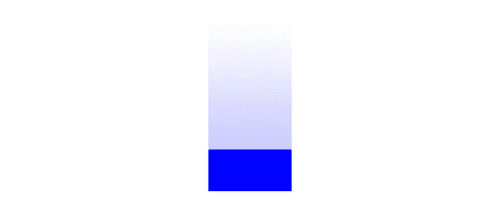

## 如何做…

按照以下步骤在画布顶部绘制一个盒子，由于重力的作用而向下移动：

1.  链接到`Animation`类：

```js
<head>
    <script src="img/animation.js">
    </script>
```

1.  实例化一个`Animation`对象并获取画布上下文：

```js
    <script>
        window.onload = function(){
            var anim = new Animation("myCanvas");
            var canvas = anim.getCanvas();
            var context = anim.getContext();
```

1.  定义重力并创建一个包含盒子位置、x 和 y 速度以及大小的`box`对象：

```js
            var gravity = 2; // pixels / second²
            var box = {
                x: canvas.width / 2 - 50,
                y: 0,
                vx: 0,
                vy: 0,
                width: 100,
                height: 50
            };
```

1.  设置“stage（）”函数，更新盒子，清除画布并绘制盒子：

```js
            anim.setStage(function(){
                // update
        if (this.getTime() > 1000) {
                    var speedIncrementEachFrame = gravity * anim.getTimeInterval() / 1000; // pixels / second
                    box.vy += speedIncrementEachFrame;
                    box.y += box.vy * this.getTimeInterval();

                    if (box.y > canvas.height - box.height) {
                        box.y = canvas.height - box.height;
                        this.stop();
                    }
        }

                // clear
                this.clear();

                // draw
                context.beginPath();
                context.fillStyle = "blue";
                context.fillRect(box.x, box.y, box.width, box.height);
            });
```

1.  开始动画：

```js
            anim.start(); 
        };
    </script>
</head>
```

1.  将画布嵌入到 HTML 文档的主体中：

```js
<body>
    <canvas id="myCanvas" width="600" height="250" style="border:1px solid black;">
    </canvas>
</body>
```

## 它是如何工作的…

要创建加速度，我们可以增加盒子的速度，更新盒子的位置，清除画布，然后绘制盒子。

我们可以通过添加由于重力引起的速度变化来计算盒子每帧的新 y 速度，这被设置为每秒 2 像素/秒²：

```js
var speedIncrementEachFrame = gravity * anim.getTimeInterval() / 1000; // pixels / second
box.vy += speedIncrementEachFrame;
```

接下来，我们可以通过添加自上一帧以来移动的距离来计算框的新 y 位置：

```js
box.y += box.vy * this.getTimeInterval();
```

换句话说，y 位置的变化等于框的速度乘以时间的变化（时间间隔）。

最后，我们可以添加一个条件来检查框是否已经到达画布的底部，如果是，我们可以使用`stop()`方法停止动画。

### 注意

当施加力到一个物体或粒子时，加速度特别有用。一些施加力的例子包括重力、空气阻力、阻尼、地板摩擦和电磁力。对于需要大量物理学的强烈动画，您可能考虑寻找一个开源矢量库，以帮助处理 x 和 y 方向的速度和加速度。

## 另请参阅...

+   在第二章中绘制一个矩形

# 创建振荡

在这个配方中，我们将探讨第三种主要类型的运动——振荡。一些振荡的好例子是挂在弹簧上的弹簧、振荡气泡或来回摆动的摆。

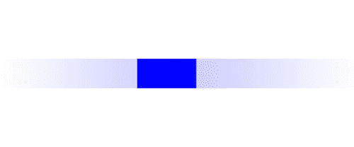

## 如何做...

按照以下步骤来使框来回振荡：

1.  链接到`Animation`类：

```js
<head>
    <script src="img/animation.js">
    </script>
```

1.  实例化一个`Animation`对象并获取画布上下文：

```js
    <script>
        window.onload = function(){
            var anim = new Animation("myCanvas");
            var canvas = anim.getCanvas();
            var context = anim.getContext();
```

1.  创建一个包含框的位置和大小的`box`对象：

```js
            var box = {
                x: 250,
                y: canvas.height / 2 - 25,
                width: 100,
                height: 50
            };
```

1.  定义谐波振荡方程所需的参数：

```js
            var centerX = canvas.width / 2 - box.width / 2;
            var amplitude = 150; // pixels
            var period = 2000; // ms
```

1.  设置`stage()`函数，根据谐波振荡方程更新框的位置，清除画布，然后绘制框：

```js
            anim.setStage(function(){
        // update
        box.x = amplitude * Math.sin(anim.getTime() * 2 * Math.PI / period) + centerX;

        // clear
        this.clear();

        // draw
                context.beginPath();
                context.rect(box.x, box.y, box.width, box.height);
                context.fillStyle = "blue";
                context.fill();
            });
```

1.  开始动画：

```js
            anim.start();
        };
    </script>
</head>
```

1.  将画布嵌入到 HTML 文档的主体中：

```js
<body>
    <canvas id="myCanvas" width="600" height="250" style="border:1px solid black;">
    </canvas>
</body>
```

## 工作原理...

页面加载后，我们可以实例化一个新的`Animation`对象，然后获取画布和上下文。

接下来，我们可以创建一个`box`对象，定义框的位置和大小，然后定义谐波振荡方程所需的变量：

```js
x(t) = A * sin (t * 2π / T + Φ) + x0
```

对于这个配方，我们将振幅`A`设置为`150`，周期`T`设置为`2`秒，偏移`x0`和相位差`Φ`设置为`0`。

对于每个动画帧，我们可以利用谐波振荡方程来更新框的位置，清除画布，然后使用`rect()`方法绘制框。

最后，我们可以使用`start()`方法开始动画。

## 另请参阅...

+   在第二章中绘制一个矩形

# 振荡气泡

在这个配方中，我们将使用谐波振荡和画布变换的原理来创建一个逼真的振荡气泡。

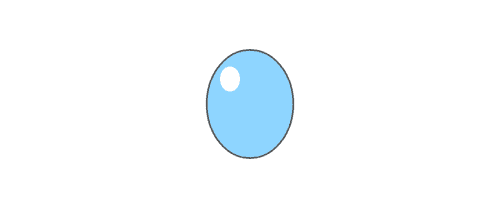

## 如何做...

按照以下步骤创建一个在空中漂浮的逼真的振荡气泡：

1.  链接到`Animation`类：

```js
<head>
    <script src="img/animation.js">
    </script>
```

1.  实例化一个`Animation`对象并获取画布上下文：

```js
    <script>
        window.onload = function(){
            // instantiate new animation object
            var anim = new Animation("myCanvas");
            var context = anim.getContext();
            var canvas = anim.getCanvas();
```

1.  设置`stage()`函数，更新气泡的宽度和高度比例，清除画布，缩放画布上下文，然后绘制气泡：

```js
            anim.setStage(function(){
                // update
                var widthScale = Math.sin(this.getTime() / 200) * 0.1 + 0.9;
                var heightScale = -1 * Math.sin(this.getTime() / 200) * 0.1 + 0.9;

                // clear
                this.clear();

                //draw
                context.beginPath();
                context.save();
                context.translate(canvas.width / 2, canvas.height / 2);
                context.scale(widthScale, heightScale);
                context.arc(0, 0, 65, 0, 2 * Math.PI, false);
                context.restore();
                context.fillStyle = "#8ED6FF";
                context.fill();
                context.lineWidth = 2;
                context.strokeStyle = "#555";
                context.stroke();

                context.beginPath();
                context.save();
                context.translate(canvas.width / 2, canvas.height / 2);
                context.scale(widthScale, heightScale);
                context.arc(-30, -30, 15, 0, 2 * Math.PI, false);
                context.restore();
                context.fillStyle = "white";
                context.fill();
            });
```

1.  开始动画：

```js
            anim.start();
        };
    </script>
</head>
```

1.  将画布标签嵌入到 HTML 文档的主体中：

```js
<body>
    <canvas id="myCanvas" width="600" height="250" style="border:1px solid black;">
    </canvas>
</body>
```

## 工作原理...

在我们讨论振荡气泡之前，首先介绍如何使用画布变换来在 x 和 y 方向上拉伸气泡是一个好主意。要绘制水平拉伸的气泡，我们可以将上下文转换到画布的中心，水平缩放上下文，然后绘制气泡。要绘制垂直拉伸的气泡，我们可以将其转换到画布的中心，垂直缩放上下文，然后绘制气泡。

为了使气泡振荡，我们需要交替改变画布的缩放方向，使水平缩放和垂直缩放始终等于一个常数，在我们的例子中是 1.8，这样气泡的体积保持不变。一旦建立了这种关系，我们就可以使用谐波振荡方程来振荡气泡的 x 和 y 缩放。

当页面首次加载时，我们可以实例化一个新的`Animation`对象并获取画布和上下文。接下来，我们可以设置`stage()`函数，负责更新气泡，清除画布，然后为每个动画帧绘制气泡。为了更新每一帧的气泡，我们可以使用谐波振荡方程来计算气泡的水平和垂直缩放。接下来，我们可以清除画布，然后使用`arc()`方法绘制气泡。

最后，一旦`stage()`函数设置好，我们就可以用`start()`方法开始动画。

## 另请参阅...

+   *在第二章中绘制圆形*

+   *在第四章中缩放画布上下文*

+   *在第四章中将圆形变成椭圆*

# 摆动钟摆

与气泡示例不同，这个示例中的钟摆的宽度和高度不随时间变化，而是钟摆的*角度*随时间变化。

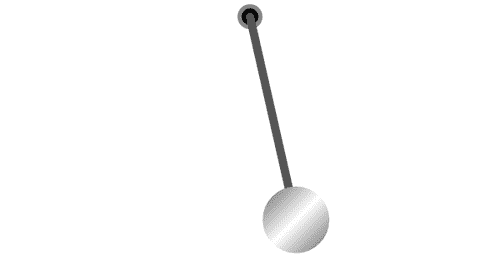

## 如何做...

按照以下步骤来摆动钟摆：

1.  链接到`Animation`类：

```js
<head>
    <script src="img/animation.js">
    </script>
```

1.  实例化一个新的`Animation`对象并获取画布上下文：

```js
    <script>
        window.onload = function(){
            var anim = new Animation("myCanvas");
            var canvas = anim.getCanvas();
            var context = anim.getContext();
```

1.  定义钟摆的属性：

```js
            var amplitude = Math.PI / 4; // 45 degrees
            var period = 4000; // ms
            var theta = 0;
            var pendulumLength = 250;
            var pendulumWidth = 10;
            var rotationPointX = canvas.width / 2;
            var rotationPointY = 20;
```

1.  设置`stage()`函数，更新钟摆的角度，清除画布，然后绘制钟摆：

```js
            anim.setStage(function(){
                // update
                theta = (amplitude * Math.sin((2 * Math.PI * this.getTime()) / period)) + Math.PI / 2;

                // clear
                this.clear();

                // draw top circle
                context.beginPath();
                context.arc(rotationPointX, rotationPointY, 15, 0, 2 * Math.PI, false);
                context.fillStyle = "#888";
                context.fill();

                // draw top inner circle
                context.beginPath();
                context.arc(rotationPointX, rotationPointY, 10, 0, 2 * Math.PI, false);
                context.fillStyle = "black";
                context.fill();

                // draw shaft
                context.beginPath();
                var endPointX = rotationPointX + (pendulumLength * Math.cos(theta));
                var endPointY = rotationPointY + (pendulumLength * Math.sin(theta));
                context.beginPath();
                context.moveTo(rotationPointX, rotationPointY);
                context.lineTo(endPointX, endPointY);
                context.lineWidth = pendulumWidth;
                context.lineCap = "round";
                context.strokeStyle = "#555";
                context.stroke();

                // draw bottom circle
                context.beginPath();
                context.arc(endPointX, endPointY, 40, 0, 2 * Math.PI, false);
                var grd = context.createLinearGradient(endPointX - 50, endPointY - 50, endPointX + 50, endPointY + 50);
                grd.addColorStop(0, "#444");
                grd.addColorStop(0.5, "white");
                grd.addColorStop(1, "#444");
                context.fillStyle = grd;
                context.fill();
            });
```

1.  开始动画：

```js
            anim.start();
        };
    </script>
</head>
```

1.  将画布嵌入 HTML 文档的主体中：

```js
<body>
    <canvas id="myCanvas" width="600" height="330" style="border:1px solid black;">
    </canvas>
</body>
```

## 工作原理...

当页面加载时，我们可以实例化一个新的`Animation`对象，然后获取画布和上下文。接下来，我们可以定义钟摆的属性，包括角振幅、周期、初始角度θ、钟摆长度、宽度和旋转中心。

一旦我们的钟摆初始化完成，我们可以设置`stage()`函数，它将使用谐波振荡方程更新钟摆角度，清除画布，然后立即重新绘制钟摆。

我们可以通过在旋转点绘制一对圆圈，从旋转点到钟摆重物绘制粗线来形成轴，然后在线的末端绘制一个大圆圈，具有漂亮的对角灰色渐变，以营造抛光表面的 illusio。

一旦`stage()`函数设置好，我们就可以用`start()`方法开始动画。

## 另请参阅...

+   *在第一章中绘制直线*

+   *在第二章中绘制圆形*

+   *在第二章中使用自定义形状和填充样式*

# 动画机械齿轮

对于那些懂机械和工程的人，这个是给你们的。在这个示例中，我们将创建一个相互连接的旋转齿轮系统。

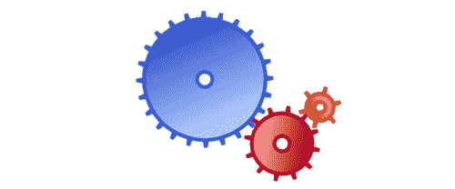

## 如何做...

按照以下步骤来动画一个相互连接的齿轮系统：

1.  链接到`Animation`类：

```js
<head>
    <script src="img/animation.js">
    </script>
```

1.  定义`Gear`类的构造函数：

```js
    <script>
        function Gear(config){
            this.x = config.x;
            this.y = config.y;
            this.outerRadius = config.outerRadius;
            this.innerRadius = config.innerRadius;
            this.holeRadius = config.holeRadius;
            this.numTeeth = config.numTeeth;
            this.theta = config.theta;
            this.thetaSpeed = config.thetaSpeed;
            this.lightColor = config.lightColor;
            this.darkColor = config.darkColor;
            this.clockwise = config.clockwise;
            this.midRadius = config.outerRadius - 10;
        }
```

1.  定义`Gear`类的`draw`方法，绘制`gear`对象：

```js
        Gear.prototype.draw = function(context){
            context.save();
            context.translate(this.x, this.y);
            context.rotate(this.theta);

            // draw gear teeth
            context.beginPath();
            // we can set the lineJoin property to bevel so that the tips
            // of the gear teeth are flat and don't come to a sharp point
            context.lineJoin = "bevel";

            // loop through the number of points to create the gear shape
            var numPoints = this.numTeeth * 2;
            for (var n = 0; n < numPoints; n++) {
                var radius = null;

                // draw tip of teeth on even iterations
                if (n % 2 == 0) {
                    radius = this.outerRadius;
                }
                // draw teeth connection which lies somewhere between
                // the gear center and gear radius
                else {
                    radius = this.innerRadius;
                }

                var theta = ((Math.PI * 2) / numPoints) * (n + 1);
                var x = (radius * Math.sin(theta));
                var y = (radius * Math.cos(theta));

                // if first iteration, use moveTo() to position
                // the drawing cursor
                if (n == 0) {
                    context.moveTo(x, y);
                }
                // if any other iteration, use lineTo() to connect sub paths
                else {
                    context.lineTo(x, y);
                }
            }

            context.closePath();

            // define the line width and stroke color
            context.lineWidth = 5;
            context.strokeStyle = this.darkColor;
            context.stroke();

            // draw gear body
            context.beginPath();
            context.arc(0, 0, this.midRadius, 0, 2 * Math.PI, false);

            // create a linear gradient
            var grd = context.createLinearGradient(-1 * this.outerRadius / 2, -1 * this.outerRadius / 2, this.outerRadius / 2, this.outerRadius / 2);
            grd.addColorStop(0, this.lightColor); 
            grd.addColorStop(1, this.darkColor); 
            context.fillStyle = grd;
            context.fill();
            context.lineWidth = 5;
            context.strokeStyle = this.darkColor;
            context.stroke();

            // draw gear hole
            context.beginPath();
            context.arc(0, 0, this.holeRadius, 0, 2 * Math.PI, false);
            context.fillStyle = "white";
            context.fill();
            context.strokeStyle = this.darkColor;
            context.stroke();
            context.restore();
        };
```

1.  实例化一个`Animation`对象并获取画布上下文：

```js
        window.onload = function(){
            var anim = new Animation("myCanvas");
            var canvas = anim.getCanvas();
            var context = anim.getContext();
```

1.  构建一个`gear`对象的数组：

```js
            var gears = [];

            // add blue gear
            gears.push(new Gear({
                x: 270,
                y: 105,
                outerRadius: 90,
                innerRadius: 50,
                holeRadius: 10,
                numTeeth: 24,
                theta: 0,
                thetaSpeed: 1 / 1000,
                lightColor: "#B1CCFF",
                darkColor: "#3959CC",
                clockwise: false
            }));

            // add red gear
            gears.push(new Gear({
                x: 372,
                y: 190,
                outerRadius: 50,
                innerRadius: 15,
                holeRadius: 10,
                numTeeth: 12,
                theta: 0.14,
                thetaSpeed: 2 / 1000,
                lightColor: "#FF9E9D",
                darkColor: "#AD0825",
                clockwise: true
            }));

            // add orange gear
            gears.push(new Gear({
                x: 422,
                y: 142,
                outerRadius: 28,
                innerRadius: 5,
                holeRadius: 7,
                numTeeth: 6,
                theta: 0.35,
                thetaSpeed: 4 / 1000,
                lightColor: "#FFDD87",
                darkColor: "#D25D00",
                clockwise: false
            }));
```

1.  设置`stage()`函数，更新每个齿轮的旋转，清除画布，然后绘制齿轮：

```js
            anim.setStage(function(){
                // update
                for (var i = 0; i < gears.length; i++) {
                    var gear = gears[i];
                    var thetaIncrement = gear.thetaSpeed * this.getTimeInterval();
                    gear.theta += gear.clockwise ? thetaIncrement : -1 * thetaIncrement;
                }

                // clear
                this.clear();

                // draw
                for (var i = 0; i < gears.length; i++) {
                    gears[i].draw(context);
                }
            });
```

1.  开始动画：

```js
            anim.start();
        };
    </script>
</head>
```

1.  将画布嵌入 HTML 文档的主体中：

```js
<body>
    <canvas id="myCanvas" width="600" height="250" style="border:1px solid black;">
    </canvas>
</body>
```

## 工作原理...

要创建一个旋转齿轮系统，我们可以重用第二章中的齿轮绘制过程，并创建一个`Gear`类，该类具有一些额外的属性，如齿数、颜色、θ和θ速度。`θ`定义了齿轮的角位置，`θSpeed`定义了齿轮的角速度。我们还可以在`Gear`类中添加一个`clockwise`属性，该属性定义了齿轮旋转的方向。

页面加载后，我们可以实例化一个新的`Animation`对象并获取画布和上下文。接下来，我们可以通过实例化`Gear`对象并将其推入齿轮数组来初始化一些齿轮。现在我们的舞台已经初始化，我们可以设置`stage()`函数，该函数将更新每个齿轮的角度，清除画布，然后使用`Gear`类的`draw()`方法绘制每个齿轮。

现在`stage()`函数已经设置好了，我们可以使用`start()`方法开始动画。

## 另请参阅...

+   *绘制一个圆*在第二章中

+   *使用循环创建图案：绘制齿轮*在第二章中

# 时钟动画

对于那些在开发酷炫项目时陷入恍惚状态，时间似乎消失的人，这个是给你的。在这个示例中，我们将创建一个漂亮的动画时钟，以提醒我们网络空间之外的真实世界时间。

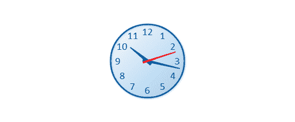

## 如何做...

按照以下步骤在时钟上动画时针、分针和秒针：

1.  链接到`Animation`类：

```js
<head>
    <script src="img/animation.js">
    </script>
```

1.  实例化一个`Animation`对象，获取画布上下文，并定义时钟半径：

```js
    <script>
        window.onload = function(){
            var anim = new Animation("myCanvas");
            var canvas = anim.getCanvas();
            var context = anim.getContext();
            var clockRadius = 75;
```

1.  设置`stage()`函数，该函数获取当前时间，计算时针、分针和秒针的角度，清除画布，然后绘制时钟：

```js
            anim.setStage(function(){

                // update
                var date = new Date();
                var hours = date.getHours();
                var minutes = date.getMinutes();
                var seconds = date.getSeconds();

                hours = hours > 12 ? hours - 12 : hours;

                var hour = hours + minutes / 60;
                var minute = minutes + seconds / 60;

        // clear
        this.clear();

        // draw
                var context = anim.getContext();
                context.save();
                context.translate(canvas.width / 2, canvas.height / 2);

                // draw clock body
                context.beginPath();
                context.arc(0, 0, clockRadius, 0, Math.PI * 2, true);

                var grd = context.createLinearGradient(-clockRadius, -clockRadius, clockRadius, clockRadius);
                grd.addColorStop(0, "#F8FCFF"); // light blue
                grd.addColorStop(1, "#A1CCEE"); // dark blue
                context.fillStyle = grd;
                context.fill();

                // draw numbers  
                context.font = "16pt Calibri";
                context.fillStyle = "#024F8C";
                context.textAlign = "center";
                context.textBaseline = "middle";
                for (var n = 1; n <= 12; n++) {
                    var theta = (n - 3) * (Math.PI * 2) / 12;
                    var x = clockRadius * 0.8 * Math.cos(theta);
                    var y = clockRadius * 0.8 * Math.sin(theta);
                    context.fillText(n, x, y);
                }

                context.save();

                // apply drop shadow
                context.shadowColor = "#bbbbbb";
                context.shadowBlur = 5;
                context.shadowOffsetX = 1;
                context.shadowOffsetY = 1;

                // draw clock rim
                context.lineWidth = 3;
                context.strokeStyle = "#005EA8";
                context.stroke();

                context.restore();

                // draw hour hand
                context.save();
                var theta = (hour - 3) * 2 * Math.PI / 12;
                context.rotate(theta);
                context.beginPath();
                context.moveTo(-10, -4);
                context.lineTo(-10, 4);
                context.lineTo(clockRadius * 0.6, 1);
                context.lineTo(clockRadius * 0.6, -1);
                context.fill();
                context.restore();

                // minute hand
                context.save();
                var theta = (minute - 15) * 2 * Math.PI / 60;
                context.rotate(theta);
                context.beginPath();
                context.moveTo(-10, -3);
                context.lineTo(-10, 3);
                context.lineTo(clockRadius * 0.9, 1);
                context.lineTo(clockRadius * 0.9, -1);
                context.fill();
                context.restore();

                // second hand
                context.save();
                var theta = (seconds - 15) * 2 * Math.PI / 60;
                context.rotate(theta);
                context.beginPath();
                context.moveTo(-10, -2);
                context.lineTo(-10, 2);
                context.lineTo(clockRadius * 0.8, 1);
                context.lineTo(clockRadius * 0.8, -1);
                context.fillStyle = "red";
                context.fill();
                context.restore();

                context.restore();
            });
```

1.  开始动画：

```js
            anim.start();
        };
    </script>
</head>
```

1.  将画布嵌入到 HTML 文档的主体中：

```js
<body>
    <canvas id="myCanvas" width="600" height="250" style="border:1px solid black;">
    </canvas>
</body>
```

## 工作原理...

页面加载时，我们可以实例化一个新的`Animation`对象，然后获取画布和上下文。接下来，我们可以开始定义`stage()`函数，该函数负责更新时钟、清除画布，然后为每个动画循环绘制时钟。

在代码的更新部分，我们可以实例化一个新的`Date()`对象，然后获取小时、分钟和秒。接下来，我们可以调整小时和分钟，以表示 12 小时制时间（上午和下午）。

清除画布后，我们可以开始绘制时钟：

+   使用`translate()`方法将画布上下文转换到画布的中心

+   使用`arc()`方法绘制主体

+   创建一个循环，使用`fillText()`方法在边缘绘制时钟的数字

+   使用`shadowOffsetX`和`shadowOffsetY`属性应用阴影

+   通过`stroke()`方法描绘时钟边缘

+   通过旋转画布上下文并绘制一个最厚的梯形来绘制每个时钟指针，其最厚的一端位于中心。

最后，一旦`stage()`函数设置好了，我们就可以使用`start()`方法开始动画。

## 另请参阅...

+   *使用文本*在第一章

+   *绘制一个圆*在第二章中

+   *使用自定义形状和填充样式*在第二章中

# 模拟粒子物理学

现在我们已经介绍了古典物理学的基础知识，让我们把它们整合起来。在这个示例中，我们将通过模拟重力、边界条件、碰撞阻尼和地板摩擦来模拟粒子物理学。

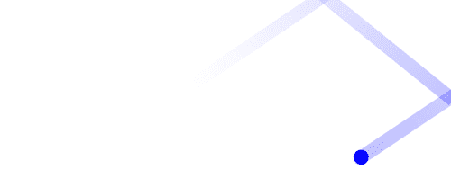

## 如何做...

按照以下步骤在画布内启动一个粒子，并观察它在墙上弹跳、逐渐因重力落到地板上，然后因地板摩擦而减速停止的弹道：

1.  链接到`Animation`类：

```js
<head>
    <script src="img/animation.js">
    </script>
```

1.  定义`applyPhysics()`函数，它以粒子作为输入，并根据重力、碰撞阻尼和地板摩擦等物理变量更新其位置和速度：

```js
        function applyPhysics(anim, particle){
            // physics globals
            var gravity = 1500; // pixels / second²
            var collisionDamper = 0.8; // 80% velocity lost when collision occurs
            var floorFriction = 100; // pixels / second²
            var timeInterval = anim.getTimeInterval();
            var canvas = anim.getCanvas();

            // gravity
            particle.vy += gravity * timeInterval / 1000;

            // position
            particle.y += particle.vy * timeInterval / 1000;
            particle.x += particle.vx * timeInterval / 1000;

            // floor condition
            if (particle.y > (canvas.height - particle.radius)) {
                particle.y = canvas.height - particle.radius;
                particle.vy *= -1;
                particle.vy *= collisionDamper;
            }

            // floor friction
            if (particle.y == canvas.height - particle.radius) {
                if (particle.vx > 0.1) {
                    particle.vx -= floorFriction * timeInterval / 1000;
                }
                else if (particle.vx < -0.1) {
                    particle.vx += floorFriction * timeInterval / 1000;
                }
                else {
                    particle.vx = 0;
                }
            }

            // ceiling  condition
            if (particle.y < (particle.radius)) {
                particle.y = particle.radius;
                particle.vy *= -1;
                particle.vy *= collisionDamper;
            }

            // right wall condition
            if (particle.x > (canvas.width - particle.radius)) {
                particle.x = canvas.width - particle.radius;
                particle.vx *= -1;
                particle.vx *= collisionDamper;
            }

            // left wall condition
            if (particle.x < (particle.radius)) {
                particle.x = particle.radius;
                particle.vx *= -1;
                particle.vx *= collisionDamper;
            }
        }
```

1.  实例化一个新的`Animation`对象并获取画布上下文：

```js
        window.onload = function(){
            var anim = new Animation("myCanvas");
            var canvas = anim.getCanvas();
            var context = anim.getContext();
```

1.  使用位置、x 和 y 速度以及半径初始化一个`particle`对象：

```js
            var particle = {
                x: 10,
                y: canvas.height - 10,
                vx: 600, // px / second
                vy: -900, // px / second
                radius: 10
            };
```

1.  设置`stage()`函数，通过将其传递给`applyPhysics()`函数来更新粒子，清除画布，然后绘制粒子：

```js
            anim.setStage(function(){
                // update
                applyPhysics(this, particle);

                // clear
                this.clear();

                // draw 
                context.beginPath();
                context.arc(particle.x, particle.y, particle.radius, 0, 2 * Math.PI, false);
                context.fillStyle = "blue";
                context.fill();
            });
```

1.  开始动画：

```js
            anim.start();
        };
    </script>
</head>
```

1.  在 HTML 文档的 body 内嵌入画布标签：

```js
<body>
    <canvas id="myCanvas" width="600" height="250" style="border:1px solid black;">
    </canvas>
</body>
```

## 工作原理...

模拟粒子物理学，我们需要处理每一帧粒子的 x 和 y 位置以及粒子在 x 和 y 方向的速度。理解粒子物理模拟的关键是要记住，粒子在系统中的运动是基于作用在粒子上的所有力的总和。在我们的情况下，重力将使粒子向下移动，与墙壁、天花板和地板的碰撞将根据碰撞阻尼常数减少粒子的速度，地板摩擦将在粒子在地板上滚动时减少其水平速度。

首先，当页面加载时，我们可以实例化一个新的`Animation`对象，然后获取画布和上下文。接下来，我们可以初始化一个具有位置、初始速度和大小的粒子。现在我们已经在舞台上初始化了演员（粒子），我们可以设置`stage()`函数，该函数将更新粒子，清除画布，然后为每个动画帧绘制粒子。

更新逻辑发生在`applyPhysics()`函数内，该函数接收对`Animation`对象的引用，以及`particle`对象。`applyPhysics()`函数遍历一系列条件，更新粒子的位置和速度。

在调用`applyPhysics()`函数并更新粒子后，我们可以清除画布，然后通过绘制一个简单的圆来绘制粒子，其半径等于粒子的半径。

最后，一旦`stage()`函数被设置，我们可以使用`start()`方法开始动画。

## 还有更多...

如果你真的想要变得花哨，甚至可以添加额外的力，比如空气阻力。作为一个经验法则，你添加到粒子模拟中的力越多，它就越像真实的生命。你可以尝试不同的初始位置和速度，看看不同的抛射路径。

## 另请参阅...

+   *在第二章中绘制一个圆形*

# 创建微观生命形式

你是否曾在显微镜中看到微生物，并观察它们如何摇摆？这个配方受到微生物的外星世界的启发。在这个配方中，我们将创建 100 个随机微生物，并让它们在画布上自由移动。

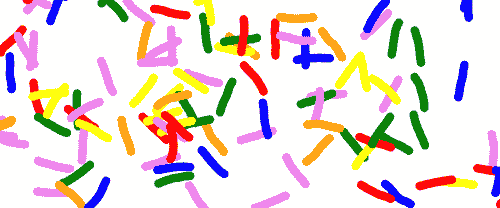

## 操作步骤...

按照以下步骤在画布内创建摇摆的微生物：

1.  链接到`Animation`类：

```js
<head>
    <script src="img/animation.js">
    </script>
```

1.  定义`getRandColor()`函数，返回一个随机颜色：

```js
    <script>
        function getRandColor(){
            var colors = ["red", "orange", "yellow", "green", "blue", "violet"];
            return colors[Math.floor(Math.random() * colors.length)];
        }
```

1.  定义`getRandTheta()`函数，返回一个随机角度：

```js
        function getRandTheta(){
            return Math.random() * 2 * Math.PI;
        }
```

1.  定义`updateMicrobes()`函数，通过为每个微生物添加一个新的头部段并生成随机角度，然后移除尾部段来更新`microbe`对象：

```js
        function updateMicrobes(anim, microbes){
            var canvas = anim.getCanvas();
            var angleVariance = 0.2;

            for (var i = 0; i < microbes.length; i++) {
                var microbe = microbes[i];
                var angles = microbe.angles;

        /*
         * good numNewSegmentsPerFrame values:
         * 60fps -> 1
         * 10fps -> 10 
         * 
         * for a linear relationship, we can use the equation:
         * n = mf + b, where n = numNewSegmentsPerFrame and f = FPS
         * solving for m and b, we have:
         * n = (-0.18)f + 11.8
         */
                var numNewSegmentsPerFrame = Math.round(-0.18 * anim.getFps() + 11.8);

                for (var n = 0; n < numNewSegmentsPerFrame; n++) {
                    // create first angle if no angles
                    if (angles.length == 0) {
                        microbe.headX = canvas.width / 2;
                        microbe.headY = canvas.height / 2;
                        angles.push(getRandTheta());
                    }

                    var headX = microbe.headX;
                    var headY = microbe.headY;
                    var headAngle = angles[angles.length - 1];

                    // create new head angle
                    var dist = anim.getTimeInterval() / (10 * numNewSegmentsPerFrame);
                    // increase new head angle by an amount equal to
                    // -0.1 to 0.1
                    var newHeadAngle = headAngle + ((angleVariance / 2) - Math.random() * angleVariance);
                    var newHeadX = headX + dist * Math.cos(newHeadAngle);
                    var newHeadY = headY + dist * Math.sin(newHeadAngle);

                    // change direction if collision occurs
                    if (newHeadX >= canvas.width || newHeadX <= 0 || newHeadY >= canvas.height || newHeadY <= 0) {
                        newHeadAngle += Math.PI / 2;
                        newHeadX = headX + dist * Math.cos(newHeadAngle);
                        newHeadY = headY + dist * Math.sin(newHeadAngle);
                    }

                    microbe.headX = newHeadX;
                    microbe.headY = newHeadY;
                    angles.push(newHeadAngle);

                    // remove tail angle
                    if (angles.length > 20) {
                        angles.shift();
                    }
                }
            }
        }
```

1.  定义`drawMicrobes()`函数来绘制所有的微生物：

```js
        function drawMicrobes(anim, microbes){
            var segmentLength = 2; // px
            var context = anim.getContext();

            for (var i = 0; i < microbes.length; i++) {
                var microbe = microbes[i];

                var angles = microbe.angles;
                context.beginPath();
                context.moveTo(microbe.headX, microbe.headY);

                var x = microbe.headX;
                var y = microbe.headY;

                // start with the head and end with the tail
                for (var n = angles.length - 1; n >= 0; n--) {
                    var angle = angles[n];

                    x -= segmentLength * Math.cos(angle);
                    y -= segmentLength * Math.sin(angle);
                    context.lineTo(x, y);
                }

                context.lineWidth = 10;
                context.lineCap = "round";
                context.lineJoin = "round";
                context.strokeStyle = microbe.color;
                context.stroke();
            }
        }
```

1.  实例化一个`Animation`对象并获取画布上下文：

```js
        window.onload = function(){
            var anim = new Animation("myCanvas");
            var canvas = anim.getCanvas();
            var context = anim.getContext();
```

1.  初始化 100 个微生物：

```js
            // init microbes
            var microbes = [];
            for (var n = 0; n < 100; n++) {
                // each microbe will be an array of angles
                microbes[n] = {
                    headX: 0,
                    headY: 0,
                    angles: [],
                    color: getRandColor()
                };
            }
```

1.  设置`stage()`函数，通过调用`updateMicrobes()`函数来更新微生物，清除画布，然后通过调用`drawMicrobes()`函数来绘制微生物：

```js
            anim.setStage(function(){
                // update
                updateMicrobes(this, microbes);

                // clear
                this.clear();

                // draw
                drawMicrobes(this, microbes);
            });
```

1.  开始动画：

```js
            anim.start();
        };
    </script>
</head>
```

1.  在 HTML 文档的 body 内嵌入画布：

```js
<body>
    <canvas id="myCanvas" width="600" height="250" style="border:1px solid black;">
    </canvas>
</body>
```

## 工作原理...

要创建一个微生物，我们可以绘制一系列连接的段，以创建一个类似蛇的短生物。我们可以将微生物表示为一个包含头部位置和角度数组的对象。这些角度表示段之间的角度。

这个示例初始化了 100 个随机化的微生物，并将它们放在画布的中心。我们的`stage()`函数包含`updateMicrobes()`和`drawMicrobes()`函数。

`updateMicrobes()`函数循环遍历所有微生物对象，为每个微生物添加一个新的头部段，并删除每个微生物的尾部段。这样，每个微生物的段在移动时会摆动。当微生物的头部碰到画布的边缘时，它的角度将增加 90 度，以便它反弹回画布区域。

`drawMicrobes()`函数循环遍历所有`microbe`对象，将绘图光标定位在每个微生物的头部，然后根据每个段的角度绘制 20 条线段。

## 另请参阅...

+   在第一章中绘制螺旋

+   在第六章中创建一个绘图应用程序

# 强调画布并显示 FPS

在看到上一个示例之后，你可能会想“我们可以动画化多少微生物？”这个问题的直接答案是肯定的。由于 HTML5 画布的 2D 上下文不是硬件加速的，而且我们的动画纯粹由 JavaScript 驱动，所以肯定有一个点，当浏览器加班工作时，它会开始变得吃力。为了说明这一点，我们可以绘制我们动画的 FPS，并观察屏幕上微生物数量与 FPS 值之间的关系。

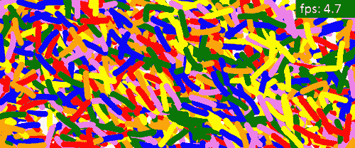

## 如何做...

按照以下步骤来强调画布并显示 FPS：

1.  链接到`Animation`类：

```js
<head>
    <script src="img/animation.js">
    </script>
```

1.  定义`drawFps()`函数，在画布的右上角绘制 FPS 值：

```js
        function drawFps(anim, fps){
            var canvas = anim.getCanvas();
            var context = anim.getContext();

            context.fillStyle = "black";
            context.fillRect(canvas.width - 100, 0, 100, 30);

            context.font = "18pt Calibri";
            context.fillStyle = "white";
            context.fillText("fps: " + fps.toFixed(1), canvas.width - 93, 22);
        }
```

1.  定义`getRandColor()`函数，返回一个随机颜色：

```js
    <script>
        function getRandColor(){
            var colors = ["red", "orange", "yellow", "green", "blue", "violet"];
            return colors[Math.floor(Math.random() * colors.length)];
        }
```

1.  定义`getRandTheta()`函数，返回一个随机的θ：

```js
        function getRandTheta(){
            return Math.random() * 2 * Math.PI;
        }
```

1.  定义`updateMicrobes()`函数，通过为每个微生物添加一个具有随机生成角度的新头部段来更新`microbe`对象，然后删除尾部段：

```js
        function updateMicrobes(anim, microbes){
            var canvas = anim.getCanvas();
            var angleVariance = 0.2;

            for (var i = 0; i < microbes.length; i++) {
                var microbe = microbes[i];
                var angles = microbe.angles;

                /*
              * good numNewSegmentsPerFrame values:
              * 60fps -> 1
              * 10fps -> 10 
              * 
              * for a linear relationship, we can use the equation:
              * n = mf + b, where n = numNewSegmentsPerFrame and f = FPS
              * solving for m and b, we have:
              * n = (-0.18)f + 11.8
              */

                var numNewSegmentsPerFrame = Math.round(-0.18 * anim.getFps() + 11.8);

                for (var n = 0; n < numNewSegmentsPerFrame; n++) {
                    // create first angle if no angles
                    if (angles.length == 0) {
                        microbe.headX = canvas.width / 2;
                        microbe.headY = canvas.height / 2;
                        angles.push(getRandTheta());
                    }

                    var headX = microbe.headX;
                    var headY = microbe.headY;
                    var headAngle = angles[angles.length - 1];

                    // create new head angle
                    var dist = anim.getTimeInterval() / (10 * numNewSegmentsPerFrame);
                    // increase new head angle by an amount equal to
                    // -0.1 to 0.1
                    var newHeadAngle = headAngle + ((angleVariance / 2) - Math.random() * angleVariance);
                    var newHeadX = headX + dist * Math.cos(newHeadAngle);
                    var newHeadY = headY + dist * Math.sin(newHeadAngle);

                    // change direction if collision occurs
                    if (newHeadX >= canvas.width || newHeadX <= 0 || newHeadY >= canvas.height || newHeadY <= 0) {
                        newHeadAngle += Math.PI / 2;
                        newHeadX = headX + dist * Math.cos(newHeadAngle);
                        newHeadY = headY + dist * Math.sin(newHeadAngle);
                    }

                    microbe.headX = newHeadX;
                    microbe.headY = newHeadY;
                    angles.push(newHeadAngle);

                    // remove tail angle
                    if (angles.length > 20) {
                        angles.shift();
                    }
                }
            }
        }
```

1.  定义`drawMicrobes()`函数，绘制所有的微生物：

```js
        function drawMicrobes(anim, microbes){
            var segmentLength = 2; // px
            var context = anim.getContext();

            for (var i = 0; i < microbes.length; i++) {
                var microbe = microbes[i];

                var angles = microbe.angles;
                context.beginPath();
                context.moveTo(microbe.headX, microbe.headY);

                var x = microbe.headX;
                var y = microbe.headY;

                // start with the head and end with the tail
                for (var n = angles.length - 1; n >= 0; n--) {
                    var angle = angles[n];

                    x -= segmentLength * Math.cos(angle);
                    y -= segmentLength * Math.sin(angle);
                    context.lineTo(x, y);
                }

                context.lineWidth = 10;
                context.lineCap = "round";
                context.lineJoin = "round";
                context.strokeStyle = microbe.color;
                context.stroke();
            }
        }
```

1.  实例化一个`Animation`对象并获取画布上下文：

```js
        window.onload = function(){
            var anim = new Animation("myCanvas");
            var canvas = anim.getCanvas();
            var context = anim.getContext();
```

1.  初始化 1,500 个微生物：

```js
            // init microbes
            var microbes = [];
            for (var n = 0; n < 1500; n++) {
                // each microbe will be an array of angles
                microbes[n] = {
                    headX: 0,
                    headY: 0,
                    angles: [],
                    color: getRandColor()
                };
            }
```

1.  设置`stage()`函数，该函数更新微生物，每 10 帧更新一次 FPS 值，清除画布，然后绘制微生物和 FPS 值：

```js
            var fps = 0;

            anim.setStage(function(){
                // update
                updateMicrobes(this, microbes);

                if (anim.getFrame() % 10 == 0) {
                    fps = anim.getFps();
                }

                // clear
                this.clear();

                // draw
                drawMicrobes(this, microbes);
                drawFps(this, fps);
            });
```

1.  开始动画：

```js
            anim.start();
        };
    </script>
</head>
```

1.  将画布嵌入到 HTML 文档的主体中：

```js
<body>
    <canvas id="myCanvas" width="600" height="250" style="border:1px solid black;">
    </canvas>
</body>

```

## 它是如何工作的...

为了绘制动画的 FPS，我们可以创建`drawFps()`函数，该函数以 FPS 值作为输入，绘制画布右上角的黑色框，然后写出 FPS 值。为了避免过于频繁地更新 FPS，我们可以将 FPS 值的副本存储在变量`FPS`中，并在每 10 帧更新一次。这样，FPS 最多每秒更新 6 次。

为了强调画布，我们可以简单地初始化更多的微生物。在这个示例中，我们初始化了 1,500 个微生物。如果你自己尝试这段代码，你可以尝试不同的数字，看看 FPS 如何受到影响。

## 还有更多...

如前所述，典型的动画应该以大约 40 到 60 FPS 运行。如果 FPS 低于 30，你会开始注意到动画有轻微的延迟。在 32 位 Windows 7 机器上使用 Google Chrome 进行测试，配备 2.2 GHz AMD 处理器和 2 GB RAM（是的，我知道，我需要升级），当我在动画 1,500 个微生物时，我看到大约 5 FPS。看起来不错，但也不是很好。当动画 2,000 个或更多的微生物时，动画开始看起来不可接受地卡顿。

我们使用 2D 上下文创建的几乎所有动画在台式机和笔记本电脑上表现良好。然而，如果您发现自己处于一个情况，您的动画在 2D 上下文中的计算开销足够大，以至于表现不佳，您可能会考虑改用 WebGL（我们将在第九章中介绍 WebGL，*WebGL 简介*）。与 2D 上下文不同，WebGL 利用硬件加速。在撰写本文时，所有主要浏览器中的 2D 上下文都不利用硬件加速。然而，使用 WebGL 确实会带来成本，因为开发和维护 WebGL 动画要比创建 2D 上下文动画困难得多。

## 另请参阅...

+   在第一章中处理文本

+   在第一章中绘制螺旋线

+   在第六章中创建绘图应用程序
